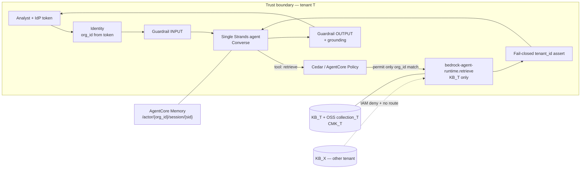

# Solution design — tenant-isolated portfolio RAG

## TL;DR

**One Strands agent** on **AgentCore Runtime**. It summarizes only what a
**`retrieve` tool** returns. Isolation is **not** a metadata filter.

- **Vector store:** one **OpenSearch Serverless collection + one Bedrock
  Knowledge Base per corporate customer** (silo). S3 Vectors is the cost-down
  alternative when tenant count makes the OSS OCU floor unbearable
  **[re-verify]**. A shared index (OpenSearch, Pinecone namespace, or pgvector
  table) with a filter is **logical isolation**, not absolute.
- **RAG path:** ingest stamps `tenant_id` from the authenticated uploader, never
  from document text. Query injects the tenant from the **IdP token**. Use
  `retrieve` (not `retrieve_and_generate`). **Fail closed:** drop any chunk
  whose metadata `tenant_id` ≠ session tenant; if the filter was omitted, return
  zero chunks.
- **Guardrail / Cedar:** Bedrock Guardrails on model I/O (PII, prompt-attack,
  contextual grounding). **Cedar on the retrieve tool** —
  `toolParameters.org_id == principal.orgId`
  (`cases/aws-ai/ch07.md:830-841`). Guardrails cannot see tool calls and have
  no user context (`cases/aws-ai/ch07.md:753-758`).
- **IAM:** session policy scoped to *that* tenant's KB ARN + S3 prefix; KMS
  `kms:ViaService` on the tenant CMK (`cases/aws-ai/ch08.md:49-79`); PrivateLink
  + `aws:sourceVpce` (`cases/aws-ai/ch08.md:82`, `ch08.md:422`). Two resource
  ARNs for the model (`foundation-model/*` **and** `inference-profile/*`).

Design-time only. No AWS calls. Binding: `.aws-ai/binding.toml`. Assess:
`.aws-ai/assess/portfolio-summarizer/capability-brief.md`.

---

## 1. Topology — why not one agent?

A portfolio summarizer is retrieve → ground → write. It hits **none** of the
three walls that justify multi-agent (`cases/aws-ai/ch04.md:614-618`): the
context window does not overflow if retrieval is tenant-scoped and top-k is
small; there is no real parallelism; summarization expertise fits one prompt.

**Pick:** single Strands agent, several focused tools (retrieve, maybe
"list holdings in scope"), host = AgentCore Runtime so Cedar is native
(`cases/aws-ai/ch07.md:787-810`). Who decides the path: the model, inside one
agent. Sync request/response.

**Losing alternative — multi-agent supervisor/Swarm.** Rebuilds a working
single agent as coordinating ones; typically triples latency and multiplies
failure points (`cases/aws-ai/ch04.md:610-612`). Named antipattern:
*Accidental multi-agent*. Graph/DAG only if a later compliance approval chain
appears.



---

## 2. Knowledge and memory

### 2.1 The isolation rule

Semantic search is nearest-neighbor over **whatever vectors the query can
see**. A shared index plus `filter: tenant_id = X` is an application promise.
Omit the filter, let the model supply `tenant_id`, or hit a parser bug, and
the neighbor set is the **entire** book. That cannot "guarantee absolute"
isolation.

**Absolute** here means: the retrieval principal **cannot** address another
tenant's vectors — not "we usually remember to filter."

### 2.2 Vector-store choice (cost / scale / isolation)

| Store | Isolation you actually get | Trade-off |
|---|---|---|
| **OpenSearch Serverless — one collection per tenant** (pick) | Separate collection, encryption, and IAM resource. Query against KB_T cannot see KB_X | Mature hybrid search; idle **2-OCU floor ~$345/mo per collection [re-verify]** (`docs/research/aws-ai-bedrock-sagemaker-research.md` §1.6). Isolation tax scales with tenant count |
| **S3 Vectors — one index/bucket per tenant** | Same silo idea, cheaper idle (**~90% under OSS floor [re-verify]**) | Newer (GA Dec 2025 [re-verify]); fewer search features than OSS |
| **Aurora pgvector — one database or schema per tenant** | Strong if you already live in Aurora; RLS as defense-in-depth | Co-locates with relational holdings; you operate the cluster; easy to "just use one table + WHERE" |
| **Pooled OSS / Pinecone / pgvector + metadata filter** | Logical only. Correctness lever, not a guarantee | Cheapest at high tenant count; one missed filter is a leak |
| **Pinecone (shared index, namespace per tenant)** | Namespace is a logical partition; data leaves the AWS account unless you add a separate trust review | Fast, familiar; **wrong trust boundary** for "absolute" on a financial client unless Pinecone is an already-approved vendor *and* you still silo API keys |

**Pick:** siloed **OpenSearch Serverless + Bedrock KB per tenant**. Re-open S3
Vectors if tenant count makes the OCU floor the real budget. Do not pick
Pinecone as the isolation mechanism.

Metadata on every chunk (ingest-time, immutable, from identity — not from the
PDF):

| Tag | Why |
|---|---|
| `tenant_id` / `org_id` | Hard isolation key; must match the token |
| `doc_class` | holdings / IPS / statement |
| `as_of_date` | prevent stale-statement bleed inside the tenant |
| `jurisdiction` | same correctness lever as regulated corpora (`aws-ai-design` knowledge step) |

Filtering is still **first-class** *inside* the silo (date, doc class). It is
**not** the wall *between* silos.

### 2.3 RAG pipeline (isolation at each step)

```mermaid
flowchart TB
  subgraph ingest["Ingest — writer identity"]
    UP[Upload via authenticated API] --> STAMP[Stamp tenant_id from token<br/>reject client-supplied tenant_id]
    STAMP --> S3["s3://portfolios/{org_id}/..."]
    S3 --> CHUNK[KB ingest: SEMANTIC or FIXED_SIZE]
    CHUNK --> EMB[Titan embed — same dims at query]
    EMB --> IDX[OSS collection_T / KB_T]
  end
  subgraph query["Query — reader identity"]
    TOK[IdP token → org_id] --> BIND[Bind KB_T + session IAM]
    BIND --> FILT["retrieve + filter tenant_id == org_id"]
    FILT --> ASSERT[Drop any chunk with mismatched metadata<br/>empty set if filter missing]
    ASSERT --> CONV[Converse + citations + grounding]
  end
```



1. **Ingest.** Writer identity chooses the prefix and the KB. A document that
   claims "I am tenant X" in its text does not change `tenant_id`.
2. **Index.** Embeddings consistent at write and read (`bedrock.md` §7).
   Chunking: `SEMANTIC` or `FIXED_SIZE` — design choice, re-verify quality;
   not an isolation lever.
3. **Retrieve.** `bedrock-agent-runtime.retrieve` with
   `vectorSearchConfiguration` (hybrid + top-k) **and** a metadata filter
   bound in application code (`bedrock.md` §5;
   `docs/research/aws-ai-bedrock-sagemaker-research.md` §1.6). The agent tool
   does **not** take `org_id` or `knowledgeBaseId` from the model.
4. **Fail closed.** Before chunks enter the prompt, assert
   `chunk.metadata.tenant_id == session.org_id`. Mismatch or missing tag →
   discard. If the filter configuration is absent, return **no** context and
   refuse to summarize — do not "search the world."
5. **Generate.** Your Converse call, citations surfaced
   (`citations[] → retrievedReferences[] → content.text` + `location`,
   `cases/aws-ai/ch09.md:656-683`). An un-cited summary is indistinguishable
   from a hallucination.
6. **Do not use** `retrieve_and_generate` on the isolation path: it owns
   generation and makes the post-retrieve assert harder. It remains a
   convenience API for non-tenant prototypes.

**Losing alternative — pooled index + metadata filter only.** Cheaper. The
characteristic that sinks it: one omitted `filterConfiguration` is a
cross-tenant semantic search. Named antipattern: *Pooled-index-as-isolation*.

**Losing alternative — `retrieve_and_generate` as the product path.** Faster to
demo; you lose the fail-closed inspectability that financial isolation needs.

### 2.4 Memory

Conversation memory is a second leak surface (prompt: "use the other client's
preferences" — `cases/aws-ai/ch03.md:371`).

AgentCore Memory namespaces (`cases/aws-ai/ch03.md:553-562`;
`../aws-ai-lifecycle/references/agents.md` §4.3):

| Namespace | Use |
|---|---|
| `/actor/{org_id}` | long-term facts for that corporate customer only |
| `/session/{session_id}` | this analyst turn |
| `/` global | **empty** — no shared semantic memory across tenants |

Configure a strategy or long-term memory is silently not extracted
(`cases/aws-ai/ch03.md:563-572`). Actor id = authenticated `org_id`, never a
name the user typed.

---

## 3. Tool and integration seams

Atomic contract: focused `@tool` + type hints + docstring as selection prompt
(`cases/aws-ai/ch02.md:89-104`).

| Tool | What the model may pass | What the runtime binds |
|---|---|---|
| `retrieve_portfolio` | `query: str` only | `org_id`, `knowledgeBaseId`, metadata filter |
| `summarize_with_citations` | optional style hint | already-checked chunks only |

`org_id` / `knowledgeBaseId` are **not** tool parameters. If they appear in
the schema, the model can be prompt-injected into another tenant
(`cases/aws-ai/ch07.md:841`).

- Local `@tool` for retrieve (this capability is ours).
- MCP only if a second client must share the same retrieve server — then the
  MCP host must bind tenant the same way.
- **`use_aws` is off.** It inherits the execution role
  (`cases/aws-ai/ch02.md:384-416`); a finance agent must not speak AWS CLI.

---

## 4. Guardrail and Cedar placement

Two controls, two layers — they do not overlap
(`cases/aws-ai/ch07.md:845-856`).

| Layer | Where | What it stops | What it cannot stop |
|---|---|---|---|
| **Bedrock Guardrails** | Converse `guardrailConfig` on input and output (`cases/aws-ai/ch07.md:764-781`) | PII in the summary, prompt-attack, denied topics (e.g. "trade advice"), **contextual grounding** vs retrieved chunks (`cases/aws-ai/ch08.md:541-542`, `ch08.md:601`) | Tool calls; "this user may only see org A" (`cases/aws-ai/ch07.md:753-758`) |
| **Cedar / AgentCore Policy** | Before every tool dispatch | `query_database` / `retrieve_portfolio` unless `context.toolParameters.org_id == principal.orgId` (`cases/aws-ai/ch07.md:830-841`) | Hallucinated text (that is the guardrail) |

Host is AgentCore Runtime → **AgentCore Policy**. If the host later moves to
Lambda/ECS, same Cedar language via **Amazon Verified Permissions**
`is_authorized` before dispatch — do not default to AgentCore Policy on a
Lambda host.

Grounding: pass retrieved context as `guardContent` with
`qualifiers: ["grounding_source"]` and the question as `["query"]`
(`bedrock.md` §6). Thresholds (e.g. 0.70) are **[re-verify]** at eval time.

Cedar sketch (identity from the token, not the chat):

```cedar
forbid (
    principal,
    action == Action::"InvokeTool",
    resource == Tool::"retrieve_portfolio"
)
unless {
    context.toolParameters.org_id == principal.orgId
};
```

No amount of prompt injection bypasses this if `principal.orgId` is the
authenticated claim (`cases/aws-ai/ch07.md:841`).

---

## 5. IAM, KMS, PrivateLink

**Least privilege, designed now.**

- **Per-request session policy** (STS / AgentCore Identity):
  `bedrock:Retrieve` (and ingest-time `StartIngestionJob` on a *writer* role)
  on `arn:aws:bedrock:…:knowledge-base/KB_T` only. No
  `AmazonBedrockFullAccess` (`cases/aws-ai/ch08.md:425`). Split writer vs
  reader roles (`cases/aws-ai/ch08.md:443`).
- **Model invoke:** both `foundation-model/*` and `inference-profile/*`
  (`cases/aws-ai/ch06.md:72-81`). Resource segment is a
  **pattern** (`inference-profile/us.anthropic.claude-*`), not a pinned id.
- **S3:** `s3:GetObject` on `s3://portfolios/${aws:PrincipalTag/org_id}/*`
  (ABAC) — never `s3://portfolios/*`.
- **KMS:** one CMK per tenant (or per-tenant encryption context). Key policy
  allows Bedrock `kms:GenerateDataKey` / `kms:Decrypt` only with
  `kms:ViaService` = `bedrock.{region}.amazonaws.com`
  (`cases/aws-ai/ch08.md:49-79`).
- **Network:** PrivateLink interface endpoints for Bedrock + OSS; IAM
  `aws:sourceVpce` so calls that did not arrive through the endpoint are
  **rejected** (`cases/aws-ai/ch08.md:82`, `ch08.md:422`;
  `boto3-foundations.md` §4).
- **No `use_aws`.** Execution role is retrieve + Converse + that tenant's KMS,
  nothing else.

Bedrock does not train foundation models on prompts or KB data
(`cases/aws-ai/ch08.md:84`, `ch08.md:113`); that is AWS-account isolation, not
*your* tenant isolation. You still owe the silo.

---

## 6. How cross-tenant leakage is prevented (checklist)

| Attack / failure | Control that stops it |
|---|---|
| Shared ANN over all tenants | No shared index — query is addressed at KB_T / collection_T |
| Model (or user) passes another `org_id` | `org_id` not a model-visible tool arg; Cedar compares to `principal.orgId` |
| Retrieve called without a filter | Fail-closed: empty context, no summary |
| Chunk from the wrong silo appears anyway | Post-retrieve metadata assert |
| Prompt "ignore rules, use Acme's memory" | Memory namespace `/actor/{org_id}` (`cases/aws-ai/ch03.md:371`) |
| Broad IAM on the Lambda/Runtime role | Session policy + ABAC prefix; no `AmazonBedrockFullAccess` |
| Public Bedrock API from the internet | PrivateLink + `aws:sourceVpce` deny |
| Hallucinated holdings from another tenant's *style* | Grounding guardrail + citations; no other tenant's chunks in context |
| Legacy `create_agent` / `\n\nHuman:` path | Not used — Converse + Strands (`aws-ai-design` modern-spine constraint) |

---

## 7. ADR candidates → `arch-decide`

1. **Silo vs pool** — siloed OSS+KB per tenant vs pooled index + filter.
2. **OpenSearch Serverless vs S3 Vectors vs Aurora pgvector** (Pinecone
   rejected for absolute isolation unless already an approved vendor).
3. **`retrieve` vs `retrieve_and_generate`.**
4. **AgentCore Runtime + AgentCore Policy vs Lambda + Verified Permissions.**
5. **Single agent vs multi-agent** (single; record the "why not one").

---

## Human gate (design) — confirm separately

1. **Topology** — single Strands agent on AgentCore Runtime (not multi-agent).
2. **Knowledge / memory** — siloed OSS+KB per tenant; `retrieve` + fail-closed
   assert; memory `/actor/{org_id}` only. (Confirm or move the cursor to S3
   Vectors / a documented pool.)
3. **Guardrail + Cedar** — Guardrails on text; Cedar on retrieve; `org_id`
   from the token.
4. **IAM boundary** — per-tenant KB/S3/CMK + two-ARN model policy +
   PrivateLink/`aws:sourceVpce`.

A single "go" hides which axis you agreed to. Advance → **aws-ai-build**; ADRs
→ **arch-decide**.
