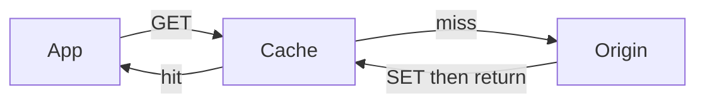

# Caching strategies

**See also:** [scaling strategies](ScalingStrategies.md) · [graceful degradation](GracefulDegradation.md) · [circuit breaker](CircuitBreaker.md) · CDN & edge (catalog **B8** — HTTP cache keys, edge `stale-while-revalidate`, dynamic acceleration; not this card) · [home timeline](../data-intensive-design/home-timeline-case-study.md) · [performance](../data-intensive-design/performance.md) · [NFR references](../data-intensive-design/nfr-references.md) · [external research note (2026-09-13)](../../docs/research/sysdesign/b3-caching-external-research.md)

This card owns the cache that sits **next to an origin** (database, service, or computed view): who loads it, how entries die, and how a popular key that expires or is evicted can stampede the origin. [B1](ScalingStrategies.md) adds *compute* capacity; this card reduces *origin* work. [B8] owns the HTTP/CDN key space. [C11](GracefulDegradation.md) owns *deliberately* serving stale while the origin is unhealthy. [C1](CircuitBreaker.md) owns the cache-down → origin flood loop.

Quality attributes: **latency** (a hit skips the origin RTT), **capacity** of the origin (miss rate × client QPS), and a **freshness** contract. The costs are extra state, a new consistency window, a stampede surface, and — if the origin cannot take a flush — a hard dependency dressed as an optimization.

## Lineage and vocabulary

- **Azure Cache-Aside + Caching Guidance.** Commercial caches may offer native **read-through** and **write-through / write-behind**. Cache-aside *emulates* read-through: GET cache → miss → GET store → SET cache. On update: write the store, **then** invalidate — delete-first lets a concurrent reader miss, load the old store row, and put staleness back. Private vs shared; AP over C for typical Redis. The page's "`volatile-lru` default" is **Azure Cache for Redis**, not OSS.
- **AWS caching patterns / ElastiCache Strategies.** **Cache-aside / lazy loading** (reactive) vs **write-through** (proactive). Write-through is "almost always" paired with lazy loading. A miss is three trips; an empty replacement node is non-fatal. Write-through: current on write; empty nodes stay empty until the next write; never-read keys bloat RAM. **Adding TTL** is the documented combination. Sample TTL **300 s** is an example, not a standard. Memcached TTL is seconds; Valkey/Redis may use s or ms.
- **Ehcache 3 Writers.** **Write-behind** = async `CacheLoaderWriter` wrapper. Knobs: `queueSize` (then back pressure), `concurrencyLevel`, `enableCoalescing`. The docs' `3` / `1` / `1 s` are **examples**, not defaults. Failed writes are not retried by the wrapper.
- **Caffeine Refresh.** In-process read-through. `refreshAfterWrite`: first stale get → async `reload`, **old value returned**. `expireAfterWrite`: entry unusable, **sync** load. Refresh starts only on a query. Neither is on until configured.
- **Wikipedia *Cache stampede*** (also **dog-piling**). Hit rate can fall to zero if recompute never finishes. Illustration: **3 s** render × **10 rps** → **30** concurrent recomputes. Families: locking, external recompute, probabilistic early expiration.
- **Vattani et al., PVLDB 2015 — XFetch.** `time() − δ·β·ln(rand()) ≥ expiry`. **β = 1** practical default; `δ` = last recompute time.
- **Nishtala et al., *Scaling Memcache at Facebook*, NSDI 2013.** **Leases** (64-bit token): block stale sets + herds. Default: one token **per 10 s per key**; others wait. Measured **17K/s → 1.3K/s** peak DB QPS on herd-prone keys.
- **Google SRE book ch. 22.** **Latency cache** (origin can take expected load empty) vs **capacity cache** (cannot — hard dependency). Warm by slowly increasing load; keep clusters at nominal load.
- **Redis eviction + `redis.conf`.** OSS default policy **`noeviction`**. Advice for Pareto access: **`allkeys-lru`**. LRM in **Redis 8.6.0** (GA 2026-02-10).
- **RFC 9111** (STD 98, June 2022) is the HTTP intermediary/UA layer (`max-age`, `no-store`, `no-cache`, `must-revalidate`, `private`/`public`, `s-maxage`). **`stale-while-revalidate` / `stale-if-error` are RFC 5861**, not 9111. **B8** owns CDN behavior.
- **Nygard, *Release It!*** Dogpile is the same family as synchronized expiry, breaker-close, and deploy.

## The four patterns (who owns the I/O)

| Pattern | Read path | Write path | Who loads the origin | Freshness after a write | Failure / cost |
|---|---|---|---|---|---|
| **Cache-aside** (lazy loading) | App: GET cache → miss → GET origin → SET cache | App: write origin, then **delete** (or overwrite) the key | Application | Next reader misses (or briefly sees stale if a race re-caches the old store row). Azure: **store first, then delete**. | Miss = cache + origin + cache write (AWS). Only requested keys occupy memory. |
| **Read-through** | App talks only to the cache; the cache/library loads the store on miss | Usually paired with write-through or write-behind | Cache / loader | Same as the paired write mode | Azure: aside *emulates* this when the cache has no native loader. Caffeine `refreshAfterWrite` hides miss latency by serving the old value during reload. |
| **Write-through** | Hit as usual; miss still lazy-loads (AWS: "almost always" combined) | Store **and** cache in the same write; return only after both succeed (Azure) | Cache or application | Readers see the new value after a successful write | Higher write latency; never-read keys bloat RAM (AWS). Empty new nodes stay empty until the next write unless lazy-load is also present. |
| **Write-behind** (write-back) | Same as read-through / aside | Cache accepts the write; system of record updates **asynchronously**, optionally batched and coalesced (Ehcache 3) | Cache / writer | Cache readers see the write immediately; the SoR lags | Write latency drops; **durability is the SoR lag**. A crash or a lost queue loses acknowledged writes. Ehcache applies **back pressure** when `queueSize` is exceeded. |

**Write-around** is cache-aside's write half: the write skips the cache; the next read fills it.



Aside is the default because a cache outage degrades to a slower origin (AWS: node failure is non-fatal) — *if* the origin can take the miss load (SRE **latency cache**). Write-through buys read-after-write at the price of write RTT and cache size. Write-behind buys write throughput at the price of a durable-queue problem. Read-through moves loader and stampede policy into the library; aside leaves them at every call site.

## Invalidation: TTL vs explicit delete vs versioned keys

Three independent mechanisms; production systems usually combine two.

1. **TTL.** AWS: an integer; expired key is treated as not found; does **not** guarantee the value was never stale, only that it cannot be *arbitrarily* stale. Azure: too short → perpetual reload; too long → long-lived staleness. Best for relatively static or frequently read data. Synchronized TTLs (every key written at t=0 with the same TTL) recreate a stampede at t=TTL — Wikipedia's 30-recompute example is exactly that. No first-party numeric jitter formula is sourced; XFetch is the probabilistic alternative.
2. **Explicit invalidation.** After the store write, `DEL` the key. Precise, but every writer must know every derived key. Missed invalidation = silent staleness until TTL. **Order matters** (store first, then delete).
3. **Versioned / generation keys.** Application convention, not a vendor primitive: put a generation in the key (`entity:{id}:v{n}`, or a namespace prefix). Bumping `n` makes old keys unreachable; they die by TTL or eviction. Trade-off: **memory** until the orphans leave; **readers must agree** on the current generation (itself a cached value — a meta-stampede risk). HTTP cache-busting query strings are the same idea at the edge — **B8**.

Negative caching is a product decision. Azure's sample **avoids caching null**. Short-TTL negative entries stop a missing-key stampede but cache absence through a concurrent create unless invalidation is wired.

## Stampede, dogpile, and thundering herd after eviction

A **stampede / dogpile** is many concurrent missers recomputing one key. A **thundering herd after eviction** is the same shape with a different trigger: LRU/LFU under `maxmemory`, a flush, a failover to an empty node, or a deploy onto a cold process. Facebook's leases exist because *writes that invalidate* a hot key produce the herd, not only TTL.

| Family | Mechanism | Trade-off |
|---|---|---|
| **Per-key lock / mutex / single-flight** | One worker recomputes. Wikipedia options for lock losers: wait; return not-found; serve **stale**. Acquire must be atomic with a TTL so a dead holder releases; release must be token-checked or a late holder deletes a successor's lock. | Extra write; lock-TTL tuning (too short → duplicate compute; too long → stuck miss); lock service is a new dependency. |
| **Leases (Facebook memcache)** | 64-bit token; only the lease holder may `SET`; deletes invalidate the token (blocks stale sets). Token rate-limit **10 s/key** default. Measured **17K → 1.3K** peak DB QPS on herd-prone keys. | Requires cache-server support (or an emulation). Waiters add latency. |
| **Probabilistic early expire (XFetch)** | Independent per-request coin flip; no lock. `β=1` default. Needs `delta` stored with the value. | Some wasted early recomputes; not a hard cap of "exactly one." Complementary with a lock on the hard miss. |
| **External / refresh-ahead** | A dedicated process refreshes before expiry, periodically, or on miss. Caffeine `refreshAfterWrite` is the in-process form (triggered by a query, old value served). Azure's background refresh of reference data is the same family. | Another moving part; fits **static** key sets better than per-id keys. |
| **Stale-while-revalidate** | Serve stale, refresh in the background. HTTP: RFC 5861 (**B8** at the edge). App cache: keep the old value until the single recompute finishes (Wikipedia lock option 3; Caffeine refresh). | Freshness contract is a product decision — **[C11](GracefulDegradation.md)** when this is the *degraded* path. |
| **Warm / ramp** | SRE: add load slowly so the first small rate fills the cache. Azure: priming at startup; cache-aside still needed after expiry/eviction. Seeding a *large* cache can itself stampede the origin. | Warm time vs deploy velocity. A flushed **capacity cache** is an incident, not a toggle. |

## Locality

| Layer | Typical mechanism | State scope | Trade-off |
|---|---|---|---|
| **In-process** (Caffeine, Guava, Ehcache heap) | Read-through / refresh-ahead; TinyLFU / heap LRU | Per process | Lowest latency; Azure: instances diverge; process restart = cold. |
| **Distributed data cache** (Redis, Memcached, ElastiCache, Azure Managed Redis) | Cache-aside by default; write-through in the app; write-behind in a library or queue | Shared (clustered) | Cross-instance consistency of *cached* bytes; network RTT; eviction defaults **differ by vendor**. |
| **Materialized / derived view** | Fan-out on write into a precomputed structure | Per user / per query | [Home timeline](../data-intensive-design/home-timeline-case-study.md): write amplification for read speed. |
| **HTTP / CDN** | RFC 9111 + RFC 5861 | Browser, proxy, edge | **B8.** Different key space, different invalidation (purge, `s-maxage`). |

In-process in front of Redis is **two stampede domains**. Shorten the private TTL or invalidate via pub/sub (Azure).

## Configuration (verified 2026-09-13)

Library and engine defaults are generic — override them to the access pattern and freshness contract. Full URLs and the items deliberately left out are in the [research note](../../docs/research/sysdesign/b3-caching-external-research.md).

| Knob | Role | Too low | Too high |
|---|---|---|---|
| **TTL** | Bound on staleness; also the stampede period if synchronized | Origin QPS ≈ client QPS; cache is ornamental | Long-lived wrong answers; a forgotten invalidation lasts the TTL |
| **Explicit invalidate on write** | Freshness without waiting for TTL | Missed paths → stale | High write fan-out (every derived key) |
| **Generation in key** | Cheap "invalidate the world" of a namespace | Readers split across versions | Orphaned keys consume `maxmemory` until eviction |
| **`maxmemory` + policy** | What dies when RAM is full | OOM / write errors (`noeviction` / empty `volatile-*`) | Evicting the hot set → herd |
| **Stampede lock TTL** | Dead-holder safety | Duplicate recomputes | Missers wait on a ghost lock |
| **XFetch `β`, `delta`** | How early refresh starts | Stampede at expiry | Constant early refresh in the "hit" window |
| **Facebook lease interval** | Token issue rate (default **10 s/key**) | Herd returns | Waiters pile up |
| **Write-behind queue / concurrency / batch / coalesce** | SoR lag vs write RTT (Ehcache 3) | Back pressure on the write path | Lost writes on crash; SoR far behind |
| **Caffeine `refreshAfterWrite` vs `expireAfterWrite`** | Hidden reload vs hard miss | Expire wins → sync load | Refresh without expire keeps unused keys forever |

### Engine defaults (registry- and docs-verified, 2026-09-13)

| Engine | Eviction / memory default | Other documented defaults |
|---|---|---|
| **OSS Redis** | `maxmemory` unset / 0 = **no limit** on 64-bit (**implicit 3 GB** on 32-bit). Policy **`noeviction`**. | `maxmemory-samples` **5** (10 ≈ true LRU; max 64). Tenacity **10**. `lfu-log-factor` **10** (saturates ~**1 M** requests). `lfu-decay-time` **1** min. LRM `allkeys-lrm` / `volatile-lrm` from **8.6.0**. `volatile-*` with no TTLs = **`noeviction`**. Replica ignores `maxmemory` unless promoted (Redis 5+). Replication/AOF buffers are **not** counted toward `maxmemory`. |
| **Azure Cache for Redis** | **`volatile-lru`** | Samples **3**. `maxmemory-reserved` and `maxfragmentationmemory-reserved` **10%** of `maxmemory` each (allowed 10–60%). |
| **ElastiCache Valkey / Redis OSS** | **`volatile-lru`** | `reserved-memory-percent` **25%** (AWS: do not reduce). r6gd data-tiering: only `noeviction`, `volatile-lru`, `allkeys-lru`. |
| **Memcached 1.5+** | `-o modern` default, **segmented LRU** (HOT / WARM / COLD) | TEMP LRU **not** default-on. A page assigned to a slab class never moves. Evict when the slab has no free chunks, no free pages, and no expired tail item. |
| **Caffeine** | No default expire / refresh | Both off until configured. |
| **Ehcache 3 write-behind** | No sourced numeric *default* queue size | Docs' `3` / `1` / `1 s` are examples. Wrapper does not retry failed writes. |

**HTTP:** a cache **MUST NOT** serve stale under `must-revalidate` / `no-cache` / applicable `s-maxage` or `proxy-revalidate` (RFC 9111 §4.2.4). Azure Cache-Aside sample TTL **5 minutes** and AWS sample **300 s** are examples, not standards. Facebook's **10 s**/key lease interval is Facebook's published production default, not a Memcached OSS default.

## Observability

**Redis `INFO stats`:** `hit_rate = keyspace_hits / (keyspace_hits + keyspace_misses) * 100`. `EXISTS` reporting absence counts as a miss. Also watch `evicted_keys`, `expired_keys`, `used_memory_dataset` vs `maxmemory`, `current_eviction_exceeded_time`, and `commandstats` rejections under `noeviction` / `volatile-*`. High `evicted_keys` + low hit rate → wrong policy or undersized cache. High `expired_keys` + low evictions → TTL too short or wrong keys expiring.

**Memcached:** `stats items` per slab: `evicted`, `evicted_nonzero` (evicted with a finite expiry), `evicted_time` (seconds since the evicted item was last fetched — small means you are evicting recently used items). Global `evictions`. Memcached is **many small caches** (one LRU per slab class).

**Application-level** (Redis keyspace counters are not per prefix): hit/miss **by key class**; miss-penalty (p95 miss − p95 hit — measure response time on the client, [performance](../data-intensive-design/performance.md)); **origin QPS** next to cache QPS; stampede signals (lock acquires vs waiters, XFetch early recomputes, lease waits); write-behind queue depth.

**OpenTelemetry:** no *stable* application-cache semantic convention as of 2026-09-13. Collector `memcachedreceiver` hit/miss metrics are marked **Development**. Redis spans today are **database** spans, not cache spans.

## Tuning

Start from **access pattern + freshness contract + origin headroom**, not from a library default.

- **Pure cache, rebuildable keys:** OSS Redis advice is `allkeys-lru` (or `allkeys-lfu` when frequency beats recency). Managed Redis that defaults to `volatile-lru` **requires a TTL on every cache key** or it behaves like `noeviction` and writes start failing.
- **Mixed persistent + cache keys on one instance:** `volatile-*` (Redis docs still prefer two instances). Azure and ElastiCache default here — easy to misconfigure as a "cache" that never evicts.
- **Read-hot, write-cold keys:** Redis 8.6 LRM — LRU would keep them forever because reads refresh recency.
- **Stampede on a few hot keys:** lock or lease on that key class only; XFetch if lock contention itself is the cost; do not wrap every cheap key.
- **Cold start / failover:** treat as a capacity event (SRE). Ramp traffic; prime only the hot set. Pair with [C1](CircuitBreaker.md) so "cache down → query origin" is not an unbounded fallback (Gabrielson).
- **In-process + distributed:** shorten private TTL or invalidate via pub/sub.

## Worked calibration — hit rate vs origin QPS

Identity (from the definition of hit rate, and Redis's `INFO` formula):

```
origin_qps ≈ client_read_qps × (1 − hit_rate)
```

A look-aside cache that loses a **90%** hit rate multiplies origin load by **10×** (Bronson et al., HotOS 2021 — [7](../data-intensive-design/nfr-references.md)). That is the SRE **capacity-cache** definition.

| Client read QPS | Hit rate | Origin QPS | Notes |
|---|---|---|---|
| 10 000 | 95% | 500 | Origin provisioned for 500 must **not** be expected to absorb a flush. |
| 10 000 | 90% | 1 000 | Bronson's 10×: drop to 0% hit → 10 000 origin QPS. |
| 10 000 | 50% | 5 000 | Cache is already a modest win; stampede protection still matters on the hot keys. |
| 10 000 | 0% (flush / cold) | 10 000 | Empty-node AWS lazy-loading story; SRE "slowly increase the load." |
| Wikipedia | 1 popular key, 10 rps, 3 s recompute | **30** concurrent origin computes at expiry | Lock/lease/XFetch target this key, not the fleet average. |
| Facebook NSDI 2013 | herd-prone key set | **17 000 → 1 300** peak DB QPS with leases | ~13× peak reduction on that set; not a global SLA. |

The [home timeline](../data-intensive-design/home-timeline-case-study.md) is the derived-data form of the same identity: 10 M online users polling every 5 s = **2 M QPS** × 200 followees = **400 M** lookups/s; materializing the timeline trades that for ~**1 M** writes/s at 5 800 posts/s × 200 fan-out (book figures in that case study, not measurements from this workspace). Celebrity / heavy-follow tails are a different workload.

**Provisioning rule.** Size the origin for **miss QPS at the worst hit rate you will actually hit** (deploy, failover, flush, eviction of the hot set), or classify the cache as a **capacity cache** and engineer warming + stampede control + a [C1](CircuitBreaker.md)/[C11](GracefulDegradation.md) path that does *not* "just hit the database." Measure p99 of the *client*; the mean hit rate hides a single hot key that is 100% miss for 3 s.

## Testing and operating

A cache is an operational mode that hides origin load; if you never flush it on purpose you will flush it for the first time in an incident.

- **Hit-rate vs origin QPS.** Drive a key class to a known miss rate and assert origin QPS tracks `(1 − hit_rate)`. The proof is origin QPS and client p99, not `keyspace_hits` alone.
- **Stampede on one hot key.** Expire or `DEL` a popular key under load (Wikipedia's 10 rps × 3 s shape). Without a lock/lease/XFetch you should see concurrent origin recomputes; with one, a single recompute and waiters or stale hits.
- **Capacity-cache flush.** `FLUSHALL` or fail over to an empty node and confirm the origin does **not** take full client QPS — ramp (SRE) or [C1](CircuitBreaker.md) trip, not "query the database."
- **Eviction policy.** Fill past `maxmemory` with and without TTLs. OSS `noeviction` and `volatile-*` with no TTLs must surface write errors, not silent "healthy" `evicted_keys = 0`.
- **Kill the cache class.** Disable one prefix ([C11](GracefulDegradation.md) ops toggle) and rehearse omit / already-held stale — not an untested origin fallback (Gabrielson).

## Failure modes of the cache itself

- **Capacity-cache collapse.** Hit-rate loss × origin overload × timeouts × retries × cache cannot refill (Bronson; Slack 2022-02-22; [C1](CircuitBreaker.md)). The sustaining loop is the outage, not the flush.
- **"Query the origin if the cache is down."** Gabrielson (AWS Builders' Library): a 2001 shipping-speed cache whose fallback turned a partial outage into a site-wide one. Pair with [C1](CircuitBreaker.md); prefer a continuously exercised path ([C11](GracefulDegradation.md)).
- **Stampede at TTL, at eviction, at deploy, at failover.** Same shape; different trigger. Synchronized TTLs and `FLUSHALL` are self-inflicted.
- **Stale-set / reorder.** Writer A reads old, writer B writes new + invalidates, A SETs old. Facebook leases exist for this. Azure store-then-delete closes a different race (delete-first).
- **`volatile-*` without TTLs.** Writes fail with OOM; `evicted_keys` stays 0 — looks healthy.
- **OSS `noeviction` + `maxmemory` on a "cache."** Same OOM-on-write. OSS default is this policy; a cache that was never `CONFIG SET` will not evict.
- **Memcached slab imbalance.** 80% of pages in one class starves another; per-slab LRU cannot borrow.
- **Write-behind acknowledged, SoR never sees it.** Process crash, queue drop, or writer bug — a durability problem, not a latency-cache problem.
- **Private-cache split brain.** Azure: instance A at time X, instance B at time Y.
- **Replicated origin + cache-aside.** Populating from a lagging replica re-caches the past (Azure).
- **Caching null / not caching null.** Azure sample: do not cache null (avoids poisoning). Opposite failure: missing-key stampede.

## When not to use

Azure Cache-Aside "not suitable" plus this pass:

- Sensitive / security-related data in a **shared** cache — read the primary.
- Static dataset that **fits** — prime once, disable expiry (Azure).
- Hit rate so low that cache + load overhead exceeds a direct origin read.
- Session state that implies **sticky** web-farm affinity (Azure).
- Write-heavy, constantly changing data where synchronization cost exceeds the win (Azure).
- Origin already a **latency cache** situation (SRE): if the origin can take full load, a capacity cache is optional complexity.
- Write-behind for data you cannot afford to lose.
- HTTP `Cache-Control` as a substitute for Redis invalidation — different layer (B8 / [A1](RequestResponse.md)).

## Trade-offs

| Buy | Pay |
|---|---|
| Aside: cache outage degrades to a slower origin | Miss = three trips; every call site owns load + stampede policy |
| Write-through: read-after-write | Write RTT; never-read keys bloat RAM; empty nodes stay empty without lazy-load |
| Write-behind: write throughput | SoR lag; acknowledged-but-lost writes on crash |
| TTL as a staleness bound | Synchronized expiry *is* a stampede schedule |
| Explicit delete after store write | Every writer must know every derived key |
| Generation bump | Orphans consume RAM; readers must agree on `n` |
| Lock / lease / XFetch on hot keys | Extra writes, waiter latency, or wasted early recomputes |
| Capacity cache (90% hit) | A flush is a **10×** origin event; the cache is a hard dependency |

[B1](ScalingStrategies.md) decides **how to add capacity**. This card decides **how not to spend it on the origin**. [C1](CircuitBreaker.md) decides **whether to call** the origin on a miss. [C11](GracefulDegradation.md) decides **what the user gets** when the cache or the origin is unhealthy. B8 decides the **HTTP edge**. Coordinate all four; do not treat "put Redis in front" as a complete scaling strategy.

## Sources

Verified 2026-09-13; the full URL list, per-claim provenance, and the items deliberately left out are in the [external research note](../../docs/research/sysdesign/b3-caching-external-research.md). Items already cited in this tree are referenced by their number in [nfr-references.md](../data-intensive-design/nfr-references.md).

- Canon: Azure Cache-Aside and Caching Guidance; AWS caching-patterns whitepaper + ElastiCache Strategies; Ehcache 3 Writers; Caffeine Refresh wiki; Wikipedia *Cache stampede*; Vattani et al. PVLDB 2015 (XFetch); Nishtala et al. NSDI 2013; SRE book ch. 22; Nygard *Release It!* 2nd ed. (Dogpile).
- Engines: Redis eviction docs + `redis.conf` HEAD; Redis 8.6.0 LRM; Azure Cache for Redis memory settings; ElastiCache parameter groups; Memcached 1.5 modern LRU.
- HTTP / metastability: RFC 9111; RFC 5861 (B8 boundary); Bronson et al. HotOS 2021 [7]; Gabrielson, *Avoiding fallback*.
- This tree: [home-timeline-case-study.md](../data-intensive-design/home-timeline-case-study.md); [performance.md](../data-intensive-design/performance.md); [CircuitBreaker.md](CircuitBreaker.md) (cache-down fallback).
