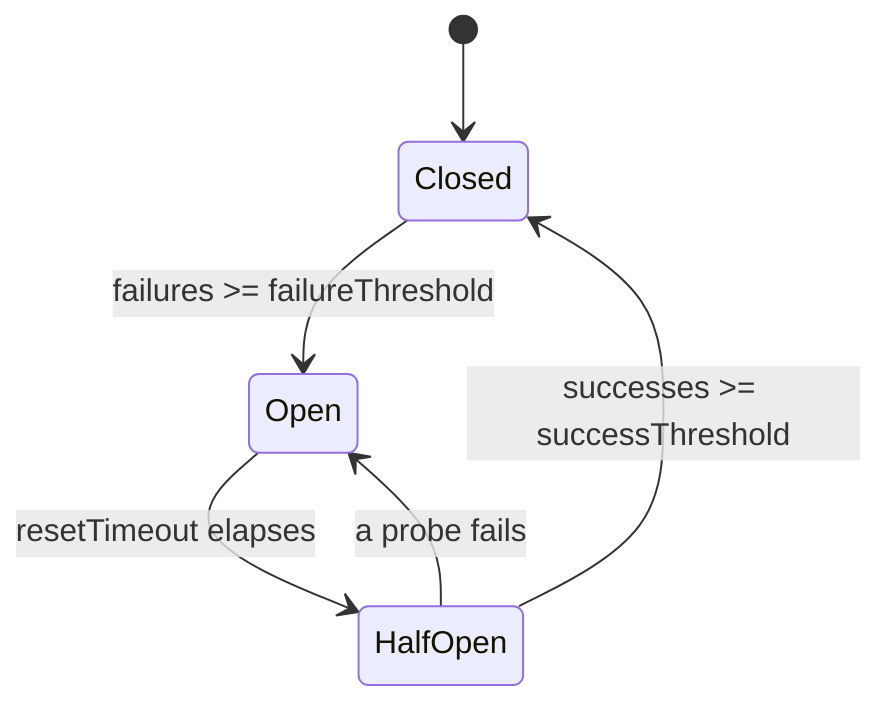

# Circuit breaker

**See also:** [retry, backoff, and retry budgets](RetryBackoff.md) · [reliability](../data-intensive-design/reliability.md) · [performance](../data-intensive-design/performance.md) · [NFR references](../data-intensive-design/nfr-references.md) · [POC-to-production reliability controls](../claude-certification/enterprise-integration-production/poc-to-production.md) · [cloud failure-tolerant patterns](../aws/ch08.md) · [ML microservice patterns](../ml-solutions-arch/ml-microservices-patterns.md) · [external research note (2026-09-13)](../../docs/research/sysdesign/circuit-breaker-external-research.md)

The Circuit Breaker pattern is a **stateful proxy** at a service-integration boundary. It watches calls to one downstream dependency and short-circuits new requests when failures pass a configured threshold, so a single slow or dead callee cannot exhaust the caller's threads and cascade through the fleet.

A single database query that stretches from 300 ms to 30 s is enough: the caller's thread pool fills, requests queue, latency walks upstream, and a whole microservice graph degrades. The software breaker is the electrical one: trip the circuit so a short does not burn the building. Unlike retries — which keep calling a failing service and can amplify the outage — the breaker **stops calling** until a probe says recovery is plausible.

Quality attributes in play: **reliability** (the caller still meets its SLO when a part is faulty), **availability** of the *caller* (fail fast, serve a fallback), and **recoverability** of the *callee* (traffic relief). The cost is extra state, false trips, a new modal behaviour that is rarely exercised, and a silent-degradation risk if nobody watches the breaker.

## Lineage and vocabulary

- **Nygard, *Release It!* (2007; 2nd ed. 2018)** introduced the breaker as one of the stability patterns — alongside Timeouts, Bulkheads, Steady State, Fail Fast, Let It Crash, Handshaking, Test Harnesses, Decoupling Middleware, Shed Load, Create Back Pressure and Governor — as the answer to the stability antipatterns *Integration Points*, *Chain Reactions*, *Cascading Failures*, *Blocked Threads* and *Slow Responses*. The 2nd edition added Dogpile and Force Multiplier to the antipattern list; both describe the synchronized surges a badly tuned breaker can itself create.
- **Fowler (2014)** fixed the vocabulary: a wrapper that counts failures and trips at a threshold; a self-resetting **half-open** trial after an interval; **not every error should trip it** (connection failures and timeouts yes, ordinary application outcomes no); richer tripping by error *rate* and by error *type* (his example: ten timeouts or three connection failures); breakers apply to **asynchronous** integration too (trip when the outbound queue fills); log every state change, expose state to monitoring, and let operators trip or reset by hand.
- **Azure Architecture Center** carries the longest checklist (fourteen considerations, updated 2026). The six that bite most in practice: weight exception *types* differently; match the open duration to the dependency's real recovery profile; one breaker over many independent providers (shards) merges their signals and either blocks healthy shards or admits doomed calls (*resource differentiation*); a 429 or 503 that names a delay justifies opening immediately for at least that long (*accelerated breaking*); an over-long dependency timeout pins threads before the breaker learns anything (*inappropriate time-outs*); and a manual force-open / force-close. Its "not suitable" list is as useful: in-process resources, a substitute for business exception handling, cases where plain retries suffice, message-driven flows that already dead-letter, and platforms where a load balancer or mesh already routes around failure.
- **Two different mechanisms share the name.** Application libraries and mesh *outlier detection* trip on failures; Envoy's and Istio's "circuit breaking" settings are **concurrency limits** (maximum connections, pending requests, retries). Both live in the placement table below; do not confuse a limit that was never exceeded with a breaker that never tripped.

## The three states

| State | Traffic | Counter behavior |
|---|---|---|
| **Closed** | Requests flow to the downstream. Default, healthy state. | Count failures (and slow calls) over a window. A success resets or decrements the counter. |
| **Open** | Reject immediately or route to a fallback. No call reaches the downstream. | Wait out `resetTimeout`. Caller threads are free; the callee gets breathing room. |
| **Half-Open** | A limited number of probe requests pass through. | Enough probe successes → Closed. A probe failure → Open again, often for longer. |

The proxy protects both sides. The caller reclaims threads instead of waiting on a dead dependency. The callee is spared incoming traffic, which improves its chance of recovery.

Production libraries add **operational states** outside the automaton: Resilience4j has `FORCED_OPEN` (reject everything), `DISABLED` (admit everything, no events) and `METRICS_ONLY` (admit everything, record everything, never trip — the right way to shadow-run a new breaker); Polly v8 has `Isolated` behind `ManualControl`; Hystrix had `forceOpen` / `forceClosed`. Treat them as kill switches and expose them to operators (Fowler's manual trip/reset, Azure's manual override).

## What counts as a failure

The counter is only as good as its classification. A breaker that counts validation errors trips on bad input; one that ignores timeouts never trips at all.

| Outcome | Count it? | Why |
|---|---|---|
| Connection refused / reset, DNS or TLS failure, 502 / 503 / 504, gRPC `UNAVAILABLE` | **Yes** | The dependency or the path to it is unhealthy. |
| Timeout, gRPC `DEADLINE_EXCEEDED` | **Yes** | A hung call that never fails never increments the counter — bound every call and count the bound. |
| Slow-but-successful call past a latency threshold | **Yes, separately** | Resilience4j tracks a *slow-call rate* next to the failure rate; a dependency that answers in 30 s is down for your SLO. |
| 5xx with `INTERNAL` / `UNKNOWN` semantics | Yes | Server-side fault. |
| 429 / 503 carrying `Retry-After` | **Special** | Open immediately for at least the advertised delay (Azure's accelerated breaking; Polly exposes `RetryAfter`; API Management's `acceptRetryAfter`). Scope the trip to the quota that was hit — key, tenant, model — not the whole provider. |
| Caller-side cancellation | No | Polly's default handler excludes `OperationCanceledException` for this reason. |
| 400 / 404 / 409 / 413 / 422, validation and business exceptions, gRPC `INVALID_ARGUMENT`, `NOT_FOUND`, `FAILED_PRECONDITION`, `ALREADY_EXISTS` | **No** | The request was wrong, not the dependency (Hystrix's `HystrixBadRequestException`, pybreaker's `exclude`, Resilience4j's `ignoreExceptions`). |
| 401 / 403, gRPC `UNAUTHENTICATED` / `PERMISSION_DENIED` | No — alert instead | Configuration problems; tripping hides them. (Linkerd counts `PERMISSION_DENIED`; the gRPC and Envoy mappings do not.) |

Mesh and gRPC defaults are cruder than this table: Envoy's outlier detection counts consecutive 5xx and maps gRPC statuses onto HTTP codes for the purpose, and the gRPC libraries' own xDS outlier detection counts **any** non-OK status, client errors included. If you rely on infrastructure breakers, narrow what counts (Istio's `outlierDetectionHttpErrorCodes`) or accept that a burst of bad requests can eject a healthy host.

## Configuration

Three parameters set sensitivity and recovery; production breakers add four more. Library defaults are generic — override them to the downstream's actual recovery profile.

| Parameter | Role |
|---|---|
| `failureThreshold` | Consecutive failures, or a failure-*rate* over a window, that trip Closed → Open. |
| `resetTimeout` | How long the breaker stays Open before a Half-Open probe is allowed. Fixed, or a function that grows with repeated trips. |
| `successThreshold` | Successful Half-Open probes required to return to Closed (or a success ratio over the permitted probes). |
| `minimumNumberOfCalls` | Volume the window must hold before a rate is evaluated; below it the breaker never trips. |
| `slowCallDurationThreshold` / `slowCallRateThreshold` | Latency past which a call counts as slow, and the slow share that trips. |
| `permittedNumberOfCallsInHalfOpenState` | Probe batch size (one, or several). |
| Window type and size | Count-based (last N calls) or time-based (N one-second buckets). |

A production breaker also needs: thread safety, metric hooks, and a **sliding window** rather than a naive consecutive-failure counter. Count-based windows suit low throughput; time-based windows suit high throughput.

The source dump's JavaScript listing was a course-editor placeholder (`CircuitBreaker` with `CLOSED` / `OPEN` / `HALF_OPEN`). It is omitted here rather than reconstructed.

### Library defaults (registry-verified, 2026-09-13)

| Library | Trip | Window | Minimum volume | Half-open | Open for | Slow calls | Shared state |
|---|---|---|---|---|---|---|---|
| **Resilience4j 2.4.0** | failure rate ≥ 50% or slow-call rate ≥ 100% | last 100 calls (count) or N × 1 s buckets | 100 | 10 permitted calls, re-evaluated as a batch | 60 s, or an interval function (exponential / randomized) | yes, threshold 60 s | no |
| **Polly 8.7** | failure ratio 0.1 | rolling 30 s in 10 windows | 100 | **one probe**; concurrent callers rejected | 5 s, or a generator that sees the half-open attempt count | no (compose a timeout) | no |
| **Hystrix 1.5.18** (maintenance since 2018) | error % > 50 | 10 s in 10 buckets | 20 | one trial | 5 s | 1 s timeouts count as errors | no |
| **gobreaker v2.4** (Go) | > 5 consecutive failures (custom `ReadyToTrip`) | fixed interval or buckets | none | `MaxRequests` = 1 consecutive success | 60 s | no | optional, via a shared store |
| **opossum 10** (Node) | error % > 50 | 10 s in 10 buckets | 0 | one trial | 30 s | 10 s call timeout counts as failure | snapshot only |
| **pybreaker 1.4** (Python) | 5 consecutive failures | none | — | one trial, `success_threshold` 1 | 60 s | no | optional, Redis |
| **.NET standard resilience handler** | ratio 10% | 30 s | 100 | one probe | 5 s | attempt timeout 10 s counts | no |

Read the table as a design space, not a recommendation. The two families are visible: *rate over a window with a minimum volume* (Resilience4j, Polly, Hystrix, opossum) versus *consecutive failures* (gobreaker, pybreaker, legacy Polly). Rate-based breakers need volume to trip at all — with a minimum of 100 calls, nine failures out of nine do nothing; consecutive breakers trip on the first unlucky streak of a low-traffic dependency. Only Resilience4j ships latency-based tripping; everywhere else a slow dependency must be turned into a failure by a timeout.

## Half-open: probe design and recovery

Recovery is where most breakers misbehave, because the half-open sample is tiny and the traffic it lets through is not representative.

- **One probe or a batch.** Fowler, Hystrix, Polly v8, Linkerd, opossum and pybreaker admit a single trial and reject everyone else until it returns. Resilience4j admits a batch (ten by default) and re-applies the failure-rate and slow-call thresholds to the batch. Azure describes a "limited number" and a *consecutive*-success count to close. One lucky 200 closing a payment breaker is the classic failure; on critical paths require several successes or a ratio.
- **Who triggers the transition.** Resilience4j moves Open → Half-Open lazily, on the next call after the wait, unless the automatic transition is enabled (a monitoring thread). A dependency nobody calls stays Open indefinitely — harmless, but confusing on a dashboard.
- **Probe timeout.** Shopify's rule: the half-open probe timeout must be far below the service timeout, otherwise every probe against a still-slow dependency parks a worker for the full timeout (Semian has a dedicated `half_open_resource_timeout`).
- **Escalating open duration.** A fixed reset timeout probes a dead dependency forever at the same rate. Linkerd doubles the penalty on each failed probe (1 s → 1 min, with jitter); Envoy and Istio multiply ejection time by the number of times the host has been ejected (30 s × n, capped at 300 s); Polly v8's break-duration generator sees the failure count and the half-open attempt count; Azure suggests seconds first, then minutes.
- **Stampede on close.** When the breaker closes, all the demand that was failing fast returns at once, plus whatever queued behind it. Envoy has an ejection-time jitter setting for exactly this reason and a *slow start* that ramps a returning host's weight; Traefik has a *recovering* state that lets a linearly increasing share through; Google SRE ramps load onto cold servers to warm caches. If your library offers none of these, jitter the reset timeout per instance and keep the fallback path able to absorb the tail.
- **Flapping.** Rapid Open ↔ Half-Open ↔ Closed cycling happens when probes succeed under near-zero load and full load fails again. Mitigations with precedent: success ratio over N probes; escalating open duration; jitter; a minimum call volume before evaluation; asymmetric healthy/unhealthy thresholds (as active health checks use); ramped recovery. Yandex measured a request-level breaker at a 10% threshold flapping continuously when one shard in five failed — and cutting off the healthy four.

## Observability

A breaker without metrics is a production anti-pattern: it rejects traffic silently, and the team learns from users. Emit at least:

| Metric | What it tells you |
|---|---|
| **State** (one series per state) | Which breakers are Open right now, and for how long. |
| **Trip rate** | How often the breaker goes Open — instability frequency of that dependency. |
| **Mean time to recovery** | Time spent Open before a successful Half-Open probe — the downstream's real recovery speed. |
| **Not-permitted calls / fallback invocation rate** | How much traffic the user (or a queue) is getting the degraded path for. |
| **Downstream error rate and slow-call rate** | Raw failures and latency among calls that *did* reach the callee — ground truth for thresholds. |

Concrete names: Resilience4j exposes `resilience4j.circuitbreaker.state`, `.failure.rate`, `.slow.call.rate`, `.calls` (tagged successful / failed / ignored), `.not.permitted.calls` and `.buffered.calls` through Micrometer, plus an actuator endpoint that lists the last hundred transitions and a write operation for CLOSE / FORCE_OPEN / DISABLE. Polly v8 publishes a `Polly` meter with strategy-event counters and attempt / pipeline duration histograms tagged by pipeline and strategy name. Envoy exposes per-cluster gauges for each open breaker (`rq_pending_open`, `rq_open`, `rq_retry_open`) and `outlier_detection.ejections_active`.

Alert shapes worth having: *open longer than X minutes* (the dependency is not recovering, or the reset timeout is wrong) and *more than N transitions in fifteen minutes* (flapping). Log every state transition with a correlation ID. A breaker that trips often and recovers quickly is usually a threshold set too tight, not a genuinely unstable downstream — check the raw error rate before loosening or tightening.

## Tuning

Set `failureThreshold` too low and transient blips become false positives. Set it too high and the cascade has already spread. `resetTimeout` trades callee recovery time against how long the caller stays degraded.

| Parameter | Too low | Too high | Starting point |
|---|---|---|---|
| Failure threshold | Trips on noise | Cascade before trip | ~50% failure rate over a 10-second window; move with the downstream SLA |
| Minimum volume | Trips on a handful of calls | Never trips on a quiet dependency | Enough calls per window that one client's bad luck is not a fleet signal |
| Reset timeout | Probes too early, re-trips | Caller stays degraded | Match measured mean recovery time; escalate on repeated trips |
| Success threshold (Half-Open) | One lucky probe closes it | Recovery delayed after the callee is healthy | 3–5 successful probes on critical paths |
| Slow-call threshold | Healthy tail latency counts as failure | Slow dependency never trips | Just above the p99 you can afford, never the library's 60 s |
| Sliding-window size | Reacts to individual failures | Slow to see a spike | Time-based at high RPS; count-based at low RPS |

Two rules of thumb with numbers behind them. Shopify: keep the error threshold small, the open duration long relative to the probe timeout, and the probe timeout far below the service timeout — one retuning (probe timeout 0.25 s → 0.05 s, open duration 2 s → 30 s) cut the spare capacity a failing dependency consumed from 263% to 4%. Napkin math from the same team: a 5-second timeout on one dependency turns 100 ms workers into 5-second workers (about 1/50 of capacity), and a three-error, fifteen-second breaker still leaves only about half the capacity — the timeout, not the breaker, sets the floor.

## Retry, timeout, budget and breaker together

Retries and breakers are complementary and they conflict if stacked blindly. The full pattern card is [Retry, backoff, and retry budgets](RetryBackoff.md).

- Retries belong **close to the call**, with backoff and jitter, and only for transient errors. They feed the breaker's failure counter: an aggressive retry loop can trip a healthy-enough dependency.
- The breaker belongs **at the service boundary**. Once Open, do not retry that dependency — fail fast into the fallback. Retrying an Open circuit wastes nothing useful and delays the fallback.
- Fallback (cache, default, async queue) belongs in **orchestration**, not inside the breaker. The breaker decides *whether to call*; the fallback decides *what the user gets*.
- **Retry budgets** cap the damage retries do before the breaker ever trips: Google SRE's per-client budget of about 10% of requests (plus a three-attempt cap per request and a "don't retry" signal from overloaded servers); Envoy's retry budget of 20% of active requests; gRPC's token-bucket `retryThrottling`; the AWS SDK's local token bucket (in place since 2016). Retry amplification is the reason: three retries at each of three layers is 4³ = 64 attempts on the database; five layers with three retries each is 243×. Retry at one layer, and make it the one just above the failure.
- **Order the pipeline deliberately.** The .NET standard resilience handler runs rate limiter → total timeout → retry → circuit breaker → per-attempt timeout, so each attempt is bounded and the breaker sees attempts, not logical requests. Resilience4j's Spring aspects nest Retry outermost around CircuitBreaker, RateLimiter, TimeLimiter and Bulkhead. Retry *outside* the breaker means a retry can be refused by an Open breaker (good); retry *inside* it means every attempt counts (fine if the budget is small).

Timeouts are the third knob: a hung call that never fails never increments the counter. Bound every outbound call, propagate the remaining deadline downstream (30 s at the edge is 23 s one hop later), and treat timeout as a failure. Brooker's variant is worth knowing: a breaker applied only to *retries* — first attempts always pass — caps retry load without making the primary path modal.

## Where it lives

The same state machine ships at different layers. That is a placement decision, not a different pattern — but note the **scope** column: every infrastructure breaker keeps its state per proxy or per instance.

| Deployment | What it isolates | State scope | Trade-off |
|---|---|---|---|
| **In-process library** (Resilience4j, Polly, gobreaker, opossum, pybreaker; Hystrix historically) | One client's calls to one dependency. Hystrix also gave each dependency its own thread pool so a slow payment service could not steal recommendation threads (bulkhead). | Per process (pybreaker and gobreaker can share through Redis or a store) | Visible to application code; per-language; easy, typed fallbacks. |
| **Envoy / Istio concurrency limits** ("circuit breaking": max connections, pending requests, requests, retries; Envoy defaults 1024 / 1024 / 1024 / 3, Istio's effectively unlimited) | Overload of an upstream cluster — a limit, not a failure detector | Per sidecar, per cluster | Transparent; an exceeded limit returns 503 with an `x-envoy-overloaded` header; nothing tells the app *why*. |
| **Envoy / Istio outlier detection** (consecutive 5xx 5, interval 10 s, base ejection 30 s growing with each ejection, max 10% of hosts ejected; plus success-rate and failure-percentage modes) | One unhealthy **host** behind a service | Per sidecar, per host | Routes around bad hosts instead of failing fast; a panic threshold (50% healthy) turns ejection off rather than starve the service. |
| **Linkerd failure accrual** (since 2.13, 2023: seven consecutive failures, one probe, penalty 1 s → 1 min, jittered) | One endpoint, per client | Per client proxy | Annotation on the Service; no half-open batch; exponential penalties built in. |
| **Load balancer health checks** (AWS ALB: every 30 s, 5 s timeout, 5 to mark healthy, 2 to mark unhealthy) | Host-level health | Per load-balancer node | Coarse; not a substitute for per-RPC breakers. **Fails open**: when every target is unhealthy the ALB sends traffic to all of them anyway. |
| **API gateways** (Azure API Management backend breaker: count or percentage of failures in an interval → 503 for a trip duration, optionally honouring `Retry-After`; Kong passive checks — trip only, active checks re-enable; Traefik expression breaker with a recovering state; NGINX `max_fails` 1 / `fail_timeout` 10 s) | A backend behind the gateway | Per gateway instance | Central policy for many clients; approximate across instances; thin fallbacks. |
| **gRPC client (xDS)** | Success-rate / failure-percentage host ejection with Envoy's defaults; a token-bucket retry budget in the service config | Per channel | No application-level breaker exists; wrap the stub in a library breaker if you need fail-fast semantics. |
| **Message consumers** (Kafka `pause()` / `resume()` per partition; Spring Kafka back-off then dead-letter; Connect's error tolerance) | A downstream the consumer writes to | Per consumer instance | The "open" state is *stop fetching*, which keeps group membership; pause state is lost on rebalance, so re-apply it. |
| **Cloud-managed** (ECS Service Connect: five failed connections in 30 s → avoid the task 30–300 s, not configurable; App Mesh outlier detection, end of support 2026-09-30) | A task or virtual node | Per task proxy | Zero configuration; zero tuning. |

Hystrix's fail-safe shape, used in the e-commerce "sell anyway" story: a Command asks the Circuit Breaker whether to run the live Pricing call or return a cached price. Auth / Catalog / Pricing stay independently deployable; a down Pricing service becomes a degraded sale, not a hard stop. The dump's class-diagram screenshot is omitted; the structure is Command → Circuit Breaker → {live execution \| cached fallback}.

## State scope: per instance or shared

By default every breaker is **local**: each process, sidecar or gateway node counts its own failures and trips on its own. The maintainers of Hystrix, Polly and Resilience4j all declined to add distributed counters, for the same three reasons: a shared store is a new dependency that can fail or be slow on the path you are trying to protect; a failure seen by one node may be local to that node or its network path, so telling its peers to stop would destroy the redundancy they provide; and synchronous replication adds latency to every call. The cost of local state is slower fleet-wide reaction (two hundred pods each fill their own window) and inconsistent behaviour across pods, which a load balancer can exploit by routing to the pods that have not tripped yet.

When shared state is warranted — many small workers, a dependency whose failure is unambiguous, or a quota that is per organization rather than per client — the precedents are: share only **transition events** (peers force-open or close, counters stay local); require a **quorum** before forcing peers; share **per host** rather than per fleet (Shopify's Semian shares the bulkhead across a host's worker processes, but its breaker state is still per worker); or use a store with an explicit fail-open policy (pybreaker's Redis storage falls back to Closed when Redis is unreachable; gobreaker's distributed breaker propagates store errors; LiteLLM shares provider cooldowns through Redis across gateway replicas).

Granularity matters more than sharing. Brooker's shard example: a client-side breaker over a backend with three key ranges sees a *blend* of success and failure when one range fails — it either never trips or takes the healthy two-thirds offline. Azure's *resource differentiation* is the same warning. Break per endpoint or authority (Polly's authority-keyed pipelines, the .NET hedging handler's per-endpoint breakers), per host (mesh ejection), and per tenant or API key where limits are per organization.

## Alternatives that beat a breaker

The breaker is a binary switch. Several situations want a proportional control instead.

| Situation | Prefer | Why |
|---|---|---|
| The dependency is *slower*, not down | Adaptive concurrency limits (Netflix concurrency-limits: Vegas, Gradient2, AIMD; Envoy's adaptive-concurrency filter) | Continuous, latency-driven; Netflix retired Hystrix in favour of exactly this. |
| Many small clients with poor per-client failure estimates | Client-side adaptive throttling (SRE: reject locally with probability `max(0, (requests − 2·accepts) / (requests + 1))`) or a retry token bucket | Degrades smoothly; no per-client threshold to get wrong. |
| Retry storms are the risk | Retry budget + one retry layer + jitter | The storm is caused above the breaker; the breaker only limits how long it lasts. |
| Your own service is overloaded | Prioritized load shedding (Netflix's partitioned limiter, Uber's Cinnamon, Stripe's four limiters) | Keeps goodput for critical traffic instead of failing everyone. |
| Work outlives the caller's patience | Deadline propagation and cancellation | Stops spending capacity on answers nobody will read. |
| Producer and consumer speeds differ | Backpressure and bounded queues | The problem is flow, not health. |
| The dependency is hard down, or a fallback is genuinely cheaper | **The breaker** | Fail fast, stop wasting threads, relieve the callee. |

## Worked calibration — checkout → payment gateway

Constraints from the source exercise (not a vendor SLA — a design drill):

- Gateway: 500 rps, 99.9% availability, ~15 s mean recovery.
- Checkout: 99.95% success target, with an async payment-processing queue as fallback.

| Knob | Choice | Why |
|---|---|---|
| Window | Time-based, on the order of 10 s | 500 rps × 10 s ≈ 5 000 samples — a rate signal, not a handful of consecutive codes. Count-based windows are too bursty at this RPS. |
| Failure threshold | Well above the healthy 0.1% error implied by 99.9% availability — start near 50% over the window | Must ignore noise; must still trip before checkout's thread pool saturates. The async queue lets you trip earlier than a "must succeed inline" path. |
| Minimum volume | A few hundred calls per window | At 500 rps this is reached in under a second; it exists to keep a quiet canary from tripping the fleet. |
| Reset timeout | ≈ 15 s (measured mean recovery), doubling on repeated trips, jittered per instance | Probe too early and Half-Open re-opens immediately; wait much longer and checkout stays on the queue longer than the gateway needs. |
| Success threshold | 3–5 probes | Payments are a critical path — one lucky 200 should not close the circuit. |
| Idempotency | An idempotency key minted once per order and reused across retries, the queue and the fallback | A capture that timed out may have succeeded; without the key the retry or the queued replay charges twice. |
| Fallback | Enqueue for async processing; do not retry the Open circuit | Preserves the 99.95% *accept* rate even when live capture is down. Settlement lag is the explicit trade-off. |

Choosing settings is always three inputs: the downstream's recovery profile, the caller's tolerance for a degraded response, and the system's SLO. Revisit after the metrics above have a week of production shape.

## Testing and operating the breaker

A breaker is an operational mode that runs only during incidents; if it is never exercised on purpose it will be exercised for the first time at the worst moment.

- **Fault injection.** Toxiproxy (Shopify, in production since 2014) adds latency, timeouts, bandwidth caps, connection resets and data truncation per proxied dependency, each with a probability; Istio's `VirtualService` fault injection aborts a percentage of requests with a chosen status or delays them; AWS Fault Injection Service has actions for network latency and packet loss on ECS and EKS tasks and for injected API throttle / unavailable / internal errors; Chaos Mesh's HTTPChaos and NetworkChaos do the same on Kubernetes; WireMock's faults (`CONNECTION_RESET_BY_PEER`, empty responses, lognormal delays) cover unit tests.
- **Deterministic tests.** Every serious library lets tests force transitions — Resilience4j's `transitionToOpenStateFor`, Polly's `ManualControl` and `StateProvider`, gobreaker's exported state — so the fallback path is covered without a real outage. Assert on the breaker's own metrics, not on log lines.
- **A staging recipe.** Istio's circuit-breaking task is a ready-made drill: a destination rule with one connection, one pending request and one request per connection; a fortio client at two connections gets about 85% 200s and 15% 503s, at three connections about 37% and 63%; the proof is the client sidecar's pending-overflow counter, not the server's logs.
- **Kill switches and game days.** Force-open a breaker to rehearse the degraded path in production traffic (Resilience4j's actuator write operation, Polly's isolate, Hystrix's force flags); force it closed when a false trip is starving a healthy dependency. Test that the fallback holds at peak, not at 3 a.m.
- **Watch the recovery, not just the trip.** Mean time to recovery, the number of half-open attempts before close, and the size of the demand spike on close are the three numbers that tell you whether the reset policy is right.

## Failure modes of the breaker itself

- **Modal behaviour.** Amazon's Builders' Library is explicit that breakers introduce a mode that is hard to test and can lengthen recovery; Amazon prefers a local retry token bucket for the same job. The 2001 retail outage they cite is the pattern in miniature: a cache with a "query the database directly" fallback failed all at once, every web server hit the database, and a minor feature took down the site. A breaker whose fallback is "hit the slower thing" is that story with extra steps.
- **Partial failure becomes total failure.** Wrong granularity (one breaker per dependency when one shard, endpoint or tenant is failing) cuts off healthy traffic or never trips. Break per endpoint, host or tenant; watch the blended error rate for exactly this signature.
- **Double execution.** Retry + breaker + async fallback around a non-idempotent call (a payment capture) can execute it twice: the first attempt timed out but succeeded. Mint an idempotency key once per business operation and reuse it across retries, queue replays and the fallback path; Stripe keeps the first response per key for 24 hours, and the IETF `Idempotency-Key` draft specifies 422 for a reused key with a different payload and 409 for a concurrent duplicate. HTTP clients and handlers that retry unsafe methods by default should be told not to.
- **Staleness as fallback.** Serving cached data while Open *is* the fallback mode above; decide the freshness contract as a product decision, and remember the mirror-image hazard: a look-aside cache that loses its hit rate multiplies database load (a 90% hit rate lost is 10× queries) and cannot refill while the database times out.
- **Stampede on close** and **flapping** — see the half-open section.
- **Threads already blocked.** The breaker stops *new* calls; the threads parked behind a 30-second timeout stay parked. Azure's *inappropriate time-outs* consideration and Shopify's napkin math both say the timeout is the real capacity knob.
- **The metastability lens.** Research on metastable failures (HotOS 2021; OSDI 2022's study of 22 incidents across 11 organizations) shows the root cause is a *sustaining feedback loop*, most often retries (more than half of the incidents), triggered by something small. A breaker is one way to cut the loop; a misconfigured one is another loop (probe storms, synchronized closes). Incidents worth reading with the pattern in mind: AWS DynamoDB 2015 (a membership-data request storm, recovery required pausing requests), AWS Kinesis 2020 (thread-limit exhaustion, recovery by throttled restarts), Slack 2022 (cache loss → database overload → cache could not refill, recovery by a client-boot throttle raised in small steps), GitHub August 2025 (retry queues overwhelmed the load balancers).

## Breakers around LLM provider APIs

Model endpoints are the dependency this workspace calls most, and they break the usual assumptions: failures are mostly *capacity* signals, latency is measured in tens of seconds, and some "failures" are HTTP 200.

**What the provider tells you.** The Anthropic API returns 429 `rate_limit_error` (per-organization request and token buckets; carries `retry-after` and rate-limit headers — except a spend-cap 429, which carries no `retry-after`), 529 `overloaded_error` (high traffic across all users), 500 `api_error`, 504 `timeout_error`, and 400 / 401 / 402 / 403 / 404 / 413 for problems that are yours. Errors can also arrive **mid-stream after a 200** as an error event. A **refusal is not an error**: `stop_reason: "refusal"` comes back with HTTP 200 and should not be retried unchanged; so does a context-window-exceeded stop. The official SDKs already retry twice with exponential backoff on connection errors, 408, 409, 429 and 5xx, honour `retry-after` when it is short, and default to a ten-minute timeout that the TypeScript SDK scales to an hour for large non-streaming outputs. OpenAI's semantics are parallel: 429 variants (rate limit with `Retry-After`; quota exhausted, which no retry fixes), 500, 503 model overloaded; SDK retries twice.

| Signal | Breaker treatment |
|---|---|
| 529, 500 / 502 / 503 / 504, connection failure, mid-stream error event | Count as failure. |
| Per-attempt timeout, or time-to-first-token past your threshold | Count as failure or slow call; **this is the trip criterion that matters** — with ten-minute default timeouts an error-count breaker sits Closed while every thread waits. |
| 429 with `retry-after` | Open immediately for at least the advertised delay, scoped to the key / tenant / model that hit the limit, not the provider. |
| 429 spend cap, quota exhausted | Open with **no timer** and page a human; probing will not help. |
| 400 validation or context-length, 401 / 402 / 403, 413 | Never count; alert on the auth and billing ones. |
| HTTP 200 with a refusal or context-window stop | Never count; handle in application logic or fall back to another model. |

**Knobs for a provider call.** Stream by default so latency is observable; set a per-attempt timeout on time-to-first-token and a separate total deadline; make the slow-call rate an independent trip criterion (Resilience4j's 60 s / 100% defaults are off for this purpose); keep one breaker per provider × model × credential; and put the fallback (another model tier, a cached answer, a queue) in orchestration, as the POC-to-production notes prescribe. Gateways ship breaker-like cooldowns you can reuse rather than rebuild: LiteLLM's router cools a deployment after a small number of failures per minute (a 429 cools it immediately; context-window and content-policy errors never do) and shares cooldowns through Redis across replicas; Portkey's breaker has a failure threshold, a percentage, a minimum request count and a cooldown of at least 30 s, and bypasses itself when every target is open; Cloudflare's AI Gateway measures its request timeout to the first byte and caps retries at five; Kong's AI proxy fails over on errors and timeouts by default, not on client errors.

## Trade-offs

| Buy | Pay |
|---|---|
| Caller isolation; callee relief; fail-fast instead of thread exhaustion | Another stateful component per dependency (or per cluster) |
| Explicit degraded path (cache, queue, default) | Fallback correctness and freshness become product decisions, and the fallback is a rarely exercised mode |
| Complements timeout + retry + bulkhead + budget | Mis-stacked retries trip the breaker; missing timeouts never trip it; missing budgets flood it |
| Library, sidecar or gateway reuse | Defaults will be wrong; tuning is ongoing operations, not a one-time config |
| Binary, legible behaviour | Binary is wrong for partial failure and slow-not-down dependencies — reach for the proportional alternatives |

The breaker decides **whether to call**. Timeouts decide **how long to wait**. Retries and their budget decide **whether to try again**. Fallbacks decide **what the user gets**. Coordinate all four; do not treat the breaker as a complete resilience strategy.

## Sources

Verified 2026-09-13; the full URL list, per-claim provenance and the items deliberately left out are in the [external research note](../../docs/research/sysdesign/circuit-breaker-external-research.md). Items already cited in this tree are referenced by their number in [nfr-references.md](../data-intensive-design/nfr-references.md).

- Canon: Nygard, *Release It!* 2nd ed. [12]; Fowler, *CircuitBreaker* (martinfowler.com, 2014); Azure Architecture Center, *Circuit Breaker pattern* (updated 2026) and *Retry Storm antipattern*; Google SRE book ch. 21–22 and SRE Workbook ch. 11; AWS Builders' Library — Brooker on timeouts, retries and jitter, Gabrielson on avoiding fallback, Yanacek on load shedding [15]; Brooker, *Will circuit breakers solve my problems?* and *Fixing retries with token buckets and circuit breakers* [14] (2022).
- Libraries: Resilience4j 2.4.0 docs and source; Polly v8 docs and source; Microsoft.Extensions.Http.Resilience docs; Netflix Hystrix wiki and concurrency-limits; sony/gobreaker; opossum; pybreaker; Failsafe; Spring Cloud Circuit Breaker.
- Infrastructure: Envoy circuit-breaker and outlier-detection protos and architecture overview; Istio DestinationRule reference and circuit-breaking task; Linkerd circuit-breaking reference; AWS ALB target-group health checks, ECS Service Connect, App Mesh; Azure API Management backends; GCP backend-service reference; NGINX, HAProxy, Kong and Traefik references; gRPC retry and status-code guides, gRFCs A6 and A50; Kafka consumer, Spring Kafka and Kafka Connect docs.
- Operations and failure modes: Shopify, *Your Circuit Breaker is Misconfigured* (2020) and Semian; Eskildsen's napkin math (2020); Yandex, *Good Retry, Bad Retry* (2024); Slack CI/CD breakers [13] and the 2022-02-22 incident; Netflix load-shedding posts (2018, 2024); Uber Cinnamon (2023); Stripe rate limiters and idempotency; Bronson et al. (HotOS 2021), Huang et al. (OSDI 2022); AWS DynamoDB 2015 and Kinesis 2020 post-mortems; GitHub availability report August 2025; Toxiproxy, AWS FIS, Chaos Mesh, WireMock docs; RFC 6585, RFC 9110, IETF Idempotency-Key draft.
- LLM providers: Anthropic API errors, rate-limits, stop-reasons and SDK docs; OpenAI error-code and rate-limit guides; LiteLLM, Portkey, Cloudflare AI Gateway and Kong AI Proxy documentation.
