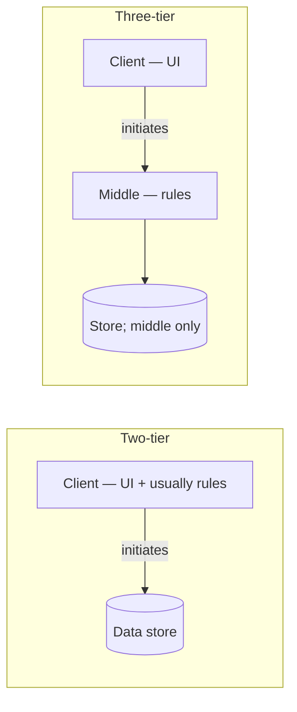

# Client–server architecture

**See also:** [request–response (A1)](RequestResponse.md) · [microservice architecture (E2)](Microservices.md) · [service-oriented / service-based (E6)](ServiceOriented.md) · [monolithic architecture (E1)](Monolith.md) · [layered architecture (E3)](LayeredArchitecture.md) · [event-driven architecture (E4)](EventDriven.md) · [API gateway and BFF (C6)](ApiGateway.md) · [REST, RPC, and service dataflow](../data-intensive-design/rest-rpc-dataflow.md) · [style-selection facts](../../.cursor/skills/arch-style/references/style-selection.md) · [ADR 0005](../../docs/architecture/adrs/application/mobile-test-automation/0005-adopt-plain-modular-monolith-partitioned-by-cluster.md) · [external research note (2026-09-13)](../../docs/research/sysdesign/e5-client-server-external-research.md)

Client–server is a **style of roles**, not a protocol and not a deployable count. One side **initiates**; the other **listens**, performs or rejects, and replies (Fielding 2000 §3.4.1). Andrews via Fielding: the client is the triggering process; the server is reactive, usually long-lived, often multi-client. Basic CS does **not** fix where state lives, how many machines exist (a local socket is still CS), how many server processes sit behind one origin, or which connector carries the hop (RPC, HTTP, a message). [A1](RequestResponse.md) owns the **wire** — HTTP/gRPC unary semantics, connection lifecycle, proxy idle clocks. This card owns **who calls whom**, where UI / rules / data sit, and what you pay the day that call leaves one process.

Quality attributes in play: **independent client evolution** (Fielding §5.1.2 — portable UIs across org domains), **central authority** (one store clients must not bypass), and **operational cheapness on a small estate** (few servers; Azure’s lift-and-shift). The costs are a **server you must run** (RFC 5694 §6: concentrated energy), a **single point of failure unless you replicate inside the style**, **N-tier feature-deploy coupling** (Azure: “monolithic design prevents independent deployment of features”), and the **fallacies of distributed computing** paid in full the day client and server are not one process. There is **no** Client–server row on the [style-selection](../../.cursor/skills/arch-style/references/style-selection.md) matrix — no stars, no typical quantum count. A `—` cell is not a rating.

| Sibling | What stays there |
|---|---|
| **[A1 Request–response](RequestResponse.md)** | REST / gRPC **wire**. Every unary hop under CS is A1. This card does not rewrite idle clocks or safe/idempotent verbs. |
| **[E3 Layered](LayeredArchitecture.md)** | Horizontal bands *inside* a client, a server, or split. IBM’s Contacts app is three *layers*, one *tier* — layers without a network are not E5. |
| **[E1 Monolith](Monolith.md) / E10** | One deployable, often **the server** clients call. E1 = how many deployables; E5 = who initiates. Word-style (Microsoft 1998) can be E1 with no client role. |
| **[E2](Microservices.md) / [E6](ServiceOriented.md)** | Many (or ≤12 coarse) *server-side* quanta. Each hop is still CS. One API + many clients is E5 no matter how many LB replicas sit behind it. |
| **[E4](EventDriven.md) / A2** | Default collaboration is reaction to facts. A queue between web and worker is not the *system* style. |
| **C6 gateway / BFF** | Still presentation (Fowler 2015). [ApiGateway](ApiGateway.md) owns the product; this card owns that mobile is a first-class CS variant. |
| **⊕E11 Serverless** | Who *runs* the server. A function still has clients; E11 starts when the server quantum is no longer a long-lived process. |
| **P2P (RFC 5694)** | An element both provides *and* requests. Many clients ≠ P2P. Hybrids are first-class. |

## Lineage and vocabulary

- **Fielding 2000** §3.4.1 / §5.1.2. CS is “the most frequently encountered” network-based style. REST’s *first* added constraint is CS. Basic CS does not constrain the state split. Variants he names: **LCS** = CS + proxy/gateway (IS two-/three-/multi-tier); **CSS** = no session state on the server; **RS** = state on the server (TELNET/FTP); **RDA** = client sends SQL and must know the schema; **COD** = know-how shipped to the client (thickens a thin Web client without a store install).
- **Meier 2008-09-06.** *Layer* = component type; *tier* = physical pattern (two-/three-/N-tier). Same cut as Fowler 2015 and Azure.
- **Microsoft 1998** (Wrox). Monolith (Word); **two-tier** = “traditional client-server” (UI + rules on the client; Oracle/SQL Server; VB/PowerBuilder; variant: stored procedures); **n-tier** (n ≥ 3): client never hits data. **IIS 6 two-tier**: bank-teller clients share one DB; the server is overwhelmed as clients grow; rule changes become expensive source edits.
- **IBM** (fetched 2026-09-13; `ms.date` not recovered). Two-tier = original CS (direct data-tier access). Contacts app = three-*layer*, one-*tier*. IBM’s “faster because teams per tier” **contradicts** Fowler 2015 — contested, not a law.
- **Azure N-tier** (fetched 2026-09-13; `ms.date` not on the page). **Strict** vs **relaxed**; **closed** vs **open**. Closed limits coupling and can create pass-through latency; open reduces hops. Several layers may share one tier. Styles table: N-tier = “traditional business domain; frequency of updates is low” vs Microservices = “complicated domain; frequent updates.”
- **Fowler.** *Presentation Domain Data Layering* (2015-08-26) — logical layers; a BFF is still presentation. *First Law* (2004-11-01) — “Don’t distribute your objects.” *Remote Facade* (2003-03-05) — coarse facade, **no domain logic**. *Microservices and the First Law* (2014-08-13) — remote calls are orders of magnitude slower and can fail; cookie-cutter replicas do not raise distribution complexity. Names the **Fallacies** plus Waldo et al.
- **Newman, BFF (2015-11-18).** Mobile: less screen, fewer/different calls, battery + data-plan cost of many connections. One BFF per *experience*.
- **RFC 9110** §3.3 (June 2022). HTTP “is a client/server protocol.” Roles are **per connection**. Statelessness is HTTP’s, not Fielding’s *basic* CS.
- **RFC 5694** (Nov 2009). P2P vs CS; no sharp border; hybrids common. App. A: CS concentrates processing/storage. NATs were designed not to break CS and *did* break receive-first P2P until ICE-class traversal.
- **van Steen & Tanenbaum.** Landing page cite “2023”; v4.03 January 2025. Chapter body not fetched. 2nd-ed solutions: three-tier = three logical layers, each *in principle* on a separate machine; **vertical** vs **horizontal** distribution. 2016 paper: hide WAN latency by moving form validation onto the client.
- **Richards & Ford via [style-selection](../../.cursor/skills/arch-style/references/style-selection.md).** Quantum definition + the eleven fallacies (ch9). **No Client–server row.** Cite; do not invent stars or a typical count.

## What the style is — and is not

**Is.** Role asymmetry across a process or network boundary. Unconstrained in basic CS: session state (CSS is extra); machine count; server-process count (one origin, a replica farm, or server-as-client-of-DB — the last is how three-tier appears); connector. Buys (Fielding §5.1.2; Azure Benefits): independently evolving clients; a server simplified toward data and rules; one authoritative store; cheap lift-and-shift.

**Is not.**

| Look-alike | Why it is not E5 |
|---|---|
| **HTTP / “we have an API”** | RFC 9110 §3.3 is a *protocol* role. The style is who initiates and where work sits. |
| **A1 sync exchange** | Wire semantics. CS can ride HTTP, gRPC, a socket, or a message; A1 specifies how REST/gRPC *express* the hop. |
| **E3 layers in one process** | Fat client or a monolith with no network. E5 starts when someone initiates *across* a boundary. |
| **E1 one deployable** | Often *the* server. Same process can be E1 + E5 (server) or E1 only (Word). |
| **E2 many services** | Azure: N-tier = *horizontal* tiers; microservices = *vertical* split, own data. Replicas behind one API are still one CS server side. |
| **P2P** | RFC 5694 §2: peers both provide and request. |
| **⊕E11** | A function still has clients; the style change is the server quantum no longer being long-lived. |

### A1 is the wire; this card is the roles

[A1](RequestResponse.md) answers **how one exchange travels** (safe/idempotent verbs, HTTP/2 streams, GOAWAY, proxy idle). This card answers **who is allowed to start that exchange, and which machine holds UI / rules / data**. Same hop, two decisions. A browser talking REST to a monolith is E5 + E1 + A1. A gRPC unary call between two microservices is E2 + A1; the *roles* on that hop are still client and server (RFC 9110: roles are per connection). Do not pick E5 because “we use HTTP,” and do not skip E5 because “we already wrote the REST card.”

| Question | Owner |
|---|---|
| Method, status, trailers, connection reuse, idle clocks | **A1** |
| Who initiates; two-tier vs n-tier; fat / thin / mobile | **E5** |
| Layers inside a process | **E3** |
| How many *server-side* deployables / data owners | **E1 / E2 / E6** |

The hop tax once you leave one process is not this card: [timeouts](TimeoutsDeadlines.md) (C7), [retry + budget](RetryBackoff.md) (C2), [breaker](CircuitBreaker.md) (C1), [idempotency](Idempotency.md) (C9). HTTP/gRPC versions and proxy idle stay on A1. Group E has no library-defaults section.

## Typical quantum count — Uncertain

[style-selection](../../.cursor/skills/arch-style/references/style-selection.md) has **no Client–server row**. Do not invent “2+.” Do not fill a star scorecard.

| Claim | Status |
|---|---|
| Typical quantum count for E5 | **Uncertain** |
| Star-rating scorecard for E5 | **—** (no row; not a rating) |

Quantum *machinery* (definition only, ch7): smallest independently runnable part; **the database is inside the quantum**; shared DB ⇒ **one** on that side; sync can silently merge. Azure *tiers* are scalability / security / reliability boundaries, not automatically new quanta. Cookie-cutter replicas do **not** raise the count (Fowler 2014). A second server-side thing with its *own* data is a *style change* toward E2/E6, not “more CS.” Workspace “one server-side quantum” (ADR 0005) is a local pick, not a style-selection FACT. Whether an org-unowned browser or a BFF is a quantum is left open — C6 owns the BFF.

## Decision mechanics

### Two-tier vs n-tier — this card owns placement

| Placement | Client holds | Middle | Data | Source |
|---|---|---|---|---|
| **Two-tier** | UI + usually rules | — | RDBMS (or rules in stored procedures) | Microsoft 1998; IBM; IIS |
| **Three-tier** | UI only | Rules; client never hits data | Store accepts middle only | Microsoft 1998; IBM; Azure |
| **N-tier** | UI | One or more middle tiers (optional queue) | Store; optional cache | Azure; Fielding LCS |

IBM: two-tier *is* the original CS. Microsoft 1998: “traditional client-server” = two-tier. Azure’s **closed + strict** walk forces every call down the stack — evolvability (a layer cannot skip) against pass-through latency. **Open + relaxed** lets a hop skip a band; fewer hops, more coupling. Several *layers* may share one *tier* (Meier; IBM Contacts). A CRUD-only middle tier is Azure’s named challenge — E3’s Architecture Sinkhole. Collapse the hop; do not invent a new style. Do **not** add tiers that do not change scalability, reliability, or security boundaries (Azure).

Session placement is a *variant*, not a new style. Fielding **CSS** keeps no session on the server (HTTP’s message-layer statelessness is RFC 9110 §3.3, not basic CS). **RS** parks session on the server (TELNET/FTP; a sticky web session). RS without affinity is a C5 problem; CSS plus a fat client cache is a freshness problem. Neither changes the roles.

### Fat vs thin vs mobile

| Kind | Where the application lives | Typical cost | Sources |
|---|---|---|---|
| **Fat** | Most app code (sometimes a local cache) on the client; server is files/DB | Version skew; install; client holds schema (RDA) | Microsoft 1998 / IIS; Fielding RDA |
| **Thin** | Presentation only (browser, remote display, generic session client) | Server-session / RS tax; network on every gesture | Fielding RS; Newman 2015 (install cost eliminated) |
| **Mobile (native)** | Fat-*ish* local UX, cache, offline, sensors; thin coarse API | Store-update lag; chatty general-purpose APIs; one shared API as a release bottleneck | Newman BFF 2015; Fowler 2015 |

COD thickens a thin Web client without a store install; native mobile cannot use that as its primary ship path. Newman: do not hang a chatty general-purpose API off the same facade a desktop used. C6 decides the BFF; E5 records that mobile is a CS variant, not a new style.

### The network is the coupling surface

The moment client and server are not one process, the design pays the **eleven fallacies** ([style-selection](../../.cursor/skills/arch-style/references/style-selection.md) ch9 — cite, do not re-derive): network is reliable / latency is zero (know p95–p99, not averages) / bandwidth is infinite (stamp coupling) / network is secure / topology never changes / only one administrator / transport cost is zero / network is homogeneous / **versioning is easy** / **compensating updates always work** / **observability is optional**.

Fowler 2014: a remote call is not an in-process one. **This is E5’s coupling surface.** A1 then specifies how REST/gRPC *express* it.

Every gesture is remote unless you batch (Remote Facade) or move work onto the client (2016 van Steen paper) — design to p95–p99. Fat RDA / stamp-coupled DTOs hit bandwidth (Newman: a mobile *product* constraint). The client is outside the perimeter (Azure: data accepts *only* the middle tier). Clients roam; NATs (RFC 5694 App. A); store-signed binaries. Inter-process is “orders of magnitude” more expensive even on one machine (Remote Facade). Mixed platforms are Azure’s N-tier *benefit* and an A6 tax. Versioning: “servers upgrade first, clients second” ([rest-rpc-dataflow](../data-intensive-design/rest-rpc-dataflow.md)). Lost-reply vs lost-request is C9. Client vs server telemetry is D2/D3 → D4/D5. The public Internet *grew around* CS (clients open out). Reverse that and CS is the wrong shape unless you add polling, [WebSockets](WebSockets.md) (A3), or a relay.

## When to use

Work is **request-shaped**, **authority is centralized**, and **independent client evolution** matters more than removing the server:

- UI vs storage evolve separately (Fielding §5.1.2).
- One store clients must not bypass (Microsoft 1998; Azure NSG).
- Slow-changing domain, or lift-and-shift of an existing N-tier (Azure).
- Two-tier until per-client DB connections or UI-buried rules break (IIS).
- Endpoints cannot receive unsolicited connections (RFC 5694 App. A).
- A well-dimensioned server is acceptable (RFC 5694 §6: ordinary queries still beat a DHT; battery peers consume more than CS clients that sleep).

## When not to use

Do not pick E5 as the *system* style when:

- Work is **peer-symmetric** (P2P, maybe with a CS tracker).
- Many **server-side** capabilities must release independently (E2; Azure’s N-tier “monolithic” challenge). That is a leave toward [E2](Microservices.md) / [E6](ServiceOriented.md), not more CS tiers.
- The middle tier only forwards CRUD (Azure; E3 sinkhole) — collapse it.
- The API is 100 fine-grained getters (First Law) — coarsen (Remote Facade + DTO), do not add hops.
- The default collaboration is reaction to events ([E4](EventDriven.md)).
- You refuse to operate a server (E11).

## Migration in and out

**In.** Single process → two-tier (pay the network + C9). Fat two-tier → three *logical* layers, *then* three physical tiers — layer *before* adding Web/mobile (Fowler). On-prem N-tier → cloud N-tier with minimal refactor (Azure). Add CSS + cache + intermediaries without leaving CS (Fielding §5.1.2–5.1.6).

**Out.** N-tier → Web-Queue-Worker (CS remains at the HTTP edge). N-tier → E6/E2 via **[B4](StranglerFig.md)** + C6 when update frequency justifies the tax. CS → P2P/hybrid, keep CS for enrollment (RFC 5694 §2). Long-lived server → E11 (A3/A4 session assumptions usually break).

## Worked example — CS around an E1/E10 server

[style-decision.md](../../docs/architecture/worksheets/mobile-test-automation/style-decision.md) (2026-07-26) + [ADR 0005](../../docs/architecture/adrs/application/mobile-test-automation/0005-adopt-plain-modular-monolith-partitioned-by-cluster.md): **one quantum**, one Spring Boot deployable, one primary datastore. That quantum is **deployed as a server**. Operators, CI, and device runners *initiate*; the process *reacts*. Perimeter = **E5**. Body = **E1 / E10**. Presentation/domain/persistence folders inside the JAR are **E3 inside the server** (the kata already rejected E3 as *macro* style). Each unary hop is **A1**. Cookie-cutter replicas stay one server-side quantum (shared DB). A future extract with its own store would *leave* E5 — ADR 0005 names **E6**, not a CS-tier split.

**Two-tier pressure, same sources.** IIS bank-teller: fat client knows the schema; one DB. Fits until client count overwhelms the store or a Web/mobile channel appears. Three-tier: Remote Facade + DTO (Fowler 2003); DB accepts only that tier (Azure NSG). Mobile: do not hang a chatty general-purpose API off the same facade (Newman); C6 decides the BFF. Style quantum count stays **Uncertain**; the workspace pick is independently “one server-side quantum.”

## Failure modes of the style itself

- **Server as SPOF** (RFC 5694 App. A; IIS as clients grow). Mitigate *inside* the style (replicas, HA data). Do not silently slide into E2 because one origin died.
- **Lost reply → duplicate execution.** TCP does not help. C9 owns the key; E5 owns that every CS hop can lose the reply after the write landed.
- **Fat-client / store-update version skew** (IIS; Fielding RDA; Newman). “Servers upgrade first, clients second” is the rest-rpc rule; a store-signed binary ignores it.
- **CRUD-only middle tier.** Slower two-tier (Azure; E3 sinkhole). Collapse the hop.
- **Chatty objects** (First Law). Remote Facade + DTO, not more tiers.
- **Server session without affinity** (Fielding RS vs CSS; C5 stickiness).
- **Shared-DB “N-tier”** that thought it was many quanta. Shared store ⇒ one quantum on that side.
- **NAT mismatch.** CS assumes clients open out. Reverse it → polling, A3, or a relay.
- **D2 vs D3 observability split.** The client is outside the perimeter; server metrics do not see its battery, radio, or store-update lag.
- **Tier-team staffing.** Three tier-teams recreate Fowler’s layer-team antipattern (IBM’s speed claim is the contested one).

## Trade-offs

Qualitative, source-backed. **No invented FSA stars.** E5 scorecard = `—`.

| Concern | CS / N-tier wins | CS / N-tier loses | Source |
|---|---|---|---|
| Independent client evolution | Portable UI across org domains | Fat-client / store-update versioning | Fielding §5.1.2; Newman |
| Authority / security | One store; middle tier as internal firewall | Server (or tier) is the SPOF unless replicated | Microsoft 1998; IBM; Azure; RFC 5694 App. A |
| Ops / cost (small estate) | Few servers; cheap lift-and-shift | You *must* run a server; concentrated energy | Azure Benefits; RFC 5694 §6 |
| Feature deploy independence | — | N-tier is “monolithic” for features | Azure Challenges |
| Scale of one hot path | Scale a *tier* (Azure VMSS) | Two-tier: per-client DB connections; cookie-cutter clones cold with hot | IIS; Fowler 2014 |
| API grain | Coarse Remote Facade | Chatty objects / client-side SQL (RDA) | First Law; Fielding RDA |
| Network fallacies | Fits NAT/firewall Internet (clients open out) | Paid in full the day you leave one process | style-selection ch9; RFC 5694 App. A |
| vs P2P / E2 / E3 | Ordinary queries; battery clients sleep; layers *inside* a process stay cheap | No infrastructure / frequent independent *server* releases / distributing *at* layer boundaries | RFC 5694 §6; Azure styles; E3 |

[A1](RequestResponse.md) decides **how the hop is expressed**. [E1](Monolith.md) / E10 decide **how many deployables the server side is**. [E2](Microservices.md) / [E6](ServiceOriented.md) decide **whether the server side has earned a second quantum**. This style decides **who initiates, where UI / rules / data sit, and whether that split is worth the network**.

## Sources

Verified 2026-09-13; the full URL list, per-claim provenance, and items deliberately left out (no typical quantum count, no CS star row, Deutsch/Gosling’s original eight not re-fetched, van Steen 4th-ed §2.3 body, Azure/IBM `ms.date`) are in the [external research note](../../docs/research/sysdesign/e5-client-server-external-research.md). Quantum machinery and the eleven fallacies are FACT from [style-selection.md](../../.cursor/skills/arch-style/references/style-selection.md) — do not invent an E5 row.

- Canon: Fielding 2000 §3.4.1 / §5.1.2; Meier 2008 (layer vs tier); Microsoft 1998 two-tier / n-tier; IIS 6 two-tier; IBM three-tier; Azure N-tier + styles index.
- Fowler: *Presentation Domain Data Layering* (2015); *First Law* (2004); *Remote Facade* (2003); *Microservices and the First Law* (2014). Newman, BFF (2015).
- RFCs: 9110 §3.3; 5694 (P2P vs CS). van Steen & Tanenbaum landing + 2nd-ed solutions + 2016 latency paper.
- This tree: [rest-rpc-dataflow](../data-intensive-design/rest-rpc-dataflow.md); [ADR 0005](../../docs/architecture/adrs/application/mobile-test-automation/0005-adopt-plain-modular-monolith-partitioned-by-cluster.md); [style-decision](../../docs/architecture/worksheets/mobile-test-automation/style-decision.md).
