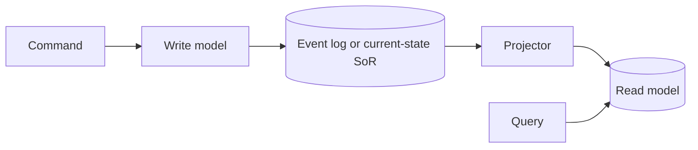

# CQRS and event sourcing

**See also:** [event-driven architecture (E4)](EventDriven.md) · [saga (B5)](Saga.md) · [transactional outbox and CDC (B7)](OutboxCdc.md) · [idempotency and the inbox (C9)](Idempotency.md) · [pub/sub, queues, and streams (A2)](PubSubQueues.md) · [event sourcing and CQRS (data-intensive)](../data-intensive-design/event-sourcing-cqrs.md) · [CDC vs event sourcing; CQRS one-paragraph](../aws/ch08.md) · [style-selection matrix](../../.cursor/skills/arch-style/references/style-selection.md) · [external research note (2026-09-13)](../../docs/research/sysdesign/e12-cqrs-es-external-research.md)

CQRS and event sourcing are **architectural patterns inside a component**, not a Richards/Ford first-class style. [style-selection](../../.cursor/skills/arch-style/references/style-selection.md) has no CQRS/ES row, no star card, no quantum cell. Young (2012) and Vernon: SOA, EDA, and ports-and-adapters shape a *system of systems*; these two shape the *interior* of one bounded context. This catalog still files them at style level because the decision — when to overlay, when the read store leaves the write quantum — is a style decision. Do not invent stars.

**CQRS** is Young’s (2010-02-16) split: two objects where there was one, cut on Meyer’s command/query line — typically `CustomerWriteService` / `CustomerReadService`. That *is* the pattern. Messaging, eventual consistency, and a second database are *enabled* architectures, not CQRS itself.

**Event sourcing** is Fowler’s (2005-12-12): the ordered event log is the system of record; current state is a function of those events. Name events in the **past tense** because they are facts. Projections are **derived** and must be rebuildable from the same log in the same order — already the contract in [event-sourcing-cqrs](../data-intensive-design/event-sourcing-cqrs.md). Do not rewrite that note.

The two are **independent and often paired**. Event sourcing pulls you toward CQRS (a per-entity stream cannot answer “all users named Greg”). CQRS needs nothing from event sourcing. Fowler (2017-02-07): CQRS “isn’t really about events”; event sourcing “need not be asynchronous.” Using topics is [E4](EventDriven.md); keeping a log as SoR is this card.

Quality attributes in play: **query/write isolation** (each model can be good at one job); **independent scale** of reads vs writes *only after stores split*; **audit / temporal query / rebuild** once the log is SoR. The costs are a second conceptual model, projection lag, schema evolution on two sides, erasure vs an immutable log, and Fowler’s 2011 finding that the **majority of CQRS cases he had seen were harmful**.

Young’s 2010 minimum is two *objects* at the service boundary. Separate *data* models are an enabled next step (Fowler, Azure, Vernon), not a contradiction and not a requirement. Stop at two interfaces if the pain was model complexity. Split stores only when scale or schema earn it.

## Lineage and vocabulary

- **Meyer, Command–Query Separation.** Fowler’s bliki (2005-12-05): methods are queries (return a result, no observable state change) or commands (change state, no return). A *method* rule. CQRS is that split lifted onto *objects*.
- **Young, “CQRS, Task Based UIs, Event Sourcing agh!” (2010-02-16)** and ***CQRS Documents* (November 2010).** After confusion with CQS, the name CQRS. Command side: behavioral contract and `GetById`. Query side: thin DTO projection that bypasses the domain. Command wants transactional, near-3NF data; query can be eventually consistent and denormalized. Events are the *best-known* integration between two stores, not CQRS itself. The pair is **symbiotic, not identical**. Task-based UI is required for DDD’s application service (verbs other than CRUD), **not** for CQRS.
- **Young, “CQRS is not an Architecture” (2012-09-09).** Patterns inside a system or component. “The largest failure I see from people using event sourcing is that they try to use it everywhere.”
- **Dahan, “Clarified CQRS” (2009-12-09).** Drivers: **collaboration** (many actors on the same data) and **staleness** (shown data is already stale). Commands are **sent**, not published; events are published. Event sourcing is one possible command-side implementation, next to transaction script / domain model.
- **Vernon, “Really Simple CQRS” / “And Then This Happened” (Kalele, fetched 2026-09-13; posts undated).** Two interfaces, then typically two state models. The query model is a **projection** of command-model changes — via Domain Events *or* by projecting the mutated aggregate’s full state. Events are not required. `WarbleUpdated` “has actually said nothing.” Do not adopt Domain Events just to declare a log the single source of truth. *Effective Aggregate Design* Part II (2011): aggregates that reference only by identity make UI assembly expensive; CQRS is the named escape. IDDD_Samples: `iddd_collaboration` uses ES + CQRS (LevelDB journal + MySQL read model, **one thread**); `iddd_identityaccess` stays ORM.
- **Fowler, Event Sourcing (2005-12-12)** and **CQRS (2011-07-14).** ES facilities: complete rebuild, temporal query, event replay. Official SoR can be the log *or* current application state (the log then is audit). Snapshots are an optimization, **not** a second SoR. CQRS: apply only on specific portions (a DDD Bounded Context); otherwise a ReportingDatabase for the hard queries. **Fowler 2017** un-collapses four “event” meanings — [E4](EventDriven.md) already owns notification / ECST; this card owns the other two. The project-manager story (“event sourcing doubled the work because we update two models”) is **CQRS**, not event sourcing.
- **Azure Architecture Center.** CQRS (`ms.date` 2025-02-20): two levels — separate models in **one** store, then in **different** stores. Messaging is not a requirement. Event Sourcing (`ms.date` 2026-03-27): complex; costly to migrate *to or from*; “for most systems and most parts of a system, traditional data management is sufficient.” **Do not confuse an event store with a message broker.** Intent-focused events (`SeatsReserved`) beat state-delta events (`remaining seats = 42`).
- **This workspace.** [event-sourcing-cqrs](../data-intensive-design/event-sourcing-cqrs.md): command → validated **fact** → past-tense event; views must be **reproducible**; order matters; deletion event, not in-place delete; GDPR vs immutability / crypto-shredding; side-effects must not re-fire on rebuild. [aws/ch08.md](../aws/ch08.md): CQRS = separate command/query *interfaces*; ES = immutable events as SoR; CDC captures *state* without storing intent; saga is the sibling *transaction* pattern.

| Term | Meaning here |
|---|---|
| **Command** | Intent, sent to one handler. Does not return the query model. Dahan: sent, not published. |
| **Query** | Returns data; no observable write. After a split, it does not walk the write aggregate except `GetById`. |
| **Event** | A past-tense fact. The write model *raises* it; projectors and integrators *consume* it. |
| **Projection / read model** | Derived, rebuildable view. Not a second SoR. |
| **Snapshot** | Rehydrate optimization (Fowler). Discard-and-rebuild must still be legal. |
| **Working copy** | Fowler 2017: most processing should read this, not the log. |

## What they are — and are not

| Combination | What you have | Typical SoR | Async required? |
|---|---|---|---|
| **Neither** | CRUD / one model | Current-state rows | No |
| **CQRS only** | Two models; write side still stores current state | Write-side tables | No. Same DB is the common first step. |
| **ES only** | Log is SoR; working copy is *not* a separate query *model* | Event log | No. Fowler 2017: `git commit` is sync. |
| **CQRS + ES** | Log is the write model; projections are the query model | Event log | Often yes *between* store and projections, not as a definition. |

**Is not.**

| Confusion | Why it is a different card |
|---|---|
| **E4 event-driven** | Style of *collaboration* (broker vs mediator). A current-state SoR can still be E4. An in-process event log can still be E12. |
| **CDC / outbox (B7)** | [ch08](../aws/ch08.md): CDC replicates state from a database log. B7 publishes a fact *about* a row that remains SoR. Event sourcing *is* the write. |
| **Saga (B5)** | Multi-step compensation across services. This overlay can *emit* the events a saga consumes; it does not replace compensation. |
| **A2 channel** | Once an event is on a queue, topic, or log: competing consumers, ordering, DLQ. Retention-forever Kafka is not a substitute SoR (Azure 2026). |
| **“We added two handler interfaces”** | Young’s split is responsibility (and optionally models), not a library. No library-defaults section — Group E has none. |
| **A system-wide style** | Fowler 2011 Bounded Context; Azure ES “not all-or-nothing”; Young 2012; Vernon samples mix ES and ORM. |

## Decision mechanics

### When to split read and write models

Split when the models *interfere* — repositories grow paging getters, aggregates blur to feed DTOs, one model does neither job well (Young smells; Fowler “same conceptual model… does neither well”; Vernon: users view data in different quantities than they mutate).

Also when:

- Collaborative, high-contention writes — a coarse “Save this DTO” collides; task-grain commands shrink the window (Dahan; Azure).
- Large **read/write disparity** so the sides must scale or optimize independently (Fowler; Young “two or more orders of magnitude”).
- A complex DDD bounded context whose ubiquitous language already has verbs (Fowler; Young). Azure: write model is a full command stack; read model is DTOs, no domain logic.
- Aggregates that reference only by identity make UI assembly a multi-repository tax (Vernon 2011).
- Separate teams on write logic vs UI/query — Azure names this; buy it only if the org actually splits that way.

Do **not** split for simple CRUD (Fowler: majority case; Azure). Prefer a **ReportingDatabase** for a few heavy queries over splitting *all* queries. Do not apply to the whole system.

Same store first. Fowler 2011 / Azure 2025: the database *is* the communication. You have already split models; you have not taken dual-write or a second quantum. Split stores only when load or schema really diverge — then [B7](OutboxCdc.md) so the row and the event commit together, [A2](PubSubQueues.md) for the channel, [C9](Idempotency.md) on the projector.

### When to source events

Source events when you need **intent** in the data (`MovedHome`, `SeatsReserved`), not only the latest row. Audit, temporal query, rebuild, or parallel/retroactive models — Fowler: these are **hard to retrofit**; if you reasonably expect them, decide now. Also: write contention on a hot current-state row (Azure conference last-day bookings — append + optimistic concurrency on the stream); multiple rebuildable views from one log; a domain that already speaks events so the extra cost is small (Azure). Vernon: only after concrete scenarios prove Domain Events *strengthen the model*.

Do **not** source events for current-state CRUD, MVPs / short-lived systems (Azure: upfront event design + schema strategy + projections rarely pay back), views that must be real-time identical, mostly-static reference data, or a team that cannot operate schema evolution and projection lag. Fowler: pick the event *interface* for a return, not as default.

**Do not combine them by default.** Azure CQRS: complexity “specifically when combined with Event Sourcing.” Fowler 2017: three separable costs (two models, a log, async). Pay only the ones that bounded context needs.

### Quantum implications — FACT only

style-selection has **no E12 matrix row**. Do not invent a star rating or a canonical integer. What *is* sourced is ch7 quantum machinery plus Fowler/Azure share-vs-split:

| Shape | Quanta | Bought | Spent |
|---|---|---|---|
| CQRS **same store**, same deployable | **1** | Separate models / query shapes; no dual-write | No independent store scale; lock contention can remain |
| CQRS **same store**, read replicas of the write DB | still **1** | Read scale | Replica lag is replication, not a second model |
| CQRS **separate stores**, independently deployed, only async between them | **2+** | Independent scale and storage tech | Lag; B7; C9; two schemas |
| ES **in-process** (including inside a modular monolith) | **1** | Replay / audit without a network | Rebuild cost; erasure; no independent read scale |
| ES + **remote** projections with their own stores | **1 write + N read** | Independently scale reads | Projection lag; “what is current?” |
| Query side HTTP-GETs the command side on every read | **entangled → 1** | Diagrams that look split | style-selection sync-merge |

Typical field shape (Young / Journey / Azure / Vernon): apply inside **one bounded context**; start at quantum 1; split stores only when they earn it. Vernon’s `iddd_collaboration` already uses two stores in one thread — two *schemas*, still one quantum until the projector can die without taking the writer. Splitting stores on one shared cluster and one release train advertises many quanta and ships one — the same “4 not 5 because of the database” caveat style-selection records for E4.

### Migration in and out

**In — add ES (or CQRS) inside a modular monolith (E10).** Incremental, not a style swap. The host stays quantum **1**.

1. Keep CRUD where the language *is* Create/Update/Delete (Young; Azure selective-apply; Vernon’s identity context).
2. Task-based commands on the write API (“Book seats”, not “Set ReservationStatus”). Still one model.
3. **CQRS, same store** — split the service surface; domain loses query methods except `GetById`. Stop here if the pain was model complexity, not scale.
4. Optional: a second read schema still in-process (Vernon’s LevelDB + MySQL). Still E10.
5. Optional: publish across the process boundary via **[B7](OutboxCdc.md)**. Do **not** dual-write. CDC is not “we are now event-sourced.”
6. Optional: event-source the write model in *that* bounded context. Azure: costly to migrate *to*. Snapshots from day one if streams will be long (Azure; Fowler).
7. Privacy **before** the first personal field hits an immutable log — [event-sourcing-cqrs](../data-intensive-design/event-sourcing-cqrs.md) (externalize or crypto-shred); Azure ES 2026 repeats both.

Strangler ([B4](StranglerFig.md)) is the cutover *mechanism*; Event Interception is the seam [E4](EventDriven.md) already names. This card is what you install *behind* that seam.

**In — pair with E4.** When collaboration between contexts is already reaction-to-facts, E4 owns broker vs mediator. This overlay supplies persistence *inside* a processor. Pairing stacks three costs (E4 async + CQRS two models + ES log). [ch08](../aws/ch08.md) hybrid ecommerce still applies — E12 does not replace that E4/B5 choice.

**Hybrid (the common steady state).** Journey / Azure / Young 2012 / Vernon: CQRS+ES in the booking / ledger / collaboration context; CRUD for profile and config; E4 or [B5](Saga.md) for the *cross*-context flow.

**Out.** From split-store CQRS: stop projectors; serve queries from the write store or a replica. From ES: Azure’s own warning — costly. Practical exit: replay into a current-state store, switch the SoR, keep the log as *audit* (Fowler already allows this). You lose cheap rebuild of *new* views. From “CQRS everywhere”: shrink back to the contexts that earned it.

Distributed-computing fallacies this overlay pays for when stores leave process (style-selection ch9 — name, do not score): **the network is reliable** (A2 / B7); **latency is zero** (read-your-writes after a command); **versioning is easy** (upcasters; in-place migration is Azure’s last resort); **compensating updates always work** (deletion events, B5); **observability is optional** (projection lag is a user-visible correctness bug).

## Worked example — conference seat reservation

Verified from Azure ES 2026 (same conference domain as Microsoft Journey 2012 and [event-sourcing-cqrs](../data-intensive-design/event-sourcing-cqrs.md)). Paraphrase only.

**Domain fact.** A finite seat pool. Attendees book and cancel. Last-day load contends on “how many seats remain.” Bulk company orders, speaker holds, room-capacity changes — same shape: *availability is a query that fights the write model*.

**CRUD (not this card).** A `bookings` row plus a `seats_remaining` counter, updated in place. Azure: simple, and a bottleneck (row lock on the counter).

**CQRS only, same store.** Commands: `ReserveSeats`, `CancelReservation`. Queries: `FindAvailability`, organizer dashboard, badge-print file — thin read layer, possibly SQL views in the *same* database. Quantum **= 1**. Models split; the log is not SoR.

**CQRS, split stores.** Write model commits the reservation. `SeatsReserved(conferenceId, seats=2)` leaves via [B7](OutboxCdc.md) and [A2](PubSubQueues.md) if it leaves process. A projector updates a denormalized `availability` document. Read-your-writes is *not* guaranteed — treat staleness as Dahan’s designed-in property, or return a write-side confirmation DTO for that one command. Two persistable models → **two quanta** only if the projector’s store and deployable can die without taking the writer.

**Event-sourced write + CQRS reads (Azure workflow).**

1. UI issues `ReserveSeats(2)`.
2. Handler **rehydrates** `SeatAvailability` from that conference’s stream (snapshot + tail).
3. Domain accepts or rejects. On accept it raises `SeatsReserved`.
4. Append with **optimistic concurrency** on the stream. Two handlers who both saw five seats: one append wins, the other reloads and retries (Azure). That is not a [saga](Saga.md) and not an E4 topology.
5. Handlers (a) persist if a queue was the ingest path, (b) update the availability view, (c) integrate (email, badge). Rebuild of (b) must **not** resend (c) — workspace note; Fowler gateway-on-replay.

**Cancellation** is a new `ReservationCanceled` event, not an update of `SeatsReserved`. The original fact remains.

**What this example does not decide.** Queue vs log vs bus (**A2**). Outbox vs “listen to the event store” (**B7**). Whether payment is a choreographed saga (**B5**). Whether the conference service is an E2 service or an E10 module. Whether identity or billing are event-sourced — Journey / Vernon samples say no.

## Failure modes

- **God event store.** One log / one product as SoR for every bounded context. Young 2012’s named largest ES failure; Vernon’s own samples keep identity on ORM; Azure: apply selectively (payment ledger, order pipeline), keep CRUD for profiles and config. The sibling failure is **broker-as-store**: Azure ES 2026 — Kafka-class brokers typically lack per-entity stream queries and optimistic concurrency. You get [A2](PubSubQueues.md) fan-out and an unqueryable heap.
- **Snapshot debt.** Fowler: snapshots are an optimization, not a second SoR. Azure / [ch08](../aws/ch08.md): full replay of long histories is expensive; snapshot + tail is how you rehydrate. Skip snapshots → command latency grows with stream length. Treat the snapshot as SoR → you can no longer delete a projection and rebuild it. Never rebuild, only incrementally patch → new views are no longer cheap, which was the reason to source events. Azure: take snapshots from day one if streams will be long; do not discover the debt on the first last-day booking spike.
- **Conflating the three costs.** Fowler 2017: two models ≠ a log as SoR ≠ async. Teams “doing event sourcing” who complain about updating two models are paying CQRS.
- **Dual-write when stores split.** Azure CQRS points at Transactional Outbox. That is **[B7](OutboxCdc.md)**. A second `INSERT` into the broker after `COMMIT` is the bug B7 exists to remove.
- **State-delta / `Updated` events.** Azure: `remaining = 42` is a change log without intent. Vernon: `WarbleUpdated` says nothing. New read models cannot reconstruct *why*.
- **Non-deterministic projections.** Do not re-fetch FX rates on replay — put the rate in the event (Fowler 2005 External Queries; workspace note). Do not resend confirmation email on rebuild.
- **Erasure vs immutability.** Workspace + Azure 2026: GDPR-style deletion collides with an append-only log. Externalize PII or crypto-shred *before* the first personal event. In-place rewrite of history is Azure’s last resort and breaks the audit trail.
- **Read-your-writes surprise.** A UI that `GET`s the read model 50 ms after `POST` will flake. Read the write side for that confirmation, or show “accepted.”
- **Side-effectful “projections.”** Mixing “update the dashboard” with “charge the card” on the same consumer. Rebuild then double-charges. Split state projections from integration events (Azure: ES events are often too low-level). Compensation across *services* is **[B5](Saga.md)**. Optimistic-concurrency retries belong on [C2](RetryBackoff.md), bounded — not an infinite reload loop.

## When not to use

- Simple CRUD-style UI and data access are sufficient (Fowler majority; Azure).
- Short-lived MVP — the upfront event design does not pay back (Azure).
- Projections must be real-time consistent with the write — eventual consistency is inherent once stores split or projectors leave process.
- Mostly-static reference data.
- The team cannot operate upcasters, projection lag, and rebuild drills. Azure: antipatterns are costly to reverse.
- You bought a broker and want a SoR. That is still [A2](PubSubQueues.md).
- Cookie-cutter “every E10 module / every E2 service is CQRS+ES.” Young’s named failure.

## Trade-offs

| Decision | Buy | Spend |
|---|---|---|
| Adopt CQRS at all | Models that can each be good at one job; optional independent scale | Two conceptual models; Fowler’s “majority harmful” risk |
| CQRS, **same** store | Split without dual-write or eventual consistency | No store-level scale-out; still one quantum |
| CQRS, **split** stores | Scale/tech per side; denormalized reads | Lag; B7; C9; two schemas to evolve |
| ReportingDatabase instead of full CQRS | Offload *hard* queries; keep one model for the rest | Not a general query path |
| Adopt ES | Rebuild, temporal query, audit, intent, append-only writes | Awkward interface; upcast; external replay; erasure; costly exit |
| ES **without** CQRS | Sync working copy (git-shaped) | Cannot query across streams cheaply |
| CQRS **+** ES | Write model *is* the integration model; cheap new views | Three costs stacked (models + log + usually async) |
| Add ES **inside E10** | Replay/audit without leaving the one-quantum host | Module complexity; erasure; still no 4★ FT |
| Pair with **E4** | Processors react; one processor may keep a log as SoR | Three costs; easy to confuse topics with a store |
| Broker as the event *store* | Familiar A2 ops | No per-entity OCC / stream query — Azure’s wrong tool |
| ES everywhere | Cookie-cutter guideline | Young’s named largest failure |

No library-defaults section — Group E has none. EventStoreDB / Marten / Axon / Kafka-as-store tuning stay off this card.

## Sources

Verified 2026-09-13; the full URL list, per-claim provenance, and items deliberately left out (Young 2010 live origin 502; Young’s 2010 “less expensive” cost claim; *IDDD* book body; Journey book body; product defaults) are in the [external research note](../../docs/research/sysdesign/e12-cqrs-es-external-research.md). Star ratings were **not** invented — E12 has no style-selection row. Items already in this tree are cited, not rewritten: [event-sourcing-cqrs](../data-intensive-design/event-sourcing-cqrs.md), [ch08](../aws/ch08.md), [E4](EventDriven.md), [A2](PubSubQueues.md), [B7](OutboxCdc.md), [B5](Saga.md), [C9](Idempotency.md).

- Canon: Meyer / Fowler CQS (2005-12-05); Fowler Event Sourcing (2005-12-12) and CQRS (2011-07-14); Fowler “What do you mean by ‘Event-Driven’?” (2017-02-07); Young 2010-02-16 + *CQRS Documents* (November 2010) + “CQRS is not an Architecture” (2012-09-09); Dahan, Clarified CQRS (2009-12-09); Vernon Kalele essays + *Effective Aggregate Design* Part II (2011) + IDDD_Samples README; Azure CQRS (`ms.date` 2025-02-20) and Event Sourcing (`ms.date` 2026-03-27); Microsoft Journey Reference 2 (not a top-level approach).
- Workspace: style-selection.md (quantum machinery; no E12 row); [data-models-references.md](../data-intensive-design/data-models-references.md) [65]–[68].
