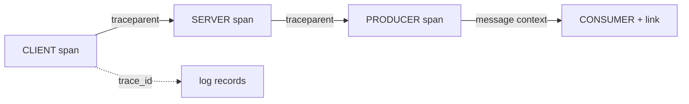

# Distributed tracing and correlation

**See also:** [timeouts and deadline propagation](TimeoutsDeadlines.md) · [request–response](RequestResponse.md) · [publisher–subscriber, queues, and streams](PubSubQueues.md) · [reliability](../data-intensive-design/reliability.md) · [performance](../data-intensive-design/performance.md) · [timeouts and delays](../data-intensive-design/timeouts-and-delays.md) · [NFR references](../data-intensive-design/nfr-references.md) · [Dapper in references](../data-intensive-design/references.md) · [monitoring and observability](../fincancial-data-architecture/monitoring-observability.md) · [external research note (2026-09-13)](../../docs/research/sysdesign/d4-tracing-external-research.md)

A **trace** is the causal graph of one request: a forest of **spans** that share one `trace-id`. Metrics tell you *that* p99 moved; a sampled trace tells you *which* hop. Correlation is joining logs (and exemplars) onto that same `trace_id` so the three signals are one investigation, not three.

This card owns identity on the wire, sampling, propagation, and the failure modes of *tracing itself*. It does **not** own the signal taxonomy or RED/USE frameworks (catalog **D1**), RUM and client crash reporting (**D2**), golden-signal dashboards (**D3**), or SLO / error-budget / burn-rate policy (**D5**). Traces diagnose a page; they are not the SLO.

Sibling **C** cards that look adjacent: [timeouts](TimeoutsDeadlines.md) (C7) is the reliability *control* — bound the call, propagate remaining time, cancel. This card only *records* the remaining budget as a custom low-cardinality duration attribute. There is no standard OTel name for "deadline" in semantic conventions v1.44.0. [Request–response](RequestResponse.md) (A1) owns REST/gRPC *wire* semantics; [queues](PubSubQueues.md) (A2) own channel mechanics. Tracing rides those hops — it does not replace them.

Quality attributes: **diagnosability** (you can name the slow or failing hop) and **detectability** of cross-service causality. The costs are export volume, a new way to leak PII, a sampling bias that undercounts the traces you want, and a collector pipeline that can drop the incident you are looking at.

## Lineage and vocabulary

- **Dapper (April 2010)** ([48](../data-intensive-design/references.md)) — Google technical report dapper-2010-1. A trace is a tree of spans (name, span id, parent id, shared trace id). Roots have no parent. Dapper ids were probabilistically unique **64-bit** integers; W3C/OTel `trace-id` is **128-bit** / 16 bytes, `span-id` stays 64-bit / 8 bytes. Instrumentation lived in threading, control-flow, and RPC libraries. Goals: low overhead, application-level transparency, ubiquitous deployment. Sampling was treated as necessary: "just one out of thousands" still yielded useful traces; a §4 sensitivity table includes rates down to **1/1024**. Root-span create/destroy averaged **204 ns**, non-root **176 ns** (2.2 GHz x86). Payloads were deliberately not logged. Median collection latency **< 15 s**. Cite [48]; do not copy the paper.
- **Open-source line.** Zipkin (Twitter, 2012) popularized B3 headers. Jaeger (Uber, 2015) added remote sampling. OpenCensus + OpenTracing merged into **OpenTelemetry** (2019); tracing clients hit **1.0.0** in 2021. Live spec this research: **v1.60.0** (2026-08-07). Semantic conventions **v1.44.0** (2026-08-04).
- **W3C Distributed Tracing WG.** Trace Context Recommendation (2021-11-23): vendor-specific headers break traces at SaaS, mesh, and cloud boundaries. The portable fix is fixed-length `traceparent` plus extensible `tracestate`. Application-defined request properties are a *separate* header, `baggage` — independent of whether a trace exists.
- **Sridharan (2018)** and **Majors (2019)** treat traces as one observability signal among metrics, events, and logs. The four-signal table already in-tree is [monitoring and observability](../fincancial-data-architecture/monitoring-observability.md). **D1 owns the taxonomy.**

| Term | Meaning |
|---|---|
| **Trace** | Forest of spans sharing one `trace-id`. |
| **Span** | One unit of work: name, `SpanContext`, parent, kind, start/end, attributes, events, links, status. |
| **SpanContext** | On-the-wire identity: `trace-id`, `span-id`, `trace-flags`, `tracestate`. Immutable once created. |
| **Sampled flag** | LSB of `trace-flags`. A *recommendation*, not a mandate (trust, bugs, load). |
| **Head sampling** | Decision at span start from data present at creation. In a fleet, usually parent-based children following a root decision. |
| **Parent-based** | Child matches the parent's `SampledFlag`. OTel `ParentBased` decorator. |
| **Tail sampling** | Decision after spans are assembled downstream. Not an SDK sampler; a collector policy. |
| **Baggage** | Application-defined request key/values. Not span attributes; not identity. |
| **Correlation** | Joining logs / metrics / traces on `trace_id` (and optionally `span_id`). |

## The span and the wire

A `Span` has a name; an immutable `SpanContext`; a parent (`Span`, `SpanContext`, or null); a `SpanKind`; start/end (ms min / ns max); attributes; links; timestamped events; and status. After end time is set, name / attributes / events / status MUST NOT change. Attributes present **at creation** are the only ones a sampler is guaranteed to see.

Span **status** is `UNSET` (default), `OK`, or `ERROR`. A description is ignored unless the code is `ERROR`. HTTP/RPC conventions map timeouts to `error.type=timeout` and gRPC `DEADLINE_EXCEEDED`. Record remaining deadline as a **custom low-cardinality duration** (ms left, or the configured budget), not an absolute timestamp: clocks are unbounded guesses ([timeouts and delays](../data-intensive-design/timeouts-and-delays.md)). An absolute deadline as a span attribute is high-cardinality *and* wrong under skew.

**`SpanKind`** (default `INTERNAL`): `CLIENT` outgoing request/response (usually parent of a remote `SERVER`); `SERVER` incoming request/response; `PRODUCER` outgoing deferred (enqueue); `CONSUMER` incoming deferred (process); `INTERNAL` in-process.

**HTTP span names** (semconv HTTP): SHOULD be `{method} {target}` when `{target}` is low-cardinality (`http.route` on servers, `url.template` on clients); otherwise `{method}`. Instrumentation **MUST NOT** default to the raw URI path. `http.route` MUST be a template and MUST NOT be filled from the URI path just to have a value. Raw `/user/123` names are a `spanmetrics` outage waiting for a deploy.

Messaging semantic conventions are **Development** as of v1.44.0 — do not freeze create/send/process structure as stable. The durable rule: a producer SHOULD attach a **message creation context** to each message. Without it, the trace ends at the publisher. Default when processing happens under another ambient span: `CONSUMER`/`process` is a **child of the ambient span** and **links** to the message creation context.



### W3C Trace Context — `traceparent` / `tracestate`

**Level 1 Recommendation** 2021-11-23 is the interoperable default. **Level 2** is still a Candidate Recommendation Draft (2024-03-28) this research: it adds the **random-trace-id** flag (bit 1, `0x02`) so the right-most **7 bytes (56 bits)** of `trace-id` MUST be uniform. Sampled remains bit 0 (`0x01`). Test bits independently: `01` and `03` are both sampled; `02` and `03` both claim randomness. OTel `ProbabilitySampler` depends on this flag (or explicit `ot=rv:…`) for consistent thresholds.

**`traceparent` version `00`.** Fixed length, lowercase hex:

```
version(2)-trace-id(32)-parent-id(16)-trace-flags(2)
00-0af7651916cd43dd8448eb211c80319c-b7ad6b7169203331-01
```

`version` `ff` is invalid. All-zero `trace-id` or `parent-id` is invalid — vendors MUST ignore the header. Higher-version headers shorter than **55** characters: restart the trace; otherwise parse the three known fields and emit version `00`. Two compliance levels: **forward** (MUST pass both headers unbroken) vs **participate** (rewrite `parent-id`, update own `tracestate` entry, left-most).

**`tracestate`.** Vendor key/value companion. Max **32** list-members. Value up to **256** printable ASCII except `,` and `=`. SHOULD propagate at least **512** characters. Truncate **whole** entries: drop **> 128** char entries first, then from the **end**. Failed `traceparent` parse ⇒ MUST NOT parse `tracestate`; the converse is false. The sampled flag is explicitly not a strict rule.

### W3C Baggage (independent of tracing)

**CR Snapshot 2024-05-30.** Header `baggage`. Minimum platform limits (MUST propagate when both hold): **≤ 64** list-members **and** **≤ 8192** bytes. If either fails, MAY drop whole members and MUST NOT propagate a *partial* member. Browsers / user-agents are out of scope.

The header "can contain user-identifiable data"; no key has semantic meaning. Strip or refuse at trust boundaries. The spec's own `userId=alice` example is the anti-pattern for a public hop. OTel's Baggage API is stricter than W3C (one value per name; MUST be able to **clear all baggage** before an untrusted process). Default composite propagator: `OTEL_PROPAGATORS=tracecontext,baggage`.

Trade-off: baggage is the only standard way to carry tenant / debug / canary bits to every hop without putting them on every span; it is also a PII and header-amplification channel. Prefer a short allow-list; never user identifiers.

## Sampling

The SDK page is explicit that **"head"** is overloaded (decision-at-start *or* a fleet using parent-based children) and **"tail"** means a downstream, usually whole-trace, decision. There is **no** SDK `TailSampler`. Tail sampling is a collector processor.

**Default sampler:** `ParentBased(root=AlwaysOn)` = `OTEL_TRACES_SAMPLER=parentbased_always_on`.

| Sampler | Behavior | Spec note |
|---|---|---|
| `AlwaysOn` / `AlwaysOff` | Record all / none | Stable |
| `ParentBased` | Decorator: root / remote-sampled / remote-not / local-sampled / local-not. Defaults: AlwaysOn, AlwaysOn, **AlwaysOff**, AlwaysOn, **AlwaysOff** | Stable. This *is* parent-based sampling. |
| `TraceIdRatioBased` | Ratio on the trace-id. **Ignores** parent `SampledFlag` unless wrapped in `ParentBased` | **Deprecated** for `ProbabilitySampler`. MUST NOT be removed or behaviour-changed until **at least 2027-01-01**. Algorithm was never specified; different SDKs may disagree on the same id. Recommended **only for roots** (with `ParentBased`). |
| `ProbabilitySampler` | Consistent probability using W3C L2 56-bit randomness; writes threshold `th` (and optional `rv`) into the `ot` `tracestate` key | Current replacement. Also ignores parent `SampledFlag` — wrap in `ParentBased`. Min ratio `2^-56`, max `1.0`. |
| `JaegerRemoteSampler` | Poll a remote API; may vary by span name | Optional |

`OTEL_TRACES_SAMPLER_ARG` for `traceidratio` / `parentbased_traceidratio`: probability in `[0, 1]`, **default 1.0** if unset.

**Head vs tail.** Head (parent-based ratio) is cheap: unsampled requests pay a thread-local check; traces are complete or absent; Dapper's 1/1024 rationale still holds. It is **biased against the traces you want** (rare 5xx, tail latency) because the decision is made at start, before status exists. Tail keeps the needles and drops the hay, at the cost of buffering every span, sticky routing by `trace_id`, and a decision delay (`decision_wait` default **30 s**). Design recommendation (not a vendor SLA): parent-based probability at the SDK *plus* a collector tail policy for `status_code=ERROR` and high latency, with a small residual probabilistic keep.

**Biased sampling is a failure of the signal.** Mixed `TraceIdRatioBased` SDKs produce partial traces. Head-sampling 1% of requests then alerting on "error rate from spans" undercounts errors unless every error is force-recorded or the backend uses `th` adjusted counts. Tail policies that keep only errors make the stored corpus look like the system is always on fire. Health-check and `/metrics` roots should be `AlwaysOff`; otherwise they dominate volume.

RED (rate, errors, duration) can be *derived* from SERVER/CLIENT spans only if names/attributes stay low-cardinality and sampling is 100% or consistently weighted. USE stays on resource metrics. If you derive RED from spans, treat it as a *sampled estimate*. **Cite D1** for the frameworks.

## Context propagation

**HTTP.** Inject/extract W3C `traceparent` + `tracestate` (and `baggage` if enabled) on every hop. Proxies that drop unknown headers restart the forest. Level-1 intermediaries that zero the random flag silently disable consistent probability sampling. Default OTel list: `tracecontext,baggage`. Also recognized: `b3`, `b3multi`, `xray`; `jaeger` and `ottrace` are **Deprecated**. Mesh default header sets were not re-fetched this pass — do not assume one.

**gRPC.** Two formats coexist. Historical gRPC / OpenCensus uses binary metadata `grpc-trace-bin` (gRFC A72). OTel's default `TextMapPropagator` is W3C. A fleet that only configures W3C **drops context** at an OpenCensus peer. gRPC deadlines are a timeout *control* (C7): no default deadline; remaining time is propagated, on by default in Java and Go. Record `rpc.response.status_code=DEADLINE_EXCEEDED` and the remaining budget as a span attribute; do not invent an OTel standard name.

**Queues.** Inject the message creation context into message headers (same W3C fields, or the broker's native equivalent). A broker that traces *transport* hops still does not correlate producer with consumer unless the creation context rides on the message. Fan-out: one `PRODUCER` context, many `CONSUMER` process spans. Batching needs a create-span (or equivalent) **per message** because a span has one parent.

Pass-through services MUST forward even if they do not participate.

## Correlation with logs

OTel log data model (stable): optional `TraceId`, `SpanId`, `TraceFlags` on the `LogRecord`, populated from the resolved `Context` at emit. Compatibility spec for **non-OTLP** formats (stable): `trace_id` lowercase hex (32 chars), `span_id` lowercase hex (16 chars), `trace_flags` W3C (e.g. `01`). JSON: top-level fields. Syslog RFC 5424: SD-ID `OpenTelemetry`. All three optional; if `SpanId` is present, `TraceId` SHOULD be too.

Logs SDK: if a logger is `trace_based=true`, records with a valid `SpanId` whose sampled bit is **unset** MUST be dropped. Records with no trace context are unaffected. That is a silent hole: debug logs on unsampled requests vanish. Exemplars: `OTEL_METRICS_EXEMPLAR_FILTER` default `trace_based`.

## Tail-based sampling collectors

**Component:** `tailsamplingprocessor` in `opentelemetry-collector-contrib`. Stability **beta** (traces). Latest contrib this research: **v0.160.0** (2026-09-02). README defaults (`main`, 2026-09-13):

| Knob | Default | Role |
|---|---|---|
| `policies` | *required, no default* | Decision rules |
| `sampling_strategy` | `trace-complete` | Timer-path, accumulated tree. Alt: `span-ingest` (per-batch; rejects stateful policies) |
| `decision_wait` | **30 s** | Wait before timer decision / pending cleanup |
| `decision_wait_after_root_received` | **0 s** | Optional earlier decision after root arrives |
| `num_traces` | **50 000** | In-memory trace cap |
| `decision_cache.*_cache_size` | **0** (off) | LRU of keep/drop for late spans |
| `num_shards` | **1** (max 256) | Hash-by-`trace_id` event loops |

Policy types include `always_sample`, `latency`, `probabilistic`, `status_code`, attribute matchers, `rate_limiting`, `bytes_limiting`, `span_count`, and combinators `and` / `not` / `drop` / `composite`. Final decision: any `drop` wins; else any `sample` keeps; else **not sampled**.

**Official statefulness warning.** All spans of a trace MUST reach the **same collector instance**. Scale with a load-balancing exporter (hash on `trace_id`) then a tail-sampler tier. The processor re-batches and drops original context — place it *after* `k8sattributes`. Memory cost = 30 s wait × in-flight traces. `num_traces` eviction + unset caches ⇒ late spans decided without the tree. Combine with SDK AlwaysOn (or a high head ratio) so the collector *sees* errors; head-sampled-away errors never reach the tail policy. Collector `otel.sdk.processor.span.processed` counts hand-off to the exporter, **not** persist success.

## Alerting boundary (D4 vs D5)

Traces are a **diagnostic** signal. Page from D3/D5 (golden-signal or burn-rate), then jump to a trace. Do not page on "trace count dropped 20%" — that is usually a sampler, collector, or exporter failure, not a user-facing outage. Tool-neutral rule: **alert on metrics; attach a trace**. Cardinality explosion in `spanmetrics` is a documented class (names such as `GET /user/123`); official mitigation is rewriting the span name to the semconv template *before* the connector.

## Configuration

Library and protocol defaults are generic — override them to the request rate and the traces you actually need to keep.

| Parameter | Role |
|---|---|
| Sampler + `OTEL_TRACES_SAMPLER_ARG` | Who decides at span start, and at what probability. Default is AlwaysOn at the root. |
| Propagators | Which headers ride each hop. Default `tracecontext,baggage`. |
| Span attribute / event / link limits | Cap auto-instrumentation. Default **128** each; discard is silent aside from one SDK log line. |
| Batch span processor | How long and how much to buffer before export. |
| Tail `decision_wait` / `num_traces` / caches | How long the collector holds the tree, and what happens to late spans. |
| Log `trace_based` filter | Whether unsampled-request logs survive. |

### Verified defaults (fetched 2026-09-13)

| Item | Value | Source |
|---|---|---|
| W3C Trace Context L1 | Rec 2021-11-23; `traceparent` v `00`; sampled `0x01` | w3.org/TR/trace-context-1 |
| W3C Trace Context L2 | CR Draft 2024-03-28; random flag `0x02`; 56-bit randomness | w3.org/TR/trace-context-2 |
| `tracestate` | 32 members; SHOULD propagate ≥ 512 chars; drop >128-char entries first | L1 §3.3.1.5 |
| W3C Baggage | CR Snapshot 2024-05-30; ≤64 members **and** ≤8192 B | w3.org/TR/baggage |
| OTel spec / semconv | **v1.60.0** (2026-08-07) / **v1.44.0** (2026-08-04) | GitHub releases |
| Default sampler | `ParentBased(root=AlwaysOn)` / `parentbased_always_on` | SDK + env spec |
| Default propagators / traces exporter | `tracecontext,baggage` / `otlp` | env spec |
| `TraceIdRatioBased` floor | do not remove before **2027-01-01** | SDK spec |
| Span / event / link / attr-per-event / attr-per-link limits | **128** each; value length unlimited | `OTEL_SPAN_*` |
| Global attribute count / value length / depth | 128 / ∞ / **64** | common spec |
| Batch span processor | delay **5000** ms; export timeout **30 000** ms; queue **2048**; batch **512** | env spec |
| Log batch processor | delay **1000** ms; same timeout / queue / batch | env spec |
| Collector contrib | **v0.160.0** (2026-09-02) | GitHub |
| Tail sampler | beta; `decision_wait` **30 s**; `num_traces` **50 000**; same-instance required | tailsamplingprocessor README |
| Log correlation fields | `trace_id`, `span_id`, `trace_flags` | logging_trace_context (stable) |
| gRPC legacy header | `grpc-trace-bin` (A72) vs W3C default | gRFC A72 |

**Tool-neutral defaults** (not vendor SLAs): W3C `traceparent`+`tracestate` on every hop that can carry headers; W3C baggage only for a short allow-list; `ParentBased` + `ProbabilitySampler` (not bare `TraceIdRatioBased`) at roots; AlwaysOff for health/metrics routes; inject context on every queue message; put `trace_id`/`span_id` on every log line; record remaining deadline as a duration attribute; run tail sampling only behind trace-id-sticky collectors, with decision caches for late spans; never put user ids, tokens, or payloads in baggage or span attributes.

The 128-attribute *count* limit does not fix high-cardinality *values*. Twenty attributes that include `user.id` and a query-string `url` still explode a metrics backend.

## Failure modes of tracing itself

- **Missing context.** A proxy, trigger, or broker that does not forward `traceparent` (or `grpc-trace-bin`, or message headers) restarts the forest. Symptom: one-span traces at every hop. Fix is propagation, not a new backend.
- **Biased / inconsistent sampling.** Mixed `TraceIdRatioBased` implementations; head-sampled metrics treated as complete; tail policies that keep only errors; health-check floods; sampled-flag ignored by a downstream AlwaysOn/AlwaysOff. `ProbabilitySampler` without the L2 random flag (or `rv`) SHOULD log a compatibility warning and may sample inconsistently.
- **PII in baggage and span attributes.** W3C §5: the header can carry user-identifiable data across every hop, including vendors. Dapper refused RPC payloads for the same reason. Tokens in opt-in `http.request.header.*` and `url.full` with credentials (semconv: MUST NOT contain `https://user:pass@…`) are the same class. Clear baggage at trust boundaries.
- **High-cardinality names and attributes.** Raw URI paths as span names; unparameterized SQL; query strings; unbounded `error.type`; per-user attributes used as metric dimensions. The 128-attribute count limit does not fix this.
- **Tail sampler OOM / `num_traces` eviction** → dropped or partial-decision traces during the incident you wanted.
- **No sticky `trace_id` routing** → each replica sees a fragment and independently drops.
- **Late spans after cache-less eviction** → orphaned spans or contradictory keep/drop.
- **`trace_based` log filter** → debug logs vanish on the unsampled majority.
- **Default `parentbased_always_on` at high QPS** → backend saturation, then operators disable tracing (Dapper's original fear).
- **Collector export success ≠ backend persist**; alerting on `span.processed` misses sink failure.
- **Clock skew** makes span timelines lie. Deadlines must travel as remaining time — gRPC already converts deadline → timeout for this reason ([timeouts](TimeoutsDeadlines.md)).

## When not to use

A single process with local logs; a batch job whose unit of work is not a request; hops that cannot carry headers and will not be changed; a compliance boundary that forbids request-scoped identifiers from leaving a trust zone. Then D1 metrics + D3 logs are enough. Do not install AlwaysOn + tail sampling "just in case" on a latency-critical path without a budget: Dapper treated full sampling as a cost that had to be justified, not a default.

## Trade-offs

| Buy | Pay |
|---|---|
| Causal graph of one request; hop-level diagnosis | Export volume; another pipeline that can fail during the outage |
| W3C `traceparent` survives vendor and mesh boundaries | Every hop must forward; one dropping proxy restarts the forest |
| Head / parent-based sampling is cheap and complete-or-absent | Biased against rare errors and tail latency |
| Tail sampling keeps the needles | 30 s buffer, sticky routing, memory, late-span contradictions |
| Baggage carries tenant / debug / canary bits without span attributes | PII and header amplification across every hop |
| Log `trace_id` / `span_id` joins the three signals | `trace_based` filters silently drop unsampled debug logs |
| Spanmetrics can feed RED | High-card names become a backend outage; sampled rates are estimates |

Timeouts decide **how long to wait**. Metrics decide **whether to page**. A trace decides **which hop to open**. Coordinate all three; do not treat a trace backend as a complete reliability strategy.

## Sources

Verified 2026-09-13; the full URL list, per-claim provenance, and items deliberately left out are in the [external research note](../../docs/research/sysdesign/d4-tracing-external-research.md). Items already cited in this tree are referenced by their number in [nfr-references.md](../data-intensive-design/nfr-references.md) and [references.md](../data-intensive-design/references.md).

- Canon: Dapper (Sigelman et al., 2010) [48]; Dean & Barroso, *The Tail at Scale* (2013) [27]; Hidalgo, *Implementing Service Level Objectives* [28]; Sridharan / Majors on traces as one signal.
- Protocols: W3C Trace Context L1 Rec 2021-11-23 and L2 CR Draft 2024-03-28; W3C Baggage CR Snapshot 2024-05-30.
- OpenTelemetry: spec v1.60.0; semantic conventions v1.44.0; SDK sampler and env defaults; baggage API; log data model and `logging_trace_context`; collector-contrib v0.160.0 `tailsamplingprocessor`.
- gRPC: gRFC A72 (`grpc-trace-bin`); deadline guide (remaining-time propagation — control lives on the [timeouts](TimeoutsDeadlines.md) card).
