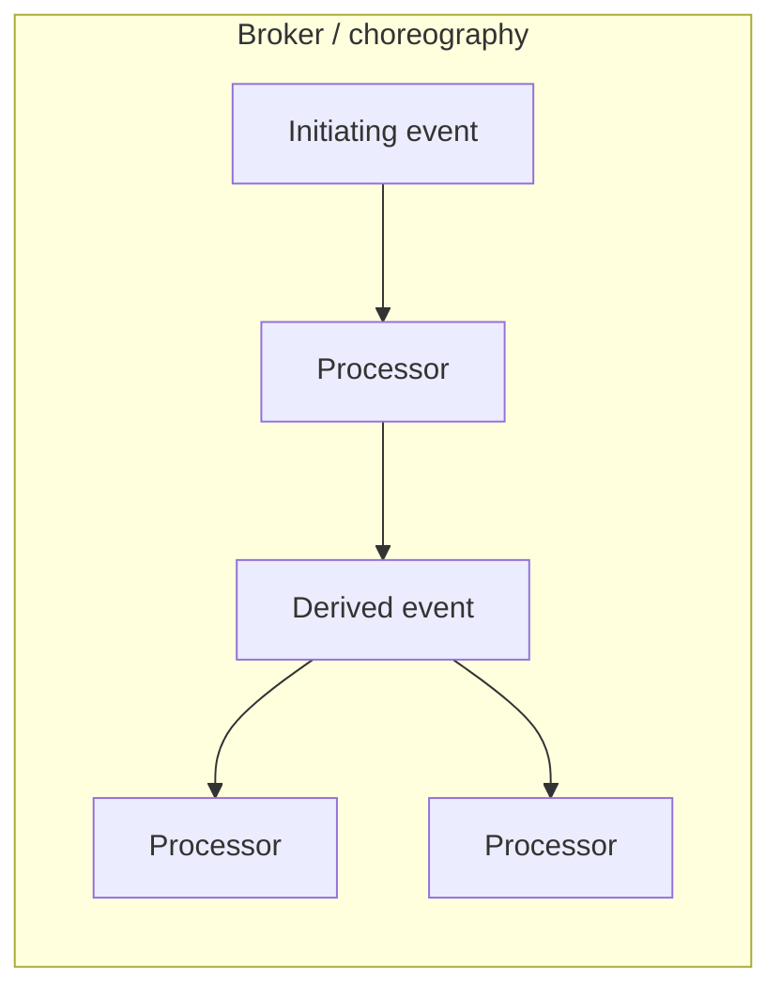
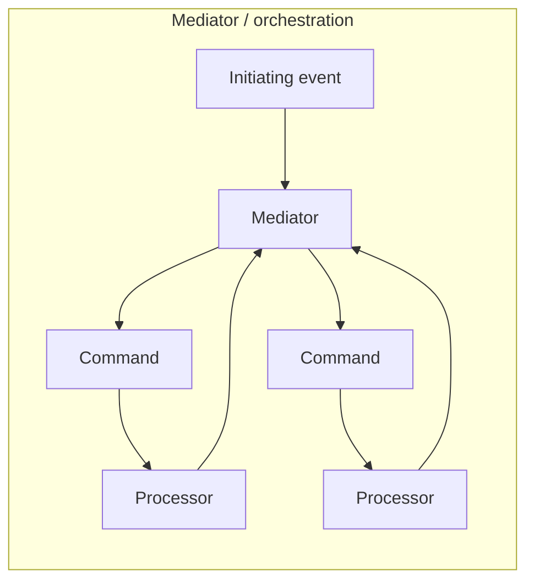

# Event-driven architecture

**See also:** [pub/sub, queues, and streams (A2)](PubSubQueues.md) · [transactional outbox and CDC (B7)](OutboxCdc.md) · [event sourcing and CQRS (E12)](../data-intensive-design/event-sourcing-cqrs.md) · [idempotency and the inbox (C9)](Idempotency.md) · [event-driven dataflow](../data-intensive-design/event-driven-dataflow.md) · [request–response (A1)](RequestResponse.md) · [strangler fig (B4)](StranglerFig.md) · [load shedding and backpressure (C10)](LoadShedding.md) · [API contracts (A6)](ApiContracts.md) · [choreography vs orchestration](../aws/ch08.md) · [style-selection matrix](../../.cursor/skills/arch-style/references/style-selection.md) · [ADR 0003](../../docs/architecture/adrs/application/mobile-test-automation/0003-coordinate-conversion-with-central-orchestration.md) · [external research note (2026-09-13)](../../docs/research/sysdesign/e4-event-driven-external-research.md)

Event-driven architecture is a **style**: the default collaboration is reaction to facts that already happened. An **initiating event** enters; processors do one business task and emit **derived events**; no processor needs to know who is listening. Richards & Ford (2nd ed., ch. 15) open with decoupled processors that trigger and respond to events — a **standalone style or embedded** in another (their example: event-driven microservices). The two topologies of *this* style are **broker** and **mediator**. They are who owns the workflow, not which product you bought.

That is not "we run Kafka." The [event-driven dataflow](../data-intensive-design/event-driven-dataflow.md) note already states the broker's job — buffer, redeliver, hide addresses, fan-out, decouple — and the queue-versus-topic table. This card does not rewrite that. [A2](PubSubQueues.md) owns channels, delivery claims, competing consumers, ordering, DLQ, and reconnect. [B7](OutboxCdc.md) owns how a local write becomes an event without a dual-write. [E12](../data-intensive-design/event-sourcing-cqrs.md) owns CQRS and event sourcing as a *persistence* style. [C9](Idempotency.md) is the consumer-side homework every at-least-once hop inherits.

Quality attributes, recorded as facts from the [style-selection](../../.cursor/skills/arch-style/references/style-selection.md) ch. 15 row (not re-scored here): **evolvability 5★** (add a subscriber, do not touch the publisher); **performance / scale / fault tolerance 4★** ("4 not 5 because of the database"); **simplicity / testability LO**. The costs are eventual consistency across processors, a logical flow that is **invisible in any program text** (Fowler 2017), schema governance, and a team that can debug async. Azure (2026): the operational overhead is not free.

## Lineage and vocabulary

- **Hohpe & Woolf, *Enterprise Integration Patterns* (2003).** Three names this catalog must not collapse. **Message Broker** is the hub-and-spoke *architecture* pattern — Hohpe's ch. 3 extract calls it the integration equivalent of the GoF Mediator. Trade-off he states: central maintenance vs a **throughput bottleneck**; mitigate with stateless scale-out or a hierarchy of brokers. **Message Bus**: shared infrastructure plus a common command set; participants speak the bus; the bus is not an active per-message mediator. **Event-Driven Consumer** is an *endpoint* pattern (the system hands a message to a callback). **This is not the EDA style.** A request-driven monolith can use an event-driven consumer; an EDA processor can poll. Hohpe's own warning: event-driven consumers process as fast as messages arrive and can overload the server — throttle by limiting consumer count ([C10](LoadShedding.md)).
- **Fowler, "Event Collaboration" (2006-06-19).** Components raise events on state change; others listen. The sender does not name the recipient. Adding a risk-tracker does not require changing the stock exchange — you subscribe. Coupling *moves* from request interfaces to event schemas. Just raising an event is not enough when you need a job done — someone must *accept* it.
- **Fowler, "What do you mean by 'Event-Driven'?" (2017-02-07).** The word "event" hides four different things. Keep them un-collapsed:

| Pattern | What it is | Style-level cost |
|---|---|---|
| **Event Notification** | "Something changed"; often an id + a link back. Source does not care about the response. | Lowest coupling; a logical flow that spans notifications is **invisible in any program text**. |
| **Event-Carried State Transfer** | The event carries the changed data so consumers stop calling back. | Resilience and lower load on the source; many copies; consumers must maintain state. |
| **Event Sourcing** | The event log *is* the source of truth; current state is derived. **Need not be asynchronous.** | Replay, audit; schema evolution and external-system replay are the hard parts. **[E12](../data-intensive-design/event-sourcing-cqrs.md).** |
| **CQRS** | Separate models for write and read. **Need not use events.** | Fowler is "deeply wary"; majority of cases he had seen were harmful. **E12.** |

- **Richards, *Software Architecture Patterns* (first release 2015-02-24).** Public report that popularised **mediator vs broker** as EDA *topologies*. Mediator: event queue → mediator → processing events on dedicated channels → processors; the mediator knows the steps, does not do the business work. Broker: no central mediator; processors consume, act, and publish the next derived event; unused events are normal (they leave room to evolve). Same insurance-relocation example in both topologies (worked example below). The 2015 High/Low prose ratings are a *different card* from the later stars — do not mix them.
- **Richards & Ford, *Fundamentals of Software Architecture*, 2nd ed. (O'Reilly listing March 2025), ch. 15.** Workspace distillation is [style-selection.md](../../.cursor/skills/arch-style/references/style-selection.md). Topology: processors + broker (or mediator); initiating → derived events. Partitioning: **technical**. Quanta: **1–many**. 1st edition placed the same chapter at ch. 14 (2020). The 2nd-ed chapter body was paywalled on the 2026-09-13 fetch; opening sentence and "standalone or embedded" recovered from the listing. Do not invent additional stars.
- **Azure Architecture Center, "Event-Driven Architecture Style"** (`ms.date` 2026-03-06). Independent restatement of broker vs mediator; when-to / when-not; fat vs thin payload; hybrid with microservices, pipes-and-filters, and event sourcing. Its pub/sub-vs-stream and competing-consumers rows are **A2**.
- **This workspace's [aws/ch08.md](../aws/ch08.md).** Choreography = broker-shaped (no central coordinator; services react). Orchestration = mediator-shaped (a coordinator owns the flow). Hybrid: orchestrate the order core, choreograph notifications and analytics. State-oriented EDA vs event sourcing is an *implementation* fork, not a topology fork — event sourcing is **E12**.

## What the style is — and is not

**Is.** A system whose default collaboration is *reaction to facts that already happened*. Azure and Richards both split it into two topologies. style-selection records the partitioning as technical.

**Is not.**

| Confusion | Why it is a different card |
|---|---|
| **Bought a broker** | Queues, topics, and logs are [A2](PubSubQueues.md) primitives. A synchronous order API that writes to a queue and waits on a reply is still [request–response](RequestResponse.md) (Azure's own request-response-messaging escape hatch; Hohpe Request-Reply). |
| **Hohpe's Event-Driven Consumer** | Push vs poll is an endpoint choice. |
| **Microservices (E2)** | Independent deployability and DB-per-service are E2. EDA can live in one deployable. Using Kafka does not make you E2; splitting a DB does not make you E4. |
| **CQRS / event sourcing (E12)** | Event sourcing is a way to persist; CQRS is a way to split models. Fowler 2017: people who "did event sourcing" and then complained that every change meant updating two models were usually doing CQRS; people who blamed "lots of async" were paying a cost that neither pattern requires. |
| **A workflow engine** | A mediator *uses* an orchestrator (a BPM, a saga orchestrator — [ch08](../aws/ch08.md)); the style question is whether *anyone* owns the multi-step state. |
| **Notification-as-command** | Fowler 2017: if the source expects the recipient to act, send a command. Styling it as an event hides the dependency ("passive-aggressive command"). |

Request-based contrast (Richards/Ford + Azure when-not): "get my last six months of order history" is a deterministic, data-driven request — it belongs on [A1](RequestResponse.md), not on an event bus.

## Decision mechanics

### When the topology is async

Pick EDA when the domain is *react-to-things-that-happened*, not "answer this query" (style-selection; Richards request-vs-event). Several subsystems must process the **same** event and you do not want point-to-point wiring (Azure). Concurrency is unknown or variable; processors should scale independently. You can tolerate **eventual consistency** across processors — every sourced when-not is the inverse.

style-selection's pipeline cue: ordered, deterministic, one-way steps stay **pipeline**; back-and-forth or nondeterministic flows are the EDA cue. After you pick async-vs-sync, **re-check boundaries**. Sync communication between quanta can silently merge them.

A reply-queue over a broker is A1 wearing A2 clothes. Azure documents request-reply messaging and immediately says it "effectively turns this pattern into a synchronous process." Count those edges as A1 when judging the style.

### Broker vs mediator — who owns the workflow

These are **choreography vs orchestration at style level**, not queue-vs-topic. Do not recast this as "Kafka = broker, Step Functions = mediator." A Kafka topic plus a process manager that consumes and dispatches commands *is* mediator topology. A fleet of rules with no owner of the order *is* broker topology. The product is A2; the topology is E4.

| | **Broker topology** | **Mediator topology** |
|---|---|---|
| **Who owns multi-step state?** | No one. Each processor acts and publishes what *it* did. Azure: "no component owns or is aware of the state of any multistep business transaction." | The mediator. It keeps state, handles errors, and can restart. Processors answer the mediator; they do not broadcast completion to the world. |
| **What travels** | Facts / derived events ("address changed"). Unused events are normal — they are the evolvability hook (Richards 2015). | Commands / processing events on designated channels, often queues (Azure). Consumers are *expected* to process them. |
| **Control vs decoupling** | Highest decoupling, dynamic subscribers, no central restart. Distributed transactions are risky; inconsistency is a designed-in possibility (Azure). | More control, better distributed error handling, potentially better consistency; more coupling; the mediator is a bottleneck and a reliability concern (Azure). |
| **Closest siblings** | Choreography ([ch08](../aws/ch08.md)); A2 pub/sub or log. | Orchestration; saga-orchestration in [ch08](../aws/ch08.md); Hohpe Message Broker. |
| **When** | Simple or independently evolvable flows; you want the 5★ evolvability. | Multiple coordinated steps, conditional paths, restart-from-step-N (Richards 2015 relocation; Azure). |

Hohpe's bottleneck warning applies to the **mediator** (and to a mediating Message Broker), not to a dumb log. A2 already owns dumb-vs-mediating *brokers* as products; here "mediator" means the workflow owner.

This workspace's [ADR 0003](../../docs/architecture/adrs/application/mobile-test-automation/0003-coordinate-conversion-with-central-orchestration.md) is the same decision on an audit-shaped flow: reproducibility beat fan-out. Do not pretend choreography will reconstruct the trail.

### Quantum count — FACT from style-selection

| Cell | Fact |
|---|---|
| Topology | processors + broker (or mediator); initiating → derived events |
| Partitioning | technical |
| **Quanta** | **1–many** |
| Ratings | perf / scale / FT **4★** ("4 not 5 because of the database"); **evolvability 5★**; simplicity / testability **LO** |

This card does **not** score those stars. It records them.

Why the range is 1–many (quantum machinery, style-selection ch. 7):

- A quantum is the smallest independently runnable part. **The database is inside the quantum.** A single shared DB ⇒ quantum of one, regardless of how many processor *classes* you drew.
- EDA can be standalone or embedded. An in-process event bus inside a modular monolith is EDA at **quantum = 1**. Independently deployed processors, each with its own store, are **many**.
- Sync hops between processors silently merge them. The named antipattern is **Dynamic Quantum Entanglement**: processors that keep needing request/response calls are not independently runnable — they have collapsed.

Many quanta buy the 4★ scale/FT story and the 5★ evolvability. They spend the LO simplicity/testability, and they spend the database caveat: if every processor still hits one shared DB, you advertised many quanta and shipped one.

### Thin vs fat events (style-level payload)

Azure restates Fowler's pair as "keys only" vs "all attributes in the payload." Thin notification keeps a single system of record and a small contract; the cost is callback storms and hidden sync — the source stays on the read path. Fat event-carried state transfer lets consumers survive a source outage; the cost is copies, conflicting systems of record after updates, and stamp coupling (style-selection ch. 9: bandwidth is not infinite). Over-fine events saturate the system and make rollback worse; too-fat events force every consumer to inspect payloads they do not need (Azure's compliance example: some listeners need only `compliant` / `noncompliant`). Schema evolution of those contracts is [A6](ApiContracts.md), not this card.

## Worked example — insured person relocates

Verified from Richards 2015 (same initiating event in both topologies). Paraphrase only. Later secondary tellings use a PlaceOrder retail story; that was **not** fetched from the 2nd-ed chapter. This card uses relocation.

**Initiating event:** `RelocationRequested` (customer moved).

**Request-based (not this style).** A UI asks "recalculate this customer's quote." That is A1. Do not put it on the bus unless something *happened*.

**Broker topology (choreography).**

1. `CustomerProcessor` receives the initiating event, writes the new address (local TX + [B7](OutboxCdc.md) to publish), emits `CustomerAddressChanged`.
2. `QuoteProcessor` and `ClaimsProcessor` both subscribe. Quote recalculates rates and emits `QuoteRecalculated`. Claims updates an open claim and emits `ClaimUpdated`.
3. Further processors may or may not care. An unused `ClaimUpdated` is not a bug — it is the evolvability slot (Richards 2015).
4. **No one** can restart "the relocation." If claims fails after quote succeeded, the system is inconsistent until a human or a later compensating event ([ch08](../aws/ch08.md) choreography) intervenes. Azure states this directly.

**Mediator topology (orchestration).**

1. Initiating event lands on a queue in front of a `RelocationMediator`.
2. The mediator (not the processors) knows the steps: change address, then in parallel recalc quote and update claims. It emits *processing* events onto dedicated channels and waits.
3. Processors do one task and reply to the mediator. They do not advertise to the rest of the system.
4. On failure the mediator stops, persists, and resumes at the failed step. That is why you accepted the bottleneck.

**Quantum count on this example.**

- One database shared by customer, quote, and claims → **quantum = 1**, even if three processes listen.
- Three services, three stores, only async derived events between them → **three quanta**.
- QuoteProcessor HTTP-gets CustomerProcessor on every event → **entangled**; the pair is one quantum pretending to be two.

**What this example does not decide.** Which channel (queue vs topic vs log), DLQ policy, or outbox poller — **A2 / B7**. Whether claims is event-sourced — **E12**. Whether the mediator is a saga orchestrator — [ch08](../aws/ch08.md).

## Migration in and out

**In (from a request-based monolith or modular monolith).**

1. Keep the request path for queries that are still requests (order history). Do not "event-wash" reads.
2. Introduce a seam that *sees* the write. Fowler's strangler **Event Interception** is the named seam ([B4](StranglerFig.md)); Asset Capture is the data-side twin. Do not big-bang the core.
3. Publish from that seam with **[B7](OutboxCdc.md)**. Dual-writing the DB and the bus is the failure mode B7 exists to remove. [ch08](../aws/ch08.md) already separates CDC (replicate state) from event sourcing (intent as source of truth) — do not blur them on the way in.
4. First subscribers should be **side effects that can be late**: email, analytics, search index. That is broker topology on purpose. Azure's hybrid sentence: EDA combines with microservices, pipes-and-filters, and event sourcing; it is rarely the only style.
5. Split a processor into its own quantum only when it has its own persistence. Shared DB keeps you at quantum 1.

**Hybrid (the common steady state).** [ch08](../aws/ch08.md) ecommerce: orchestrate payment → inventory → confirm → ship (mediator); emit `OrderShipped` and let notification and analytics choreograph (broker). Azure: typical combinations include E2, pipes-and-filters, and E12.

**Broker → mediator (or the reverse).** Promote when you can no longer see or restart the flow (Fowler's notification trap; Azure "no built-in mechanism for restarting"). Demote when the mediator is the change hotspot and the steps have become independently evolvable (Richards 2015: broker is easier to deploy because a processor change does not force a mediator change).

**Out.**

- Sync calls creeping back → collapse those processors into one quantum or replace the hop with A1 inside a larger service. That is leaving EDA for those edges, not "fixing" it with [retries](RetryBackoff.md).
- Strong consistency required across the whole business transaction → move that slice to a single processor, a mediator + saga, or (if the domain is large and semantically coupled) question E2 granularity (style-selection microservices when-not).
- The event log has become the system of record → you have migrated *into* E12, not "done EDA harder." Fowler: most processing should still read a working copy, not the log.

Distributed-computing fallacies this style pays for (style-selection ch. 9 — name, do not score): **the network is reliable** (A2 redelivery / B7); **latency is zero** (notification + callback = hidden sync); **bandwidth is infinite** (event-carried state transfer / stamp coupling); **versioning is easy** (Azure schema-evolution challenge; A6); **compensating updates always work** ([ch08](../aws/ch08.md)); **observability is optional** (Azure: retrofit is substantially harder than designing correlation ids in).

## Failure modes

- **Dual-write on the way in.** Publishing in a second transaction after the DB commit. Fail after the first commit → lost event or phantom event. [B7](OutboxCdc.md) exists so this card does not invent an outbox. Do not reverse the order, wrap a broker produce in a database transaction, or keep the event only in memory.
- **Unbounded topology.** Broker topology has no owner of the multi-step graph. Subscribers accumulate; unused events are *legal* (Richards 2015) until they are *unreadable* (Fowler 2017: the flow is not in the program text). Azure: too many fine events saturate the system; a single über-mediator that routes every domain is Hohpe's unmaintainable broker and style-selection's Accidental SOA. Federate mediators by domain. Poison-message and DLQ behaviour are A2; *who decides to compensate* is the saga card. Confusing those two is how an order ships without payment.
- **The invisible flow.** Fowler 2017 + Azure 2026: no shared call context; correlation ids must be designed in. ADR 0003 rejected choreography for exactly this audit gap.
- **Passive-aggressive commands.** An event that secretly means "you must do X." Recipients cannot ignore it, but the schema claims they may. Use a command on a point-to-point channel (mediator / saga / A2 queue), or accept that unused events are legal (broker).
- **Quantum collapse / Dynamic Quantum Entanglement.** Sync hops between processors silently merge quanta. Symptom: you still have a broker, but every handler immediately HTTP-GETs the publisher (thin notification without accepting the source as a runtime dependency).
- **Shared-DB "distributed" EDA.** style-selection: 4★ not 5★ *because of the database*. Many processor processes, one schema → one quantum. Failure isolation is fictional.
- **Event-sourcing / CQRS conflation.** Fowler 2017 project-manager story: "event sourcing doubled the work because we update two models" — that is CQRS. Adding async on top is a third cost. E12 owns the persistence trade-offs, including erasure vs an immutable log.
- **Schema and stamp coupling.** Azure: producers and consumers deploy independently; an unknown field or a new required field breaks the other side. Fat events duplicate systems of record. The style failure is "we made evolvability 5★ at the *topology* and 1★ at the *contract*."
- **Request-reply over the bus as "we are event-driven."** Count those edges as A1.

## When not to use

- Processing is **mostly request-based** and sync A1 already meets latency and throughput. Azure: brokers, async error handling, and eventual consistency are not justified for straightforward interactions.
- Eventual consistency is **unacceptable** — you cannot tolerate a window where parts of the system disagree. Richards 2015: if a single unit of work must be split across processors, this is probably the wrong pattern; plan granularity so events that must be atomic stay in one processor.
- Processors **keep needing sync calls** to each other. That is Dynamic Quantum Entanglement, not EDA.
- The team cannot operate distributed async systems. Azure names debugging, monitoring, and error-recovery as a different skill set that hits delivery timelines. Fowler 2017: the flow is not in the program text.
- You chose EDA to get a workflow engine. Buy a mediator / saga; do not pretend choreography will reconstruct the audit trail.

## Trade-offs

| Decision | Buy | Spend |
|---|---|---|
| Adopt EDA at all | Independent consumers; 5★ evolvability; 4★ perf/scale/FT; temporal decoupling | LO simplicity/testability; eventual consistency; flow not in the source; schema governance |
| Broker topology | Dynamic subscribers; no single workflow SPOF; relay-race scale-out | No restart; inconsistency windows; "what happened?" is a correlation exercise |
| Mediator topology | Owned state, restart, clearer audit of the *path* | Coupling to the mediator; deploy coupling (2015); bottleneck / reliability concern |
| Event notification (thin) | Small contracts; single system of record | Callback storms; hidden sync; source stays on the read path |
| Event-carried state transfer (fat) | Consumers survive source outage; lower source load | Copies; conflicting systems of record after updates; stamp coupling |
| Embed EDA in E2 | Per-service scale + async fabric | Two styles' failure modes at once; easy to confuse "we have topics" with "we have quanta" |
| Promote a slice to E12 | Replay, audit, temporal query | Working-copy vs log confusion; erasure vs immutability |
| Keep quantum = 1 (in-process bus) | Avoid network fallacies; cheaper ops | Do not claim 4★ FT; the process is the blast radius |
| Split quanta without splitting the DB | Diagrams that look distributed | Actual quantum remains one; "4 not 5 because of the database" |

No library-defaults section — Group E has none. CloudEvents, AsyncAPI, and vendor SDK retry/DLQ numbers stay on A2 / A6 / C2.

## Sources

Verified 2026-09-13; the full URL list, per-claim provenance, and items deliberately left out are in the [external research note](../../docs/research/sysdesign/e4-event-driven-external-research.md). Star ratings and the 1–many quantum cell are taken from [style-selection.md](../../.cursor/skills/arch-style/references/style-selection.md) (distilled from ch. 7 + ch. 15). Do not invent additional stars. Items already in this tree are cited, not rewritten: [event-driven-dataflow](../data-intensive-design/event-driven-dataflow.md), [event-sourcing-cqrs](../data-intensive-design/event-sourcing-cqrs.md), [ch08](../aws/ch08.md), [A2](PubSubQueues.md), [B7](OutboxCdc.md).

- Canon: Hohpe & Woolf, *EIP* (2003) — Message Broker, Event-Driven Consumer, Request-Reply; Hohpe, *Hub and Spoke* (2003-11-12); Fowler, Event Collaboration (2006-06-19), Event Sourcing (2005-12-12), CQRS (2011-07-14), "What do you mean by 'Event-Driven'?" (2017-02-07); Richards, *Software Architecture Patterns* (2015-02-24) — broker/mediator + relocation; Richards & Ford, *FSA* 2nd ed. listing (March 2025), ch. 15.
- Style pages: Azure Architecture Center, *Event-Driven Architecture Style* (`ms.date` 2026-03-06); AWS "What is an Event-Driven Architecture?" (producer / router / consumer vocabulary only — marketing claims left out).
- Workspace: style-selection.md; ADR 0003; [distributed transactions](../data-intensive-design/distributed-transactions.md) (exactly-once processing).
