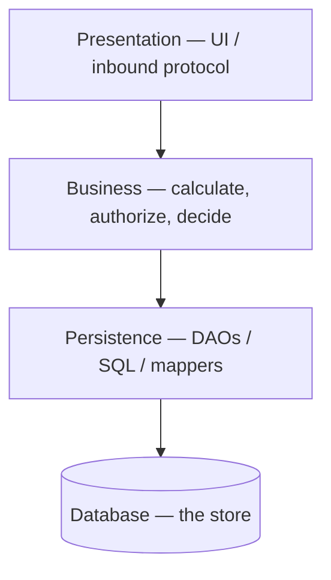

# Layered architecture

**See also:** [monolithic architecture (E1)](MonolithicArchitecture.md) · [hexagonal / ports-and-adapters (E8)](Hexagonal.md) · [modular monolith (E10)](ModularMonolith.md) · [package by component](../coding-rules/package.md) · [clean architecture](../coding-rules/clean-architecture.md) · [style-selection matrix](../../.cursor/skills/arch-style/references/style-selection.md) · [external research note (2026-09-13)](../../docs/research/sysdesign/e3-layered-external-research.md)

Layered architecture is a **monolith-family** style that partitions a system into horizontal bands of *technically similar* work. The usual four (Richards 2015; [style-selection](../../.cursor/skills/arch-style/references/style-selection.md)): **presentation** (UI / inbound protocol), **business** (calculate, authorize, decide), **persistence** (DAOs / SQL / mappers), **database** (the store). Dependencies compile **top → bottom**. Three- and five-layer stacks are the same style; collapsing business into persistence (SQL in the business objects) is the three-layer variant, not a different one.

The reason to layer, even when you will never substitute a layer, is Fowler's: **narrowed scope of attention**. A presentation rewrite can leave business alone *if* the contract holds. The cost is that a *domain* change walks every band, and the database sits at the bottom of every compile-time arrow.

Quality attributes in play: **simplicity** and **familiarity** (cheap start; Azure: less learning curve); **technical-change isolation** when layers are closed and contracts hold (UI-framework or SQL swap stays local). The costs are **deployability**, **domain agility**, **scale**, and **fault isolation** — Richards 2015 rates those Low (a different book than FSA; the FSA ch10 scorecard in this workspace is `—`, and a `—` is not a rating). Quantum count is **1**.



## What it is not

Two nearby cards share a quantum or a drawing and are not this style.

| Style | Cut | Dependency rule | When it wins |
|---|---|---|---|
| **E3 Layered (this card)** | Horizontal *technical* bands | Top → bottom. Persistence / database is the **sink**. | Change is technical (new screen, new report, swap ORM). |
| **E8 Hexagonal** | Inside / outside: *ports* (conversations) + *adapters* (technology) | Inward. The domain is the **sink**. Cockburn wrote the hexagon **to get away from** the one-dimensional layered picture. | The domain must not compile against a DAL. Fowler's domain-freeing mapper *is* hexagonal — a DIP of layered, not "more layers." |
| **E10 Modular monolith** | Vertical *domain* modules, one deployable | Module APIs, not layer arrows. Same quantum (**1**). | Change follows the domain. Usual exit from E3. |
| **E1 Monolith** | The *family* (one deployable) | Unspecified. Layered is one *technical* partitioning of a monolith; E10 is the domain one. | — |
| **E5 Client–server** | Who calls whom on a network | A 2-tier or 3-tier host can *place* layers; it does not define them. | — |

Martin's [clean architecture](../coding-rules/clean-architecture.md) uses "layers" for concentric policy rings whose **Dependency Rule** points inward. Folders labelled Clean that still depend downward onto a DAL are **E3 mechanics under an E8 name**. OSI network layers are out of scope.

Brown ([package.md](../coding-rules/package.md)): put two layered codebases from different domains side by side and they look the same — web / services / repositories. That is the scream the style does not make.

## Lineage and vocabulary

- **Buschmann et al., POSA vol. 1 (1996), pattern *Layers*.** "From Mud to Structure." Name and date only; chapter internals (opaque vs transparent) were not fetched.
- **Fowler, *Layering Principles* (2005-01-07).** Workshop vote, not a standard. Strong yes: low coupling / high cohesion; separation of concerns; no business logic in UI or inbound handlers; no cycles; layers are **logical** and do **not** imply distribution (`11/0`); lower does not depend on upper. Strong no: **teams by layer** (`1/22`); **distribute at layer boundaries** (`0/18`); rethrow at every boundary (`0/15`). Adjacent-only was split (`4/4`).
- **Fowler, *Presentation Domain Data Layering* (2015-08-26).** Presentation / domain / data-access. Extra bands (service, Presentation Model) do not break it. Dependencies top → bottom. Logical ≠ physical (one laptop; desktop + DB; rich client + BFF-as-presentation). **Granularity:** once a layer is large, do *not* keep presentation-domain-data as the top-level modules — split by **domain**, layer *inside*. "Developers don't have to be full-stack but teams should be."
- **Richards, *Software Architecture Patterns* (2015-08-15).** Layered = **n-tier**. Four standard layers; closed vs open; layers of isolation; open shared-services; **Architecture Sinkhole + 80/20** heuristic; Low/High prose (not FSA stars).
- **Richards & Ford, FSA ch10** (via [style-selection](../../.cursor/skills/arch-style/references/style-selection.md) only): 4 horizontal technical layers; 3 physical variants; partitioning = **technical**; quanta = **1**; ratings = `—`.
- **Microsoft.** Azure *N-tier*: layers = logical + one-way dependency; tiers = machines; closed = next layer down only; open = any layer below; several layers on one tier is normal. .NET *Common web application architectures*: UI / BLL / DAL; N-layer on one tier is common; compile-time arrows UI → BLL → DAL — the reason Clean/hexagonal **inverts** persistence.
- **Cockburn, *Hexagonal Architecture* (HaT 2005.02, 2005-09-04).** Full card: **E8**.

| Term | Meaning here |
|---|---|
| **Layer** | Logical band of technically similar components. Not a process. |
| **Tier** | Physical deployment (process / machine / subnet). |
| **Closed / strict** | Must enter this layer to go lower; adjacent only. |
| **Open / relaxed** | May skip this layer. |
| **Technical partitioning** | Group by kind of work (UI, rules, SQL), not by domain. |
| **Quantum** | Smallest independently runnable unit. The DB is inside it. Shared schema ⇒ 1. |
| **Sink / source** | Where compile-time arrows *end* / *begin*. |

## Decision mechanics

### Closed vs open (strict vs relaxed)

Richards: a **closed** layer must be entered to reach anything below (presentation → business → persistence → database). Isolation means a SQL change or a UI-framework swap stays in that layer plus its contract partner. If presentation can reach persistence, a persistence change hits **both** business and presentation.

**Open on purpose:** a shared-services band (utilities, audit, logging) under business so presentation cannot see it. If that band were closed, business would have to walk *through* utilities to reach persistence. Mark it **open** so business may use it *or* skip. Undocumented open/closed is how the style becomes a ball of mud.

Azure: closed can create **needless network traffic** when a tier only forwards; open creates **more couplings**. Brown: **strict** = adjacent only; **relaxed** = may skip. CQRS reads sometimes intend the skip; a controller injecting a repository and skipping authorization does not. Package-by-component *enforces* what layered only *states* — the compiler, not a code review, is the gate.

| Mark the layer… | When | Isolation | Performance |
|---|---|---|---|
| **Closed** | It owns a rule you must not skip (authorization, aggregation, a dialect hide) | High — a lower change has one caller | Extra hop / allocation, even for pass-through |
| **Open** | Shared utilities, or a measured sinkhole path (Richards 80/20 reversed) | Lower — more callers of whatever sits below | Cheaper path |
| **Closed, then leak** | "Just this once" controller → repository | Lost. Graph is still acyclic, so reviews miss it. | You paid neither isolation nor honesty |

The decision is per layer, written down. A stack that is "mostly closed except where we skip" without a mark is already leaking.

### Sink and source of dependencies

This is the E3 / E8 decision, not a drawing preference.

```
  Layered (E3)                         Hexagonal (E8)
  source                               source
    │  Presentation                      │  HTTP / UI adapter
    ▼                                    ▼
    │  Business                     inbound port
    ▼                                    ▼
    │  Persistence                     Domain  ← sink
    ▼                                    ▼
  sink  Database                    outbound port
                                         ▼
                                      SQL adapter
```

In classic layered, compile-time arrows run UI → BLL → DAL. **Presentation is the source** (nothing in the stack depends on it). **Persistence / database is the sink** (the rest of the stack cannot compile without it). That is why a store swap ripples up, and why business-layer tests need a database *unless* you invert.

Hexagonal and Clean **move the sink**. Ports sit on the inside; adapters are the source; the domain depends on no DAL. Fowler is explicit: a mapper that frees the domain from data sources **is hexagonal**, not a thicker layered stack. Adding a "service layer" or an "application layer" does not invert anything — the sink is still the store.

Choose E3 when you accept the sink at the database (technical change, small unit, one team). Choose E8 *inside* the same quantum when the domain must not depend on a store at compile time. That is not "add a layer."

| Question | E3 | E8 | E10 |
|---|---|---|---|
| Where do top-level modules come from? | Kind of work (UI, rules, SQL) | Inside vs outside (ports) | Domain / cluster |
| Where do compile-time arrows end? | DAL / database | Domain | Module API (layers may live *inside*) |
| What change is cheap? | New screen, new report, swap ORM | Swap an adapter (HTTP, SQL, test) | New or changed domain behavior |
| What change is expensive? | A use case that spans every band | A port that was drawn too wide | A technical swap that cuts every module |
| Same quantum? | 1 | Lives in 1 (does not add one) | 1 |

### Layers vs tiers

Logical layers need not map 1:1 to tiers (Fowler, Azure, .NET). [style-selection](../../.cursor/skills/arch-style/references/style-selection.md) records **three physical variants** as FACT; the book figure is not in-repo. Verified placements:

| Placement | What is true | Cost |
|---|---|---|
| Several layers, **one** tier | The common case (N-layer on one app process + a product DB). | No extra hop; no security subnet. |
| Presentation split from business (browser / BFF) | Fowler's rich-client + BFF-as-presentation. | Extra hop. Features still cannot deploy independently. |
| Azure VM n-tier (WAF → web scale-set → business scale-set → SQL; data subnet accepts only business) | A *stricter physical* n-tier, not a fourth logical layer. | Scale and a subnet boundary vs latency and ops. |

Fowler 2005: **0/18** against distributing at layer boundaries. The hop is a cost you pay for a security or scale-set reason, not a virtue of the style. Cloning the same app behind a load balancer is still one quantum.

### Quantum count — FACT = 1

The database is inside the quantum. A shared schema keeps one quantum even if presentation is a separate process: change the schema, the other deployable can break. Do not score characteristics here.

## Architecture Sinkhole

Verified from Richards 2015 (O'Reilly report), not from the truncated workspace notes that only name-check it.

Requests walk every layer as **pass-throughs**: presentation forwards "get customer," business forwards, persistence runs one SQL, data returns with **no** aggregation, calculation, or transform. You pay allocation and latency for no isolation.

Every layered system has some. Richards's **80/20 heuristic** (not a dataset): ~20% pass-through / ~80% real work is typical; if the ratio **reverses**, either **open** some layers (cheaper path, worse change control) or the style is **wrong** for the domain. Azure (same phenomenon, no name): a middle tier that only does CRUD "adds latency and complexity without delivering meaningful value."

This workspace already used sinkhole as the decay mode of technical partitioning: [style-decision](../../docs/architecture/worksheets/mobile-test-automation/style-decision.md) and [ADR 0005](../../docs/architecture/adrs/application/mobile-test-automation/0005-adopt-plain-modular-monolith-partitioned-by-cluster.md) rejected Layered *without* stars.

## Worked example — customer retrieve

Richards 2015 (technology incidental — JSF/Spring/JDBC or the equivalent):

| Hop | Object | Work | Sinkhole? |
|---|---|---|---|
| Presentation | Screen + **customer delegate** | Knows which business module and contract to call. Does not know tables. | No, if it only adapts the protocol. |
| Business | **customer** business object | Aggregates **customer DAO** + **order DAO** into one model. | **No** — this is the isolation you paid for. |
| Persistence | Each DAO | Runs its SQL; hides the dialect. | No, if the SQL is real work. |
| Database | Store | Returns rows. | — |

The same walk **is** a sinkhole when "get customer" is a single table and every layer is a one-line forward: presentation copies the request, business copies it, persistence runs `SELECT *`, nothing aggregates. Then either open the skip (Brown's relaxed diagram — cheaper, weaker change control) or admit the style is wrong for a CRUD-majority domain.

**Workspace counter-example.** Change streams are domain clusters — conversion, validation-certification, evidence. Horizontal layers would spread each change across presentation + business + persistence (the sinkhole invitation). Chosen style: **E10**, not E3. Pipeline-stage names were demoted to packages so they would not *become* layers ([ADR 0005](../../docs/architecture/adrs/application/mobile-test-automation/0005-adopt-plain-modular-monolith-partitioned-by-cluster.md)). E6 is the named distributed step, not a jump from messy layers to microservices.

## When to use

| Fit | Why |
|---|---|
| Small / simple / uncertain final style | Cheap start; no distributed tax. Richards: "good starting point… when you are not sure." Azure: requirements still evolving. |
| **Technically** oriented change | Next work is "new screen / new report / swap ORM." Isolation pays. E10 is the wrong tool for that stream. |
| Lift-and-shift / hybrid | Existing n-tier maps onto VMs with little redesign (Azure). |
| Specialists on **one** team | Code may be layered; teams must not be (Fowler 2005 / 2015). |

## When not to use

| Anti-fit | Why | Toward |
|---|---|---|
| **Domain-shaped change streams** | Each change edits every layer; sinkhole ratio flips. Fowler: domain modules on top, layers inside. | **E10**, later E6 / E2 |
| Independent feature deploy / scale / fault isolation | Quantum 1; DB in the quantum. Richards deploy/scale Low. | E6 / E2 (pay the fallacies) |
| Domain must not depend on the DB at compile time | Layered points the wrong way. | **E8** *inside* the quantum |
| Majority pass-through CRUD | Sinkhole. Opening all layers leaves folders, not isolation. | Collapse layers, or re-partition by domain |
| Teams = layers | Fowler `1/22`. Friction + distance from users. | Cross-functional teams; E10 ownership |
| This workspace's pipeline | Technical stage-modules *are* the sinkhole invitation. Already rejected. | E10 chosen; E6 named migration |

## Migration in / out

**In.** Accidental architecture: "just start coding," packages `web` / `service` / `dao` (Richards; style-selection names Architecture by Implication). Framework templates emit package-by-layer (Brown).

**Out.** (1) Tactical: open pure-sinkhole layers (Richards); accept weaker isolation. (2) Structural: invert *top-level* modules to domain / components; keep presentation-domain-data *inside* (Fowler + Brown package-by-component). (3) Invert the persistence **port** (E8) — still one quantum. (4) Strangle a live unit ([B4](StranglerFig.md)). (5) Do **not** jump to microservices because the layers feel messy (Fowler *Microservice Premium*; this workspace already named E6 as the first distributed step).

Every open layer you add to kill sinkholes is coupling you unwind later. A "just this once" controller → repository skip is Brown's relaxed diagram: still acyclic, still wrong.

## Failure modes

- **Layer leakage.** Presentation reaches persistence; a persistence change now has two callers. Brown's newcomer injects the repository into the controller — arrows still point down, authorization is gone. Static-analysis rules (`**/web` must not touch `**/data`) are fallible and late; public-everything packages make four "styles" the same graph.
- **God service layer.** When top-level modules *are* layers, every new use case lands in the business band. That band becomes one public `*Service` (or a handful) that every controller calls and that knows every table through the DAL. Brown's two-domain lookalike (web / services / repositories) is this shape. Fowler's granularity rule is the diagnosis: the service layer is large *because* presentation-domain-data is still the top-level cut. Richards's three-layer collapse (SQL in business) is the same god object with the persistence folder deleted. Opening the layer to dodge sinkholes makes the god thinner and the leakage worse.
- **Sinkhole majority.** Ceremony, no isolation. See above.
- **Teams = layers.** Conway matches the packages; every feature needs a meeting.
- **Distribute every layer.** Fowler rejected it (`0/18`); Azure still does it for security and you pay hops. Features still cannot deploy independently.
- **Label E8, mechanics E3.** Concentric folders, arrows still down onto the DAL.

## Trade-offs

FSA ch10 scorecard: **`—`**. Richards 2015 Low/High is a **different** book. Do not treat the cells below as FSA stars.

| Buy | Pay |
|---|---|
| Cheap start; Conway match; Azure "less learning curve" | Degrades as the unit grows. Two domains look identical (Brown). |
| Technical-change isolation *if closed + contracts hold* | A domain change touches every layer. |
| Mock a closed layer (Richards: testability High) | .NET e-book: UI→BLL→DAL makes business tests need a DB unless you invert (E8). Sources agree you can stub *edges*; they disagree on *business*-layer testability. |
| One mental model, one deployable | Three-line change redeploys the unit. Azure: no independent feature deploy. Richards deployability Low. |
| Familiar n-tier security story (data subnet accepts only business) | Extra hops, harder test/monitor. Fowler 0/18 against the hop as a *style* move. |
| Clone the app or split a tier | Quantum stays 1. Richards scale / elasticity / agility Low. One OOM / bad deploy takes the unit. |

Layered decides **how technical work is stacked**. Hexagonal decides **where the dependency sink sits**. A modular monolith decides **how the domain is cut**. Do not use one cut to do another cut's job.

## Sources

Verified 2026-09-13; full URLs, per-claim provenance, and items deliberately left out (FSA stars, POSA internals, invented `—` ratings) are in the [external research note](../../docs/research/sysdesign/e3-layered-external-research.md).

- Richards, *Software Architecture Patterns*, 2015-08-15 — four layers; closed/open; isolation; Sinkhole + 80/20 heuristic; customer retrieve; Low/High.
- Fowler, *Presentation Domain Data Layering* (2015-08-26); *Layering Principles* (2005-01-07).
- Cockburn, HaT 2005.02 (2005-09-04) — hexagon vs one-dimensional layers (E8).
- Azure *N-tier Architecture Style*; .NET *Common web application architectures*.
- [style-selection.md](../../.cursor/skills/arch-style/references/style-selection.md) — quanta = 1; 4 layers; 3 variants; ratings `—`.
- Brown, [package.md](../coding-rules/package.md) — strict/relaxed; package-by-component.
- [clean-architecture.md](../coding-rules/clean-architecture.md) — E8 family, Dependency Rule inward.
- [style-decision.md](../../docs/architecture/worksheets/mobile-test-automation/style-decision.md) + [ADR 0005](../../docs/architecture/adrs/application/mobile-test-automation/0005-adopt-plain-modular-monolith-partitioned-by-cluster.md) — Layered rejected; E10 chosen.
