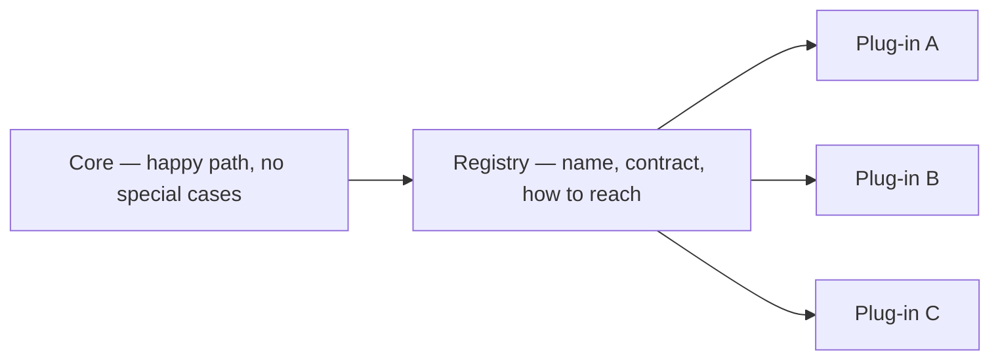

# Microkernel / plug-in

**See also:** [sidecar (B6)](Sidecar.md) · [hexagonal / ports-and-adapters (E8)](Hexagonal.md) · [modular monolith (E10)](ModularMonolith.md) · [monolithic architecture (E1)](Monolith.md) · [layered architecture (E3)](LayeredArchitecture.md) · [strangler fig (B4)](StranglerFig.md) · [style-selection facts](../../.cursor/skills/arch-style/references/style-selection.md) · [ADR 0005](../../docs/architecture/adrs/application/mobile-test-automation/0005-adopt-plain-modular-monolith-partitioned-by-cluster.md) · [style-decision](../../docs/architecture/worksheets/mobile-test-automation/style-decision.md) · [external research note (2026-09-13)](../../docs/research/sysdesign/e7-microkernel-external-research.md)

The microkernel (also **plug-in architecture**) is a **monolith-family style**: a relatively simple **core system** plus independently developed **plug-in modules**, discovered through a **registry**, bound at compile time or at runtime. Richards (2015-08-15): the core holds minimal / general behaviour; plug-ins hold specialised, additional, or custom processing. The core learns which plug-ins exist through the registry (name, data contract, optional remote-access details). Plug-ins stay independent of one another; the style does not specify the connection mechanism, only that independence.

It is still one independently deployable product. FSA 2nd ed. ch13 (opening snippet): typically a **single, monolithic deployment**, often installed on the customer site; also used for non-product custom apps whose problem is customization. [style-selection](../../.cursor/skills/arch-style/references/style-selection.md): partitioning is **both** technical *and* domain; **quanta = 1**.

Quality attributes, recorded as facts from the style-selection ch13 row (not re-scored here): **simplicity / cost HI**; **test / deploy / reliability / modularity / evolvability / responsiveness 3★**; **scale / elasticity / fault tolerance LO**. Richards 2015 High/Low is a *different* book — do not merge the cells. The costs are a registry and versioned contracts you must keep stable, **Volatile Core** if the happy path keeps moving, **Plug-In Dependencies** if extensions call each other, and **one process, one fate** unless you accept the remote-plug-in exception (and leave this style).

## Not a sidecar, not a hexagon

Same words, three different cuts. Do not collapse them.

| Cut | What is composed | Process / language | What the contract is |
|---|---|---|---|
| **E7 Microkernel (this card)** | Core + *registered* plug-ins the core selects | Typically same process and store. Remote plug-ins are the documented exception — then it is no longer one quantum. | An **open marketplace**: many implementations of one variation axis, discovered at bind time. |
| **[B6 Sidecar](Sidecar.md)** | App *process* + helper *process*, co-scheduled | Out-of-process; any language; **no plugin API required** | Placement. Azure's reason to sidecar is the case E7 cannot cover: extensibility for apps that have **no** plugin API. The helper scales with the replica and shares its fate. |
| **[E8 Hexagonal](Hexagonal.md)** | Domain at the center; *ports* as conversations; *adapters* as technology | Same process. Cockburn (2005-09-04): a port is a purposeful conversation; adapters swap I/O. | A **closed set of edges**. A hexagon can have two ports and no registry. A plug-in *contract* may be implemented as a port; that does not make every port a plug-in. |

Nearby cards that share a quantum or a drawing:

| Lookalike | Why it is not E7 |
|---|---|
| **[E10 Modular monolith](ModularMonolith.md)** | Domain modules + published interfaces on one deployable. **No registry required.** A single compile-time Strategy selected by config (ADR 0005: "Spring DI supplies the Strategy seam for free") is E10, not a microkernel. |
| **[E1 Monolith](Monolith.md)** | The *family* (one deployable). Microkernel is one *internal* partition of that family. |
| **[E3 Layered](LayeredArchitecture.md)** | Horizontal technical bands. The core *may itself* be layered; do not treat each layer as a plug-in. |
| **OS µ-kernel** (Mach, L4, MINIX, QNX) | Same *name*. Near-minimum privileged code for address spaces, threads, IPC; drivers as user-space servers. Application plug-ins usually share a process. Richards names the OS origin, then redefines the core as general business logic sans custom code. **Do not inherit OS LOC figures.** |
| **POSA Microkernel** (Buschmann et al., 1996) | Resource-sharing middleware. Ancestry of the name; Metapatterns: **not** FSA. |
| **Fowler Plugin** (2003-03-05) / Martin's plugins | Configuration-time class linking, or arrows-toward-policy. A *mechanism* E7 may use, not a product-platform style. |
| **E11 Serverless / FaaS** | Stateless, event-triggered, ephemeral functions. A function is a *host*. Hosting a remote plug-in as a function is the distributed exception, not one-quantum E7. |
| **E2 / E6** | Independently deployable services. Remote plug-ins that grow their own store *leave* E7. E6 is the usual first hop. |

Azure's architecture-styles catalog (fetched 2026-09-13) has **no** microkernel row. Do not invent an Azure rating.

## Lineage and vocabulary

- **Richards, *Software Architecture Patterns* (2015-08-15).** Two component types; registry; Eclipse + browser examples; insurance-claims / per-state plug-in worked example; connection options (OSGi, messaging, web services, point-to-point object instantiation); contract versioning from the start; qualitative High/Low scorecard (a different book from FSA). The style "can be embedded or used as part of another architecture pattern" for a specific volatile area; for product-based apps it "should always be your first choice as a starting architecture."
- **Richards & Ford, FSA** (1st ed. ch12; 2nd ed. ch13). Workspace SoT is [style-selection.md](../../.cursor/skills/arch-style/references/style-selection.md): core + plug-ins; registry; compile or runtime binding; partitioning **both**; **quanta = 1**; the ratings line above. Opening snippet: single monolithic deployment; US insurance per-state / international shipping. Named risks: **Volatile Core**, **Plug-In Dependencies**. The cited `microkernel-arch-style.md` was **absent** on 2026-09-13 — do not back-fill from blogs. Exact FSA sentences for the two risks are unrecovered; definitions below are Richards 2015 plus the workspace style-decision.
- **Eclipse (product exemplar).** Kim Moir, AOSA vol. 1. Eclipse 1.0 (2001-11-07): "an IDE for anything and nothing in particular" — a **framework**. Component = **plugin** (JAR + manifest). **Extension points** (provider) / **extensions** (consumer). Startup: scan manifests → in-memory **plugin registry** (cached); plugins **discovered**, not **activated** until used (**lazy activation**). Eclipse 3.0: **OSGi** (Equinox); plugins become **bundles**. Mantra: **"API is forever."** Helios (June 2010): 39 projects, 490 committers, 40+ companies.
- **Jira Plugins2** (page updated 2026-09-10): JAR + `atlassian-plugin.xml` modules, Universal Plugin Manager, Marketplace, unique add-on key. **OSGi Core R8** (approved 2020-12-09): one class loader per bundle; packages hidden unless exported. Richards lists OSGi as a *connection* option, not as the style.
- **Cockburn** (2005-09-04) — sibling **E8**. **Fowler, Plugin** (2003-03-05) — mechanism.

| Term | Meaning here |
|---|---|
| **Core** | Minimal operational behaviour; in a business app, the happy path without customer-specific logic. May itself be layered. |
| **Plug-in** | Stand-alone specialised / custom module. Delivery: source, rules-engine instance, JAR, DLL, or (if you accept distribution) a remote endpoint. |
| **Registry** | How the core knows which plug-ins exist and how to reach them. Binding without a registry is E10 / Strategy. |
| **Contract** | Standard (XML / map) or custom (third-party, via an **adapter** so the core does not grow per-plug-in special cases). Version from day one. |
| **Quantum** | Smallest independently runnable unit. The database is inside it. Shared schema ⇒ 1. |

## Decision mechanics

### Core vs plug-in vs registry

The decision is **where variation lives**, not whether you can draw boxes.

**Core.** Richards: traditionally "only the minimal functionality required to make the system operational"; in a business app, "the general business logic sans custom code for special cases, special rules, or complex conditional processing." Eclipse's early picture: open / edit / save until plug-ins make it an IDE. If the *real* volatility sat in that happy path, you bought a Volatile Core, not a microkernel.

**Plug-ins.** Generally independent. You *can* design plug-ins that require others; Richards: keep inter-plug-in communication to a minimum. The allowed expensive exception: the **core mediates**. Eclipse *does* allow `requires` / OSGi `Import-Package` between bundles — that is the governed form. Jira modules compose through the *platform*, not by one add-on linking another as a library of record.

**Registry.** Richards example entry: tax-audit plug-in `AuditChecker`, input/output contract, format (XML), optional WSDL if SOAP. Eclipse: in-memory map of extension point → extensions, built by scanning manifests, cached on disk. Jira: `atlassian-plugin.xml` modules registered with Plugins2. A single `@Bean` selected by a config flag is **not** this style.

**Contracts.** Custom contracts get an adapter. Eclipse: "API is forever." A contract change is how Volatile Core becomes expensive. The *cut* core vs plug-in is usually **domain-shaped** (per-state rules, per-language tooling, per-app Jira module); the *core's internals* are often technical layers.

### Binding time and process placement

Richards 2015 connection options (the style specifies none of them):

| Binding | What it is | Quantum effect |
|---|---|---|
| Point-to-point object instantiation | Compile- or load-time `new` / DI of a known type | Stays **1** |
| OSGi / Equinox / Plugins2 | Runtime bundle/JAR install, own class loader, lazy activation | Stays **1** while in-process and sharing the product's store |
| Messaging or web services | Plug-in is a remote process | **Distributed** — style-selection watch; ch9 fallacies apply; **no longer one quantum** |

**In-process isolation is a dial, not a given.** OS µ-kernels isolate via address spaces. Eclipse isolates via **per-bundle class loaders** and exported-package visibility. A plain classpath plug-in shares the host heap: a plug-in OOM takes the core with it. Do not claim OS-grade fault isolation (FT **LO**).

### Quantum count — FACT = 1 (unless remote plug-ins)

Architecture quantum (style-selection, ch7): smallest independently runnable part; **the database is part of the quantum**; independent deployability; high functional cohesion; low external implementation static coupling. Coupling test: "two things are coupled if changing one might break the other."

Why the typical product stays at one: FSA / Richards call it a "relatively simple **monolithic** architecture," packaged as a single deployment. JAR/DLL plug-ins in the product process are not independently runnable. A shared core database folds plug-ins back into one quantum even if they look modular. Replicating the whole product behind a load balancer is more instances of the **same** quantum, not more quanta.

**The documented exception.** style-selection: "remote plug-ins make it distributed." Independently deployable remote plug-ins with their own store and network calls are extra quanta — and you pay the eleven fallacies (same file, ch9). Honest catalog home is then **E6 / E2**, with a plug-in *façade*, not E7 with a larger star on scalability. Hosting that remote plug-in on **E11** does not put the system back to one quantum.

A third-party claim that remote plug-ins are "still a single quantum because every request goes through the core" **conflicts** with the workspace SoT and is unused.

## Named risks

**Volatile Core.** The core's interfaces or happy-path workflows change often enough that plug-ins break on every release. Causes: variation points misidentified; the core tries to do too much; or the domain's *real* volatility sat in the core (workspace: conversion flow rewritten in Phase 2). Eclipse's counter-measure: "API is forever" plus export-only public API.

**Plug-In Dependencies.** Plug-ins call each other (A requires B requires C). You lose independent extension; compatibility matrices explode. Counter: the core mediates; forbid compile-time plug-in→plug-in deps unless you accept Eclipse-grade governance.

## Worked example — insurance claims, Eclipse, and a declined registry

**Claims processing (Richards 2015, paraphrase).** The **core** intakes, validates, reserves, and pays — the happy path true in every US state. Each **state** is a plug-in (code *or* a rules engine). Example: some states allow free windshield replacement after rock damage; others do not. The **registry** selects the jurisdiction. Adding Idaho does not edit Texas or the core. Alternative: one giant rules engine that becomes a **big ball of mud** — "an army of analysts, developers, and testers." This is the **domain-to-architecture isomorphism** style-selection asks for.

**Eclipse (AOSA + Richards).** Downloaded SDK = platform (Platform + JDT + PDE); everything else is a plugin. A third party implements `org.eclipse.ui.actionSets`; the registry finds it without loading classes until the user clicks (lazy activation). Jira Plugins2 repeats the shape with `atlassian-plugin.xml` and a marketplace.

**Workspace counter-example (when *not* to pay for the registry).** [style-decision.md](../../docs/architecture/worksheets/mobile-test-automation/style-decision.md) §5 (gate closed 2026-07-26): the stage recommended registering source adapters and reasoning providers as plug-ins. The gate **declined**: one week-3 adapter does not need a registry; Spring DI already is the Strategy seam; Volatile Core was live because Phase 2 rewrites conversion. Cost accepted: no runtime structure; protection = ADR 0001 + F1/F2. Flip condition ([ADR 0005](../../docs/architecture/adrs/application/mobile-test-automation/0005-adopt-plain-modular-monolith-partitioned-by-cluster.md)): a fourth source adapter or a second concurrent provider **reopens** microkernel. Cite; do **not** re-score.

## When to use

| Fit | Why |
|---|---|
| Product / customization domains | Per-state rules; Jira / Eclipse-style third-party extensibility; strong domain ↔ architecture isomorphism (style-selection). |
| Downloadable products, or internal apps *released like* products | Richards: first-choice start when features will drip; you do not recompile per customer. |
| Non-product custom apps with the same shape | FSA opening snippet: US insurance per state; international shipping. |
| Isolate *one* volatile area | Richards "embed": do not force the whole system into the style. |

## When not to use

| Signal | Move toward |
|---|---|
| Variation sat in the *core* (Volatile Core) | Wrong partition or wrong style. Workspace: live risk on conversion. |
| One or two strategies, compile-time selection enough | **E10** + interfaces (ADR 0005). The registry is machinery. |
| Independent feature deploy / scale / FT as top-3 | Not this style (scale / elasticity / FT **LO**). First hop usually **E6**. |
| Remote plug-ins already independently deployed | Already distributed. Name E6 / E2 (or E11 *hosting*); keep a plug-in *façade* only if the registry still earns its keep. |
| Domain-shaped change *without* a third-party ecosystem | E10 (modules) and/or E8 (ports) inside one quantum. |
| Extreme mechanism / policy split over hardware | POSA / OS Microkernel, not E7. |
| "Just put each plug-in on a function" | **E11 hosting** of the remote-plug-in exception, not E7. |
| Simple app, no customization | Richards 2015 ease-of-development **Low**. Do not buy the machinery. |
| Azure "we need a sidecar because there is no plugin API" | **[B6](Sidecar.md)** — that is the *absence* of this style. |

## Migration in / out

**In.** Greenfield product (Richards: first choice). Extract per-jurisdiction conditionals out of a rules-engine mud (Richards claims example). Hybridize *one* seam of an E10 / E3 system when a third-party ecosystem appears (workspace flip). Adopt a host that already is one (Eclipse RCP, Jira).

**Out (cheapest first).**

1. Drop the registry, keep the interfaces (**E10**) — ADR 0005; fitness functions become load-bearing.
2. Invert technology edges (**E8**) inside the core — no new quantum, no marketplace.
3. Mediate remaining plug-in-to-plug-in calls through the core.
4. Version the contract rather than growing the core.
5. **Strangle** a plug-in out (**[B4](StranglerFig.md)**) — do not "just make every plug-in a REST service / function" (remote exception + ch9; **E11** if the host is FaaS).
6. **E6** if multiple characteristics sets appear.
7. **E2** only after granularity and data ownership are fixed.

Do **not** treat each *layer* of a layered core as a plug-in (E3 sinkhole). Do **not** call Spring / DI a completed microkernel.

## Failure modes

| Failure | What it looks like | Counter |
|---|---|---|
| **Volatile Core** | Every core release breaks the field's plug-ins | Re-partition; "API is forever"; versioned contracts; or leave |
| **Plug-In Dependencies** | A requires B requires C; combinatorial QA | Core mediates; forbid compile-time plug-in→plug-in deps |
| **Registry as costume jewelry** | One Strategy + a "plugin manager" + a config flag | E10 + DI; reopen E7 on the flip condition (ADR 0005) |
| **Remote plug-ins, still scored as one quantum** | Network + shared DB + "we're still a monolith" | Recount quanta; name E6 / E2; pay ch9 |
| **FaaS plug-ins labelled E7** | Each extension is a function; no stable core API | E11 hosting of a distributed plug-in, not one-quantum E7 |
| **Shared-DB coupling** | Plug-in schema changes break the core (and vice versa) | Separate store *or* accept quantum = 1 honestly |
| **False fault isolation** | One plug-in OOM takes the product down | Class-loader isolation ≠ process isolation; FT stays LO |
| **Over-pluggability / custom contracts** | Everything is an extension point; core grows `if (plugin == X)` | Plug real variation axes; adapter to the standard contract |
| **OS / POSA or ports called plug-ins** | IPC-budget review, or two adapters labelled "microkernel" | Keep E7 on the application side; that is E8 until a registry exists |
| **Sidecar as a "plugin"** | Helper process, no registry, no product contract | [B6](Sidecar.md) — placement, not this style |

## Trade-offs

FSA ch13 scorecard: **only** the prose-recovered line in style-selection. Richards 2015 High/Low is a different book. **No invented stars.** Group E has no library-defaults section — OSGi / Eclipse / Jira are existence proofs, not defaults to copy.

| Concern | Tendency | Trade-off |
|---|---|---|
| **Cost / simplicity** | FSA: **HI** | Cheap vs E2 / E6. Richards ease-of-development **Low** — registry, contracts, granularity, connection choices are real design cost. Both can be true: cheap *ops*, expensive *design*. |
| **Test / deploy / reliability / modularity / evolvability / responsiveness** | FSA: **3★** | Isolated plug-in tests and hot-deploy (Richards: test / deploy **High**) sit *inside* a 3★ band, not a 5★. |
| **Scale / elasticity / FT** | FSA: **LO** | Typical product is one process + one fate. Richards scalability **Low**. Class-loader isolation ≠ process isolation. |
| **Agility (Richards 2015)** | **High** | Changes isolate in plug-ins *if* the core is already stable. Volatile Core inverts this. |
| **Performance (Richards 2015)** | **High** | Trim unused features (his JBoss example). **Not** an FSA cell; FSA prints **responsiveness 3★**. |
| **Third-party ecosystem** | The win | Eclipse / Jira marketplace. Cost: "API is forever," adapters for custom contracts, compatibility matrices. |
| **Remote / FaaS plug-ins** | Scale a feature | Leaves quantum **1**. Pay ch9; catalog home becomes E6 / E2 (+ E11 host). |

The microkernel decides **where product variation is registered**. [E8](Hexagonal.md) decides **where the dependency sink sits**. [E10](ModularMonolith.md) decides **how the domain is cut on one deployable**. [B6](Sidecar.md) decides **where a helper process lives**. Do not use one cut to do another cut's job.

## Sources

Verified 2026-09-13; the full URL list, per-claim provenance, and items deliberately left out (`microkernel-arch-style.md` body, exact FSA wording, third-party star tables, the conflicting "remote still one quantum" claim) are in the [external research note](../../docs/research/sysdesign/e7-microkernel-external-research.md). Quantum count and recovered ratings are FACT from [style-selection.md](../../.cursor/skills/arch-style/references/style-selection.md).

- Richards, *Software Architecture Patterns*, 2015-08-15 — core + plug-ins + registry; Eclipse / browser; claims example; connection options; High/Low.
- FSA 2nd ed. ch13 TOC + opening snippet — named risks; "monolithic deployment"; customization domains. Body Access Denied on the research fetch.
- Fowler, *Plugin* (2003-03-05); Cockburn, HaT 2005.02 (2005-09-04) — E8.
- Wikipedia *Microkernel* — OS analogy only. Metapatterns *Microkernel* — POSA ≠ FSA.
- Moir, AOSA "Eclipse" — registry, lazy activation, OSGi / Equinox, "API is forever," Helios counts.
- Atlassian Plugins2 (updated 2026-09-10); OSGi Core R8 module layer (approved 2020-12-09).
- Azure styles catalog — **no** microkernel row.
- This tree: [style-selection.md](../../.cursor/skills/arch-style/references/style-selection.md); [ADR 0005](../../docs/architecture/adrs/application/mobile-test-automation/0005-adopt-plain-modular-monolith-partitioned-by-cluster.md); [ADR 0001](../../docs/architecture/adrs/application/mobile-test-automation/0001-route-every-model-call-through-invoke-models.md); [style-decision.md](../../docs/architecture/worksheets/mobile-test-automation/style-decision.md); [components.md](../coding-rules/components.md) / [boundaries.md](../coding-rules/boundaries.md) — JAR / DLL and dependency-rule plugins as *mechanism*, not E7.
