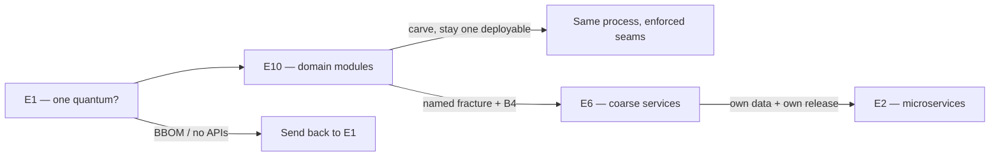

# Modular monolith

**See also:** [monolithic architecture (E1)](Monolith.md) · [microservices (E2)](Microservices.md) · [layered architecture (E3)](LayeredArchitecture.md) · [hexagonal / ports-and-adapters (E8)](Hexagonal.md) · [strangler fig (B4)](StranglerFig.md) · [package by component](../coding-rules/package.md) · [boundaries as deployment mode](../coding-rules/boundaries-anatomy.md) · [independence](../coding-rules/independence.md) · [style-selection facts](../../.cursor/skills/arch-style/references/style-selection.md) · [ADR 0005](../../docs/architecture/adrs/application/mobile-test-automation/0005-adopt-plain-modular-monolith-partitioned-by-cluster.md) · [external research note (2026-09-13)](../../docs/research/sysdesign/e10-modular-monolith-external-research.md)

A modular monolith is **one independently deployable unit** whose *top-level* cut is the **business domain**, not a technical layer. Each module publishes an interface; seams are enforced (compiler, module system, or a checker). Crossing a seam is a function call. There is one process image, one release train, one primary architecture quantum. Replicas and containers do not split it. A shared database still keeps **quantum count = 1**.

[E1](Monolith.md) owns the *family*: one quantum or not. This card owns the *partition*: domain modules, published APIs, enforced seams, extractability, and the book's ch11 scorecard. [E2](Microservices.md) owns distribution — own process, own data, independently releasable. HTTP plus folders is not this style; HTTP plus a shared schema is a distributed monolith, still one quantum.

Quality attributes, recorded as facts from [style-selection](../../.cursor/skills/arch-style/references/style-selection.md) ch11 (not re-scored): **cost / simplicity / modularity HI**; **deploy / test 2★**; **scale / elasticity 1★**; **fault tolerance unsupported**. The buy is cheap ACID, in-process calls, and a wrong cut that is still a refactor. The costs are total release coupling, clone-the-whole-app scale, and one process / one fate. Isolation, independent scale, residency, or an independent release of a *named* slice are reasons to *leave*, not knobs inside E10.

| Sibling | Why not this card |
|---|---|
| **[E1 Monolith](Monolith.md)** | The family. E1 decides "one quantum?"; E10 decides the partition. BBOM and "we have folders" stay on E1. Do not read ch11 stars as E1's scorecard. |
| **[E2 Microservices](Microservices.md)** | Fine-grained, DB-per-service, most quanta of any style. A *destination* after prerequisites and a named fracture. |
| **E6 SOA / service-based** | Coarse services (book: usually ≤12, often one DB). First distributed hop; ADR 0005's named target. |
| **[E3 Layered](LayeredArchitecture.md)** | Horizontal *technical* bands. Same quantum (1); ratings `—`. Usual *from*. Promote domain modules to the top; keep layers *inside*. |
| **[E8 Hexagonal](Hexagonal.md)** | Inside/outside + ports. A module *may* be hexagonal; not a synonym. |
| **E7 Microkernel** | Core + plug-ins + registry. Optional hybridization; ADR 0005 declined it locally. |
| **[B4 Strangler fig](StranglerFig.md)** | *Mechanism* to leave a live E10. This card decides whether / toward which style. |

## Lineage and vocabulary

- **Richards & Ford, *Fundamentals of Software Architecture* 2nd ed., ch11** (via [style-selection](../../.cursor/skills/arch-style/references/style-selection.md); O'Reilly body was Access Denied 2026-09-13 — do not re-derive). Single deployable, domain modules; quanta **1**; ratings above. When-to: tight budget/time, unclear direction, DDD teams, **domain-shaped** change. **Not** for high operational characteristics or technically-oriented change streams. Too-big signs: long changes, surprise breakage, team collisions, slow startup.
- **Fowler, "MonolithFirst" (2015-06-03)** and **"MicroservicePremium" (2015-05-13).** Successful microservice stories started as a monolith that was broken up; greenfield-as-microservices ended in trouble. Do not consider microservices unless the system is **too complex to manage as a monolith**. "Do pay attention to good modularity within that monolith." Boundaries hold "in theory"; "in practice it seems too easy for module boundaries to be breached" — why this is its own card. Advice is **tentative**. The *logical* extract path is APIs **and** data layout; he had **few** success stories of that path (note 1: you cannot assume an arbitrary monolith decomposes).
- **Fowler, "PresentationDomainDataLayering" (2015-08-26).** Layers work at *small* grain; once a layer gets big, "split your top level into **domain oriented modules which are internally layered**." That is E3 → E10. Splitting *teams* by technical layers is the anti-pattern.
- **Simon Brown, package-by-component** (~2013; GOTO Berlin 2018). "If you can't build a well-structured monolith, what makes you think microservices is the answer?" Four cuts; only the last is E10's native: package-by-layer (E3), package-by-feature, ports-and-adapters (E8), **package-by-component** (business logic + persistence behind one published interface; UI outside). If every type is `public`, all four collapse. Prefer the **compiler** over a post-hoc checker ([package.md](../coding-rules/package.md)). Modularity ⊥ deployment-unit count — BBOM, modular monolith, microservices, and distributed BBOM sit on that 2×2.
- **Shopify Engineering.** 2019: **>1000 developers**, no boundaries; 2016 tripwires; **rejected microservices**; moved **monolith → modular monolith** — one application, strictly enforced domain boundaries; ~6000 classes reorganized; public API + exclusive data. 2020: **2.8M** lines, **500k** commits, **37 components**. Dense/cyclic graphs make public interfaces extra indirection; prefer **functional** cohesion. Extract a service only for a named reason (storefront throughput; card-vault residency). 2024 Packwerk retrospective: static constant-reference checker + `package_todo.yml`; privacy checks removed in **3.0**. Isolating "Platform Essentials" took **months** after todos hit zero. Domain buckets ≠ runtime function.
- **Thoughtworks / Garg (2023-06-03).** Modules independently developed and tested; **deployed as a single unit**; extractable business-capability boundaries. Microservices are an **end-goal**, not a starting point. Leave when modules must scale differently, the team outgrows one release train, diverse technology is required, or the domain is well understood *and* complexity needs encapsulating as services.
- **Martin** ([boundaries-anatomy.md](../coding-rules/boundaries-anatomy.md), [independence.md](../coding-rules/independence.md)): one executable; source-level seams stay real; crossings are chatty function calls. Stay in-process as long as a service *could* form.

## What the style is

Minimum mechanical properties (not a library checklist):

1. **One process image, one release train, one primary quantum.** Replicas and containers do not split it.
2. **Domain modules as the top-level cut**, each with a **published** interface. Shopify: cross-component ActiveRecord associations always violate.
3. **Enforced seams** — compiler / module system / checker. If everything is `public`, E3 / E8 / E10 are the same graph (Brown).
4. **Acyclic module graph**, or inversion of control where a cycle would form. Shopify 2020: cycles mean "they are really one thing." In-process pub-sub still E10, not E4.
5. **Data ownership at the module** even on a shared engine — Fowler's extractability precondition (MonolithFirst note 1).

**Module boundary vs process boundary.** A module boundary is a *source-level* seam: compiler visibility, a published type, a forbidden import. Crossing it is a function call. A process boundary is a *quantum* seam: its own deployable, its own failure domain, usually its own datastore. E10 has the first and refuses the second. Crossing to another process is someone else's style (E6 / E2). That is the cost/simplicity win and the chatty-interface habit (Martin).

**Shared database still one quantum.** Architecture quantum = smallest independently runnable part. **The DB is part of the quantum** — a single shared DB ⇒ quantum of one ([style-selection](../../.cursor/skills/arch-style/references/style-selection.md) ch7). Carving HTTP endpoints on one schema does not raise the count. Sync calls between attempted quanta silently merge them.

## What the style is not

| Lookalike | Why it is not E10 |
|---|---|
| **Big Ball of Mud (E1 gone wrong)** | Expedient structure. No published APIs. Shopify 2016 was this; 2019's target was E10. **Send BBOM back to E1.** |
| **E1 as a family** | E1 answers "one quantum?" E10 is one *partitioning* of that family. |
| **Package-by-layer (E3)** | Technical buckets. Fowler 2015: promote domain modules; keep layers *inside*. |
| **Package-by-feature, all types public** | Vertical folders without encapsulation (Brown). A ball of mud with directories. |
| **Hexagon (E8)** | Inside/outside + ports. Orthogonal sibling cut. |
| **Distributed monolith** | "Services" + one schema + lock-step ([modular-design-principles.md](../ml-solutions-arch/modular-design-principles.md)). Quantum still **one**. Style-selection's name: Big Ball of Distributed Mud. |
| **Microservices (E2)** | Own process + own DB. Extracting a module *is* the E10→E2 move. |

## Typical quantum count — FACT

Do **not** re-run arch-style's four determinations; do **not** re-score. Reproduce the row.

| Style | Topology | Partitioning | Quanta (FACT) | Prose-recovered ratings | Cite |
|---|---|---|---|---|---|
| **Modular monolith (ch11)** | single deployable, domain modules | domain | **1** | **cost/simplicity/modularity HI; deploy/test 2★; scale/elasticity 1★; fault tolerance unsupported** | `Modular-monolith-arch.md:216-225` via style-selection |

**E10 typical quantum count = 1.** No other star cells recovered. Do not fill `—` cells. Do not borrow E7's evolvability 3★.

## Decision mechanics

### Module boundaries

The decision question is not "can I draw boxes?" It is: **does the top-level organisation follow the domain, does each module hide its persistence behind a published type, and does the compiler (or CI) refuse a forbidden import?** If the answer is "we have folders," you are still on E1. If the answer is "we have HTTP and one schema," you have left the process and kept the quantum — worse than staying.

| Signal | Stay E10 | Re-cut inside E10 | Leave the family |
|---|---|---|---|
| Characteristics | One coherent set; change is domain-shaped | Same set; seams rot or collide | Multiple counteracting sets that fail the coupling test |
| Data | One engine; tables already follow modules; opposite-lifecycle tables do not share FKs | Ownership labels ignore runtime function (Packwerk 2024: "billing" holding fraud) | Own data *and* own release. Shared schema behind HTTP is not leaving |
| Graph | Acyclic; published API is the only crossing | Cycles, or a public API that leaks the old control flow | Sync call to a hoped-for second quantum — the call merges them back |
| Team | Module ownership inside one train (Shopify: 37 components) | Long changes, surprise breakage, team collisions, slow startup — first response is re-cut | Several teams blocked on one train **and** fracture planes known |
| Scale / fail / reside | Clone-the-app is acceptable | Same quantum; extract is a *later* option | A named part must do one of those independently and is not coupled by a shared store or a sync call |

Brown's compiler-over-checker rule is the enforcement default. ArchUnit, Packwerk, Spring Modulith, and NetArchTest are **existence proofs**, not defaults to copy — Group E styles have none. A checker can encode a *wrong* graph; zero Packwerk todos is not "bootable as a service" (Shopify 2024).

The coupling test is the same one E1 uses: two things are coupled if changing one might break the other ([style-selection](../../.cursor/skills/arch-style/references/style-selection.md), `ArchCharScope.md:52`). Higher coupling is allowed for narrower scopes; the broader the scope, the looser the coupling should be. A published module API is the narrow scope. A shared table or a synchronous call across a hoped-for quantum boundary is the broad one — and is how you discover you still have one quantum.

### Data ownership on a shared engine

A single relational DB is the default to **challenge**, not a law. Split tables along domain modules from day one; opposite-lifecycle tables should not share foreign keys even on one engine ([style-decision.md](../../docs/architecture/worksheets/mobile-test-automation/style-decision.md) §3). ACID is cheap here (E6 is the book's "best distributed style for ACID needs"; E2 forbids cross-service transactions). Reach-in from another module's repository, or a shared `CUSTOMERS` table two modules both write, is the extractability trap in miniature.

Shopify's rule is exclusive data behind the public API; cross-component ActiveRecord associations always violate. That is still *one schema* until the day you extract — exclusive *access*, not a second database. The quantum does not rise because you named the tables.

### Extractability

E10's job is to make Fowler's note 1 false *before* you extract: most systems "can't be sensibly broken apart" if they acquired too many dependencies. Design APIs **and** data from day one, *and* enforce them, or you get a BBOM — which is E1's failure mode, not this style.

A module is extractable when (all three): its published interface is the only inbound crossing; it owns its tables (no reach-in, no shared FK web); and no synchronous call on the user path would collapse the new quantum back into the old one. Fail any one and the extract is a distributed monolith in waiting.

Fowler's other paths out of a monolith still apply, and they are not this style: peel edges and leave a quiet heart ([B4](StranglerFig.md)); a sacrificial first monolith you replace; a two-service "duolith" (E6-shaped, often still one DB). Do not call any of those E2. Do not skip to E2 to "get used to the rhythm."

Thoughtworks's "extract with minimal effort" is aspiration. Shopify's Platform Essentials isolation — months after Packwerk-zero — is measured cost. Pulling a module that still shares a table pays the network and keeps the one-quantum coupling.

## When to use

- Tight budget / time; direction unclear — **start here, migrate later** (book `:229-239`; MonolithFirst + MicroservicePremium).
- DDD / Bounded-Context teams and **domain-shaped** change.
- One characteristics set (decision tree → monolith family).
- A stream-aligned team can hold the system; module ownership first (Shopify 2020).
- ACID / single-transaction lineage is driving — cheap here, expensive after a split.
- Extractability later without paying process distance now.

## When not to use

- **High operational characteristics.** Scale/elasticity **1★**, FT **unsupported**. Isolation is a reason to *leave*.
- **Technically-oriented change streams.** That is E3 / E7, not E10 (`:229-239`). ADR 0005 corrected a pipeline-stage cut for exactly this reason.
- A **named** part must scale, fail, reside, or release independently and is not coupled by a shared store or a sync call (Shopify: storefront, card vault).
- Several teams blocked on one train *and* fracture planes known → [B4](StranglerFig.md) toward E6 / E2.
- Diverse technology / independent runtimes (Thoughtworks).
- The system is already a BBOM and you intend to "add HTTP." That skip produces a distributed monolith. Impose seams first (E1 → E10).

Do not skip to E2 to "get used to the rhythm." Fowler recorded the counter-argument and still advised against it.

## Migration: E1 → E10 → E6 / E2 via B4

**In (carve modules, stay one deployable).**

| From | Move |
|---|---|
| Greenfield | Start E10, not E2. Design APIs **and** data (Fowler path 1) *and* enforce them (Brown). |
| **E1 BBOM** | Stay on one deployable; impose domain seams. Shopify 2017–19: reorganize by real-world concepts, public APIs, score violations. Müller 2020: pick the incomplete-state that is useful (ownership-first vs spin-off-clean). |
| E3 layered | Promote domain modules to the *top* level; keep layers inside. The Architecture Sinkhole is a reason to leave E3, not a reason to jump to E2. |
| Over-split E2 | Collapse quanta (Martin: slide back as operational need declines). |

**Out (extract via B4).** Order of cost, not fashion.

1. Stay E10 until a named fracture is real and MicroservicePrerequisites exist (E2 owns that list).
2. **E10 → E6** — coarse services, often still one DB; ~12; heavy chatter = wrong boundaries. ADR 0005 names this destination.
3. **E10 / E6 → E2 via B4** — one module at a time from a low-dependency edge (Fowler's peel). Shopify extracted only for throughput or residency.
4. Hybridizations that stay one quantum (E7 / E8). Local gate declined E7 — a local decision, not a law.

The day you leave, you start paying the fallacies of distributed computing (style-selection ch9). E10's cheapest property is that none of those are in force *inside* the quantum.

## Worked example — mobile-test-automation

[style-decision.md](../../docs/architecture/worksheets/mobile-test-automation/style-decision.md) (gate closed 2026-07-26) and [ADR 0005](../../docs/architecture/adrs/application/mobile-test-automation/0005-adopt-plain-modular-monolith-partitioned-by-cluster.md): **one quantum**, one Spring Boot deployable, **three domain modules** on characteristic clusters (conversion, validation-certification, evidence), one primary datastore; pipeline kept as *internal flow*, not macro style. ADR 0017 re-affirms the same quantum for the o7 fork.

Why E10 not E3: the blueprint's five names were **technical pipeline stages** — "the shape the modular-monolith style explicitly warns against." Re-partitioned onto stage-1 clusters. Why not E2: IR spine shared; Preserve Provenance CA = 13 of 16 — shared DB ⇒ quantum of one; a sync Certify→Models call would collapse any split. Replay-on-devices and cluster C looked extractable and failed (shared lineage store; thirteen in-process contracts plus audit writes that must share a local transaction). Rejected: E2 (semantic coupling + fashion check); E3 as macro style; E6 *today* (no quantum boundary). Destination: **E6**, via B4 when a named flip fires (residency; ADR 0017 — a second live execution backend reopens a *localized* SPI). CI asserts exactly one deployable.

**E1 answered "one quantum?"; this card answers "domain modules, not pipeline stages."** Smaller proof: [modular-pipeline-exercise.md](../ml-solutions-arch/modular-pipeline-exercise.md) — five in-process classes; "add APIs and Docker" is when the quantum would change.

## Failure modes

- **Folders without encapsulation.** All types `public` (Brown). E10 collapses to E3's graph — a ball of mud with directories. Recovery is access modifiers, not HTTP.
- **Public API on a cyclic graph.** Shopify 2020: interfaces leak the old control flow. Cycles mean they are really one module.
- **Domain labels that ignore runtime function.** Packwerk 2024: "shop billing settings" including fraud lived in Billing by name.
- **Informational cohesion around tables.** Change locality stays poor; extractability is a fiction.
- **Distributed-monolith cargo cult.** HTTP + shared schema + lock-step deploys. You pay the network and keep the one-quantum coupling. The modulith that is a distributed monolith *in waiting* is the same story one extract early: a module that still shares a table, or a sync call that would merge the new process back.
- **Checker theatre.** Zero Packwerk todos ≠ bootable. A checker can freeze a wrong graph.
- **Too-big signs ignored** (book `:92-104`). Long changes, surprise breakage, team collisions, slow startup. First response is re-cut, not a mesh.
- **Fashion skip.** Microservice Envy (MicroservicePremium). Jumping E1 → E2 to "practice distribution" burns the cheap modularity move.

## Trade-offs

Qualitative, source-backed. **No invented stars.** 2★ / 1★ / "unsupported" are style-selection recovered facts.

| Concern | E10 wins | E10 loses | Source |
|---|---|---|---|
| Cost / simplicity | Book: **HI**. One pipeline; no suite-of-services premium | Later cost if seams are never enforced | style-selection; MicroservicePremium |
| Modularity | Book: **HI** *when* APIs + data + enforcement hold | Boundaries breach under deadline; a checker can encode a *wrong* graph | style-selection; Fowler "in practice"; Shopify 2024 |
| Deploy / test | Cookie-cutter CD still works | Any change rebuilds everything; book **2★** | style-selection |
| Scale / elasticity | Clone-the-app is simple | Hot path clones the cold path; book **1★** | style-selection |
| Fault isolation | — | One process, one fate. Book: FT **unsupported** | style-selection |
| Extractability | Wrong cut is a refactor, not a multi-repo migration | Fowler had few path-1 success stories; Shopify isolation cost is months even at Packwerk-zero | MonolithFirst n.1; Packwerk 2024 |
| Consistency | In-process + one DB = cheap ACID | Shared schema becomes the trap the day you extract | style-decision; E2 "don't" |
| Team autonomy | Module ownership inside one train (Shopify 37 components) | Many teams on one release still collide; too-big signs above | Shopify 2020; style-selection `:92-104` |
| Network fallacies | Not paid *inside* the quantum | Paid the day you extract | style-selection ch9 |

[E1](Monolith.md) decides **whether you have one quantum**. This card decides **whether that quantum stays modular and extractable**. [E2](Microservices.md) / E6 decide **whether a named fracture has earned a second deployable**. [B4](StranglerFig.md) decides **how you leave a live system**. Do not treat folders, a second container, or an HTTP façade as a style change.

## Sources

Verified 2026-09-13; the full URL list, per-claim provenance, and items deliberately left out are in the [external research note](../../docs/research/sysdesign/e10-modular-monolith-external-research.md). Quantum counts and recovered ratings are FACT from [style-selection.md](../../.cursor/skills/arch-style/references/style-selection.md) — do not fill missing star cells or borrow E7's evolvability 3★.

- Canon: Richards & Ford via style-selection (ch7 quantum; ch11 row, when-to, too-big signs); Fowler, *MonolithFirst*, *MicroservicePremium*, *PresentationDomainDataLayering*; Brown, modular-monolith / package-by-component.
- Practice: Shopify, *Deconstructing the Monolith* (2019-02-21), *Under Deconstruction* (2020-09-16), *A Packwerk Retrospective* (2024-02-07); Garg / Thoughtworks (2023-06-03).
- This tree: [package](../coding-rules/package.md), [boundaries-anatomy](../coding-rules/boundaries-anatomy.md), [independence](../coding-rules/independence.md), [modular-design-principles](../ml-solutions-arch/modular-design-principles.md), [modular-pipeline-exercise.md](../ml-solutions-arch/modular-pipeline-exercise.md), [ADR 0005](../../docs/architecture/adrs/application/mobile-test-automation/0005-adopt-plain-modular-monolith-partitioned-by-cluster.md), [ADR 0017](../../docs/architecture/adrs/application/mobile-test-automation/0017-keep-the-modular-monolith-for-o7-record-the-execution-backend-flip-trigger.md), [style-decision](../../docs/architecture/worksheets/mobile-test-automation/style-decision.md).
