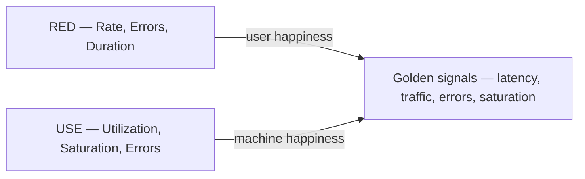

# Monitoring and observability foundations

**See also:** [circuit breaker](CircuitBreaker.md) · [retry, backoff, and retry budgets](RetryBackoff.md) · [load shedding](LoadShedding.md) · [rate limiting](RateLimiting.md) · [graceful degradation](GracefulDegradation.md) · [bulkhead](Bulkhead.md) · [performance](../data-intensive-design/performance.md) · [NFR references](../data-intensive-design/nfr-references.md) · [monitoring as data management](../fincancial-data-architecture/monitoring-observability.md) · [feedback loop](../claude-certification/stakeholder-engagement/feedback-loop.md) · [external research note (2026-09-13)](../../docs/research/sysdesign/d1-observability-foundations-external-research.md)

This note owns the catalog **signal vocabulary** and the three **golden-metric frameworks**. A metric, a log, a trace, and a profile mean one thing in this bundle. D2 (client RUM), D3 (server dashboards), D4 (trace propagation), and D5 (SLOs / burn rates) **consume** those definitions; they must not re-derive “metric” or “trace.” [C1](CircuitBreaker.md) breaker dashboards are *placement* of these signals — state, trip rate, not-permitted calls — not a fourth type.

**Monitoring** is collecting, processing, aggregating, and displaying real-time quantitative data (Ewaschuk, SRE book ch. 6). **Observability** is inferring internal behaviour from external outputs — a data-management problem first. Having three stores does not make a system observable.

Quality attributes: **diagnosability** (you can name what broke and why), **operability** (pages are urgent, actionable, and user-visible), **cost** (cardinality is both the bill and the correctness bound), and **reliability of the telemetry path**. The costs are another production system to run, a fail-open product / fail-closed record split, and alert fatigue if you page on causes.

Sibling actuators are not this pattern. [Rate limiting](RateLimiting.md) is admission by *policy* (429). [Load shedding](LoadShedding.md) is admission by *capacity* (503) — it *consumes* saturation. [Graceful degradation](GracefulDegradation.md) shrinks the *response*; this note only says the degraded path needs its own RED. [Bulkhead](Bulkhead.md) partitions capacity; USE treats those pools as resources. [Retries](RetryBackoff.md) mask failures that only white-box metrics catch.

## Lineage and vocabulary

- **Ewaschuk, SRE book ch. 6 (April 2016).** Monitoring = collect / process / aggregate / display. **White-box** inspects internals; **black-box** tests what a user sees. If you can measure only four things on a user-facing system, measure **latency, traffic, errors, saturation**. Page when one is problematic — or, for saturation, *nearly* so.
- **SRE Workbook ch. 4 (2018).** Monitoring data also includes text logs, structured events, traces, and introspection. Metrics plus structured logs are what SRE uses most for paging and dashboards.
- **Wilkie, RED (Weaveworks, 2015; GrafanaCon recap 2018-08-03).** For every *service*: request **Rate**, **Errors**, **Duration**. USE is for hardware; RED is the microservices counterpart. Consistency across services lets you put people on call for code they did not write. He treats the four golden signals as **RED + saturation**. Attribution: Ewaschuk wrote the golden signals; Wilkie created RED after a new hire asked for his monitoring philosophy.
- **Gregg, USE (checklists March 2012; ACM Queue 10(12), 2012-12-10).** For every *resource*: **utilization, saturation, errors.** A checklist for early investigation, not a complete methodology.
- **Sridharan, *Distributed Systems Observability* (May 2018).** Logs, metrics, and traces are “often known as the three pillars”; *having* the three does not make a system observable. Metrics are cheap to alert on; logs keep the tail averages hide; traces reconstruct a request across processes.
- **Majors (2024–2025, paraphrase).** “Pillar” is a marketing term; **“signal” is the technical term.** Siloed per-signal stores are Observability 1.0 (hop metrics → logs → traces matching timestamps); wide structured events in one store are 2.0. OpenTelemetry’s own docs use **signal**, not pillar — this card follows that.

## The signals (catalog definitions)

D2 and D3 must not re-define “metric.” D4 must not re-define “trace.”

| Signal | What it is | What it is not |
|---|---|---|
| **Metric** | A runtime measurement plus capture time plus metadata (OTel). Intended for *aggregate* statistics, not a request lifecycle. Instrument kinds: Counter, UpDownCounter, Gauge, Histogram (sync and async). OTLP streams: Sum, Gauge, Histogram, ExponentialHistogram, Summary. Prefer monotonic counters so the backend computes windowed rates. | A substitute for traces. High-cardinality attributes belong elsewhere. |
| **Log** | A timestamped record — structured (stable schema, not merely valid JSON) or unstructured — with optional metadata. OTel top-level fields include Timestamp, TraceId, SpanId, Severity, Body, Resource, Attributes. **Events are a type of log**; not all logs are events. | A paging signal by default. Workbook: inherent delay; use logs to name a root cause a metric cannot. |
| **Trace** | The path of a request. A **span** is a unit of work: name, parent, start/end, context (trace ID, span ID, flags, state), attributes, events, links, status (`Unset` / `Error` / `Ok`). Kinds: `Client`, `Server`, `Internal`, `Producer`, `Consumer`. A span looks like a structured log because it is one, with hierarchy and causality. | Sampling, W3C Trace Context on the wire, or correlation operations — those are **D4**. |
| **Profile** | Resource usage at the code level. The Profiles format (spec **development** as of 2026-09-13) encodes aggregated stack traces, based on Google **pprof**. OTLP path `/v1development/profiles`. | A production-stable signal. Protocol is development; do not treat it as equivalent to traces/metrics/logs. |
| **Exemplar** | A recorded measurement that associates OTel context with a metric event inside an aggregate. Optional `trace_id` / `span_id`. Filters: `AlwaysOn` / `AlwaysOff` / `TraceBased`. | A sixth signal. It is the join from a histogram bucket back to a trace. |
| **Baggage** | Contextual key-value that rides next to context and can be *promoted* onto traces, metrics, or logs by a processor. OTel, verbatim: **“Baggage is not an observability tool”** — no OTLP component. W3C Baggage is a Candidate Recommendation Snapshot, 2024-05-30 (not a Recommendation). | Automatic attributes. Do not put credentials or unfiltered PII in it; inbound keys have no integrity check. |

OTel’s word **signal**: “system outputs that describe the underlying activity of the operating system and applications.” Supported: traces, metrics, logs, baggage. Under development or proposal: events (a log subtype), profiles. Each signal is built on **context propagation**. Specification **1.60.0** (released 2026-08-07): Tracing API/SDK/Protocol stable; Metrics API and Protocol stable, SDK mixed; Logging Bridge API/SDK/Protocol stable; Baggage API/SDK stable; Profiles Protocol development.

## How the frameworks compose

| Framework | Unit | Questions | Place it |
|---|---|---|---|
| **RED** | A *service* (request-driven) | Are users having a bad time? | D3 on servers; D2 on user-visible navigations. |
| **USE** | A *resource* (CPU, disk, lock, thread pool, FD table) | Which resource is the bottleneck? | D3 on hosts, runtimes, pools; D2 on device resources. |
| **Four golden signals** | A user-facing *system* | Latency, traffic, errors, plus fullness | Golden **saturation** is the join: a service-level fullness measure that USE would have found per resource. |

Wilkie: RED is how happy the users are; USE is how happy the machines are. They are complementary views of the same system, not competing scorecards.

**Golden-signal definitions (Ewaschuk, identifiers exact).**

| Signal | Meaning |
|---|---|
| **Latency** | Time to service a request. **Split successful vs failed**: a fast HTTP 500 must not pull success latency down; a slow error is worse than a fast one, so track error latency too. Do not design around the *mean* — average 100 ms at 1 000 QPS can hide 1% at 5 s; that p99 becomes the *median* of a frontend that fans out. Collect counts bucketed by latency. [performance.md](../data-intensive-design/performance.md) already forbids averaging percentiles. |
| **Traffic** | Demand, in a system-specific unit. HTTP: requests/s. KV store: transactions/s. Queue worker: messages/s or lag — the *name* still works; D3 picks the unit. |
| **Errors** | Failed-request rate: **explicit** (HTTP 500s), **implicit** (HTTP 200 with the wrong content), or **by policy** (a one-second commitment makes a 1.2 s success an error). Load-balancer 5xx catch total failures; only end-to-end tests catch wrong content. Classify before counting — [C1](CircuitBreaker.md) already owns 4xx vs 5xx vs 429 for trip criteria; the same table applies here. |
| **Saturation** | How full the service is, on the *most constrained* resource. Many systems degrade before 100% utilization. Latency, especially p99 over a short window (his example: one minute), is often a leading indicator. Also prediction: “the disk fills in 4 hours.” [C10](LoadShedding.md) sheds on this signal; do not fold reject latency into the success histogram. |

**USE terms (Gregg).** Utilization = busy-time (or fraction of capacity for memory). Saturation = extra work that cannot be serviced, often queued — any non-zero can be a problem. Errors = error-event count, *including recovered ones*. ~100% utilization is usually a bottleneck (confirm with saturation). USE is a checklist, not a complete methodology.

## Cardinality

Cardinality of a metric is the number of unique attribute (label) combinations. The SDK keeps a separate aggregation state per combination, so **cost scales with distinct combinations, not with request volume**. User IDs and raw URL paths cause unbounded memory growth.

**Verified default (OTel Metrics SDK, Cardinality limits, Stable):** if no View and no MetricReader override is set, the default aggregation cardinality limit **SHOULD be 2000**. Enforcement is *after* attribute filtering. Overflow measurements are **not dropped**: they fold into one overflow point tagged `otel.metric.overflow=true`. Totals stay correct; any query that groups or filters by an attribute **undercounts**, because overflow *replaces the entire attribute combination*. Worked failure from the spec: a counter labelled `{url.path, success}` overflows; `{url.path=/checkout, success=false}` folds into `{otel.metric.overflow=true}` and an error-rate alert on `success=false` goes silent while the total still looks healthy. The limit does **not** apply to Resource attributes (`service.name`, `service.instance.id`) or instrumentation-scope attributes. Delta temporality resets state each cycle; cumulative retains it until process restart.

**Tool-neutral rule.** Put user ID, request ID, raw path, and build SHA on logs, traces, or exemplars — not on metric attributes. On metrics use *bounded* dimensions: method, *route template*, status class, service, instance. OTel HTTP semconv **1.44.0**: `http.route` is conditionally required and “MUST be low-cardinality” (`/users/:userId`); `server.address` / `server.port` were demoted to Opt-In because they are header-derived and high-cardinality.

Majors (paraphrase): in metrics-backed products, cost tracks cardinality; metrics discard context at write time. Wide structured events keep those dimensions and answer unknown-unknowns; the trade-off is you cannot store every event about every hop, so you sample. Head-based sampling biases against the rare failure — **D4** owns the sampler. A 100% metrics series plus a 1% trace sample is a *deliberate* fidelity split.

## Alerting policy foundations

D5 owns SLI/SLO documents, error budgets, and multiwindow burn-rate math. D1 owns *when a page is justified*, so D5 does not invent a different paging philosophy.

Ewaschuk’s paging rules, used as the D1 default:

- A page detects an otherwise undetected condition that is **urgent, actionable, and actively or imminently user-visible**. N+0 and “nearly full” count as imminent.
- Every page requires intelligence. A robotic response should not be a page — automate it.
- Pages are about a novel problem. If you can ignore an alert knowing it is benign, the rule is wrong.
- **Symptom over cause** for paging. “What’s broken” vs “why.” Causes belong on dashboards and in traces. One person’s symptom is the next layer’s cause (slow database reads).
- Black-box paging forces discipline: users already see it. White-box catches imminent saturation and failures **masked by retries**.
- Email alerts are “alert spam.” Prefer a dashboard of subcritical problems plus a log.
- Keep the paging path simple. Google reports limited success with deep dependency hierarchies and with “magic” threshold learners.

Workbook ch. 4: classify so the response is proportional (ticket a low error rate that lasts more than an hour; page a 100% error rate). Suppress: one global-error-rate page instead of one per node; suppress a service’s error-rate page when a dependency already has a firing alert.

Workbook ch. 5 starting numbers — **owned in detail by D5**, recorded here so this card does not invent different ones — for a typical 30-day SLO: page at **2% budget in 1 hour** (burn rate 14.4) and **5% in 6 hours** (burn rate 6); ticket at **10% in 3 days** (burn rate 1). Low-traffic services break the math (10 requests/hour, one failure = 10% hourly errors).

Signals without trigger / owner / action are a dashboard that replaced the [feedback loop](../claude-certification/stakeholder-engagement/feedback-loop.md).

## Verified defaults (2026-09-13)

Fetched with the [research note](../../docs/research/sysdesign/d1-observability-foundations-external-research.md). Quote these; do not invent vendor SLAs.

| Item | Value |
|---|---|
| OpenTelemetry Specification | **1.60.0**, released 2026-08-07 |
| OTLP | **1.11.0**. Stable for traces, metrics, logs. Development for profiles. Paths `/v1/traces`, `/v1/metrics`, `/v1/logs`, `/v1development/profiles` |
| Semantic Conventions | **1.44.0** |
| Metrics cardinality default | **2000** unique combinations per instrument per collection cycle; overflow → `otel.metric.overflow=true` |
| HTTP server duration | `http.server.request.duration`, Histogram, unit `s`, **Stable**. Required attrs: `http.request.method`, `url.scheme` |
| HTTP duration buckets (advisory) | `[0.005, 0.01, 0.025, 0.05, 0.075, 0.1, 0.25, 0.5, 0.75, 1, 2.5, 5, 7.5, 10]` seconds |
| Prometheus `DefBuckets` | `[.005, .01, .025, .05, .1, .25, .5, 1, 2.5, 5, 10]` seconds; `+Inf` implicit |
| Prometheus scrape | `scrape_interval` default **1m**; `scrape_timeout` default **10s** |
| Collector sending queue | `enabled` **true**; `queue_size` **1000** (unit = requests, not spans); `num_consumers` **10**; `block_on_overflow` **false** (drop) |
| Collector retry | 5 s → 30 s cap, 1.5×, `max_elapsed_time` **300 s** |
| Collector self-metrics | Prometheus on `127.0.0.1:8888` |
| W3C Baggage | CR Snapshot **2024-05-30**, not Recommendation |

**Resolution (Ewaschuk, not a vendor SLA).** CPU over a one-minute average hides spikes that drive tail latency. For a 99.9% annual target (~9 hours downtime/year), probing success more than once or twice a minute is probably unnecessary; disk-full checks more than once every 1–2 minutes likewise. Per-second CPU *can* be sampled internally and exported as a 5%-wide histogram every minute.

**Instrumentation shape Wilkie actually wrote down.** One `request_duration_seconds` histogram, labels `method`, `route`, `status_code`, buckets = `prometheus.DefBuckets`. Rate = `sum(rate(..._count[1m]))`; Errors = `sum(rate(..._count{status_code!~"2.."}[1m]))`; Duration = `histogram_quantile(0.99, sum(rate(..._bucket[1m])) by (le))`. Trade-off: `status_code!~"2.."` folds 4xx (caller / validation) into the error rate — the same classification problem [C1](CircuitBreaker.md) owns. Prefer status *class* or an explicit error predicate; never put the raw path in `route`.

`histogram_quantile` interpolates. If no bucket sits on the SLO threshold, the estimate lies. DefBuckets top out at 10 s — useless as-is for 10-minute LLM calls ([poc-to-production.md](../claude-certification/enterprise-integration-production/poc-to-production.md) already flags p95 vs median under load).

## The pipeline is a dependency

The telemetry path has its own saturation, errors, and fail-open / fail-closed choice. A Collector that drops on overflow is **fail-closed for telemetry and fail-open for the product**: the user request succeeds, the record of it does not. Decide that explicitly. The surrounding-code default is almost always to keep requests flowing ([guardrails.md](../claude-certification/responsible-ai/guardrails.md)).

Documented Collector loss modes: endpoint down longer than `max_elapsed_time`; queue overflow; crash with no WAL (in-memory queue dies with the process; `file_storage` WAL survives process death, not disk-full); disk failure; message-queue failure; misconfiguration; resilience disabled. Kafka (or equivalent) between Agent and Gateway is the documented highest-durability hop; it moves the failure to the queue cluster.

Watch the Collector the way you watch a service: `otelcol_receiver_accepted_*` vs `otelcol_exporter_sent_*`, `otelcol_receiver_refused_*`, `otelcol_exporter_send_failed_*`, `otelcol_exporter_enqueue_failed_*`, `otelcol_exporter_queue_size` / `_capacity`. Refused/failed counters do not by themselves prove loss (retries exist); sustained refused *does* mean the client was told no. Log line: `Dropping data because sending_queue is full`. Self-metrics scraped only on localhost never reach the Prometheus that pages you — a circular-dependency footgun. The legacy `check_collector_pipeline` health endpoint is documented as not working as expected; do not treat it as sufficient.

**Watchdog / dead man’s switch.** kube-prometheus `Watchdog` rule: `expr: vector(1)` — an alert that is *always* firing, routed to an *external* heartbeat. Absence of the Watchdog is the only reliable signal that Prometheus, Alertmanager, or the notification path has died. The watcher must not share fate with the stack it watches.

Treat SDK exporters the same way: bounded queues, visible drops, no silent best-effort. The OTel spec has a Self-Observability section on the 1.60.0 index.

## Observability of monitoring itself

| Signal | What it tells you |
|---|---|
| `otel.metric.overflow=true` series | Cardinality hid a filtered alert. Page this on its own. |
| Collector accepted vs sent, enqueue-failed, queue utilisation | Pipeline drop vs retry. Sustained refused = the client was told no. |
| Watchdog heartbeat | The paging path is alive. Absence is the page. |
| Exemplar / `trace_id` on the metric, `span_id` on the log | Connective tissue. Without it you hop stores matching timestamps. |
| Split success / error latency | Fast 500s are not making the service look faster. |
| Shed / 429 / fallback rates as *separate* series | [C10](LoadShedding.md) and [C4](RateLimiting.md) rejects must not enter the success histogram; [C11](GracefulDegradation.md) degraded responses need their own RED. |

## Tuning

| Knob | Too low / narrow | Too high / wide | Starting point |
|---|---|---|---|
| Metric attribute set | Cannot group the page | Overflow; silent `success=false` | Bounded: method, route template, status class, service, instance |
| Cardinality limit | Overflow on a quiet service | OOM / scrape death | SDK default **2000**; alert on overflow before raising it |
| Histogram buckets | Interpolation around the SLO; LLM calls off the scale | Cardinality of buckets × series | Semconv advisory for HTTP; add a bucket *on* the SLO threshold; do not ship DefBuckets unchanged for 10-minute model calls |
| Scrape / export interval | Noise; cost | Hidden saturation spikes | Prometheus default **1m**; Ewaschuk: once or twice a minute is enough for many black-box probes |
| Error predicate | 5xx-only misses implicit / policy errors | `!~"2.."` pages on 401/404/422 | Explicit 5xx + timeout + dependency 429/503; synthetics for wrong-content 200s |
| Page vs ticket | Alert spam; missed user-visible failures | Silent brownout | Symptom, urgent, actionable; ticket the slow burn; D5 attaches burn-rate windows |
| Trace sample rate | Tail of failures missing | Cost | Deliberate split: 100% RED metrics, sampled traces (D4 owns how) |

## Worked calibration — checkout RED + payment-pool USE

A design drill, not a vendor SLA. Same checkout → payment shape as the [C1 calibration](CircuitBreaker.md#worked-calibration--checkout--payment-gateway): live capture with an async queue fallback.

| Knob | Choice | Why |
|---|---|---|
| Service RED | One `http.server.request.duration` histogram (unit `s`) | Wilkie’s shape; OTel stable HTTP server metric. |
| Labels | `http.request.method`, `http.route` template (`/checkout`, `/checkout/pay`), status *class* | Low-cardinality. Raw path and user ID go on the span / log, not the series. |
| Buckets | Semconv advisory, plus a boundary on the checkout SLO threshold | Interpolation lies if no bucket sits on the target. |
| Error predicate | 5xx, timeout, payment 503; **not** 4xx validation | Same classification as the breaker. `!~"2.."` would page on bad input. |
| Latency split | Success histogram vs error histogram | Fast payment 500s must not improve p50. Shed / enqueue latency is a *different* series ([C10](LoadShedding.md)). |
| USE on the bottleneck | Payment-client thread pool: utilisation (active/max), saturation (queue depth), errors (timeouts, pool-exhausted) | RED on checkout says users are unhappy; USE names the pool. This is [C8](Bulkhead.md) capacity as a resource. |
| Implicit errors | Synthetic checkout that asserts the order-id in the 200 body | Load-balancer 5xx will not catch a wrong-content success. |
| Degraded path | Separate RED on the async-queue accept | [C11](GracefulDegradation.md) is the product decision; this card only requires the path to be visible. |
| Pipeline | Collector queue 1000 / drop-on-overflow; Watchdog to an external heartbeat; alert on `otel.metric.overflow=true` | Fail-open for checkout, fail-closed for the record — explicit. Self-metrics must leave localhost. |
| Paging | Symptom: checkout error rate or saturation *nearly* full. Not: one replica down behind a healthy LB | Ewaschuk. D5 later attaches 2%/1 h and 5%/6 h burn rates to these same series. |

Revisit after a week of overflow flags, collector enqueue-failed, and the split latency histograms. If RED is red and USE is green, the bottleneck is a dependency, not this host — look at the breaker’s downstream error and slow-call rates ([C1](CircuitBreaker.md#observability)).

## Failure modes of monitoring itself

1. **Cardinality overflow hides the page.** Totals stay correct; filtered labels undercount. Detect `otel.metric.overflow=true`.
2. **Raw URL / user ID on a metric.** Unbounded series, SDK OOM, scrape failure, or a “custom metrics” bill. Put those dimensions on logs/traces.
3. **Mean latency / unsplit success+error latency.** Fast 500s make the service look faster as it gets worse.
4. **Implicit and policy errors invisible to the load balancer.** HTTP 200 + wrong body; SLO-late successes. A 5xx-only RED panel is a false green.
5. **Histogram interpolation around the SLO threshold.** DefBuckets stop at 10 s.
6. **Alert fatigue.** Bigtable SRE: paging on synthetic *mean* plus email as the SLO approached — volume so high the team missed user-visible failures. Remedy was relaxing the target and disabling email to fix the real problem. Gmail: paging on every de-scheduled task; the durable fix was automating the rote poke.
7. **Magic detectors and deep dependency trees.** Google: limited success. Rarely exercised collection is a candidate for deletion.
8. **Pipeline drop = silent product success.** Default Collector queue drops at 1000 in-flight *requests*. No Watchdog → you will not be paged when Prometheus dies.
9. **Baggage leakage.** User IDs and origin IPs in outbound headers; untrusted inbound keys written into attributes.
10. **Three-store hop without correlation IDs.** Metric with no exemplar, log with no span_id. Sridharan and Majors disagree on storage; both require connective tissue. D4 stitches it.
11. **Sampling the tail away.** Head-based sampling biases against the rare failure you needed.
12. **Observability that replaced the feedback loop.** Signals without trigger / owner / action.
13. **Monitoring the wrong layer of an LLM call.** Retries next to the API, breakers at the boundary, fallbacks in orchestration; p95 under concurrency is not demo median; [guardrails](../claude-certification/responsible-ai/guardrails.md) that fail open look healthy. None of that changes the signal definitions.

## When not to use (the frameworks, not “don’t monitor”)

- **USE alone on a request-driven service.** Pod utilization is not user happiness — Wilkie’s reason for inventing RED. Memory “errors” on Linux are the awkward example.
- **RED alone on a resource.** Rate/Errors/Duration of a disk are the wrong questions; use USE.
- **RED `status_code!~"2.."` as the error definition.** Counts 401/404/422 as service failures. Classify first.
- **Four golden signals on a batch / queue worker without translation.** Traffic becomes messages/s or lag; latency becomes age-of-oldest; saturation is consumer-lag or disk. D3 picks units; it does not redefine the signals.
- **Paging on every cause.** You will page on every crashed replica behind a healthy load balancer.
- **Requiring all OTel signals before the first dashboard.** Each signal is independently usable. Start with RED histograms + USE on the bottleneck resource + a Watchdog.
- **High-cardinality metrics as a substitute for traces.** That is how you buy a metrics outage.
- **Treating the Collector health endpoint as sufficient.** Use accepted-vs-sent, queue utilisation, and an external Watchdog.

## Trade-offs

| Buy | Pay |
|---|---|
| One vocabulary for metric / log / trace / profile | D2–D5 must consume it; a second local definition will drift |
| RED for user happiness, USE for the bottleneck, golden saturation as the join | Wrong framework on the wrong unit (USE on a service, RED on a disk) |
| Metrics cheap to alert; logs for the tail; traces for the hop | Three-store hop unless exemplars / IDs join them; or one wide-event store you have to sample |
| Cardinality limit 2000, overflow folded not dropped | Totals look healthy while the filtered page goes silent |
| Symptom pages, cause on dashboards | White-box saturation and retry-masked failures need a second, quieter path |
| Collector drop-on-overflow keeps the product up | The outage has no record; Watchdog is mandatory |
| Start with one histogram + one USE resource + a Watchdog | Unknown-unknowns wait for structured events / traces (D4) |

D1 decides **what a signal is** and **which four numbers are enough**. D3 decides **where they are scraped**. D4 decides **how a request is stitched**. D5 decides **the contract you page on**. C1 / C4 / C8 / C10 / C11 **place** those signals on a breaker, a limiter, a pool, a shed, and a degraded path.

## Sources

Verified 2026-09-13; the full URL list, per-claim provenance, and items deliberately left out are in the [external research note](../../docs/research/sysdesign/d1-observability-foundations-external-research.md). Items already cited in this tree are referenced by their number in [nfr-references.md](../data-intensive-design/nfr-references.md).

- Canon: Ewaschuk / Beyer, SRE book ch. 6 (April 2016); SRE Workbook ch. 4–5; Gregg, USE (ACM Queue 2012-12-10); Wilkie, RED (Weaveworks 2015 / GrafanaCon 2018); Sridharan, *Distributed Systems Observability* (May 2018); Majors on pillars vs signals (2024–2025).
- Standards: OpenTelemetry Specification 1.60.0, OTLP 1.11.0, Semantic Conventions 1.44.0; W3C Baggage CR 2024-05-30.
- Pipeline: Collector exporterhelper defaults (queue 1000 / 10 consumers / retry 5–30–300); kube-prometheus Watchdog; Prometheus `DefBuckets` and scrape defaults.
- In-tree: [performance.md](../data-intensive-design/performance.md) (do not average percentiles); [nfr-overview.md](../data-intensive-design/nfr-overview.md); [poc-to-production.md](../claude-certification/enterprise-integration-production/poc-to-production.md); [guardrails.md](../claude-certification/responsible-ai/guardrails.md); [observability-replaced-loop.md](../claude-certification/stakeholder-engagement/observability-replaced-loop.md); [C1 observability](CircuitBreaker.md#observability).
