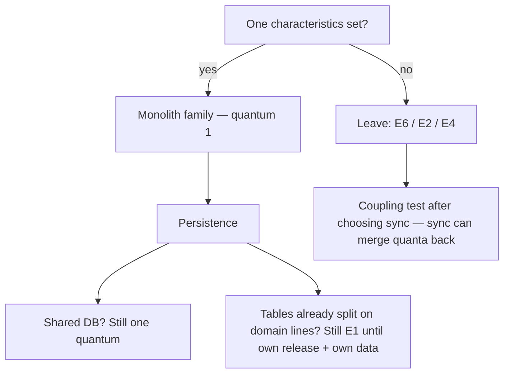

# Monolithic architecture

**See also:** [microservices (E2, later)](Microservices.md) · [modular monolith (E10)](ModularMonolith.md) · [layered architecture (E3)](Layered.md) · [scaling strategies](ScalingStrategies.md) · [distributed vs single-node](../data-intensive-design/distributed-vs-single-node.md) · [maintainability](../data-intensive-design/maintainability.md) · [boundaries as deployment mode](../coding-rules/boundaries-anatomy.md) · [independence](../coding-rules/independence.md) · [style-selection facts](../../.cursor/skills/arch-style/references/style-selection.md) · [ADR 0005](../../docs/architecture/adrs/application/mobile-test-automation/0005-adopt-plain-modular-monolith-partitioned-by-cluster.md) · [external research note (2026-09-13)](../../docs/research/sysdesign/e1-monolith-external-research.md)

A monolith is a **deployment decision**: the server-side application as one logical executable — one process image, one release train, one primary architecture quantum. Internally it may be folders, N layers ([E3](Layered.md)), domain modules ([E10](ModularMonolith.md)), pipes, a microkernel, or a hexagon. Those are *partitioning* choices. This card records the family: **one independently deployable unit**. Cloned replicas behind a load balancer are still one quantum (same bits, same schema). A container does not split it.

It is **not** a Big Ball of Mud, and it is **not** [E10](ModularMonolith.md). A BBOM is a failure of internal structure (Foote & Yoder). A modular monolith is the same deployable *with* domain modules, published interfaces, and enforced seams — E10's card; do not read E10's recovered stars as this family's scorecard. The book has **no** star row labelled "Monolithic architecture."

Quality attributes in play: **cost and simplicity** (one artifact, one debugger, one on-call — recovered monolith-family rows: HI), **consistency** (cheap ACID; a lineage write can share a local transaction with the state it describes), and **cycle time** (no suite-of-services premium while Bounded Contexts are still moving). The costs are **total release coupling** (any change rebuilds the executable), **clone-the-whole-app scale** (the hot path takes the cold path with it), and **one process, one fate** (fault isolation is unsupported on the recovered E10 row and LO on microkernel). Isolation, independent release of a named slice, and independently evolving teams are reasons to *leave*, not knobs to tune inside E1.

This card owns the *family* as a quantum decision. It must point at E10 and stop there.

| Sibling | Why not this card |
|---|---|
| **[E10 Modular monolith](ModularMonolith.md)** | Domain modules + published interfaces + enforced seams on one deployable. Ch11 ratings and too-big signs live there. E1's disciplined in-family destination. |
| **[E2 Microservices](Microservices.md)** | Fine-grained, DB-per-service, most quanta of any style. A *destination* after prerequisites and a named fracture — later. |
| **E6 SOA / service-based** | Coarse services (book: usually ≤12, often one DB). First distributed hop; ADR 0005's named target. |
| **[E3 Layered](Layered.md)** | Common *internal* technical partition. Quanta 1; ratings `—`. |
| **E7 / E8** | Other internal shapes that still deploy as one quantum. |
| **B4 Strangler fig** | *Mechanism* to leave a live system. E1 decides whether / toward which style. |
| **E4 / A2 / B7** | Event-driven style and its mechanisms. An internal queue does not make a monolith E4. |

## Lineage and vocabulary

- **Lewis & Fowler, "Microservices" (2014-03-25).** The foil definition: browser UI + one process + one shared RDBMS. Any change rebuilds that executable. You may still divide with classes/namespaces and run **cloned instances** behind a load balancer. Named frustrations, not laws: tied change cycles; decaying modules; scale-the-entire-app.
- **Fowler, "MonolithFirst" (2015-06-03)** and **"MicroservicePremium" (2015-05-13).** Almost all *successful* microservice stories he had heard started as a monolith that was broken up; almost all greenfield-as-microservices stories ended in trouble. Do not consider microservices unless the system is **too complex to manage as a monolith**. "The majority of software systems should be built as a single monolithic application. Do pay attention to good modularity within that monolith." Advice is **tentative**. You cannot assume an arbitrary monolith decomposes.

| Path out (MonolithFirst) | What it is | Trap |
|---|---|---|
| Modularity in APIs *and* data | Design as if services, stay in-process | Few success stories; easy to skip the data half |
| Peel edges, leave a quiet heart | Strangler / B4 | Peeling a coupled heart produces a distributed monolith |
| Sacrificial first monolith | Learn the contexts, then replace | Only the meaning Fowler gives in that bliki; the sacrificial-architecture page was not fetched |
| Two coarse services ("duolith") | E6-shaped | Still one DB is common; do not call it E2 |

- **Fowler, "MicroservicePrerequisites" (2014-08-28)** and **"Design Stamina Hypothesis" (2007-06-20).** Rapid provisioning, basic monitoring, a pipeline of no more than a couple of hours, DevOps collaboration — exit competencies for [E2](Microservices.md); they "really ought to" exist for monoliths too. No-design is faster until the design payoff line ("usually weeks not months") — a **hypothesis**, not a measured law.
- **Foote & Yoder, "Big Ball of Mud" (PLoP '97).** "Casually, even haphazardly, structured"; organization dictated more by expediency than design. **A monolith is a deployable; a BBOM is a failure of internal structure.**
- **Richards & Ford, *Fundamentals of Software Architecture*** (via [style-selection.md](../../.cursor/skills/arch-style/references/style-selection.md)). Monolith **family** = quantum-1 styles: layered, modular monolith, pipeline, microkernel. Decision tree (ch7): one characteristics set → monolith family → persistence → done. Cite the skill; do not re-derive the four determinations. Skill bias: stay in the family when a single quantum suffices; prefer E10's *partitioning* when direction is unclear — that is a start-shape, not a second card on this page.
- **Martin** ([boundaries-anatomy.md](../coding-rules/boundaries-anatomy.md), [independence.md](../coding-rules/independence.md)): one executable (binary / JAR / .EXE); source-level boundaries remain real; crossings are chatty function calls; threads are **not** architectural boundaries. Push decoupling to the point a service *could* form; stay in-process as long as possible. A good architecture is born a monolith and can later slide back into one.
- **Microsoft Learn, "Common web application architectures" (fetched 2026-09-13).** Entirely self-contained in behaviour; core in its own process; typically deployed as a single unit. Horizontal scale = **duplicate the entire application**. Layers are logical, tiers physical — N-Layer on a single tier is common. Do not split until you can deliver independent feature slices.
- **Shopify.** A decade-plus Rails monolith, >1000 developers, no boundaries (2019). 2016 tripwires: fragile changes, cascading tests, steep onboarding. **Rejected microservices**; moved **monolith → modular monolith**. 2020-09-16 snapshot: 2.8M lines, 500k commits, 37 components. An E1→E10 story, not E1→E2.
- **Skelton & Pais, *Team Topologies*.** A stream-aligned team is a stable 5–9, design/build/run, no hand-off. A monolith too large for one team's cognitive load is a named reason to find fracture planes, *then* extract — Inverse Conway, not "split first."

`aws/ch08.md`'s popular "tightly integrated" gloss is **too strong**: tightness is the BBOM, not the style. The same page then recommends modular code so it can be deployed separately if necessary — that sentence is E10.

## What the style is

One **deployable** — Fowler's "single logical executable," Microsoft's "single unit," Martin's JAR/.EXE. Internally it may be any of the family partitions above. E1 records: **one process image, one release train, one primary quantum.** In-process calls are the cost/simplicity win. Crossing a process boundary is someone else's style.

## What the style is not

| Lookalike | Why it is not E1 |
|---|---|
| **Big Ball of Mud** | Expedient structure. A monolith *may* be a BBOM; it need not be. Shopify 2016 was; the 2019 target was not. |
| **Modular monolith (E10)** | Same deployable, **domain** modules, published APIs, enforcement. Book scores *that* style. This card stops at the family. |
| **Distributed monolith** | "Services" that share a DB and a lock-step release ([modular-design-principles.md](../ml-solutions-arch/modular-design-principles.md)). Network tax of E2, quantum count still **one**. Style-selection's name: Big Ball of Distributed Mud. |
| **N independently deployable services** | [E2](Microservices.md) / E6. Own data + own release ⇒ left E1. |
| **Threads, packages, folders** | Organization, not quanta (Martin). |
| **An internal queue** | A mechanism. It does not make the system event-driven (E4). |

## Typical quantum count — FACT

From [style-selection.md](../../.cursor/skills/arch-style/references/style-selection.md). Architecture quantum = smallest independently runnable part. Independent deployability **includes the database** — a single shared DB ⇒ quantum of one. High functional cohesion, low external static coupling; synchronous communication with another supposed quantum can silently merge them.

| Style (monolith family) | Quanta | Prose-recovered ratings | Who owns the row |
|---|---|---|---|
| Layered (ch10) | **1** | **—** (file truncated; do not invent) | [E3](Layered.md) |
| Modular monolith (ch11) | **1** | cost/simplicity/modularity HI; deploy/test 2★; scale/elasticity 1★; FT **unsupported** | **[E10](ModularMonolith.md)** |
| Pipeline (ch12) | **1** | cost/simplicity/modularity HI; deploy/test "average"; scale/elasticity 1★; FT unsupported | sibling style |
| Microkernel (ch13) | **1** | simplicity/cost HI; test/deploy/reliability/modularity/evolvability/responsiveness 3★; scale/elasticity/FT LO | sibling style |

**E1 typical quantum count = 1.** One characteristics set → monolith family. Multiple counteracting sets → leave. Shared database, even after you carve HTTP endpoints, **collapses you back to one**. Layered stays `—`. Do not paste E10's 2★ / 1★ / "unsupported" onto a BBOM or an unenforced folder tree.

## Decision mechanics

### Single deployable

One artifact, one pipeline, one infra set. Release coupling is total (Lewis/Fowler). That is the buy: Facebook and Etsy show CD is still possible on a monolith — CD-impossible and irreplaceable-parts are **not essential** properties of the style (MicroservicePremium). Still E1: one VM / App Service / single container; several **identical** replicas ([scaling strategies](ScalingStrategies.md) — clone-the-app). A web+worker pair that **must** ship together and share a DB is still one quantum. A container image does not change the count.

The decision question is not "can I draw boxes?" It is: **does any part release, fail, scale, or reside independently — and is it *not* coupled by a shared store or a synchronous call?** If the answer is no, you are still in the family.

| Signal | Stay E1 | Impose E10 on the same deployable | Leave the family |
|---|---|---|---|
| Characteristics | One coherent set | Same, but seams keep rotting | Multiple counteracting sets that fail the coupling test |
| Data | One engine, even if tables already follow domains | Tables split on domain lines; still one schema until extract | Own data *and* own release. Shared schema behind HTTP is not leaving |
| Team | One stream-aligned team (5–9) holds it | Ownership per module; still one train | Several teams blocked on one train **and** fracture planes known |
| Scale / fail / reside | Clone-the-app is acceptable | Same quantum; extract is a *later* option | A named part must do one of those independently |
| Ops maturity | E2 prerequisites missing or unused | CI can enforce seams (ArchUnit, Packwerk — E10's tools) | Rapid provisioning, couple-of-hours pipeline, monitoring, DevOps — and a named fracture |

### Modularity without distribution

In-process calls are the cost/simplicity win and the chatty-interface habit (Martin). Crossing a process boundary is someone else's style and pays the fallacies of distributed computing (style-selection ch9). The disciplined in-family move is **E10**: domain modules, published interfaces, compiler or CI enforcement ([package.md](../coding-rules/package.md) — unenforced packages decay to BBOM). E1 records that modularity is *possible* (Martin; Fowler "in theory") and that "in practice it seems too easy for module boundaries to be breached" (MicroservicePremium). Enforcement lives on E10's card; this card only insists you do not confuse "we have folders" with "we have a second quantum."

Richards & Ford via the skill: a single relational DB is the default to **challenge**, not a law; **split tables along domain components from day one**. Opposite-lifecycle tables should not share foreign keys even on one engine ([style-decision.md](../../docs/architecture/worksheets/mobile-test-automation/style-decision.md) §3). ACID is cheap here and expensive after a split (E6 is the book's "best distributed style for ACID needs"; E2 forbids cross-service transactions). A "microservice" fleet on one schema is E1 wearing E2's clothes.

The coupling test is the one that keeps catching "we already split": two things are coupled if changing one might break the other (style-selection, `ArchCharScope.md:52`). Higher coupling is allowed for narrower scopes; the broader the scope, the looser the coupling should be. A synchronous call across a hoped-for quantum boundary is how you discover you still have one.

### Team and process fit

One stream-aligned team (5–9, you-build-it-you-run-it) maps onto one quantum. Lewis/Fowler: a *large* monolith team must divide along **business** lines, not UI/server/DB. Organizational pain is not a style defect: Shopify 2016 whole-graph onboarding; E10's too-big signs (long changes, surprise breakage, team collisions, slow startup) live on that card as exit symptoms. Leaving for team scale is Inverse Conway: form teams on fracture planes, *then* extract. Extracting first produces a distributed monolith plus handoffs.

Thoughtworks Radar named **Microservice Envy**. Inverse Conway is in Fowler's note 2: organization follows (or fights) the deployable. Many teams on one release train collide; that collision is a *when-not*, not a reason to pretend HTTP made you distributed.

## When to use

- **One coherent characteristics set.** The ch7 tree ends: monolith family → persistence → done.
- **New product, unknown Bounded Contexts, need for feedback speed.** MonolithFirst + YAGNI. A network "brushes a layer of treacle" over seams you have not found yet.
- **A stream-aligned team can hold the system.** Cognitive load fits 5–9.
- **ACID / single-transaction lineage is driving.** Local transactions are the point, not a debt.
- **E2 prerequisites missing.** No rapid provisioning, no couple-of-hours pipeline, no basic monitoring, no DevOps collaboration — do not buy the premium.
- **Direction unclear.** Stay in the family; prefer E10's partitioning (skill recommendation). Do not skip to E2 to "get used to the rhythm"; Fowler records that counter-argument and still advises against it unless the team already has microservice experience.

## When not to use

- **Multiple counteracting characteristic sets** that fail the coupling test. Then E6 / E2 / E4 — and **re-check after choosing sync**; sync merges quanta.
- **A named part must scale, fail, reside, or release independently** and is not coupled by a shared store or a synchronous call. Microsoft's e-commerce shape: browse / basket / pay / admin have uneven load, so cloning scales cold parts with hot ones — extract *that* module (B4), do not clone forever.
- **Fault isolation is a top characteristic.** Recovered family rows: FT unsupported (E10) or LO (microkernel). Isolation is a reason to leave.
- **Change is technically shaped *and* you need independent deploy of those slices.** Not E10 either (`Modular-monolith-arch.md:229-239` via style-selection). Technical partitioning inside one deployable is [E3](Layered.md) / pipeline / microkernel — still this family, still one quantum.
- **Several stream-aligned teams blocked on one train *and* fracture planes known.** Inverse Conway, then B4 toward E6/E2 — not more folders.

Fowler's MicroservicePremium drivers (large teams, multi-tenancy, many interaction models, independently evolving functions, scale, sheer size) are the *kind* of pressure that can justify leaving — they are not a checklist that flips the style on sight. CD-impossible and irreplaceable-parts are explicitly **not** essential. Facebook and Etsy stayed on one deployable and still shipped continuously. The test remains the coupling test plus a named fracture, not a head-count threshold (none of 20 / 50 / 150 appears on a fetched primary).

## Migration in and out

**In.** Greenfield (MonolithFirst + MicroservicePremium). BBOM → stay on one deployable and impose seams (Shopify 2017–19), not a leap to E2. Over-split services → collapse quanta (Martin: slide back as operational need declines).

**Out, in cost order.**

1. **E1 → E10** in-process with compiler/CI enforcement — **default first move**. Shopify's Wedge/Packwerk; ADR 0005's ArchUnit. Same quantum, recoverable modularity.
2. **E10 → E6** (coarse services, often still one DB; book: usually ≤12). Heavy chatter = wrong boundaries or wrong style. ADR 0005 names E6 as the destination, not E2.
3. **E6 / E10 → E2** via strangler (B4) after MicroservicePrerequisites **and** a *named* fracture (scale, residency, cognitive load).
4. **Hybridizations that stay one quantum** (microkernel at a volatile seam, hexagon at the edges). ADR 0005 declined a microkernel as unwarranted machinery — a local gate, not a law.

Do not treat an internal queue, a second container that must ship with the first, or a shared schema behind HTTP as "having left."

The day you *do* leave, you start paying the fallacies of distributed computing (style-selection ch9 — all eleven): the network is not reliable, latency is not zero (know p95–p99, not averages), bandwidth is not infinite, the network is not secure, topology changes, there is not one administrator, transport is not free, the network is not homogeneous, **versioning is not easy**, **compensating updates do not always work**, and **observability is not optional**. E1's cheapest property is that none of those are in force *inside* the quantum. That is also why a fashion extract is expensive: you buy the fallacies before you have a fracture that pays for them.

## Failure modes of choosing a monolith

- **BBOM capture.** Everything `public` ([package.md](../coding-rules/package.md)). Recovery is E10, not E2. Fowler: module boundaries *can* hold "in theory"; they breach under deadline.
- **Scale-everything.** Clone-the-app is simple and wrong for uneven load (Microsoft browse-vs-pay). The [scaling](ScalingStrategies.md) card adds capacity; it does not create a second quantum. Extract the hot module (B4).
- **Team collisions.** Many teams, one train. First response is ownership + fracture planes (Shopify 2016), not a fashion split.
- **Fashion / Microservice Envy.** Splitting without a named fracture. Style-selection's choosing-appropriate-arch warning; Fowler's premium.
- **Distributed-monolith cargo cult.** HTTP + shared schema + lock-step deploys. You pay the network and keep the one-quantum coupling. Worse than staying.

## Failure modes of avoiding a monolith

- **Greenfield-as-microservices.** Fowler's 2015 observation: those stories ended in trouble. Unstable Bounded Contexts plus a network. The start-distributed counter-argument remains **unsettled**; do not treat MonolithFirst as a law — do treat the premium as real.
- **Extract-first Inverse Conway.** Services appear; teams do not; handoffs and a distributed monolith do. Form teams on fracture planes, *then* peel (B4).
- **Paid fallacies with no fracture.** Latency, versioning, compensating updates, observability — all eleven, on day one, for a system that still shares a schema.
- **Broken ACID / lineage.** A write that must share a *local* transaction with the audit that describes it will not survive a naive split. That is a coupling-test failure, not a "we'll add a saga" hope (B5/B7 are the day a write must survive an extract).
- **Skipping E10.** Jumping E1 → E2 to "practice distribution" burns the cheap modularity move. Shopify stayed on one deployable on purpose.

## Worked example — mobile-test-automation

[style-decision.md](../../docs/architecture/worksheets/mobile-test-automation/style-decision.md) (2026-07-26) and [ADR 0005](../../docs/architecture/adrs/application/mobile-test-automation/0005-adopt-plain-modular-monolith-partitioned-by-cluster.md): **one quantum**, one Spring Boot deployable, three modules on characteristic clusters (conversion, validation-certification, evidence), one primary datastore. Pipeline kept as *internal flow*, not the macro style.

Coupling test, not fashion: IR spine shared across nearly every component; Preserve Provenance CA = 13 of 16 — "a single shared database means a quantum of one"; a synchronous Certify→Models call would collapse any split. Replay-on-devices looked extractable (divergent ops) and failed: it writes the shared lineage store. Cluster C looked extractable (retention) and failed: thirteen network contracts plus audit writes that must share a *local* transaction with the state they describe.

Rejected: E2 (semantic coupling + fashion check); E3 as *macro* style; E6 *today* (no quantum boundary). Destination: **E6**, with named flips (residency; ADR 0017 — a second live execution backend reopens a *localized* SPI, not the macro style). CI asserts exactly one deployable.

E1 answered **"one quantum?"** The modules are **E10-shaped**. Smaller proof: [modular-pipeline-exercise.md](../ml-solutions-arch/modular-pipeline-exercise.md) — five in-process classes; "add APIs and Docker" is when the quantum would change.

## Trade-offs

Qualitative, source-backed. **No invented stars.** E10's 2★ / 1★ / "unsupported" apply to the *modular* variant only.

| Concern | E1 wins | E1 loses | Source |
|---|---|---|---|
| Cycle time / YAGNI | One pipeline; no suite-of-services premium | Later cost if first seams are wrong and unenforced | MonolithFirst; Design Stamina; MicroservicePremium |
| Consistency | Cheap ACID; lineage can share a local txn with the write | Cross-feature txns become a trap after a naive split | style-decision §3–4; E2 "don't" |
| Ops (small team) | One artifact, one debugger, one on-call | Whole-graph onboarding once a BBOM forms | Shopify 2019; Microsoft |
| Scale / elasticity | Clone-the-app is simple | Hot path clones the cold path; E10 row scale/elasticity **1★** | Microsoft e-commerce; style-selection |
| Fault isolation | — | One process, one fate. E10 FT **unsupported**. Isolation is a reason to *leave*. | style-selection; Lewis/Fowler |
| Deploy / test | Cookie-cutter CD works (Facebook, Etsy) | Any change rebuilds everything; E10 deploy/test **2★** | MicroservicePremium; style-selection |
| Modularity | Possible (Martin; Fowler "in theory"; E10 with enforcement) | Boundaries breach under deadline | package.md; Foote & Yoder; Shopify |
| Team autonomy | One stream-aligned team maps 1:1 | Many teams on one release train collide | Team Topologies; MicroservicePremium n.2 |
| Network fallacies | Not paid *inside* the quantum | Paid the day you extract | style-selection ch9; aws/ch08 |
| Cost / simplicity | Recovered monolith-family rows: **HI** | Distributed styles invert this | style-selection matrix |

The monolith decides **whether you have one quantum**. [E10](ModularMonolith.md) decides **whether that quantum stays modular**. [E2](Microservices.md) / E6 decide **whether a named fracture has earned a second deployable**. [Scaling](ScalingStrategies.md) decides **how you add capacity on the quantum you already have**. Do not treat clone-the-app, a second container, or an HTTP facade as a style change.

## Sources

Verified 2026-09-13; the full URL list, per-claim provenance, and items deliberately left out are in the [external research note](../../docs/research/sysdesign/e1-monolith-external-research.md). Quantum counts and recovered ratings are FACT from [style-selection.md](../../.cursor/skills/arch-style/references/style-selection.md) — do not fill `—` cells or invent an E1 star row.

- Canon: Lewis & Fowler, *Microservices* (2014); Fowler, *MonolithFirst*, *MicroservicePremium*, *MicroservicePrerequisites*, *Design Stamina Hypothesis*; Foote & Yoder, *Big Ball of Mud* (PLoP '97); Richards & Ford via style-selection (ch7, ch9–13 family).
- Practice: Microsoft Learn, *Common web application architectures*; Shopify, *Deconstructing the Monolith* (2019-02-21) and *Under Deconstruction* (2020-09-16); Team Topologies (Fowler bliki + vendor interaction-modeling page).
- This tree: [boundaries-anatomy](../coding-rules/boundaries-anatomy.md), [independence](../coding-rules/independence.md), [package](../coding-rules/package.md), [modular-design-principles](../ml-solutions-arch/modular-design-principles.md), [distributed-vs-single-node](../data-intensive-design/distributed-vs-single-node.md), [ADR 0005](../../docs/architecture/adrs/application/mobile-test-automation/0005-adopt-plain-modular-monolith-partitioned-by-cluster.md), [style-decision](../../docs/architecture/worksheets/mobile-test-automation/style-decision.md).
