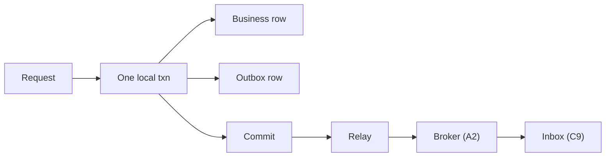

# Transactional outbox and CDC

**See also:** [pub/sub, queues, and streams (A2)](PubSubQueues.md) · [idempotency and the inbox (C9)](Idempotency.md) · [saga (B5)](../aws/ch08.md) · [event-driven dataflow](../data-intensive-design/event-driven-dataflow.md) · [encoding and evolution](../data-intensive-design/encoding-overview.md) · [Avro schema evolution](../data-intensive-design/avro-schema-evolution.md) · [replication logs](../data-intensive-design/replication-logs.md) · [exactly-once processing](../data-intensive-design/distributed-transactions.md#exactly-once-message-processing) · [CDC taxonomy and the one-line outbox](../aws/ch08.md) · [event sourcing (E12 sibling)](../data-intensive-design/event-sourcing-cqrs.md) · [external research note (2026-09-13)](../../docs/research/sysdesign/b7-outbox-cdc-external-research.md)

The outbox turns a committed business write into a durable, eventually published event **without** a distributed transaction across the database and the broker. One local ACID transaction writes (a) the business row and (b) an outbox row / event document / item. After commit, a **relay** that is *not* on the request path publishes (b). The request path never talks to the broker. Delivery is **at-least-once**: a crash between broker ack and "mark published" republishes, so every consumer needs an [inbox](Idempotency.md).

That is not the event-driven *style* — topologies, quanta, and when-to-use-as-an-architecture stay on **E4**. The [event-driven dataflow](../data-intensive-design/event-driven-dataflow.md) note already states the broker's job (buffer, redeliver, hide addresses, fan-out, decouple); [A2](PubSubQueues.md) owns the channel once the event is *on* it. This card ends at "relay published." It is also not [event sourcing](../data-intensive-design/event-sourcing-cqrs.md): the business table stays source of record; the outbox is a queue of facts to emit and is usually deleted or TTL'd.

Quality attributes: **reliability of notification** (the event leaves if and only if the database commits) and **recoverability of the writer** (a dead broker does not roll back the sale). The costs are an eventual-consistency window, at-least-once as the floor contract, a relay and WAL/slot to operate, and a forgotten-insert hole if the application skips the outbox row.

## Lineage and vocabulary

- **Dual-write.** Two independent writes cannot be atomic without a spanning transaction. Fail after the first commit → **lost event** (state changed, nobody notified) or **phantom event** (the broker has a fact the database rolled back). Kleppmann (2015-05-27): two clients dual-writing key X leave store 1 at B and store 2 at A — **permanent** inconsistency, no error. Confluent (Waldron, 2024-05-29) names the anti-patterns that look like a fix: reverse the order; wrap the Kafka produce in a database transaction (the produce is not rolled back); keep the event only in memory and retry after a crash that purged it.
- **Richardson, *Transactional Outbox*.** Store the message in the same database transaction as the business write; a separate relay publishes. Forces: no 2PC; messages leave iff the database commits; order is the application's send order across instances of the same aggregate. Relational = a table; NoSQL = a document property or a second item in the same atomic batch. Drawback: forgotten insert. Issue: the relay can publish twice → [idempotent consumers](Idempotency.md).
- **Two relays (Richardson).** **Polling publisher** — `SELECT` unsent rows, publish, mark or delete. Any SQL; "tricky to publish events in order"; not all NoSQL. **Transaction log tailing** — MySQL binlog / Postgres WAL / DynamoDB Streams. Accurate; database-specific; "tricky to avoid duplicate publishing." The storage-side log that external CDC parses is the [logical row log](../data-intensive-design/replication-logs.md) (MySQL binlog beside WAL; Postgres decodes WAL).
- **Debezium (Morling, 2019-02-19; SMT update 2019-09-13).** The outbox keeps *read-your-own-writes* on the request path and gives other services reliable, replayable, eventually consistent propagation. Emit an *external* event so a `PurchaseOrder` table change does not break consumers. The custom SMT in the post is obsolete; use Event Router.
- **Azure** (`ms.date` 2026-02-23): Cosmos `TransactionalBatch` in one logical partition + change feed + Service Bus. Consume-side companion is the **Idempotent Consumer / inbox**. **AWS Prescriptive Guidance:** (1) RDS outbox in the same local transaction, scheduled poller → SQS; (2) DynamoDB Streams / Kinesis CDC of the item or a dedicated outbox item. Cross-service atomicity of *several* stores is a [saga](../aws/ch08.md), each step using an outbox — do not restack saga recovery here.
- **Workspace (cite, do not rewrite).** [ch08.md](../aws/ch08.md) already has the CDC taxonomy (audit columns, log-based/Debezium, stream-based/DynamoDB Streams, table deltas, triggers) and the one-line outbox; event sourcing vs CDC is intent vs a state-change log.

## The dual-write problem

| Failure | Symptom | Outbox outcome |
|---|---|---|
| Commit, then crash before produce | Lost event; downstream never learns | Relay sees the committed row later |
| Produce, then database rollback | Phantom event; payment for a missing order | Produce never happens |
| Two writers, two stores (Kleppmann) | Permanent split-brain on the same key | Single writer; the second store is a consumer |
| Kafka first, then the database (Confluent) | Phantom if the database write fails | Still dual-write |
| Database transaction wrapping a Kafka send | Event already left when the txn rolls back | Outbox insert is *inside* the txn |

2PC / XA across database + broker is **not** the recommended path. Heterogeneous 2PC's reputation and the inbox-without-2PC construction already live in [distributed transactions](../data-intensive-design/distributed-transactions.md#exactly-once-message-processing).

## Mechanics: outbox table vs CDC of the business table

Two different mechanisms share the "CDC" label. Do not pick them as if they were synonyms.

| Variant | Atomic write | What consumers see | Trade-off |
|---|---|---|---|
| **Polling outbox** (Richardson; AWS RDS sample) | `INSERT` business + outbox in one SQL txn | The designed event in `payload` | Works on any SQL; poll load + lag; delete-after-send races with crash (at-least-once) |
| **Log-tail outbox** (Richardson; Debezium Event Router) | Same SQL txn; connector captures *only* the outbox table | The designed event, unwrapped by the SMT | Near-real-time; no poll tax on the table; database-specific; WAL / slot ops |
| **Document / item outbox** (Azure Cosmos; AWS DynamoDB) | `TransactionalBatch` (same logical partition) or `TransactWriteItems` | The designed event on the change feed / stream | No 2PC; partition-key and item-identity constraints |
| **CDC of the business table** (AWS "CDC" option; ch08 log-based) | The business write *is* the event | Storage shape: `op=c/u/d`, column names | No forgotten outbox insert; consumers couple to the table (A6 / encoding) |
| **Listen-to-yourself** (Confluent) | Write the event to Kafka first | Whatever materializes | Fast ack; **no** read-your-own-writes (Morling's objection) |
| **Event sourcing** (E12) | Append-only event *is* the write | The log is SoR | No separate outbox; not this card |

These compose: an outbox table + Debezium + Event Router is the canonical log-tail shape. Cosmos change feed + Service Bus is the same automaton on a document store. Warehouse mirrors of *tables* belong on log-based CDC of those tables ([ch08](../aws/ch08.md), [replication-logs](../data-intensive-design/replication-logs.md)), not on a domain-event outbox.

## Ordering, at-least-once, and payload schema

**Ordering.** Richardson: T1→E1 before T2→E2 for one aggregate, even across instances. Debezium Event Router keys Kafka with `aggregateid` so one aggregate hits one partition. Azure: change-feed order is **per logical partition**; Service Bus `SessionId = partitionKey` is FIFO per contact. DynamoDB Streams: order is **per item** (not per partition); Lambda keeps that when `ParallelizationFactor` > 1. AWS PG: timestamps + sequence numbers. Cross-aggregate global order is an [A2](PubSubQueues.md) choice (single partition / session / FIFO), not something the outbox invents.

**At-least-once.** Relays that checkpoint *after* produce republish on crash. Cosmos change-feed processor: exception → restart from last lease. Lambda: "process each event at least once." Richardson: crash after publish, before recording. The close is the [C9 inbox](Idempotency.md), not a broker "exactly-once" label. Those labels are scoped — Kafka EOS covers output records and input offsets, not a payment hold in another database.

**Schema (point A6; do not redo).** Outbox `payload` is a published contract. Morling: emit an *external* event so table changes do not break consumers. SMT default is JSON (`jsonb`); Avro via `BinaryDataConverter` + a registry. Postgres connector: default-value propagation is "primarily … for safe schema evolution when using … a schema registry"; defaults can appear late, early, or never. Compatibility rules stay in [encoding-overview](../data-intensive-design/encoding-overview.md) (unknown fields must survive republish) and [Avro](../data-intensive-design/avro-schema-evolution.md) / [protobuf](../data-intensive-design/protobuf-schema-evolution.md). CDC-of-the-business-table *is* the internal schema on the wire.

## Pairing with the inbox (C9)

The outbox makes *produce* reliable. It does not make *consume* exactly-once. Azure Idempotent Consumer: most brokers are at-least-once; broker "exactly-once" does not cover external side effects. Inbox = processed key **in the same transaction** as side effects; a uniqueness constraint arbitrates competing consumers. Key = producer `MessageId` or CloudEvents `source`+`id`, **not** `CorrelationId` or a regenerated delivery id. Service Bus send-side `MessageId` window is a producer-retry filter, **not** an inbox (default history **10 minutes**, min 20 s, max **7 days**; Standard/Premium only). Inbox TTL must outlast redelivery and DLQ-resubmit. The four-step algorithm is already in [distributed transactions](../data-intensive-design/distributed-transactions.md#exactly-once-message-processing); [C9](Idempotency.md) owns the general card.

## Placement

| Layer | What it does | Failure if misplaced |
|---|---|---|
| **Request path** | One local txn: business + outbox | Talking to Kafka / SQS here *is* dual-write |
| **Relay** (poller, Debezium, change-feed processor, Lambda / Pipes) | Publish committed outbox rows | Treating it as optional "best effort" loses the guarantee |
| **Broker (A2)** | Persist, fan-out, DLQ | Using it as the first write unless you accepted listen-to-yourself |
| **Inbox (C9)** | Atomic consume + marker | Check-then-set without a unique constraint double-applies |
| **Saga orchestrator (B5)** | Decides *which* events the outbox emits | Putting saga state only in the broker |

## Verified knobs (fetched 2026-09-13)

Debezium numbers are from the **stable** docs whose example envelope carries `"version": "3.6.2.Final"` (release 2026-09-01). 3.7.0.Beta1 is not a default source.

### Debezium PostgreSQL connector 3.6.2.Final + Event Router

| Knob | Default | Outbox / CDC use |
|---|---|---|
| `snapshot.mode` | `initial` | Snapshot iff no offsets; then stream from stored LSN. `no_data` starts at slot-create LSN (only if WAL still holds everything). `when_needed` if offsets are missing or the LSN is gone. `always` after failover when WAL was pruned. |
| `snapshot.isolation.mode` | `serializable` | Strictest; blocks concurrent DDL on captured tables. `read_committed` is the "mirroring" trade (possible double-capture of rows inserted during the snapshot). |
| `poll.interval.ms` | `500` | Wait per iteration; **capped at 5000 ms** if you set higher. |
| `max.batch.size` / `max.queue.size` | `2048` / `8192` | Queue must stay larger than batch. |
| `heartbeat.interval.ms` | `0` (off) | Required when captured tables are quiet but the WAL is busy — otherwise LSN is never flushed and WAL piles up. With `lsn.flush.mode=connector_and_driver` and no txn metadata, Debezium **internally sets 600000 ms (10 min)**. |
| `plugin.name` | `decoderbufs` | RDS / Cloud SQL / IAM setups must set **`pgoutput`**. `publication.autocreate.mode` default `all_tables` (needs `CREATE PUBLICATION … FOR ALL TABLES`; docs recommend `filtered` if the user is not superuser). |
| `slot.name` | `debezium` | Unique per connector. `slot.drop.on.stop` **`false`** — `true` in prod drops the resume point. |
| `tombstones.on.delete` | `true` | Insert-only outbox tables should usually set this **false** (SMT already filters deletes). |
| `event.processing.failure.handling.mode` | `fail` | `warn` / `skip` drop the bad event. |
| `tasks.max` | `1` | Single-task connector. |

Event Router (`io.debezium.transforms.outbox.EventRouter`) expected columns: `id` uuid, `aggregatetype`, `aggregateid`, `type`, `payload` jsonb. Defaults: Kafka key = `aggregateid`; route by `aggregatetype` → topic `outbox.event.${routedByValue}`; `id` copied to header `id` for consumer dedup; `table.op.invalid.behavior=warn` — **updates are not allowed**, deletes are filtered. Capture **only** the outbox table (`table.include.list`); apply the SMT via a predicate so heartbeats / schema-change events are not routed as domain events. MySQL common knobs match: `snapshot.mode=initial`, `heartbeat.interval.ms=0`, `max.batch.size=2048`, `max.queue.size=8192`.

### PostgreSQL logical decoding (storage side)

| GUC | Default | CDC consequence |
|---|---|---|
| `wal_level` | `replica` | Must be **`logical`** (restart) to decode row events. Increases WAL volume, "particularly if many tables are configured for `REPLICA IDENTITY FULL`". |
| `max_replication_slots` | `10` | One slot per Debezium connector (+ headroom). Restart. |
| `max_wal_senders` | `10` | ≥ slots + physical standbys. `0` disables replication. Restart. |
| `max_slot_wal_keep_size` | `-1` (unlimited) | A stalled slot retains WAL forever. A finite cap **invalidates** the slot when `restart_lsn` lags more than the cap — CDC then needs `snapshot.mode=when_needed` / `always`. PG 13+. |

`REPLICA IDENTITY DEFAULT` (Postgres default for user tables): UPDATE / DELETE carry the old PK only; unchanged TOAST values are omitted. Debezium substitutes `__debezium_unavailable_value`. Outbox payloads that live in `jsonb` avoid that hole if the whole event is in one column.

### DynamoDB Streams + Lambda, and Cosmos + Service Bus

| Knob | Verified number |
|---|---|
| DynamoDB stream retention | **24 hours** (fixed). Older records "susceptible to trimming at any moment." Disable → still readable 24 h, then gone. `StreamViewType` cannot be edited in place. |
| Per-item order | Guaranteed for one primary key; **not** across a partition. ≤ **2** readers per shard. GetShardIterator expires **15 minutes**. |
| Lambda poll | Base **4** times per second per shard. `BatchSize` default **100**, max 10 000. `ParallelizationFactor` default **1**, max **10**. `StartingPosition=LATEST` can miss events while the mapping is created ("several minutes"); use `TRIM_HORIZON` if you cannot miss. |
| `TransactWriteItems` | Up to **100** actions, aggregate **4 MB**, distinct items, same account/Region. |
| Cosmos `TransactionalBatch` | Same logical partition; **100** operations; payload **2 MB**; execution **5 s**. Failure → that op's status; others **424**. Snapshot isolation. |
| Cosmos event `ttl` | Sample JSON `120` seconds. Production text: "multiple days, like **10 days**" so a down relay can catch up. Sample change-feed processor uses `WithMaxItems(25)` / `WithPollInterval(3 s)` — **sample knobs, not platform defaults.** |

## Observability

A relay without lag metrics is silent inconsistency: the writer committed, the consumer has not heard.

| Signal | What it tells you |
|---|---|
| **Outbox lag** (oldest unrelayed row age, or Debezium `MilliSecondsBehindSource` / DynamoDB `IteratorAge`) | The user-visible consistency window. |
| **Relay publish rate vs business-write rate** | Growing gap = stuck slot / lease / poller. |
| **WAL / slot size** (`pg_replication_slots`, `restart_lsn` vs current LSN) | Heartbeat off + quiet captured tables = disk fill. |
| **SMT / converter errors** (`table.op.invalid.behavior` warnings; Avro registry rejects) | An A6 mismatch shows up here, not as a 5xx from the writer. |
| **Inbox duplicate rate** (C9) | Rising rate → producer retries, undersized ack/lock, or a flapping relay. |
| **Change-feed lease owner / Lambda iterator age** | Silent stall after a processor crash. |

Alert shapes (own formulations — **not** vendor PromQL): *iterator age / outbox lag above the consumer SLO*; *replication slot invalidated* (`max_slot_wal_keep_size`); *Debezium connector `fail` state*; *change-feed processor not checkpointing*. OTel: SMT field `tracingspancontext`, op `debezium-read`. No outbox-specific semantic convention was found.

## Tuning

| Knob | Too aggressive | Too timid | Starting point (sourced) |
|---|---|---|---|
| Relay style | Poll every 10 ms on a hot OLTP primary | CDC "later" with no lag SLO | Log-tail for prod OLTP (Morling); poll is the compatibility fallback (Richardson) |
| `heartbeat.interval.ms` | Flood the heartbeat topic | `0` on a shared WAL with a quiet outbox | Non-zero whenever captured traffic ≪ WAL traffic |
| `snapshot.mode` | `always` on every bounce | `no_data` after a slot recreate | `initial`; `when_needed` if WAL can be pruned |
| `max_slot_wal_keep_size` | Tiny cap → constant resnapshot | `-1` → one dead connector fills disk | Finite cap + alert + `when_needed` |
| Inbox / Service Bus window | 20 s (late redelivery looks new) | 7-day send-side dedup as the *only* defense | Inbox TTL > broker redelivery + DLQ hold; Service Bus window is extra |
| CDC of business table vs outbox | Every column change is a public event | Forgotten outbox insert | Outbox when the event is a designed contract (Morling); CDC-of-table for warehouse mirrors (ch08) |

## Worked calibration — checkout `OrderPlaced`

Design drill (not a vendor SLA). Constraints: 200 writes/s to `orders`; one `OrderPlaced` per write; Kafka consumers must see per-order order; p99 relay lag ≤ 2 s; crash of the API pod must not lose the event; the payment consumer is not naturally idempotent.

| Step | Choice | Why |
|---|---|---|
| Atomic write | `INSERT orders` + `INSERT outbox` in one Postgres txn; columns match the SMT defaults (`aggregatetype='Order'`, `aggregateid=orderId`, `type='OrderPlaced'`, `payload` jsonb) | Richardson + Debezium table |
| Relay | Debezium Postgres 3.6.2, `table.include.list=public.outbox`, Event Router SMT, `tombstones.on.delete=false` | Insert-only queue; no poll tax |
| Plugin | `plugin.name=pgoutput` (RDS), publication `filtered` to `public.outbox` | Default `decoderbufs` is not on RDS; `all_tables` needs superuser |
| Snapshot | `snapshot.mode=initial` once; then streaming | Empty outbox snapshot is cheap |
| Heartbeat | `heartbeat.interval.ms=10000` | Quiet outbox on a busy WAL |
| Ordering | Kafka key = `aggregateid` | SMT default |
| Consumer (C9) | Inbox row keyed by header `id`; unique constraint; same txn as the payment hold | Azure inbox; at-least-once |
| Schema (A6) | Payload Avro in the registry, BACKWARD compat; do **not** CDC the `orders` table as the public event | Morling external event |
| Rollback drill | Kill the API after `COMMIT`, before any produce — event must still appear. Kill Debezium after Kafka ack, before offset flush — consumer inbox absorbs the duplicate. | The two failure modes below |

## Failure modes of the outbox / CDC path itself

- **Forgotten outbox insert** (Richardson's drawback). CDC-of-the-business-table avoids it and couples consumers to storage.
- **Duplicate publish.** Relay crash after publish, before checkpoint. Inbox (C9), not "exactly-once Kafka," is the fix.
- **Poller `DELETE` before broker ack.** If you inverted "ack then delete" you **lose** the event. Mark-then-delete only after ack.
- **CDC lag / WAL slot stall.** `heartbeat.interval.ms=0` + quiet captured tables: LSN never flushed, `pg_wal` grows. `max_slot_wal_keep_size=-1` makes it unbounded; a finite cap invalidates the slot and you miss data unless you resnapshot. DynamoDB: a relay down > **24 h** cannot catch up (`TrimmedDataAccessException`); an iterator idle > **15 min** expires.
- **`slot.drop.on.stop=true` in production** — next start has no resume LSN. Wrong `plugin.name` (`decoderbufs` on RDS) — connector never streams.
- **TOAST / `REPLICA IDENTITY DEFAULT`** — UPDATE/DELETE events miss unchanged wide columns (`__debezium_unavailable_value`).
- **Outbox UPDATE** — SMT `table.op.invalid.behavior=warn` by default (skip + log); `fatal` stops the connector. Treat the table as insert-only.
- **Partition rules.** Events for a different Cosmos partition key cannot join the batch; the same DynamoDB item cannot appear twice in `TransactWriteItems`.
- **`LATEST` on a new Lambda mapping** — missed records during the "several minutes" of eventual-consistent polling. More than two readers per Streams shard — throttle.
- **Service Bus 10-minute dedup as the only inbox** — redelivery after the window is a new message. Azure says this explicitly.
- **Listen-to-yourself** — lost read-your-own-writes (Morling).
- **Schema break on the payload** — registry reject stalls the connector (`fail` default). Trigger-based CDC ([ch08](../aws/ch08.md)) — write amplification on the primary.

## When not to use

| Situation | Prefer |
|---|---|
| A single process, one database, no other consumer | Just the transaction |
| Naturally idempotent upsert / event-carried state | Skip the inbox (Azure C9 "not suitable"); still use outbox if you must notify |
| Storage has no transactions and you cannot append events | Listen-to-yourself (accept stale reads) or E12 |
| Cross-service atomicity of *several* stores | **B5** saga, each step using an outbox |
| You need the broker to be SoR and replay forever | Event-sourced log, not a deletable outbox |
| Warehouse mirror of *tables*, not domain events | Log-based CDC of the tables |
| Greenfield where the first write *is* Kafka and stale reads are OK | Skip the outbox table (Confluent listen-to-yourself) |

## Trade-offs

| Buy | Pay |
|---|---|
| Event leaves iff the local txn commits; no 2PC | Eventual-consistency window equal to relay lag |
| Read-your-own-writes on the request path | A second write in every transaction; forgotten insert is silent loss |
| Log-tail is near-real-time and off the primary's poll path | Database-specific WAL / slot / stream ops; heartbeat and keep-size are load-bearing |
| Designed external event (Morling) decouples consumers from tables | CDC-of-table is simpler and couples them |
| At-least-once plus a C9 inbox is exactly-once *effects* | Duplicate publish is the normal crash; the inbox is not optional |
| Polling works on any SQL | Poll load, lag, and delete-vs-ack races |

The outbox decides **whether the event is durable with the write**. [A2](PubSubQueues.md) decides **how it travels**. [C9](Idempotency.md) decides **whether a redelivery is safe**. E4 decides **whether the system is event-driven**. Coordinate all four; do not treat the outbox as a complete integration strategy.

## Sources

Verified 2026-09-13; the full URL list, per-claim provenance, and items deliberately left out are in the [external research note](../../docs/research/sysdesign/b7-outbox-cdc-external-research.md).

- Canon: Richardson, microservices.io *Transactional Outbox*, *Polling Publisher*, *Transaction Log Tailing*; Morling / Debezium, *Reliable Microservices Data Exchange with the Outbox Pattern* (2019-02-19, SMT update 2019-09-13); Kleppmann, *Logs for Data Infrastructure* (2015-05-27); Confluent / Waldron, *The Dual Write Problem* (2024-05-29); Azure transactional outbox on Cosmos (`ms.date` 2026-02-23) and *Idempotent Consumer*; AWS Prescriptive Guidance *Transactional outbox*.
- Connectors and storage: Debezium 3.6.2.Final (2026-09-01) Postgres / MySQL connectors and Outbox Event Router; PostgreSQL current `wal_level` / replication GUCs; DynamoDB Streams, `TransactWriteItems`, Lambda event-source mapping; Cosmos `TransactionalBatch` limits and Service Bus duplicate detection.
- Already in this tree: [ch08.md](../aws/ch08.md); [replication-logs.md](../data-intensive-design/replication-logs.md); [event-driven-dataflow.md](../data-intensive-design/event-driven-dataflow.md); [encoding-overview.md](../data-intensive-design/encoding-overview.md); [A2](PubSubQueues.md); [C9](Idempotency.md).
