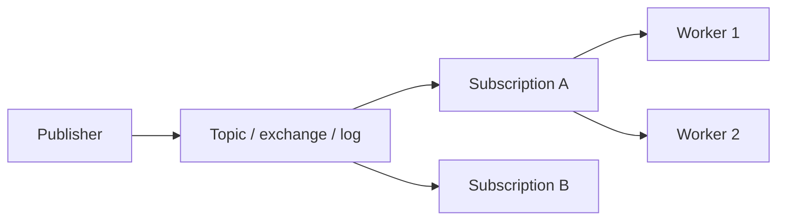

# Publisher–subscriber, queues, and streams

**See also:** [event-driven dataflow (DDIA)](../data-intensive-design/event-driven-dataflow.md) · [exactly-once processing](../data-intensive-design/distributed-transactions.md#exactly-once-message-processing) · [idempotency](Idempotency.md) · [load shedding & backpressure](LoadShedding.md) · [request–response](RequestResponse.md) · [webhooks](Webhooks.md) · [transactional outbox](../aws/ch08.md) · [event sourcing](../data-intensive-design/event-sourcing-cqrs.md) · [replication logs](../data-intensive-design/replication-logs.md) · [external research note (2026-09-13)](../../docs/research/sysdesign/a2-pubsub-queues-external-research.md)

Messaging decouples senders from receivers in **time** (the broker holds work while consumers are away) and **cardinality** (one event, many independent readers). The [event-driven dataflow](../data-intensive-design/event-driven-dataflow.md) note already states the broker's job — buffer, redeliver, hide addresses, fan-out, decouple — and the queue-versus-topic table. This card does not re-derive that. It owns the **mechanisms**: competing consumers, fan-out, ordering scopes, dead-letter channels, consume models, reconnect, and the proxy/LB surface. The event-driven *style* — topologies, quanta, when-to-use as an architecture — is **E4**, not this page.

Quality attributes: **elasticity** (a queue absorbs a burst — within the [queues-don't-fix-overload](LoadShedding.md) bound), **evolvability** (producers do not name consumers), **resilience** (a down consumer loses time, not events). Costs: at-least-once as the floor contract, eventual consistency by construction, a broker to operate, and failure modes that hide in redelivery. Every consumer inherits the [idempotency](Idempotency.md) homework.

## Lineage and vocabulary

- **Hohpe & Woolf, *Enterprise Integration Patterns* (2003).** **Point-to-Point Channel**: exactly one receiver consumes each message. **Publish-Subscribe Channel**: one input splits into one output channel per subscriber. **Competing Consumers** work only on point-to-point — extra consumers on a publish-subscribe channel just make more copies. **Dead Letter Channel** is the *system's* verdict (undeliverable, expired, over the redelivery limit). **Message Broker** is the hub-and-spoke *architecture* pattern — Hohpe's ch. 3 extract calls it the integration equivalent of the GoF Mediator. **Message Bus** is shared infrastructure plus a common command set; participants speak the bus, and the bus is not an active per-message mediator.
- **Broker vs mediator, operationally.** A *dumb broker* (Kafka log, SQS standard queue) stores and forwards bytes; routing is a key, a partition, or whoever receives. A *mediating broker* (classic EAI, RabbitMQ bindings, SNS filter policies, Service Bus SQL filters) inspects and decides. The mediator centralises routing and becomes a change hotspot and a throughput bottleneck (Hohpe's own warning). Products mix both — SNS is a mediating fan-out in front of dumb SQS queues.
- **Azure Architecture Center** (Publisher-Subscriber + Competing Consumers, fetched 2026-09-13) uses Hohpe's split: competing consumers = one worker per message on a queue; pub/sub = every subscriber gets a copy. A *subscription* is itself a queue and can have competing consumers.
- **Kleppmann / this tree.** The [event-driven dataflow](../data-intensive-design/event-driven-dataflow.md) note already records that brokers do not enforce a data model, many *delete after consume*, and some retain indefinitely (required for [event sourcing](../data-intensive-design/event-sourcing-cqrs.md)). [Exactly-once *processing*](../data-intensive-design/distributed-transactions.md#exactly-once-message-processing) is the inbox-then-ack construction — do not re-derive it here. **Jay Kreps (2015)** ("Putting Apache Kafka to Use") is the third distribution pattern next to queue and topic: the log as a durable, replayable, multi-subscriber stream.

## Three channel kinds

| Kind | Delivery | After consume | Scale-out unit | Fan-out |
|---|---|---|---|---|
| **Queue** (SQS, Service Bus queue, RabbitMQ queue) | One consumer per message; competing consumers share work | Typically deleted / acked away | More consumers (and, for FIFO, more group IDs) | None — put a topic or fan-out exchange in front |
| **Topic / pub-sub** (SNS, Service Bus topic, RabbitMQ fanout/topic exchange, Pub/Sub topic) | Every *subscription* gets a copy | Per-subscription queue semantics | More subscriptions, and more consumers *per* subscription | First-class |
| **Log / stream** (Kafka topic, Azure Event Hubs) | Consumer *groups* independently replay the same log; within a group, partitions are exclusive | Offset advances; records stay until retention | Partitions; consumers in a group **cannot usefully exceed partition count** | Extra consumer groups, not extra copies at produce time |

A Pub/Sub *subscription* is Hohpe's output channel: two subscriptions = pub/sub; two pullers on *one* subscription = competing consumers. Kafka inverts that: one topic + N groups = pub/sub; one group + N members = competing consumers *per partition*, not per message.

## Wire semantics and connection lifecycle

Four on-the-wire shapes. Do not treat them as interchangeable "messaging."

**Kafka protocol (persistent TCP, broker-aware).** The client bootstraps from `bootstrap.servers`, fetches metadata, then opens **per-broker** connections to the leaders in `advertised.listeners`. Produce and fetch are request/response on those sockets; the group coordinator is a specific broker. Idle: client `connections.max.idle.ms` **540000 (9 minutes)**; broker **600000 (10 minutes)**. Reconnect: `reconnect.backoff.ms` **50**, `reconnect.backoff.max.ms` **1000**, plus **20% jitter** on the max (4.1 consumer configs). Classic group protocol (default `group.protocol=classic` on the 4.1 and 4.3 pages): heartbeat **3000 ms**, session **45000 ms**, `max.poll.interval.ms` **300000 (5 minutes)**. A late `poll()` fails the member and reassigns partitions (static members with `group.instance.id` wait out the session timeout first). The new `group.protocol=consumer` is opt-in since 4.0; KIP-1274 proposes flipping the default later and was **not shipped** on the 4.3 pages. `enable.auto.commit` defaults **true** every **5000 ms** — that is *at-most-once* if you process after the commit, *at-least-once* if you process before it and crash.

**AMQP 0-9-1 (RabbitMQ).** Long-lived TCP → negotiate → authenticate → **channels** multiplexed on one connection. Consume is push (`basic.consume`) or get. Heartbeat timeout **suggested default 60 s**, frames about every `timeout/2`; two missed heartbeats close the TCP connection; the client must reconnect and re-open channels. Automatic ack = at-most-once (broker forgets on deliver). Manual ack = at-least-once (redeliver on channel/connection death). Prefetch (`basic.qos`) caps unacked deliveries; quorum queues reject global QoS and cap prefetch at **2000**.

**AMQP 1.0 (Service Bus; RabbitMQ also speaks it).** Connection → session → link. Peek-lock is a broker-side lease: default **lock duration 1 minute**, max **5 minutes**, renewable; settlement (complete / abandon / defer / dead-letter) is tied to **that receiver and connection**. Close the receiver before settle and the settlement never arrives; the lock expires; delivery count increments; repeated hits → DLQ `MaxDeliveryCountExceeded`. The service **closes an idle connection after 10 minutes**.

**HTTPS / gRPC APIs (SQS, SNS, Pub/Sub).** No AMQP session. SQS `ReceiveMessage` + optional long poll (`WaitTimeSeconds`); visibility timeout is the lease (default **30 s**, max **12 h** from first receive). SNS *pushes*. Pub/Sub: pull, **streaming pull** (long-lived gRPC), or **push** (HTTPS POST). Ack deadline default **10 s**, min 10, max **600 s**; `ModifyAckDeadline` extends it. Push uses the ack deadline as the HTTP request timeout. The receiver side of push *is* a [webhook](Webhooks.md).

## Delivery claims — what the vendors actually guarantee

The three textbook words do not mean the same thing on each product. **Exactly-once of an external side effect is [idempotency](Idempotency.md) + [outbox](../aws/ch08.md), not a broker switch.** The [processing construction](../data-intensive-design/distributed-transactions.md#exactly-once-message-processing) is inbox-then-ack.

| Product | Vendor wording | What the primary page actually says | Default if you change nothing |
|---|---|---|---|
| **Kafka produce** | Idempotent producer writes "exactly one copy" | `enable.idempotence` default **true** (4.1); requires `acks=all` (default **all**), `retries>0`, `max.in.flight.requests.per.connection≤5` (default **5**). Dedup is `(producerId, epoch, sequence)` **per partition, per producer session**. | Idempotent produce on; **no** transactions (`transactional.id` unset) |
| **Kafka consume–transform–produce** | "Exactly-once semantics" (KIP-98 / Streams `exactly_once_v2`) | Atomic write of output records **and** input offsets in one transaction; fencing via `transactional.id`. Consumers must set `isolation.level=read_committed` or they see aborted records. Default isolation is **`read_uncommitted`**. Side effects outside Kafka are not in the transaction. | At-least-once (auto-commit + read_uncommitted) |
| **SQS standard** | At-least-once; best-effort order | Each message delivered at least once; occasionally a duplicate; order not guaranteed. Visibility timeout is **not** an exclusive lock against a second delivery. | At-least-once, unordered |
| **SQS FIFO** | "Exactly-once processing" | Duplicates are **not introduced into the queue**; producer retries inside a **5-minute** `MessageDeduplicationId` window are collapsed. The message stays until `DeleteMessage`. **Visibility timeout expiry still redelivers.** That is *producer-side dedup + at-least-once consume*, not end-to-end EOS. | Dedup window 5 min; consume still leases |
| **Pub/Sub (default)** | At-least-once | Redelivery on expired ack deadline or nack. Ordering off unless `enableMessageOrdering` + `orderingKey`. | At-least-once, unordered |
| **Pub/Sub "exactly-once delivery"** | Named feature, default **false** | For a given `messageId`, no resend *before* the ack deadline expires, and an **acknowledged** message is not resent. **Publisher retries create new `messageId`s** and are distinct. Combined with ordering, acks must be in order or the service fails them with temporary errors. | Off |
| **RabbitMQ** | Manual ack = at-least-once | Unacked messages return on consumer death. Auto-ack = at-most-once. DLX default republish is **at-most-once** (no publisher confirms); quorum queues offer opt-in `dead-letter-strategy=at-least-once`. | Classic: at-most-once DLX |
| **SNS** | Push with retries, then drop or DLQ | AWS-managed (SQS/Lambda): **100,015** attempts over **23 days**. HTTP/S: customisable; total retry time **≤ 3600 s** hard cap. 5xx and 429 retry; other HTTP is permanent. After the policy, discarded unless the *subscription* has a DLQ. | No subscription DLQ |

`acks=0` is the Kafka at-most-once produce path. `acks=1` can lose the record if the leader dies before followers catch up. `acks=all` waits for the ISR; `min.insync.replicas` default **1** (so `acks=all` with RF=3 and minISR=1 still accepts a lone leader). `unclean.leader.election.enable` default **false**.

## Competing consumers, fan-out, ordering

These three are the load, cardinality, and sequence knobs. Pick the ordering unit first; parallelism is however many units you have.

Fan-out is A and B each getting a copy. Competing consumers are Worker 1 and Worker 2 sharing Subscription A. Kafka's equivalent of A/B is *consumer groups*; its equivalent of Worker 1/2 is *members of one group*, pinned per partition.

**Competing consumers.** Azure: multiple workers pull one queue; each message is processed by one worker; the queue is the load-leveler. Kafka: members of a group do **not** compete per message — a key pins a record to a partition, and the assignor pins that partition to one member. A slow partition cannot be helped by an idle member. **Hard cap:** consumers-in-group ≤ partitions. SQS FIFO: one in-flight batch per `MessageGroupId`; other groups proceed in parallel. Service Bus sessions: accepting a session takes an exclusive lock on that `SessionId` (and later arrivals with it).

**Fan-out.** SNS topic → N subscriptions (SQS, Lambda, HTTP/S, Firehose, SMS, email). Quotas (fetched 2026-09-13): **12,500,000** subscriptions per *standard* topic; FIFO topic subscription cap is **100**; standard topics **100,000** / account, FIFO topics **1,000** / account. Pub/Sub: N subscriptions per topic; each is an independent cursor. Kafka: N consumer groups, each with its own offsets — the log is not copied at produce time. RabbitMQ: a fanout/topic exchange plus a queue per subscriber.

**Ordering.** Kafka: **total order per partition only**. Key → partition (unless a custom partitioner). Cross-partition order is not a Kafka guarantee. SQS standard: best-effort / "loose FIFO." SQS FIFO: order **per `MessageGroupId`**; a batch may include several groups, but a group is blocked until its in-flight messages are deleted or become visible. Pub/Sub: same `orderingKey`, **same publish region**, subscription `enableMessageOrdering=true`; redelivery of message *k* redelivers *k+1…* for that key (unless a dead-letter topic is also on — then the docs say the behaviour "might not be true," best-effort). Service Bus: FIFO is **sessions**, not the default queue. Azure Publisher-Subscriber: "order … isn't guaranteed"; ordered delivery "constrains scalability."

**Poison messages.** A payload that crashes every consumer. Without a receive-count cap it loops forever (queue) or stalls a partition/session (Kafka / FIFO / Service Bus sessions). DLQ is the isolation mechanism; [idempotency](Idempotency.md) does not help a message that *cannot* be applied.

## Dead-letter channels (verified)

| System | Trigger | The subtlety |
|---|---|---|
| **SQS** | `maxReceiveCount` receives without delete; destination must be **same account, Region, and type** | Standard: enqueue timestamp is **kept** on the move — DLQ retention must be **longer** than the source or the message dies early. FIFO: timestamp **resets**. **Do not attach a DLQ to a FIFO queue if you need exact order** (AWS's own warning). Standard queues with `maxReceiveCount > 3` shuffle a 3×-received message to the back before DLQ. |
| **SNS** | After the subscription retry policy | DLQ is on the **subscription**, not the topic. Catches *delivery* failure — consumer processing failure needs a second DLQ on the subscribed SQS queue. Recommended SQS retention on the DLQ: **14 days**. |
| **Kafka** | none broker-side | Connect sink DLQ (KIP-298): `errors.tolerance=none`, `errors.deadletterqueue.topic.name=""` (disabled), RF **3**. **Source connectors have no framework DLQ.** Application consumers have no broker-native DLQ — Spring's `<topic>-dlt` is an application convention. |
| **RabbitMQ DLX** | reject/nack `requeue=false`; per-message TTL; queue-length overflow; quorum `delivery-limit` | Whole-queue expiry does **not** dead-letter. Default republish is **without** publisher confirms. Quorum opt-in: `dead-letter-strategy=at-least-once` **and** `overflow=reject-publish` **and** a configured DLX. Missing DLX at dead-letter time = **silent drop**. Reasons in `x-death`: `rejected`, `expired`, `maxlen`, `delivery_limit`. |
| **Pub/Sub DLT** | `maxDeliveryAttempts` **5–100**, default **5** (0 in the API means 5) | Count is approximate; forwarding is **best-effort**. Needs a subscription on the DLT or the forwarded message is lost. Combined with ordering, DLT writes may **break** key order. |
| **Service Bus** | Default `MaxDeliveryCount` **10**, not disableable | Every queue/subscription has a `$deadletterqueue` subqueue (no TTL; cannot dead-letter *from* it). Reasons: `MaxDeliveryCountExceeded`, `TTLExpiredException` (if dead-letter-on-expiration is on), `HeaderSizeExceeded`, `Session ID is null`, `MaxTransferHopCountExceeded` (auto-forward hop cap **4**). No automatic DLQ cleanup. |

Alert on DLQ depth ≥ 1 and oldest-message age; a DLQ nobody drains is a slow-motion outage log.

## Leases, prefetch, and backlog levers

The consume model decides what "I have this message" means — and what a slow or crashed worker does to everyone else.

| Model | The lease | If you go silent |
|---|---|---|
| **Broker queue (RabbitMQ)** | Prefetch (`basic.qos`) bounds *unacked* deliveries; quorum queues cap prefetch at **2000** and reject global QoS | Channel or connection death redelivers. Auto-ack forgot the message on deliver. |
| **Visibility timeout (SQS)** | Receive hides the message (default **30 s**); `ChangeMessageVisibility` extends up to a hard **12 h from first receipt** | Expiry redelivers — a slow consumer *is* a duplicate generator. Heartbeat the visibility while working. ~120,000 in-flight on standard (`OverLimit` on short poll). |
| **Peek-lock (Service Bus)** | Lock default **1 min**, max **5 min**, renewable; settlement is tied to **that receiver and connection** | Close before settle → lock expires → delivery count increments → DLQ at **10**. Idle connection close (**10 min**) releases locks. |
| **Ack deadline (Pub/Sub)** | Default **10 s** (10–600); `ModifyAckDeadline` extends on pull. Push uses the deadline as the HTTP timeout | Expiry or nack redelivers. Push cannot extend per message. |
| **Retained log (Kafka)** | Consumption is a cursor. `max.poll.records` **500**; `max.poll.interval.ms` **5 min**; `enable.auto.commit` **true** / **5 s** | A late `poll()` fails the member and reassigns partitions. Process-after-commit is at-most-once; process-before-commit-and-crash is at-least-once. Replay is a `seek` within retention. |

**Backlog levers** (which one is safe depends on whether effects are [idempotent](Idempotency.md)):

- **Pause.** Stop fetching so the lease does not expire into a redelivery storm. On Kafka, a late `poll()` fails the member and reassigns partitions — long work does not belong inside the poll loop (`max.poll.interval.ms` **5 min** vs `max.poll.records` **500**). The [breaker](CircuitBreaker.md) card records `pause()` / `resume()` as the consumer-side open state; pause state is lost on rebalance and must be re-applied.
- **Scale out.** Bounded by the ordering unit: partitions (Kafka), `MessageGroupId`s (SQS FIFO), sessions (Service Bus), queues (RabbitMQ). Extra members past that unit sit idle.
- **Skip or replay.** A log seeks within retention. A queue cannot rewind a new subscriber — redrive from the DLQ is the only "again," and FIFO redrive is the order-breaking move AWS warns about.
- **Bound age, not just depth.** An unbounded queue absorbs overload until it becomes a bigger, later failure — [queues don't fix overload](LoadShedding.md).

Prefetch and lease length are capacity knobs, not comfort settings. A 12-hour SQS visibility on a 200 ms handler hides a poison message for half a day; a 10-second Pub/Sub deadline on a 30-second handler *manufactures* duplicates.

## Proxy and load-balancer interactions

**Kafka is allergic to a naive L4 VIP.** Clients must dial the **advertised** host of the leader, not "any broker." A load balancer that hides brokers behind one address, picks a random backend per connection, or idles out TCP before Kafka does, produces `NETWORK_EXCEPTION` mid-request. `advertised.listeners` means *advertise the LB address of that broker*, not *share one pool*. Align timeouts: broker idle **10 min**, client idle **9 min**; many cloud LBs idle at **60–350 s**. Either raise the LB idle or lower `connections.max.idle.ms` so the *client* recycles first. Azure Event Hubs' Kafka surface is the documented case of an LB that silently drops idle sockets (librdkafka #3109: a commonly cited value is **3 m 30 s**).

**RabbitMQ / AMQP.** Heartbeats exist in part to keep proxies from classifying the socket as idle. Official guidance: activity in the **5–15 s** range "satisfies the defaults of most popular proxies and load balancers"; a 30 s heartbeat timeout produces traffic ~every 15 s. TCP keepalives are a second defence; Linux default dead-peer detection is ~**11 minutes**.

**SQS / SNS.** The client talks HTTPS to AWS; you do not load-balance the broker. SNS *outbound* HTTP/S *is* a reverse-direction call onto *your* endpoint: put that endpoint behind an LB that can absorb the retry schedule; `maxReceivesPerSecond` is an **average** throttle, not a hard cap.

**Pub/Sub push.** Google POSTs to your HTTPS URL. Your LB, TLS cert (not self-signed), and idle/request timeouts must outlive the subscription ack deadline (default 10 s, max 600 s). Pull/streaming-pull keep the long-lived connection on the subscriber side — corporate proxies that buffer or cap HTTP/2 streams break streaming pull.

**Service Bus.** AMQP through Azure's front-end; idle connection close **10 minutes** releases locks. Do not put a user-space proxy in front that is shorter.

## Verified defaults (fetched 2026-09-13)

| Knob | Default |
|---|---|
| Kafka `acks` / `enable.idempotence` / `max.in.flight` | `all` / `true` / `5` (4.1 producer) |
| Kafka `isolation.level` / `enable.auto.commit` | `read_uncommitted` / `true` every 5 s |
| Kafka `auto.offset.reset` / `max.poll.records` | `latest` / `500` |
| Kafka `max.poll.interval.ms` / session / heartbeat | 300000 / 45000 / 3000 (`group.protocol=classic`) |
| Kafka client / broker idle | 540000 / 600000 ms |
| Kafka `min.insync.replicas` / unclean election | `1` / `false` |
| Kafka Connect `errors.tolerance` / DLQ topic | `none` / `""` (sink only; KIP-298) |
| SQS visibility / retention / max body | 30 s (0–12 h) / 4 days (60 s–14 days) / 1 MiB |
| SQS standard in-flight | ~120,000 (`OverLimit` on short poll) |
| SQS FIFO (no high-throughput) | 300 TPS / action; 3,000 msg/s with batch of 10 |
| SQS FIFO high-throughput (us-east-1 / us-west-2 / eu-west-1) | 70,000 TPS; 700,000 msg/s batched; other regions lower |
| SQS FIFO dedup window | 5 minutes |
| SNS standard / FIFO subscriptions per topic | 12,500,000 / 100 |
| SNS → SQS/Lambda retries | 100,015 over 23 days |
| SNS HTTP/S retry-time cap | 3,600 s |
| Pub/Sub ack deadline / exactly-once / DLT attempts | 10 s (10–600) / `false` / 5 (5–100) |
| RabbitMQ heartbeat / DLX strategy | 60 s suggested / `at-most-once` (quorum opt-in `at-least-once`) |
| Service Bus lock / `MaxDeliveryCount` / idle close | 1 min (max 5) / 10 / 10 min |

Read the table as a design space, not a recommendation. Kafka 4.3.1 was current on 2026-09-13; producer/broker HTML was fetched at 4.1 (consumer defaults confirmed on the 4.3 pages). Do not invent a silent `acks` flip between those versions.

## When to use, when not

**Use** (Azure Publisher-Subscriber + Competing Consumers): broadcast to many independently deployed consumers; the sender must not block on a reply; consumers have different uptime than the publisher; work splits into independent parallel tasks; volume is bursty and a buffer is the load-leveler.

**Do not use.**

- A handful of consumers that each need *different* information — broker overhead without fan-out benefit; use dedicated queues or [request–response](RequestResponse.md).
- The publisher needs a **synchronous** result — pub/sub "introduces latency through the broker."
- **Global total order** across all messages — partitions/sessions/groups restore order only by *reducing* parallelism.
- A **single atomic transaction** across publisher and consumers — eventually consistent; use a local transaction + [outbox](../aws/ch08.md), or a saga, not a broker ack.
- You need **replay / event sourcing** — a delete-on-consume queue is the wrong primitive; use a log ([E12](../data-intensive-design/event-sourcing-cqrs.md)), not SQS or RabbitMQ classic.
- In-process calls, or a platform that already buses the same event (don't double-publish).
- FIFO + DLQ when order *is* the product (SQS explicit warning).

A log buys replay and multi-group fan-out and spends operational complexity (partitions, rebalances, retention, EOS config). A queue buys simple competing consumers and spends replay and independent subscribers. A mediating topic (SNS, Service Bus filters) buys subscriber isolation and spends a second hop and a second failure mode (delivery DLQ ≠ processing DLQ).

## Worked example — checkout events

Constraints from a design drill, not a vendor SLA: checkout publishes `OrderPlaced`; inventory reserves stock; email notifies; analytics records the fact; a separate `PaymentCapture` queue is worked by a pool of capturers. Checkout itself is [request–response](RequestResponse.md) to the shopper.

| Decision | Choice | Why |
|---|---|---|
| Channel for `OrderPlaced` | Topic / log, **not** a single queue | Three independent readers (inventory, email, analytics). A queue would force a multiplexer. Kafka: three consumer groups on one topic. SNS: three subscriptions (email can be HTTP/S — then it is a [webhook](Webhooks.md)). |
| Channel for `PaymentCapture` | Queue (SQS standard or RabbitMQ) with competing consumers | One capture per order; parallelism = worker count. FIFO / sessions only if double-capture is worse than head-of-line on a hot `customerId`. |
| Ordering | Per `orderId` (Kafka key / FIFO `MessageGroupId` / Pub/Sub `orderingKey`) | Cross-order order is not a product requirement. Global order would serialise checkout. |
| DLQ | On every subscription *and* on the capture queue | Email HTTP/S needs the SNS *subscription* DLQ (delivery). Capture needs a processing DLQ (`maxReceiveCount` well above normal retries). Do **not** DLQ a FIFO payment stream if the product promise is exact sequence. |
| Idempotency | Key minted once per order, reused across capture retries, redrive, and any fallback | Visibility expiry and rebalance *will* redeliver. The broker flag is not the inbox — [C9](Idempotency.md) + [outbox](../aws/ch08.md) at the write seam. |
| When not this | Shopper-facing "did it work?" | That answer is A1. The bus fans the *fact* out after accept. |

The style question — is the whole system event-driven, broker or mediator, how many quanta — is **E4**. This card stops at the channel.

## Failure modes

- **Duplicate side effects.** Every at-least-once path (SQS visibility expiry, Kafka crash after process-before-commit, Pub/Sub expired ack, RabbitMQ redelivery, SNS + SQS double hop) will redeliver. FIFO/Pub/Sub/Kafka "exactly-once" flags do **not** cover a non-idempotent HTTP call or email. That is [C9](Idempotency.md).
- **Poison stall.** One bad key/session/group blocks that ordered stream; competing consumers on *other* keys continue. Without a DLQ the partition or session stops making progress.
- **DLQ as a black hole.** Pub/Sub DLT with no subscription; RabbitMQ DLX missing at dead-letter time; SNS subscription DLQ without `SendMessage`; Kafka Connect source errors; SQS FIFO + DLQ silently reorders. Unwatched DLQs are silent data loss.
- **False EOS.** Default Kafka `read_uncommitted` + transactional produce = aborted records visible. SQS FIFO still redelivers on lease expiry. Pub/Sub exactly-once still accepts publisher duplicates as new ids.
- **Rebalance / session storms.** Kafka `max.poll.interval.ms` (5 min) vs a slow batch of `max.poll.records` (500); static membership forgotten (`group.instance.id` null) → shuffle on every deploy. Service Bus lock lost on the 10-minute idle close. RabbitMQ missed heartbeats behind a proxy → reconnect storm.
- **Head-of-line / hot partition.** Kafka key cardinality too low; SQS FIFO few `MessageGroupId`s; Pub/Sub hot `orderingKey`. Fan-out does not fix a single hot key — that is the [load-balancing](LoadBalancing.md) hot-key story in messaging clothes.
- **Retention vs delete-on-ack.** A queue cannot rewind a new subscriber. A log with `auto.offset.reset=latest` *looks* like a queue and drops history for a new group.
- **Mediator hotspot.** A content-routing broker that every team must change (Hohpe's über-broker) fails the reason you bought pub/sub.
- **LB / advertised-listener split.** Clients that can bootstrap but cannot reach `advertised.listeners` (or that share one VIP) fail after metadata.
- **The unbounded queue as a fix.** Backlog absorbs overload until it becomes a bigger, later failure — [queues don't fix overload](LoadShedding.md); bound queue *age*, alert on lag.

## Trade-offs

| Buy | Pay |
|---|---|
| Time and cardinality decoupling; burst absorption | At-least-once + eventual consistency as the floor contract |
| Independent consumers; replayable history (logs) | A broker to size, operate, and upgrade |
| Per-unit ordering with horizontal parallelism | The ordering unit is a design decision with migration cost |
| DLQs turn poison into triage | DLQs need owners, retention math, and drains |
| Mediating fan-out (SNS filters, Service Bus SQL) | A second hop and a second DLQ (delivery ≠ processing) |

The queue moves work in time; [request–response](RequestResponse.md) answers now; [webhooks](Webhooks.md) push events across trust boundaries; the [outbox](../aws/ch08.md) gets events out of a database atomically. E4 decides whether the *system* is event-driven; this card decides how the channel actually behaves.

## Sources

Verified 2026-09-13; the full URL list, per-claim provenance, and the items deliberately left out are in the [external research note](../../docs/research/sysdesign/a2-pubsub-queues-external-research.md). The broker job, queue-versus-topic table, and schema-registry pointer stay in [event-driven dataflow](../data-intensive-design/event-driven-dataflow.md) — cited, not rewritten.

- Canon: Hohpe & Woolf EIP pattern pages (Publish-Subscribe Channel, Point-to-Point, Competing Consumers, Dead Letter Channel, Message Broker, Message Bus) and the ch. 3 PDF extract; Azure Architecture Center *Publisher-Subscriber* and *Competing Consumers*; Kleppmann via [event-driven dataflow](../data-intensive-design/event-driven-dataflow.md); Kreps 2015 [22] in [encoding-references](../data-intensive-design/encoding-references.md).
- Kafka (4.1 config pages; 4.3 consumer pages; 4.3.1 current): producer/consumer/broker configs; consumer-rebalance protocol; KIP-298 (Connect sink DLQ); KIP-1274 (default-protocol flip, not shipped).
- AWS: SQS Developer Guide (visibility, DLQ, FIFO exactly-once, FIFO logic, quotas) and FAQ; SNS delivery retries, subscription DLQs, endpoints and quotas.
- GCP: Pub/Sub exactly-once, ordering, handling-failures, subscription properties, quotas.
- RabbitMQ: DLX, confirms, quorum queues, connections, heartbeats; 2022-03-29 at-least-once dead-lettering post.
- Azure Service Bus: queues/topics/subscriptions, dead-letter queues, sessions, locks and settlement.
- Proxy/LB: Kafka `advertised.listeners` and idle timeouts; RabbitMQ heartbeats (HAProxy, AWS ELB); librdkafka #3109 (Event Hubs idle LB).
