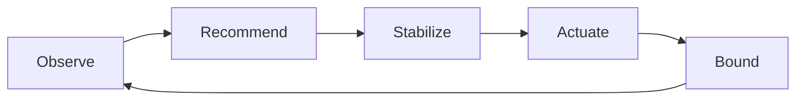

# Scaling strategies

**See also:** [scalability (name the load first)](../data-intensive-design/scalability.md) · [performance](../data-intensive-design/performance.md) · [timeouts — latency vs utilization](../data-intensive-design/timeouts-and-delays.md#latency-versus-utilization) · [distributed vs single-node](../data-intensive-design/distributed-vs-single-node.md) · [bulkhead](Bulkhead.md) · [load balancing](LoadBalancing.md) · [load shedding](LoadShedding.md) · [retry budgets](RetryBackoff.md) · [circuit breaker](CircuitBreaker.md) · [external research note (2026-09-13)](../../docs/research/sysdesign/b1-scaling-strategies-external-research.md)

This card owns the **mechanisms that add capacity**. The [scalability](../data-intensive-design/scalability.md) note owns the *question* — name the load parameters, then ask what happens if they grow — and the warning that shared-nothing scale-out **buys a distributed system**. Do not re-derive that argument here. Quality attributes: **capacity under growth**, **cost**, **operational stability**. Costs: membership and session affinity, scaler lag, flapping, and the replica count multiplying a downstream until the *database* is the outage.

Autoscaling is cool; if load is fairly predictable, a manually scaled system may have fewer operational surprises ([scalability.md](../data-intensive-design/scalability.md)). Design for the next **10×**, not an imaginary 1000×. There is no generic "magic scaling sauce."

## Lineage and vocabulary

- **Kleppmann / this tree.** [Scalability](../data-intensive-design/scalability.md): not a yes/no label. Vertical / scale-up = a more powerful machine (shared-memory on one box; cost typically faster than linear). Shared-disk = independent CPU/RAM over a contended NAS/SAN. Shared-nothing / horizontal / scale-out = each node owns CPU, RAM, and disks; coordination is software. Linear scalability is the happy case. [Performance](../data-intensive-design/performance.md): response time = service time + queueing delay; as throughput approaches the hardware maximum, queueing rises sharply and an overloaded system can enter a retry-storm / metastable loop ([7](../data-intensive-design/nfr-references.md), [8](../data-intensive-design/nfr-references.md), [9](../data-intensive-design/nfr-references.md)).
- **Azure Architecture Center, *Autoscaling Guidance* (2026).** Vertical = change the capacity of a resource — often a temporary outage while redeployed; "less common to automate." Horizontal = add or remove instances; the application keeps running. Autoscaling "mostly applies to compute"; horizontally scaling a database or queue "usually involves data partitioning, which is generally not automated" (that is **B2**, not this card). Four components: instrumentation, decision logic, an *external* actuator (idle or overwhelmed code must not scale itself), and a tuning loop. Use throttling *with* autoscaling when the burst outruns provision time ([load shedding](LoadShedding.md)).
- **Little (1961), *OR* 9(3):383–387.** If mean arrival rate `λ`, mean population `L`, and mean sojourn `W` are finite (stationary, metrically transitive arrivals), then **`L = λW`**. Distribution-independent: arrival process, service law, and discipline drop out. Netflix concurrency-limits states the operational form: `Limit = Average RPS × Average Latency` — the same identity that sizes [bulkhead](Bulkhead.md) permits.
- **Kleinrock, *Queueing Systems* Vol. 1 (1975).** Kendall-notation M/M/1 and M/M/c. M/M/1 sojourn `W = 1/(μ − λ)` diverges as `ρ → 1`. Scale-out is the multi-server cartoon: extra servers collapse **queueing delay**, not service time.
- **Google SRE book + workbook.** The book never says "Little's law." What it states, and what the concurrency literature maps onto `L = λW`: saturation is "how full your service is"; many systems degrade before 100% utilization; QPS and latency share a **performance cliff**; long-tail behaviour is exacerbated at high load by **queuing**. Workbook ch. 11: scale-up is "more important and less risky" than scale-down; set min/max bounds; ship a **kill switch**; do not average utilization over unhealthy instances; horizontal scale does not help a **stateful** session pinned to one backend. Pokémon GO: synchronized client retries produced **20×** previous global RPS peaks.

## Vertical vs horizontal

| Axis | What you add | Stays the same | Typical automation | Cost / complexity |
|---|---|---|---|---|
| **Scale-up** | CPU, RAM, disk, NIC on one unit (VM size, Pod requests, instance class) | Process identity, in-memory state, local disk, connection table | Rarely automated (Azure: often a redeploy/outage). K8s VPA is the exception, and it *recreates* Pods by default. | Price/performance of a high-end machine is worse than two mid ones. NUMA, lock contention, GC, memory bandwidth, and single-thread ceilings bind before the invoice does. Cores "are no longer getting significantly faster" ([scalability.md](../data-intensive-design/scalability.md)) — you buy *more* of them on one box. |
| **Scale-out** | More identical units behind a balancer or competing-consumer queue | Per-unit size | The default cloud autoscaler target | Buys a distributed system: session affinity, membership, and (for stateful data) B2 partitioning. Spreading across already-running instances is [load balancing](LoadBalancing.md). |

**Scale-up limits that bite.** Cloud Run averages CPU **across all vCPUs on the instance**. A single-threaded app on a multi-vCPU instance shows deceptively low average utilization ("vCPU hotspots") and will not scale out on CPU — drive scale from **concurrency** instead. HPA + VPA on the same CPU/memory metric fight: HPA wants more Pods when utilization is high; VPA wants bigger Pods, which *lowers* utilization and can stall HPA. Kubernetes treats them as alternatives for the same resource (or VPA `Off` / `Initial` as a recommender only). Mixing is normal: a manually sized replica plus HPA/ASG/Cloud Run on replica count.

## Little's law as a sizing identity

`L = λW` with consistent units. `λ` = long-run **effective** arrival rate (completions/sec in a stable system; if work is lost, throughput `X ≤ λ`). `W` = mean **sojourn** (queue + service), seconds. `L` = mean requests **in the system** — the concurrency the pool must hold.

| Need | Formula | Use |
|---|---|---|
| Concurrency / pool / in-flight | `L = λW` | Thread pools, connection pools, Cloud Run concurrency × instances, Envoy `max_requests`. |
| Capacity given a latency SLO | `λ_max ≈ L_cap / W_slo` | Will not exceed `L_cap` in-flight and need `W ≤ W_slo`. |
| Utilization (1 server) | `ρ = λS` | `S` = mean *service* time, not sojourn. Stable iff `ρ < 1`. |
| Utilization (`c` servers) | `ρ = λS / c` | HPA/ASG "target utilization" is a proxy for keeping `ρ` off the cliff. |

The law does **not** say that raising `λ` leaves `W` unchanged. `W` is an observation. Near saturation, `W` grows (queueing), so `L` grows faster than `λ` — SRE's performance cliff. Netflix's `Limit = RPS × Latency` is Little applied to the *admission* cap: keep offered `L` at the onset of queueing, not at 100% CPU.

## Queueing (M/M/1, M/M/c)

Kendall notation: `A/S/c` = arrival / service / server count. **M** = Markovian (Poisson arrivals or exponential service).

**M/M/1.** Single server, infinite buffer, FCFS, Poisson `λ`, exponential `μ` (`S = 1/μ`). Stable only if `λ < μ`. Utilization `ρ = λ/μ`. Mean population `L = ρ / (1 − ρ)`. Mean sojourn via Little: **`W = 1 / (μ − λ)`**. As `ρ → 1`, both diverge: `ρ = 0.5 → L = 1`; `0.8 → 4`; `0.9 → 9`; `0.95 → 19`. That is why SRE wants a utilization *target* well below 100% and why Cloud Run defaults to 60%. Kingman's heavy-traffic limit (1961): near `ρ = 1` the queue is approximately reflected Brownian motion — tails, not averages, dominate.

**M/M/c.** `c` exponential servers, one shared queue. Utilization `ρ = λ / (cμ)`; stable iff `ρ < 1`. Mean service time is still `1/μ`; what scale-out buys is a collapse of **queueing delay**. Operationally: `c` must satisfy `c > λS`, then extra servers are the headroom that keeps `ρ` on the flat part of `W(ρ)`. A single queue in front of `c` workers (competing consumers / one LB pool) beats `c` independent M/M/1s with a random split — join-the-shortest-queue / P2C is [C5](LoadBalancing.md).

Real services are G/G/c. M/M/* is a *lower bound* on how ugly queueing gets (exponential service is memoryless). Heavier tails make the same `ρ` worse. Use the models for order-of-magnitude and a utilization target, then measure.

## Autoscaling as a delayed closed loop

Every managed scaler is the same loop with different sensors:

1. **Observe** a metric that *falls as you add instances* (CPU %, concurrent requests / max concurrency, queue depth **per replica**, ALB requests/target). Azure and AWS both warn: raw `RequestCount` or SQS `ApproximateNumberOfMessagesVisible` do **not** work — they do not change proportionally with fleet size.
2. **Recommend** `desired = f(current, target)` (HPA ratio; Cloud Run per-driver instance formula; ASG target tracking).
3. **Stabilize** so noise and cold-start CPU do not flap the fleet (HPA windows; ASG warmup; KEDA cooldown-to-zero; Cloud Run 1- and 15-minute idle shutdowns).
4. **Actuate** a replica count, then wait for Ready / `InService` / serving. That wait is why autoscaling loses to a burst (Azure: "autoscaling isn't an instantaneous process"; SRE: "creating new instances is never instant").
5. **Bound** with `minReplicas` / `maxReplicas`. Unbounded scale-out is a quota-exhaustion and backend-overload bug.

Cloud Run names two mechanisms every other scaler has an analogue of. **Metrics-based** — periodic, averaged, "keep `ρ` ≈ target." **On-demand / pending-queue** — a request arrived and no slot exists. Cloud Run's on-demand path is the *only* driver from zero; a request pends for `max(10 s, 3.5 × predicted cold-start)` before a new instance starts, and fails **429** if still pending. KEDA splits the same idea: KEDA polls triggers every `pollingInterval` **while at zero**; from 1→N the Kubernetes HPA takes over (default sync 15 s).

## Configuration (verified 2026-09-13)

Library defaults are generic — override them to the workload's recovery and provision profile. Full URLs and the items deliberately left out are in the [research note](../../docs/research/sysdesign/b1-scaling-strategies-external-research.md).

### Kubernetes HPA (`autoscaling/v2`)

| Knob | Default |
|---|---|
| Controller sync | **15 s** (`--horizontal-pod-autoscaler-sync-period`) |
| Algorithm | `desiredReplicas = ceil(currentReplicas × currentMetric / desiredMetric)`; largest recommendation wins |
| Tolerance | **0.1** (10%). Skip if ratio is within 1.0 ± tolerance. Per-direction `behavior.*.tolerance` is stable since v1.37. |
| Default metric if `metrics` omitted | **80%** average CPU (walkthroughs often show 60%) |
| `minReplicas` | **1**. `0` only with ≥ 1 Object or External metric. `HPAScaleToZero` is **beta, on by default in v1.37** (2026-09-02 blog). |
| Scale-up / scale-down stabilization | **0 s** up (act on the first recommendation); **300 s** down (highest recommendation in the window) |
| Scale-up / scale-down velocity | **+100% or +4 Pods every 15 s**, `selectPolicy: Max`; **−100% every 15 s** after stabilization (concepts default YAML — not the v2 API prose that still says 60 s) |
| CPU init exclusion | **5 min** initialization period; **30 s** initial-readiness delay. New Pods' CPU ignored while unready / recently ready. |
| Missing metrics | Conservative: treat missing as 100% of target on scale-down, 0% on scale-up |

HPA does not apply to DaemonSets. Binding HPA to a Deployment and leaving `spec.replicas` in the manifest causes apply-time fights — remove `spec.replicas`.

### Kubernetes VPA, KEDA, Cluster Autoscaler

| Surface | Defaults that matter |
|---|---|
| **VPA** (`autoscaling.k8s.io/v1`, not core) | `updateMode` omitted → **`Recreate`** (evict when request diverges "significantly"; respects PDB). `Auto` **deprecated since VPA 1.4.0** (alias of Recreate). `InPlaceOrRecreate` needs `InPlacePodVerticalScaling`. `InPlace` is alpha in VPA 1.7.0 / Kubernetes ≥ 1.33. `controlledValues` default **`RequestsAndLimits`**. |
| **KEDA ScaledObject v2.20.2** (2026-07-31) | `pollingInterval` **30 s** (KEDA-owned while replicas = 0); `cooldownPeriod` **300 s** before scale **to 0**; `minReplicaCount` **0** (YAML *examples* write 1); `maxReplicaCount` **100**; `idleReplicaCount` only **0** is supported. 1→N is whatever HPA default you did not override. KEDA's cooldown does **not** apply to 1→N. |
| **Cluster Autoscaler** (node layer under HPA) | `scan-interval` **10 s**; `scale-down-unneeded-time` **10 min**; `scale-down-unready-time` **20 min**; `scale-down-delay-after-add` **10 min**; `scale-down-utilization-threshold` **0.5**. HPA can want Pods in seconds; those Pods stay `Pending` until CA provisions a node (EKS BP: an EC2 node often takes ~2 minutes). |

### AWS EC2 Auto Scaling, Cloud Run, Azure Monitor

| Surface | Defaults that matter |
|---|---|
| **ASG** | `DefaultCooldown` **300 s** — **only simple scaling** honours it (AWS now recommends against simple scaling + cooldowns). Target tracking / step: **no cooldown**; scale-out immediately, scale-in blocked while instances warm. `DefaultInstanceWarmup` **unset**; if null, target-tracking/step fall back to 300 s. Health-check grace **300 s in the console; 0 s via CLI / SDK / CFN**. ELB deregistration delay **300 s**. Predefined metrics: `ASGAverageCPUUtilization`, network in/out, `ALBRequestCountPerTarget`. EC2 metric period **5 min** unless detailed monitoring (1 min). Multiple policies: scale **out** if *any* wants out; scale **in** only if *all* agree. Unusable for target tracking (verbatim): LB `RequestCount`, LB `Latency`, SQS `ApproximateNumberOfMessagesVisible`. |
| **Cloud Run** (docs 2026-09-09 / 09-10) | Min instances **0** (docs recommend ≥ 1 if CPU is used off-request; ≥ 3 as a high-availability *best-effort* floor). Max **100 per revision**. Max concurrency: console **80**; gcloud / Terraform on first create **80 × vCPUs**; hard cap **1,000**; set **1** if not concurrency-safe. CPU target and concurrency target **60%**. Concurrency window `max(1-minute avg, 10-minute avg)`. On-demand from zero: pending `max(10 s, 3.5 × predicted cold start)` then start; **429** if still pending. Scale-down: shut a group when 1-minute utilization **< 10%**; a second group stays until a **15-minute** idle timeout (10 min for GPUs). Adaptive concurrency tuning (ACT) is **not observable** and does not persist across deploys. Memory is **not** a scale driver. |
| **Azure Monitor autoscale** | Default aggregation **45 minutes** for Cloud Services and VMs; "periods of less than **25 minutes** might cause unpredictable results." App Service averaging is shorter — new instances "in about **five minutes**." Out if **any** rule fires; in only if **all** in-rules fire. Flapping guard: skips an in-action that would immediately require out (`Flapping` / `FlappingOccurred`). Safe `default` instance count: scale **out** to default if below it; **never** scale in toward it. |

## Where it lives

The same loop ships at different layers. That is a placement decision, not a different pattern — but note the **lag** column: every layer has a provision delay the math does not cancel.

| Deployment | What it resizes | State / lag | Trade-off |
|---|---|---|---|
| **In-process concurrency limit** (Netflix concurrency-limits; Envoy `max_requests`; Cloud Run ACT) | In-flight `L` on one instance | Per process / sidecar; milliseconds | Admission, not capacity. Sizes the pool [C8](Bulkhead.md) already has. |
| **In-process / sidecar HPA-equivalent** (K8s HPA, KEDA 1→N) | Pod replica count | Per Deployment; 15 s sync + Ready | The default scale-out actuator. CPU-init exclusion exists because new Pods lie. |
| **KEDA at zero** | 0 → 1, then hands off to HPA | `pollingInterval` **30 s** while at 0 | The only cheap scale-to-zero on Kubernetes; the first request pays the poll + cold start. |
| **VPA** | Pod CPU/memory requests (and limits) | Recreate-by-default; in-place is alpha | Scale-up of a unit. Fights HPA on the same metric. |
| **Cluster Autoscaler** | Nodes under pending Pods | 10 s scan; minutes to an EC2 node | HPA's recommendation is fiction until a node exists. |
| **Cloud VM ASG / VMSS** (AWS target tracking, Azure Monitor) | VM instances | Warmup / 5 min EC2 / 45 min Azure VM aggregate | Availability-first (any policy scales out; all must agree to scale in). |
| **Request-billed compute** (Cloud Run) | Serving instances, from zero | On-demand pending window, then 429 | Scale-to-zero is the product; min instances are how you buy an SLO. |
| **Manual / scheduled** | The same replica knobs, set by a human or cron | Zero loop lag if you pre-provision | Kleppmann's default when load is predictable; combine with reactive for the residual. |

One owner per layer. HPA vs `spec.replicas`, KEDA vs a second HPA, and two target-tracking policies that disagree are the usual fights. The data plane (shards, primaries, queue partitions) is **B2** — this table does not resize it.

## Observability

A scaler without metrics is a silent capacity change. Emit at least:

| Metric | What it tells you |
|---|---|
| **`desiredReplicas` vs `currentReplicas` vs Ready/`InService`** | Lag and stuck-unready. SRE: averaging unhealthy instances freezes the scaler. |
| **Scaling metric vs target** | Detect a vCPU hotspot or an SQS depth that is not divided by fleet size. |
| **In-flight `L` (or `λ × W` reconstructed) vs pool size** | If observed concurrency ≪ `λW`, you are losing work or mis-measuring `W`. |
| **Admission rejects** (429 / `UNAVAILABLE` / Envoy overflow) | On-demand path or [C10](LoadShedding.md). Cloud Run pending-queue 429s. |
| **Scale events + reason** | HPA conditions, ASG activities, Azure activity log `Flapping`. |
| **Cold-start / warmup P99** | Sets the HPA CPU-init period, ASG warmup, Cloud Run pending window. |
| **Downstream saturation** | DB connections, API quota — the replica count's *other* SLO. |

HPA reports *unadjusted* average utilization in status even when it damped the decision for not-ready / missing pods — do not treat status CPU as the number the controller used.

## Tuning

| Symptom | First knob | Trade-off |
|---|---|---|
| Flapping / thrash | Widen HPA down-stabilization; Azure in/out threshold margin; ASG warmup | Leftover capacity vs oscillation |
| Burst overshoots SLO, then scaler moves | Wrong *metric* (CPU lags concurrency / queue depth); or scale-up stabilization > 0 when you needed 0 | Queue/concurrency overshoots more; CPU is smoother and later |
| New replicas cause *more* scale-out | Startup CPU in the average — raise HPA cpu-initialization-period / ASG warmup / Cloud Run min instances | Slower reaction to real CPU growth |
| Scale-to-zero, then a latency cliff | KEDA `pollingInterval` + cold start; Cloud Run pending window; set `minReplicaCount` / min instances | Idle cost |
| Scale-out does nothing | CA pending nodes; `maxReplicas`; quota; HPA missing CPU requests; ASG `INSUFFICIENT_DATA` | |
| Scale-out kills the database | Cap `maxReplicas` at `downstream_budget / per_replica_cost` | Compute availability vs data availability |
| Single-threaded multi-CPU | Lower Cloud Run concurrency; HPA on QPS / in-flight, not CPU | More instances, higher cost, actually moves |

Scheduled / predictive capacity (Azure scheduled profiles; AWS predictive scaling; KEDA cron) is the correct answer to *known* peaks — be there before the peak, then let reactive catch the unforecast residual. Predictive AWS policies have **no** default warmup unless you set `DefaultInstanceWarmup`.

| Parameter | Too low | Too high | Starting point |
|---|---|---|---|
| Target utilization / concurrency | Idle cost; scaler never moves | Performance cliff; `W` explodes | **60%** (Cloud Run; many HPA walkthroughs). SRE: far from key bottlenecks. HPA's omitted-metrics default is **80%** — tighter than you may want. |
| `minReplicas` / min instances | Cold-start 429s from zero | Idle bill | **≥ 1** if CPU is used off-request; **≥ 3** as a best-effort HA floor on Cloud Run |
| `maxReplicas` | Cannot absorb a real peak | Downstream saturation, quota burn, runaway on a bug | `downstream_budget / per_replica_cost`, not "unlimited" |
| Scale-up stabilization | — | Burst is over before `desired` moves | **0 s** (HPA default). Do not raise it "for safety." |
| Scale-down stabilization | Flapping | Leftover capacity | **300 s** (HPA / KEDA cooldown / ASG cooldown family) |
| Warmup / CPU-init exclusion | New replicas look hot → more scale-out | Real CPU growth ignored | HPA **5 min**; ASG warmup **300 s** if you have to pick |

## Worked calibration — `λ = 200 /s`, `W = 100 ms`

Units: seconds. Little's law first, then a replica count, then an M/M/1 warning. Same pair as the [bulkhead](Bulkhead.md) note (200 r/s × 100 ms ≈ 20 permits). Not a vendor SLA — a design drill.

| Knob | Choice | Why |
|---|---|---|
| In-flight concurrency | `L = λW = 200 × 0.1 = 20` | Mean requests that must live in pools, threads, Cloud Run slots, or Envoy `max_requests`. Netflix `Limit ≈ 20`. |
| Replica count at a concurrency cap | Cloud Run / HPA-on-concurrency: `C_max = 80`, platform targets 60% → `20 / (0.60 × 80) ≈ 0.42` → **1** instance on the mean | Why you still set `min ≥ 1` (or 3) and size for the *tail* of `W`, not the mean. |
| Tail sizing | p99 sojourn `W_99 = 400 ms` → `L_99 ≈ 80` → `80 / 48 ≈ 1.7` → **2** | Plus min/max and a node. |
| HPA CPU (docs' own numbers) | 10 replicas, target 60%, observed 72% → `ceil(10 × 72/60) = 12` | Ratio `1.2` is outside the 10% tolerance. A 63% reading (`1.05`) would not move. |
| Headroom | `c > λS / ρ_target`. `S = 4 ms`, `ρ_target = 0.6` → `c > 1.33` → **2** | Cloud Run / many HPA walkthroughs use 60%. One replica at `ρ = 0.80` is already on the steep part. |

**M/M/1 cliff, same `λ`.** One replica, exponential service `S = 4 ms` so `μ = 250 /s`: `ρ = 0.80`, `W = 1/(250 − 200) = 20 ms`, `L = 4`. Service slows to `S = 4.8 ms` (`μ = 208.3 /s`): `ρ = 0.96`, `W ≈ 120 ms`, `L ≈ 24`. A 20% service-time regression turned a fine system into one that needs 6× the concurrency. Horizontal scale (M/M/c) buys `ρ` back: five replicas at the original `μ` give `ρ = 200/(5 × 250) = 0.16` — queueing delay nearly vanishes; sojourn collapses toward `S`. That is the whole point of HPA.

Do not use this arithmetic on a *shard-local* hotspot and then add replicas that cannot see the hot key — that is B2.

## Testing and operating

- **Load the leading metric, not CPU.** Drive concurrency or queue-per-replica past the target and assert `desiredReplicas` moves within one sync period (HPA 15 s; KEDA 30 s from zero). CPU-only drills miss the vCPU-hotspot and blocked-thread-pool cases.
- **Cold-start drill.** Scale to zero, send one request, measure time-to-first-byte against the Cloud Run pending window / KEDA `pollingInterval` + image pull. The 429 path is a designed outcome — assert it, then set `min ≥ 1` if the SLO cannot absorb it.
- **Kill switch.** Force `maxReplicas` (or isolate the scaler) and rehearse [shedding](LoadShedding.md) at peak, not at 3 a.m. SRE workbook: ship the switch before you need it.
- **Downstream budget.** Game-day the replica cap: scale to `maxReplicas` and confirm the database / quota still has headroom. A scaler that can take the fleet is a [bulkhead](Bulkhead.md) you forgot to put on compute.
- **Watch recovery, not just the scale-out.** Time from metric breach to Ready/`InService`, the size of the demand spike on close (retry herd), and whether scale-*in* flaps are the three numbers that tell you whether the windows are right.

## Failure modes of the scaler itself

| Failure | Mechanism | What actually works |
|---|---|---|
| **Cold start** | On-demand from 0: image pull, JIT, connection cache, TLS. Cloud Run pending window then 429; KEDA waits up to a full `pollingInterval` (30 s) before it *notices* work. | `min instances` / `minReplicaCount ≥ 1`; warmup / CPU-init exclusion so the new replica is not immediately "hot" in the average. |
| **Thundering herd / dogpile** | Clients retry in sync (Pokémon GO 20× RPS; Nygard *Dogpile* / *Force Multiplier*). The scaler sees a false `λ` and overshoots. | Jittered backoff + retry budget ([C2](RetryBackoff.md)); shed ([C10](LoadShedding.md)); **do not** let the scaler chase the retry spike to `maxReplicas`. |
| **Metric lag** | HPA 15 s sync + Metrics Server scrape; ASG 5-minute EC2 CPU unless detailed monitoring; Azure 45-minute aggregate on VMs; CA 10 s scan + minutes to a node. | Scale on a *leading* metric (queue depth, concurrent requests, pending); scheduled capacity for known peaks; C10 while the loop catches up. |
| **Wrong metric** | CPU on a blocked thread pool looks idle; SQS depth is not divided by fleet size; Cloud Run average-CPU on a 1-of-N vCPU hotspot. | Metric must fall as replicas rise. Prefer in-flight / queue-per-replica / ALB requests-per-target. |
| **Unhealthy-in-the-average** | SRE workbook: not-serving instances still in the utilization mean → scaler "simply won't occur." | Scale on LB-observed capacity; exclude warmup; autoheal with a long enough healthy-delay. |
| **Flapping** | In and out thresholds too close (Azure 80/60 on two instances); HPA down-stabilization 0. | Asymmetric thresholds; 300 s down window; Azure flapping detector. |
| **Downstream saturation** | Compute replicas × connections/replica > DB `max_connections` / API quota. | `maxReplicas` as a *safety* bound; pool bulkheads ([C8](Bulkhead.md)); partition the data plane (B2). |
| **Stateful pin** | Session or shard affinity: more instances do not receive the hot session. | [C5](LoadBalancing.md) routing / B2 re-shard; vertical only as a short buffer. |
| **Apply-time replica fight** | Deployment `spec.replicas` vs HPA. | Remove `spec.replicas` from the live manifest. |
| **Modal / runaway scale-out** | Bug burns CPU → scaler adds replicas → more burned CPU. A downed dependency holds every in-flight request (`W` explodes, `L` explodes, scaler adds fuel). | Hard `max`; kill switch; [breaker](CircuitBreaker.md) / [timeout](TimeoutsDeadlines.md) on the dependency so `W` cannot run away. |

**When not to autoscale.** Load is flat or known-periodic and the surprise-cost of a bad scaler exceeds the idle-cost of a fixed fleet. The bottleneck is **data** (one hot key, one primary, one queue partition) — B2, not more stateless replicas. The bottleneck is **in-process** (unbounded pool, missing timeout) — [C8](Bulkhead.md) / [C7](TimeoutsDeadlines.md); adding replicas multiplies the damage. You need an answer in less time than provision + warmup — [C10](LoadShedding.md) (Azure: "it might be better to throttle"). Vertical scale of a single-node store is still within one failure domain and one order of magnitude — stay there ([scalability.md](../data-intensive-design/scalability.md)). DaemonSets, or any object without a scale subresource.

## Trade-offs

| Buy | Pay |
|---|---|
| Scale-up keeps a single-node programming model | One box, one license, one failure domain; often a redeploy; rarely automated |
| Scale-out + an autoscaler tracks unforecast load | A delayed closed loop; cold starts; a distributed system you now have to operate |
| `L = λW` sizes pools and replica counts from measurements | `W` is an observation — near saturation it grows, so `L` grows faster than `λ` |
| Utilization target (60%) keeps `ρ` off the M/M/1 cliff | Idle cost; the omitted-metrics HPA default (80%) is already steeper |
| `min`/`max` bounds and a kill switch | A max that is too low misses the peak; a max that is too high takes the database with you |
| Scheduled + reactive together | Two policies to keep consistent; predictive AWS has no default warmup |

The [scalability](../data-intensive-design/scalability.md) note decides **whether and along which dimension** to add capacity. This card decides **how** — scale-up, scale-out, or an autoscaler — and **how many** via `L = λW`. [Load balancing](LoadBalancing.md) spreads work across what you already have. [Bulkheads](Bulkhead.md) cap in-flight on one replica. [Shedding](LoadShedding.md) is the answer while the loop has not caught up. Coordinate all four; do not treat "turn on HPA" as a complete scaling strategy.

## Sources

Verified 2026-09-13; the full URL list, per-claim provenance, and the items deliberately left out are in the [external research note](../../docs/research/sysdesign/b1-scaling-strategies-external-research.md). Items already cited in this tree are referenced by their number in [nfr-references.md](../data-intensive-design/nfr-references.md).

- Canon: Little (1961) *OR* 9(3):383–387 and the 2011 revisit; Stidham (1974); Kleinrock Vol. 1 (1975); Kingman (1961) heavy traffic; Netflix concurrency-limits README (`Limit = Average RPS × Average Latency`).
- This tree: [scalability.md](../data-intensive-design/scalability.md) (owner link — not rewritten); [performance.md](../data-intensive-design/performance.md); [nfr-references.md](../data-intensive-design/nfr-references.md) [7][8][9].
- SRE / industry: SRE book ch. 4, 6, 21; SRE Workbook ch. 11; Azure *Autoscaling Guidance* and autoscale best practices (2026).
- Kubernetes / KEDA: HPA concepts + v2 API; Kubernetes v1.37 HPA-scale-to-zero blog (2026-09-02); VPA concepts; Cluster Autoscaler `pkg/config`; KEDA ScaledObject spec v2.20.2 (2026-07-31).
- Cloud: AWS EC2 Auto Scaling cooldown / target-tracking / warmup / health-check-grace / CFN; Cloud Run instance autoscaling, concurrency, min/max instances, scaling-controls (2026-09-09 / 09-10); EKS CA best practices; AKS cluster-autoscaler.
