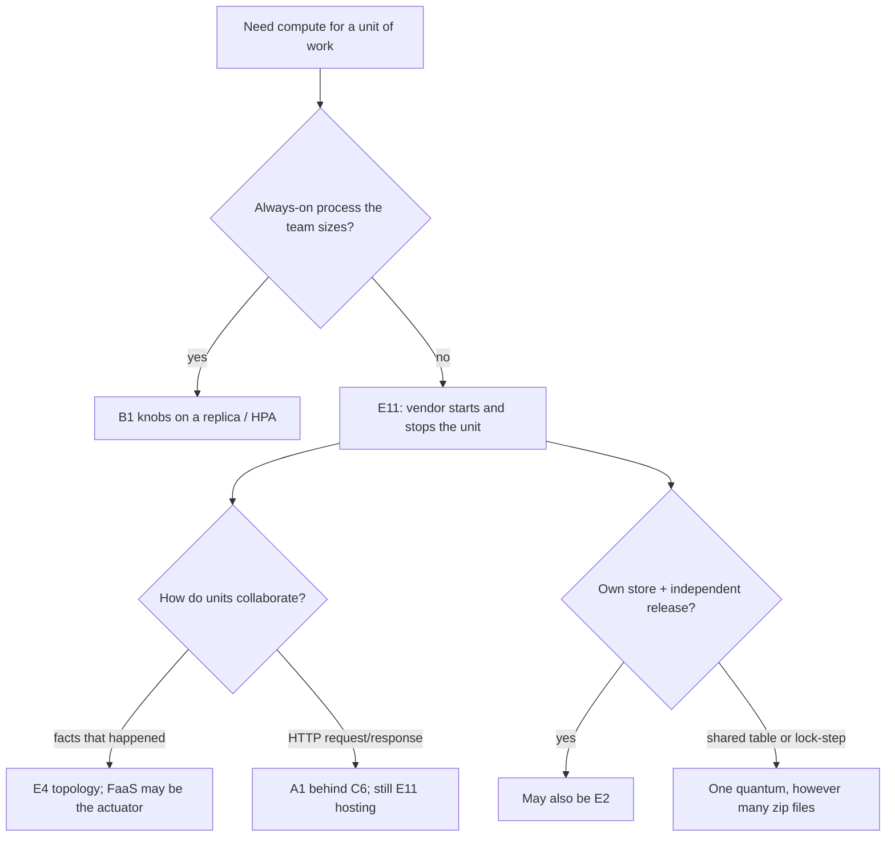

# Serverless and FaaS

**See also:** [scaling strategies (B1)](ScalingStrategies.md) · [microservice architecture (E2)](Microservices.md) · [event-driven architecture (E4)](EventDriven.md) · [timeouts and deadline propagation (C7)](TimeoutsDeadlines.md) · [strangler fig (B4)](StranglerFig.md) · [saga (B5)](Saga.md) · [API gateway (C6)](ApiGateway.md) · [sidecar (B6)](Sidecar.md) · [monolithic architecture (E1)](Monolith.md) · [modular monolith (E10)](ModularMonolith.md) · [style-selection matrix](../../.cursor/skills/arch-style/references/style-selection.md) · [distributed versus single-node](../data-intensive-design/distributed-vs-single-node.md) · [compute-platform menu](../aws/ch11.md) · [choreography vs orchestration](../aws/ch08.md) · [URL-shortener compute swap](../aws/ch14.md) · [external research note (2026-09-13)](../../docs/research/sysdesign/e11-serverless-external-research.md)

Serverless is a **hosting style**: the default server-side compute is not an always-on process the team patches and sizes. A vendor starts an execution because an event or request arrived, and stops (or freezes) it when that unit of work ends. Billing follows execution. Two overlapping ideas compose (Roberts 2018), not “no servers”:

| Member | Team writes | Vendor runs |
|---|---|---|
| **FaaS** | A handler — one function ≈ one *deployable* | Ephemeral environments, scale-out, OS |
| **BaaS** | Config and client / SDK calls | Auth, hosted DB, object store, gateway, bus |

An SPA plus hosted auth plus a hosted table plus one authorizer is BaaS-heavy E11. Queue workers with no rich client are FaaS-heavy E11. Both are this style.

That is a different question from [B1](ScalingStrategies.md). B1 owns the **knobs that add capacity** — `L = λW`, HPA / ASG / KEDA, utilization targets. This card names **scale-to-zero** as a *motive* for picking the style. You do not staff HPA for the function; you still staff **downstream** saturation, because functions will stampede a shared database. Buying Lambda does not answer Little’s law.

Quality attributes in play (qualitative — [style-selection](../../.cursor/skills/arch-style/references/style-selection.md) has **no serverless row** and no stars to record): **elasticity and idle-cost** (pay for the invoke, not the replica); **deployability of a handler** (a zip file is cheap to ship); **ops offload** of the cluster (the platform *is* the cluster). The costs are an **undeclared cold-start tail**, a **hard duration box**, **vendor-shaped triggers** that do not port with the handler, and **quanta that merge on the store and on sync hops**. [modular-implementation.md](../ml-solutions-arch/modular-implementation.md) lists Serverless and FaaS as **one style twice**, not two architectures.

## Lineage and vocabulary

- **Janakiraman on Fowler, “Serverless” (2016-06-20).** No always-on server process: third-party services, client-side control flow, short-lived hosted RPCs (FaaS). Bursty-traffic economics versus fabric overhead; operations did **not** disappear.
- **Roberts on Fowler, “Serverless Architectures” (2018-05-22).** This catalog’s definition. BaaS word around **2012** (Ken Fromm); popularity after **Lambda (2014)** and **API Gateway (2015-07)**. FaaS = team-written logic in **stateless, event-triggered, ephemeral** compute, **fully managed**. The restriction is **operational** (state, duration, startup), not linguistic. Sidebar: servers exist; the product org is **not looking after** them. Operational FaaS differs from containers and PaaS by having **no long-lived server application**. Scale is per-event. Local memory and disk are not durable across invocations. Duration is **capped**. Cold start = new environment + host process; warm start reuses one. An **API gateway** is configured HTTP whose handlers are often functions — itself BaaS. Roberts’ “five minutes” is **stale as a 2026 product number**; do not treat it as a default.
- **CNCF Serverless WG (2018-02-14).** “A **finer-grained deployment model** where applications, bundled as one or more **functions**, are uploaded … executed, scaled, and billed in response to the exact demand.” Same BaaS / FaaS split; BaaS often *holds the state* functions cannot. That sentence is the hook: functions are the unit of **deployment**, not of **domain**. CNCF is talking about *how you ship*, not bounded contexts.
- **Azure Architecture Center styles index** (fetched 2026-09-13). Lists N-tier, Web-Queue-Worker, Microservices, Event-driven, Big data, Big compute. **Serverless is not a row.** Web-Queue-Worker names Azure Functions as a *managed worker*. `…/architecture-styles/serverless` returned **404** on that fetch.
- **style-selection.md.** **Does not mention serverless.** The book’s spike-load style is **space-based** (ch16): in-memory processing units, data pumps, **database off the transaction path**. E11 also targets idle-to-spike economics; it is **not** space-based (the default path *does* round-trip a managed DB). Do not invent stars or a quantum cell.
- **This workspace.** [distributed-vs-single-node](../data-intensive-design/distributed-vs-single-node.md): metered billing for *code execution*; time limits; slow first invoke; “serverless” on BigQuery / Kafka = autoscale + metered billing, a different use of the word. [aws/ch11.md](../aws/ch11.md): Lambda on a compute-platform menu. [aws/ch07.md](../aws/ch07.md): Knative reintroduces a cluster. [aws/ch08.md](../aws/ch08.md) owns choreography vs orchestration; **Lambda architecture ≠ FaaS** (Nathan Marz batch + speed + serving — name collision only).

## What the style is — and is not

**Is.** Default server-side compute is vendor-managed execution that starts on an event or request and ends with that unit. The **unit of deployment is the function. The unit of domain is not.** Twenty zip files on one orders table are **one domain** wearing twenty deployables. Do not FaaSify a class. Do not treat function count as a target headcount.

**Is not.**

| Look-alike | Why not E11 |
|---|---|
| **“No servers” / #NoOps** | Servers exist. Monitor, deploy, secure, debug, and scale *downstream* remain. The abstraction leaks. |
| **PaaS** | Cockcroft’s test: if it starts in 20 ms and runs half a second, call it serverless. Most PaaS still asks “how many dynos?” |
| **Containers / Kubernetes** | You still size the cluster or [B1](ScalingStrategies.md) HPA. “Serverless containers” (Fargate / Cloud Run / App Runner) keep a **long-lived process** that serves many concurrent requests — Roberts’ neighbour, not FaaS. |
| **Self-hosted “FaaS” on a cluster** | [ch07](../aws/ch07.md) Knative: the programming model may look like E11; the ops do not. |
| **Microservices (E2)** | Domain-shaped services, DB-per-service, independent release. A function can *host* a service; FaaS does not make you E2. Test remains data ownership + no lock-step release. |
| **Event-driven (E4)** | How components *collaborate* (broker / mediator). FaaS is a common *actuator*. An HTTP function returning a body is still [A1](RequestResponse.md). An SQS trigger is an [A2](PubSubQueues.md) / E4 *edge*. Buying a trigger dropdown does not buy E4. |
| **Modular monolith (E10)** | One deployable, domain modules, quantum FACT = 1. Usual *source* when an edge is peeled; usual *merge* target when the fabric of functions + IAM is inoperable. |
| **Client–server (E5)** | Request/response topology. Roberts’ SPA / mobile + BaaS is E5 *plus* E11. |
| **Space-based (ch16)** | The book’s spike style keeps data **off** the DB path. E11 usually puts the DB *on* the request path. Space-based when-to (>10k concurrent, ticketing) is **not** automatically E11 when-to. |
| **ch08 Lambda architecture** | Batch + speed + serving. Name collision only. |
| **Stored-proc-as-a-service** | Tiny DB-adjacent subset, not the style. |

| Sibling | Why not this card |
|---|---|
| **[B1 Scaling strategies](ScalingStrategies.md)** | Scaler math. This card names scale-to-zero as a motive. |
| **[B4 Strangler fig](StranglerFig.md)** | Incremental cutover *mechanism* into or out of E11. |
| **[B5 Saga](Saga.md)** | Workflow that *outlives* one invoke (Durable Functions / Step Functions). [ch08](../aws/ch08.md) owns choreography vs orchestration. Those products checkpoint across many invocations — they are not a raised FaaS duration. |
| **[C6 API gateway](ApiGateway.md)** | HTTP front door. Roberts: the gateway is itself BaaS. |
| **[C7 Timeouts](TimeoutsDeadlines.md)** | How to pick a number *inside* the box. This card only treats **timeout as a characteristic**: a hard box exists. |
| **[B6 Sidecar](Sidecar.md)** | Classic FaaS usually has **no sidecar**. Need a sidecar, GPU, or custom image → you left classic FaaS. |

## Quantum count — FACT from ch7 only

An architecture quantum is the smallest independently runnable part. **The database is part of the quantum** (shared DB ⇒ quantum of one). Sync between mismatched characteristic-sets silently merges them. **No FSA serverless cell.** Do not invent “quanta = most of any style” by analogy with [E2](Microservices.md).

> One function is **not** a quantum. The quantum is the function **+ its managed data store + its sync callers**.

| Deployable | Quantum? | Why |
|---|---|---|
| One function, own trigger, own data | **Often one** | Independently deployable; the platform *is* the runtime |
| N functions, one shared table / RDS | **One** | Shared DB is the API |
| Function + API Gateway + the table it owns | **One** | Gateway is a front door ([C6](ApiGateway.md)) |
| Function that *must* sync-call another on the user path | **At risk of one** | Sync merge; a Guardian-style hop still couples availability |
| BaaS-only client + hosted backend | **One** (+ client) | No independently operable server-side quantum |

FaaS makes the *deploy* cheap and leaves the *data* and *IAM* expensive.

## Decision mechanics

Style characteristics, not a product tutorial. No memory / timeout / concurrency-quota tables — those are not the style, and Group E has **no** library-defaults section.

### Vendor orchestration and event sources

The platform *is* the cluster: it creates and destroys environments, binds triggers, and bills per invoke (Roberts 2018; CNCF 2018; Kleppmann). You do not staff [B1](ScalingStrategies.md) HPA for the function. You still staff **downstream** saturation. The trigger fabric is **vendor-shaped** — object store, row stream, queue, webhook, schedule, or configured HTTP. Rewriting the handler does not port the binding (Roberts lock-in). Classic FaaS usually has **no sidecar**.

Event sources answer *what starts the unit*. They do not answer *how components collaborate*. A queue-triggered function is **E11 hosting an E4 / A2 edge**. An HTTP function that waits on three sync callees is **E11 hosting a badly cut request path**. Do not say “we are event-driven” because the trigger list includes a queue. On an async edge, the function timeout sits *inside* the bus visibility timeout ([C7](TimeoutsDeadlines.md) / [A2](PubSubQueues.md)) — the published function maximum is still not the budget.

### Managed container versus FaaS

Cloud Run / Fargate / App Runner / Container Apps narrow the gap: less cluster to staff, still a **long-lived process** that serves many concurrent requests (Roberts’ neighbour). Use that neighbour when you need min-instances against cold-start jitter, a sidecar or custom image, or a duration the FaaS box rejects as a *design* constant. You have left classic FaaS; you have not automatically left “managed compute.” [ch14](../aws/ch14.md) already treats Lambda → App Runner / ECS as a **compute swap**, not a domain rewrite.

### Timeout as a box

Every sourced definition: invocations are **duration-capped**. Long-running *synchronous* work is the wrong shape. [C7](TimeoutsDeadlines.md) owns the number *inside* the box. The published function maximum is not the user-path budget: sync HTTP is often tighter than the function wall. [aws/ch11.md](../aws/ch11.md) names a **15-minute** invocation maximum and API Gateway **29 s** as the binding user-path box — a **book paraphrase**, not a 2026 vendor fetch. Durable Functions / Step Functions ([B5](Saga.md); [ch08](../aws/ch08.md) orchestration) checkpoint across many invocations; they are not a raised FaaS duration. Roberts’ “five minutes” is historical.

### Cold start

New environment + host + init; warm start reuses one (Roberts 2018). The same essay’s range is **a few milliseconds to several seconds**, workload-shaped. Async high-volume processors often do not care; a low-latency trading path would (Intent Media click-processor versus a trading app — **no millisecond SLA here**). [aws/ch11.md](../aws/ch11.md) paraphrases AWS (“100 ms to one second”; “typically … 1% of invocations”) and names provisioned concurrency / SnapStart. Treat that as a **book paraphrase**, not a 2026 official stat. Treat cold start as an **undeclared tail**: put the work on an async path, pre-init (and pay idle), or leave FaaS.

### When to use

Most of these should hold (Roberts + Kleppmann + this workspace’s compute menu):

- Traffic is **occasional or spiky** enough that an always-on replica wastes its life.
- Work is **event-shaped** (object, row, queue, webhook, schedule) or a coarse HTTP verb that fits the **front-door** box.
- The team wants **ops offload** and will accept vendor orchestration of the trigger fabric.
- State lives in a backing service.
- The slice is an **edge** of E1 / E10 / E2 / E5, not the ACID core.

### When not to use

- Work is **long-running and synchronous**.
- The design needs **stable in-process state** or a large local cache (space-based is the other spike answer, and it keeps data *off* the DB path).
- Collaboration is **chatty sync** across many functions on the user path.
- Cross-function ACID dominates (a saga of functions is [B5](Saga.md), not “more FaaS”).
- Tail latency *is* the product.
- Every replica needs [B6](Sidecar.md) / GPU / a custom image.
- You would FaaSify an [E10](ModularMonolith.md) monolith into grains of sand — start E10, extract **one** trigger.
- Utilization is uniformly high: Roberts’ warning is that FaaS can *cost more* than a full-time host. Do the math; do not assume idle-cost wins.
- You chose E11 because the slide said “serverless.” That is E2’s Jump-on-the-Bandwagon with a different logo.

## Distinguishing E4 — events as style vs functions as compute

| | **E4 Event-driven** | **E11 Serverless / FaaS** |
|---|---|---|
| Question | How do components *collaborate*? | How is *compute hosted*? |
| Unit | Processor + initiating / derived events | Function (deploy) + BaaS (state / door) |
| Topology | Broker or mediator ([E4](EventDriven.md); [ch08](../aws/ch08.md) choreography vs orchestration) | Vendor trigger fabric + ephemeral execution |
| Quantum | FACT **1–many** (style-selection ch15) | **No FSA row.** Apply ch7: function + store + sync callers |
| Lawful without the other | In-process bus inside E10; long-lived Kafka consumers on E2 | HTTP function behind a gateway, no broker (still A1) |

## Distinguishing B1 — knobs vs style

[B1](ScalingStrategies.md) answers *how many replicas, from which metric, with which cooldown*. E11 answers *whether the unit of compute is an always-on replica at all*. Scale-to-zero is why you pick E11; the burst is still **platform-rate-limited**, and the functions still multiply load onto whatever they call. Cap concurrency at `downstream_budget / per_invoke_cost` on the way in — the peel is otherwise an accidental load test of the shared table. B1’s failure mode “scale-out kills the database” is this style’s everyday risk, not a reason to skip the cap.

## Migration in and out

**E10 / E1 → E11.** Mechanism is often [B4](StranglerFig.md) (peel an edge) or a new subscription, not a rewrite. Pick event-shaped work or a coarse HTTP verb that fits the front-door timeout. Extract **functionality first**, leave the table (Richards 2016 — same as E2): you now have E11 hosting and **still one quantum**. Split the store only if the function has a different characteristic-set *and* you can tolerate the consistency window — that is the moment the peel *might* become a second quantum. Do not move checkout ACID onto a graph of sync functions.

**E2 → E11.** Hosting swap for *one* service whose traffic is spiky or event-shaped. You remain E2 only if DB-per-service and independent release still hold. Twenty functions on one table are **one quantum** that used to be called a service. [aws/ch14.md](../aws/ch14.md) already prefers separate Lambdas per API as a *future compute-swap* seam, not as proof of multiple quanta.

**E11 → E10.** Merge handlers back when utilization is uniformly high, when chatty sync has reappeared, or when the team cannot operate a fabric of functions + IAM. The store was probably never split — deployable change, not a data migration.

**E11 → E2, or to a managed container.** Hitting the duration / front-door box as a *design* constant → process (Cloud Run / App Runner / Container Apps) or [B5](Saga.md) if it is a workflow. Cold-start jitter after pre-init still hurts → min-instances managed container. Need sidecar / GPU / custom image → you left FaaS. Shared-DB functions that ship as a set → admit one quantum; merge (E10) or become E6; **do not** relabel as E2. Own store *and* a named disintegrator → then it can become an E2 service (E2 owns the C* tax). [ch14](../aws/ch14.md) already treats Lambda → App Runner / ECS as a **compute swap**.

C* tax on every **sync** hop is [C1](CircuitBreaker.md) / [C2](RetryBackoff.md) / [C7](TimeoutsDeadlines.md), not a reason to pick E11.

## Worked example — pet-store, click logger, URL shortener

Not a scored kata. Same quantum rule. No invented SLAs.

**Roberts pet-store (UI-driven).** Auth → hosted IdP (BaaS). Client reads listings from a hosted DB. Search = one HTTP function behind a gateway; Purchase = another (security). Choreography, not a central arbiter — **E4-shaped collaboration on E11 compute**, not “we bought E4.” If Search and Purchase share the schema and cannot deploy alone, you have **one** quantum and two zip files. Binding user-path timeout is the **gateway**, not the function max.

**Roberts click-processor (message-driven).** Redirect *now*; click message on a bus; FaaS updates advertiser budget. Small change versus a long-lived consumer — why async is the popular FaaS fit. Quantum = processor + budget store. [C7](TimeoutsDeadlines.md): function timeout sits *inside* bus visibility timeout ([A2](PubSubQueues.md)).

**Workspace URL shortener ([aws/ch14.md](../aws/ch14.md)).** Day-0: separate Lambdas per API, hosted table, API Gateway, hosted auth. Automatic scale **and** p100 from cold start. Separate Lambdas are a future compute-swap seam: they share the short-URL table, so the quantum is **one** until the table splits.

## Failure modes

- **Shared-DB fake quanta** / lock-step migrations — a distributed monolith with a nicer bill.
- **FaaSification / grains of sand** — functions used as a *domain* grain (Roberts “beyond FaaSification”).
- **E11 confused with E4**, or with **ch08 Lambda architecture**.
- **Front-door / function timeout mismatch** — fails as [C7](TimeoutsDeadlines.md); the published max is not the budget.
- **Account-concurrency stampede / DoS yourself** (Roberts); B1 “scale-out kills the database.”
- **Cold-start as an undeclared SLO**; **sync-merged availability** (three functions × three cold starts × three error budgets).
- **BaaS-only, then a second client** (logic repeated per platform).
- **Calling it space-based** (ch16); **sidecar-shaped** needs on FaaS; **self-hosted “FaaS” on Kubernetes** (programming model ≠ ops).

## Trade-offs

| Buy | Pay |
|---|---|
| No standing host; scale-to-zero idle cost | Cold start (ms–seconds, workload-shaped). Pre-init buys tail with idle spend |
| Per-request billing on spiky / rare work | Uniform high utilization can cost *more* than a box (Roberts: do the math) |
| Independent *deploy* of a handler | Shared DB / IAM / account concurrency **merges** quanta |
| Elasticity without staffing HPA | Burst is platform-rate-limited; HTTP front door often tighter than the function |
| BaaS commoditises auth / DB | Vendor control; **lock-in on the trigger fabric**; client logic repeated per platform |
| “No sysadmin” | Request / trace / log, not a node. No sidecar unless you leave FaaS. Short-lived debug is a different discipline |
| Fast first deploy on a mature event | Cambrian explosion of functions + IAM (Roberts security) |

No FSA stars. A missing cell is not a rating. No library-defaults section.

## Sources

Verified 2026-09-13; the full URL list, per-claim provenance, and items deliberately left out are in the [external research note](../../docs/research/sysdesign/e11-serverless-external-research.md). Quantum machinery is [style-selection.md](../../.cursor/skills/arch-style/references/style-selection.md) ch7; there is **no serverless row** — do not invent one. Items already in this tree are cited, not rewritten.

- Canon: Roberts, *Serverless Architectures* (martinfowler.com, 2018-05-22); Janakiraman, *Serverless* (2016-06-20); CNCF Serverless WG (2018-02-14) and whitepaper landing.
- Style pages: Azure Architecture Center styles index (fetched 2026-09-13; serverless **not** in the table; `…/serverless` → 404).
- Workspace: style-selection.md (ch7; ch16 is the book’s spike style); [distributed-vs-single-node](../data-intensive-design/distributed-vs-single-node.md); [modular-implementation](../ml-solutions-arch/modular-implementation.md); [aws/ch07.md](../aws/ch07.md), [ch08.md](../aws/ch08.md), [ch11.md](../aws/ch11.md), [ch14.md](../aws/ch14.md).
