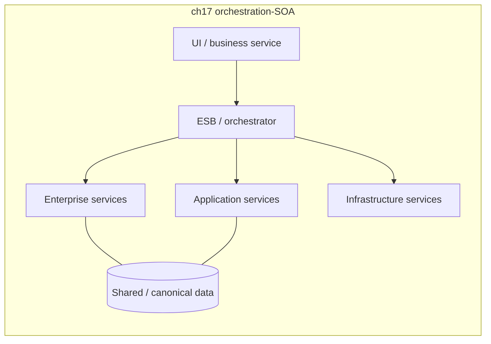
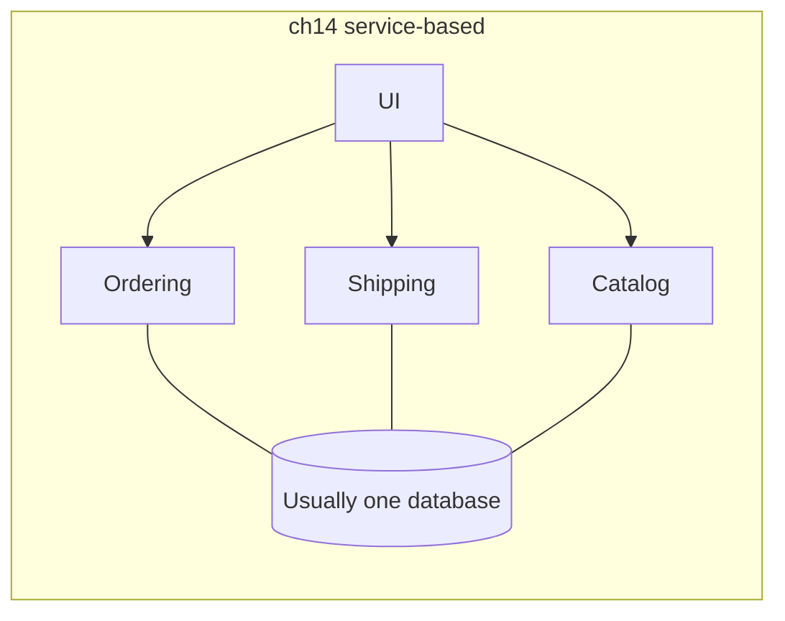

# Service-oriented and service-based architecture

**See also:** [microservice architecture (E2)](Microservices.md) · [hub-and-spoke (E9)](HubAndSpoke.md) · [API gateway and BFF (C6)](ApiGateway.md) · [monolithic architecture (E1)](Monolith.md) · [event-driven architecture (E4)](EventDriven.md) · [strangler fig (B4)](StranglerFig.md) · [saga (B5)](Saga.md) · [outbox and CDC (B7)](OutboxCdc.md) · [services are not an architecture](../coding-rules/services.md) · [distributed versus single-node](../data-intensive-design/distributed-vs-single-node.md) · [REST / RPC as wire](../data-intensive-design/rest-rpc-dataflow.md) · [choreography vs orchestration](../aws/ch08.md) · [style-selection matrix](../../.cursor/skills/arch-style/references/style-selection.md) · [ADR 0005](../../docs/architecture/adrs/application/mobile-test-automation/0005-adopt-plain-modular-monolith-partitioned-by-cluster.md) · [external research note (2026-09-13)](../../docs/research/sysdesign/e6-soa-external-research.md)

Two architecture *styles* share this catalog id because “SOA” never stayed still (Fowler 2005). Keep them un-collapsed:

1. **Orchestration-driven SOA** (FSA ch17) — technical taxonomy layers stitched by a **service bus + orchestration engine**. Residual fit is *integration over legacy*, not a greenfield application architecture.
2. **Service-based architecture** (FSA ch14) — a separately deployed UI, **≤12 coarse domain services**, and **usually one database**. The pragmatic first distributed hop from [E1](Monolith.md) / E10, and the usual stepping-stone toward [E2](Microservices.md).

Neither is “we have HTTP endpoints.” [Martin](../coding-rules/services.md): services are not an architecture; coupling through **shared data** remains. Neither is a protocol — SOAP is a [wire](../data-intensive-design/rest-rpc-dataflow.md). An ESB is a *placement*; when that placement is a single smart hub, the topology is [hub-and-spoke (E9)](HubAndSpoke.md), not a different style. OASIS SOA-RM is an abstract vocabulary, not this card’s application style.

**The E2 discriminator is data ownership, not process count.** [Microservices](Microservices.md) require independently deployable services that **own their data** (share-as-little; most quanta of any style). Service-based keeps **ACID by not splitting the DB**. Orchestration-SOA shares *more*, not less — enterprise entity services, a canonical model, the bus. Shared DB or a smart pipe ⇒ you do not have E2, however many processes you start.

| Test | E6 service-based | E6 orchestration-SOA | E2 microservices |
|---|---|---|---|
| **Grain** | Coarse domain services (a *portion* of the app) | Taxonomy layers (business / enterprise / application / infrastructure) | Fine, bounded-context services |
| **Data** | **Usually one database** | Shared / canonical model; enterprise entity services | **DB-per-service**; no other service’s txn touches this data |
| **Pipe** | Dumb, typically sync, **rare** chatter | **Smart** — ESB owns routing, transform, discovery, often the txn | **Smart endpoints, dumb pipes** |
| **Reuse philosophy** | Duplicate small logic; do not share entities | **Share-as-much-as-possible** | **Share-as-little-as-possible** |
| **Independently deployable?** | Processes, yes — the *quantum* only if data splits | No — bus + enterprise services + data are one coupling domain | Yes, *including* the database |
| **Quanta** | **≥1** (one shared DB ⇒ one) | **1** | **Most of any style** |
| **ACID** | Best *distributed* style for it (keep the txn in one coarse service) | Not feasible across remote enterprise services; BASE or coarsen | Don’t. Fix granularity; saga is a workflow, not ACID |

Quality attributes, recorded as facts from the [style-selection](../../.cursor/skills/arch-style/references/style-selection.md) rows (star figures are missing; unrecovered cells stay `—`; do not invent a blended “SOA” row):

| Style | Recovered ratings | Differentiator |
|---|---|---|
| **Service-based (ch14)** | agility / test / deploy **4★**; FT / availability **4★**; scalability **3★**; elasticity **2★**; **no 5★ anywhere** | **Cost + simplicity** — modularity without E2’s granularity tax |
| **Orchestration-driven SOA (ch17)** | deploy / test “**disastrous**”; simplicity / cost **inverted** | Residual: heterogeneous *legacy* integration, not app agility |

## Lineage and vocabulary

- **Fowler, *Service Oriented Ambiguity* (2005-07-01).** “SOA” already meant incompatible things: expose via web services; dissolve apps into core services plus UI aggregators; a standard enterprise backbone (“CORBA with angle brackets”); or asynchronous document messaging. He judged the term **beyond saving** — concrete ideas need independent names. This card is that split.
- **OASIS SOA-RM v1.0** (members approved as OASIS Standard; announcement **2006-10-22**). An *abstract* vocabulary, “not directly tied to any standards, technologies or other concrete implementation details.” A **service**: access to capabilities through a prescribed interface, exercised under the service description’s constraints. Dynamics: **visibility** → **interaction** (usually messages) → **real world effect**. Ownership boundaries are a motivating consideration. Vocabulary — **not** a license to install an ESB. **OASIS SOA-RAF v1.0** (Committee Specification 01, **2012-12-04**) stays abstract; extra weight when integration *crosses ownership*. Not the ch17 topology.
- **The Open Group, “What Is SOA?”** Service orientation, orchestration, open-standards infrastructure, **strong governance**, a litmus test for a good service. That is the *enterprise* flavor Fowler already found ambiguous, and the pairing Richards later scores as the disaster row. Do not pick ch17 because this page says “governance.”
- **Lewis & Fowler, *Microservices* (2014-03-25), sidebar *SOA*.** Similar to what *some* SOA advocates wanted. What they met, most of the time: **ESBs integrating monoliths**; complexity hidden in the bus (Jim Webber, footnote: ESB = “Erroneous Spaghetti Box”); multi-year initiatives that cost millions; centralized governance that inhibited change. Preference they name: **smart endpoints, dumb pipes**. The term “microservices” exists *because* SOA would not stay still. Netflix then said “fine-grained SOA.”
- **Richards, *Software Architecture Patterns* (2015-02-24).** SOA is “usually overkill for most applications.” Three topologies he then still filed under *microservices*: API REST (fine-grained, C6-shaped); **application REST** (separately deployed UI talking to **larger, coarse-grained** service components — the shape FSA later names **service-based**); centralized messaging (lightweight broker, **not** “SOA-Lite”: no orchestration, transformation, or complex routing). Too-fine services that force UI/API orchestration “will quickly turn your lean microservices architecture into a heavyweight service-oriented architecture.” Shared-database reads are his stated alternative to inter-service calls for data.
- **Richards, *Microservices vs. Service-Oriented Architecture* (2015-11-17).** Mid-2000s SOA promised reuse and alignment; practice was “big, expensive, complicated.” OASIS-RM does **not** specify taxonomy, ownership, or granularity. **Four-type taxonomy:** abstract **business services** (enterprise operations; litmus: “Are we in the business of …?”); shared **enterprise services** (`CreateCustomer`); fine-grained **application services** bound to one app; **infrastructure services** (audit, security, logging). Middleware bridges the abstract to the concrete. **Ownership** splits across business, shared-services, app, infra, *and* the integration group — one request is a multi-group tax. Philosophy: **share-as-much-as-possible** vs E2’s **share-as-little-as-possible**. Scope: large heterogeneous enterprise-wide systems. Poor fit: small web apps; workflow apps with few shared components. ACID across remote services is not feasible; coarsen until the transaction sits in one service, or accept BASE.
- **Microsoft Learn, “Service-oriented architecture.”** Common denominator = decompose into services (usually HTTP). Microservices *derive from* SOA but differ: large central brokers, organization-level orchestrators, and the ESB are “typical in SOA” and “**anti-patterns in the microservice community**.” SOA is **less prescriptive**.
- **Richards & Ford, *Fundamentals of Software Architecture*** (1st ed. 2020; 2nd ed. March 2025), via [style-selection.md](../../.cursor/skills/arch-style/references/style-selection.md) — ch14 service-based; ch17 orchestration-driven SOA. 2nd-ed chapter bodies were paywalled (2026-09-13). Cite the distillation for matrix rows; do not re-derive.
- **Martin, *Clean Architecture* ch27** ([services.md](../coding-rules/services.md)). Independently deployable only to the extent data/behavior coupling allows. Cross-cutting features (the “kitty problem”) force coordinated change across a functional cut.

## What each style is — and is not

**Orchestration-driven SOA.** A technically partitioned enterprise topology: taxonomy layers plus a **bus / orchestration engine** that owns routing, transformation, discovery, and often the transaction boundary. Reuse is the driving philosophy — write `CreateCustomer` once, call it from everywhere. Partitioning: “**technical (extreme)**.” Quantum machinery collapses this to **one quantum**: the shared bus, the shared enterprise services, and (usually) the shared data model are a single coupling domain. The bus is the hub; spokes are the taxonomy services. That hub is E9’s topology wearing an enterprise label.

Richards’ ownership model is why deploy/test scores “disastrous”: one request crosses business users, shared-services teams, app teams, infra teams, *and* the integration/middleware group. Conway is not a side effect — it is the topology. Mid-2000s SOA promised reuse and business/IT alignment; companies learned it was “big, expensive, complicated” and “took too long.” His insurance example is the intended *enterprise* scope (large heterogeneous systems with many shared components). Poor fit he names: small web apps, and workflow apps with few shared components. Mid-size systems that outgrow a thin API may *gain* SOA capabilities (transformation, orchestration, heterogeneous integration) — or an overbuilt SOA may shrink *to* microservices. That last sentence is a capability observation, **not** a recommendation to re-adopt ch17.

**Service-based.** A **domain-partitioned** distributed application: separately deployed UI (sometimes more than one), **≤12 coarse domain services** (order fulfillment, shipping — a *portion* of the app, not a getter), and **usually one database**. Services deploy like small monoliths. Communication is typically synchronous and should be **rare** — heavy chatter means the boundaries are wrong or the style is. Richards 2015’s “application REST” named as its own style. Shared-database *reads* are his stated alternative to inter-service calls for data — that is how the style keeps ACID without becoming a chatty RPC graph. OASIS-RM still applies as vocabulary; it does not choose the bus. The [C6](ApiGateway.md) hop in front stays a façade: route, offload, optional aggregate. Domain logic that lands in the gateway is the overambitious-gateway failure — a slide back toward ESB-SOA, not a BFF.

| Look-alike | Why not E6 |
|---|---|
| **E2 microservices** | Fine-grained, **DB-per-service**, polyglot persistence, share-as-little, most quanta. Service-based keeps ACID by *not* splitting the DB. Orchestration-SOA shares *more*. Microservices ≠ “SOA with REST.” |
| **E1 / distributed monolith** | Several HTTP endpoints on one schema *and* a lock-step release are still one quantum. If you cannot ship fulfillment without shipping, you have not left E1. |
| **E10 modular monolith** | Same domain cut, still one process. Extracting those modules *is* the E10→E6 move. |
| **C6 API gateway / BFF** | A dumb north–south hop. The moment the gateway owns BPEL-like flow, transformation, and canonical models, you have re-entered ch17. ThoughtWorks’ overambitious-gateway Hold is that slide. |
| **E4 / E9** | A workflow engine *inside* an event-driven style is not an enterprise SOA taxonomy ([ch08](../aws/ch08.md) orchestration vs choreography is a *collaboration* choice). A broker-as-hub is E9 topology; it becomes ch17 only when the hub owns transform, canonical models, and enterprise entity services. |
| **SOAP / WS-*** | A protocol generation. You can do service-based over HTTP/JSON; you can do ch17 over REST. The style is where the logic and the data live. |
| **“We have services”** | Martin: expensive function calls. Taxonomy + bus, or coarse independently deployable domain services — pick one and name it. |

## Quantum count — a fact, not a target

Architecture quantum = smallest independently runnable part. **The DB is part of the quantum — single shared DB ⇒ quantum of one.** Coupling test: two things are coupled if changing one might break the other. Sync between would-be quanta **silently merges them**. After choosing sync vs async, **re-check boundaries**. Do **not** run arch-style’s four determinations on this card.

| Style | Topology | Partitioning | Quanta (FACT) |
|---|---|---|---|
| **Service-based (ch14)** | UI + ≤12 coarse domain services + usually one DB | domain | **≥1** |
| **Orchestration-driven SOA (ch17)** | taxonomy layers + ESB / orchestration engine | technical (extreme) | **1** |
| **Microservices (E2)** | fine grain, DB-per-service | domain (extreme) | **most of any style** |

**How ≥1 happens in service-based.** One shared DB ⇒ **quantum of one** for anything that transactionally depends on that schema, even if processes deploy separately. Additional quanta appear only when a domain service gets **its own** persistence (or an independent UI with no shared store) *and* you do not re-entangle them with a synchronous call. That is why the row is “≥1” and not “12.” **≤12 is a service-count ceiling, not a quantum count.** Do not treat “12 services” as “12 quanta.”

## Decision mechanics

### When to use / when not

**Service-based — use when** ([style-selection](../../.cursor/skills/arch-style/references/style-selection.md)): you want **modularity without microservices’ granularity tax**; **ACID** across a related dataset still matters (the book’s “**best distributed style for ACID needs**”); the domain already has DDD-shaped coarse seams (a handful of subdomains, not a hundred entities); you need a **stepping-stone to microservices** (deployable domain services first, database split later); team / ops maturity is enough for a few independently deployed units, not for a mesh + N databases + sagas.

**Service-based — do not use when:** you have **one characteristics set** and one team — stay E1/E10 (decision tree). [ADR 0005](../../docs/architecture/adrs/application/mobile-test-automation/0005-adopt-plain-modular-monolith-partitioned-by-cluster.md) lost this row because Determination 1 found **no quantum boundary**. Inter-service chatter is constant: wrong boundaries or wrong style. Richards 2015: if the UI/API must orchestrate, services are too fine; if services call each other to finish one request, they are too fine or mis-partitioned. You have already crossed ~12 services and are splitting the DB — you have left this style for E2 (or a distributed mud). Fault isolation / independent scale of *data* is a top characteristic: elasticity is only **2★**; the shared DB is still one fate for storage.

**Orchestration-driven SOA — residual use:** **historical.** Residual fit = **integration architecture over legacy** (package software, COBOL cores, heterogeneous ownership — Richards 2015 “heterogeneous interoperability”; OASIS-RAF’s crossing-ownership emphasis). “**In practice it has mostly been a disaster**” as an *application* architecture (style-selection; quoted in this workspace’s style-decision). Reuse created coupling; coupling forced coordinated deployments and holistic tests; the integration team around the engine became the bureaucratic bottleneck (Richards’ ownership model; Conway). Do **not** pick ch17 for a new product because The Open Group says “strong governance” and “orchestration.” Those sentences describe the style that FSA scores disastrous for deploy/test.

**Greenfield with one characteristics set → E1/E10.** Extreme isolation / independent data scale → E2 after prerequisites. React-to-events domain → E4. New application whose only “requirement” is reuse-via-ESB → do not pick ch17. Integration of heterogeneous *owned-by-someone-else* systems may still justify a *constrained* bus — name that as an integration architecture, not as the application style.

### Where the pipe lives

The style is where logic and data live, not which product you bought. Placement of the *pipe* is the usual accidental slide from service-based into ch17.

| Placement | What it is | Still this card | Left this card |
|---|---|---|---|
| **[C6](ApiGateway.md) gateway / BFF** | Dumb north–south façade: route, offload, optional aggregate | In front of coarse domain services | Owns BPEL-like flow, transform, or a canonical model → ch17 (ThoughtWorks’ overambitious-gateway Hold) |
| **Lightweight broker** | Dumb pipe; Richards 2015 “centralized messaging” — **not** “SOA-Lite” (no orchestration, transformation, or complex routing) | Optional async between domain services; does **not** make the style [E4](EventDriven.md) | A mediator that owns enterprise taxonomy + entity services → ch17 |
| **ESB / orchestration engine** | Smart hub — [E9](HubAndSpoke.md) topology with enterprise semantics | Residual: integration over *someone else’s* legacy | Application architecture (style-selection disaster row) |
| **Shared entity JAR / canonical library** | Compile-time reuse | Never the style you want | Lock-step rebuilds. Named in style-selection; **mechanism not asserted** (source file missing) |

### Migration in / out

**Into service-based (the usual E6):**

| From | Move | Notes |
|---|---|---|
| **E1 / E10** | Extract coarse domain services along *already published* module seams; keep the database at first | Book-recommended stepping-stone. ADR 0005 records this as the destination. Fowler’s coarse “duolith” is already E6-shaped. |
| **E2 gone wrong** | Merge chatty services; restore a shared DB *deliberately* for the ACID cluster | Richards 2015: coarsen to keep a transaction inside one service. E2’s own rule: don’t do cross-service transactions — fix granularity. |
| **ch17 SOA** | Collapse taxonomy layers into domain services; demote the ESB to a dumb pipe or [C6](ApiGateway.md) façade; stop sharing enterprise entity services | Extract *away* from the bus. Do not “replatform the ESB to Kubernetes” and call it modern. |

**Out of service-based.** (1) **Stay** — most systems that needed distribution for deploy/test/FT never need E2’s data split; cost+simplicity is the differentiator precisely because you can stop here. (2) **→ E2 via [B4](StranglerFig.md)**, one service at a time, **after** you split *that* service’s data. Shared DB left in place ⇒ quantum count unchanged. Cross-service writes then pay [B5](Saga.md) / [B7](OutboxCdc.md). (3) **→ E4** only if the collaboration itself becomes react-to-what-happened (E4 when-not: mostly request-based work stays here). (4) **Back to E1/E10** if the extra processes bought nothing (Martin: slide back to one executable as operational need declines).

**Out of orchestration-driven SOA.** Treat the bus as a strangler façade (B4/C6). Named in the style-selection shortlist, **not defined here** (source file missing): **Accidental SOA** — the failure mode of *recreating* this topology inside an E2/E6 program (gateway-as-ESB, shared entity library as enterprise service). **Shared entity-object library** is likewise a name-check only.

The inverse of E2’s Entity-trap / Grains of Sand is the E6 warning: do not pre-split into entity services (`GetCustomerName`) or you recreate the chatty SOA Richards said architects had to unlearn.

Fallacies you start paying the day you leave E1 (style-selection ch9): network unreliable / latency not zero / bandwidth finite (stamp coupling via fat entity payloads) / **versioning is easy** / **compensating updates always work** / **observability is optional**. Service-based pays fewer of them than E2 *only* while the DB stays shared and chatter stays low. Ch17 concentrates them in the smart pipe.

### Worked example — not a scored kata

**This workspace.** [ADR 0005](../../docs/architecture/adrs/application/mobile-test-automation/0005-adopt-plain-modular-monolith-partitioned-by-cluster.md) (accepted) and the style-decision (gate closed 2026-07-26): **Not E6 today.** Determination 1: one quantum. The IR spine is shared; Preserve Provenance has CA = 13 of 16 components; a synchronous Certify→Models call would collapse a split. Service-based was “the strongest distributed candidate” and lost because there was **no quantum boundary**, its winning rows (FT 4★, scalability 3★) were **eliminated at stage 1**, and team maturity was `needs-input`. **Named migration target.** First extraction candidates: Replay-on-devices (if lab-side scaling becomes internal) and cluster C / evidence (if residency makes co-location *illegal*). Module seams were cut on those clusters so an E6 extract would follow code and schema lines already there. **Orchestration-driven SOA** was rejected in one line: historical; disaster as application architecture. No residual integration-over-legacy problem exists for this target. This is the book’s intended use of E6: **not the start**, the priced exit from E10 when a named fracture appears.

**Place-order (ACID cluster).** `Order` write + `Customer.creditLimit` as one ACID → keep them in **one** coarse Ordering service on the shared DB. That is E6 doing its job. Split those tables and you have left for E2 and must pay B5 — E2’s own when-not. `Notification` can be async without becoming E4. Shared `CUSTOMERS` table plus two “services” that cannot deploy apart = **not E6** (one quantum pretending to be two). Richards 2015 application-REST — separately deployed UI, coarse service components, shared-database reads instead of service-to-service calls — is E6 service-based without the later name.

The same tests decide the *next* hop. A named disintegrator on *one* coarse service (residency that makes co-location illegal; lab-side scale that the UI process cannot absorb) is the E6→E2 cue — and only after that service’s data splits. A desire to reuse `CreateCustomer` from every app is the ch17 cue, and the wrong one for a product.

Microsoft’s slogan that microservices are “SOA done right” is a slogan, not a discriminator. E2 is opinionated about boundaries and data ownership; ch17 is not.

## Failure modes of the style

- **Vocabulary collapse.** Fowler 2005: the word does not decide. If you cannot say “ch17 bus” or “ch14 domain services,” you do not have a style decision.
- **Accidental SOA** (name-check). A [C6](ApiGateway.md) gateway or “composer service” accretes transformation, canonical models, and workflow. That is a slide back toward the ESB, not a BFF.
- **Shared entity-object library** (name-check). Compile-time reuse that restores lock-step deploys. Martin’s data-coupling fallacy in JAR form.
- **Chatty entity services.** `GetCustomerAddress` + `UpdateCustomerName` — the granularity error SOA already burned on (Richards 2015). Fix: coarsen, or you have invented E2 minus independence.
- **Distributed monolith.** HTTP + one schema + one release train. Pays E6’s network tax without E6’s deploy 4★.
- **Kitty / cross-cut.** Functional service cuts that cannot absorb a new feature without touching every service ([services.md](../coding-rules/services.md)). Coarse *domain* services only help if the new feature sits inside one domain.
- **Fashion skip to E2.** Style-selection fashion check; this workspace’s microservices rejection. E6 exists so you do not have to.
- **Saga sprawl as a substitute for coarsening.** Most user actions need a saga ⇒ the cut is wrong. Do not “fix” it with a better orchestrator — that rebuilds ch17.

## Trade-offs

Qualitative, source-backed. Stars only where style-selection recovered them. **No invented cells.**

| Concern | Service-based (ch14) | Orchestration-driven SOA (ch17) |
|---|---|---|
| **Cost / simplicity** | The differentiator: no 5★, but cheaper than E2 / EDA | **Inverted** — reuse bought a coordination machine |
| **Deploy / test / agility** | **4★** — few independently shipped domain units | “**Disastrous**” — one request, many owners, bus in the middle |
| **Fault tolerance / availability** | **4★** — a dead domain service is not the whole UI process | One quantum through the engine; the bus is a fate-share |
| **Scalability / elasticity** | **3★ / 2★** — scale a service’s *compute*; the shared DB does not split | Heterogeneous integration scale, not elastic app scale |
| **ACID / consistency** | Best distributed style for ACID (one DB, coarse services) | Distributed txns across enterprise services — Richards: not feasible; BASE or coarsen |
| **Reuse** | Deliberately low; duplicate small logic rather than share entities | Driving goal; enterprise services *are* reuse; coupling follows |
| **Governance / Conway** | App teams own domain services (like E2, fewer of them) | Business + shared-services + app + infra + middleware for *one* request |
| **Heterogeneous legacy integration** | Weak — not what the style is for | The residual reason to keep a bus |
| **Stepping-stone** | Yes → E2 (data split later) | Poor → anything; extract *away* from the bus |
| **Network fallacies** | Paid at service boundaries; limited by chatter rule | Paid *and* concentrated in the smart pipe |
| Other stars | **—** | **—** |

E2 buys independently deployable *quanta* (data ownership) and pays Fowler’s premium. E6 service-based buys a few coarse processes and usually keeps one database — cheaper quantum count, weaker isolation. E1 / E10 skip the network; start there unless a named fracture appears. Ch17 buys reuse across ownership boundaries and pays deploy/test as a coordination machine.

## Sources

Verified 2026-09-13; the full URL list, per-claim provenance, and items deliberately left out (unrecovered stars, Accidental SOA / shared-entity-library *mechanics*, FSA 2nd-ed chapter bodies, “4–12 / average ~7,” Thomas Erl layer counts, ESB-product defaults) are in the [external research note](../../docs/research/sysdesign/e6-soa-external-research.md).

- Fowler, *Service Oriented Ambiguity* (2005-07-01). OASIS SOA-RM v1.0 (announcement 2006-10-22) and SOA-RAF v1.0 CS01 (2012-12-04). The Open Group, “What Is SOA?”
- Lewis & Fowler, *Microservices* (2014-03-25), incl. *Microservices and SOA*.
- Richards, *Software Architecture Patterns* (2015-02-24); *Microservices vs. Service-Oriented Architecture* (2015-11-17).
- Microsoft Learn, “Service-oriented architecture.”
- Richards & Ford, FSA — via [style-selection.md](../../.cursor/skills/arch-style/references/style-selection.md) (ch7 quantum; ch14; ch17).
- Workspace: [services.md](../coding-rules/services.md); [distributed-vs-single-node.md](../data-intensive-design/distributed-vs-single-node.md); [rest-rpc-dataflow.md](../data-intensive-design/rest-rpc-dataflow.md); [aws/ch08.md](../aws/ch08.md); ADR 0005; style-decision.
