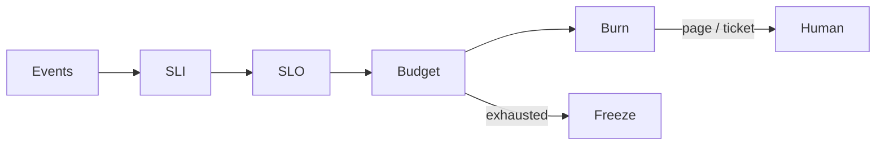

# SLOs, error budgets, and alerting policy

**See also:** [circuit breaker](CircuitBreaker.md) · [retry, backoff, and retry budgets](RetryBackoff.md) · [failover and health checks](Failover.md) · [rate limiting](RateLimiting.md) · [load shedding](LoadShedding.md) · [graceful degradation](GracefulDegradation.md) · [reliability](../data-intensive-design/reliability.md) · [performance](../data-intensive-design/performance.md) · [NFR references](../data-intensive-design/nfr-references.md) · [POC-to-production](../claude-certification/enterprise-integration-production/poc-to-production.md) · [feedback loop](../claude-certification/stakeholder-engagement/feedback-loop.md) · [guardrails](../claude-certification/responsible-ai/guardrails.md) · [external research note (2026-09-13)](../../docs/research/sysdesign/d5-slos-external-research.md)

Catalog **D1** owns signal *taxonomy* (RED / USE / golden-signal definitions). **D2** owns RUM as a higher-quality SLI *implementation*. **D3** owns how alerts are *wired* (PromQL, routing). **D4** owns traces that *explain* a burned budget. This card owns the **policy layer**: what an SLI / SLO / SLA is, how the leftover unreliability is spent, and which burn-rate windows page a human.

The [circuit breaker](CircuitBreaker.md) decides **whether to call**. [Retries](RetryBackoff.md) decide **whether to try again**. Both produce events that *feed* an SLI; they are not the SLO. [Failover](Failover.md) RTO / RPO is a DR contract, not a request-yield target. [Rate limiting](RateLimiting.md) 429s are a *product* choice for the denominator (Workbook example = 5xx; Sloth's getting-started counts `5xx|429`). [Load shedding](LoadShedding.md) and [graceful degradation](GracefulDegradation.md) are how you *spend* budget on purpose instead of failing everyone.

An SLO is a **target on a carefully defined SLI**. The error budget is the remaining unreliability versus that target. Alerting policy is how you notice spend *while there is still budget left*. An SLA is the same idea with **consequences** (rebate, penalty, court). If nothing happens on a miss, it is an SLO — most people who say "SLA" mean this card.

Quality attributes in play: **reliability** (continue meeting the SLO when a [fault is not yet a failure](../data-intensive-design/reliability.md)), **availability as yield** (well-formed requests that succeed), and **change velocity** (budget remaining is permission to ship). The costs are freeze culture if the target is too tight, silent user pain if it is too loose, paging noise that trains ignore, and a monitor that can itself lie.

## Lineage and vocabulary

- **SRE book ch. 4 *Service Level Objectives*** (Jones, Wilkes, Murphy, Smith) splits three overloaded words. Footnote 16: a real SLA breach might be a court case. Google Search has no public SLA and still needs SLIs / SLOs. SRE does not typically draft SLAs.

| Term | Definition | Test |
|---|---|---|
| **SLI** | Carefully defined quantitative measure of one service aspect. Common: latency, error rate, throughput (QPS), availability as *yield*, durability. | Computable from events? |
| **SLO** | Target or range for an SLI: `SLI ≤ target` or `lo ≤ SLI ≤ hi`. Chapter example: average Shakespeare search < 100 ms (100 ms labelled arbitrary). | What do we *aim* to hit? |
| **SLA** | Contract with **consequences** of meeting or missing the contained SLOs. | What *happens* on a miss? If nothing → SLO. |

- **SRE book ch. 3 *Embracing Risk***: 100% is the wrong target. A user on a 99% smartphone cannot tell 99.99% from 99.999%; each extra nine is nonlinear (redundant compute + opportunity cost). The availability target is both a **minimum and a maximum**. Error budget = remaining unreliability vs the SLO; while it remains, releases proceed.
- **Workbook ch. 2 *Implementing SLOs***: preferred SLI shape is **good events / total events** (0–100%). Error budget = 100% − SLO. Example: 99.9% SLO, 3 000 000 requests / four weeks → **3 000** allowed errors; one 1 500-error outage spends **50%**. Distinguishes **SLI specification** (user outcome, measurement-independent) from **SLI implementation** (logs vs probers vs in-page JS — quality / coverage / cost differ). Start with **five or fewer** SLI *types*. General-purpose window: **four-week rolling** (integral weeks so the weekend count is stable). Calendar windows match planning but force mid-period traffic speculation.
- **Workbook ch. 5 *Alerting on SLOs*** is the source for every burn-rate number below. Prometheus syntax is illustrative; the approach is framework-agnostic. Pages and tickets are the only valid ways to get a human (fn. 2).
- **Workbook Appendix B *Example Error Budget Policy*** (2018-02-19 / approved 2018-02-20): budget = 1 − SLO; 99.9% → 0.1%; 1 000 000 requests / four weeks → **1 000** errors. Changes are "roughly **70%** of our outages." Exceeded four-week budget → halt all changes except P0 / security until back in SLO. One incident **> 20%** of four-week budget → postmortem with a P0 action; one *class* of outage > 20% over a quarter → P0 on the next quarterly plan.
- **SRE book Appendix A** publishes time-based downtime with no planned downtime. **Treynor, Dahlin, Rau, Beyer, "The Calculus of Service Availability"** (*ACM Queue* 15(2) 2017) restates availability as MTTF / (MTTF + MTTR) as users experience it, and the **rule of the extra 9**.
- **Hidalgo 2020** [28], **Mogul & Wilkes HotOS 2019** [29], **Hauer et al. NSDI 2020** [30] already live in [nfr-references.md](../data-intensive-design/nfr-references.md) / [performance.md](../data-intensive-design/performance.md). Cited, not re-derived.
- **OpenSLO v1** is a *policy object* (`apiVersion: openslo/v1`), not an instrumentation standard. **OpenTelemetry** is the opposite: SLI *raw material*, no SLO resource.

## Signals and semantics

Workbook ratio examples: successful HTTP / total; gRPC < 100 ms / total; undegraded / total (quality). Pipelines: freshness (records newer than a watermark / records *accessed*); correctness (injected known-good); coverage (processed / should-have-processed). Storage: durability = written records later readable — the user-wanted slice may be a tiny unavailable subset of a decade of bytes.

SRE book ch. 4 categories: serving → availability, latency, throughput; storage → latency, availability, durability; pipelines → throughput + e2e latency; **all** → correctness (often a data property, not an infra SLO).

**Aggregation.** Averages hide tails. Ch. 4: typical ~50 ms, **5% of requests 20× slower**; mean alerting is flat while p99 moves. Prefer percentiles; do not assume normality. **Never average percentiles** — merge histograms ([36](../data-intensive-design/nfr-references.md)). Histogram `le` buckets *approximate* a latency SLI; counting slow requests at configured thresholds is more accurate but harder to change retroactively (Workbook).

**Denominator.** Well-formed requests only (yield). Count as *bad*: connect fail, timeout, HTTP 5xx, gRPC `UNAVAILABLE` / `DEADLINE_EXCEEDED` (same classifier as [C1](CircuitBreaker.md)). Do not count as availability failures: 4xx validation, 401 / 403, caller cancel. Workbook example: non-5xx = success. **Policy errors:** the golden-signals chapter allows "over the latency SLO ⇒ an error" — that is a *latency* SLI as a ratio, not a second availability SLI. **LLM refusals:** HTTP 200 + `stop_reason: "refusal"` are not availability errors ([C2](RetryBackoff.md)); they are a quality / safety SLI candidate.

**Spec vs implementation.** Same "homepage < 100 ms" spec: server logs miss never-arrived requests; browser probers catch network-path failures and miss subset-only bugs; in-page JS is closest to the user *and* gives the telemetry service its own reliability requirement. Move toward the user to raise quality; raise coverage to capture more of the population. **D2** owns the RUM implementation; this card owns the decision that the spec is user-outcome, not server-log.

**Golden signals are not a fifth SLO.** SRE book ch. 6 (latency, traffic, errors, saturation) is **D1** taxonomy. An SLO is a *target on an SLI built from those*. Traffic / QPS is **not** an SLO you choose (ch. 4). Saturation is usually a *leading* page (ch. 6: page when nearly problematic), not a user-facing SLO. Separate successful-request latency from error latency: a fast 500 must not improve a latency SLI.

## Error-budget mechanics

`budget = (1 − SLO) × eligible events` (GCP + Workbook). Burn rate 1 = the pace that hits exactly 0 at window end. Workbook Table 5-4 for a **99.9% / 30-day** SLO:

| Burn rate | Error rate | Time to exhaust |
|---|---|---|
| 1 | 0.1% | 30 days |
| 2 | 0.2% | 15 days |
| 10 | 1% | 3 days |
| 1 000 | 100% | **43 minutes** |

Google prefers **yield** (successes / total) over uptime clocks for globally distributed, partially-available services (Embracing Risk). Consequence (Workbook footnote 8): a four-hour hole, four one-hour holes, and a constant 0.5% drip can spend the *same* event budget and produce different happiness. Calculus: mature SLO > 99.99% often resets **quarterly**.

**Policy is the teeth.** Without an approved freeze policy the SLO is "another KPI" (Workbook). Appendix B is the sourced four-week / 20% / P0 text. Dependency-caused misses: two schools (do not freeze / freeze anyway); Appendix B lists shared-fate exceptions (company-wide network, another team's frozen dep, out-of-scope load / pen testers, miscategorized errors with no user impact). Write one down.

Workbook Table 2-5 (SLO met/missed × toil × satisfaction) is how you learn the number is wrong — not a vendor preset:

| State | Move |
|---|---|
| Met + low toil + high sat | Raise velocity *or* step the target back |
| Met + low sat | **Tighten** |
| Missed + high sat | **Loosen** |
| Missed + high toil + low sat | Offload toil and fix the product |

## Burn-rate alerting (Workbook ch. 5)

Evaluate on **precision, recall, detection time, reset time**. Iterations 1–3 are teaching failures; **6 is recommended**.

| Iteration | Rule | Why it fails |
|---|---|---|
| 1. Recent rate ≥ SLO (~10 min) | 99.9% → alert if 10-min rate ≥ 0.1% | Total-outage detection ~0.6 s; a 0.1% × 10 min spend is **0.02%** of the monthly budget; up to **144 alerts/day** while still meeting the SLO. |
| 2. 36 h window | 5% of 30-day budget at 0.1% | Better precision; ~36 h reset after a 100% outage; expensive to compute. |
| 3. `for:` duration | 1 m rate > 0.1% `for: 1h` | **Not recommended.** A 100% outage pages after one hour — same detection as a 0.2% leak — and spends **140%** of the 30-day budget. A 5-min 100% spike every 10 min never trips a 10-min `for`, yet spends **35%**. Any momentary in-SLO scrape resets the timer. |
| 4. Single burn-rate | e.g. 5% of 30-day budget in 1 h → burn **36** | A **35×** burn never pages but exhausts the month in **20.5 hours**. |
| 5. Multiple burn rates | 2% in 1 h and 5% in 6 h page; 10% in 3 days ticket | Still slow to *clear* when spend stops. |
| **6. Multi-window, multi-burn-rate** | AND a short window so the alert clears when spend *stops* | Starting point below. |

Guideline: short = **1/12** of long (1 h → 5 m; 6 h → 30 m; 3 d → 6 h; PromQL ticket pair 24 h → 2 h). Table 5-8 for a **99.9%** SLO:

| Severity | Long | Short | Burn | Budget consumed |
|---|---|---|---|---|
| Page | 1 hour | 5 minutes | **14.4** | 2% |
| Page | 6 hours | 30 minutes | **6** | 5% |
| Ticket | 3 days | 6 hours | **1** | 10% |

Arithmetic (do not invent): 30-day = 720 h. `14.4 × 1/720 = 0.02`. `6 × 6/720 = 0.05`. `1 × 72/720 = 0.10`. The chapter PromQL *also* tickets **3×** over 24 h AND 2 h (`3 × 24/720 = 10%`). Sloth emits **both** ticket pairs. Suppress duplicates: a 10% spend in five minutes satisfies slower windows too.

**Low traffic.** 10 req/h, one failure → 10% hourly rate = **1 000×** burn vs 99.9% and **13.9%** of the 30-day budget; seven failures exhaust the month. Sourced options: synthetic traffic (hides paths synthetics miss); combine related services (hides a 100% single-binary outage); change the product ([C2](RetryBackoff.md) retries; store-and-forward); **lower the SLO** (99.9% → 99%) if one ephemeral error should not page.

**Extreme SLOs.** 90% availability: Table 5-8's "2% of budget in one hour" **cannot fire** — a 100% outage spends only **1.4%** of a 30-day 90% budget in that hour. 99.999% monthly: 100% outage exhausts the budget in **26 seconds**, below many scrape intervals and SMS / email. Defending five nines is a **design** problem (canary to 1% of users → **43 minutes** of budget at 1% burn), not a paging problem.

**Do not invent per-microservice windows.** Bucket request classes (Table 5-10 — **examples**, not universal SLOs):

| Class | Availability | Latency @ 90% | Latency @ 99% |
|---|---|---|---|
| `CRITICAL` | 99.99% | 100 ms | 200 ms |
| `HIGH_FAST` | 99.9% | 100 ms | 200 ms |
| `HIGH_SLOW` | 99.9% | 1 000 ms | 5 000 ms |
| `LOW` | 99% | None | None |
| `NO_SLO` | None | None | None |

`NO_SLO` is sourced: dark launches and explicitly-out-of-SLO alpha.

## Availability math and dependencies

Time-based: `MTTF / (MTTF + MTTR)` (Calculus). Event-based: `successes / total` (Embracing Risk). Nines are leftover after you decide how unhappy users may be (Workbook: above the SLO almost all are happy; below it they complain or leave). Calculus: most Google user-facing services aim **99.99% internally**; some cloud services **99.999%**; many contracts publish a *lower* external number and keep a tighter internal SLO (ch. 4 safety margin). Those are Google's published aims, not a target to copy.

Appendix A time-based downtime (no planned downtime). Do not collapse the three 99.99% minute counts in the sources — Appendix A **52.6** min/year, Embracing Risk **52.56**, Calculus **53** (365-day 525 600 min):

| Availability | / year | / month | / day |
|---|---|---|---|
| 90% | 36.5 days | 3 days | 2.4 hours |
| 99% | 3.65 days | 7.2 hours | 14.4 minutes |
| 99.9% | 8.76 hours | 43.2 minutes | 1.44 minutes |
| 99.95% | 4.38 hours | 21.6 minutes | 43.2 seconds |
| 99.99% | 52.6 minutes | 4.32 minutes | 8.64 seconds |
| 99.999% | 5.26 minutes | 25.9 seconds | 0.87 seconds |

Prefers aggregate unavailability ("X% of operations failed") when the service is partially up or load varies.

**Rule of the extra 9** (Calculus): a service cannot outrun the intersection of its *unique* critical dependencies; Google thumb-rule = one extra nine (99.99% service → 99.999% deps). Count each unique dep **once**, any depth — do not add a nine per hop. Typical **5–10** critical deps. Worked 99.99% year: 0.01% of 525 600 min = **53 min**; five 99.999% deps = **26 min**; **27 min** left for the service. Three complete 20-min outages = 60 min → already over. Workbook ch. 2 independently: multiplying independent-zone nines is deceptive (shared fate). A critical dep's SLO should be *at least* the journey's SLO; if not, cache / store-and-forward / degrade rather than multiply nines. Design non-critical deps *out* of the critical set.

**Do not overachieve.** Users build on observed reality. Chubby: SRE synthesizes a controlled outage in any quarter that has not naturally spent the budget (ch. 4).

## Verified knobs and defaults (2026-09-13)

The SLO is a **policy object**. OpenTelemetry is **instrumentation**. Neither is the other. Library / vendor starting points are a design space, not a recommendation — GCP's published defaults are *not* Table 5-8.

| Knob | Sourced starting point | Trade-off |
|---|---|---|
| SLI shape | good / total (Workbook) | 0–100% scale; awkward for gauges |
| Classes | ≤ 5 SLI types; request-class buckets (Table 5-10) | Coarse vs toil |
| Window | 4-week rolling; quarterly if SLO > 99.99% | User memory vs planning |
| Target | < 100%; not copied from current without a review loop | Tight → freeze culture; loose → silent pain |
| Page burns (99.9% / ~30 d) | 14.4 × (1 h ∧ 5 m) and 6 × (6 h ∧ 30 m) | GCP ships **10× / 1–2 h** and **2× / 24 h**; retune for 90% or five-nines |
| Ticket burns | 1 × (3 d ∧ 6 h) and/or 3 × (24 h ∧ 2 h) | Long reset if you omit the short window |
| `for:` / OpenSLO `alertAfter` | Avoid as the SLO gate (`alertAfter` default `0m`) | Cheap; misses inter-window spikes |
| HTTP duration buckets | OTel advisory list in **seconds** | A 200 ms SLO is **not** on a boundary (0.1 / 0.25 are) |
| 5xx vs 429 | Workbook example = 5xx; Sloth example = `5xx\|429` | 429 as availability vs overload |
| Freeze | 4-week budget exhausted → halt non-P0 (App. B) | Punishes shared-fate deps unless excepted |

**OpenTelemetry HTTP metrics** (semconv Status **Mixed** at fetch). No SLO / error-budget resource. `http.server.request.duration` Histogram, unit `s`. Advisory `ExplicitBucketBoundaries`: `[ 0.005, 0.01, 0.025, 0.05, 0.075, 0.1, 0.25, 0.5, 0.75, 1, 2.5, 5, 7.5, 10 ]`. Required: `http.request.method`, `url.scheme`. Conditionally required: `http.response.status_code`, `error.type`, `http.route` (template only). Opt-in `user_agent.synthetic.type` ∈ {`bot`, `test`} — label probes; Workbook warns successful synthetics can *hide* real-user failures. Cardinality: opting in to header-derived `server.address` / `server.port` "may allow an attacker to trigger cardinality limits." A 200 ms latency SLO needs a 0.2 s boundary — override buckets to fit, or accept 250 ms as the measurable threshold (comparability vs fit). Same duration SHOULD match the HTTP server span (**D4** exemplars).

**OpenSLO v1.** Kinds: DataSource, SLO, SLI, AlertPolicy, AlertCondition, AlertNotificationTarget, Service. `budgetingMethod`: **Occurrences** (good/total), **Timeslices** (good slices / total slices), **RatioTimeslices** (mean of per-slice ratios). Objective `target` ∈ `[0.0, 1.0)` — cannot encode 100% (matches Workbook). Exactly one `timeWindow` (rolling `4w` or calendar `1Q` + IANA zone). `AlertCondition.kind` defaults to `burnrate`. Burn-rate `threshold` is whatever *you* put in — **14.4 / 6 are not in the spec**. Issue #218: v1 AlertPolicy allows **one** condition — cannot express Workbook §6 AND/OR without an extension. Duration-shorthand `M` / `Q` / `Y` is implementation-defined.

**Sloth** (example `objective: 99.9`, 30-day metadata) generates Table 5-8 page pairs plus both ticket pairs. The factor `0.0009999999999999432` is `1 − 0.999` in IEEE float — same 0.1% budget. Generated `sloth_version` on the fetched page was `dev`; **no release version claimed**.

**Google Cloud Monitoring** (docs updated **2026-09-09** UTC): `select_slo_burn_rate(SLO, LOOKBACK)`; burn 1 = the sustainable rate that exactly meets the SLO. Fast-burn **10×** / 1–2 h lookback; slow-burn **2×** / 24 h. Cannot alert on a compliance period **> 24 h**; approximate a 28- / 30-day SLO with a < 24 h lookback. Do not report 14.4 as "the GCP default."

**Prometheus alerting practices:** page on user-visible latency and errors as high in the stack as possible; **one** latency page point per stack. Batch: page if not succeeded recently enough to hurt users, generally ≥ **two full runs** (example: 4 h period, 1 h runtime → **10 hours**). **Metamonitoring:** prefer an end-to-end "alert was delivered" black-box over per-component causes.

## Eval SLOs and guardrails

Existing notes, applied — not a vendor MUST:

- [poc-to-production.md](../claude-certification/enterprise-integration-production/poc-to-production.md) — a POC has no production latency distribution. **p95**, not the median, is the design target. Retry / fallback / breaker miss-rate is what an availability SLI will see. RAG retrieval precision / recall are quality SLIs.
- [feedback-loop.md](../claude-certification/stakeholder-engagement/feedback-loop.md) — SLA = measure / breach / consequence. Thresholds trace to **UX, criticality, or evals**. Eval-score breach → diagnose prompt / data / model drift. Regulated checkpoints fire **on a schedule**, not only at a threshold — they are not burn-rate pages. No numeric eval threshold is sourced.
- [guardrails.md](../claude-certification/responsible-ai/guardrails.md) — fail-open screening still *looks* healthy. Fail-closed is the sourced default for operator-built guardrails and **couples two SLOs**: guardrail availability vs product availability. Fail-closed burns the *product* budget on purpose; fail-open burns a **safety / quality** budget while availability stays green. Instrument both.

Eval SLI shape: good eval outcomes / eval runs (or sampled production traces). Do not fold a synchronous judge into the user latency SLO unless it is on the path. Do not count HTTP-200 refusals as availability errors.

## Worked calibration — 99.9% request-yield, four-week window

Constraints from the Workbook (a design drill, not a vendor SLA): 99.9% availability SLO, four-week rolling window, request-yield SLI (non-5xx / well-formed). Appendix B traffic of 1 000 000 requests / four weeks → **1 000** allowed errors; Workbook ch. 2's 3 000 000 → **3 000**. Table 5-8 assumes a ~30-day window; the arithmetic is the same family.

| Knob | Choice | Why |
|---|---|---|
| SLI spec | Well-formed requests that return non-5xx | User outcome; 4xx / 401 / 403 / cancel stay out. 429 is a product call — start with Workbook's 5xx-only, do not silently adopt Sloth's `5xx\|429`. |
| SLI implementation | Server log *plus* a probe class labelled `user_agent.synthetic.type=test` | Logs miss never-arrived; probes hide subset bugs. Move toward the user (D2) once the spec is stable. |
| Window | Four-week rolling | Integral weeks; weekend weight is stable. Calendar month forces mid-period speculation. |
| Target | 99.9%, not copied from last week's p99 | Ch. 4: current performance is an acceptable *first* number only if Table 2-5 will retune it. |
| Page | 14.4 × (1 h ∧ 5 m) and 6 × (6 h ∧ 30 m) | 2% and 5% of a 30-day budget. Retune if the real SLO is 90% (cannot fire) or five-nines (gone in 26 s). |
| Ticket | 1 × (3 d ∧ 6 h) and 3 × (24 h ∧ 2 h) | Sloth emits both; suppress the slower pair when the fast one already fired. |
| Freeze | Four-week budget exhausted → halt non-P0; one incident > 20% → P0 postmortem | Appendix B teeth. Write the shared-fate exceptions down *before* the first freeze. |
| Deps | Each unique critical dep one extra nine; non-critical deps designed out | Calculus thumb-rule. If a dep cannot meet it, cache / queue / degrade ([C11](GracefulDegradation.md)) rather than multiply nines. |
| Histogram | Override OTel advisory buckets to include 0.2 s if the latency SLO is 200 ms | Advisory list has 0.1 and 0.25, not 0.2. Comparability vs fit. |

A 1 500-error hole on the 3 000 000-request window spends **50%** of the four-week budget — one incident, one P0 postmortem, and you are halfway to a freeze. Revisit after a week of burn-rate series and the raw yield, not after copying 14.4 into OpenSLO as a single condition.

## Failure modes of the SLO layer itself

- **Wrong SLI implementation.** Logs miss never-arrived requests; synthetics hide real-user paths; LB 5xx miss HTTP-200 wrong content (golden-signals implicit errors). SLI precision / recall ≠ alert precision / recall (Workbook fn. 7).
- **Event-ratio blindness to outage shape.** Same spend, different pain (fn. 8). [30] exists because of this.
- **Nines arithmetic on correlated deps.** Shared control planes. Extra-9 is a thumb-rule, not a proof.
- **Duration-clause alerts** (iteration 3) / OpenSLO `alertAfter` used the same way: reset on one good scrape; miss regular 100% blips.
- **Iteration-1 threshold-on-SLO:** 144 pages/day, still in SLO. Trains ignore (Prometheus: no page with nothing to do).
- **Low-traffic false pages / five-nines un-pageable events.** Combining services to fix low traffic: a 100% small-binary outage may never look "significant."
- **Calendar reset** as a happiness discontinuity.
- **Histogram / percentile misuse.** Advisory buckets miss the SLO threshold; averaging percentiles [36].
- **Cardinality explosion** (OTel `server.address`; raw URI as route).
- **Shared fate of the monitor.** Metrics pipeline as a critical dep without an extra nine + metamonitoring → you learn from Twitter.
- **GCP 24 h lookback cap** vs a 30-day SLO: night-time over-page (GCP caveat).
- **OpenSLO v1 single-condition AlertPolicy** cannot express MWMB AND; `threshold: 14.4` without the short window reproduces iteration 4's ~58-min reset.
- **Guardrail fail-open.** Availability stays green; safety should have burned.
- **Over-achievement / Chubby.** An unpublished extra nine becomes an ungoverned de-facto SLO.
- **Heroic 100%.** The last nine is lost in the laptop / Wi-Fi / ISP path (Calculus + Workbook).

## When not to use

Sourced, not taste:

- **100%** — impossible; freezes change; reactive-only (Workbook). Calculus exceptions (antilock brakes, pacemakers) are not a web SLO.
- **Copied from current performance** without a review loop (ch. 4). Workbook nuance: current performance is an acceptable *first* number if you iterate; users will come to expect whatever you actually deliver.
- **QPS / traffic as an SLO** — you do not choose incoming demand (ch. 4).
- **"User delight"** and other non-SLI attributes (ch. 4).
- **An SLO you cannot win a priority argument with** (ch. 4). Fn. 17: if you cannot win *any* SLO conversation, you may not need SRE for the product.
- **Too many.** "A handful" of indicators (ch. 4); five or fewer *types* (Workbook); bucket, don't one-SLO-per-RPC (ch. 5).
- **Absolutes** ("always", "infinite scale") (ch. 4).
- **`NO_SLO` work** — dark launch, alpha, invisible polling (Table 5-10).
- **Paging to defend five nines** — budget is gone before the page (ch. 5).
- **Low-traffic 99.9% that pages on one ephemeral error** (ch. 5).
- **Wilkes** (*Measuring Reliability*): start from the reliability *question* (and the cost of a wrong answer). Not every question is an SLO.
- **No stakeholder will enforce a freeze** (Workbook: iterate until they will, or don't call it an error-budget culture).
- **No events to count** — one batch run per window. Use freshness / "last success age"; page on two missed runs, not 14.4.

## Trade-offs

| Buy | Pay |
|---|---|
| A shared language for "how unreliable may we be" | Another policy object per class, with a freeze that will be tested |
| Yield + four-week budget matches user memory | Blind to outage *shape*; same spend, different pain |
| Table 5-8 pages while budget remains | Wrong for 90% and for five-nines; GCP ships a different pair |
| Extra-9 on unique critical deps | Thumb-rule, not a proof; shared fate breaks the product |
| OTel histograms as SLI raw material | Advisory buckets miss a 200 ms SLO; cardinality if you label routes wrong |
| OpenSLO as a portable policy object | v1 cannot express multi-window AND; 14.4 is not in the spec |
| Eval / guardrail SLOs beside availability | Fail-open looks healthy; fail-closed burns the product budget on purpose |

The breaker decides **whether to call**. Timeouts decide **how long to wait**. Retries decide **whether to try again**. Fallbacks decide **what the user gets**. The SLO decides **how much of that unreliability you are allowed to ship**, and the burn-rate policy decides **who finds out while budget remains**.

## Sources

Verified 2026-09-13; the full URL list, per-claim provenance, and items deliberately left out are in the [external research note](../../docs/research/sysdesign/d5-slos-external-research.md). Items already cited in this tree are referenced by their number in [nfr-references.md](../data-intensive-design/nfr-references.md).

- Canon: SRE book ch. 3–4, Appendix A, ch. 6 (taxonomy only); Workbook ch. 2, ch. 5, Appendix B; Treynor et al., *The Calculus of Service Availability* (2017); Wilkes, *Measuring Reliability*; Hidalgo [28]; Mogul & Wilkes [29]; Hauer et al. [30].
- Policy / instrumentation objects: OpenSLO v1 (+ issue #218); OpenTelemetry HTTP semconv (Status Mixed); Sloth getting-started (example generator, no release version claimed); Google Cloud Monitoring burn-rate docs (updated 2026-09-09); Prometheus alerting practices.
- In-tree: [performance.md](../data-intensive-design/performance.md) (percentiles as SLO language); [reliability.md](../data-intensive-design/reliability.md); poc-to-production, feedback-loop, guardrails; C1/C2 event classifiers.
