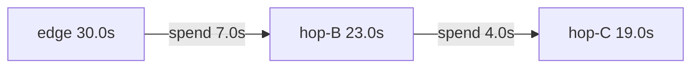

# Timeouts and deadline propagation

**See also:** [circuit breaker](CircuitBreaker.md) · [retry, backoff, and retry budgets](RetryBackoff.md) · [idempotency](Idempotency.md) · [timeouts & delays (DDIA)](../data-intensive-design/timeouts-and-delays.md) · [process pauses](../data-intensive-design/process-pauses.md) · [unreliable networks](../data-intensive-design/unreliable-networks.md) · [catalog research (2026-09-13)](../../docs/research/sysdesign/c7-timeouts-external-research.md) · [first-pass trap table](../../docs/research/sysdesign/timeouts-deadlines-external-research.md)

The breaker decides **whether to call**. Retries decide **whether to try again**. The timeout decides **how long to wait** — and the other two depend on it. A hung call that never returns increments no failure counter, holds a worker forever, and is invisible to every other resilience control. Quality attributes: **availability** of the caller (bounded resource hold), **latency** integrity (the SLO is only as good as the longest timer on the path), and **detectability** (a timeout converts silence into a countable failure). The costs: false timeouts at the latency tail, retry-of-work-that-succeeded (see [idempotency](Idempotency.md)), and a per-phase configuration surface most stacks leave at infinity.

Breaker (C1) and retry (C2) already assume a bound exists. This note owns how that bound is **chosen, split, propagated, and cancelled**.

## Lineage and vocabulary

| Term | Meaning |
|---|---|
| **Timeout** | A *duration*. Restarts if a hop copies it instead of subtracting elapsed time. |
| **Deadline** | A *point in time*. Converted to remaining duration on the wire so clock skew does not extend the budget. |
| **Connect timeout** | Bound on DNS + TCP (+ TLS when the client includes it). |
| **Request / call timeout** | End-to-end bound on one attempt or one logical call. |
| **Idle / between-byte** | Bound on *silence*, not total duration. A trickle defeats it. |
| **Cancellation** | Cooperative stop of in-flight work once the waiter is gone. Distinct from the timer firing. |
| **Hedging** | Send a *duplicate* before the first fails, then cancel losers. XOR retry on the same gRPC method. |

- **Nygard, *Release It!*** ([12](../data-intensive-design/nfr-references.md)) lists Timeouts as the *first* of the twelve Stability Patterns — before Circuit Breaker and Bulkheads — as the answer to *Blocked Threads* and *Slow Responses*. A breaker that never sees a failure because the call never returns is not a breaker.
- **Brooker, *Timeouts, retries, and backoff with jitter*** (Builders' Library): set **both** a connection timeout and a request timeout on every remote call, including same-box IPC. Pick the request timeout from the measured latency distribution at the percentile matching an acceptable **false-timeout rate** — **p99.9** for a 0.1% budget. Pad when p99.9 ≈ p50 (small latency bumps become mass timeouts); pad for off-box clients; homemade timers often miss DNS/TLS. A 20 ms timeout that included connection setup failed only after deploys (new TLS handshake > 20 ms) — fix was pre-establish connections, then raise the timeout for the setup path. Linux `SO_RCVTIMEO` is a poor end-to-end timer. Retries are selfish; five layers × three tries = **243×** ([14](../data-intensive-design/nfr-references.md)).
- **Google SRE book ch. 22**: deadlines exist so a frontend does not hold resources “until the server restarts.” Servers must **check remaining time before each stage**. Propagation: A sets 30 s, spends 7 s, B gets 23 s; B spends 4 s, C gets 19 s. Subtract a few hundred milliseconds for transit; optionally cap outgoing deadlines to non-critical backends. Without it, B invents 20 s to C while A has 2 s left — C does useless work. Worked collapse: 50 QPS of 100 s-deadline blackholes on a 1 000-thread frontend → **5 000** threads → **80.4%** error rate. Pair with LIFO/CoDel so queued requests that will miss are dropped.
- **Azure Architecture Center**: *inappropriate time-outs* — an over-long dependency timeout pins threads before any breaker learns anything. Eskildsen: a 5 s timeout on a 100 ms worker is ~1/50 capacity.
- **gRPC Deadlines (2018)**: a duration restarts at every hop and silently extends the end-to-end budget; a point in time survives any number of hops. APIs split accordingly (Go `context.WithTimeout` wraps `WithDeadline`; C++ `set_deadline`).
- **Dean & Barroso, *The Tail at Scale* (2013)**: hedge after the class’s **p95** (~5% extra load). Bigtable: hedge after 10 ms cut p99.9 of a 1 000-key / 100-server read from **1 800 ms → 74 ms** at **+2%** requests. Cancellation of losers is what keeps the extra work from becoming another overload. Hedging is not a retry — full card is [C2](RetryBackoff.md).

## Five timers that share a name

The single most common misreading of a timeout config:

| Kind | Starts | Fires when | Defeated by | Typical knob |
|---|---|---|---|---|
| **Connect** | Dial | TCP/TLS not up | Blackholed SYN (OS `tcp_syn_retries` ≈ 127 s) | curl 300 s; Go dialer 30 s; OkHttp 10 s; Envoy 5 s |
| **Request / call** | First byte of the attempt | Whole attempt/call exceeds T | Nothing if truly end-to-end | Go `Client.Timeout`; OkHttp `callTimeout` (default **off**); .NET 100 s; Envoy route **15 s** |
| **Idle / stream-idle** | Last byte either direction | Silence ≥ T | A 1-byte trickle | ALB **60 s**; Envoy stream idle **5 min**; NGINX `proxy_read_timeout` **60 s** |
| **Between-byte / read** | Last socket read | No bytes for T | Slow streaming that never goes silent | requests `timeout`; CloudFront *response timeout* **30 s**; undici `bodyTimeout` |
| **Connection lifetime** | Accept / connect | Age ≥ T, even if busy | — | ALB client keepalive **3600 s**; Envoy `max_connection_duration` default **0** |

Brooker's minimum pair is **connect + request**. A connect bound without a request bound leaves a connected-then-stalled server unbounded (Go `ResponseHeaderTimeout` default **0**). A request bound that *includes* connect will false-timeout on cold TLS (the 20 ms deploy). Idle and between-byte timers are the right tool for streams whose total time is legitimately unbounded; they are the **wrong** tool for “this RPC must finish.” CloudFront is the canonical trap: its 30-second “response timeout” is per wait, and the actual total cap (response completion timeout) is **unenforced unless you set it**.

## Remaining-time budgets and `grpc-timeout`

A duration copied hop-to-hop **extends** the end-to-end wait. An absolute deadline converted to remaining time **preserves** it.

- **gRPC wire.** `grpc-timeout` is a request header: ASCII integer of **at most 8 digits** plus one unit `H | M | S | m | u | n` (example `grpc-timeout: 1S`). “If Timeout is omitted a server should assume an infinite timeout.” The value is **relative remaining time**, recomputed at each sender from its local absolute deadline — that is how gRPC avoids clock skew. Propagation of the incoming context onto outbound RPCs is **default-on in Java and Go**, **opt-in in C++**. Client expiry → `DEADLINE_EXCEEDED`. Server-side, the runtime **cancels** the call (`CANCELLED`); the handler must poll `Context` / `IsCancelled()` and stop spawned work — the runtime will not kill application threads.
- **Envoy** (1.40.0-dev): route `timeout` default **15 s**, “includes all retries”, `0` disables; starts only after the **entire** downstream request is received (streaming requests never start this timer — disable it and use `idle_timeout` / `max_stream_duration`). `per_try_timeout` must be **<** the route timeout or it is ignored. Documented leftover: 3 s route, 2.7 s first try → **0.3 s** for backoff + retry. Headers: `x-envoy-upstream-rq-timeout-ms` overrides route/`grpc-timeout`; `x-envoy-upstream-rq-per-try-timeout-ms` is the inner bound; Envoy stamps **`x-envoy-expected-rq-timeout-ms`** on the upstream request so the callee can exit early. `grpc-timeout` is honoured only if `max_grpc_timeout` / `max_stream_duration.grpc_timeout_header_max` is set; `grpc_timeout_header_offset` subtracts Envoy’s own budget so Envoy, not the client, is more likely to fire first. `connect_timeout` default **5 s** (includes upstream TLS).
- **Istio** VirtualService `timeout` default is **disabled** (historically written as Envoy `timeout: 0s`, which also makes `perTryTimeout` inert). That is **not** Envoy’s 15 s. Linkerd: unspecified or 0 = **not enforced**.
- **In-process.** Go `WithTimeout` = `WithDeadline(parent, now+timeout)`; a child can only shorten. **.NET:** `CancelAfter` + `CreateLinkedTokenSource` is the analog; nothing crosses the process boundary unless the app writes a header. `HttpClient.Timeout` (100 s) races a per-request token — shorter wins. DNS “may take up to 15 seconds,” so a Timeout < 15 s can still wait 15 s.

**Hierarchy inequality.** For `A` attempts with per-try `T` and backoffs `bᵢ`: `outer ≥ Σ Tᵢ + Σ bᵢ`. Envoy enforces this by including retries in the route timeout. The .NET **standard resilience handler** inverts it safely: total **30 s** outside retry (3 retries, exponential + jitter, 2 s base) outside attempt **10 s** — worst-case inner exceeds outer, so the **total is the binding budget**. Both designs are coherent; the incoherent one is an inner bound larger than the outer that nobody notices.

Phase decomposition (curl: namelookup → connect → appconnect → starttransfer → total): set **connect** from network physics (requests' rule: slightly above a multiple of 3 s, the TCP retransmission window), **TTFB / headers** from the callee's processing tail, **read / idle** from the longest legitimate silence, **per-try** from Brooker’s percentile, **outer** from the SLO minus the caller’s own work — then **propagate remaining**, never re-mint.

## Cancellation

A timeout that does not cancel leaves the callee working for an answer nobody will read (SRE: “you don’t get credit for late assignments”).

| Layer | Signal | Cooperative? |
|---|---|---|
| gRPC | Client stops; server sees `CANCELLED`; HTTP/2 `RST_STREAM` | Yes, if the handler polls context |
| Envoy | 504 on outer timeout; no retry on that 504 — use per-try to retry slowness | Proxy-side; upstream sees reset |
| Polly v8 | Wraps the incoming token; timeout → `TimeoutRejectedException`; caller cancel is **not** a timeout | **Yes — and it waits for the callback to observe the token** before throwing |
| Resilience4j `TimeLimiter` | Default `timeoutDuration` **1 s**, `cancelRunningFuture` **true** | Cancels the `Future`; does not stop unmanaged threads |
| HTTP/1.1 | Closing the socket | Server may not notice until the next write |
| TCP | `SO_KEEPALIVE` off → silent dead peer for `tcp_retries2` ≈ **13–30 min** | Not an application cancel |

Do **not** count caller cancellation as a breaker failure (Polly excludes `OperationCanceledException`). Do count `DEADLINE_EXCEEDED` / 504 / `TimeoutRejectedException`. Check the remaining budget **before** each expensive stage.

## Hedging vs retry (point C2)

Hedging is a *latency* tool. Retry is a *failure* tool. [C2](RetryBackoff.md) owns jitter, budgets, and the one-layer rule; this note owns the deadline that both must fit, and forbids stacking them on one gRPC method.

| | **Retry** | **Hedging** |
|---|---|---|
| Trigger | A failure (or a per-try timeout classified as failure) | Time elapsed *without* a success |
| Concurrency | Sequential (after backoff) | Parallel; first success wins; losers **cancelled** |
| Extra load | 1 + retries, after the failure | Up to `maxAttempts` in flight *before* any failure |
| Idempotency | Required for unsafe methods | Required — the server may execute twice |
| Deadline | Applies to the whole chain | Same — “once the deadline has passed, the operation fails regardless of in-flight RPCs” |

- **gRPC A6.** A method may have `retryPolicy` **or** `hedgingPolicy`, not both. `maxAttempts` includes the original; client-side cap **5**. Unspecified `hedgingDelay` → all attempts at once. A fatal status cancels siblings; a non-fatal code fires the next hedge immediately. `grpc-retry-pushback-ms` (negative / unparseable = stop). `retryThrottling` gates subsequent hedges at `maxTokens/2`. **Go hedging: “Not yet supported”** on the official guide (2026-09-13).
- **Envoy `HedgePolicy`.** The implemented knob is `hedge_on_per_try_timeout` (default **false**): on per-try expiry, issue a retry **without** resetting the original. Requires a `RetryPolicy` with remaining retries. `initial_requests` / `additional_request_chance` are proto fields tagged `#not-implemented-hide:` (issue #20036) — do not configure them expecting Dean-style fan-out.
- **.NET** `AddStandardHedgingHandler`: total **30 s** → hedge (min 1 / max **10** / delay **2 s**) → per-endpoint limiter + breaker → attempt **10 s**. XOR the standard *retry* handler.

**When to hedge.** Tail latency from *interference* (queueing on one replica), idempotent reads, hedge delay at ~p95 (Dean) or a per-try timeout (Envoy). **When to retry.** Transient 503/`UNAVAILABLE` after a definite failure; you cannot afford 2× in-flight; the method is not idempotent.

## Defaults are not a policy

Connect timeouts mostly have sane defaults; the total/read budget defaults to **infinity almost everywhere**. High-signal rows (verified 2026-09-13):

| Client | Connect | Request / call | The catch |
|---|---|---|---|
| Go `http.Client` | dialer **30 s** | `Timeout` **0 = none** | `ResponseHeaderTimeout` **0**: a server that connects then stalls before headers is unbounded. Server `ReadTimeout`/`WriteTimeout` **0** — Cloudflare: `ListenAndServe` is unfit for the public internet |
| Python `requests` | per-IP if tuple form | **None** | Read timeout = silence, not download time; v4+v6 doubles perceived connect |
| Node `http.request` | — | **none** | The timeout option only *emits* an event: “The request must be destroyed manually.” Server side: 300 s / 60 s headers since v18 |
| axios | — | **0** | No separate connect timeout |
| Java `HttpClient` | unset → empty Optional | **infinite Duration** | “blocks forever” |
| **.NET `HttpClient`** | DNS may take **15 s** | **100 s** | The one mainstream client with a real total default; per-request token races it |
| OkHttp | **10 s** | `callTimeout` **0** | Phase timers on, the only end-to-end one off — spans DNS to last byte, retries included, if you set it |
| curl | **300 s** | `--max-time` **0** | Connect is included in total when both set |
| Resilience4j `TimeLimiter` | — | **1 s** | `cancelRunningFuture` true; far below typical RPC SLOs |
| Polly v8 timeout | — | **30 s** | Cooperative; ignore the token and the timeout is late |
| gRPC | — | **no default deadline** | Hedge `maxAttempts` cap 5; retry XOR hedge |
| PgJDBC / Postgres | connect 10 s | `socketTimeout` **0** / `statement_timeout` **0** | A read from a dead server blocks forever |

| Hop | Connect | Request / route | Idle | Note |
|---|---|---|---|---|
| Envoy 1.40 | **5 s** | route **15 s** (all retries); `0` disables | stream idle **5 min**; HTTP idle **1 h** | Stamps `x-envoy-expected-rq-timeout-ms` |
| Istio VS | (Envoy) | **disabled** unless set | (Envoy HCM) | Stricter of app vs mesh wins |
| Linkerd | — | unspecified / 0 = **off** | `timeout.linkerd.io/response` | Outbound only |
| CloudFront | **10 s × 3** | response **30 s per wait**; completion cap **unenforced** | origin keep-alive **5 s** | GET/HEAD retried on timeout; writes are not |
| ALB | — | (no per-request; slow target → idle) | idle **60 s**; client keepalive **3600 s** | **Target idle must exceed LB idle** or ALB → **502**. No HTTP/2 PING as idle reset |
| NGINX | 60 s (usually ≤ 75 s) | none (whole-response) | read/send **60 s between I/O** | A trickle streams for hours |
| gunicorn | — | worker **30 s** | keepalive **2 s** | Ships the ALB mismatch; its own docs say raise keepalive behind an LB |

Audit rule: grep for bare client constructions and treat every one as infinity until proven otherwise. Line the chain: edge total ≥ inner totals; every keep-alive idle increases inward (client < LB < server). The shortest timer on the path is the real SLO — usually one nobody chose.

## The OS floor

Without application timeouts you inherit the kernel's (Linux `tcp(7)`):

| Situation | Kernel default | Effective wait |
|---|---|---|
| Connect to a blackholed host | `tcp_syn_retries` 6 | ≈ **127 s** |
| Write to a silently dead peer | `tcp_retries2` 15 | ≈ **13–30 min** |
| Idle connection to a dead peer | keepalive 7200 s + 9 × 75 s, only if `SO_KEEPALIVE` is on | ≈ **2 h 11 m**, or never |
| Peer refuses (RST) | — | Immediate `ECONNREFUSED` |

Failure detection is fast only when the network is polite. Timeouts are the insurance for when it is not.

## Where it lives

| Layer | What it bounds | Trade-off |
|---|---|---|
| **In-process library** (Polly, Resilience4j TimeLimiter, Go context, .NET tokens) | Typed cancel; remaining time in-process | Nothing crosses the process boundary unless you write a header |
| **gRPC client** | `grpc-timeout` remaining-time; no default deadline | Automatic in Java/Go; C++ opt-in; handler must poll |
| **Sidecar / mesh** | Envoy 15 s including retries; Istio/Linkerd **off** unless set | Transparent; Envoy stamps expected timeout; Istio 0 s also kills per-try |
| **LB / CDN** | Idle, not RPC deadline (ALB 60 s; CloudFront 30 s per-wait) | The real SLA if shorter than the app; keepalive mismatches → 502 |
| **Gateway** | API Gateway integration 50 ms–29 s (cited via the [retry mesh note](../../docs/research/sysdesign/mesh-proxy-retry-external-research.md)) | Do not assume the edge retries a timeout — and do not stack |

## Observability

A timeout without a class is a 504 you cannot debug.

| Signal | Why |
|---|---|
| Timeout **class** (connect / headers / request / idle / cancelled) per dependency | Rising connect-timeouts mean network; rising TTFB means the callee |
| Timeout rate vs raw error rate | Brooker false-timeout vs real failure |
| Latency histogram with the timeout line drawn | Recalibrate when p99.9 walks |
| Remaining deadline at ingress of each hop | Propagation bugs show up as *increasing* remaining time, or as 0 on hop 1 |
| `DEADLINE_EXCEEDED` vs `CANCELLED` vs 499 vs 504 | Who fired — client, server runtime, or proxy |
| Server work **after** client cancel | Wasted capacity |
| Hedge / retry attempt index vs deadline left | Envoy 0.3 s leftover |

OpenTelemetry carries **trace** context, not `grpc-timeout`. Record remaining-ms and timeout class as span attributes; do not assume a tracer will cancel work. Java-agent OTel can accidentally propagate a gRPC deadline into an executor that was *not* supposed to inherit it — fork the context for work that must outlive the RPC.

## Tuning

| Knob | Too low | Too high | Starting point |
|---|---|---|---|
| Connect | False timeouts on cold TLS (Brooker 20 ms) | SYN-blackhole holds a worker ~127 s | 3–10 s, **split out** of a tight request timer; pre-warm pools |
| Per-attempt request | Retry/hedge storm; healthy tail looks down | Pins the pool; breaker never sees a failure | Brooker percentile of *this hop* (p99.9 for 0.1%); < remaining deadline; < breaker window |
| Outer / total deadline | Truncates retries/hedges (Envoy 2.7 + 0.3) | SRE 100 s-vs-100 ms collapse | SLO minus caller work; `outer ≥ Σ T + Σ b`; propagate remaining |
| Idle / between-byte | Cuts legitimate quiet periods | Never detects a wedged stream | Longest legitimate inter-byte gap + margin; for streams set route/call timeout **0** |
| Hedge delay | Extra load ≈ all requests × (N−1) | Hedge never fires (delay > outer) | ~p95 of that class (Dean); cancel losers |
| Keep-alive idle | Connection churn | 502s from mismatched hops | Client < LB < server, each with headroom |

## Worked calibration — checkout → payment (Brooker method)

Constraints are a **design drill**, not a vendor SLA. Method: Brooker percentile + SRE remaining-time + Dean p95 hedge rule. Complements the [breaker checkout drill](CircuitBreaker.md#worked-calibration--checkout--payment-gateway) and the [C2 order-service drill](RetryBackoff.md#worked-calibration--order-service-3-s-slo).

Measured caller-side latency to `POST /capture` over 14 days, same AZ, warmed connections (so the timer is *request*, not connect):

| Percentile | p50 | p95 | p99 | p99.9 | p99.99 |
|---|---|---|---|---|---|
| Latency | 80 ms | 160 ms | 220 ms | 420 ms | 2.1 s |

False-timeout budget **0.1%** → Brooker start point **p99.9 = 420 ms**. p99.9 / p50 = 5.25 (not “close”), so the tight-bound padding rule does not dominate; still add ~80 ms for a rare TLS-miss / AZ blip → **per-attempt T = 500 ms**.

User-facing checkout budget **3 s**. C2 policy (cited, not redesigned): 2 retries, exponential + full jitter, 200 ms base, cap 1 s. Worst-case sleeps ≈ 200 + 400 = 600 ms. Inequality: `3.0 ≥ 3×0.5 + 0.6` → **2.1 s < 3 s**, slack 0.9 s for gateway overhead. Envoy route timeout **3 s**, `per_try_timeout` **500 ms** (must be < 3 s).

Propagation: edge 3.0 s → API gateway spends 50 ms → checkout 2.95 s → checkout spends 80 ms → payment **2.87 s** remaining (`grpc-timeout` recomputed). Payment → issuer: cap outgoing at **1.0 s** (SRE “upper bound for typically-fast backends” — issuer p99.9 is 300 ms; a 2.87 s inherited deadline would pin issuer threads on a blackhole). Transit trim 20 ms.

Hedging: **not** on `POST /capture` (side effect). On idempotent `GET /capture/{id}` status: hedge delay **160 ms** (p95), `maxAttempts` 2, under a retry throttle. Dean’s 10 ms / 1 800→74 ms number is a Bigtable fan-out benchmark, not this SLO. Connect: Envoy/client **5 s** **separate** from the 500 ms attempt; pre-warm the payment pool on process start.

If the 0.1% line is too expensive (each timeout retries), move to p99.99 only after measuring retry amplification; do not jump to 2.1 s because one plot looked scary — that is the SRE “orders of magnitude vs mean” trap.

## Timeouts around LLM provider APIs

Model endpoints break the usual assumptions: latency is tens of seconds, SDK defaults are **10 minutes** (Anthropic TS scales to 60 min for large non-streaming), and some “failures” arrive as HTTP 200. Two retries × 600 s is a 30-minute hang that an error-count breaker never sees.

| Knob | Choice | Why |
|---|---|---|
| Transport | **Always stream** | Feeds every between-byte timer; makes TTFT observable |
| TTFT (per attempt) | Bound independently | The trip criterion that matters; Resilience4j’s 60 s / 100% slow-call defaults are off for this |
| Inter-token idle | Under CloudFront 30 s / ALB 60 s | Catches mid-stream stalls the total would miss |
| Total deadline | Product answer-time, propagated in a header | Replace the SDK 600 s; `max_retries` at the SDK **or** the gateway, not both |
| CloudFront completion timeout | Set explicitly | Default is unenforced; a stalling-but-trickling origin streams forever |
| Longer jobs | Queue / batch, not a longer timer | Work that outlives the edge budget belongs on an async path with an [idempotency key](Idempotency.md) |

## Testing and operating

- **Fault injection.** Toxiproxy `timeout` (hold then drop) and `latency` toxics; WireMock lognormal delays and `CONNECTION_RESET_BY_PEER`; Istio `fault.delay` / `fault.abort` (the 7 s / 3 s+retry mismatch in [C2](RetryBackoff.md)). Verify each timer fires by phase with curl’s `-w` timing variables.
- **Blackhole vs RST.** A firewall DROP exercises the SYN-retry floor; a closed port exercises fail-fast. Both should end inside your budgets.
- **Deterministic cancel.** Polly v8 `TimeProvider` + `FakeTimeProvider`; assert the handler observed the token, not only that the caller saw `TimeoutRejectedException`.
- **Game day.** Lower a dependency timeout in staging and confirm the alert, the breaker interaction, and the fallback all engage in order. Kill the retry (`max_retries=0`, Envoy `upstream.use_retry`) so you practice the fail-fast path.
- **Audit** for zero defaults on every new client library — the trap table above is the checklist.

## Failure modes

- **Missing timeout → TCP floor.** 13–30 min writes, 127 s connects, 2 h keepalive. Worker pool gone. The first-pass trap table is the usual cause.
- **Present-but-long timeout.** Azure *inappropriate time-outs*; Eskildsen 5 s ≈ 1/50; SRE 100 s × 5% blackholes. The timeout, not the breaker, sets the capacity floor — the breaker only stops *new* entries.
- **Too-short timeout.** Brooker: extra retries, then “all requests start being retried.” Especially when the timer includes connect after a deploy.
- **Duration copied, not remaining.** Last hop still has a full 30 s after the edge expired. C does work A will never read.
- **Race-to-the-shortest.** CloudFront 30 s between-packet vs ALB 60 s idle vs Envoy 15 s vs gunicorn 30 s vs Istio-disabled vs app 3 s. The unnamed min wins.
- **Idle used as a request timeout.** NGINX/CloudFront/requests: a trickle never fires; a quiet-but-healthy stream does.
- **Keepalive mismatch → 502.** ALB documents it; gunicorn `keepalive` 2 s ships the mismatch; CloudFront origin keep-alive 5 s is the same class toward origins.
- **Outer < Σ attempts.** Envoy 2.7 + 0.3; Istio `perTryTimeout` ignored when route timeout is 0. App libraries often start a retry they cannot finish.
- **Timeout without cancel.** Server finishes after `DEADLINE_EXCEEDED`; handler that ignores context.
- **Hedging a non-idempotent call.** Double capture. Envoy hedge is a retry in disguise and inherits retry-on rules. **Hedging + retry on one gRPC method** is forbidden by A6. Envoy `initial_requests` is not implemented.
- **GC / pause / clock.** A 15 s stop-the-world makes a live node look dead — [process pauses](../data-intensive-design/process-pauses.md).
- **LLM 10-minute SDK defaults** retried, dying on ALB 60 s idle unless streamed.
- **Breaker never trips.** Hung calls never increment the counter — C1’s first dependency.

## Alternatives that beat a timeout

| Situation | Prefer | Why |
|---|---|---|
| Long-lived streams / notifications | Idle + `max_stream_duration`; route/call timeout **0** | A total timer kills a healthy stream; an idle timer detects a wedged one |
| Pure tail-latency on idempotent fan-out | **Hedging**, then still keep a deadline | You cut p99.9 without waiting for a failure; cancel losers |
| The callee is overloaded | Don't retry + load shed (**C10**) | A timeout is the backstop, not the shed policy |
| Work *must* finish after the client is gone | Checkpointed catchup (SRE’s explicit exception) | Check the deadline *after* the checkpoint |
| Health probing | Probe interval/timeout (**C3**) | A probe timeout is a liveness guess, not an RPC budget |
| In-process function calls | Don’t | You already share a fate |

**When-not-to-use a *tight* timeout.** p99.9 ≈ p50 without padding; multi-region callers measured against in-AZ histograms; first request on a cold connection; anything whose legitimate work exceeds the percentile (large payloads, reports).

## Trade-offs

| Buy | Pay |
|---|---|
| Bounded resource hold; failures become countable | False timeouts at the tail; the percentile is a choice, not a truth |
| Deadlines compose across hops | Requires plumbing (headers, contexts) the stack won’t do for you outside gRPC Java/Go |
| Idle timers make streams safe | Two timer classes to configure and reason about |
| Brooker p99.9 gives a false-timeout budget | Needs a measured histogram; p99.9 ≈ p50 wants padding or you timeout the fleet |
| Hedging cuts read-path tail latency | Double work; must cancel; XOR retry; useless on non-idempotent writes |
| The breaker and retry get their signal | A timeout on a non-idempotent call needs an idempotency key before it is safe to retry |

The breaker decides **whether to call**. Timeouts decide **how long to wait**. Retries and their budget decide **whether to try again**. Fallbacks decide **what the user gets**. Coordinate all four.

## Sources

Verified 2026-09-13; the full URL list, per-claim provenance, and items deliberately left out are in the [catalog research](../../docs/research/sysdesign/c7-timeouts-external-research.md). The no-default trap table, NGINX/ALB/CloudFront idle-vs-total distinction, and TCP floor are in the [first-pass note](../../docs/research/sysdesign/timeouts-deadlines-external-research.md). Items already cited in this tree are referenced by their number in [nfr-references.md](../data-intensive-design/nfr-references.md).

- Canon: Brooker Builders' Library PDF (timeouts, retries, jitter) [14]; SRE book ch. 22; Dean & Barroso, *The Tail at Scale* (2013); gRPC Deadlines guide and 2018-02-26 blog; gRFC A6; Nygard [12]; Azure Circuit Breaker (*inappropriate time-outs*).
- Clients / libraries: Go net/http and context; JDK 21 `HttpRequest.timeout`; .NET `HttpClient.Timeout` and standard resilience / hedging handlers; OkHttp 5.x; curl `CURLOPT_TIMEOUT` / `CONNECTTIMEOUT`; requests 2.34.2; Resilience4j `TimeLimiterConfig`; Polly v8 timeout; Node 22 / undici / axios; PgJDBC / Postgres `statement_timeout`.
- Proxies / LB / mesh: Envoy 1.40 FAQ, router filter, route proto; Istio VirtualService and request-timeouts task; Linkerd 2.16+ retries-and-timeouts; ALB attributes; CloudFront origin behaviour; NGINX `ngx_http_proxy_module`; gunicorn `keepalive` 2 s; Linux `tcp(7)`.
- Cited forward: [circuit-breaker](../../docs/research/sysdesign/circuit-breaker-external-research.md), [retry](../../docs/research/sysdesign/retry-backoff-external-research.md), [mesh-proxy retry](../../docs/research/sysdesign/mesh-proxy-retry-external-research.md).
