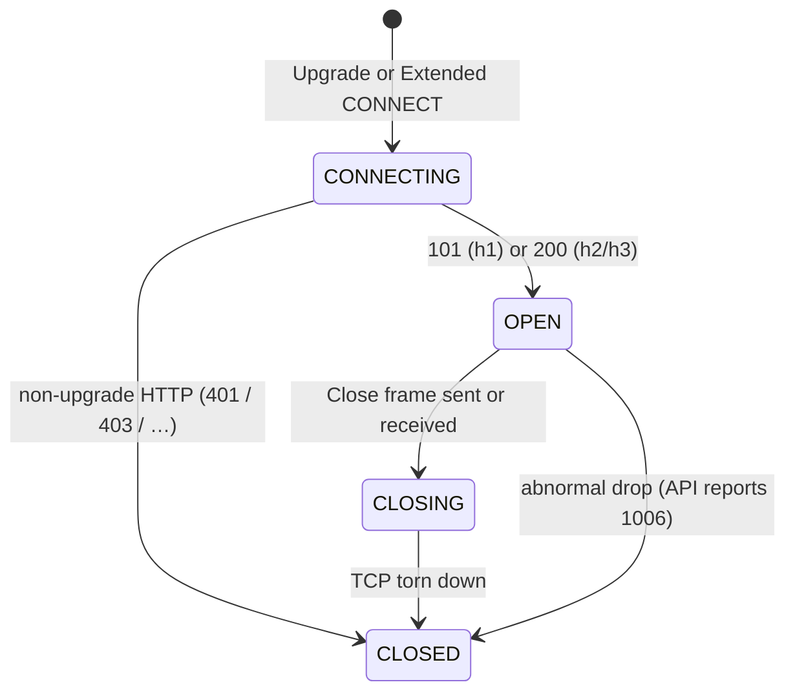

# WebSocket

**See also:** [server-sent events](ServerSentEvents.md) · [load balancing](LoadBalancing.md) · [timeouts](TimeoutsDeadlines.md) · [retry, backoff, and retry budgets](RetryBackoff.md) · [pub/sub & queues](PubSubQueues.md) · [request–response](RequestResponse.md) · [API gateway](ApiGateway.md) · [failover](Failover.md) · [chat design (ch19)](../aws/ch19.md) · [external research note (2026-09-13)](../../docs/research/sysdesign/a3-websocket-external-research.md)

A WebSocket is an **independent TCP protocol** whose only debt to HTTP is the opening handshake: one Upgrade (or HTTP/2–3 Extended CONNECT) becomes a **full-duplex, long-lived** frame channel. Both peers send whenever they like. That buys bidirectional interactivity at per-message cost; it also buys every long-lived-connection problem at once — heartbeats under hop idle timers, reconnect with **no protocol resume**, a broadcast path to sockets that no longer live on one box, and affinity that fights [scale-out](LoadBalancing.md). Quality attributes: **interactivity** and session **latency**. Costs: process state in a fleet designed for stateless requests, and an ecosystem (caches, gateways, CDNs) built for the request–response shape you just left.

## Lineage and vocabulary

- **RFC 6455 (2011)** is the wire protocol. Version 13. Two phases: an HTTP/1.1 Upgrade handshake, then framed data. Client-to-server frames **must** be masked (a fresh 32-bit XOR key — an infrastructure defense against cache-poisoning intermediaries, not confidentiality); servers **must not** mask. Control frames (Close / Ping / Pong) are ≤ **125 bytes**, never fragmented, and may interleave *inside* a fragmented data message — which is why a heartbeat still works during a large transfer. The closing handshake is a Close frame both ways so intermediaries that drop TCP FINs do not silently lose data.
- **RFC 8441 (h2) and RFC 9220 (h3)** forbid connection-wide `Upgrade` / `Connection` and status 101. The server advertises `SETTINGS_ENABLE_CONNECT_PROTOCOL` (value **0x08**, default **0**); the client sends Extended CONNECT with `:protocol = websocket`. Success is HTTP **200**, not 101. `Sec-WebSocket-Key` / `Accept` are **superseded** by `:protocol`. After the handshake the peers run RFC 6455 on that stream; `END_STREAM` / h3 FIN ≅ orderly close; `RST_STREAM` / `H3_REQUEST_CANCELLED` ≅ abort. Every hop on the path must implement Extended CONNECT.
- **WHATWG WebSockets Standard** is the browser API: `readyState` CONNECTING / OPEN / CLOSING / CLOSED, `send`, `close`, events `open` / `message` / `error` / `close`. **Ping and Pong are not exposed.** User agents may send pings for NAT keepalive; they **must not** use them to aid the server. There is **no automatic reconnect** and no `Last-Event-ID` — that header is EventSource ([SSE](ServerSentEvents.md)).
- **IANA close-code registry** adds 1012 Service Restart, 1013 Try Again Later, and 1014 Bad Gateway on top of RFC 6455. Range 4000–4999 is private use.
- **Socket.IO / Engine.IO** is a library *on* WebSocket plus HTTP long-polling. Its heartbeat numbers and Redis adapter are the most-cited operational defaults for “WS at more than one node.” `connectionStateRecovery` (v4.6.0+) is an *application* resume, not an RFC feature.

## Connection lifecycle

**Opening (HTTP/1.1).** `GET` + `Upgrade: websocket` + `Connection: Upgrade` + a random `Sec-WebSocket-Key`. The server proves protocol awareness by concatenating the key with GUID `258EAFA5-E914-47DA-95CA-C5AB0DC85B11`, SHA-1, Base64 → `Sec-WebSocket-Accept` (the RFC example key yields `s3pPLMBiTxaQ9kYGzzhZRbK+xOo=`). Any status other than **101 Switching Protocols** means the handshake failed and HTTP semantics still apply. `Origin` is the browser CSRF check; the server may reject with an HTTP error *before* upgrading. `Sec-WebSocket-Protocol` is the chosen subprotocol (one or none).

**Opening (h2/h3).** Same logical OPEN state, different status. A hop that advertises HTTP/2 but does not handle `:protocol = websocket` fails Chrome / Edge / Firefox 128+ handshakes (ASP.NET Core docs: those browsers have HTTP/2 WebSockets on by default) while an HTTP/1.1 Upgrade client still works. CloudFront **only supports WebSocket over HTTP/1.1**.

**Closing.** Either peer sends Close (optional 2-byte status + UTF-8 reason). The receiver MUST reply with Close if it has not already sent one; then both close TCP (server immediately; client SHOULD wait for the server FIN). Simultaneous Close is legal. After sending Close, no further data frames; after receiving Close, further data is discarded. The browser `close` event carries `wasClean`, `code`, `reason`.

**Frames (once OPEN).** Header: FIN | RSV1–3 | opcode (4) | MASK | 7-bit length (0–125 direct; 126 → 16-bit; 127 → 64-bit) | optional 32-bit masking key | payload. Opcodes: `0x0` continuation, `0x1` text (UTF-8), `0x2` binary, `0x8` Close, `0x9` Ping, `0xA` Pong. A *message* is one or more frames; two data messages may not interleave. A client that sees a masked server frame closes with 1002.

Auth happens at handshake time. AWS API Gateway runs `AuthN` / `AuthZ` only on `$connect`: a failed authorizer returns **401 / 403** and the socket is never established. `$connect` may persist `connectionId` (variable-length; format may change). `$disconnect` runs **after** the socket is already closed and is **best-effort** — do not treat it as a reliable cleanup hook. Backend-initiated close uses the `@connections` management API (POST to send, GET status, DELETE force-disconnect; a gone id raises — your registry learns of deaths lazily). Routes: `$connect`, `$disconnect`, `$default`, plus custom keys from a JSON `routeSelectionExpression` (non-JSON → `$default`). Outbound is a route response or that `@connections` POST. The shape generalizes: the edge owns the socket; you own a connection registry and a push API — statelessness restored at the price of per-message invocation and the 29 s integration ceiling.

### Close codes you will actually see

| Code | On the wire? | Meaning | Reconnect? |
|---|---|---|---|
| **1000** Normal | Yes | Orderly done | Usually no |
| **1001** Going Away | Yes | Deploy, tab close, API Gateway idle / 2 h cap | Yes, jittered |
| **1002 / 1003 / 1007 / 1010** | Yes | Protocol / data / UTF-8 / missing extension | No — unchanged |
| **1008 / 1009 / 1011** | Yes | Policy / message too big / server error | Depends; 1009 means split or shrink |
| **1012** Service Restart | Yes (IANA) | Bounce | Yes, jittered |
| **1013** Try Again Later | Yes (IANA) | Overload | Yes, longer backoff |
| **1014** Bad Gateway | Yes (IANA) | HTTP-502 analogue | Transient path |
| **1005 / 1006 / 1015** | **Never** | 1006 is the *local* report for “TCP died with no Close” — the signature of an idle-timeout kill | 1006: yes |

API Gateway maps idle and max-lifetime to **1001**, oversize to **1009**, binary (unsupported) to **1003**, internal to **1011**, restart to **1012**. Unexpected TCP drop surfaces as **1006**. Some clients miss `onclose` on gateway-initiated idle / 2 h close — detect death via heartbeat timeout, not only the event.

## Heartbeats: under the shortest hop

TCP alone detects a dead idle peer in about two hours; an unacked write can hang minutes ([timeouts](TimeoutsDeadlines.md)). RFC 6455 gives Ping (0x9) / Pong (0xA) and **no interval**. A Pong echoes its Ping's payload; unsolicited Pongs are legal one-way heartbeats. The receiver MAY collapse outstanding Pings to the most recent.

**Browser gap.** JavaScript cannot send a protocol Ping. Server-originated Pings still work if the user agent answers them (it must, at the protocol layer). To probe *from the browser*, send an application data frame and require a data-frame pong. That also resets idle timers that only count bytes, not “TCP is up.”

**Socket.IO / Engine.IO v4** (fetched 2026-09-13): server `pingInterval` **25 000 ms**, `pingTimeout` **20 000 ms** (v4.0.0 raised the timeout from 5 000). No pong → disconnect reason `ping timeout`. The client treats the link dead if it sees no ping within `pingInterval + pingTimeout` (**45 s**). nginx's default `proxy_read_timeout` is **60 s**; Socket.IO requires it **greater than** that sum or the proxy closes first (`transport close`). `perMessageDeflate` default **false** since v3 (CPU / memory). `maxHttpBufferSize` **1e6**. `connectTimeout` **45 000 ms**.

The effective idle is the **minimum** hop that sees no bytes:

| Hop | Idle default | Notes |
|---|---|---|
| nginx `proxy_read_timeout` / `proxy_send_timeout` | **60 s** | Between successive upstream reads, not the whole response. Raise it, **or** have the upstream send Ping frames. `proxy_http_version 1.1` is required; `Upgrade` / `Connection` are hop-by-hop and must be re-injected (`map $http_upgrade $connection_upgrade`). |
| ALB | **60 s** (range 1–4000) | ≥ 1 byte before each idle period. Application idle should be **longer** than the LB idle or the target's ungraceful close yields client **HTTP 502**. HTTP/2 PING frames **do not** reset ALB idle. |
| NLB TCP | **350 s** (60–6000) | TLS listeners: **350 s, not configurable**. If TCP idle is set **above 350 s**, the target ENI `TcpEstablishedTimeout` must be ≥ the NLB value; Nitro V6+ default is **350 s** — mismatch → the ENI silently drops state while NLB still thinks the flow is alive. |
| API Gateway WebSocket | **10 min** idle / **2 h** max | Neither increasable. Heartbeats defer idle; **nothing** defers the 2 h cap. Close **1001**. |
| CloudFront | **10 min** | Bytes **origin → client** in the quota text. HTTP/1.1 only. Forward all viewer headers, or at least `Sec-WebSocket-Key` and `Sec-WebSocket-Version`. |
| HAProxy `timeout tunnel` | no implicit default | After 101 the connection is a tunnel; `timeout tunnel` supersedes client/server idle (documented example: **1 h** with client/server 30 s). If unset, those idle timers apply. |
| Cloudflare (proxied) | unpublished | WAF inspects the **initial 101 only**. Argo is incompatible. Edge code releases **terminate** sockets. |

A 25 s Socket.IO ping clears nginx 60 s and ALB 60 s; it does **not** extend API Gateway's 2 h lifetime. Protocol Pings reset hops that parse WebSocket frames; some L7 devices only reset on application data — verify the hop. Cost scales with fleet size: 25 s pings across a million sockets is 40 thousand frames per second of pure liveness.

## Scaling: hold connections, then find them

A socket is one long-lived TCP (or one h2/h3 stream) **plus** server process state (subscriptions, presence). Horizontal scale is two distinct problems.

**1. Accept and hold.** First ceilings are OS file descriptors, per-connection buffers, and TLS session memory — not request rate. No vendor-neutral “N connections per box” is asserted here; the chat-architecture numbers live in [ch19](../aws/ch19.md). API Gateway does **not** quota concurrent connections; the implied ceiling is `new connections per second × 2 h`. Default **500** new connections/s/account/Region (increasable) × 7 200 s = **3 600 000** if clients connect at the cap for two hours (AWS's arithmetic example, not a guarantee). Frame **32 KB**, message **128 KB** (split above 32 KB; oversize → **1009**). Integration timeout **50 ms–29 s** (not increasable) is the *backend invocation* window, not the socket lifetime.

**2. Fan-out.** After upgrade, a message for user B must reach the process that owns B's socket:

| Shape | What it buys | What it costs |
|---|---|---|
| **Sticky + in-process map** | Cheap local broadcast | Dies with the instance; [failover](Failover.md) is “client reconnects” |
| **Registry** (user → `{node, connectionId}`) | Directed send | Stale ids; `$disconnect` miss → TTL the row; the [ch19](../aws/ch19.md) chat shape |
| **Pub/sub backplane** | Publisher does not know subscribers | At-most-once; a down subscriber misses forever |

Redis `PUBLISH` is **O(N+M)** (N = channel subscribers, M = pattern subscriptions) and **at-most-once**. In Redis Cluster, classic `PUBLISH` is forwarded across nodes; Redis **7.0** sharded pub/sub (`SPUBLISH` / `SSUBSCRIBE`) keeps propagation inside the owning shard. Socket.IO's Redis adapter: each node publishes the packet; every other node broadcasts to *its local* sockets. **Three Redis subscriptions per namespace** (broadcast, request, response). Default channel prefix `socket.io`; `requestsTimeout` **5 000 ms**. Durable fan-out is a [log or queue](PubSubQueues.md), not this channel.

**Autoscaling does not rebalance live sockets.** New targets take *new* handshakes. Existing connections stay on the target that returned 101. ALB deregistration delay default **300 s** (0–3600); after it elapses the target may be terminated and the ALB **closes the client side** — it does not fail the socket over to another target. Age connections out: server-initiated 1001 / 1012 on a jittered schedule, clients reconnecting with jittered backoff ([retries](RetryBackoff.md)). Managed platforms do this whether you like it or not (API Gateway closes every socket at 2 hours).

## Sticky sessions (C5)

Stickiness is a [load-balancing](LoadBalancing.md) technique. WebSocket needs a narrower distinction than “always pin.”

- **The live socket is already pinned.** After 101 the client-to-LB and LB-to-target TCP connections are a tunnel. AWS ALB: “WebSocket connections are inherently sticky. … the target that returns an HTTP 101 … is the target used … After the WebSockets upgrade is complete, cookie-based stickiness is not used.” AWS Prescriptive Guidance: if the workload *is* WebSockets, there is no need to use a stickiness *strategy* **for the live socket**. That is L4 connection affinity, not an `lb_cookie`.
- **Cookie stickiness still matters for reconnects** and for any HTTP handshake that must return to in-memory session state. ALB `stickiness.enabled` default **false**; `lb_cookie` / `app_cookie`; cookie duration default **86 400 s**, max **604 800 s**. A reconnect is a **new** handshake (new `Sec-WebSocket-Key`, new API Gateway `connectionId`) and lands randomly unless you pin it or keep session state off-box.
- **Socket.IO:** the Redis adapter **does not** remove the need for sticky sessions when HTTP long-polling is enabled — polling is many sequential HTTP requests that must hit the same Engine.IO session. **WebSocket-only** (`transports: ["websocket"]`) makes stickiness unnecessary for the *live* connection because there is a single TCP session. Enable polling without affinity → Engine.IO session errors.
- **Cloudflare** load-balanced origins need session affinity so a reconnect does not land on a node without the session. WS is **not** supported on ALB target groups with target optimizer enabled.

The C5 failure mode that bites here is **sticky skew**: scale-out adds pods that affinity never routes to; the survivors keep the herd ([the pinning problem](LoadBalancing.md)). Prefer shared session / backplane state and a short cookie TTL over pinning as a substitute for a registry.

ALB vs NLB vs API Gateway, timeouts only (product choice stays in [ch19](../aws/ch19.md)): API Gateway gives managed routes, `$connect` auth, and `@connections` callbacks, with a hard **10 min / 2 h**, a 29 s integration, and no binary. ALB gives L7 routing, WAF, native 101, idle up to **4000 s**, inherent per-socket stickiness, and you run the WS process. NLB is L4 — idle up to **6000 s** (TCP), TLS idle stuck at **350 s**, no HTTP routing. CloudFront in front of any of them adds a **10 min** origin→client idle and **forces HTTP/1.1**.

## Observability

A quiet socket looks healthy until a hop kills it. Emit at least:

| Signal | What it tells you |
|---|---|
| **Open / close rate by close code** | 1001 on a schedule is drain or the 2 h cap; a 1006 spike is an idle-timer mismatch; 1009 is a size bug. |
| **Heartbeat timeout rate** | Silent half-open: the peer still thought OPEN. |
| **Connection age histogram** | Post-deploy pinning — an old-age spike on survivors, empty new pods ([C5](LoadBalancing.md)). |
| **Handshake failures** (non-101 / non-200, 401 / 403) | Auth and Upgrade-stripping, not application traffic. |
| **Backplane publish / fan-out lag** | Redis `PUBLISH` becoming the tier-one dependency it is; at-most-once gaps show up here. |
| **Registry stale-id rate** (`GoneException` / push-to-dead) | `$disconnect` miss; TTL is late. |
| **Reconnect burst** | Dogpile after deploys, 2 h caps, or edge restarts — check jitter, not just capacity. |

Alert shapes: *1006 rate above baseline* (heartbeat > shortest hop idle) and *reconnects ≫ expected closes* (clients retrying 1002 / 1003 / 1010 unchanged, or a missing jitter). Log `wasClean`, code, and reason on every `close`.

## Tuning

| Knob | Too low / off | Too high / on | Starting point |
|---|---|---|---|
| Heartbeat interval | Hop idle wins (1006 at 60 s) | Liveness tax (40 k frames/s at 25 s × 1 M) | 20–30 s, **under** the shortest hop |
| `pingTimeout` / detect window | False death on slow pongs | Zombies linger | Socket.IO 20 s; client dead at interval + timeout |
| Proxy / ALB idle | Must heartbeat faster than you can afford | Zombie FDs if the app never speaks | Leave 60 s; make the app speak |
| API Gateway vs ALB / NLB | 10 min / 2 h / 128 KB / no binary surprise you | You run the process and the drain | API Gateway when the callback pattern fits; ALB when you need long sessions or binary |
| Stickiness cookie TTL | Reconnect misses in-memory session | Scale-out does nothing | Off for WS-only + shared state; as short as the session store allows otherwise |
| Deregistration delay | Hard-cut live sockets | Capacity stuck on draining nodes | ALB 300 s, or ≥ typical session, plus 1001 / 1012 age-out |
| Backplane | In-process map dies with the box | Redis at-most-once treated as durable | Adapter + persist-then-push if a miss is a product bug |
| `perMessageDeflate` | Larger frames | Per-connection zlib memory | Leave **false** (Socket.IO v3+) unless measured |

## Reconnect: no Last-Event-ID

RFC 6455 has no resume token. CloudFront: if the connection is disconnected, client applications are expected to re-initiate. WHATWG: implement reconnect in `onclose`; the new object is a new handshake.

**Contrast with [SSE](ServerSentEvents.md).** EventSource on reconnect sends `Last-Event-ID` automatically. WebSocket `message` events do not (`MessageEvent.lastEventId` is empty). Resume is **application-level**: monotonic event IDs in payloads, a replay request after `onopen` (`{type:"replay", afterEventId}`), or a library feature such as Socket.IO `connectionStateRecovery` (in-memory backup for a bounded `maxDisconnectionDuration`; example **120 000 ms**; the option itself defaults **off**). Missed messages during the gap are gone unless the app persisted them — the offline store in [ch19](../aws/ch19.md), or a [queue](PubSubQueues.md).

**Dogpile.** A coordinated 2 h API Gateway lifetime, a fleet bounce, or a Cloudflare edge restart closes thousands of sockets at once. The protocol has no jitter. Jitter the retry ([C2](RetryBackoff.md)); the IANA registration mail for 1012 hints at a randomized **5–30 s** if the client chooses to reconnect — a registered hint, not an RFC 6455 MUST. First-attempt traffic should still pass; do not pause *all* connects behind a shared [breaker](CircuitBreaker.md).

## WebSocket vs SSE (A4)

| | **WebSocket** | **SSE** |
|---|---|---|
| Direction | Two-way frames | Server → client only |
| Transport | Own protocol after Upgrade; h2/h3 need RFC 8441 / 9220 | Plain HTTP on h1/h2/h3 unchanged |
| Reconnect + resume | None in protocol; you write it | **Built in**: auto-retry + `Last-Event-ID` |
| Idle / hop tax | Heartbeat under the shortest timer; Upgrade stripped = no handshake | Buffering + between-byte timers; both fixable |
| Binary | Native (not on API Gateway WS — **1003**) | UTF-8 only |
| Scale shape | Per-connection state + backplane or registry | Ordinary HTTP request; no socket inventory |

Rule: both directions need low-latency frames on an already-open session (typing + send, collaborative editing, multiplayer, device telemetry with commands) → WebSocket. One-way feed (notifications, logs, progress, LLM tokens) → [SSE](ServerSentEvents.md). Request–response, cacheable CRUD → [REST or gRPC](RequestResponse.md). Server-to-server callbacks → [webhooks](Webhooks.md). Fan-out that must be durable → a [log](PubSubQueues.md) with sockets as subscribers, not Redis `PUBLISH` alone.

**When not WebSocket.** You cannot control idle hops and cannot ship a heartbeat shorter than the smallest one. You need CloudFront **and** HTTP/2 multiplexing for the same socket (CloudFront WS is HTTP/1.1 only). You need binary through API Gateway WS. Auth must be re-checked per message without app work (API Gateway authorizes only at `$connect`).

## Worked calibration — collaborative editor behind ALB + nginx

Constraints from the research (not a vendor SLA): bidirectional cursors and ops, sessions that last tens of minutes, rolling deploys, a Redis backplane already in the fleet.

| Knob | Choice | Why |
|---|---|---|
| Transport | WebSocket-only (no Engine.IO polling) | Drops the cookie-stickiness requirement for the live socket; reconnects may land anywhere |
| Heartbeat | Socket.IO 25 s / 20 s (or an app data ping at ~20 s from both ends) | Under nginx 60 s and ALB 60 s; detection ≈ 45 s |
| nginx | Re-inject Upgrade; `proxy_read_timeout` > 45 s | Default 60 s is enough *if* the server speaks; a quiet client alone does not keep the upstream timer alive |
| ALB idle | Leave 60 s; do not rely on HTTP/2 PING | Application heartbeat is the reset; 502 means the target closed ungracefully |
| Fan-out | Redis adapter (or sharded pub/sub on Redis 7) + persist ops to a log | `PUBLISH` is at-most-once; missed ops during a node blip replay from the log on `onopen` |
| Session state | Off-box (document in Redis / DB), not the socket process | Reconnect is a new `connectionId`; in-memory maps are the “logged in on the other box” bug |
| Drain | ALB deregistration **300 s** or ≥ typical session; plus server 1001 / 1012 with jitter | ALB will not migrate the live socket; adding pods does not move the herd |
| Reconnect | Jittered backoff; replay `afterEventId`; do not trip a shared breaker on first-connect | Deploy and 2 h-style mass closes are the dogpile |

If the same product only needed presence ticks and document *followers* (no client→server frames on the stream), [SSE](ServerSentEvents.md) would buy resume and drop the backplane. Product choice among API Gateway vs ALB vs NLB vs IoT Core stays in [ch19 Table 19-1](../aws/ch19.md) — this card owns the timeout and affinity numbers that table points at.

## Failure modes

- **Silent half-open.** NAT or a proxy drops the flow; the peer still thinks OPEN until the next write or a heartbeat timeout. Browser `onclose` may not fire.
- **Idle-timeout mismatch.** App heartbeat > proxy idle → 1006 at 60 s (nginx / ALB) or 1001 at 10 min (API Gateway / CloudFront). Inverse: idle raised to hours without app heartbeats → zombie FDs.
- **Reconnect storm.** Synchronized 2 h lifetime, deploy drain, or Cloudflare edge restart. No protocol-level jitter.
- **Lost fan-out.** Redis pub/sub at-most-once; a node that blips misses broadcasts. In-memory maps die with the instance; ALB will not move the socket.
- **Sticky vs backplane confusion.** Redis adapter + polling without affinity → Engine.IO session errors. WS-only + in-memory state + random reconnect → “logged in on the other box.”
- **HTTP/2 downgrade.** Hop advertises h2 without RFC 8441 → Chrome / Firefox CONNECT fails; an HTTP/1.1 Upgrade client still works.
- **Hop-by-hop Upgrade stripped** → handshake never completes (400 or silent drop).
- **`$disconnect` miss** → stale `connectionId`; `@connections` POST fails; TTL the registry row.
- **Message-size / binary close.** API Gateway 32 KB frame / 128 KB message → 1009; binary → 1003.
- **Half-open drain.** Deregistration delay < in-flight WS lifetime → hard cut; delay ≫ deploy SLO → capacity stuck on draining nodes.
- **NLB > 350 s vs ENI 350 s** → black-hole (LB holds, target already forgot).
- **Request–response tunneled through the socket.** Reinventing status codes, correlation ids, [timeouts](TimeoutsDeadlines.md), and [retries](RetryBackoff.md) inside a schema invisible to every proxy, cache, and tracing tool — while paying heartbeat and backplane tax. Keep the transactional surface on [HTTP](RequestResponse.md).

## Trade-offs

| Buy | Pay |
|---|---|
| True bidirectional push, minimal per-message overhead | Long-lived state in a stateless-by-design fleet |
| One handshake, then frames | Heartbeats, reconnect, resubscribe — all yours; no protocol resume |
| Native binary, subprotocols | Browser API: no ping, no headers, no auto-reconnect |
| Managed offerings restore statelessness (API Gateway `$connect` / `@connections`) | Their quotas (10 min / 2 h / 32 KB / 128 KB / no binary) become your protocol |
| Inherent L4 pin of the live socket | Scale-out and deploys do not move the herd; cookie stickiness is a reconnect problem (C5) |

The socket decides **whether both sides can speak on an open session**. [SSE](ServerSentEvents.md) decides **one-way push with resume**. A [queue](PubSubQueues.md) decides **whether a missed event survives an absent consumer**. [Load balancing](LoadBalancing.md) decides **where a new handshake lands** — not where an already-upgraded tunnel goes.

## Sources

Verified 2026-09-13; the full URL list, per-claim provenance, and the items deliberately left out (Cloudflare idle seconds, whether API Gateway counts RFC 6455 Ping as activity, whether ALB HTTP keepalive caps an upgraded socket, per-host connection counts) are in the [external research note](../../docs/research/sysdesign/a3-websocket-external-research.md). Chat product choice is [ch19](../aws/ch19.md), linked not rewritten.

- Protocol: RFC 6455; RFC 8441; RFC 9220; IANA WebSocket Close Code Number Registry; WHATWG WebSockets Standard; WHATWG server-sent-events (`Last-Event-ID`); MDN `CloseEvent.code`; ASP.NET Core WebSockets (HTTP/2 browser defaults).
- AWS (fetched 2026-09-13): API Gateway WebSocket quotas, overview, and `$connect` / `$disconnect` routes; ALB listener, attributes, target-group stickiness, and Prescriptive Guidance on stickiness options; NLB idle-timeout and TLS 350 s; CloudFront WebSocket page and quotas; AWS re:Post on idle close and ALB WebSocket behaviour.
- Proxies and backplane: nginx websocket + `proxy_read_timeout` 60 s; HAProxy 3.4 `timeout tunnel`; Cloudflare Network WebSockets; Socket.IO v4 server-options, how-it-works, using-multiple-nodes, and Redis adapter; Redis `PUBLISH` / pub/sub and Redis 7 sharded pub/sub.
- Cross-cards: hop idle and deadline policy in [timeouts](TimeoutsDeadlines.md); affinity algorithms and pinning in [load balancing](LoadBalancing.md); one-way resume in [SSE](ServerSentEvents.md); reconnect jitter and budgets in [retry](RetryBackoff.md).
