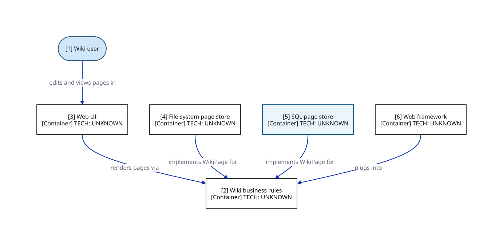

# Ch.17 Boundaries - plugin architecture (illustrative wiki system)

> An illustrative wiki system (FitNesse-style) partitioned into a core and plugins. The core business rules OWN the WikiPage interface; every plugin (the UI, the page stores, the web framework) IMPLEMENTS that interface and DEPENDS ON the core. Every arrow points TOWARD the core - the core has zero outgoing dependencies. This is the asymmetric plugin relationship: a plugin cannot break the core, the core can swap any plugin at will. The boundary is drawn across the inheritance arrows just below the core's interface - the same boundary that let FitNesse defer the database decision for 18 months and ultimately abandon it.

**Locator:** this view opens `WIKI` from `01-context`. It is a **completeness reference** at this grain.

## Node explainer (numbered — matches the `[n]` on the canvas)

| # | Node | Detail the short label hides |
|---|------|------------------------------|
| 1 | USER | edits and views wiki pages |
| 2 | CORE | the core - the 'host' OWNS the WikiPage interface (save / load) highest-level policy - most protected zero outgoing dependencies - immune to any plugin change |
| 3 | UI | plugin - depends on the core could be swapped for a console or client-server UI without touching the core |
| 4 | FSDB | plugin - implements WikiPage persists pages to flat files the choice FitNesse eventually kept |
| 5 | SQLDB | plugin - implements WikiPage an alternative a customer once plugged in for a SQL database swappable - the core does not know it exists |
| 6 | FWK | plugin - depends on the core's plugin points a detail the core is protected from (Ch.32 territory) |

## Not shown for brevity

- **In-memory page store** — a third WikiPage implementation used during early development; omitted here - it is the same plugin shape as the file and SQL stores

## Key

- stadium/pill = a person or role (actor)
- rectangle = an application or data store (C4 container)
- module-c colour = the same module tracked by colour across every view
- solid arrow = synchronous call
- `[Type]` under a name = the element's C4 type (container/component)

> **Export caveat:** if this diagram's SVG is used detached from this page (e.g. a slide), re-inline its honesty tags onto the affected nodes — off-canvas tags do not travel with a bare SVG.

