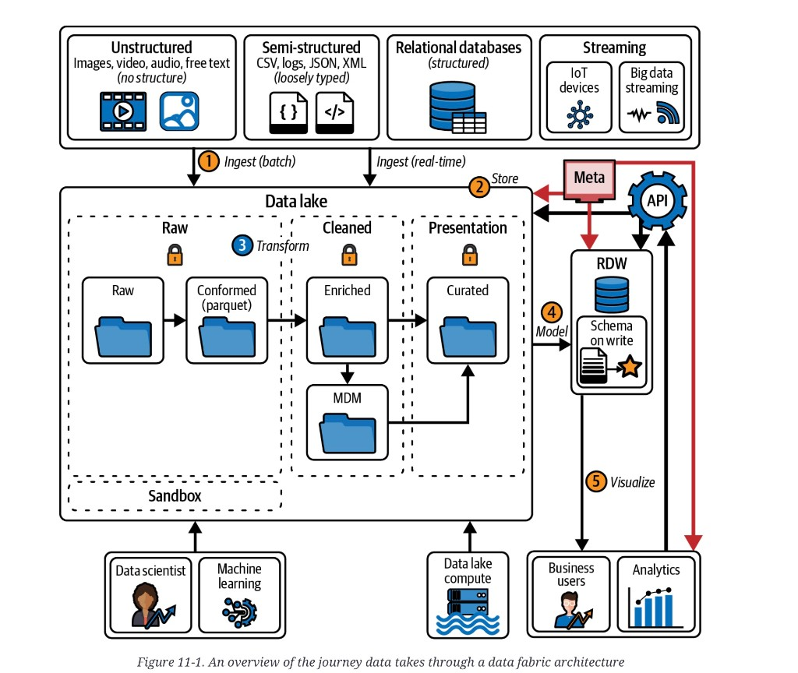

# Data fabric

A **data fabric** is an evolution of the
[modern data warehouse](mdw-overview.md): the same lake-plus-RDW
path, plus a layer meant to make data accessible, secure,
discoverable, and available across the company — and sometimes
outside it. The philosophy is that the fabric consumes data
regardless of size, speed, or type. The strongest version of that
claim is that it can consume *any* data the organization holds.

The word is not a standard. Some people use it as a synonym for
MDW. The source’s working rule is more concrete: **at least three
of eight extras** on top of the MDW, or — if you add none — you
still call it a fabric because you are following the philosophy.
There is no bright line. That ambiguity is the point of the
chapter, not a defect in the notes.

## Two definitions

The source’s definition is architectural and present-tense: an
advanced layer *on* the MDW, built from technologies that exist
today.

Gartner starts nearby — “an integrated layer (fabric) of data and
connecting processes” that uses continuous analytics over
discoverable and inferenced metadata, across hybrid and
multi-cloud — then diverges. In that view,
[data virtualization](data-fabric-components.md#data-virtualization)
is a major piece because it reduces the need to move or copy
data. The “intelligent” fabric then adds knowledge graphs and
AI/ML to auto-discover metadata, find relationships, and
orchestrate integration.

The source’s judgment: much of that stack does not exist yet, and
no shipped fabric satisfies the Gartner definition. Design what
you can buy now. Do not staff a program on inferred metadata that
no product actually produces.

## When it shows up

Fabric is the source’s default for **new cloud work**, especially
estates **over about 10 TB**. That is the other side of the MDW
rule of thumb: under ~10 TB stay on the hybrid; above it, teams
usually “upgrade” the MDW by adding extras — most often
[real-time processing](data-fabric-components.md#real-time-processing),
[data access policies](data-fabric-components.md#data-access-policies),
and a metadata catalog.

Adding three of the eight does not magically change the store.
The five hops stay the same:
[ingest → store → transform → model → visualize](mdw-data-journey.md).
The fabric is extra mechanism on that path, not a different
journey.

*Figure 11-1. An overview of the journey data takes through a data fabric architecture.* Same five hops as [Figure 10-2](mdw-data-journey.md). What the plate adds: a fourth source column (**Streaming** — IoT and big-data streams) with its own **Ingest (real-time)** arrow beside **(1) Ingest (batch)**; orange **locks** on Raw, Cleaned, and Presentation; an **MDM** folder in Cleaned (Enriched → MDM → Curated); a **Meta** box whose **(2) Store** arrows reach the lake, the RDW, and analytics; an **API** gear on the RDW serving path. Virtualization, services, and products are not drawn. Data scientists / ML stay on the lake and sandbox; business users and analytics still leave through **(5) Visualize**.

## Eight extras

| Extra | Role | Concept |
|---|---|---|
| Data access policies | Who may see what, how, and when | [Components](data-fabric-components.md#data-access-policies) |
| Metadata catalog | Discoverability. Dump has no section; the plate’s **Meta** box. | [Components](data-fabric-components.md#metadata-catalog) |
| Master data management | One authoritative record for key entities | [Components](data-fabric-components.md#master-data-management) |
| Data virtualization | Logical access without a copy. Optional. | [Components](data-fabric-components.md#data-virtualization) |
| Real-time processing | Results as the data arrives | [Components](data-fabric-components.md#real-time-processing) |
| APIs | Location-hiding, policy-enforcing access | [Components](data-fabric-components.md#apis) |
| Services | Reusable ingest/clean blocks | [Components](data-fabric-components.md#services) |
| Products | The whole fabric sold, often by industry | [Components](data-fabric-components.md#products) |

## Topic map

| Topic | The question | Concept |
|---|---|---|
| Extras | What do you actually add to an MDW? | [Eight extras](data-fabric-components.md) |
| Trade-offs | Why leave the MDW, and when not to | [Fabric trade-offs](data-fabric-tradeoffs.md) |
| Journey underneath | Same five hops; what can skip | [MDW data journey](mdw-data-journey.md) |

## Chapter figures

Plates live under [`figures/`](figures/). Open the Concept, not the JPEG.

| Figure | Concept |
|---|---|
| 11-1 fabric journey (MDW hops plus extras) | this file |
| 10-2 MDW journey (the hops underneath) | [Data journey](mdw-data-journey.md) |

The source dump had no bibliography. Earlier warehouse, lake, and
privacy citations live in [trade-off references](references.md)
and [law and society](law-and-society.md). Source Chapters 6
(MDM, virtualization) and 9 (real-time) are not filed here.

## Summary

A fabric is an MDW plus extras — or an MDW that you refuse to
call an MDW because the philosophy is “all data, all consumers.”
Gartner’s intelligent fabric is a research direction, not a
shipping architecture. The useful design question is which three
of the eight you are actually buying.

**Architect takeaway:** do not rename the warehouse. Name the
three extras. If they are policies, a catalog, and a real-time
path, you have a fabric in the source’s sense. If they are a
knowledge graph and inferred metadata you cannot operate, you
have a slide.
