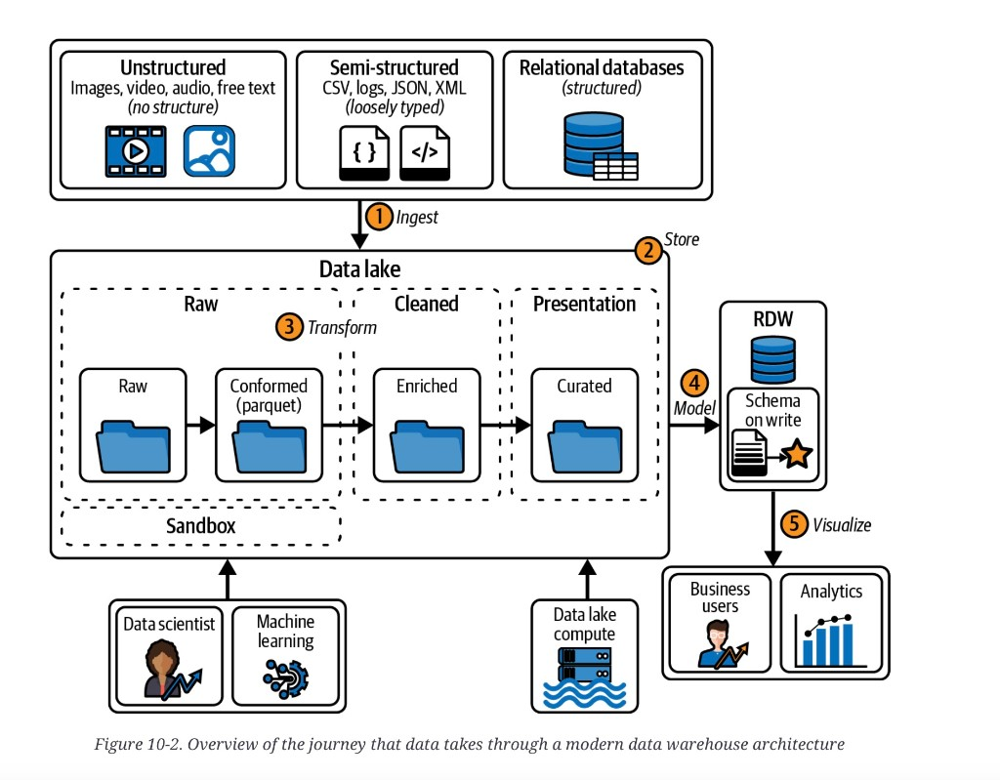

# MDW data journey

**See also:** [chapter overview](mdw-overview.md) · [OLTP vs OLAP](operational-vs-analytical.md) · [cloud native](cloud-vs-self-hosting.md#cloud-native-system-architecture) · [columnar storage](columnar-analytics-storage.md) · [stars and snowflakes](star-snowflake-analytics.md) · [event-driven dataflow](event-driven-dataflow.md) · [data fabric journey](data-fabric-overview.md) · [Medallion](medallion-overview.md) · [Fabric foundation](medallion-foundation-overview.md)

Data through an MDW is usually drawn as five stages. The interesting
design is which hops a given dataset is allowed to skip.

*Figure 10-2. Overview of the journey that data takes through a modern data warehouse architecture.* Ingest three source shapes into the lake. Store, then transform across Raw → Cleaned → Presentation. Model copies **Curated** into the RDW (schema-on-write, star). Visualize serves business users and analytics. Data scientists / ML sit on the **sandbox**; compute is attached to the lake, not baked into it. [Figure 11-1](data-fabric-overview.md) keeps these hops and adds a streaming source column, zone locks, an MDM folder, a Meta box, and an API gear.

## 1. Ingestion

Sources are on-prem or cloud; batch or stream; small files or large.
Figure 10-2 names three shapes: **unstructured** (images, video, audio,
free text), **semi-structured** (CSV, logs, JSON, XML), and
**relational**. Variety is the hard part, not a single protocol.

Cadence is an old warehouse question: full extract vs incremental,
and how often
([warehousing / ETL](operational-vs-analytical.md#data-warehousing)).
The new constraint is the pipe into the cloud lake. A fat daily file
on a thin link is worse than several smaller loads. Some providers
sell more egress/ingress; that is a capacity decision, not a
modeling one.

## 2. Storage

Almost everything lands in a lake. Cloud object stores are treated
as unbounded, cheap, and as carrying HA, DR, and encryption as
table stakes. Users reach it from anywhere they are allowed.

Figure 10-2’s lake zones (folder names on the plate):

| Zone | Folders on the plate | Role |
|---|---|---|
| Raw | Raw → Conformed (Parquet) | As landed, then typed. Replay and audit. |
| Cleaned | Enriched | Joins and business rules. |
| Presentation | Curated | Shapes meant to be read — and the hop that can copy to the RDW. |
| Sandbox | (separate strip) | Experiments. Data scientists and ML land here so they do not write the serving path. |

House-style names vary; keep the three zones plus sandbox if you
rename the folders. Data scientists also pull from raw, cleaned,
curated, or the RDW — whichever matches the question. A
[Medallion](medallion-overview.md) names the same refinement
Bronze / Silver / Gold (plus a landing hop before Bronze). Do
not treat the names as a 1:1: Raw ≈ Bronze, Cleaned ≈ Silver,
Presentation / Curated ≈ Gold — until you have checked whether
Silver already historized or Gold already left the lake.

## 3. Transformation

The architectural move is
[storage/compute disaggregation](cloud-vs-self-hosting.md#cloud-native-system-architecture).
The lake holds bytes. Compute is a tool you attach (the plate’s
“data lake compute”): read mixed formats, write Conformed Parquet,
then push Raw → Cleaned (Enriched) → Presentation (Curated). You
can change the engine without moving the files.

That is also why the lake is more than a dump: it is where ELT and
batch/stream refine happen with as much compute as the job needs.

## 4. Data modeling

Reporting straight off lake files is often slow, hard to secure, and
confusing for the people who will actually build the dashboard. The
MDW answer is to **copy some or all** of the presentation
(**Curated**) layer into an RDW and give it a relational model —
commonly [third normal form](relational-vs-document.md), then a
[star](star-snowflake-analytics.md) (the plate’s “schema on write”
icon). That hop is what makes the architecture an MDW rather than
a lakehouse.

## 5. Visualization

Once the RDW has a usable model, the plate’s two consumers —
**business users** and **analytics** — get reports and dashboards.
That is the self-service surface; the
[trade-off](mdw-tradeoffs.md) is up-front modeling work so IT is
not in every ticket.

## Allowed skips

**Skip the RDW.** Newer lake-query engines make it reasonable to
leave some presentation-layer data in the lake. Visualization then
has two stores. The copy is no longer “everything,” only what
serving, security, or concurrency still require.

**Skip the lake.** New cloud projects, especially with already-
relational sources, sometimes load source → RDW. Reference /
dimension tables that are full extracts, already clean, and cheap
to re-pull are the usual candidates. On-prem migrations often keep
existing warehouse-to-warehouse ETL and only retarget the
destination, then move packages to the lake later — starting with
the slow ones.

Bypassing the lake drops its benefits on that dataset:

- no lake-side backup if the ETL package must rerun
- cleansing lands on the RDW (load and contention)
- the lake is no longer a complete source of truth for people who
  live there

**Architect takeaway:** draw the five hops, then mark each dataset
with the hops it actually takes. A skip is a decision, not a
shortcut you forgot to document. The lake-skip is the one that
quietly turns the RDW back into the place that both cleans and
serves.
