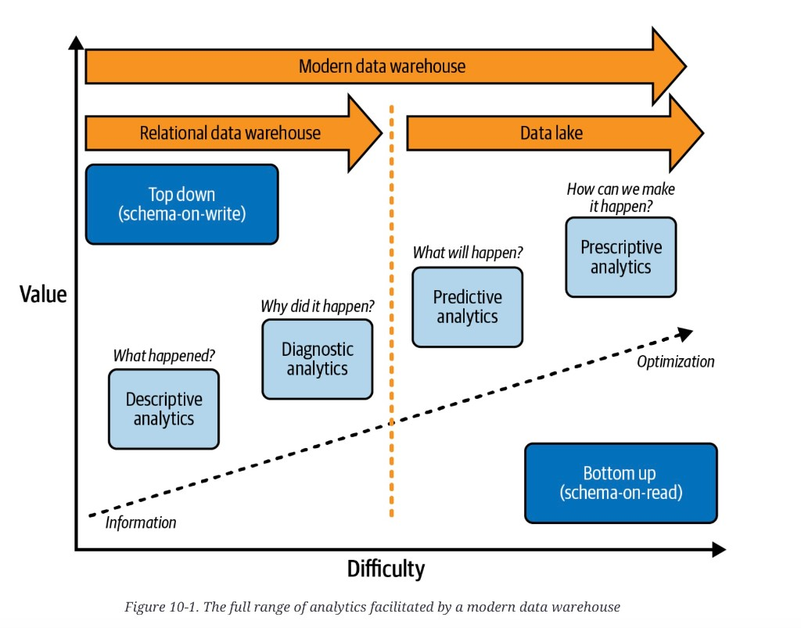

# The modern data warehouse

A **relational data warehouse (RDW)** is
[schema-on-write](relational-vs-document.md#schema-flexibility-in-the-document-model).
You design the warehouse, then load. That path is strong for
**descriptive** analytics (what happened) and **diagnostic** analytics
(why). A **data lake** is
[schema-on-read](operational-vs-analytical.md#from-data-warehouse-to-data-lake).
Minimal up-front modeling; files land first. That path is strong for
**predictive** and **prescriptive** work and for training models.

*Figure 10-1. The full range of analytics facilitated by a modern data warehouse.* Value vs difficulty. The diagonal is **information → optimization**. RDW (top-down, schema-on-write) covers descriptive and diagnostic. Lake (bottom-up, schema-on-read) covers predictive and prescriptive. The MDW arrow spans the whole range. The dashed line is the copy: without it you have a lakehouse, not an MDW.

A **modern data warehouse (MDW)** is the hybrid: lake *and* RDW in one
architecture. The lake is not only cheap object storage. It is the
ingest hub, the transform surface, the place to explore before you
know the question, and often the claimed single version of truth. The
RDW is the serving layer for reports, dashboards, and people who
expect SQL and a metadata catalog.

The distinguishing rule: **at least some data is replicated into the
RDW**. Without that copy the shape is a **data lakehouse** (dump still
monolithic: [data-lakehouse.md](data-lakehouse.md)). How you *organize*
the lake itself is often a
[Medallion](medallion-overview.md) (Bronze / Silver / Gold). The copy
is the cost of the MDW and the reason it is not “just a lake.”

These notes sit next to the
[OLTP / OLAP split](operational-vs-analytical.md) and
[warehouse schemas](star-snowflake-analytics.md). They come from a
different source chapter than the data-systems notes; the overlap is
deliberate. The data-systems book explains *why* warehouses and lakes
exist. This chapter is the enterprise *composition*: how the two are
wired, what you pay, and how teams migrate toward the hybrid.

## Why the hybrid won

In the mid-2010s many organizations tried to put every use case on
the lake and skip the RDW. That bet failed often enough that the MDW
became the common pattern: volume, variety, and velocity outgrew the
on-prem warehouse, but the lake alone did not replace SQL serving,
row/column security, or self-service BI.

Named cloud warehouses in that wave — Synapse, Redshift, BigQuery,
Snowflake — are examples of the RDW half, not a required vendor
list. Larger estates later moved toward
[data fabric](data-fabric-overview.md) and lakehouse
shapes. For estates that stay modest (**under about 10 TB** in the
source’s rule of thumb), the MDW is still the usual choice, and will
stay that way until lake query engines match RDW serving.

Some cloud migrations never add a lake at all: small data, on-prem
ETL that already writes warehouse-to-warehouse, no semi-structured
load. That is acceptable only if growth is genuinely bounded — which
is hard to promise. At that size an
[SMP](distributed-vs-single-node.md) warehouse can be cheaper than
[MPP](scalability.md); MPP is the default once the box no longer
fits.

## Topic map

| Topic | The question | Concept |
|---|---|---|
| Journey | Ingest → store → transform → model → visualize. What can skip a hop? | [Five-stage data journey](mdw-data-journey.md) |
| Trade-offs | Integration and self-service vs cost, silos, and lock-in | [MDW trade-offs](mdw-tradeoffs.md) |
| Roles | Lake prepares; RDW serves. Who is allowed where? | [Lake and RDW roles](mdw-lake-and-rdw.md) |
| Migration | How do you get there from an on-prem EDW? | [Stepping stones](mdw-stepping-stones.md) |
| Case | When is a modest SMP MDW enough? | [Wilson & Gunkerk](mdw-wilson-gunkerk.md) |
| Next | What do you add when the estate outgrows the hybrid? | [Data fabric](data-fabric-overview.md) |
| Organize | How do you layer the lake / lakehouse itself? | [Medallion](medallion-overview.md) |
| Stand up | One SaaS way to host the medals (not the architecture style) | [Fabric foundation](medallion-foundation-overview.md) |

## Chapter figures

Plates live under [`figures/`](figures/). Open the Concept, not the JPEG.

| Figure | Concept |
|---|---|
| 10-1 analytics range (RDW / lake / MDW) | this file |
| 10-2 five-stage journey | [Data journey](mdw-data-journey.md) |
| 10-3 EDW augmentation | [Stepping stones](mdw-stepping-stones.md#edw-augmentation) |
| 10-4 temporary lake + EDW | [Stepping stones](mdw-stepping-stones.md#temporary-data-lake-plus-edw) |
| 10-5 all-in-one | [Stepping stones](mdw-stepping-stones.md#all-in-one-lake-only) |

The source dump had no bibliography. Earlier warehouse and lake
citations live in [trade-off references](references.md),
[storage references](storage-references.md), and
[data-model references](data-models-references.md).

## Summary

An MDW is two stores with a required copy. The lake takes variety,
streams, and compute you can swap; the RDW takes concurrency,
dashboards, and a forced metadata layer. Lake-only was the failed
shortcut. Lakehouse is the later sibling that drops the RDW copy.
Under ~10 TB the hybrid (sometimes SMP, sometimes without a lake at
all) is still the default.

**Architect takeaway:** name the copy. If nothing is loaded into an
RDW you do not have an MDW — you have a lake or a lakehouse, and
you have taken the serving, security, and self-service trade-offs
that go with that. If the estate will stay small, do not buy MPP or
a lake you will not use; if it will not stay small, do not pretend
the on-prem RDW is finished.
