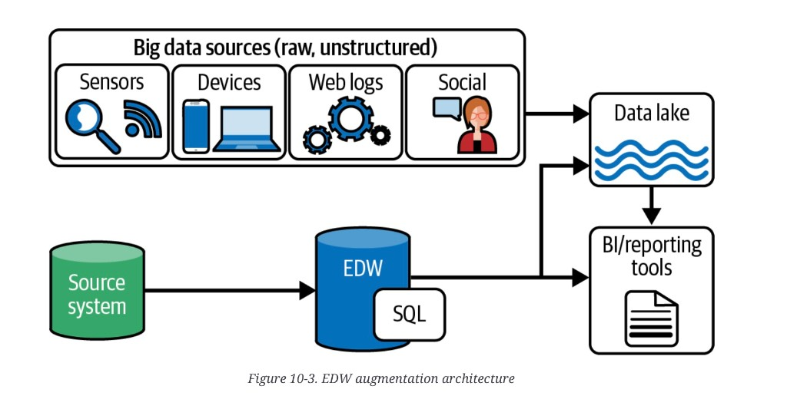
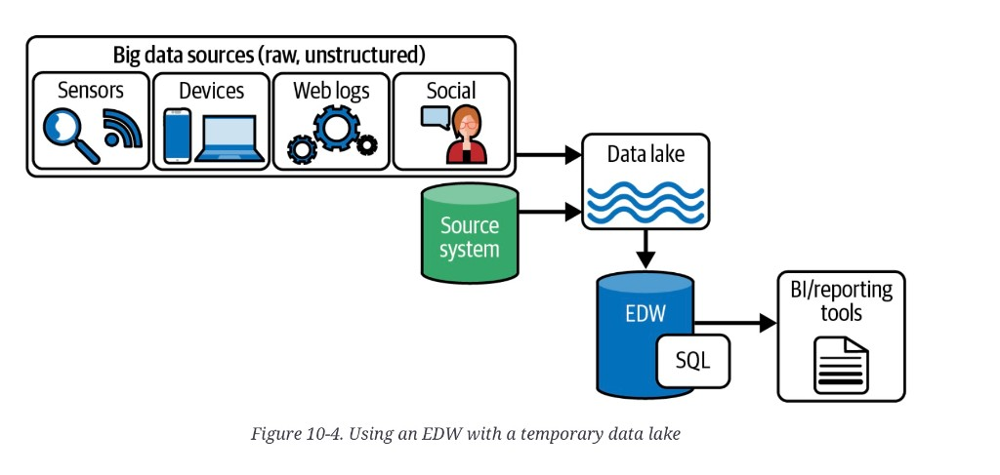
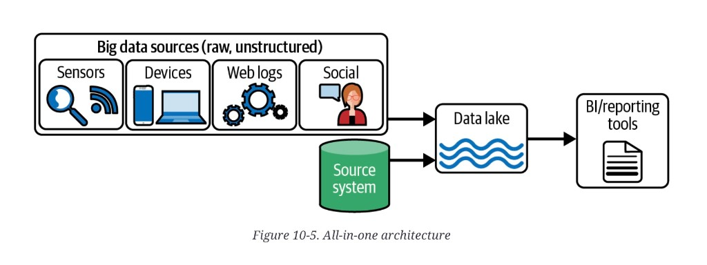

# Stepping stones to an MDW

**See also:** [chapter overview](mdw-overview.md) · [data journey](mdw-data-journey.md) · [lake and RDW roles](mdw-lake-and-rdw.md) · [Wilson & Gunkerk](mdw-wilson-gunkerk.md) · [cloud vs self-hosting](cloud-vs-self-hosting.md) · [distributed vs single-node](distributed-vs-single-node.md)

A full MDW is a long investment. Most organizations need a shape
that produces value while that work is unfinished. The three common
interims are not hacks if you name the missing piece and the path
off them.

## EDW augmentation

**When:** a long-lived on-prem **enterprise data warehouse** cannot
take “big data” — space, compute, maintenance-window time, or
semi-structured types.

**How:** stand up a cloud lake; copy the oversized or new data
there. Users query the lake for that slice. The primary store
stays the EDW.

*Figure 10-3. EDW augmentation architecture.* Two ingest paths.
Source system → EDW → BI. Big data → lake → BI. A branch from the
EDW path also lands in the lake — combining the two stores still
means a copy. BI reads both; the EDW is not unloaded.

**Buys:** capacity and a path to new analytics without throwing
away the EDW. Scale and cost land on object storage.

**Costs:**

- combining EDW + lake still means **copying EDW data to the lake**
- existing query tools may not speak lake
- lake compute is a new skill and a new bill
- **the EDW workload is not offloaded** — you added a store, you
  did not shrink the old one

**Path to MDW:** after the lake is live for the new data, start
moving EDW contents into the lake, then into a *cloud* RDW. Source
→ lake → cloud RDW is the real hybrid. Until that last hop exists
you have an EDW plus a lake, not an MDW.

## Temporary data lake plus EDW

**When:** you have an EDW and need to ingest big data, but shaping
it on the EDW would blow the maintenance window. The goal is
**offload**, not a second serving surface.

**How:** the lake is staging and refine only. Query and report stay
on the EDW. Sometimes a slice is copied EDW → lake, refined, and
copied back.

*Figure 10-4. Using an EDW with a temporary data lake.* Big data
and the source system both enter the lake. The only arrow out is
lake → EDW → BI. The lake is not a serving surface.

**Buys:** transform compute off the EDW; more than one engine; a
way to take large files without pausing the warehouse. Faster to
stand up than a lake people will query, because serving is out of
scope.

**Costs:** you do not get the
[lake roles](mdw-lake-and-rdw.md#data-lake) — no exploration, no
sandbox culture, no second query surface.

**Path to MDW:** small changes (open the lake for query, add a
cloud RDW, stop treating the lake as disposable). This is the
cleanest stepping stone *if* offload was the real pain.

## All-in-one (lake only)

**When:** startups, small teams, prototypes, short-horizon goals,
or a user base that is already technical. Close to a
**lakehouse** (not filed here): one store, no RDW.

**How:** all query and report hit the lake.

*Figure 10-5. All-in-one architecture.* Big data and the source
system enter the lake. BI reads the lake. No RDW — this is a
lakehouse shape, not an MDW, until you add the copy.

**Buys:** speed to first result, fewer moving parts, one skill
profile.

**Costs:** the
[RDW roles](mdw-lake-and-rdw.md#relational-data-warehouse) you
gave up — latency, security model, referential integrity,
non-technical self-service.

**Path to MDW:** add an RDW and start copying. If the only
consumers will stay data scientists, you may never need that hop
— then stop calling it a stepping stone and call it the target.

## Choosing

| Interim | Pain it treats | What is still missing for an MDW |
|---|---|---|
| EDW + lake | EDW cannot hold or type the new data | Cloud RDW; EDW offload; tool path to the lake |
| Temporary lake + EDW | EDW window / transform load | Lake as a serving/explore surface; often a cloud RDW |
| All-in-one | Time-to-value, simple estate | The RDW copy, and everything serving needs |

**Architect takeaway:** an interim is a named deficit. Augmentation
adds capacity and does not unload the EDW. A temporary lake unloads
transform and hides the lake from users. All-in-one ships fast and
owes an RDW if business users or dashboards show up. The MDW
starts when at least one hop lands in a warehouse.
