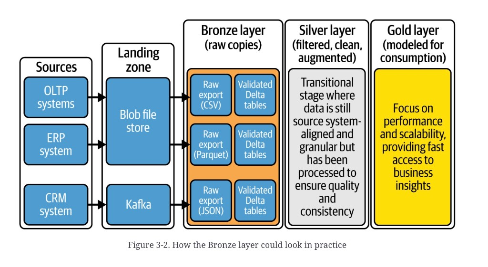

# Medallion Bronze

**See also:** [chapter overview](medallion-overview.md) · [Silver](medallion-silver.md) · [Fabric foundation](medallion-foundation-overview.md) · [OneLake shortcuts vs mirrors](medallion-foundation-onelake.md) · [MDW journey](mdw-data-journey.md) · [schema-on-read vs write](relational-vs-document.md#schema-flexibility-in-the-document-model) · [replication logs / CDC](replication-logs.md) · [law and society](law-and-society.md)

Bronze stores each source in its **original structure**. It is a
queryable reservoir and a historical record — the lakehouse
stand-in for a warehouse staging area. High volume, variety,
veracity. Treated as **immutable**: you append or merge to grow
the archive; you do not rewrite the past into an SCD2.

One physical folder or several sublayers is a complexity
decision, not a definition.

## Landing, then Bronze

Traditional sources dictate the export (CSV, JSON). A typical
flow: stage in a **landing zone** (decompress, checksum,
metadata) → copy into Bronze as Delta (or an external table) →
light validation → optional classify / encrypt → compare with
what is already there.

Whether landing *is* Bronze is an org choice. Figure 3-1 draws
it as a separate column. Table 3-1 gives it its own row. The
source’s working picture: landing is files; Bronze is the first
**queryable** table.

Encrypt PII **before** it lands when you can (Fernet is the
named example). That is a
[privacy](law-and-society.md) constraint, not a modeling one.

*Figure 3-2. How the Bronze layer could look in practice.* Same five columns as [Figure 3-1](medallion-overview.md). Bronze is the only column with internals: three parallel tracks — **Raw export (CSV / Parquet / JSON)** each flowing into **Validated Delta tables**. OLTP and ERP land on the blob store; CRM lands on Kafka. Silver and Gold stay as captions. The plate is the “add a landing hop and a validation parking lot” variant, not a virtual Bronze.

A virtual Bronze — pointers at the source, no copy — is allowed
in the prose. Do not treat it as the default; you lose the
archive.

## Full loads vs increments

**Full extract.** Whole snapshot, usually on a schedule, often
via landing. Minimal transform (filter, encrypt a column).
Accumulate deliveries in folders. The latest snapshot becomes
the Delta table or external table the next layer reads.

**Incremental / delta load.** Only the change — events, a CDC
stream, a watermark. Stage, fix types / format, then **append**
or **MERGE**. Append never updates or deletes. Merge upserts on
a key (the customer `is_current` sketch in the dump). Needs a
stable incremental id or `updated_at`, and a source that does
not silently rewrite rows older than your watermark. If it
does, you need CDC off the transaction log, not a `max()`
query.

Streaming picks up from a Delta / Iceberg `startingVersion`, or
from `max(updated_at)` in Bronze, or from a metadata control
table. Incremental loading is not Bronze-only; Silver and Gold
want the same change feed.

## Historization that is not SCD2

Bronze keeps **deliveries**: interval-partitioned folders
(`YYYY/MM/DD` or datetime), Parquet or Delta, years of audit
trail. You can rebuild a day’s state. That is not a processed
[slowly changing dimension](medallion-silver.md#how-far-to-remodel).
Data stays read-mostly. Time travel is for recovery, audit, and
reproducing a report — not the long-term archive. Cleanup of
processed files is allowed; rewriting history is not the job.

## Schema: read first, then write

Bronze is where schemas arrive messy.

| Approach | When | Cost |
|---|---|---|
| Schema-on-read | Landing / pre-Bronze. CSV, Parquet, no enforcement. | Flexible. You must detect drift, log it, and time-travel when it breaks. |
| Schema-on-write | The queryable Delta table. | Rigid. Rejects surprise columns. Hard when the source thrashes. |

Usual combination: infer on the way in, then write a Delta
schema that can evolve. `mergeSchema=true` adds new columns
(old rows get null), keeps missing ones, and tries type
widening. Failed conversion errors; you roll back via table
history and reprocess. Constraints are the strict
schema-on-write path.

When `mergeSchema` cannot reconcile a break:

- `ALTER` by hand, checked into a repo
- generate the `ALTER` from detected drift
- **metadata-driven mappings** (the source’s recommendation),
  wired through CI/CD
- ban breaking changes at the source
- cut a new pipeline version to a new location

Do not invent Auto Loader behavior here; that section is not
filed.

## Technical validation

Bronze is the **technical shield**. Format, schema, completeness.
Catch here so Silver and Gold do not inherit garbage.

| Stance | What you do | When |
|---|---|---|
| Intrusive | Halt. Park good and bad in a side folder / table. Nothing bad enters Bronze. | Downstream cannot tolerate the fault. |
| Nonintrusive | Load everything into Bronze. Fix in Silver. | You can live with the dirt for a hop. |

Owners plus application teams plus engineers close the gap.
Tools named: Delta schema enforcement, DLT, Great Expectations,
dbt, Ataccama, Monte Carlo, custom metadata scripts, ADF schema
drift. Differences are deferred to a later chapter.

## Who may query it

Business users on Bronze is a common wish and a bad default.
Raw tables are source-shaped, numerous, and coupled to the next
source release. Keep access tight, log ingest time / source /
touch, alert on size / format / arrival, and keep an incident
plan for a bad delivery.

Exceptions to immutability: technical metadata, filters, and
transforms that exist only to hide or drop sensitive columns.
The result may be “slightly augmented” and still called Bronze.

**Architect takeaway:** Bronze is a validated, queryable *copy
of the source*, plus an archive of how that copy arrived. If
you are already conforming names, building SCD2, or joining
systems, you are in Silver or Gold and have given up the
reload-from-truth property.
