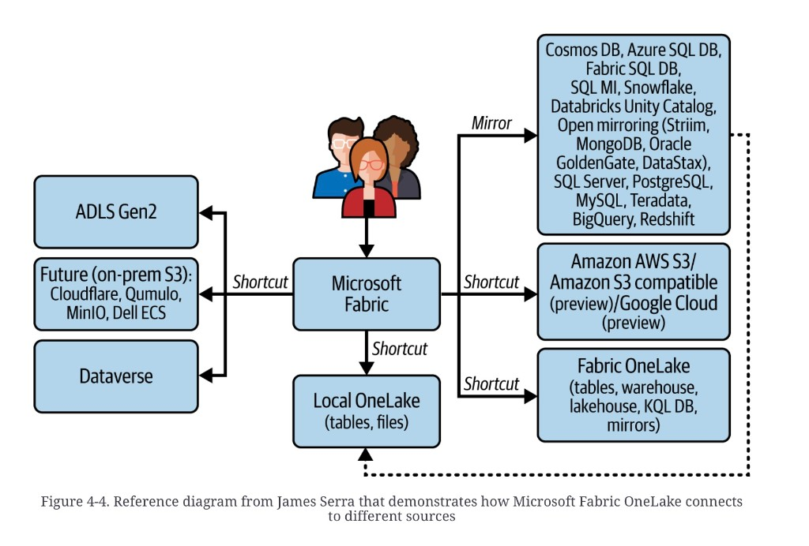

# OneLake: shortcuts and mirrors

**See also:** [chapter overview](medallion-foundation-overview.md) · [tenancy](medallion-foundation-tenancy.md) · [workloads](medallion-foundation-workloads.md) · [Medallion Bronze](medallion-bronze.md) · [lakehouse dump](data-lakehouse.md) · [replication logs / CDC](replication-logs.md) · [data virtualization](data-fabric-components.md#data-virtualization)

OneLake is Fabric’s shared storage. Underneath: **ADLS Gen2**.
Default table format: **Delta**. Enable Fabric on the tenant
and OneLake is there for every workspace. A Lakehouse table
and a Power BI dataset can read the same files. That is the
product’s “do not duplicate” claim.

It is a *store*, not a medal. [Bronze](medallion-bronze.md)
is a contract for what you put in it.

## Two ways in

A **shortcut** is a lightweight pointer at data that already
lives somewhere — another OneLake folder, ADLS, S3, Dataverse.
You query it in place. That is the same class of bet as
[data virtualization](data-fabric-components.md#data-virtualization):
you save the copy and you accept someone else’s availability,
schema, and IAM.

A **mirror** takes a snapshot of a database and keeps a
replica in OneLake as Delta, near-real-time. The dump likens
it to [CDC](replication-logs.md). Use it when the source
format is proprietary (Azure SQL is the named example) and
you want a lake-native table, not a live join into OLTP.

Shortcuts speak Delta and Iceberg. Mirrors speak the source’s
engine, then write Delta.

*Figure 4-4. Reference diagram from James Serra that demonstrates how Microsoft Fabric OneLake connects to different sources.* Users above **Microsoft Fabric**. **Shortcut** left: ADLS Gen2; future on-prem S3 (Cloudflare, Qumulo, MinIO, Dell ECS); Dataverse. **Shortcut** down: **Local OneLake (tables, files)**. **Mirror** right: Cosmos DB, Azure SQL DB, Fabric SQL DB, SQL MI, Snowflake, Databricks Unity Catalog; open mirroring (Striim, MongoDB, Oracle GoldenGate, DataStax); SQL Server, PostgreSQL, MySQL, Teradata, BigQuery, Redshift. **Shortcut** right: Amazon S3 / S3-compatible (preview) / Google Cloud (preview); other Fabric OneLake items (tables, warehouse, lakehouse, KQL DB, mirrors). Dashed lines fold mirrors and sibling OneLakes back into local OneLake. The list is Serra’s plate on the day it was drawn — not a support matrix we maintain.

## What that does to Bronze

A virtual Bronze — pointers, no copy — is already allowed in
the [medal notes](medallion-bronze.md#landing-then-bronze).
Shortcuts make that the product default. You lose the
immutable archive the medal asked for unless you also land a
copy.

Mirrors give you the copy, in Delta, with a replication lag
you did not measure here. Do not treat “near-real-time” as an
SLO.

**Architect takeaway:** pick the failure mode. Shortcut =
their outage is your outage, and you have no archive. Mirror
= you paid for a replica and a lag, and you can rebuild from
OneLake. If Bronze is only shortcuts, say so — you have
dropped the reload-from-truth property the
[medal](medallion-bronze.md) is for.
