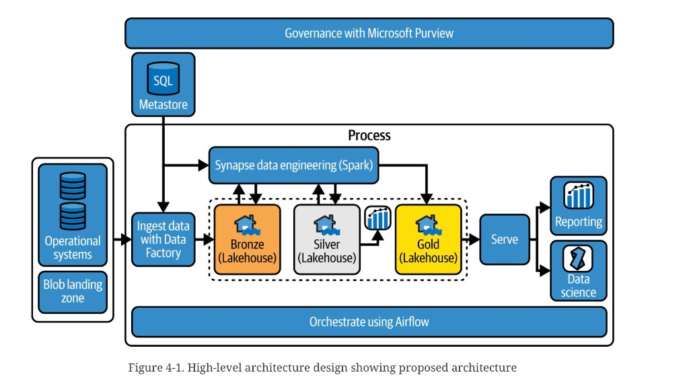

# Medallion foundation on Microsoft Fabric

These notes are **not** the
[Bronze medal](medallion-bronze.md). They are how you *stand
the platform up* so Bronze / Silver / Gold have somewhere to
live. The pattern is still the
[Medallion](medallion-overview.md). The product in the dump is
**Microsoft Fabric** — a SaaS analytics suite. That is a
different word from the
[data fabric](data-fabric-overview.md) architecture style.

The dump’s reason for a vendor at all: public end-to-end
Medallion examples are scarce. The portable pieces it wants
you to keep are Spark, PySpark, Delta Lake, Airflow / Data
Factory, and metadata-driven pipelines. The author tested the
snippets on other Spark-plus-Delta services. Databricks is
named as an alternate path (Unity Catalog lives on the
author’s blog, not here). Source Chapters 5–7 (build each
medal) are not filed.

## Oceanic Airlines

Fictitious carrier. Workshops with IT, operations, customer
service, and finance produced a lakehouse brief. They picked
Fabric. The proposed plate is Figure 4-1.

*Figure 4-1. High-level architecture design showing proposed architecture.* Left: **Operational systems** plus a **Blob landing zone**. Center **Process** box: **Ingest data with Data Factory** into three **Lakehouse** medals — Bronze, Silver, Gold — under **Synapse data engineering (Spark)** (bidirectional to Bronze and Silver; one-way into Gold). A **SQL Metastore** sits above ingest and Spark. Footer of the process box: **Orchestrate using Airflow**. Gold leaves through **Serve** to **Reporting** and **Data science**. A **Governance with Microsoft Purview** bar spans the whole plate. Named tools are the source’s example, not a required vendor list.

Read the plate against the
[MDW five hops](mdw-data-journey.md). Ingest and store are
on-lake. Transform is Spark. There is **no RDW copy** — Serve
leaves Gold. That is a
[lakehouse](data-lakehouse.md), not an
[MDW](mdw-overview.md). Landing is drawn as a blob *before*
the Bronze lakehouse, same as
[Figure 3-1](medallion-overview.md).

## What you provision

The tutorial’s minimum, distilled. Click-paths rot; the
objects do not.

| Object | Tutorial choice | Job |
|---|---|---|
| Capacity | F4 SKU (or a trial) | Compute pool and license. Pause-able PAYG exists. |
| Domain | Sales | Highest admin grouping. Delegation, not an ACL. |
| Workspaces | Dev, test, prod — each on a Fabric-licensed capacity, linked to Sales | Collaboration, region, CI/CD, security boundary. |
| Lakehouses | Bronze, Silver, Gold, schemas enabled | One entity per medal. Default `dbo` schema is permanent. |

Figures 4-6 (tenant admin switch), 4-7 (Power BI semantic-model
edit checkbox), and 4-8 (workspace with the three Lakehouses)
were in the dump and are **not in this drop**.

## Topic map

| Topic | The question | Concept |
|---|---|---|
| Tenancy | Tenant, capacity, workspace, domain — who owns compute? | [Tenancy](medallion-foundation-tenancy.md) |
| Storage | OneLake: shortcut in place, or mirror a replica? | [OneLake](medallion-foundation-onelake.md) |
| Engines | Lakehouse (Spark) vs Warehouse (T-SQL). How many stores? | [Workloads](medallion-foundation-workloads.md) |
| Medals | What each layer is allowed to do | [Medallion](medallion-overview.md) |
| Journey underneath | Same five hops; this plate drops the RDW | [MDW data journey](mdw-data-journey.md) |

## Chapter figures

Plates live under [`figures/`](figures/). Open the Concept, not the JPEG.

| Figure | Concept |
|---|---|
| 4-1 proposed Oceanic architecture | this file |
| 4-2 Fabric home (Medallion is a task-flow template) | [Tenancy](medallion-foundation-tenancy.md) |
| 4-3 tenant → capacity → workspace; domain spans capacities | [Tenancy](medallion-foundation-tenancy.md) |
| 4-4 OneLake shortcuts vs mirrors (Serra) | [OneLake](medallion-foundation-onelake.md) |
| 4-5 Data Engineering workload items | [Workloads](medallion-foundation-workloads.md) |
| 4-6 admin switch | missing from this drop |
| 4-7 semantic-model edit checkbox | missing from this drop |
| 4-8 workspace with three Lakehouses | missing from this drop |
| 4-9 central team owns Bronze+Silver; Gold fans out | [Tenancy](medallion-foundation-tenancy.md) |

The source dump had no bibliography. Serra is named on
Figure 4-4 and on “When to Have Multiple Data Lakes.” A
Microsoft Lakehouse-vs-Warehouse decision guide is footnoted,
not quoted.

## Summary

Stand the platform up before you argue medals. Capacity is
the bill. Domain is the admin boundary. Workspace is where
people and CI/CD meet. Lakehouse entities are how you *name*
Bronze / Silver / Gold on this product — they are not the
[lakehouse architecture](data-lakehouse.md) itself.

**Architect takeaway:** do not confuse three words. A
*Medallion* is the zone contract. A *lakehouse* is the store
shape (no required RDW copy). *Microsoft Fabric* is one SaaS
way to host both. If you copy Gold into an RDW you have
stepped back toward an [MDW](mdw-overview.md) — name that
copy.
