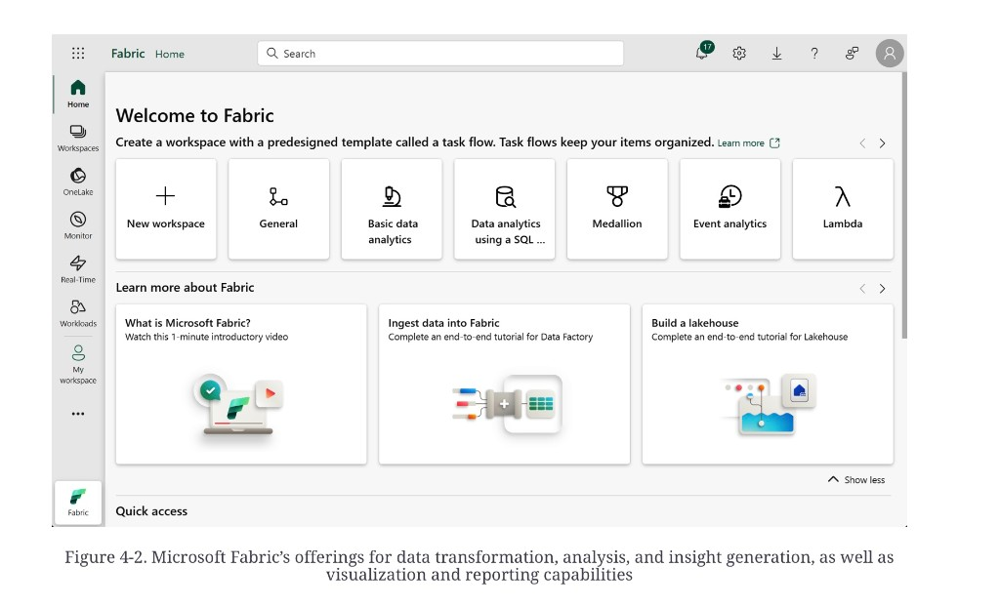
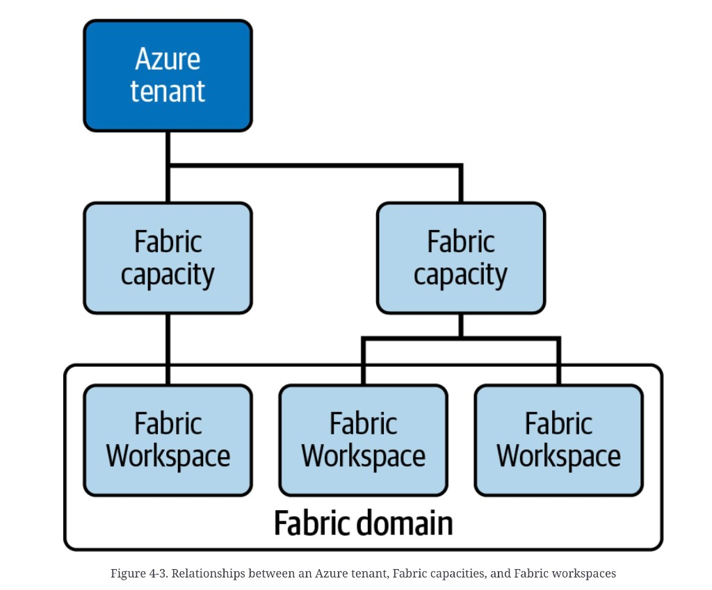
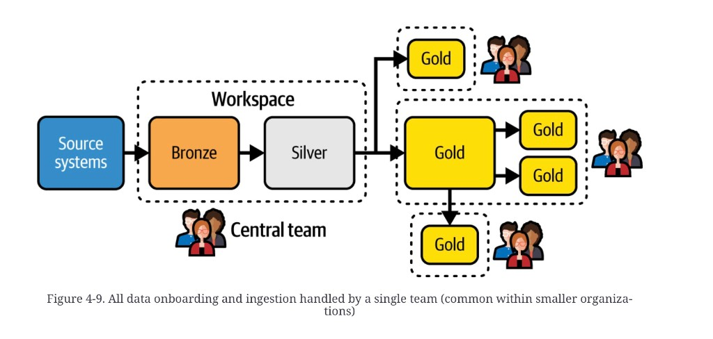

# Fabric tenancy: domains, workspaces, capacities

**See also:** [chapter overview](medallion-foundation-overview.md) · [OneLake](medallion-foundation-onelake.md) · [workloads](medallion-foundation-workloads.md) · [Medallion](medallion-overview.md) · [cloud / SaaS](cloud-vs-self-hosting.md)

Microsoft Fabric is a SaaS analytics platform. Entra ID signs
people in. Capacities, workspaces, and domains are how you
carve the tenant so a Medallion has a bill, a home, and an
admin owner.

*Figure 4-2. Microsoft Fabric’s offerings for data transformation, analysis, and insight generation, as well as visualization and reporting capabilities.* Fabric Home. Task-flow cards: New workspace, General, Basic data analytics, Data analytics using a SQL…, **Medallion** (trophy), Event analytics, Lambda. Sidebar: Home, Workspaces, OneLake, Monitor, Real-Time, Workloads. Medallion is a *template* on this product, not a proof the pattern requires Fabric.

## The hierarchy

*Figure 4-3. Relationships between an Azure tenant, Fabric capacities, and Fabric workspaces.* Tree: one **Azure tenant** → two **Fabric capacity** boxes → three **Fabric Workspace** boxes (one capacity hosts one workspace; the other hosts two). A **Fabric domain** rounded rectangle wraps *all three* workspaces, spanning both capacities. Domain is logical grouping, not a compute parent.

| Object | What it is | What it is not |
|---|---|---|
| **Capacity** | A pool of Capacity Units. Also the license (F2, F16, F64, …). Hosted in the Azure tenant; VMs are invisible. Assigned to one or more workspaces. Reserved or PAYG (create, run, pause). | A workspace. A region by itself — region arrives *through* the capacity you attach. |
| **Workspace** | Collaborative home for Lakehouses, Warehouses, notebooks, reports. One domain. One capacity. Roles: admin, member, contributor, viewer. Has a managed identity. Git (Azure DevOps / GitHub) usually tracks **metadata**, not data. | The ACL for a single table. That lives on the Lakehouse / object. |
| **Domain** | Highest Fabric abstraction. Delegation: a business unit sets its own rules. Workspaces (and their capacities) are associated into it. Subdomains exist (Sales → Sales Consumers / Sales Businesses). | An access-control list. Who may *read data* is decided below. |

Synapse and Databricks use a workspace idea too. Fabric is
one SaaS plane: you do not stand up a second “platform
instance” per region; you stand up more workspaces on a
capacity that already lives in that region.

## Capacity considerations

The tutorial bought **F4** — enough for a small batch ETL
with few users and no wide transforms. That is a lab SKU,
not a sizing guide.

When load grows, split pools: a reserved capacity for the
daily path, a cheaper PAYG capacity for ad-hoc. One capacity
can back every **dev** workspace in the tenant; production
often wants its own. Elasticity is the
[cloud-native](cloud-vs-self-hosting.md#cloud-native-system-architecture)
bet — you are paying for a pool, not a box.

## Domain considerations

Group by business capability, function, or department.
Oceanic would plausibly have Airport Management, Baggage,
Sales, Finance, Marketing, Operations — each a domain with
delegated admins. Small orgs run fewer, larger domains.
Count and scale are deferred to source Chapter 11
(governance), not filed here.

Domains separate **management**. They do not grant or deny
rows.

## Workspace considerations

A workspace binds people to a **region** (via its capacity),
a **capacity**, and a **version-control** repo. That is how
you keep EU data in EU and US data in US without a second
SaaS tenant: two capacities, two (or many) workspaces, one
domain.

CI/CD: one workspace per stage (dev / test / prod) is the
default. For a Medallion, keep **all three medals in one
workspace** so the pipeline has one Git root. Split
workspaces per layer if you must; you then orchestrate
several roots.

Other reasons to add a workspace: isolate a noisy job onto
its own capacity; give explorers a **read-only shortcut**
workspace onto production; pin a workspace identity to one
VNet / on-prem source.

The common small-org shape is Figure 4-9.

*Figure 4-9. All data onboarding and ingestion handled by a single team (common within smaller organizations).* **Source systems** enter one dashed **Workspace**. Inside: **Bronze** → **Silver**, owned by a **Central team**. Silver fans out to three dashed Gold homes, each with its own group: one Gold; a Gold that splits into two more Golds; a third Gold hanging off the middle. Hub-and-spoke: onboarding is centralized; consume is federated.

Oceanic starts as one workspace the engineers share. Dev /
test / prod come next. “How many Medallions” is named in the
dump and not filed.

**Architect takeaway:** draw the bill (capacity), the home
(workspace), and the admin owner (domain) as three different
lines. If domain is your ACL, you will either over-share or
over-split. If Bronze and Silver have no named owner, Figure
4-9 happens by accident — usually the central team, whether
you drew them or not.
