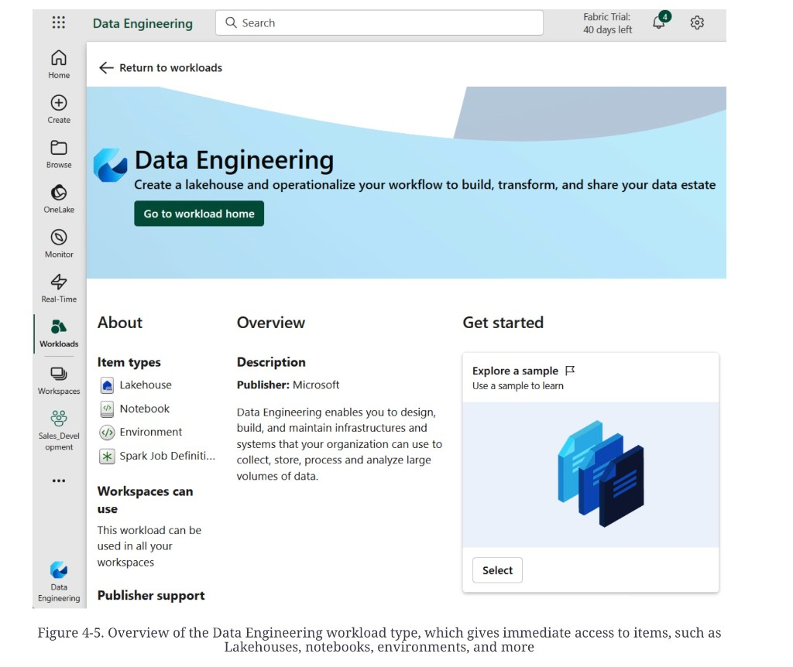

# Fabric workloads: Lakehouse vs Warehouse

**See also:** [chapter overview](medallion-foundation-overview.md) · [tenancy](medallion-foundation-tenancy.md) · [OneLake](medallion-foundation-onelake.md) · [Medallion](medallion-overview.md) · [lakehouse dump](data-lakehouse.md) · [lake vs RDW](mdw-lake-and-rdw.md) · [OLTP vs OLAP](operational-vs-analytical.md)

Workloads are the product’s personalities on the same
[OneLake](medallion-foundation-onelake.md). Data Engineering
(Spark) is what the dump uses to build the medals.



*Figure 4-5. Overview of the Data Engineering workload type, which gives immediate access to items, such as Lakehouses, notebooks, environments, and more.* Workload card. Item types: **Lakehouse**, **Notebook**, **Environment**, **Spark Job Definition**. Usable in every workspace. Publisher: Microsoft. Sidebar already on a `Sales_Development` workspace. The UI is a point-in-time screenshot, not a feature list.

Create a Lakehouse (or Warehouse) and the product provisions
storage, a SQL endpoint, and a serverless Spark pool. You do
not open an ADLS account and invent folders first.

## Entity ≠ architecture

A **lakehouse architecture** is the store shape: lake plus
Delta-class features, no required RDW copy — see the
[lakehouse dump](data-lakehouse.md). A Fabric **Lakehouse
entity** is one item: files + Delta tables + Spark + a SQL
endpoint + schemas, sitting in a
[workspace](medallion-foundation-tenancy.md). You *use*
entities to *build* the architecture. They are not the same
word.

Default table format is Delta. CSV, XML, JSON, Parquet still
land as files. Everything sits in OneLake, so other workloads
can read it. Security can be granted on the Lakehouse or on
objects without opening the whole workspace. Git tracks
metadata, not the data. Schemas group tables (`oceanic.sales`)
and isolate sources or sublayers inside one entity.

```python
df.write.mode("Overwrite").saveAsTable("oceanic.sales")
```

## Warehouse (T-SQL)

A **Warehouse** entity also stores Delta in OneLake. The
engine is a distributed T-SQL processor with **multi-table
transactions**. Spark SQL is not T-SQL. V-order-optimized
tables are the named performance knob.

| Choose | When |
|---|---|
| Lakehouse / Spark | Team speaks PySpark; you want open engines; the job is files-to-tables. |
| Warehouse / T-SQL | The work is intricate multi-table transactions, or the team already writes T-SQL. |

Microsoft published a decision guide; the dump does not quote
it. Do not invent the matrix.

## Other workloads

Data Factory orchestrates movement. Real-Time Intelligence
pulls Event Hubs / IoT Hub into a Lakehouse, Warehouse, or
KQL database. Power BI and Fabric Data Science sit on the
same OneLake; notebooks include Data Wrangler. The dump’s
name for “no extra copy between engines” is **zero-ETL**.
That is a sharing claim, not a proof you skipped
[transform](mdw-data-journey.md#3-transformation).

## How many Lakehouse entities

Best practice in the dump: **one entity per medal**, not one
Lakehouse with Bronze / Silver / Gold schemas. Separate
entities give separate SQL endpoints and separate ACLs —
read-only Gold for analysts, Bronze prod for the on-call
without Silver. Minimum: Bronze Lakehouse, Silver Lakehouse,
Gold Lakehouse *or* Warehouse.

Dev / test / prod, each with three entities, is **nine**.
The dump calls that manageable because capacities can differ
per layer and per stage.

Add more entities when a large domain must hide raw tables
from part of the team, or when two ingest teams must not
write the same folder. Prefix names; script the bundle
(workspace + the three Lakehouses) so the next team clones a
layout, not a conversation.

A layer may itself be several Lakehouses. That is
organization, not a fourth medal.

## Storage accounts (when you are not on Fabric)

Databricks, Synapse, HDInsight still show you ADLS. The
default sketch: **one account, three containers** (Bronze,
Silver, Gold). Small projects keep that. Larger ones give
each engineering team its own account.

A hybrid the dump likes: each domain has a **private**
account for its own Bronze / Silver / Gold, plus a **central**
account — usually run by a shared team — that publishes the
finished product (source-aligned Silver or consumer-aligned
Gold) to other domains. Detail is promised in source Chapter
11, not filed.

Reasons the dump lists for *more* lakes, not fewer:

| Pressure | Why another lake |
|---|---|
| Org ownership | A department will not put files in your account |
| Residency | Region is a legal line |
| Azure limits / policies | Subscription and policy blast radius |
| Cost attribution | One bill per lake / subscription |
| Sensitivity | Stricter controls on a smaller surface |
| Environment split | Dev / test / prod as separate accounts |
| Latency | Put bytes next to the reader |
| Privilege scope | Admins see less |
| Governance / SLA mix | Different retention, different performance tier |
| DR | A second region is a second lake |

Serra’s “When to Have Multiple Data Lakes” is named as
reading, not cited.

**Architect takeaway:** decide the *engine* (Spark vs T-SQL)
and the *isolation grain* (one entity per medal, then per
team if ACLs demand it) before you name folders. On Fabric
the folder decision is mostly hidden; the entity count is
the decision. On ADLS the same decision is containers and
accounts. Either way, if Bronze and Gold share an endpoint,
you have given analysts a path to the raw copy.
