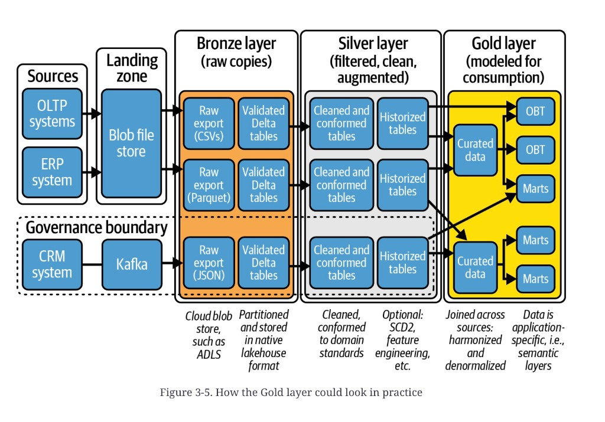

# Medallion Gold

**See also:** [chapter overview](medallion-overview.md) · [Silver](medallion-silver.md) · [stars, snowflakes, OBT](star-snowflake-analytics.md) · [MDW modeling hop](mdw-data-journey.md#4-data-modeling) · [lake and RDW roles](mdw-lake-and-rdw.md) · [Fabric Warehouse vs Lakehouse](medallion-foundation-workloads.md)

Gold is the expensive layer: merge sources, apply business
rules, aggregate, correct, and shape the result for a decision.
Users disagree — a flat extract, a
[star](star-snowflake-analytics.md), several overlapping marts.
Expect **sublayers**. This is the hop
[Figure 3-3](medallion-overview.md#what-is-easy-to-automate)
marks **hard to parameterize**.

The model is a public interface. Performance that business
users cannot navigate is a failed model.

## Star schema (the default)

Declare grain, then dimensions, then facts. Load **dimensions
first** — facts need the surrogate keys.

**Dimensions.** Incremental SCD: find the business key, close
the old row / insert the new, or insert if unseen. Overlapping
keys from two sources need a source identifier. Harmonize
*before* the insert (decode, split, fill mandatories). A
staging hop into the dimension is normal.

**Facts.** Replace business keys with those surrogates. An
**early-arriving fact** (dimension row not there yet) gets a
placeholder so the FK still resolves.

**Load hygiene.** `type1_hash` / `type2_hash` to detect
overwrite vs history. `creation_date` / `update_date` to skip
unchanged rows. SCD1 overwrites; SCD2 keeps both rows.

That is Kimball as a convention set, not a single physical
Gold folder.

## Curated, semantic, platinum

As stars grow and sources pile up, requirements overlap but
do not match. Common split: a **curated / conformed** layer
(shared reference tables, conformed dimensions) plus
**semantic** marts, sometimes branded **Platinum**. Reuse and
standardization versus time and ceremony. Size of the org,
number of sources, and how picky the consumers are decide
whether you pay for it.

## One big table

Skip the dimensions. One wide table, sometimes with nested
arrays (the dump’s `Orders.Products` JSON). Reasons the source
lists: easier for small teams, fewer joins, easier to extend,
what many data-science tools expect, natural for a time series.

Costs: nested columns make “sum this product” a project;
duplication grows memory; a new field often means rebuild the
table. Same trade-off as
[OBT in the warehouse notes](star-snowflake-analytics.md#one-big-table-obt),
from a lakehouse angle.

## Serving layer

Gold in the lakehouse is not always the last hop. Teams copy
curated tables into another engine their tools already speak —
Azure SQL as a mart, Azure Data Explorer, a graph store, Power
BI **Import** into VertiPaq. Direct query on Delta is possible;
Import is chosen for consistent latency and finer security.
The extra copy is the same class of decision as the
[MDW RDW hop](mdw-data-journey.md#4-data-modeling): usability,
compatibility, concurrency, cost.

A lakehouse plus a serving copy is still a lakehouse with an
optional RDW, not automatically an
[MDW](mdw-overview.md). Name the copy.

*Figure 3-5. How the Gold layer could look in practice.* Full pipeline with footers. Bronze: cloud blob (ADLS named), partitioned native lakehouse format; CSV / Parquet / JSON → validated Delta. Silver: cleaned and conformed to domain standards, then historized; optional SCD2 and feature engineering. Gold: **joined across sources**, harmonized and denormalized, **application-specific / semantic**. Two **Curated data** boxes: the top one takes the OLTP and ERP Silver tracks and fans out to two **OBT**s and a **Marts**; the bottom one takes the CRM Silver track (leaving the governance boundary) plus a join from the middle track, and fans out to two **Marts**. The CRM **Governance boundary** holds through Bronze and Silver and opens at Gold — isolation until the consume model.

## Governance on the consume path

Document and catalog what Gold holds, segment by use case,
name owners. The dump points at a later Chapter 11; do not
invent the controls. Structure should be obvious and
read-optimized.

**Architect takeaway:** Gold is where sources meet *and* where
the model becomes a product. Pick star, OBT, or a semantic
split because of who will query it, not because the medal
requires a shape. If you still need another database after
Gold, that is a serving decision — budget it — not proof the
lakehouse failed.
