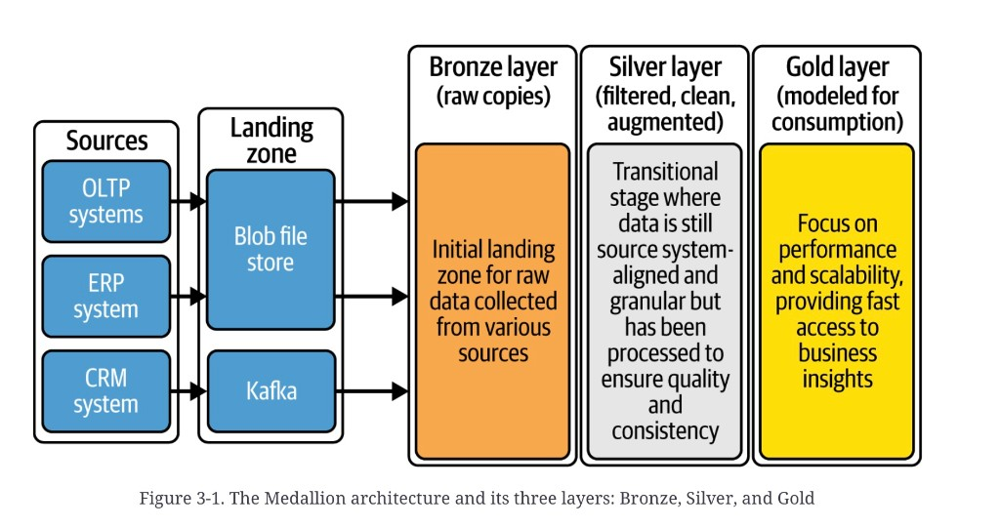
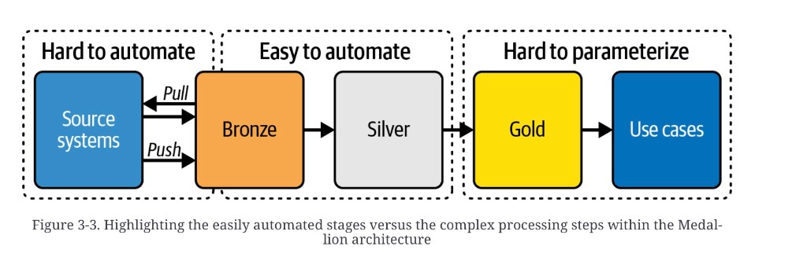

# Medallion architecture

A **Medallion** architecture organizes data *inside* a
lakehouse: three logical layers — **Bronze**, **Silver**,
**Gold** — that refine a dataset from a raw copy to something a
decision can use. It is a design pattern, not a product. The
industry definitions are fuzzy; that ambiguity is the source’s
reason for the chapter, not a defect in the notes.

These notes come from a different source than the
[MDW](mdw-overview.md) and [data fabric](data-fabric-overview.md)
chapters. The overlap is deliberate. The MDW five hops
([ingest → store → transform → model → visualize](mdw-data-journey.md))
are the *journey*. Medallion is how you *name the zones* on the
lake half of that journey. A lakehouse that drops the RDW copy
still needs the same refinement; the dump for that sibling
([data-lakehouse.md](data-lakehouse.md)) is not yet split.

The layers are **logical, not physical**. One “Bronze” can be a
landing folder, a validation parking lot, and a Delta table. Do
not frame a layer as a single container.

## Three layers

| Layer | Role | Still source-aligned? |
|---|---|---|
| [Bronze](medallion-bronze.md) | Queryable raw copies. Immutable archive. Technical validation. | Yes |
| [Silver](medallion-silver.md) | Clean, conform, optional historize. Usually not yet joined across sources. | Yes |
| [Gold](medallion-gold.md) | Harmonize, apply business rules, model for a use case. | No — consumer-shaped |

*Figure 3-1. The Medallion architecture and its three layers: Bronze, Silver, and Gold.* Five columns, left to right. **Sources** (OLTP, ERP, CRM) feed a **Landing zone** (blob file store plus Kafka — CRM is the stream). Then the three medals: Bronze is “raw copies”; Silver is “filtered, clean, augmented” and still source-aligned and granular; Gold is “modeled for consumption,” aimed at performance and scalability. Landing is drawn *before* Bronze. The plate’s Bronze caption still says “initial landing zone”; the later figures and Table 3-1 treat landing as its own hop.

Warehouse modeling is still in force. Kimball / star-schema
literacy is assumed; see
[stars, snowflakes, and OBT](star-snowflake-analytics.md).

## What is easy to automate

The three medals are not equally scriptable.

*Figure 3-3. Highlighting the easily automated stages versus the complex processing steps within the Medallion architecture.* Source systems ↔ Bronze is **hard to automate**: vendors push or you pull, formats and APIs differ. Bronze → Silver is **easy to automate**: rename, filter, type, lookup — metadata-driven. Gold → use cases is **hard to parameterize**: the business logic is not a table of mappings.

That is why Bronze→Silver is where dbt, Delta Live Tables, and
in-house metadata frameworks earn their keep, and why Gold
resists a single generator.

## Layer card (Table 3-1)

| Layer | Purpose | Data model | Transformations | Format | ETL (source examples) |
|---|---|---|---|---|---|
| Landing | As-is from the source | Raw | None | Delivery files — CSV, Parquet, JSON | ADF, Kafka, Auto Loader, Event Hubs, LakeFlow Connect |
| Bronze | Validated raw, standardized tables | Source schema | Filters, metadata | Delta or Iceberg | SQL / Python, DLT |
| Silver | Clean, historized, still source-oriented | Mirrors Bronze, or subject / 3NF / vault | SCD2, light transforms, reference data, optional features | Delta or Iceberg | SQL / Python, dbt, Great Expectations |
| Gold | Value creation | Kimball or OBT | Harmonize, aggregate, business rules | Delta or Iceberg | SQL / Python, dbt, semantic models |

Named tools are the source’s examples, not a required vendor
list. Iceberg is named as a peer of Delta; the prose is
Delta-first.

## Topic map

| Topic | The question | Concept |
|---|---|---|
| Bronze | What is a raw copy, and what is not? | [Bronze](medallion-bronze.md) |
| Silver | Clean in place, or already an enterprise model? | [Silver](medallion-silver.md) |
| Gold | Star, OBT, platinum, or a serving copy? | [Gold](medallion-gold.md) |
| Foundation | How do you stand the platform up before the medals? | [Fabric foundation](medallion-foundation-overview.md) |
| Journey underneath | Same five hops on the MDW plate | [MDW data journey](mdw-data-journey.md) |

## Chapter figures

Plates live under [`figures/`](figures/). Open the Concept, not the JPEG.

| Figure | Concept |
|---|---|
| 3-1 three layers plus landing | this file |
| 3-2 Bronze in practice (CSV / Parquet / JSON → validated Delta) | [Bronze](medallion-bronze.md) |
| 3-3 hard to automate / easy / hard to parameterize | this file |
| 3-4 Silver in practice (cleaned + historized; governance boundary) | [Silver](medallion-silver.md) |
| 3-5 Gold in practice (curated → OBT and marts) | [Gold](medallion-gold.md) |

The source dump had no bibliography. Kimball and Adamson are
named as reading, not cited. Source Chapter 4 (stand up
Fabric) is filed as the
[foundation](medallion-foundation-overview.md). Chapters 5–7
(implement each medal) and 11 (governance) are not filed
here.

## Summary

Three logical layers plus a landing hop. Flexibility is the
point; so are organization-wide standards for what each layer
is allowed to do, who signs data off, and who owns a break.
Vault-everywhere and OBT-everywhere both failed in the source’s
experience — one on performance, the other on change. Iterate
the model; do not freeze the medals.

**Architect takeaway:** name the layers as contracts, not
folders. If Bronze is already a star, you skipped a layer. If
Silver already joins every source, you moved Gold left and
coupled the domains. If Gold is a dump of Silver with a new
name, you have not modeled.
