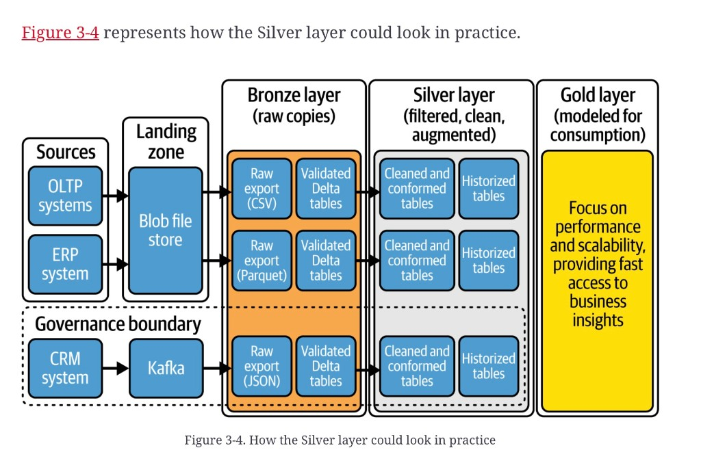

# Medallion Silver

**See also:** [chapter overview](medallion-overview.md) · [Bronze](medallion-bronze.md) · [Gold](medallion-gold.md) · [stars and snowflakes](star-snowflake-analytics.md) · [MDM](data-fabric-components.md#master-data-management) · [OLTP vs OLAP](operational-vs-analytical.md)

Silver takes the queryable Bronze table and makes it usable:
standardize dates and names, enforce reference data, drop
duplicates, run *functional* quality checks, discard or
quarantine bad rows, filter noise. Tables usually still match
Bronze one-to-one. They are **not yet merged across sources**.

Fix quality at the originating system when you can. A clean
Silver table does not repair the other interfaces that still
read the dirty source.

## Cleaning (not an exhaustive list)

| Activity | Point |
|---|---|
| Noise / inauthentic rows | Drop columns and rows that are not the golden source. |
| Missing values | Remove, default, or impute — a decision, not a default. |
| Duplicates | Unless retention requires them. |
| Spaces, typos, units, outliers | String and entry hygiene. |
| Consistency | `NL` or `NETHERLANDS`, not both. |
| Formats and types | Dates as a single pattern; numeric columns actually numeric. |
| Ranges, uniqueness, parent/child | Constraints the source did not keep. |
| Mask PII | Before anyone uses the table. |
| Anomaly detection | A spike can be a load bug. |
| MDM / standardize / conform | Addresses, phones, codes — toward a common model. |

Rejected rows are **flagged and stored** in a sibling quarantine
table, not deleted. Cleaning rules take several passes; Gold
often sends you back.

Renaming columns and picking tight types is treated as Silver
best practice. Implicit casts are CPU. Conforming categories
here is [MDM-adjacent](data-fabric-components.md#master-data-management);
the MDM chapter is not filed.

## How far to remodel

**Straight-through.** Silver mirrors Bronze: same grain, friendlier
names, uniform types. Default for most orgs.

**Denormalize.** Fewer tables, fewer joins, better on columnar /
distributed stores. More bytes. More common in
[Gold](medallion-gold.md); do it in Silver only if this layer
is itself a heavy read path.

**SCD2.** `start_date` / `end_date` / `is_current`, compared on
business keys, surrogate keys, or hashes. Most engineers put
SCD2 in Gold — expensive, under-used. Reasons to historize in
Silver: Gold will smash sources together and you still need the
*source* timeline (ML that wants original context; operational
reporting that no longer has an ODS, especially behind SaaS /
NoSQL). Otherwise keep Silver current.

**Surrogate keys.** Usually **not** here. They appear when you
build dimensions and facts and look up on the natural key. If
you insist on them in both layers, Silver’s key becomes a
lookup into Gold’s — more moving parts.

## Join now, or wait?

Default: **keep sources separate**. Early joins couple domains.
A consumer who only wanted CRM now inherits ERP breakage. If
you are building source-aligned data products, do not
cross-join across ownership boundaries in Silver.

The other school treats Silver as the integration layer and
reaches for **3NF** or a **data vault** (raw vault + business
vault, hubs / links / satellites, PIT and bridge tables).
Reasons the source lists: many disparate systems, multi-domain
teams, schema drift, several active timelines on one record.

Costs: planning time, join-heavy queries, shuffle on Spark.
Cloud lakehouses usually prefer wide nested tables. Reload from
queryable Bronze plus Delta time travel also weakens the “we
need a vault so we can rebuild” argument. VaultSpeed is named
as an automation escape hatch, not evaluated.

You can still apply enterprise *standards* in Silver (types,
central reference data, names) and a few cheap derived columns.
Heavy business rules wait for Gold.

## Operations and ML

Silver is the usual surface for **operational queries** and for
training that wants source context. Feature engineering often
spawns a fourth layer (sandbox / ML), the same idea as the
[MDW sandbox](mdw-data-journey.md). Enrich in Silver when ops
reporting needs it; delay when you want isolation and will pay
the extra Gold hop.

Put reusable integration in a place you will not have to
rebuild per team. Use-case rules stay in Gold. That tension is
why some orgs grow a curated / semantic split — see
[Gold](medallion-gold.md#curated-semantic-platinum).

## Physical shape

One Silver folder or three (cleanse → conform → SCD) is an
auditability choice. Source-aligned clean plus a later
harmonized Silver is an ownership-plus-integration choice.
Keep the stages distinct.

*Figure 3-4. How the Silver layer could look in practice.* Same tracks as [Figure 3-2](medallion-bronze.md). Each Bronze “Validated Delta” pair becomes **Cleaned and conformed tables** → **Historized tables**. A dotted **Governance boundary** wraps the CRM source, its Kafka landing, and the JSON Bronze/Silver track — isolation drawn, not yet a join. Gold is still a caption.

**Architect takeaway:** Silver is a *better source*, not an
enterprise model. If you historize, join, or mint surrogate keys
here, write down why — ML context, no ODS, or a deliberate
vault — so the next team does not treat that as the medal
definition.
