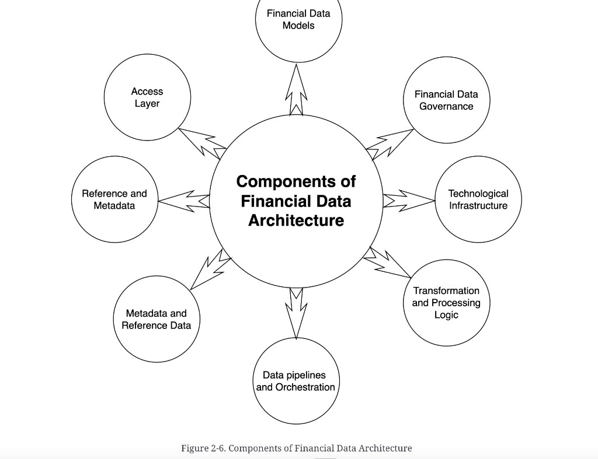

# Components of a financial data architecture

**See also:** [chapter 2 map](fin-data-arch.md) · [definition](defining-financial-data-architecture.md) · [constraints](architecture-constraints.md)

Data architecture is not a single system. It is interdependent parts. The **chapter body** lists eight components (table below). Figure 2-6 is a hub-and-spoke plate that does **not** match that list one-for-one.

*Figure 2-6. Components of Financial Data Architecture.* Double-headed arrows: each spoke and the hub constrain each other.

**On the plate (clockwise from top):** Financial Data Models · Financial Data Governance · Technological Infrastructure · Transformation and Processing Logic · Data pipelines and Orchestration · Metadata and Reference Data · Reference and Metadata · Access Layer.

The last two spokes are the same idea in swapped word order — treat that as a plate slip, not two components. **Integration and interfaces** and **monitoring and observability** are in the chapter prose and have Concepts here; they are **not** spokes on 2-6. **Metadata / reference data** is on the plate and is covered under [reference data](reference-data.md).

| Component (chapter body) | Job | Concept |
|---|---|---|
| **Financial data models** | Entities, meaning, conceptual / logical / physical | [Models](financial-data-models.md) |
| **Financial data governance** | Quality, security, integrity, compliance across the lifecycle | [Governance](financial-data-governance.md) |
| **Integration and interfaces** | In, out, and across; APIs, messages, virtualisation | [Integration](integration-interfaces.md) |
| **Technological infrastructure** | Store and process — SQL, warehouse, lake, kdb+, Kafka, Airflow | [Infrastructure](technological-infrastructure.md) |
| **Processing and transformation** | Validate, clean, harmonise, enrich, calculate | [Transformation](processing-transformation.md) |
| **Pipelines and orchestration** | Automated, predictable flow; dependencies, retries, audit | [Pipelines](pipelines-orchestration.md) |
| **Access layer** | Dashboards, APIs, semantic layer, who-sees-what | [Access](access-layer.md) |
| **Monitoring and observability** | Ops + quality; metrics, events, logs, traces | [Observability](monitoring-observability.md) |

**Architect takeaway:** a “we bought Snowflake” slide covers one slice of [infrastructure](technological-infrastructure.md). Score the other seven before you call the architecture done.
