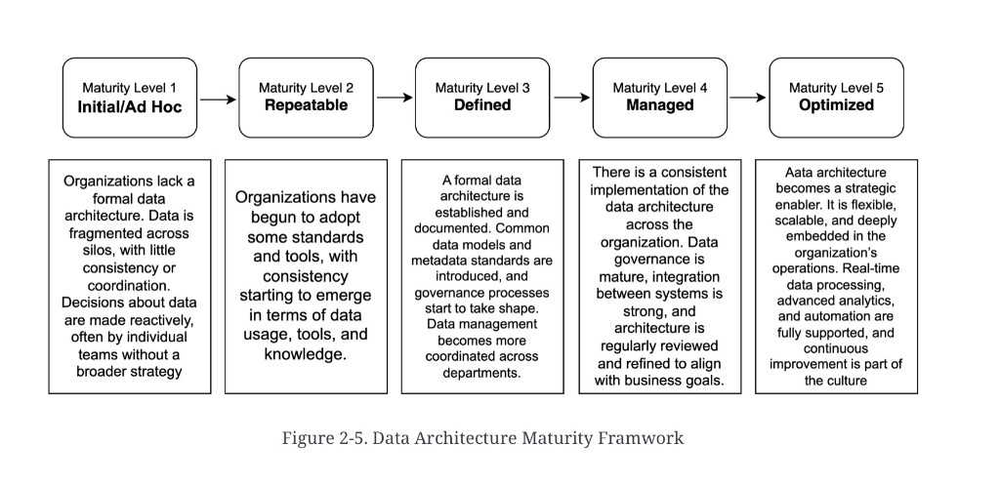

# Data architecture maturity

**See also:** [when it is not needed](when-not-needed.md) · [why it is needed](why-needed.md) · [components](architecture-components.md)

**Maturity** is how well the organisation has developed and implemented its data architecture. It is assessed across stages that reflect increasing consistency in how data is structured, governed, integrated, and used — from ad-hoc and unstructured to highly strategic, governed, and optimised.

Several frameworks exist. The chapter says they share a comparable high-level approach. Figure 2-5 is the five-level picture.

*Figure 2-5. Data Architecture Maturity Framework.* The chapter dump caption misspelled “Framwork”; the plate says Framework. Level 5 on the plate begins with a typo (“Aata”); the table uses **Data**.

| Level | Name | Figure gloss |
|---|---|---|
| **1** | **Initial / Ad Hoc** | No formal data architecture. Data fragmented across silos; little consistency. Decisions are reactive, often by individual teams, with no broader strategy |
| **2** | **Repeatable** | Some standards and tools. Consistency starts to appear in usage, tools, and knowledge |
| **3** | **Defined** | Formal architecture established and documented. Common data models and metadata standards; governance begins. Management more coordinated across departments |
| **4** | **Managed** | Consistent implementation across the organisation. Governance is mature; integration is strong; architecture is reviewed and refined against business goals |
| **5** | **Optimized** | Architecture is a strategic enabler — flexible, scalable, embedded in operations. Real-time processing, advanced analytics, and automation are supported; continuous improvement is cultural |

To *score* a firm you still need to know what the architecture is made of — the [component map](architecture-components.md). Later source chapters apply those elements to financial institutions; they are not extracted here yet.

**Architect takeaway:** use maturity to stage investment ([when not](when-not-needed.md) → [why](why-needed.md)), not as a vanity score. A useful assessment is “which [components](architecture-components.md) are still Level 1,” not “we are Level 3.”
