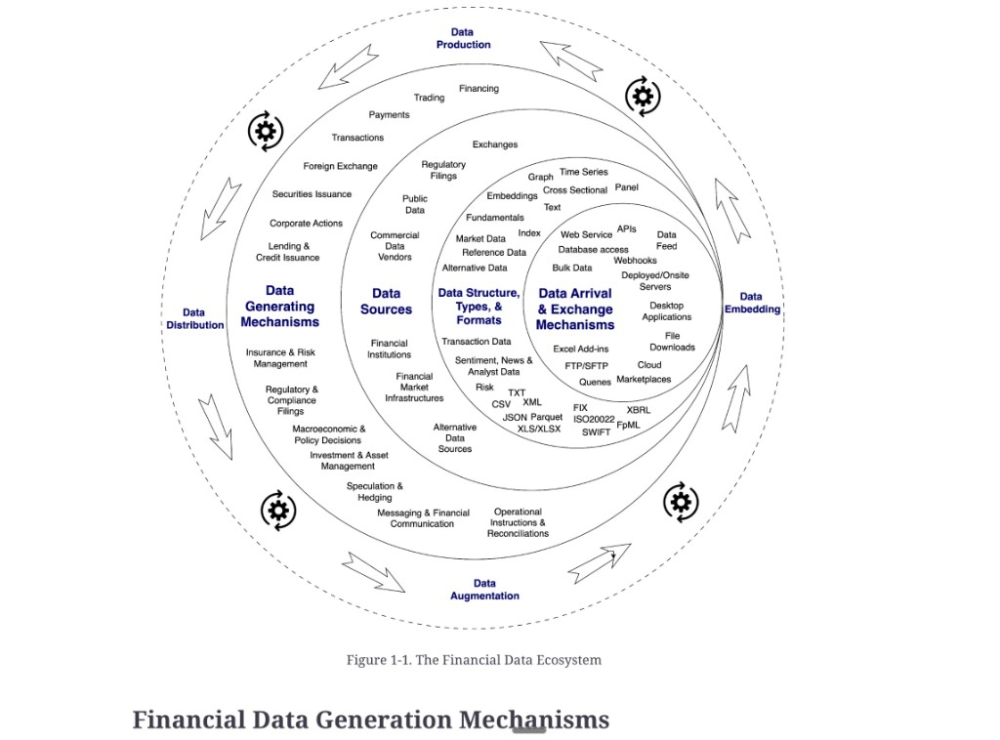

# The financial data ecosystem

**See also:** [introduction](introduction.md) · [generation](data-generation.md) · [sources](data-sources.md) · [delivery](data-delivery.md) · [types and formats](data-types-formats.md) · [characteristics](data-characteristics.md) · [value chain](value-chain.md)

When you architect a system that handles financial data, its complexity will reflect — and be constrained by — the landscape itself. A simple town needs a simple map; a metropolis needs a detailed one.

The ecosystem has six faces. Most projects touch only a subset. The point of this map is to recognise which subset you are in.

| Face | What to ask | Concept |
|---|---|---|
| **Generation** | Which market operations create the records? | [Generation mechanisms](data-generation.md) |
| **Sources** | Who owns or publishes the data? | [Data sources](data-sources.md) |
| **Arrival** | How does it get into *your* systems? | [Arrival and exchange](data-delivery.md) |
| **Shape** | Structure, type, on-the-wire format? | [Types, formats, structures](data-types-formats.md) |
| **Characteristics** | Why is it hard to join, version, and name? | [Characteristics](data-characteristics.md) |
| **Value chain** | Who produces, distributes, augments, embeds? | [Value chain](value-chain.md) |

*Figure 1-1. The Financial Data Ecosystem.* Four inner layers (generating mechanisms → sources → structure/types/formats → arrival) sit inside an outer cycle of production, distribution, augmentation, and embedding. **Characteristics** (identifiers, semantics, restatements) are not a ring in this figure; they are extracted in [data-characteristics.md](data-characteristics.md).

You do not need to master every face on day one. You do need to know which faces your design pretends do not exist — those are where the surprises land.

**Architect takeaway:** draw the ecosystem *before* picking a store or a bus. Name the generating mechanism, the source, the delivery path, and the identifier scheme. A payments lake that ignores OTC venues, or a “single customer view” that ignores [entity resolution](data-characteristics.md#entity-resolution-and-identifiers), is a map of a town drawn over a metropolis.
