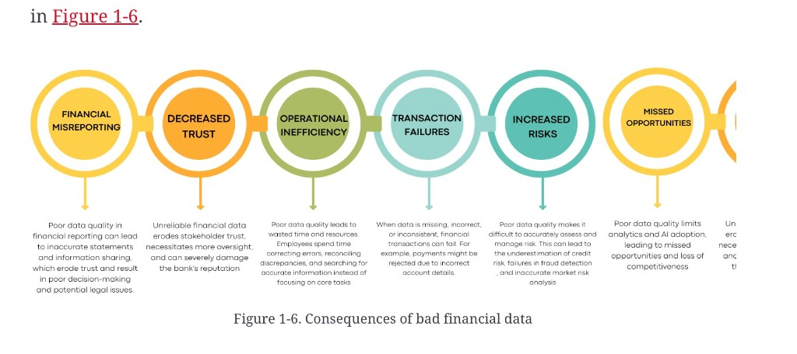

# Data quality and integrity

**See also:** [challenge map](management-challenges.md) · [characteristics](data-characteristics.md) · [reference data](reference-data.md) · [regulatory compliance](regulatory-compliance.md) · [AI adoption](ai-adoption.md)

In this domain, data is the fuel. Inaccurate, incomplete, or wrong data leads to poor decisions, flawed analytics, misreporting, failed transactions, missed risk, missed opportunity, security exposure, and losses.

*Figure 1-6. Consequences of bad financial data.* The scan crops a seventh node on the right; the six that are fully visible are listed below.

| Consequence | Figure gloss |
|---|---|
| **Financial misreporting** | Inaccurate statements and information sharing; erodes trust; poor decisions; legal exposure |
| **Decreased trust** | More oversight; reputation damage |
| **Operational inefficiency** | Time spent correcting, reconciling, and hunting for the right number |
| **Transaction failures** | Missing, wrong, or inconsistent fields (e.g. payments rejected on bad account details) |
| **Increased risks** | Credit risk understated, fraud missed, market-risk analysis wrong |
| **Missed opportunities** | Analytics and AI adoption stall; competitiveness drops |

Quality work is a collaboration: architects, data engineers, analysts, and the business. Dimensions the source chapter names:

| Dimension | The question |
|---|---|
| **Accuracy** | Is this the value that should have been recorded? |
| **Completeness** | Are required fields and related entities present? |
| **Timeliness** | Is it here in time for the decision or the report? |
| **Consistency** | Do two systems that should agree actually agree? |

Each dimension needs different controls. A late-but-correct price and an on-time-but-wrong price fail different SLOs.

The source chapter points at a later “Chapter 3” for a full treatment. That chapter is not in this bundle yet.

**Architect takeaway:** write quality as measurable contracts on the datasets that matter (identifier coverage, reconciliation breaks, as-of freshness) — not as a slogan. [Regulation](regulatory-compliance.md) will ask for the same evidence. [AI](ai-adoption.md) both consumes quality and, used carefully, can help extract it from messy text.
