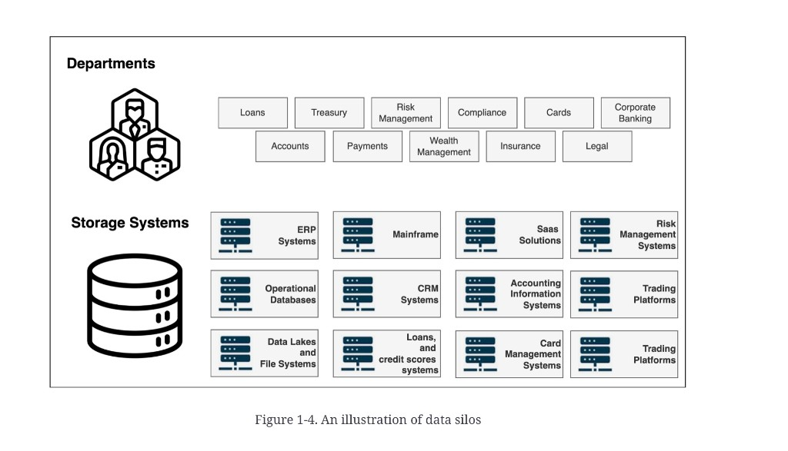

# Data silos and fragmentation

**See also:** [challenge map](management-challenges.md) · [legacy systems](legacy-systems.md) · [integration](integration-aggregation.md) · [reference data](reference-data.md)

Large institutions scatter data across systems and departments. Client data in one place, transactions in another, risk in a third. A **silo** is information isolated and managed inside a group or system.

*Figure 1-4. An illustration of data silos.* Departments on top, storage systems below — no joining lines. That missing mesh *is* the point.

| Departments (figure) | Storage systems (figure) |
|---|---|
| Loans, Treasury, Risk Management, Compliance, Cards, Corporate Banking | ERP, operational databases, data lakes and file systems |
| Accounts, Payments, Wealth Management, Insurance, Legal | Mainframe, CRM, loans and credit-score systems |
| | SaaS, accounting information systems, card management systems |
| | Risk management systems, trading platforms |

The figure labels **Trading Platforms** twice in the storage grid. Treat that as a repeated class (more than one venue stack), not two different kinds.

Silos form for organisational, cultural, *and* technological reasons. They are not only a warehouse problem.

## What they cost

A fragmented landscape blocks a unified source of truth. Effects:

- Duplication
- Inconsistency and conflicting numbers
- Barriers to sharing and collaboration
- Worse decisions

Source example: wealth management, unaware of a client’s large mortgage sitting in another system, recommends a high-risk strategy and misjudges risk tolerance.

## What actually fixes them

Not “one more warehouse.” The source chapter’s list:

- Data integration
- Governance
- Modelling
- Discovery and cataloguing
- A *centralised data management* capability (not necessarily one physical store)

See [integration and aggregation](integration-aggregation.md) for the join and rollup work this implies.

**Architect takeaway:** name the silos by *bounded context* (client, book, risk, payments), not by database brand. A shared identifier and a governed contract beat a copy-everything lake that recreates the same walls under a new name.
