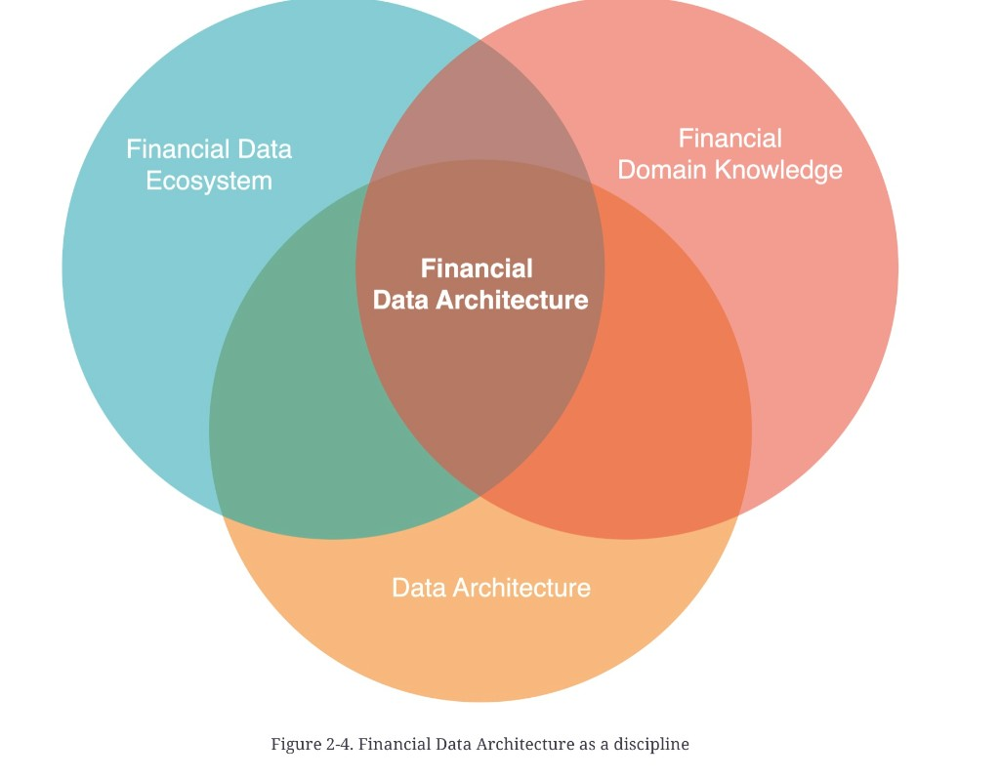

# Defining financial data architecture

**See also:** [chapter 2 map](fin-data-arch.md) · [architecture in IT](architecture-in-it.md) · [ecosystem](data-ecosystem.md) · [components](architecture-components.md) · [three roles](management-architecture-engineering.md)

## Data architecture, generally

| Source | Definition (as quoted in the chapter) |
|---|---|
| **IBM** | Describes how data is managed from collection through transformation, distribution, and consumption. Blueprint for data and how it flows through storage systems |
| **AWS** | Overarching framework that describes and governs an organisation’s data collection, management, and usage |
| **James Serra, *Deciphering Data Architectures*** | Framework for organising and managing data to support the organisation: collect, store, process, access; plus quality, security, and privacy |

Common core: a structured framework around data assets, across stages and processes, so data supports operations, analytics, and decisions.

## The chapter’s definition

Financial data architecture **builds on** those practices, patterns, and tools, then adds the specialised requirements of financial systems from [Chapter 1](introduction.md).

> A financial data architecture is a **domain-specific blueprint** for managing financial data across an organization. It defines how financial data is collected, stored, shared, consumed, and integrated, all while accommodating the complexities and nuances of the **financial data ecosystem** and ensuring that **performance and governance** requirements unique to financial markets are met.

The book treats this as a **distinct practice**, not “data architecture with a finance sticker.” Figure 2-4 is a three-circle Venn: the discipline is the overlap.

*Figure 2-4. Financial Data Architecture as a discipline.*

| Circle | Plate label |
|---|---|
| | **Financial Data Ecosystem** |
| | **Financial Domain Knowledge** |
| | **Data Architecture** |
| Centre (all three) | **Financial Data Architecture** |

**Architect takeaway:** if your blueprint could be reused unchanged for a retailer, it is not yet a *financial* data architecture. The missing pieces are usually [identifiers and restatements](data-characteristics.md), [reference data](reference-data.md), and [regime-shaped reporting](regulatory-compliance.md) — not another warehouse brand.
