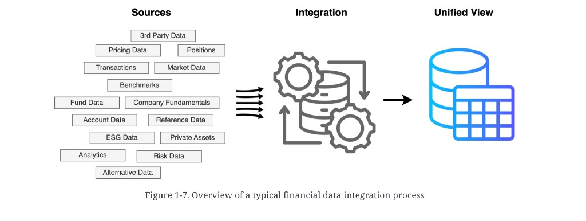

# Data integration and aggregation

**See also:** [challenge map](management-challenges.md) · [data silos](data-silos.md) · [characteristics](data-characteristics.md) · [reference data](reference-data.md) · [regulatory compliance](regulatory-compliance.md)

Institutions ingest volume and variety from internal systems, partners, fintechs, and vendors. Each source brings its own format, schema, identifiers, structure, and dependencies. The source chapter’s metaphor: a jigsaw with mismatched pieces.

*Figure 1-7. Overview of a typical financial data integration process.* Many source types → a repeating ingest/clean/transform loop → one unified view.

Source types labelled in the figure: 3rd-party data, pricing, positions, transactions, market data, benchmarks, fund data, company fundamentals, account data, reference data, ESG, private assets, analytics, risk data, alternative data.

## Integration

Unlocking value means:

- Combining formats and structures
- Reconciling fragmented identifiers
- Linking entities — instruments, issuers, counterparties, transactions — across datasets
- Producing a unified, accurate, accessible view

This is the practical face of [entity resolution](data-characteristics.md#entity-resolution-and-identifiers).

## Aggregation

A sibling problem: collect and consolidate from systems *inside* the firm. Uses the source chapter names:

| Use | Why you roll up |
|---|---|
| **Consolidated risk reporting** | Firm-wide risk, not desk-level snapshots |
| **Single customer view** | One picture of the relationship (see also [FSCS / SCV](regulatory-compliance.md)) |
| **Regulatory compliance** | Capital adequacy and other reports |
| **Fraud prevention** | Cross-system patterns |

The source prose states aggregation twice in close succession; the table is the durable distinction: integration is *across sources*, aggregation is *across the organisation*.

**Architect takeaway:** integration without an identifier map produces a bigger mess. Aggregation without lineage produces a number nobody can defend to a regulator. Design the join keys and the rollup contracts before you pick a lake or a mesh.
