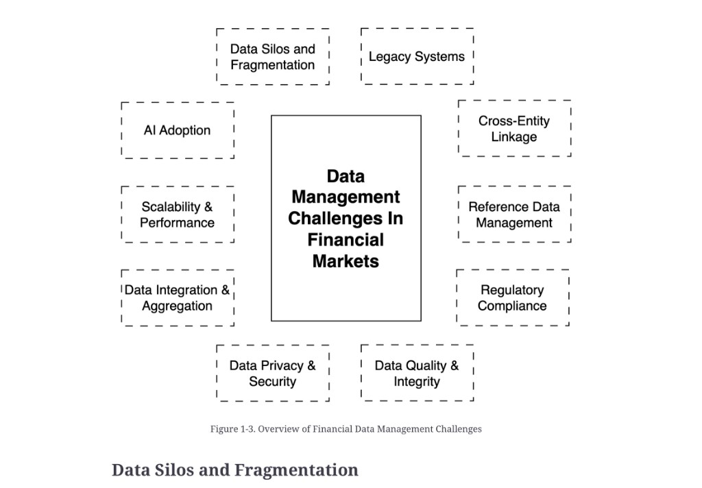

# Data management challenges in financial services

**See also:** [introduction](introduction.md) · [characteristics](data-characteristics.md) · [value chain](value-chain.md)

Some challenges are local to a firm’s structure or market. Many are persistent across the domain.

*Figure 1-3. Overview of Financial Data Management Challenges.* Ten spokes around one hub. **Standardisation** is a chapter section (see [standardisation.md](standardisation.md)) but is not a spoke here; **Cross-Entity Linkage** is a spoke and is covered under [characteristics](data-characteristics.md) and [reference data](reference-data.md).

| Spoke (Figure 1-3) | One-line | Concept |
|---|---|---|
| **Data Silos and Fragmentation** | Client, transaction, and risk live in different systems; no single source of truth | [Data silos](data-silos.md) |
| **Legacy Systems** | Mainframes and COBOL still clear; they do not integrate or evolve easily | [Legacy systems](legacy-systems.md) |
| **Cross-Entity Linkage** | Same legal entity or instrument under many identifiers and names | [Characteristics](data-characteristics.md#entity-resolution-and-identifiers) · [reference data](reference-data.md) |
| **Reference Data Management** | Slow-changing identifiers and terms, often buried in prose | [Reference data](reference-data.md) |
| **Regulatory Compliance** | Fragmented rules that are really data-architecture requirements | [Regulatory compliance](regulatory-compliance.md) |
| **Data Quality & Integrity** | Bad data → bad decisions, failed trades, missed risk, losses | [Data quality](data-quality.md) |
| **Data Privacy & Security** | High-value target; cloud and open banking add new surfaces | [Security and privacy](security-privacy.md) |
| **Data Integration & Aggregation** | Many formats and IDs; need a unified view and firm-wide rollups | [Integration and aggregation](integration-aggregation.md) |
| **Scalability & Performance** | Volume and instant-payment pressure without giving up accuracy or AML | [Scalability and performance](scalability-performance.md) |
| **AI Adoption** | Models need governed data; generative tools can also *improve* data quality | [AI adoption](ai-adoption.md) |

These are not optional extras. The source chapter’s close: remaining competitive, compliant, and secure requires a foundation of sound data architecture — not more collection and not a single vendor product.

**Architect takeaway:** pick the two or three challenges that dominate *this* system and design for those first. A greenfield analytics lake that ignores identifiers and regulation will rediscover [reference data](reference-data.md) and [BCBS 239](regulatory-compliance.md) in production. Use this table as the intake checklist.
