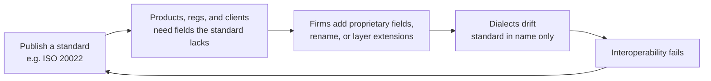

# Financial data standardisation

**See also:** [challenge map](management-challenges.md) · [types and formats](data-types-formats.md) · [reference data](reference-data.md) · [value chain](value-chain.md)

Markets run on information, so participants and agencies keep trying to standardise: common frameworks for representing, formatting, and exchanging data.

True standardisation stays elusive. Innovation, market change, and business needs constantly pressure the standard. The forces that make a standard necessary are the same forces that break it.

## The messaging cycle

A financial messaging standard (e.g. ISO 20022) starts with a clear goal: one way to exchange messages. A universal format promises lower cost, simpler integration, fewer errors, better interoperability.

Then products appear, regulations shift, clients ask for fields the standard does not have. Firms adapt by:

- Adding proprietary fields
- Reinterpreting or renaming existing ones
- Layering extensions on the base schema

Each institution’s dialect drifts. Over time “standard” messages are standard in name only. Interoperability problems return. Industry groups or regulators call for a *new* standard. Figure 1-5 in the source is the vicious-cycle picture; the original plate was not in the image set, so the cycle is recreated below from the chapter prose.

*Figure 1-5 (recreated). The vicious cycle of financial data standards.*

## The tension

Financial innovation is fluid. Standards are rigid. Locking a moving target into a fixed format produces fragmentation.

This is not an argument against standards. It is an argument against assuming that adopting ISO 20022 (or FIX, or FpML) *ends* the integration problem.

**Architect takeaway:** treat the published standard as a *core* plus a managed extension policy. Version the dialect. Map vendor and internal extensions explicitly. A “we are ISO 20022” slide that hides proprietary tags is how the cycle restarts inside your firm.
