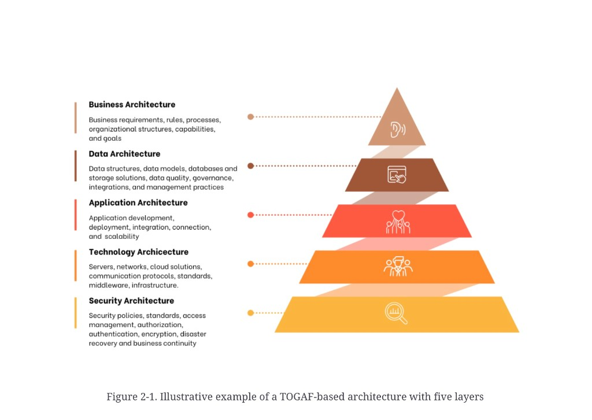
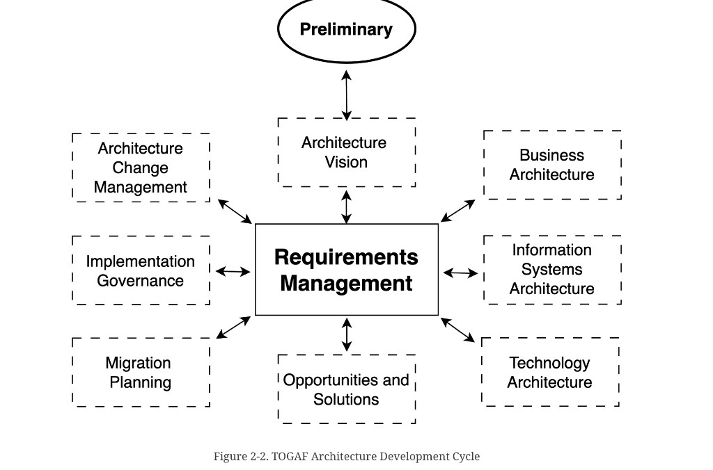
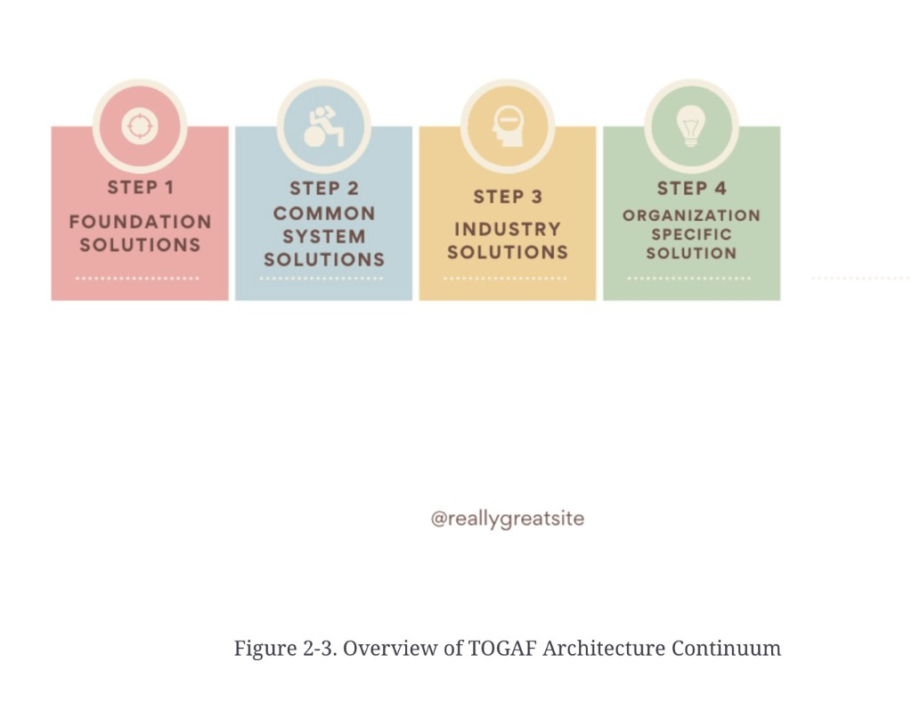

# TOGAF — domains, ADM, and the continuum

**See also:** [enterprise architecture](enterprise-architecture.md) · [architecture in IT](architecture-in-it.md) · [when standards fall short](standards-criticism.md) · [definition](defining-financial-data-architecture.md)

The Open Group Architecture Framework (TOGAF) is a high-level approach to design, plan, implement, and govern an EA. It **embraces** ISO/IEC/IEEE 42010:2011 terminology but **does not strictly follow it**. Beside the 42010 definition, TOGAF adds:

> The structure of components, their inter-relationships, and the principles and guidelines governing their design and evolution over time.

## The four domains — and a fifth layer

These work together. The prose says other domains (example: **security architecture**) are built by integrating perspectives from the four. Figure 2-1 draws security as the **base of the pyramid**, not a side box.

*Figure 2-1. Illustrative example of a TOGAF-based architecture with five layers.* Peak is business; base is security. The plate misspells the technology heading as “Archicecture.”

| Layer (peak → base) | Figure gloss |
|---|---|
| **Business architecture** | Requirements, rules, processes, organisational structures, capabilities, goals |
| **Data architecture** | Structures, models, databases and storage, quality, governance, integrations, management practices |
| **Application architecture** | Development, deployment, integration, connection, scalability |
| **Technology architecture** | Servers, networks, cloud, protocols, standards, middleware, infrastructure |
| **Security architecture** | Policies, standards, access management, authorization, authentication, encryption, disaster recovery, business continuity |

## Architecture Development Method (ADM)

ADM is the central methodology: an iterative lifecycle for establishing a framework, creating architecture content, transitioning, and governing implementation. The chapter dump said the phases “are as follows” and then skipped the list. **Figure 2-2 is the source of the names below.**

*Figure 2-2. TOGAF Architecture Development Cycle.* **Requirements Management** is the solid hub; every dashed phase has a two-way link to it. **Preliminary** is the oval entry, linked to Architecture Vision.

| Place on the plate | Phase |
|---|---|
| Entry (oval) | Preliminary |
| Hub (solid) | Requirements Management |
| 12 o’clock, clockwise | Architecture Vision → Business Architecture → Information Systems Architecture → Technology Architecture → Opportunities and Solutions → Migration Planning → Implementation Governance → Architecture Change Management |

## Architecture Continuum

Progressive refinement from generic to organisation-specific. The **prose** says Foundation / Common Systems / Industry / Enterprise-specific **architectures**. Figure 2-3 labels the same four steps as **solutions**.

*Figure 2-3. Overview of TOGAF Architecture Continuum.* Step 4 is singular (“Organization Specific Solution”). A `@reallygreatsite` watermark sits on the plate.

| Figure step | Prose name | Meaning / examples in the chapter |
|---|---|---|
| **1 Foundation Solutions** | Foundation architectures | Generic services and functions as a base. TOGAF’s own Foundation Architecture is an example |
| **2 Common System Solutions** | Common systems architectures | Reusable selections that solve shared problems: security (authn, authz, protection), network, management, operations |
| **3 Industry Solutions** | Industry architectures | Sector-specific. Example: **BIAN** (Banking Industry Architecture Network) |
| **4 Organization Specific Solution** | Enterprise-specific architectures | Tailored to one organisation |

**Architect takeaway:** TOGAF’s useful extract for this bundle is the **data domain** sitting beside business, application, and technology — plus the continuum idea that a bank should not start from a blank page when [BIAN](#architecture-continuum) already names industry building blocks. The ADM wheel is a governance loop, not a waterfall you must finish before writing a pipeline. See [criticism](standards-criticism.md) before treating ADM as a project plan.
