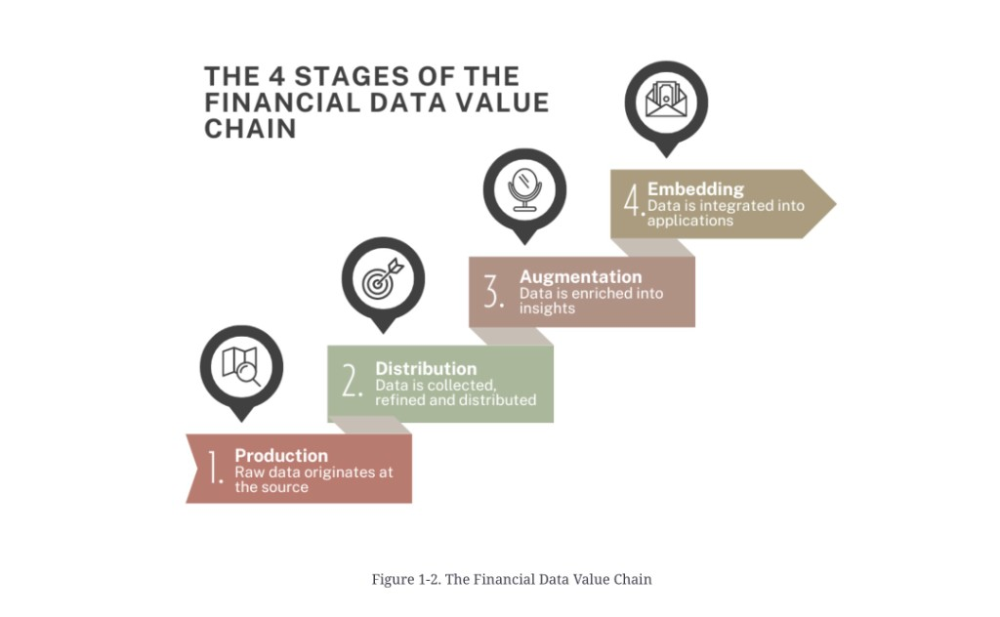

# The financial data value chain

**See also:** [ecosystem](data-ecosystem.md) · [sources](data-sources.md) · [delivery](data-delivery.md) · [standardisation](standardisation.md)

As data moves from origin to consumer it passes through a value chain. Figure 1-2 names four stages. (One line of the source prose said “production, distribution, and activation”; the figure and the body use **augmentation** and **embedding**. Treat the figure as the names of record.)

*Figure 1-2. The Financial Data Value Chain.*

| Stage | Figure gloss |
|---|---|
| **1. Production** | Raw data originates at the source |
| **2. Distribution** | Data is collected, refined and distributed |
| **3. Augmentation** | Data is enriched into insights |
| **4. Embedding** | Data is integrated into applications |

## Production

Raw data originates here. Exchanges (CME Group, NYSE, LSE, and others) match orders *and* own the resulting data. That is a dual income stream: order processing and data licensing.

Production is not only exchanges — see [generation](data-generation.md) and [sources](data-sources.md). Whoever creates the event usually owns the first record.

## Distribution

The refinery. Gather from many sources, clean, standardise, package. A trader does not want to visit every farm; they want one supplier with prices, economics, FX, news, and forecasts.

Why not go straight to the exchange? Coverage. One consumer needs many producers. Distributors are the one-stop shop.

Source-chapter examples:

- **FactSet** — gathers from hundreds of sources, standardises, delivers for analysis.
- **Databento** — market data via APIs, pay-as-you-go, low-latency dedicated connectivity.
- **Data marketplaces / exchanges** — hubs for buying and selling datasets.

Distribution is where a lot of [standardisation](standardisation.md) pain is absorbed — and where it reappears as vendor-specific “standard” schemas.

## Augmentation

Turn data into proprietary insight. **MSCI** is the source chapter’s lead example: industry-standard equity and fixed-income indices used for benchmarking, portfolio construction, risk, and product development.

Indices, scores, derived analytics, and model features live here. They are products, not raw extracts.

## Embedding

Data becomes a component of an application. The metaphor in the source is an assembly line:

1. Intermediate products — dashboards, specialised datasets, analytical frameworks.
2. Those become inputs to trading tools, analytics platforms, risk systems, investment products.

Each layer adds value and coupling. An embedded feed is harder to rip out than a file you download.

## Architect reading

| Stage | You are probably… | Failure mode |
|---|---|---|
| Production | An exchange, FMI, or institution generating the event | Treating licensing as an afterthought |
| Distribution | Integrating vendors + internal books | Assuming the vendor schema is *the* standard |
| Augmentation | Building scores, indices, features | Not versioning the derivation |
| Embedding | Putting data in a customer-facing app | Hiding lineage so you cannot explain a number |

**Architect takeaway:** name which stage you occupy. A “data platform” that tries to be producer, distributor, and product at once usually fails the identifier and quality problems of distribution. Buy or build each stage on purpose.
