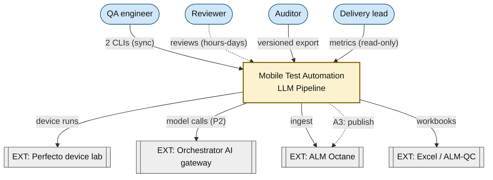
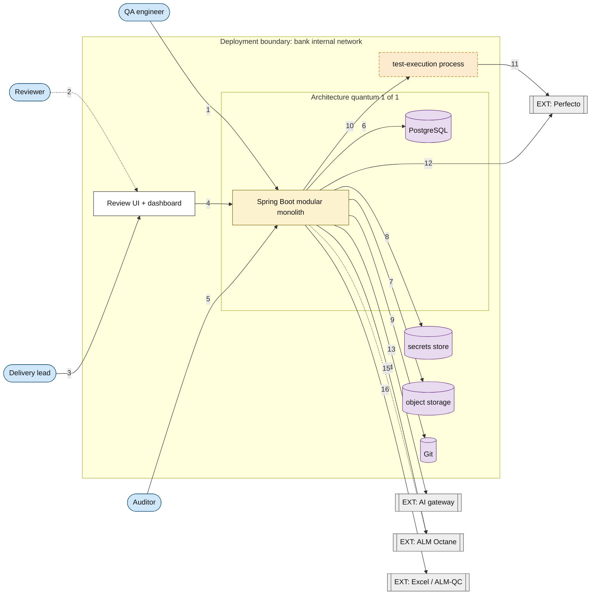
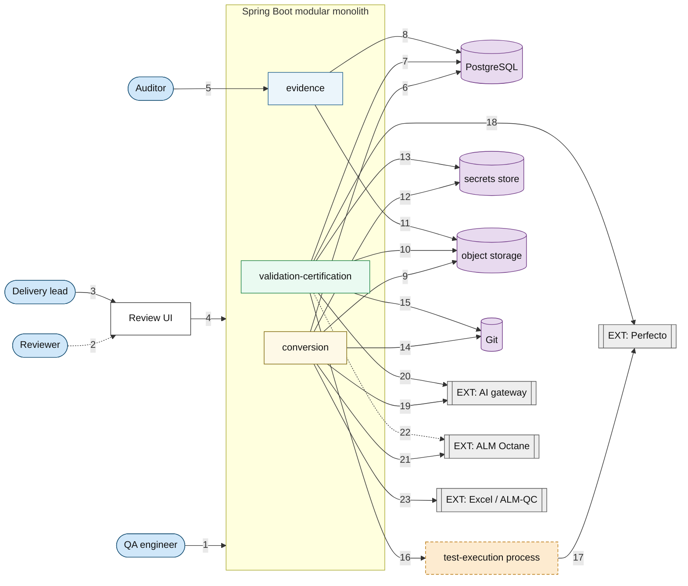
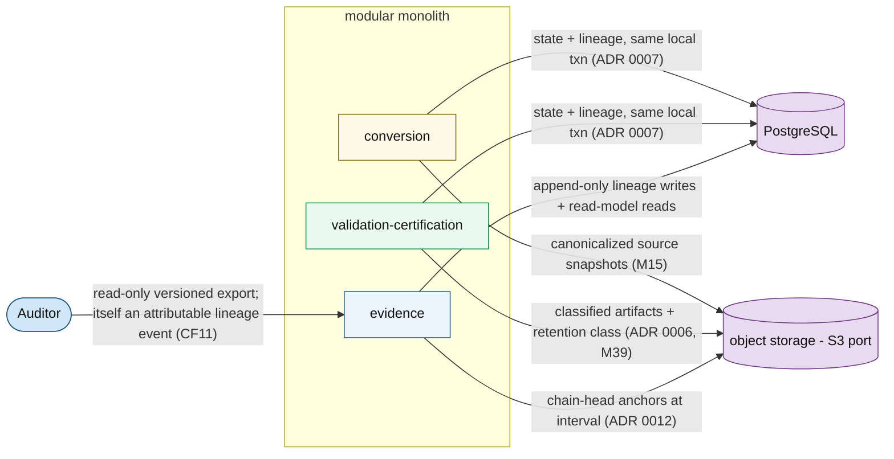
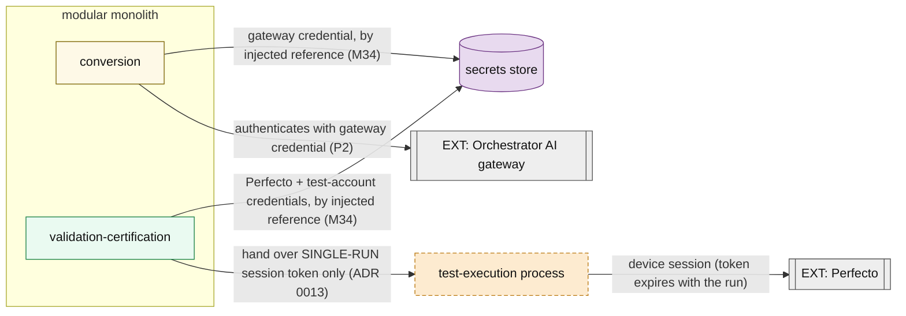
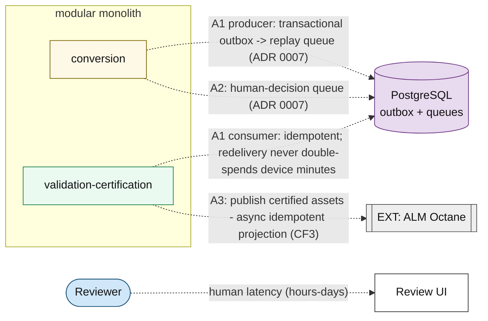
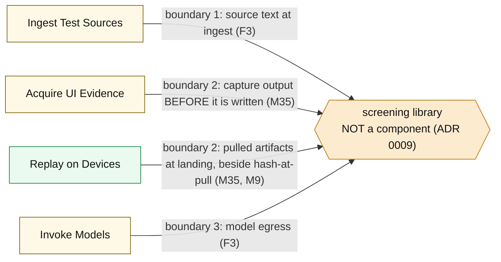

# Diagram Set — Mobile Test Automation LLM Pipeline (C4-flavored)

- **Target:** mobile-test-automation
- **Artifact home:** `docs/architecture/` (per the `[roots]` override in `.arch/binding.toml`)
- **Stage:** stage 6 (arch-validate) step 1 — the ratification redraw, **revision 5 (fact-frozen IR → D2 + linter)**
- **Mode:** kata (no implementation repo yet) → **improve-existing** via `docs/skills/generating-architecture-diagrams/` (2026-07-28)
- **Date:** 2026-07-27 rev 4 (mermaid narrative); **2026-07-28 rev 5** (D2 re-render + readability gate)
- **Notation:** C4-flavored (Context → Container → Component). **Fact-frozen IR → D2** is the strict render path (linter-gated). Mermaid below remains a topology narrative for review; it must stay edge-identical to the IR.
- **Inputs:**
  - `docs/architecture/worksheets/mobile-test-automation/characteristics-worksheet.md` (rev 3; top-3: reproducibility, security & privacy, verifiability)
  - `docs/architecture/components/mobile-test-automation/logical-components.md` (rev 3; 16 components, 3 clusters)
  - `docs/architecture/worksheets/mobile-test-automation/style-decision.md` (one quantum; plain modular monolith; async seams; F1–F7)
  - `docs/architecture/adrs/application/mobile-test-automation/0001..0013` — 0001–0010 and 0012–0013 **Accepted**; 0011 **Proposed** (blocked only on the week-0 platform probe, self-operated default recorded); 0009 amended (M35/M36), 0011 amended (M39)
  - `docs/architecture/risk/mobile-test-automation/risk-report.md` — evidence facts **E1–E6**; mitigations M1–M43; sweeps S1–S27; carry-forwards CF1–CF11; P4 row scored 6/9/9/6/9
  - `docs/sdd/specs/mobile-test-automation-spine.spec.md` (re-signed-off 2026-07-27, post-P1-mitigation baseline; C1–C5, D1)
- **Status:** STAGE-6 RATIFIED SET, **sign-off pending** — topology unchanged from rev 4; presentation improved on the D2 path. **Stage 5 is not fully closed** (P4 phase 3 and pass P5 remain); the redraw triggers at the end still govern mitigation-driven touch-ups.
- **Rendered artifacts:** `docs/mobile-test-automation-diagrams/` (IR under `ir/`; combined `*.view.md` is the review unit)

**What rev 5 changes (representation only — zero topology change):** the
rev-4 mermaid set is ingested into fact-frozen IR and rendered via D2 with
the skill's reserved shape vocabulary, short labels + detail tables, numbered
edge refs, locator captions, module colour-tracking, and density-triggered
decomposition (C2b by-module; C3a by-theme). ENV/Q1 nesting facts relocate into
`APP.detail[]` (no floating boundary boxes). Every primary and overlay PASS
`lint_diagram.py --detail`. Nothing was dropped; it was relocated.

**What rev 2–4 changed:** one-question-per-view splits, short labels + tables,
C2a high-level vs C2b module wiring, numbered edge refs, C2b un-nesting — see
git history. The view inventory:

| ID | View | Question it answers | D2 stem |
|---|---|---|---|
| C1 | Context | Who and what does the system touch? | `01-context` |
| C2a | Container — deployment topology (high level) | What containers exist, and what talks to what? | `02-container` |
| C2b | Container — module wiring | Which module owns which store/external edge? | `03-container-module-wiring` |
| C2c | Container — evidence & provenance flows | Where do snapshots, artifacts, lineage, and anchors go? | `04-container-evidence` |
| C2d | Container — credential topology | Who holds which credential — and who does not? | `05-container-credentials` |
| C2e | Container — async edges & queues | Which edges are queued, and on what machinery? | `06-container-async` |
| C3a | Component — module flow | How does a conversion move through the 16 components? | `07-component` |
| C3b | Component — screening boundaries | Where does untrusted content get screened (ADR 0009)? | `08-component-screening` |
| C3c | Component — provenance & pinning | Who writes lineage, carrying what? | `09-component-provenance` |

Representational consistency rule in force: each deeper view opens by locating
itself in the previous one — C2a opens the single system box from C1; C2b opens
the monolith container from C2a at module grain; C3a opens it at component
grain. Each overlay (C2c–e, C3b–c) opens by naming its base view and states
that it repeats a **subset** of the base view's elements; an overlay is never
the complete edge set. No fragment is presented cold. The completeness
references are C2a (container grain), C2b (module grain), and C3a (component
grain). **Views at one level redraw as a set** — a topology change that
touches one Container view must be checked against all five.

---

## Rendered artifact set (SVG)

**Source of truth for renders:** the fact-frozen IR files in
`docs/mobile-test-automation-diagrams/ir/`. Topology is identical to the
mermaid in this file. Readability edits relocate detail into tables — they do
not add or drop edges. Prefer the combined `*.view.md` (image + numbered
explainer + edge table) for review.

| Artifact | Vector / review unit | Raster preview |
|---|---|---|
| C1 Context | [`01-context.view.md`](../../../mobile-test-automation-diagrams/01-context.view.md) · [svg](../../../mobile-test-automation-diagrams/01-context.svg) | [`01-context@2x.png`](../../../mobile-test-automation-diagrams/01-context@2x.png) |
| C2a Container topology | [`02-container.view.md`](../../../mobile-test-automation-diagrams/02-container.view.md) · [svg](../../../mobile-test-automation-diagrams/02-container.svg) | [`02-container@2x.png`](../../../mobile-test-automation-diagrams/02-container@2x.png) |
| C2b Module wiring (primary) | [`03-container-module-wiring.view.md`](../../../mobile-test-automation-diagrams/03-container-module-wiring.view.md) · [svg](../../../mobile-test-automation-diagrams/03-container-module-wiring.svg) | [`03-container-module-wiring@2x.png`](../../../mobile-test-automation-diagrams/03-container-module-wiring@2x.png) |
| C2b by-module overlays | [`overlays/`](../../../mobile-test-automation-diagrams/overlays/) — module-a / module-b / module-c / unclustered | each `*-@2x.png` under overlays |
| C2c Evidence flows | [`04-container-evidence.view.md`](../../../mobile-test-automation-diagrams/04-container-evidence.view.md) | [`04-container-evidence@2x.png`](../../../mobile-test-automation-diagrams/04-container-evidence@2x.png) |
| C2d Credential topology | [`05-container-credentials.view.md`](../../../mobile-test-automation-diagrams/05-container-credentials.view.md) | [`05-container-credentials@2x.png`](../../../mobile-test-automation-diagrams/05-container-credentials@2x.png) |
| C2e Async edges & queues | [`06-container-async.view.md`](../../../mobile-test-automation-diagrams/06-container-async.view.md) | [`06-container-async@2x.png`](../../../mobile-test-automation-diagrams/06-container-async@2x.png) |
| C3a Component flow (primary) | [`07-component.view.md`](../../../mobile-test-automation-diagrams/07-component.view.md) · [svg](../../../mobile-test-automation-diagrams/07-component.svg) | [`07-component@2x.png`](../../../mobile-test-automation-diagrams/07-component@2x.png) |
| C3a by-theme overlays | [`overlays/`](../../../mobile-test-automation-diagrams/overlays/) — structural / provenance / model-call / external-boundary | each `*-@2x.png` under overlays |
| C3b Screening boundaries | [`08-component-screening.view.md`](../../../mobile-test-automation-diagrams/08-component-screening.view.md) | [`08-component-screening@2x.png`](../../../mobile-test-automation-diagrams/08-component-screening@2x.png) |
| C3c Provenance & pinning | [`09-component-provenance.view.md`](../../../mobile-test-automation-diagrams/09-component-provenance.view.md) | [`09-component-provenance@2x.png`](../../../mobile-test-automation-diagrams/09-component-provenance@2x.png) |

Supporting files: IR under
[`ir/`](../../../mobile-test-automation-diagrams/ir);
grayscale proofs in [`proofs/`](../../../mobile-test-automation-diagrams/proofs);
[`SELF-AUDIT.md`](../../../mobile-test-automation-diagrams/SELF-AUDIT.md).
Gate: `python3 docs/skills/generating-architecture-diagrams/scripts/lint_diagram.py`
with `--detail` (must exit 0). Re-render:
`bash docs/skills/generating-architecture-diagrams/scripts/render.sh ir/<view>.json .`
from `docs/mobile-test-automation-diagrams/`.

### Render conformance — 2026-07-28 (D2 / linter)

| Check | Result |
|---|---|
| Every canvas label verbatim (9 primaries + 8 overlays) | PASS |
| Overlay parity `union(overlays) == primary` | PASS (C2b 4 by-module; C3a 4 by-theme) |
| Relocated facts grounded in detail tables | PASS |
| Shape vocabulary (pill / rect / `EXT:` / cylinder-only-datastore / hexagon screening / dash process) | PASS |
| Quantum/deployment facts (no floating boundary) | PASS (ENV/Q1 in `APP.detail[]`; C2a `allow_deployment: true`) |
| Solid=sync / dashed=async / thick entangled CERTIFY_CONVERSION→INVOKE_MODELS | PASS |
| Grayscale legibility | PASS (`proofs/*-gray.png`) |
| No invented vendor / region / SLA figures | PASS (`SLA: UNKNOWN`, `WORKING ASSUMPTION`, `BINDING PROBE-PENDING`, `PENDING`, `STUBBED IN SPINE` retained) |

---

## 0. Shared key (applies to all views)

| Channel | Convention |
|---|---|
| **Shapes** | Stadium `([..])` = person/actor. Rectangle `[..]` = system / container / component / module boundary. Dash-bordered rectangle = runtime process (not a deployable). Double-bordered rectangle `[[..]]` with `EXT:` prefix = external system. Cylinder `[(..)]` = datastore **only**. Hexagon `{{..}}` = the screening library — deliberately *not* a component shape, because ADR 0009 records that it is not a component. |
| **Colors** | Same semantic → same fill/stroke in every view (paired with shape; never color alone — guideline 5). **Person** blue `#d0e7f9`/`#1a5276`. **System / opaque monolith** gold `#fdf2d0`/`#7d6608`. **Module A (conversion)** pale gold `#fef9e7`/`#7d6608`. **Module B (validation-certification)** green `#eafaf1`/`#1e8449`. **Module C (evidence)** blue `#ebf5fb`/`#21618c`. **UI / component** white `#ffffff`/`#333`. **Runtime process / screening library** amber `#fdebd0`/`#b9770e` (process also dash-bordered). **Store** purple `#e8daef`/`#6c3483`. **External** gray `#eeeeee`/`#555`. **Location-only (faded)** light gray fill + muted stroke — C3 only, for stores/externals drawn for orientation. |
| **Lines** | Solid arrow `-->` = synchronous request/response. Dotted arrow `-.->` = asynchronous (queue / event / projection / human-latency). Arrowhead = direction of information flow at initiation; responses are implied and not drawn. Thick arrow `==>` marks the one deliberate cluster-B→A entanglement edge (ADR 0004) so it cannot be skimmed past. |
| **Node labels** | Short names only. Every ADR tag, E-fact, honesty tag, and M-rule lives in the **node-detail table directly below each view**, keyed by node ID. A reader must treat label + table row as one unit. |
| **Edge labels (C2a/C2b)** | Numbered refs only (`1`..`N`) on the canvas. Word labels on edges collide with node borders and subgraph lines under Mermaid's layout engine; the full claim lives in the per-view edge-detail table keyed by number. Sync = solid arrow, async = dotted — mode is also restated in the table. Other views keep short verb labels where they do not collide. |
| **Async naming** | `A1..A2` are the two internal async seams ADR 0007 permits; `A3` is the outbound **certify-locally / publish-async** projection (CF3/M17) that reuses the same outbox machinery — decided at stage 5, live in weeks 3–8. Anything else drawn dotted is human latency at the edge, not an internal seam. |
| **Phase tags** | `P1` = Phase 1 (Copilot-era: reasoning by a human in an IDE), `P2` = Phase 2 (direct gateway calls). Per ADR 0001 the cutover is a configuration change at one seam; the diagrams must therefore look identical across phases except at that seam's annotation. |
| **Evidence tags** | `E1` Perfecto incumbent (MSA on file, unread). `E2` mock/synthetic data only ("mostly" — residual entry kept). `E3` bank validated internal network bounds the internal components; explicitly does NOT cover the Perfecto connection. `E4` gateway model providers hosted inside the bank. `E5` the object repository **is ALM Octane**. `E6` an existing secure-SDLC standard is inherited, unread. From risk-report §8. |
| **Honesty tags** | `WORKING ASSUMPTION` marks PostgreSQL (spine C3). `BINDING PROBE-PENDING` marks the object store's production binding (ADR 0011 — port decided, binding decided by the week-0 platform probe, self-operated MinIO default). `PENDING` marks the secrets-store vault (named by the M33 controls-baseline read). `STUBBED IN SPINE` marks the object-repository read (spine C5). `SLA: UNKNOWN (pending)` on external edges where no SLA figure is on file. Pending-ness is carried by **table text only**, never by line style. No SLA figure, vendor term, or probe answer is invented. |
| **ADR tags** | 0001 model seam, 0002 cache key, 0003 orchestration, 0004 sync fidelity grade, 0005 style/modules, 0006 data topology, 0007 queues+outbox, 0008 edge topology, 0009 screening library (amended: boundaries by data class), 0010 security-review track, 0011 S3-port object storage (Proposed; amended: crypto-shredding), 0012 tamper-evident lineage, 0013 execution isolation. |
| **Provenance edges** | On view C3c, the thirteen unlabeled directed edges into Preserve Provenance all mean the same thing: *"writes its lineage row in the same local transaction as its state change (ADR 0007), carrying the pinning fields (F6), the authenticated principal (M37), the per-conversion chain link (ADR 0012), the corpus class (M19), the retention class (M39), and the writer's build identity (M32)."* Labeled once here instead of thirteen times on the canvas; the writers are enumerated in the provenance register. |

---

## 1. C1 — CONTEXT view: the system in its world

**Rendered:** [`01-context.view.md`](../../../mobile-test-automation-diagrams/01-context.view.md)
· [svg](../../../mobile-test-automation-diagrams/01-context.svg)
· [PNG](../../../mobile-test-automation-diagrams/01-context@2x.png)
· [grayscale proof](../../../mobile-test-automation-diagrams/proofs/01-context-gray.png)
· IR [`ir/01-context.json`](../../../mobile-test-automation-diagrams/ir/01-context.json).

The whole. The conversion-and-certification pipeline, its four actor classes,
and its external dependencies. The single system box drawn here is opened in
C2a. The fifth actor from style-decision §6 — the Phase 2 orchestrator — is
headless and internal, so it has no edge and does not appear: that absence
*is* the finding ("Phase 2 adds no new edge").

### C1 node detail

| Node | Detail the short label hides |
|---|---|
| QA | IDE + 2 CLIs. **In P1 the conversion reasoning happens in THIS actor's IDE** (Copilot, ADR 0001); the system receives only committed artifacts |
| REVIEWER | HITL queue; responds in hours–days |
| AUDITOR | Must reconstruct verdicts from stored evidence alone, without access to the running system (ADR 0008) |
| LEAD | Read-only metrics |
| SYS | ACCEPTED: Spring Boot modular monolith, ONE architecture quantum (ADR 0005). Runs inside the bank's validated internal network (E3). Opened in C2a |
| PERFECTO | INCUMBENT vendor — MSA on file, **unread** against this system's needs (E1). Flows run on mock/synthetic data (E2); artifacts produced OFF-PREM. **NOT covered by E3.** SLA: UNKNOWN (pending — probe = read the MSA, M1) |
| GATEWAY | Internal gateway; model providers hosted INSIDE the bank — prompts never leave (E4). Version-report contract UNVERIFIED (M5 probe held). SLA: UNKNOWN (pending — M4 consolidated inquiry) |
| OCTANE | **At BOTH ends of the pipeline (E5):** ingest source (REST, API-key) AND certified-asset publish target. Asset-versioning capability UNVERIFIED (M7 probe held). SLA: UNKNOWN (pending) |
| XLS | Excel workbooks + ALM-QC later (additive — C1). File input originating from bank teams inside the network (E3/S9). "The least deterministic input" — M16 real-workbook corpus is the probe |

### C1 edge detail

| Edge | Detail the short label hides |
|---|---|
| QA → SYS | Ingestion CLI + hierarchy-tool CLI, sync |
| REVIEWER ⇢ SYS | Review of ambiguous / sub-threshold cases; async, hours–days |
| AUDITOR → SYS | Read-only versioned export — no access to the running system (ADR 0008); the export is itself an attributable lineage event (CF11) |
| LEAD → SYS | Metrics dashboard, sync, read-only |
| SYS → PERFECTO | Device runs on pinned pools (sync); single-run session tokens (ADR 0013) |
| SYS → GATEWAY | Model calls via the Invoke Models seam, P2 (sync) |
| SYS → OCTANE (ingest) | Manual-test ingest, sync, REST |
| SYS ⇢ OCTANE (A3) | Publish certified assets — async, retryable, idempotent projection, **never a verdict precondition** (CF3; weeks 3–8) |
| SYS → XLS | Workbook file input |

**View notes.**

- **The QA engineer's edge is the P1 architecture's most unusual fact:** in
  Phase 1 the LLM reasoning is not in the system at all — it is a human in an
  IDE with Copilot, and the system receives only committed artifacts. The
  gateway edge exists from day one for the fidelity grade (ADR 0004) and
  becomes the P2 reasoning path via a configuration change (ADR 0001).
- **Octane's dual role is a concentration, and it is drawn as one box on
  purpose:** the risk report records the consequence (E5) — an Octane incident
  now touches intake and publication at once. Drawing two boxes would hide
  that coupling; the async publish edge (CF3) is what keeps the incident a
  delay rather than a verdict blocker.
- Git is not drawn here although prompts/exemplars/golden set live in it: the
  sources treat Git as the system's own asset store (style-decision §3), so it
  appears as a datastore in the Container views, not as an external
  dependency.

---

## 2. C2a — CONTAINER view: deployment topology (high level)

**Rendered:** [`02-container.view.md`](../../../mobile-test-automation-diagrams/02-container.view.md)
· [svg](../../../mobile-test-automation-diagrams/02-container.svg)
· [PNG](../../../mobile-test-automation-diagrams/02-container@2x.png)
· [grayscale proof](../../../mobile-test-automation-diagrams/proofs/02-container-gray.png)
· IR [`ir/02-container.json`](../../../mobile-test-automation-diagrams/ir/02-container.json).

**Locator:** this view opens the single box `SYS` from C1. Everything inside
the quantum subgraph below *is* that box; actors and external systems are the
same elements as C1. **Structure and synchronous data flow only, at container
grain** — the monolith is one opaque box here. Which module owns each edge is
C2b; evidence flows are C2c; credentials are C2d; async edges are C2e.

### C2 node detail (shared by C2a–C2e)

| Node | Detail the short label hides |
|---|---|
| ENV | On-premises, bank validated internal network — no external party has access (ADR 0006; E3). Perfecto, the gateway, Octane, and workbook sources sit **outside** it |
| Q1 | One deployable + one primary datastore = the single architecture quantum (ADR 0005). Object storage, Git, and the secrets store are on-premises but outside the quantum: they have their own lifecycles |
| APP | Module boundaries are the three clusters, NOT the blueprint's five pipeline stages (ADR 0005). Drawn opaque in C2a; opened at module grain in C2b and at component grain in C3a |
| WEB | One authenticated internal API, no BFF (ADR 0008). SSO against the bank IdP is a HARD requirement, not a nice-to-have (M37). The ONLY UI in Phase 1 |
| CONVERSION | Conversion (cluster A) — 10 components incl. the Invoke Models seam |
| VALIDATION_CERTIFICATION | Validation-certification (cluster B) — 5 components; static gate → device gate → classify → certify. Device-gate worker holds NO gateway credential (ADR 0013) |
| EVIDENCE | Evidence (cluster C) — Preserve Provenance + metrics read model + auditor export |
| POSTGRESQL | **WORKING ASSUMPTION** (spine C3); dev/CI embedded or containerized, ephemeral-only (D1, M40). Schemas: conversion-state · lineage (append-only: app role INSERT/SELECT only, per-conversion hash chain, supersede-not-update — ADR 0012) · outbox+queue (bounded retries, dead-letter quarantine — M21) · judge-response cache (M27, CF7). No cross-lifecycle foreign keys (F4, ADR 0006) |
| TEST_EXECUTION | Test-execution process, spawned per device run. Separate OS process — shape committed NOW, sandbox technology weeks 3–8 (ADR 0013). NO long-lived credentials; single-run device session token; NEVER the gateway credential. Static capability rules gate entry (supplement, not the control) |
| SECRETS_STORE | Interim: CI secret store; the vault is named by the M33 controls-baseline read — **PENDING**. All credentials resolved by injected reference, never literals (M34/CF8) |
| OBJECT_STORAGE | Evidence object storage behind an **S3-compatible port** (ADR 0011). Dev/CI: containerized MinIO; production **BINDING PROBE-PENDING** (week-0 platform probe; default = self-operated MinIO). Write-once / object-lock REQUIRED — ADR 0012's precondition, deployment-checked. Holds: classified artifacts + retention classes (M39) · canonicalized source snapshots (M15) · lineage chain anchors (ADR 0012). Envelope encryption + crypto-shredding before the first audit-retained artifact (ADR 0011 as amended) |
| GIT | Prompts / exemplars / golden set / test code; version identity is free |
| PERFECTO / GATEWAY / OCTANE / XLS | Same standing as the C1 node-detail table (E1/E2, E4, E5, E3/S9) |

**View notes.**

- **Quantum boundary:** the `Q1` subgraph is the single architecture quantum —
  the monolith and its primary datastore deploy and version as one unit
  (style-decision §2).
- **The test-execution process is a runtime child, not a deployable.** It is
  drawn dash-bordered and outside `Q1` because it is spawned per run and
  generated code never loads into the orchestrator's process (ADR 0013) — but
  it is not a second quantum: it has no datastore, no lifecycle, and no
  deployment pipeline of its own. In the spine it runs the hand-written
  reference test; the shape exists from the first commit so the weeks-3–8
  retrofit never happens.
- **The queue is not a broker box.** Spine C2 permits a DB-backed queue at
  first, so the replay and human-decision queues are drawn as schemas inside
  the primary store (see C2e). If a real broker is introduced later, this view
  gains a container and must be redrawn.
- **Rolled-up edges are container-grain claims only.** `APP → Perfecto` says
  the monolith talks to Perfecto; it does NOT say every module may. Edge
  ownership is the one question C2b answers — module-grain arguments must
  cite C2b, not this view. The auditor's edge targets `APP` here for the same
  reason; C2b restores its true target (the evidence module).
- Sync-only edge detail (build identity on CLI emissions M32, hash-at-ingest
  M15, screened-at-landing M35, advisory fidelity grade CF9) is carried by the
  C2c/C2d tables and the external-edge register under C2b — not repeated here.

### C2a edge detail (rolled-up edges, expanded)

Canvas carries **numbered edge refs only** (1–16) — word labels on edges
collided with node borders and subgraph lines under Mermaid's layout engine
(rev-4 overlap). Read each number against this table. Module ownership of each
rolled-up edge is in C2b. Sync = solid; async = dotted (edges 2, 15).

| # | Edge | Mode | Claim |
|---|---|---|---|
| 1 | QA → APP | sync | 2 CLIs (ingestion + hierarchy-tool), no BFF (ADR 0008) |
| 2 | REVIEWER ⇢ WEB | async | Review queue; human latency, hours–days |
| 3 | LEAD → WEB | sync | Read-only metrics dashboard |
| 4 | WEB → APP | sync | One authenticated internal API; SSO against bank IdP (M37) |
| 5 | AUDITOR → APP | sync | Versioned export; targets the evidence module at module grain (C2b). Itself an attributable lineage event (CF11) |
| 6 | APP → POSTGRESQL | sync | State + lineage, same local transaction (ADR 0007) — rolled up from CONVERSION/VALIDATION_CERTIFICATION/EVIDENCE in C2b |
| 7 | APP → OBJECT_STORAGE | sync | Snapshots + classified artifacts + chain anchors (rolled up from CONVERSION/VALIDATION_CERTIFICATION/EVIDENCE in C2b) |
| 8 | APP → SECRETS_STORE | sync | All credentials resolved by injected reference, never literals (M34/CF8) |
| 9 | APP → GIT | sync | Versioned assets (prompts / exemplars / golden set / test code) |
| 10 | APP → TEST_EXECUTION | sync | Spawn per device run (ADR 0013) |
| 11 | TEST_EXECUTION → PERFECTO | sync | Single-run device session token (ADR 0013) |
| 12 | APP → PERFECTO | sync | Pool + artifact pull; dominant cost (VALIDATION_CERTIFICATION-owned — C2b) |
| 13 | APP → GATEWAY | sync | Model calls (P2) + fidelity grade (ADR 0004) — CONVERSION/VALIDATION_CERTIFICATION-owned (C2b) |
| 14 | APP → OCTANE | sync | Manual-test ingest, API-key (CONVERSION-owned — C2b) |
| 15 | APP ⇢ OCTANE | async | A3: publish certified assets — idempotent projection (CF3); never a verdict precondition |
| 16 | APP → XLS | sync | Workbook file input (CONVERSION-owned — C2b) |

---

## 2b. C2b — CONTAINER drill-down: module wiring

**Rendered:** [`03-container-module-wiring.view.md`](../../../mobile-test-automation-diagrams/03-container-module-wiring.view.md)
· [svg](../../../mobile-test-automation-diagrams/03-container-module-wiring.svg)
· [PNG](../../../mobile-test-automation-diagrams/03-container-module-wiring@2x.png)
· by-module overlays under [`overlays/`](../../../mobile-test-automation-diagrams/overlays/)
· IR [`ir/03-container-module-wiring.json`](../../../mobile-test-automation-diagrams/ir/03-container-module-wiring.json).

**Locator:** this view opens the `APP` box from C2a into its three modules.
Same containers, stores, and externals as C2a; every rolled-up C2a edge
reappears here at module grain. The outer `ENV` and `Q1` wrappers are dropped
— C2a already establishes the deployment boundary and the quantum; repeating
them here only crushes the canvas. **This is the completeness reference for
module-granular edges** — the C2c–e overlays each repeat a subset of it.
Node detail is in the C2 node table above.

**View notes.**

- **This view exists to name owners.** Each external and store edge that C2a
  rolls up is claimed here by exactly one module — e.g. only VALIDATION_CERTIFICATION touches
  Perfecto and spawns the execution process; only CONVERSION ingests from Octane and
  reads workbooks; only EVIDENCE anchors the lineage chain. An edge with no owner
  here does not exist.
- The two credential-relevant facts (only CONVERSION holds the gateway credential;
  TEST_EXECUTION holds no long-lived credential at all) are drawn properly in C2d — the
  wiring here shows *who calls*, not *who authenticates as what*.
- `QA → APP` and `WEB → APP` stay at container grain even here: the CLIs and
  the internal API are APP-level entry points (ADR 0008); their component
  targets appear in C3a.

### C2b edge detail (module wiring, expanded)

Canvas carries **numbered edge refs only** (1–23) — same overlap discipline as
C2a. External-edge standing/probes are in the register below (keyed by the
module-grain edge, not the number).

| # | Edge | Mode | Claim |
|---|---|---|---|
| 1 | QA → APP | sync | 2 CLIs (ingestion + hierarchy-tool), no BFF (ADR 0008) |
| 2 | REVIEWER ⇢ WEB | async | Review queue; human latency, hours–days |
| 3 | LEAD → WEB | sync | Read-only metrics dashboard |
| 4 | WEB → APP | sync | One authenticated internal API; SSO against bank IdP (M37) |
| 5 | AUDITOR → EVIDENCE | sync | Versioned export; itself an attributable lineage event (CF11) |
| 6 | CONVERSION → POSTGRESQL | sync | State + lineage, same local transaction (ADR 0007) |
| 7 | VALIDATION_CERTIFICATION → POSTGRESQL | sync | State + lineage, same local transaction (ADR 0007) |
| 8 | EVIDENCE → POSTGRESQL | sync | Append-only lineage writes + read-model reads |
| 9 | CONVERSION → OBJECT_STORAGE | sync | Canonicalized source snapshots (M15) |
| 10 | VALIDATION_CERTIFICATION → OBJECT_STORAGE | sync | Classified artifacts + retention class (ADR 0006, M39) |
| 11 | EVIDENCE → OBJECT_STORAGE | sync | Chain-head anchors at interval; a stale anchor is an alert (ADR 0012) |
| 12 | CONVERSION → SECRETS_STORE | sync | Gateway credential, by injected reference (M34) |
| 13 | VALIDATION_CERTIFICATION → SECRETS_STORE | sync | Perfecto + test-account credentials, by injected reference (M34) |
| 14 | CONVERSION → GIT | sync | Versioned assets (prompts / exemplars / golden set / test code) |
| 15 | VALIDATION_CERTIFICATION → GIT | sync | Grow exemplar + golden set |
| 16 | VALIDATION_CERTIFICATION → TEST_EXECUTION | sync | Spawn per device run (ADR 0013) |
| 17 | TEST_EXECUTION → PERFECTO | sync | Single-run device session token; expires with the run (ADR 0013) |
| 18 | VALIDATION_CERTIFICATION → PERFECTO | sync | Pool + artifact pull; dominant cost |
| 19 | CONVERSION → GATEWAY | sync | Model calls (P2) via the Invoke Models seam |
| 20 | VALIDATION_CERTIFICATION → GATEWAY | sync | Fidelity grade (ADR 0004); from day one |
| 21 | CONVERSION → OCTANE | sync | Manual-test ingest, API-key; hash-at-ingest (M15) |
| 22 | VALIDATION_CERTIFICATION ⇢ OCTANE | async | A3: publish certified assets (CF3); never a verdict precondition |
| 23 | CONVERSION → XLS | sync | Workbook file input; raw workbooks never enter Git (M35) |

### External-edge register (every external edge, honestly)

Still no SLA **figure** on file for any external dependency — but the E-facts
changed what each unknown means and shrank most probes. Held items carry their
register scores from the P3 pass.

| Edge (C2b) | Mode | Standing | Probe that resolves it |
|---|---|---|---|
| VALIDATION_CERTIFICATION → Perfecto (pool + artifact pull) | sync; dominant cost | E1: incumbent vendor, MSA on file **unread**; E2: mock data. SLA figure still UNKNOWN. Artifacts hashed at landing (M9) + screened at landing (M35) | Read the MSA against this system's needs (M1): retention/deletion terms, region, `perfecto:ai` processing, SLA/SLO, pool-churn policy. Week-0 named accounts (M8) |
| TEST_EXECUTION → Perfecto (device session) | sync, per run | Single-run session token assumed, **unverified** (ADR 0013) | The M8 access request + M1 MSA read confirm or deny short-lived session credentials; fallback recorded in ADR 0013 |
| CONVERSION → gateway (model calls, P2) | sync via the Invoke Models seam; P1 makes no runtime model call | E4: providers inside the bank — egress question **resolved**; version-report contract still UNVERIFIED | M4 consolidated inquiry: SLO, quotas, entitlements; **and the version-reporting contract** (M5, held 9) — load-bearing for ADR 0002's cache key and F6's pinning set |
| VALIDATION_CERTIFICATION → gateway (fidelity grade) | sync, from day one (ADR 0004) | Same standing; mitigated — grades are recorded evidence, never re-derived (CF7) | Same M4/M5 probe; an outage delays new grades without invalidating old ones |
| CONVERSION → Octane (ingest) | sync, API-key; hash-at-ingest snapshot digest (M15) | E5 names the system; availability terms UNKNOWN | Octane availability terms + credential/network lead time — the spine's #1 break risk |
| VALIDATION_CERTIFICATION ⇢ Octane (publish, A3) | async projection (CF3), weeks 3–8; single-writer | E5: same system as ingest — the dual-role concentration is recorded; versioning UNVERIFIED (M7, S7 held 6) | M7 probe: asset-versioning/audit semantics + the single-writer convention with the Octane owners; on confirmation the verdict records the published asset version (CF5) |
| CONVERSION → Excel workbooks | file input; no SLA concept applies; raw workbooks never enter Git (M35) | E3/S9: bank-internal origin | M16 week-0 corpus request (10–20 real workbooks); fixtures are screened output only (M35) |

---

## 2c. C2c — CONTAINER overlay: evidence & provenance flows

**Rendered:** [`04-container-evidence.view.md`](../../../mobile-test-automation-diagrams/04-container-evidence.view.md)
· [svg](../../../mobile-test-automation-diagrams/04-container-evidence.svg)
· IR [`ir/04-container-evidence.json`](../../../mobile-test-automation-diagrams/ir/04-container-evidence.json).

**Locator:** a subset of C2b (the module-wiring view) — only the elements and
edges that carry evidence, lineage, snapshots, and anchors. Node detail is in
the C2 node table above.

**View notes.**

- **Every lineage write is synchronous and transactional** — same local
  transaction as the state change it describes (ADR 0007). An async audit
  write creates lineage gaps under failure, and a lineage gap is an
  auditability failure, not a performance detail. The chain link commits
  inside the same transaction (ADR 0012): a partially chained lineage is not
  representable.
- **A stale chain anchor is an alert** (ADR 0012) — the anchor edge is the
  tamper-evidence mechanism, not a backup.
- The auditor's edge is an **export, not a dashboard** — the stage-1 measure
  is reconstruction "from stored evidence alone" (ADR 0008); per CF11 each
  export is itself recorded: who exported what, when.

---

## 2d. C2d — CONTAINER overlay: credential topology

**Rendered:** [`05-container-credentials.view.md`](../../../mobile-test-automation-diagrams/05-container-credentials.view.md)
· [svg](../../../mobile-test-automation-diagrams/05-container-credentials.svg)
· IR [`ir/05-container-credentials.json`](../../../mobile-test-automation-diagrams/ir/05-container-credentials.json).

**Locator:** a subset of C2b (the module-wiring view) — who resolves which
credential, and the one absence that matters most. Node detail is in the C2
node table above.

**View notes.**

- **The load-bearing absence: no edge from TEST_EXECUTION or VALIDATION_CERTIFICATION to GATEWAY.** The gateway
  credential never appears on the execution side of this view — executing a
  test needs no model access (ADR 0013). The device-gate worker (VALIDATION_CERTIFICATION) holds no
  gateway credential; the execution process holds no long-lived credential at
  all.
- All credentials are resolved by injected reference, never literals
  (M34/CF8); the vault behind SECRETS_STORE is **PENDING** the M33 controls-baseline
  read.
- The single-run-token capability is an **unverified vendor assumption**
  riding the M8/M1 probes; the fallback is recorded in ADR 0013.
- Human access is not drawn here: the web UI authenticates against the bank
  IdP via SSO (M37, hard requirement), and every human decision is attributed
  to an individual principal — see C2a and the provenance register.

---

## 2e. C2e — CONTAINER overlay: async edges & queues

**Rendered:** [`06-container-async.view.md`](../../../mobile-test-automation-diagrams/06-container-async.view.md)
· [svg](../../../mobile-test-automation-diagrams/06-container-async.svg)
· IR [`ir/06-container-async.json`](../../../mobile-test-automation-diagrams/ir/06-container-async.json).

**Locator:** a subset of C2b (the module-wiring view) — every dotted edge in
the architecture, and the machinery under each. Node detail is in the C2 node
table above.

**View notes.**

- **Both internal async edges terminate at the store, not at a module** —
  that is the outbox pattern (ADR 0007). The queues are schemas inside
  PostgreSQL (DB-backed queue acceptable — spine C2), with bounded retries,
  exponential backoff, and dead-letter quarantine with alert (M21).
- **A3 reuses the same outbox machinery outbound** (CF3): verdict + certified
  locators write to bank-held lineage first; Octane publication is never a
  verdict precondition. Live in weeks 3–8; single-writer.
- The reviewer's dotted edge is human latency at the edge, not an internal
  seam.
- Everything not drawn here is synchronous by determination 3 — including two
  places where async would have been the convenient-but-wrong answer,
  recorded in the async register (§3).

---

## 3. C3a — COMPONENT view: module flow

**Rendered:** [`07-component.view.md`](../../../mobile-test-automation-diagrams/07-component.view.md)
· [svg](../../../mobile-test-automation-diagrams/07-component.svg)
· [PNG](../../../mobile-test-automation-diagrams/07-component@2x.png)
· by-theme overlays under [`overlays/`](../../../mobile-test-automation-diagrams/overlays/)
· IR [`ir/07-component.json`](../../../mobile-test-automation-diagrams/ir/07-component.json).

**Locator:** this view opens the `APP` container from C2a (whose module-grain
wiring is C2b) — all sixteen components in their three modules. Datastores and external systems reappear
faded, for location only — their detail lives in the C2 tables. Subgraphs
here are **module boundaries inside one deployable, NOT deployment
boundaries** (they are also the named future extraction seams: cluster B's
trigger fires the ADR 0004 expiry condition, cluster C's fires on a residency
ruling). Actor entry is through the C2a web UI and CLIs. **Flow only** —
screening edges are C3b, provenance edges are C3c.

```mermaid
flowchart TB
    QA(["QA engineer"])
    REVIEWER(["Reviewer"])
    AUDITOR(["Auditor"])
    LEAD(["Delivery lead"])

    subgraph APP["Spring Boot modular monolith (module boundaries, NOT deployment boundaries)"]
        subgraph MODA["module: conversion (cluster A)"]
            COORDINATE_CONVERSION["Coordinate Conversion"]
            INGEST_TEST_SOURCES["Ingest Test Sources"]
            INTERPRET_TEST_INTENT["Interpret Test Intent"]
            ACQUIRE_UI_EVIDENCE["Acquire UI Evidence"]
            RESOLVE_ELEMENTS["Resolve Elements"]
            RETRIEVE_CONVERSION_ASSETS["Retrieve Conversion Assets"]
            GENERATE_TEST_CODE["Generate Test Code"]
            REPAIR_LOCATORS["Repair Locators"]
            INVOKE_MODELS["Invoke Models"]
            ROUTE_HUMAN_DECISIONS["Route Human Decisions"]
        end
        subgraph MODB["module: validation-certification (cluster B)"]
            VERIFY_STATICALLY["Verify Statically"]
            REPLAY_ON_DEVICES["Replay on Devices"]
            CLASSIFY_REPLAY_OUTCOME["Classify Replay Outcome"]
            CERTIFY_CONVERSION["Certify Conversion"]
            PUBLISH_CERTIFIED_ASSETS["Publish Certified Assets"]
        end
        subgraph MODC["module: evidence (cluster C)"]
            PRESERVE_PROVENANCE["Preserve Provenance"]
        end
    end

    PERFECTO[["EXT: Perfecto"]]
    GATEWAY[["EXT: gateway"]]
    OCTANE[["EXT: ALM Octane"]]
    GIT[("Git")]

    QA -->|"ingestion CLI"| INGEST_TEST_SOURCES
    QA -->|"hierarchy-tool CLI"| ACQUIRE_UI_EVIDENCE
    REVIEWER -.->|"review-queue UI"| ROUTE_HUMAN_DECISIONS
    AUDITOR -->|"versioned export"| PRESERVE_PROVENANCE
    LEAD -->|"metrics"| PRESERVE_PROVENANCE

    COORDINATE_CONVERSION -->|"acquire source"| INGEST_TEST_SOURCES
    COORDINATE_CONVERSION -->|"interpret"| INTERPRET_TEST_INTENT
    COORDINATE_CONVERSION -->|"capture evidence"| ACQUIRE_UI_EVIDENCE
    COORDINATE_CONVERSION -->|"resolve locators"| RESOLVE_ELEMENTS
    COORDINATE_CONVERSION -->|"generate"| GENERATE_TEST_CODE
    COORDINATE_CONVERSION -->|"static gate"| VERIFY_STATICALLY
    COORDINATE_CONVERSION -->|"classify"| CLASSIFY_REPLAY_OUTCOME
    COORDINATE_CONVERSION -->|"repair (bounded)"| REPAIR_LOCATORS
    COORDINATE_CONVERSION -->|"certify"| CERTIFY_CONVERSION
    COORDINATE_CONVERSION -.->|"A1: replay request"| REPLAY_ON_DEVICES
    COORDINATE_CONVERSION -.->|"A2: escalate"| ROUTE_HUMAN_DECISIONS

    INTERPRET_TEST_INTENT -->|"P2"| INVOKE_MODELS
    RESOLVE_ELEMENTS -->|"P2"| INVOKE_MODELS
    GENERATE_TEST_CODE -->|"P2"| INVOKE_MODELS
    REPAIR_LOCATORS -->|"P2"| INVOKE_MODELS
    INTERPRET_TEST_INTENT --> RETRIEVE_CONVERSION_ASSETS
    RESOLVE_ELEMENTS --> RETRIEVE_CONVERSION_ASSETS
    GENERATE_TEST_CODE --> RETRIEVE_CONVERSION_ASSETS
    REPAIR_LOCATORS -->|"re-run cascade"| RESOLVE_ELEMENTS

    CERTIFY_CONVERSION ==>|"ENTANGLEMENT: fidelity grade (ADR 0004)"| INVOKE_MODELS
    CERTIFY_CONVERSION --> RETRIEVE_CONVERSION_ASSETS
    CERTIFY_CONVERSION -->|"publish on PASS"| PUBLISH_CERTIFIED_ASSETS

    INGEST_TEST_SOURCES -->|"ingest"| OCTANE
    ACQUIRE_UI_EVIDENCE -->|"live capture"| PERFECTO
    REPLAY_ON_DEVICES -->|"K device runs"| PERFECTO
    INVOKE_MODELS -->|"P2 model calls"| GATEWAY
    RESOLVE_ELEMENTS -->|"locator lookup (stub)"| OCTANE
    PUBLISH_CERTIFIED_ASSETS -.->|"A3: write-back"| OCTANE
    RETRIEVE_CONVERSION_ASSETS -->|"versioned assets"| GIT
    PUBLISH_CERTIFIED_ASSETS -->|"grow exemplar + golden set"| GIT

    classDef person fill:#d0e7f9,stroke:#1a5276,color:#111;
    classDef comp fill:#ffffff,stroke:#333,color:#111;
    classDef faded fill:#f8f9f9,stroke:#aaaaaa,color:#555;
    classDef extf fill:#eeeeee,stroke:#999,color:#555;
    classDef domA fill:#fef9e7,stroke:#7d6608,color:#111;
    classDef domB fill:#eafaf1,stroke:#1e8449,color:#111;
    classDef domC fill:#ebf5fb,stroke:#21618c,color:#111;
    class QA,REVIEWER,AUDITOR,LEAD person;
    class COORDINATE_CONVERSION,INGEST_TEST_SOURCES,INTERPRET_TEST_INTENT,ACQUIRE_UI_EVIDENCE,RESOLVE_ELEMENTS,RETRIEVE_CONVERSION_ASSETS,GENERATE_TEST_CODE,REPAIR_LOCATORS,INVOKE_MODELS,ROUTE_HUMAN_DECISIONS,VERIFY_STATICALLY,REPLAY_ON_DEVICES,CLASSIFY_REPLAY_OUTCOME,CERTIFY_CONVERSION,PUBLISH_CERTIFIED_ASSETS,PRESERVE_PROVENANCE comp;
    class GIT faded;
    class PERFECTO,GATEWAY,OCTANE extf;
    class MODA domA;
    class MODB domB;
    class MODC domC;
```

### C3 node detail (shared by C3a–C3c)

| Node | Detail the short label hides |
|---|---|
| COORDINATE_CONVERSION | State machine + retry budgets; CE=11, CA=0 (ADR 0003). Repair budgets: 3 static, 3 device |
| INGEST_TEST_SOURCES | Adapters: Excel + Octane now, ALM/QC later (C1). Hash-at-ingest snapshot digest (M15) |
| INTERPRET_TEST_INTENT | Emits TestCaseIR; flags ambiguity |
| ACQUIRE_UI_EVIDENCE | Hierarchy tool: page source, Object Spy, pruned tree. Records device + pool identity; off-pool captures flagged (M24) |
| RESOLVE_ELEMENTS | Owns the locator cascade. Octane locator lookup **STUBBED IN SPINE** (C5) |
| RETRIEVE_CONVERSION_ASSETS | Versioned prompts, house rules, exemplars |
| GENERATE_TEST_CODE | Page Objects + Appium Java/TestNG |
| REPAIR_LOCATORS | Bounded re-grounding |
| INVOKE_MODELS | **THE model seam (ADR 0001):** P1 Copilot impl / P2 gateway impl, config-selected. Cache key incl. model+provider version (ADR 0002). `P2` edge tags = runtime call exists in Phase 2 only; the seam and its callers exist from the first commit (F1) |
| ROUTE_HUMAN_DECISIONS | Authenticated; every decision attributed to an individual principal (M37) |
| VERIFY_STATICALLY | Free, fast, deterministic. Capability rules gate generated code (ADR 0013) |
| REPLAY_ON_DEVICES | K runs, pinned pools; dominant cost. Spawns the separate execution process, single-run token, NO gateway credential (ADR 0013). Records ACTUAL context beside requested; pinned-facet mismatch quarantines (M24) |
| CLASSIFY_REPLAY_OUTCOME | Rule-based taxonomy; unmapped outcome quarantines, never defaults (M10a) |
| CERTIFY_CONVERSION | Grades fidelity + applies gates conjunctively; grade is ADVISORY to a human certifier (CF9). Custody-before-certify: every reference must resolve locally first (CF1) |
| PUBLISH_CERTIFIED_ASSETS | Single-writer; certify-locally, publish-async (CF3) |
| PRESERVE_PROVENANCE | Append-only hash-chained lineage, CA=13 (ADR 0012); + metrics read model + auditor export (ADR 0008, CF11) |
| SCREENING_LIBRARY (C3b) | Screening library — NOT a component (ADR 0009, amended M35). Boundaries defined by DATA CLASS. Quarantine-and-review failure mode, recorded overrides; flip counter 2 of 3 |

**View notes.**

- **The `P2` tags on the four Invoke Models caller edges** mean the *runtime*
  call exists in Phase 2; in Phase 1 those components' reasoning work is done
  by the QA engineer in the IDE and the components consume committed results.
  The edges are drawn because the seam and its callers exist from the first
  commit (F1 protects them from day one) — the tag says when traffic flows.
- **The thick `CERTIFY_CONVERSION ==> INVOKE_MODELS` edge** is the one deliberate cluster-B→A call — the
  entanglement the stage-2 gate accepted and ADR 0004 governs (F7 guards
  calibration). Still drawn loud; note the stage-5 refinement: the grade it
  fetches is **advisory to a human certifier** (CF9), and re-derivation is
  deterministic cache replay, never a fresh call (CF7).
- **Replay on Devices carries the ADR 0013 shape:** the K runs execute in a
  separate OS process holding a single-run token and no gateway credential.
  The process is a Container-view element (C2a/C2b/C2d); here it is table detail
  because the component's *responsibility* is unchanged — what changed is
  where its child code runs and what that child can reach.

---

## 3b. C3b — COMPONENT overlay: screening boundaries

**Rendered:** [`08-component-screening.view.md`](../../../mobile-test-automation-diagrams/08-component-screening.view.md)
· [svg](../../../mobile-test-automation-diagrams/08-component-screening.svg)
· IR [`ir/08-component-screening.json`](../../../mobile-test-automation-diagrams/ir/08-component-screening.json).

**Locator:** a subset of C3a — the screening library and the four edges that
cross its three boundaries (ADR 0009 as amended). Node detail is in the C3
table above.

**View notes.**

- **Four edges, three boundaries, not four call sites.** ADR 0009 as amended
  defines the boundaries by the data class that crosses them: source text
  (INGEST_TEST_SOURCES), device-produced evidence (ACQUIRE_UI_EVIDENCE's capture output **and** REPLAY_ON_DEVICES's
  artifact pull — two paths, one boundary), and model egress (INVOKE_MODELS). The
  flip-condition counter stands at **2 of 3**; a genuine fourth *boundary* —
  not a second path into an existing one — trips it.
- **The screening library is a hexagon, not a rectangle**, because it is not
  a component (ADR 0009) — F3 (static half + runtime half) is the only thing
  asserting its call sites. A reader who sees four tidy solid edges should
  not conclude the boundary is structural; it is not.
- Failure mode is quarantine-and-review with recorded overrides; fixtures are
  screened output only, with a CI marker (M35).

---

## 3c. C3c — COMPONENT overlay: provenance & pinning

**Rendered:** [`09-component-provenance.view.md`](../../../mobile-test-automation-diagrams/09-component-provenance.view.md)
· [svg](../../../mobile-test-automation-diagrams/09-component-provenance.svg)
· IR [`ir/09-component-provenance.json`](../../../mobile-test-automation-diagrams/ir/09-component-provenance.json).

**Locator:** a subset of C3a — the thirteen lineage writers, Preserve
Provenance, and the two store edges. This is the CA = 13 finding made
visible. The thirteen edges are directed and unlabeled; they share the one
meaning fixed in the key (§0) and the register below.

```mermaid
flowchart TB
    subgraph W["the 13 lineage writers"]
        INGEST_TEST_SOURCES["Ingest Test Sources"]
        INTERPRET_TEST_INTENT["Interpret Test Intent"]
        ACQUIRE_UI_EVIDENCE["Acquire UI Evidence"]
        RESOLVE_ELEMENTS["Resolve Elements"]
        GENERATE_TEST_CODE["Generate Test Code"]
        REPAIR_LOCATORS["Repair Locators"]
        INVOKE_MODELS["Invoke Models"]
        VERIFY_STATICALLY["Verify Statically"]
        REPLAY_ON_DEVICES["Replay on Devices"]
        CLASSIFY_REPLAY_OUTCOME["Classify Replay Outcome"]
        CERTIFY_CONVERSION["Certify Conversion"]
        PUBLISH_CERTIFIED_ASSETS["Publish Certified Assets"]
        ROUTE_HUMAN_DECISIONS["Route Human Decisions"]
    end
    PRESERVE_PROVENANCE["Preserve Provenance"]
    POSTGRESQL[("PostgreSQL - lineage schema")]
    OBJECT_STORAGE[("object storage - S3 port")]

    INGEST_TEST_SOURCES --> PRESERVE_PROVENANCE
    INTERPRET_TEST_INTENT --> PRESERVE_PROVENANCE
    ACQUIRE_UI_EVIDENCE --> PRESERVE_PROVENANCE
    RESOLVE_ELEMENTS --> PRESERVE_PROVENANCE
    GENERATE_TEST_CODE --> PRESERVE_PROVENANCE
    REPAIR_LOCATORS --> PRESERVE_PROVENANCE
    INVOKE_MODELS --> PRESERVE_PROVENANCE
    VERIFY_STATICALLY --> PRESERVE_PROVENANCE
    REPLAY_ON_DEVICES --> PRESERVE_PROVENANCE
    CLASSIFY_REPLAY_OUTCOME --> PRESERVE_PROVENANCE
    CERTIFY_CONVERSION --> PRESERVE_PROVENANCE
    PUBLISH_CERTIFIED_ASSETS --> PRESERVE_PROVENANCE
    ROUTE_HUMAN_DECISIONS --> PRESERVE_PROVENANCE
    PRESERVE_PROVENANCE -->|"append-only chained writes (ADR 0012)"| POSTGRESQL
    PRESERVE_PROVENANCE -->|"chain-head anchors at interval; a stale anchor is an alert (ADR 0012)"| OBJECT_STORAGE

    classDef domA fill:#fef9e7,stroke:#7d6608,color:#111;
    classDef domB fill:#eafaf1,stroke:#1e8449,color:#111;
    classDef domC fill:#ebf5fb,stroke:#21618c,color:#111;
    classDef store fill:#e8daef,stroke:#6c3483,color:#111;
    class INGEST_TEST_SOURCES,INTERPRET_TEST_INTENT,ACQUIRE_UI_EVIDENCE,RESOLVE_ELEMENTS,GENERATE_TEST_CODE,REPAIR_LOCATORS,INVOKE_MODELS,ROUTE_HUMAN_DECISIONS domA;
    class VERIFY_STATICALLY,REPLAY_ON_DEVICES,CLASSIFY_REPLAY_OUTCOME,CERTIFY_CONVERSION,PUBLISH_CERTIFIED_ASSETS domB;
    class PRESERVE_PROVENANCE domC;
    class POSTGRESQL,OBJECT_STORAGE store;
```

**View notes.**

- Every component except Preserve Provenance itself writes lineage **in the
  same local transaction as its state change** (ADR 0007) — synchronous by
  decision, not by omission; the async register below records why.
- Rev 2 restores direction to these edges: in rev 1 they were drawn
  undirected to avoid thirteen arrowheads burying the main component view;
  with a dedicated view, the guideline-2 exception is retired.

### Async edge register

Two internal async seams exist (ADR 0007) plus one outbound async projection
decided at stage 5 (CF3). Everything else inside the monolith is synchronous
by determination 3 — including two places where async would have been the
convenient-but-wrong answer, listed in the second table.

| Tag | Edge | Transport | Note |
|---|---|---|---|
| A1 | Coordinate Conversion ⇢ Replay on Devices | producer-side transactional outbox → replay queue (DB-backed acceptable, spine C2) → idempotent consumer | Rate-limited downstream + simultaneous demand; a redelivery must never double-spend device minutes; bounded retries, backoff, dead-letter quarantine with alert (M21) |
| A2 | Coordinate Conversion ⇢ Route Human Decisions | human-decision queue; state machine checkpoints and resumes across it | Humans respond in hours–days; quarantine records share this record shape (M21/CF4) and carry the novelty-sampling flag (M36) |
| A3 | Publish Certified Assets ⇢ ALM Octane | the same outbox machinery reused as an async, retryable, idempotent **projection** channel (spine C2 criterion) | Certify-locally, publish-async (CF3/M17): verdict + certified locators write to bank-held lineage first; Octane publication is never a verdict precondition. Live in weeks 3–8 |
| — | Reviewer ⇢ review-queue UI | human latency at the edge | Not an internal seam; drawn dotted for the same hours–days reason |

**Deliberately synchronous (the non-obvious half of ADR 0007 / 0004):**

| Edge | Why sync is the decided answer |
|---|---|
| Every write to Preserve Provenance | Same local transaction as the state change it describes — an async audit write creates lineage gaps under failure, and a lineage gap is an auditability failure, not a performance detail. The chain link commits inside the same transaction (ADR 0012): a partially chained lineage is not representable |
| Certify Conversion → Invoke Models (fidelity grade) | Accepted synchronously at one quantum (ADR 0004); certification is not latency-sensitive after K device runs. The live cost — gateway availability/rate-limit/token cost now paid by certification — is mitigated by grades-as-recorded-evidence, never re-graded on retry (CF7) |

### Provenance edge register (the 13 writers)

Ingest Test Sources · Interpret Test Intent · Acquire UI Evidence · Resolve
Elements · Generate Test Code · Repair Locators · Invoke Models · Verify
Statically · Replay on Devices · Classify Replay Outcome · Certify Conversion ·
Publish Certified Assets · Route Human Decisions — each in the same local
transaction as its own state change, carrying: the applicable pinning fields
(F6; NOT_APPLICABLE markers per spine C4, never null; `UNPINNABLE_PHASE1`
reserved, M12), the authenticated principal — individual for human actions,
per-component service principal for automated ones, never a catch-all
`system` (M37) — the per-conversion hash-chain link (ADR 0012), the corpus
class (M19), the retention class (M39), and the writer's build identity (M32).

---

## 4. Six guideline checks — self-audit

| # | Check | Verdict | Evidence |
|---|---|---|---|
| 1 | **Titles** on every element | PASS | Every node, subgraph, and view carries a title; views titled as markdown headings directly above each diagram, with a view-inventory table up front |
| 2 | **Lines**: direction + solid=sync / dotted=async | PASS | All arrows directional in every view — the rev-1 exception (undirected provenance edges) is retired: C3c draws the thirteen writer edges directed in a dedicated view. Dotted only for async/projection/human latency (A1/A2/A3 + the reviewer edge); the thick `==>` entanglement edge is solid-family (sync) so the channel is not corrupted |
| 3 | **Consistent shapes** | PASS | Stadium=person, rectangle=system/container/component/module, dash-bordered rectangle=runtime process (deliberately not a 3-D deployable, not a component — C2a view note states why), cylinder=datastore only, `[[EXT:]]`=external, hexagon=the one non-component library. Shapes identical across base views and overlays |
| 4 | **Labels** wherever ambiguity is possible | PASS (with three recorded conventions) | Convention 1: node labels are short by design; the node-detail table under each view is part of the diagram and must be read with it. Convention 2: C2a/C2b use numbered edge refs on the canvas (word labels collide under Mermaid); the edge-detail table is the claim. Convention 3: the thirteen C3c provenance edges share one key-level label (§0) instead of thirteen repeats |
| 5 | **Color never alone** | PASS | Palette is fixed in §0 Shared key (**Colors**); same semantic → same fill across C1–C3c. Every color class is paired with a shape difference and/or a text tag (`EXT:`, `A1/A2/A3`, `P1/P2`, module A/B/C names, dash border on runtime process, hexagon on screening library); the set survives monochrome |
| 6 | **Keys** | PASS | Shared key (§0) + view inventory + per-view node-detail tables + per-view registers (external-edge register §2b; async + provenance registers §3) |

---

## 5. Misinterpretation test on this diagram set — residual risks

Constraint honored: "an easily misinterpreted diagram is worse than no diagram
at all." Each risk lists the countermeasure already in the diagrams and the
residual exposure with its resolving probe.

| # | Residual misinterpretation risk | Countermeasure in the set | Residual exposure + probe |
|---|---|---|---|
| 1 | The three module subgraphs read as deployment or service boundaries | APP subgraph title and C3a locator text state "module boundaries, NOT deployment boundaries"; quantum titled "1 of 1" in C2a | The "future extraction seams" note may tempt readers to see services; the ADR 0004 expiry condition and cluster-C residency trigger govern when that reading becomes true |
| 2 | The four `P2`-tagged Invoke Models edges read as live Phase 1 traffic | `P1/P2` phase tags in the key and on the edges; the C1 QA-engineer row states where P1 reasoning actually happens | A skim-reader may still miss that Phase 1's reasoning path is a human outside the runtime — which is also why F1 cannot see an IDE bypass. Screening at capture (M35) is the technical control on that path's designed input; the exposure narrows to what leaves the IDE by other routes |
| 3 | The tidy screening-library edges read as a structural security boundary | Hexagon shape + "NOT a component (ADR 0009)" label + C3b view note + flip counter in the node table | Diagram-level countermeasures cannot make F3 exist; probe: F3's static and runtime halves built and CI-blocking from the first commit (spine task zero, M18) |
| 4 | `SLA: UNKNOWN (pending)` read as "no SLA needed" | The external-edge register names a concrete probe per edge and carries the E-fact standing | Narrowed since the working set (E1/E4/E5 shrank three probes) but not closed: the gateway version-report contract (M5) is still the highest-leverage single unknown — ADR 0002 and F6 silently depend on it, and the P4 row holds a 9 on it |
| 5 | PostgreSQL read as decided | `WORKING ASSUMPTION (spine C3)` in the POSTGRESQL node-table row; D1 names the dev/CI posture (embedded/containerized, ephemeral-only per M40) | A catalog-mandated swap mid-spine is a scored delivery risk; probe: confirm against the bank's technology catalog before the outbox/queue is built |
| 6 | The DB-backed queue read as the permanent transport | C2a/C2e view notes state broker introduction forces a redraw | Probe: plan-level decision in the spine plan; the seam's contract (outbox producer, idempotent consumer) is what is fixed, not the transport |
| 7 | The thick entanglement edge read as a defect | Label cites ADR 0004 (an Accepted decision); C3a view note adds F7 and the CF7/CF9 refinements | It is a decided, mitigated coupling — but it is also the first thing to change on cluster-B extraction, which is why it stays loud |
| 8 | The auditor's edge to Preserve Provenance read as a live query path | Edge labeled "versioned export"; C2c view note + CF11 make each export an attributable event | The export projection is out of the spine's scope — the write contract exists first; probe: ADR 0008's reconstruction drill once the export exists |
| 9 | An overlay view (C2c–e, C3b–c) read as the complete edge set | Each overlay opens with a locator line naming its base view and stating it repeats a subset; the view-inventory table names one question per view | A reader who cites only an overlay in a design argument can still miss edges; convention must be read — the completeness references are C2a (container grain), C2b (module grain), and C3a (component grain) |
| 10 | Perfecto/gateway boxes near a boundary titled "bank internal network" read as covered by E3 | Perfecto's node-table row says "NOT covered by E3" explicitly; externals sit outside the `ENV` subgraph in C2a | E3 bounds internal components only; Perfecto rides E1/E2 and the unread MSA — probe: the M1 read |
| 11 | The object store's `BINDING PROBE-PENDING` tag read as "storage undecided" | The OBJECT_STORAGE node-table row states what IS decided: the S3 port, dev/CI MinIO, object-lock as a hard requirement, the self-operated default | Only the production binding awaits the probe; a reader who defers all storage work misreads ADR 0011 — the port and the immutability contract are buildable now |
| 12 | The test-execution process read as a second deployable / second quantum | Dash-bordered rectangle, C2a view note ("runtime child, not a deployable"), quantum still titled "1 of 1" | The single-run-token assumption is unverified (ADR 0013); if the vendor issues only long-lived tokens, the process boundary must carry more weight — the fallback is in the ADR, not the diagram |
| 13 | Octane's one box read as one *failure domain* the design ignored | C1 view note names the E5 concentration and its consequence; A3 is drawn async so publication never blocks a verdict | An Octane outage still stalls intake and publication together; residual is recorded in the risk register (S11, S7 held) |
| 14 | Short node labels read as the whole truth — a reader skips the tables | The key (§0) states label + table row are one unit; check 4 records the convention; every honesty tag survives in a table row keyed to its node ID | A diagram screenshot detached from this file loses the tables. If the set is exported for slides, the honesty tags (`WORKING ASSUMPTION`, `BINDING PROBE-PENDING`, `PENDING`) must be re-inlined onto the affected nodes |
| 15 | A rolled-up C2a edge (e.g. `APP → Perfecto`) read as "any module may call that external" | C2a's view note states rolled-up edges are container-grain claims only; C2b names exactly one owning module per edge, and C2d shows who can even authenticate | New in rev 3: a reader who cites only the high-level view in a design argument loses edge ownership. Convention: module-grain arguments must cite C2b — the same read-the-set discipline as risk 9 |

---

## Redraw triggers

This set must be redrawn — and only then re-scored against the six checks —
when any of the following happens. **A trigger that touches one view redraws
that level as a set** (C2a–e together; C3a–c together), because the drill-down
and the overlays share their base view's element inventory.

1. **P4 phase 3 / P5 outcomes that change topology** (stage 5 is not fully
   closed; a mitigation adding machinery — e.g., the P4-1 suite-admission
   fitness function is register-level, but a broker, a store, or a new edge is
   not).
2. **The week-0 platform probe answers** (ADR 0011 flips to Accepted; the
   `BINDING PROBE-PENDING` tag resolves to the platform service or
   self-operated MinIO — either way the OBJECT_STORAGE node-table row changes).
3. **PostgreSQL confirmed or swapped** (the `WORKING ASSUMPTION` tag drops
   either way).
4. **The M33 controls-baseline read returns** (the secrets-store row's
   `PENDING` vault resolves; a mandated vault product may also change the M34
   indirection drawing in C2d).
5. **A real broker replaces the DB-backed queue** (C2a, C2b, and C2e gain a
   container).
6. **Either extraction trigger fires** (cluster B → the ADR 0004 expiry path;
   cluster C → the residency fallback) — both convert module subgraphs into
   quantum boundaries and invalidate C2a's "1 of 1".
7. **A fourth source adapter or second concurrent provider appears** — the
   stage-3 gate named this as the moment to revisit the declined microkernel,
   which would change the C3a seam drawing.
8. **The single-run-token assumption fails** (ADR 0013's fallback promotes
   the sandbox technology; the C2a/C2b/C2d TEST_EXECUTION node and its Perfecto edge
   change).
