# Logical Components — Mobile Test Automation LLM Pipeline

- **Target:** mobile-test-automation
- **Artifact home:** `docs/architecture/` (per the `[roots]` override in `.arch/binding.toml`; the katas archived under `.arch/` are unaffected)
- **Stage:** 2 (arch-components) — pass 3
- **Mode:** kata (premises = research synthesis + blueprint v2 + compass artifact + stage-1 worksheet rev 3)
- **Date:** 2026-07-26
- **Status:** REVISION 3 — **gate CLOSED 2026-07-26.** Pass 2's nineteen components reduced to sixteen by the three merges directed at the gate. §1a records what was directed, what it cost, and what was carried to Stage 4.
- **Input:** stage-1 rev-3 driving set — reproducibility, security & privacy, verifiability, evolvability/replaceability, reliability & recoverability, auditability & traceability, interoperability. Top 3 (confirmed): **reproducibility, security & privacy, verifiability**.
- **Methodology:** Figure 8-6 cycle (`ComponentBased.md:55-62`), identification approaches (`ComponentBased.md:66-155`), conjunction test (`ComponentBased.md:228`), characteristics-driven splits (`ComponentBased.md:260`), duplication-becomes-coupling rule (`ComponentBased.md:193-197`), Demeter procedure (`ComponentBased.md:297-321`), connascence vocabulary (`Modularity.md:201-305`).

---

## 1. Why pass 1 was withdrawn

Pass 1 produced 17 components and was accepted at the gate. Re-review found three defects serious
enough to invalidate the set rather than patch it:

1. **It contradicted the system's central boundary.** Pass 1 defined Replay Executor as "re-run the
   pipeline with pinned artifacts" and Divergence Checker as "compare current vs cached outputs." The
   blueprint states the replay pipeline is LLM-free and "only consumes committed code." Pass 1 had
   invented a second, LLM-bearing replay concept that does not exist in the design.
2. **It omitted load-bearing workflows.** No component owned the hierarchy tool (an explicit module with
   two callers), human review and confidence gates, checkpoint/resume state, semantic-fidelity judging,
   the prompt/exemplar asset library, object-repository write-back, or the metrics dashboard — all
   explicit in the sources.
3. **Splits were driven by grammar, not by characteristics.** Validator, Replay Engine, and Self-Healer
   were each split into three because their role sentences contained "and."

Partial rejections of the re-review, recorded honestly:

- The re-review's remedy "remove Artifact Loader, Replay Executor, and Divergence Checker" was
  **over-broad**. Golden-set parity between Phase 1 and Phase 2 is an explicit go/no-go gate and needs a
  home. It is handled in §7 as a batch mode over stored evidence, not as a new pipeline.
- The re-review's charge that the Validator split was mechanical is **rejected**. That split is
  independently justified: the static gate is free and the device gate is the system's dominant cost,
  and they carry different characteristics. It survives, in a corrected form.
- The charge that "Planner" was wholly invented is **rejected in part**. The compass artifact does define
  a planner that enriches IR with control flow and dependencies. The real defect was conflating that
  LLM-bearing enrichment with deterministic orchestration policy. The two are now separate components.

---

## 1a. The three merges directed at the gate (pass 2 → pass 3)

Pass 2 named the three cheapest merges and recommended against all three. All three were directed at the
gate. Two were applied in a reshaped form that avoids the cost; one was applied as directed, against
recommendation, and its consequence is recorded rather than absorbed.

| Merge | Applied as | Cost avoided or accepted |
|---|---|---|
| **Report Conversion Metrics → Preserve Provenance** | Reshaped: a **read model** over the same evidence store, with the append-only write contract unchanged and versioned separately | **Avoided.** Preserve Provenance is the most-depended-on contract in the system (CA = 13 after the merges, I = 0.00). Absorbing aggregation into the write contract would mean a dashboard-metric change churning a contract thirteen components depend on, and would push it toward the Zone of Pain the §8 coupling pass warned about. As a read model it shares the store without sharing the contract |
| **Screen Untrusted Content → callers** | Reshaped: a **shared screening library** invoked at all three trust boundaries, no longer a logical component | **Avoided.** It had three afferent edges — Ingest Test Sources, Acquire UI Evidence, Invoke Models — three independent trust boundaries. Absorbing it into Ingest Test Sources alone would have forced the other two either to duplicate the screening or to depend on the source ingester, an inverted edge from the model-call chokepoint back to ingestion. A library keeps one auditable implementation and one place to maintain the red-team corpus, without the inverted dependency. **Residual cost:** screening is no longer visible as a component boundary on the diagram, so its three call sites must be asserted by fitness function rather than read off the structure |
| **Judge Semantic Fidelity → Certify Conversion** | **Applied as directed, against recommendation** | **Accepted, not avoided.** The judge was cluster A (LLM-bearing); Certify Conversion is cluster B. The merge puts a model call inside the certification gate, so cluster B is no longer model-free at its exit point and the Stage 1 worksheet's cluster label was corrected accordingly. Three consequences follow, all recorded: (a) certification's efferent coupling rises from 2 to 4 and it now depends on the gateway — see §8; (b) the judge can no longer be recalibrated or disabled without touching the gate; (c) Certify Conversion, which must issue reproducible verdicts, now contains a nondeterministic grader — the new tension pair in the Stage 1 worksheet §8 |

**The consequence that reaches furthest.** A synchronous call from cluster B into cluster A is Dynamic
Quantum Entanglement (`ArchCharScope.md:72-74`): B inherits A's nondeterminism, provider dependency, and
recalibration cadence. That changes an input Stage 3 is about to consume, so it is escalated rather than
buried — Determination 1 (quantum count) and Determination 3 (sync vs async) must both address it, and it
is carried to Stage 4 as **ADR-4** (§12). The two mitigations available at Stage 3 are making the fidelity
call asynchronous, or grading fidelity in cluster A and having certification consume a recorded result.
Neither is chosen here.

---

## 2. Identification approach: Workflow, with the system as an actor

Workflow is chosen (`ComponentBased.md:66-155`) because the domain is journey-shaped: a manual asset
enters and a certified test exits. Actor/Action is not discarded — the system, the QA engineer, the
reviewer, and the external platforms all appear — but the actors interact at *stages of one journey*,
so Workflow yields fewer components without hiding divergence.

**Major workflows modeled (majors only, `ComponentBased.md:83`):**

| # | Workflow | Path |
|---|---|---|
| W1 | Convert | acquire source → interpret intent → acquire UI evidence → resolve elements → generate code |
| W2 | Validate | static gate → device gate → classify outcome |
| W3 | Repair | heal-eligible failure → bounded re-grounding → re-validate |
| W4 | Certify & publish | apply gates → write object repository → grow exemplar/golden set |
| W5 | Escalate | ambiguity or sub-threshold confidence → human decision → resume |

**Entity-trap check (`ComponentBased.md:142-155`).** Rejected candidates: *Conversion Manager*
(tautology, dumping ground → re-derived as Coordinate Conversion, named for the verb), *Locator Handler*
(banned suffix → Resolve Elements / Repair Locators), *Validation Engine* (banned suffix → Verify
Statically / Replay on Devices), *Trace Store* (an entity/persistence noun, and physical — replaced by
Preserve Provenance, named for the behavior), *LLM Gateway* (physical/technology noun → Invoke Models).
CRUD escape hatch checked: grounding natural language against live UI hierarchies and gating on device
evidence is nothing like CRUD; this needs an architecture.

---

## 3. Component set (16)

Grouped by the stage-1 cluster each belongs to. Cluster labels are quantum input for Stage 3, not
deployment units.

### Cluster A — Conversion (LLM-bearing)

| # | Component | Role (one sentence) |
|---|---|---|
| 1 | **Ingest Test Sources** | Acquires manual-test payloads and their source references from Octane, ALM/QC, and Excel. |
| 2 | **Interpret Test Intent** | Produces schema-valid `TestCaseIR`, including control flow, and flags ambiguity rather than resolving it silently. |
| 3 | **Acquire UI Evidence** | Captures and prunes page-source and Object Spy evidence from a live Perfecto device. |
| 4 | **Resolve Elements** | Ranks and validates locator candidates against captured evidence and the object repository. |
| 5 | **Retrieve Conversion Assets** | Supplies the versioned prompts, house rules, and exemplars a conversion step requires. |
| 6 | **Generate Test Code** | Renders Page Objects and Appium Java/TestNG tests from approved IR and locators. |
| 7 | **Repair Locators** | Re-grounds locators for heal-eligible failures within a bounded repair budget. |
| 8 | **Invoke Models** | Mediates every model call with versioned prompts, fixed sampling policy, caching, and backoff. |
| 9 | **Route Human Decisions** | Presents ambiguous and sub-threshold cases for decision and records the outcome attributably. |
| 10 | **Coordinate Conversion** | Advances each conversion through its explicit state transitions within its retry budgets. |

### Cluster B — Validation & Certification *(replay LLM-free; certification gate model-bearing since pass 3)*

| # | Component | Role (one sentence) |
|---|---|---|
| 11 | **Verify Statically** | Rejects generated code that fails formatting, compilation, lint, or locator-manifest rules. |
| 12 | **Replay on Devices** | Executes committed tests K times against pinned Perfecto capability sets. |
| 13 | **Classify Replay Outcome** | Assigns a rule-based failure class to each run and emits the `ReplayReport`. |
| 14 | **Certify Conversion** | Grades assertion fidelity against the original manual expected result, applies the admission gates conjunctively, and issues the certification verdict. |
| 15 | **Publish Certified Assets** | Writes certified locators and tests to the object repository and the exemplar corpus under single-writer discipline. |

### Cluster C — Evidence

| # | Component | Role (one sentence) |
|---|---|---|
| 16 | **Preserve Provenance** | Maintains the append-only lineage linking source asset, IR, prompt and model version, code commit, run artifacts, and human decisions — and exposes a read model over that lineage for conversion, quality, and cost metrics. *Annotated after ADR 0008 (2026-07-26): also owns the versioned, read-only auditor export — the unowned capability stage 3 §6 found. It is a projection over data this component already owns, not a new write path, so the CA = 13 write contract is undisturbed. Growth trigger: if export demands diverge (formats, regulators, cadence), re-extract an export component.* |

### Not components (pass-3 changes)

| Former component | Now realized as | Where it is invoked |
|---|---|---|
| *Screen Untrusted Content* | A **shared screening library** — injection screening plus secret/PII redaction | Ingest Test Sources, Acquire UI Evidence, Invoke Models — three trust boundaries, one implementation |
| *Judge Semantic Fidelity* | The **fidelity-grading responsibility inside Certify Conversion** | Certify Conversion, which now calls Invoke Models |
| *Report Conversion Metrics* | A **read model exposed by Preserve Provenance** over the same evidence store; the write contract is unchanged and versioned separately | Dashboards and the Phase 2 golden-set parity report (§7) |

**Honest note on size.** 16 logical components for a system spanning five workflows plus an audit plane is
a comfortable range — pass 2's nineteen sat at the top of what was defensible. Every remaining component
traces to an explicit source requirement. The reductions cost two things worth naming: the screening
boundary is no longer visible on the diagram (§1a), and Certify Conversion now carries three
responsibilities where it carried two (§5).

---

## 4. Requirement / story → component assignment

Every requirement lands somewhere.

| Requirement / story | Component(s) | Notes |
|---|---|---|
| Octane REST manual tests and step scripts | Ingest Test Sources | API-key auth, not user credentials |
| ALM/QC REST design steps | Ingest Test Sources | Later roadmap adapter |
| Excel workbooks via POI | Ingest Test Sources | "Least deterministic input" — highest ambiguity rate |
| Test steps are untrusted input; screen for injection | *screening library*, called by Ingest Test Sources / Acquire UI Evidence / Invoke Models | Three trust boundaries, one implementation — see duplication check |
| Secrets referenced by vault key, never literal | Interpret Test Intent (+ *screening library*) | Enforced at the IR schema |
| Normalize free text to `TestCaseIR`; deterministic where possible, LLM for messy text | Interpret Test Intent | |
| Enrich with control flow and step dependencies | Interpret Test Intent | The defensible half of pass-1's "Planner" |
| Flag ambiguous steps ("verify it works") | Interpret Test Intent → Route Human Decisions | Ambiguity flags are IR fields |
| Dump `getPageSource` and Object Spy output; emit a pruned tree | Acquire UI Evidence | One implementation, two callers (human in Phase 1, service in Phase 2) |
| Secure screens blank screenshots; flag where vision is unavailable | Acquire UI Evidence | Stage-1 security ↔ verifiability tension |
| Locator cascade priority; validate each candidate resolves to exactly one element; confidence scores | Resolve Elements | Owns the cascade — nothing else may know it |
| Object-repository lookup for known elements | Resolve Elements | Read side |
| Versioned prompts, `copilot-instructions.md`, exemplar library | Retrieve Conversion Assets | The Phase 1 → Phase 2 asset identity |
| Style-matched code via exemplars; Freemarker Page Object skeletons | Generate Test Code | v1's Style Agent folded in — see growth test in §5 |
| Emit `perfecto:ai:validation` for brittle assertions | Generate Test Code | Through one abstraction, per stage-1 interoperability measure |
| Temperature 0, seed pinning, cache by input + prompt version + model version | Invoke Models | Single choke point |
| Gateway rate limits, model deprecation, retry/backoff | Invoke Models | Single choke point, per blueprint |
| Format, `mvn compile`, Checkstyle, Error Prone | Verify Statically | |
| Fail any locator absent from the object repository or `LocatorCandidate` manifest | Verify Statically | Deterministic rule, not judgment |
| Acquire pinned device by capability set; run K times; pull Smart Reporting artifacts | Replay on Devices | K=3 conversion, K=5 certification |
| Rule-based failure taxonomy; `ENV_INFRA` re-queue never heal | Classify Replay Outcome | Absorbs pass-1's Drift Detector |
| Emit `ReplayReport` with all pinning fields | Classify Replay Outcome | Reproducibility's structural measure |
| Bounded repair: 3 static repairs, 3 device retries, then human queue | Repair Locators + Coordinate Conversion | Budget enforced by the coordinator; re-grounding done by the repairer |
| LLM-as-judge on assertion fidelity, calibrated TPR/TNR > 90% | Certify Conversion | Must be calibrated before it gates. Merged in at the gate — the reason certification now calls Invoke Models (§1a) |
| Admission = compile + K/K + fidelity PASS + confidence floor + zero flakiness | Certify Conversion | Conjunction, not a single pass-rate number |
| Write certified locators/tests back; single-writer discipline | Publish Certified Assets | |
| Accepted conversions join exemplar and golden sets | Publish Certified Assets | The data flywheel |
| Confidence gates; HITL queue for sub-threshold | Route Human Decisions | |
| Human corrections captured as preference pairs | Route Human Decisions → Preserve Provenance | Flywheel input |
| Per-test persistence so an interrupted batch resumes | Coordinate Conversion | Checkpoint state |
| Full audit trail source → IR → code → runs → decisions | Preserve Provenance | |
| Dashboard: throughput, first-replay rate, heal rate, human-review rate, cost per test | Preserve Provenance (read model) | Read-only over recorded evidence; separate from the append-only write contract |
| Phase 2 golden-set parity before cutover | Preserve Provenance (read model, batch mode, §7) | No new pipeline |

**Duplication check (`ComponentBased.md:193-197`).** Injection screening and secret/PII redaction would
otherwise be duplicated in Ingest Test Sources, Acquire UI Evidence, and Invoke Models — three
independent trust boundaries. Per the rule, duplication converts to coupling. Pass 2 discharged that as a
component with three afferent edges; pass 3 discharges it as a **shared screening library** with three
call sites. The rule is satisfied either way — one implementation, not three — but the library form is
weaker in one respect: the boundary is no longer visible in the component structure, so "all three call
sites screen before proceeding" must be asserted by a fitness function rather than read off the diagram.
Likewise, "record what happened" would duplicate in every component; all components instead write to the
one **Preserve Provenance** append-only contract.

---

## 5. Role & responsibility analysis (conjunction + directory test)

Only the contested rows are shown; the remaining roles in §3 pass both tests as written.

| Component | Conjunction test | Directory test | Verdict |
|---|---|---|---|
| **Ingest Test Sources** | pass — "payloads and their source references" is one acquisition, two fields | pass | keep |
| **Interpret Test Intent** | "produces IR, **including** control flow, **and** flags ambiguity" — chain present | pass — one namespace of intent normalization | **keep, defended:** ambiguity flags are outputs of the same reading, not a second reading; extracting them would make two components read the same text twice (Connascence of Algorithm) |
| **Generate Test Code** | pass — style matching is a property of rendering, not a second responsibility | pass | keep, with growth test: if house-style rework churns independently of code generation, extract *Match House Style* |
| **Coordinate Conversion** | pass — one state machine | pass | keep, but see the fan-out finding in §8 |
| **Classify Replay Outcome** | "assigns a failure class **and** emits the ReplayReport" — chain present | pass | **keep, defended:** the report *is* the serialized classification; splitting produces an intermediary that leaves efferent coupling unchanged, which is not an improvement (`ComponentBased.md:314`) |
| **Certify Conversion** | **fails as of pass 3** — "grades fidelity, **and** applies the gates, **and** issues the verdict"; grading is a judgment produced by a model, gating is a deterministic conjunction | pass — one namespace of admission | **keep as directed, defect recorded:** this component previously passed on sequential cohesion with one decision. The merge added a second kind of work with a different determinism profile, which is exactly the divergence signal that licenses a split (`ComponentBased.md:260`). The gate directed the merge with that cost named. **Growth trigger:** if the judge needs recalibration on a cadence independent of gate-rule changes — which the Stage 1 measures say it will, on every gateway model change — re-extract *Judge Semantic Fidelity* |
| **Publish Certified Assets** | "object repository **and** the exemplar corpus" — chain present | pass | **keep, defended:** both writes must succeed or neither should be visible; splitting converts one single-writer discipline into a distributed two-writer problem (dynamic Connascence of Values) |
| **Preserve Provenance** | "maintains the lineage **and** exposes a read model" — chain present | pass | **keep as directed:** the read model is a projection of the same data, not a second source of truth, and it holds no write path. The append-only contract is versioned separately from the read model precisely so that a metrics change cannot churn a contract thirteen components depend on (§1a) |
| *pass-1* **Validator** | fail — static, device, and aggregation | fail | **split stands** — now Verify Statically / Replay on Devices / Classify Replay Outcome, justified by §6 not by grammar |
| *pass-1* **Self-Healer** | fail as written | — | **split withdrawn** — Drift Detector duplicated the rule-based classifier that already decides heal-eligibility; Heal Orchestrator duplicated the coordinator. Only *Repair Locators* survives |
| *pass-1* **Result Aggregator** | pass | fail — too thin to own a namespace | **withdrawn** — absorbed into Classify Replay Outcome |
| *pass-1* **Artifact Loader / Replay Executor / Divergence Checker** | — | — | **withdrawn** — contradicted the LLM-free replay boundary (§1) |
| *pass-2* **Judge Semantic Fidelity** | — | — | **merged into Certify Conversion** at the pass-3 gate, against recommendation (§1a) |
| *pass-2* **Screen Untrusted Content** | — | — | **demoted to a shared library** at the pass-3 gate; the duplication rule is still satisfied, the boundary is no longer structural (§4) |
| *pass-2* **Report Conversion Metrics** | — | — | **merged into Preserve Provenance as a read model** at the pass-3 gate; write contract untouched (§1a) |

---

## 6. Characteristics analysis per component

The question is where each driving characteristic applies *unevenly*, because divergence inside one
component is the split signal (`ComponentBased.md:260`).

| Component | Dominant characteristics | Divergence finding |
|---|---|---|
| Ingest Test Sources | Interoperability, security | Per-source variance is real but adapter-shaped; contained |
| Interpret Test Intent | Verifiability, evolvability | Excel is far more ambiguous than Octane, but the divergence is in *input quality*, not in required structure |
| Acquire UI Evidence | Security, reliability | Secure screens change what can be captured — handled as a flagged capability, not a split |
| Resolve Elements | Verifiability, reproducibility | Deterministic cascade and LLM/VLM fallback have different reproducibility profiles — **watch item**; if VLM grounding is adopted, extract *Ground Visually* so the nondeterministic path is separately measurable |
| Retrieve Conversion Assets | Evolvability, reproducibility | Uniform; version identity is its whole job |
| Generate Test Code | Evolvability, verifiability | Uniform |
| Repair Locators | Reliability, evolvability | Uniform, bounded |
| Invoke Models | Reproducibility, security, evolvability | Three high-priority characteristics in one component. **Kept unified, defended:** the cache key needs the prompt version, the retry needs the sampling policy, and the provider swap needs both. Splitting would raise efferent coupling without reducing knowledge. Internal modularization is required; the split is not |
| **Verify Statically** vs **Replay on Devices** | Verifiability vs reliability + cost | **The split that matters.** Static verification is free, fast, deterministic, and runs on every generation; device replay is the system's dominant cost, is inherently flaky, and is rate-limited by lab capacity. Same functional family, opposite operational profiles |
| Classify Replay Outcome | Reproducibility, auditability | Must stay deterministic and rule-based; explicitly not LLM work |
| Certify Conversion | Verifiability, auditability, **and now reproducibility under strain** | **The one genuinely divergent component in pass 3.** Gate application is deterministic and must be reproducible; fidelity grading is nondeterministic and needs recalibration on every gateway model change. Pass 2 split on exactly this divergence; the pass-3 gate directed the merge with the cost named. Watch item with a stated growth trigger (§5) |
| Publish Certified Assets | Auditability, security | Single-writer, attributable |
| Route Human Decisions | Security, auditability | Different actor class (humans, identity, authorization) from every other component — justifies its own boundary |
| Coordinate Conversion | Reliability, reproducibility | Uniform, but structurally exposed — §8 |
| Preserve Provenance | Auditability, security | Write path is uniform and append-only. The read model added in pass 3 has a different change cadence, which is why it is versioned separately from the write contract rather than folded into it |

**Splits made for characteristic reasons, stated as trade-offs (gate requirement):**

1. *Verify Statically* / *Replay on Devices* / *Classify Replay Outcome* — buys independent cost control
   and keeps classification deterministic; costs two extra edges and a shared failure-class vocabulary.
   **Survives pass 3.**
2. *Route Human Decisions* separate from *Coordinate Conversion* — buys a human/identity boundary with
   its own authorization and attribution; costs an asynchronous edge in the middle of the state machine.
   **Survives pass 3.**
3. *Judge Semantic Fidelity* separate from *Certify Conversion* — **withdrawn at the pass-3 gate.** What
   the split bought was the ability to recalibrate or disable the judge without touching the gate; that
   capability is now forfeited, and the gate accepted the loss.
4. *Screen Untrusted Content* separate from its three callers — **withdrawn at the pass-3 gate**, replaced
   by a shared library. What the split bought was a structurally visible security boundary; the single
   implementation survives, the visibility does not.

---

## 7. Where golden-set parity lives (correction to the re-review)

Phase 2 cutover requires "certification-rate parity with human-driven conversion" on the Phase 1 golden
set. This is **not** a new pipeline and **not** the withdrawn Replay Executor. It is a batch invocation
of the existing components over a stored corpus:

```
golden corpus (Preserve Provenance)
  → Coordinate Conversion (batch mode, Phase 2 profile)
  → Interpret / Resolve / Generate  (Invoke Models, Phase 2)
  → Verify Statically → Replay on Devices → Classify Replay Outcome
  → Certify Conversion  (grades fidelity, applies gates)
  → Preserve Provenance read model  (parity report: Phase 2 rate vs recorded Phase 1 rate)
```

No component is added. The parity report is a projection over recorded evidence, which is why the read
model folded into Preserve Provenance at the pass-3 gate is sufficient and no separate metrics component
is needed.

---

## 8. Coupling pass

Afferent (CA) = incoming, efferent (CE) = outgoing, instability I = CE / (CE + CA).

Recomputed for the pass-3 set of 16. Where a number moved, the pass-2 value is shown in parentheses.

| Component | CE | CA | I | Reading |
|---|---|---|---|---|
| Coordinate Conversion | 11 (was 12) | 0 | 1.00 | Maximally unstable. Correct for an orchestrator *only if* nothing depends on it — which holds. It must depend on stable contracts, never on component internals. The merge removed one edge; the structural concern is unchanged — see the fan-out note below |
| Preserve Provenance | 0 | 13 (was 16) | 0.00 | Maximally stable. Still the most consequential finding: thirteen components depend on it, so any change to the contract ripples system-wide. The pass-3 read model does **not** change this reading, because the read model is versioned separately — if the two are ever collapsed into one contract, this component lands in the Zone of Pain (concrete + stable) |
| Certify Conversion | **4 (was 2)** | 1 | 0.80 | **The pass-3 change that matters.** Certification now depends on Invoke Models and Retrieve Conversion Assets in addition to Publish Certified Assets and Preserve Provenance. It has stopped being a thin deterministic gate and become a model-calling component — and it is the exit point of cluster B, so this is the edge that entangles B with A (§1a) |
| Invoke Models | 1 (was 2) | 5 | 0.17 (was 0.29) | Stable and abstract — correct for the Phase 1 → Phase 2 swap point. Callers changed rather than reduced: Judge Semantic Fidelity's edge became Certify Conversion's. If it becomes concrete (provider specifics leaking in), it enters the Zone of Pain |
| Retrieve Conversion Assets | 1 | 4 | 0.20 | Stable; version identity must be a value, not a shared mutable. Caller set changed with the merge, count unchanged |
| Resolve Elements | 3 | 2 | 0.60 | Called by both Coordinate Conversion and Repair Locators — the reuse that justified withdrawing pass-1's Fix Proposer |
| Verify Statically / Replay on Devices / Classify Replay Outcome | 1 each | 1–2 | high | Thin, deliberately boring, easy to keep reproducible. **These three, not cluster B as a whole, are now what "LLM-free replay" refers to** |
| Publish Certified Assets | 1 | 1 | 0.50 | Single-writer; balanced |
| Route Human Decisions | 1 | 1 | 0.50 | Human/identity boundary; balanced |

**Law of Demeter pass (`ComponentBased.md:297-321`) — knowledge inventory and pushdown:**

| Component | Knowledge it must not hold | Push to | Real reduction? |
|---|---|---|---|
| Coordinate Conversion | Confidence thresholds and certification rules | Certify Conversion (owns the policy); the coordinator consumes a *decision* | Yes — removes a rule dependency, keeps one call |
| Generate Test Code | The locator strategy cascade | Resolve Elements (sole owner); the generator consumes resolved locators | Yes — eliminates duplicated ranking logic |
| Repair Locators | Which failure classes are heal-eligible | Classify Replay Outcome (owns the taxonomy) | Yes — removes a second copy of the taxonomy |
| Invoke Models | What a "prompt version" means | Retrieve Conversion Assets (owns version identity), passed as a value | Partial — the cache key still needs the value |

**Honest accounting:** these pushdowns redistribute coupling; they do not reduce the system total
(`ComponentBased.md:297-321`). What they buy is single ownership of four rules that would otherwise drift.

**Fan-out concern — accepted at the gate as a Stage 3 question, not a Stage 2 defect.** Coordinate
Conversion at CE = 11 remains the structural weak point of this pass. Orchestration is the honest reading
of "Spring services with explicit state transitions and per-test persistence," and centralized policy is
what reproducibility wants. The alternative — event-driven choreography, which lowers fan-out and raises
tracing difficulty — was directed at the gate to be settled in Stage 3 rather than restructured here.
Carried to Stage 3 as an explicit Determination-3 input and to Stage 4 as **ADR-3**.

---

## 9. Connascence findings

| Finding | Type | Handling |
|---|---|---|
| `TestCaseIR`, `LocatorCandidate`, `ReplayReport` shared across nearly every component | Static: Name + Type | Desirable — this is the intended spine. Keep it Name-level via generated schema, never Meaning-level |
| **Cache key omits model/provider version** — source specifies `hash(input + prompt_version)` | Dynamic: Identity | **Defect.** The same source names model deprecation as an out-of-team-control risk, so a gateway model change would silently serve cached output from a different model. Key must include model and provider version. Recorded as a stage-1 reproducibility measure |
| Failure-class strings, if duplicated in Repair Locators and Certify Conversion | Static: Meaning | Convert to Connascence of Name — one enum owned by Classify Replay Outcome |
| **Fidelity-judge calibration state vs the certification gate** *(new in pass 3)* | Dynamic: Timing | Created by the merge. The judge must be calibrated to TPR/TNR > 90% *before* it gates anything, and recalibrated on every gateway model change — but it now lives inside the component doing the gating, so "calibrated" becomes a precondition of certification rather than a property of a separate component. Handling: certification refuses to issue a verdict when the judge's calibration record is absent or older than the current model version, and the calibration version is a pinning field in the verdict |
| **Screening invoked at three call sites with no structural boundary** *(new in pass 3)* | Static: Algorithm | Created by demoting the screening component to a library. One implementation prevents divergence of the *algorithm*, but nothing structural forces all three callers to invoke it. Handling: a fitness function asserting that no ingestion, evidence-capture, or model-call path reaches its egress without a screening call |
| Device acquisition and session timeouts against the Perfecto lab | Dynamic: Timing | Unavoidable at the boundary; contained by the K-run policy and `ENV_INFRA` as a distinct class |
| Object repository plus exemplar corpus written in one publication | Dynamic: Values | Contained inside Publish Certified Assets by single-writer discipline and idempotent republish — the reason that component was not split |
| Prompt-version resolution in Retrieve Conversion Assets vs cache-key construction in Invoke Models | Static: Algorithm | Version identity is produced once and passed as a value; Invoke Models must not recompute it |

Rule of Locality check: the strongest connascence (the IR spine) is intentionally widespread but kept
static and Name-level; every dynamic connascence found is confined to a single component or to an
external boundary.

---

## 10. Component diagram

Sixteen components. The dashed `CV --> IM` edge is drawn deliberately as the one edge that crosses from
cluster B back into cluster A — the entanglement the pass-3 gate accepted (§1a).

```mermaid
graph TB
    subgraph ClusterA["Cluster A - Conversion (LLM-bearing)"]
        COORDINATE_CONVERSION[Coordinate Conversion]
        INGEST_TEST_SOURCES[Ingest Test Sources]
        INTERPRET_TEST_INTENT[Interpret Test Intent]
        ACQUIRE_UI_EVIDENCE[Acquire UI Evidence]
        RESOLVE_ELEMENTS[Resolve Elements]
        RETRIEVE_CONVERSION_ASSETS[Retrieve Conversion Assets]
        GENERATE_TEST_CODE[Generate Test Code]
        REPAIR_LOCATORS[Repair Locators]
        INVOKE_MODELS[Invoke Models]
        ROUTE_HUMAN_DECISIONS[Route Human Decisions]
    end

    subgraph ClusterB["Cluster B - Validation and Certification (replay LLM-free)"]
        VERIFY_STATICALLY[Verify Statically]
        REPLAY_ON_DEVICES[Replay on Devices]
        CLASSIFY_REPLAY_OUTCOME[Classify Replay Outcome]
        CERTIFY_CONVERSION["Certify Conversion (grades fidelity + gates)"]
        PUBLISH_CERTIFIED_ASSETS[Publish Certified Assets]
    end

    subgraph ClusterC["Cluster C - Evidence"]
        PRESERVE_PROVENANCE["Preserve Provenance (+ metrics read model)"]
    end

    SCREENING_LIBRARY{{"screening library (not a component)"}}

    COORDINATE_CONVERSION --> INGEST_TEST_SOURCES
    COORDINATE_CONVERSION --> INTERPRET_TEST_INTENT
    COORDINATE_CONVERSION --> ACQUIRE_UI_EVIDENCE
    COORDINATE_CONVERSION --> RESOLVE_ELEMENTS
    COORDINATE_CONVERSION --> GENERATE_TEST_CODE
    COORDINATE_CONVERSION --> VERIFY_STATICALLY
    COORDINATE_CONVERSION --> REPLAY_ON_DEVICES
    COORDINATE_CONVERSION --> CLASSIFY_REPLAY_OUTCOME
    COORDINATE_CONVERSION --> REPAIR_LOCATORS
    COORDINATE_CONVERSION --> CERTIFY_CONVERSION
    COORDINATE_CONVERSION --> ROUTE_HUMAN_DECISIONS

    INTERPRET_TEST_INTENT --> INVOKE_MODELS
    RESOLVE_ELEMENTS --> INVOKE_MODELS
    GENERATE_TEST_CODE --> INVOKE_MODELS
    REPAIR_LOCATORS --> INVOKE_MODELS

    INTERPRET_TEST_INTENT --> RETRIEVE_CONVERSION_ASSETS
    RESOLVE_ELEMENTS --> RETRIEVE_CONVERSION_ASSETS
    GENERATE_TEST_CODE --> RETRIEVE_CONVERSION_ASSETS

    REPAIR_LOCATORS --> RESOLVE_ELEMENTS
    CERTIFY_CONVERSION --> PUBLISH_CERTIFIED_ASSETS
    CERTIFY_CONVERSION --> RETRIEVE_CONVERSION_ASSETS
    CERTIFY_CONVERSION ==>|"entanglement: cluster B calls cluster A"| INVOKE_MODELS

    INGEST_TEST_SOURCES -.-> SCREENING_LIBRARY
    ACQUIRE_UI_EVIDENCE -.-> SCREENING_LIBRARY
    INVOKE_MODELS -.-> SCREENING_LIBRARY

    INGEST_TEST_SOURCES --> PRESERVE_PROVENANCE
    INTERPRET_TEST_INTENT --> PRESERVE_PROVENANCE
    ACQUIRE_UI_EVIDENCE --> PRESERVE_PROVENANCE
    RESOLVE_ELEMENTS --> PRESERVE_PROVENANCE
    GENERATE_TEST_CODE --> PRESERVE_PROVENANCE
    REPAIR_LOCATORS --> PRESERVE_PROVENANCE
    INVOKE_MODELS --> PRESERVE_PROVENANCE
    VERIFY_STATICALLY --> PRESERVE_PROVENANCE
    REPLAY_ON_DEVICES --> PRESERVE_PROVENANCE
    CLASSIFY_REPLAY_OUTCOME --> PRESERVE_PROVENANCE
    CERTIFY_CONVERSION --> PRESERVE_PROVENANCE
    PUBLISH_CERTIFIED_ASSETS --> PRESERVE_PROVENANCE
    ROUTE_HUMAN_DECISIONS --> PRESERVE_PROVENANCE

    INGEST_TEST_SOURCES -.-> EXT1[External: Octane / ALM-QC / Excel]
    ACQUIRE_UI_EVIDENCE -.-> EXT2[External: Perfecto device lab]
    REPLAY_ON_DEVICES -.-> EXT2
    INVOKE_MODELS -.-> EXT3[External: Orchestrator AI gateway]
    RESOLVE_ELEMENTS -.-> EXT4[External: object repository]
    PUBLISH_CERTIFIED_ASSETS -.-> EXT4
    RETRIEVE_CONVERSION_ASSETS -.-> EXT5[External: Git prompt and exemplar corpus]
    PUBLISH_CERTIFIED_ASSETS -.-> EXT5
    ROUTE_HUMAN_DECISIONS -.-> EXT6[External: QA engineers and reviewers]
```



---

## 11. Gate status — CLOSED 2026-07-26

- [x] Component set confirmed at **16** — all three merges directed; two applied reshaped, one applied as directed (§1a)
- [x] Two of the four characteristic-driven splits survive; two withdrawn by the merges, with the forfeited capability named in each case (§6)
- [x] Withdrawal of the pass-1 replay components accepted (§1), and the §7 parity treatment accepted
- [x] Coordinate Conversion's CE = 11 accepted as a Stage 3 question, not a Stage 2 defect (§8)
- [x] Preserve Provenance accepted as a contract rather than a shared library, with the pass-3 read model versioned separately (§8)
- [x] Cache-key defect accepted for carry-forward into Stage 4 (§9, §12)

**This is not the final design.** The aim is the least-worst trade-off set for this pass
(`ComponentBased.md:388`); re-entry is expected whenever a workflow changes. Two growth triggers are
recorded and should be checked at every iteration: re-extract *Judge Semantic Fidelity* if judge
recalibration decouples from gate-rule change (§5), and extract *Ground Visually* if VLM grounding is
adopted (§6).

**Unblocked:** Stage 3 (arch-style) may proceed.

---

## 12. Carried to Stage 4 (arch-decide)

Stage 3 will add the style and topology ADRs. These four are already owed from stages 1–2 and must not be
lost in the handoff.

| ID | Decision | Origin | Why it is architecturally significant |
|---|---|---|---|
| **ADR-1** | The model boundary — Invoke Models as the sole model-call seam, with the Phase 1 → Phase 2 swap surface and the IR spine's stability guarantee | Stage 1 §7 gate condition | Mandatory. It is the compensating control for displacing Evolvability from the top 3; rank no longer protects it, so the ADR must |
| **ADR-2** | Cache key must include model and provider version, not just input and prompt version | Stage 2 §9 defect | The source specifies `hash(input + prompt_version)` while also naming model deprecation as an out-of-team-control risk — a gateway model change would silently serve cached output from a different model, breaking reproducibility invisibly |
| **ADR-3** | Central orchestration vs event-driven choreography for the conversion state machine | Stage 2 §8, deferred at the gate | Coordinate Conversion at CE = 11 with I = 1.00; both options carry significant trade-offs (fan-out vs traceability), which is the definition of an architecture decision |
| **ADR-4** | How certification obtains a fidelity grade without cluster B inheriting cluster A's characteristics | Stage 2 §1a, created by a gate decision | The merge made cluster B call the gateway synchronously. Options: accept the entanglement, make the call asynchronous, or grade in cluster A and consume a recorded result. Stage 3 Determination 3 chooses; the ADR records why |
