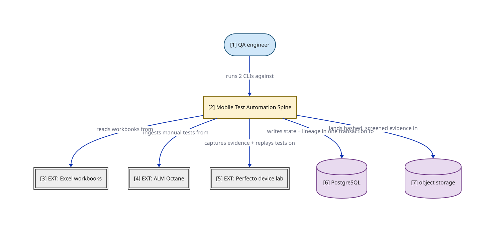

# P1 — The spine in one picture (weeks 0–3)

> What are we building in weeks 0–3? One Spring Boot deployable that turns manual-test exports into IR, captures device UI evidence, and replays committed tests into a classified, pinned, auditable verdict — with no LLM call anywhere. Drill down: P2 (module map), P3 (replay flow); engineer-grade detail in docs/mobile-test-automation-diagrams/.

## Node explainer (numbered — matches the `[n]` on the canvas)

| # | Node | Detail the short label hides |
|---|------|------------------------------|
| 1 | QA | Runs the ingestion CLI and the hierarchy-tool CLI. In the spine the system receives only committed artifacts — the Copilot-assisted conversion arrives in weeks 3–8 |
| 2 | SYS | One Spring Boot deployable, modular monolith, three cluster modules (ADR 0005) — the weeks 0–3 subset of the Mobile Test Automation LLM Pipeline; lands in a separate new repository (S2) The spine contains no LLM call anywhere; the week-3 gate exercises a hand-written test precisely so the pipeline is proven before any generated code reaches it Week-3 gate: (a) one hand-written Appium test flows end to end and yields a valid ReplayReport; (b) real source material ingested and recorded REAL_INGESTED in lineage (M19) |
| 3 | XLS | "The least deterministic input" — the M16 week-0 corpus request (10–20 representative real workbooks) defines the adapter's effective contract; raw workbooks never enter Git (M35). ALM/QC stays additive later (C1) |
| 4 | OCTANE | Ingest source in the spine (REST, API-key auth — C1); certified-asset publish is weeks 3–8 (CF3). SLA: UNKNOWN (pending) |
| 5 | PERFECTO | Pinned device pools; artifacts produced off-prem, hashed at pull (M9) and screened at landing (M35). INCUMBENT vendor — SLA: UNKNOWN (pending — M1 probe) |
| 6 | POSTGRESQL | WORKING ASSUMPTION (C3) — conversion state, append-only lineage (hash-chained, ADR 0012), DB-backed queue/outbox (ADR 0007); swappable if the bank's catalog dictates |
| 7 | OBJECT_STORAGE | Evidence artifacts behind an S3-compatible port (ADR 0011, BINDING PROBE-PENDING; default = self-operated MinIO). Spine retention deliberately short: 30 days, class SPINE_POC (M39) |

## Edge detail

| Edge | Detail the short label hides |
|------|------------------------------|
| QA → SYS | Ingestion CLI + hierarchy-tool CLI, sync |
| SYS → XLS | Excel adapter (Apache POI) behind the shared source-adapter contract (C1) |
| SYS → OCTANE | Octane REST adapter (API-key auth) behind the same source-adapter contract (C1) |
| SYS → PERFECTO | Hierarchy-tool capture (getPageSource, Object Spy, pruned tree) + device-gate replay on pinned pools; single-run session tokens (ADR 0013) |
| SYS → POSTGRESQL | Every pipeline action writes its lineage row in the same local transaction as its state change (ADR 0007) |
| SYS → OBJECT_STORAGE | Per-artifact SHA-256 at landing (M9); data classification + retention date + retention class on every artifact (M39) |

## Not shown for brevity

- **Screening library** — invoked at all three spine call sites — ingestion egress, hierarchy capture, artifact landing (ADR 0009 as amended, M35); shown in P2 (not shown here for brevity)
- **CI pipeline** — fitness functions F1–F4 run CI-blocking from task zero (M18); the static gate is shown in P3 (not shown here for brevity)

## Key

- stadium/pill = a person or role (actor)
- heavy-stroke rectangle = the software system in focus
- double-bordered rectangle, `EXT:` = an external system we don't own
- cylinder = a data store (used for datastores ONLY)
- solid arrow = synchronous call

> **Export caveat:** if this diagram's SVG is used detached from this page (e.g. a slide), re-inline its honesty tags onto the affected nodes — off-canvas tags do not travel with a bare SVG.

