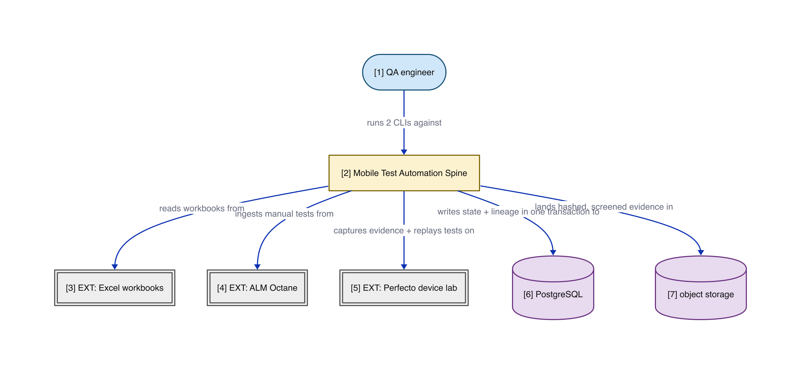
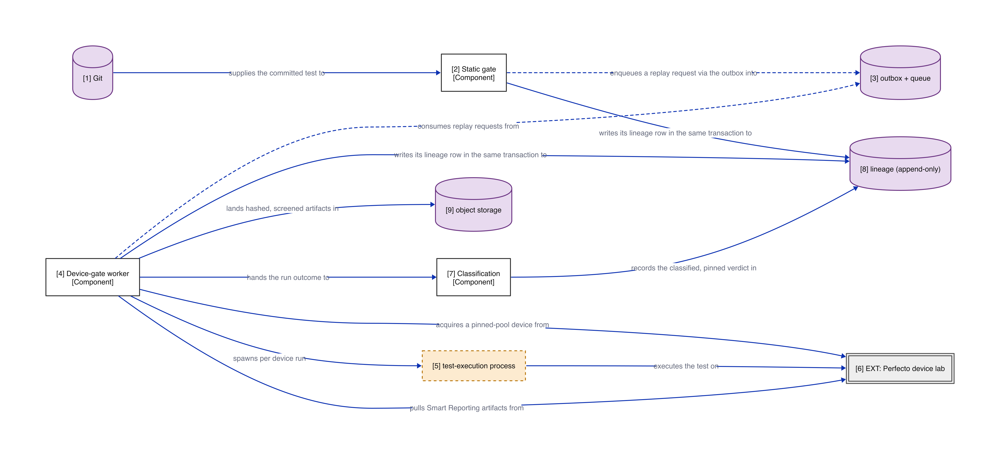
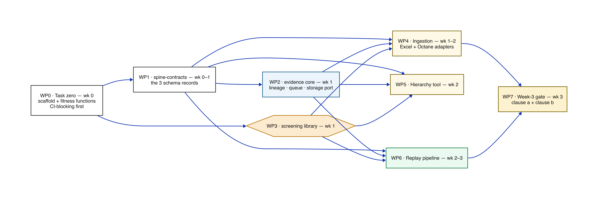
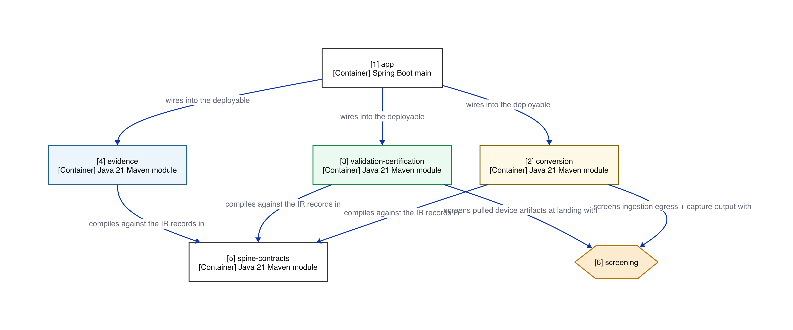

# The Shared Spine — high-level design pack

**Mobile Test Automation · Weeks 0–3 · one page per idea**

| | |
|---|---|
| For | Chief architect · Delivery manager · Developers |
| Derived from | Spec (signed off 2026-07-27, post-P1 baseline) · Plan (PLAN-OK 2026-07-28) · ADRs 0001–0013 |
| Status of this pack | Communication artifact — **nothing here re-decides anything**; every fact traces to a gated source |
| Depth | Linked at the end, never inlined |

*Pages 2–5 are for everyone. Then three short sections: architect (6–8), delivery (9–11), developers (12–13). Page 14 is the ask.*

---

## 2 · Why this exists

**Everything after week 3 depends on a spine that does not exist yet.**

- Phase 1 (weeks 3–8) converts manual tests with Copilot assistance. Phase 2 swaps the reasoning engine. **Both consume the same four things**: the schema contracts, an ingestion path, a device-evidence tool, and a deterministic replay pipeline.
- The blueprint's load-bearing premise: *Phase 1 is not a throwaway prototype — it is the asset factory and data flywheel for Phase 2.* That premise holds **only if the spine is built with the decided architecture from the first commit**.
- So weeks 0–3 build the spine, and only the spine — in a new Spring Boot repository, with the module boundaries, the append-only provenance contract, and the fitness functions in place from commit one.

**One sentence to keep:** *we are building the rails before any train — human or AI — runs on them.*

---

## 3 · What we're building — the spine in one picture

Manual tests come in from Excel workbooks and ALM Octane. Device evidence comes from the Perfecto lab. Everything that happens leaves a lineage row (PostgreSQL) and hashed evidence (object storage).

**The spine contains no LLM call anywhere.** That is a design fact, enforced by a CI rule, not an aspiration.

*Numbered node details and edge claims: [p1-spine-context.view.md](p1-spine-context.view.md).*

---

## 4 · The finish line — the week-3 gate

Two binding clauses, both required:

> **(a)** One hand-written Appium test flows end to end — static gate, real Perfecto device, classification — and yields a `ReplayReport` that validates against the committed schema with a complete pinning set.
>
> **(b)** The ingestion CLI has produced schema-valid, screened IR **from real source material** — recorded `REAL_INGESTED` in lineage. Fixture-only green does not count.

Here is clause (a)'s journey through the system:

Static gate first — seconds, zero device cost. Then the queued device gate. Then rule-based classification. Every hop writes append-only lineage.

*Details: [p3-replay-flow.view.md](p3-replay-flow.view.md).*

---

## 5 · The three promises the design protects

The stage-1 worksheet locked a top-3; every structural choice below serves them.

| Promise | What it means here | How the spine keeps it |
|---|---|---|
| **Reproducibility** | The same test, replayed later, is the same experiment | Everything pinned — device, OS, Appium, code commit, runner image by digest; `NOT_APPLICABLE` is explicit, null is never valid |
| **Security & privacy** | Real test data carries account numbers, names, hostnames | One screening library at all three egress points; credentials by injected reference only; raw workbooks never enter Git |
| **Verifiability** | An auditor reconstructs any verdict from stored evidence alone | Append-only, hash-chained lineage anchored in immutable storage; evidence hashed at landing; attributable principals on every row |

These three survived five risk-storming passes. What you see in this deck is the **post-mitigation** design.

---

## 6 · Architect view — the shape, and why

**One deployable. One quantum. A modular monolith partitioned by cluster (ADR 0005).**

- Three cluster modules — `conversion`, `validation-certification`, `evidence` — from the stage-2 component analysis (16 components, 3 clusters), not the blueprint's five pipeline stages (those survive as packages).
- The microkernel hybridization was **declined at the stage-3 gate** — recorded as the losing alternative, not forgotten.
- Exactly **two async seams** (ADR 0007): the device-replay queue and human decisions. Both via transactional outbox + idempotent consumers; never a distributed transaction. The queue starts as PostgreSQL tables — a broker is a later swap behind the same schema.
- The plan adds only three abstractions beyond the spec, each with its simpler-rejected-thing recorded: the `spine-contracts` kernel, the `screening` library artifact, and the object-storage port.

**Trade-off stated plainly:** the monolith gives up independently deployable units in exchange for one quantum's operational simplicity — and the boundaries that would have been structural are now protected *only* by fitness functions. That is page 8.

---

## 7 · Architect view — decisions already made (and what's honestly open)

Thirteen ADRs, all gated. Nothing on this page is up for re-decision today.

**Seams & shape** — 0001 one model-call seam, config-only Phase-2 cutover · 0003 central orchestration for conversion · 0005 modular monolith by cluster · 0007 two async seams via outbox · 0008 CLIs + review queue + auditor export, no BFF

**Data & evidence** — 0002 model+provider version in the cache key · 0006 lifecycle-partitioned single store, blobs in object storage · 0011 evidence storage behind an S3 port *(Proposed — see below)* · 0012 tamper-evident lineage hash chain anchored in immutable storage

**Security** — 0004 fidelity grades recorded, never re-derived · 0009 one screening library at three trust boundaries · 0010 security review as a parallel track · 0013 generated-code execution isolated from credentials — *remove the prize rather than build the cage*

**Honestly open (carried as flags, not hidden):**

| Open item | Standing |
|---|---|
| Production object-storage platform | ADR 0011 **Proposed**, week-0 probe; recorded default: self-operated MinIO |
| PostgreSQL | **Working assumption** pending bank-catalog confirmation |
| Perfecto MSA, gateway contract, Octane asset versioning | Probes open (M1 / M5 / M7) |
| Real-input floor for gate clause (b) | Set when the M16 workbook corpus returns — blocked honestly, never guessed |

Either of the first two resolving against us is a **replan event, not a silent patch**.

---

## 8 · Architect view — how it can't rot

Three of the top-3 promises have **no structural protection left** in a monolith — the boundaries live in rules, or nowhere.

- **F1** — any type outside the model-boundary adapter referencing a provider SDK or Copilot construct → **build fails**. The model seam cannot erode before it's even used.
- **F2** — any source-system type (POI, Octane DTO) escaping its adapter → **build fails**. The IR is the only thing that leaves ingestion.
- **F3** — ingestion egress without a screening call → **build fails** (static half) *and* the payload is rejected at runtime (runtime half).
- **F4** — any foreign key from lineage into conversion state → **build fails**. Retention deletion stays safe.

**Task zero** wires all four CI-blocking *before any feature commit* — a build without them is not a valid baseline. Weakening any fitness function requires a **recorded decision, never just a commit** (the no-silent-disable working agreement). Task zero also proves, in CI, that the database refuses `UPDATE`/`DELETE` on lineage from the application role.

---

## 9 · Delivery view — the scope fence

**In (weeks 0–3):** the three schema contracts · Excel + Octane ingestion behind one adapter contract · the screening library · the hierarchy tool · the queued replay pipeline (static gate → device gate → classification → report) · append-only provenance · fitness functions from commit one.

**Out (explicitly, with a reason):**

| Not now | Why it's safe to defer |
|---|---|
| Any LLM call, prompts, exemplars | Weeks 3–8; the seam it will use is built and CI-guarded now |
| Review-queue UI, human routing | The quarantine record already matches the future review-record shape |
| K-run policy, certification, fidelity judging | Per-run records already carry the fields K-of-K will need |
| Locator healing / repair loops | Phase 2 machinery |
| Encryption + crypto-shredding | Designed (ADR 0011 as amended); built before the first artifact that must survive to the audit horizon — spine evidence is deliberately short-retention |

Eleven carry-forward rules (CF1–CF11) bind the weeks 3–8 spec to import this contract — **dropping one is a recorded decision, not an omission**.

---

## 10 · Delivery view — the work

Eight work packages, 43 tasks, three parallel streams after week 1.

*Solid arrow = "must complete before". Colours track the P2 module map: yellow = conversion, green = validation-certification, blue = evidence, orange hexagon = the screening library. This is a delivery flow, not an architecture view — dependencies are verbatim from the plan's WP table (§5).*

- **Task zero is strictly first** — no feature code before the scaffold, fitness functions, lineage grants, and CI checks exist.
- WP4 ∥ WP5 ∥ WP6 run in parallel; only **WP7 hard-requires external access**.
- Task-level detail, EARS traceability, and pass/fail criteria: the [task list](../../../sdd/plans/mobile-test-automation-spine.tasks.md) (T01–T43).

---

## 11 · Delivery view — what can slip the gate (and the week-0 asks)

The engineering has no open questions. The calendar risk is **external access** — the spec names these as known break risks:

| Risk | Consequence if late | Week-0 ask |
|---|---|---|
| Perfecto credentials + pinned pool | WP7 clause (a) cannot run | Request credentials, pool, network path **now** |
| Octane API key | Octane adapter's live leg blocks | Request alongside Perfecto |
| M16 real-workbook corpus (10–20 workbooks) | Gate clause (b) floor cannot be set; Excel adapter meets reality late | Fire the corpus request to feeding teams **before the adapter is written** |
| PostgreSQL catalog confirmation | WP2 finality | Submit catalog check |
| Object-storage platform probe (ADR 0011) | Storage leg rides the MinIO default | Run the platform probe |

**The start-anyway rule:** none of these gate WP0/WP1/WP3 — the team starts regardless, and code for WP4–WP6 proceeds against recorded fixtures. If the corpus slips past week 2, that's a **replan conversation, not a quiet slip**.

---

## 12 · Developer view — the repo you'll live in

- **`spine-contracts`** is the vocabulary: `TestCaseIR`, `LocatorCandidate`, `ReplayReport` as Java records; JSON Schema committed, drift fails CI.
- Cluster modules depend on **`spine-contracts` only** — the module-boundary rule is CI-blocking, so an illegal import is a build failure, not a review comment.
- **`screening`** is a shared library (deliberately *not* a pipeline component): one-line, in-process API at three call sites.
- Stack: Java 21 · Maven reactor · Spring Boot · PostgreSQL 16 + Flyway · Testcontainers (Postgres, MinIO) · ArchUnit · TestNG + pinned Appium.

*Details: [p2-module-map.view.md](p2-module-map.view.md).*

---

## 13 · Developer view — rules of the road (the build will stop you if…)

Day-one behaviors, each enforced by CI or the schema — not by memory:

- …a **source-system type** (POI, Octane DTO) crosses out of its adapter — F2.
- …an ingestion or capture path reaches egress **without a screening call** — F3, both halves.
- …test code contains **`Thread.sleep`** — explicit waits only; it's a determinism control, not style.
- …a locator isn't in the committed **`LocatorCandidate` manifest** — rejected before any device is acquired.
- …a **literal credential** appears — schema rejects it in data; gitleaks flags it in code (warn-only for the spine, blocking at weeks 3–8 entry).
- …code tries to **`UPDATE` or `DELETE` a lineage row** — the database refuses; corrections are superseding appends.
- …a report is missing **any pinning field** — null is never valid; `NOT_APPLICABLE` is spelled out.
- …a committed fixture derived from real source lacks its **screening-version marker** — raw workbooks never enter Git.

**The pattern to internalize:** every rule is *quarantine loud, never default quietly* — unknown classification quarantines, substituted devices quarantine, flagged payloads quarantine with a recorded override path.

---

## 14 · Where the depth lives — and the ask

| Layer | Artifact |
|---|---|
| The what (EARS criteria) | [Spine spec](../../../sdd/specs/mobile-test-automation-spine.spec.md) |
| The how (tech, values, WPs) | [Plan](../../../sdd/plans/mobile-test-automation-spine.plan.md) · [Tasks T01–T43](../../../sdd/plans/mobile-test-automation-spine.tasks.md) |
| The why (13 decisions) | [ADR index](../../index.md) · `adrs/application/mobile-test-automation/` |
| The foundations | [Characteristics worksheet](../../worksheets/mobile-test-automation/characteristics-worksheet.md) · [Logical components](../../components/mobile-test-automation/logical-components.md) · [Style decision](../../worksheets/mobile-test-automation/style-decision.md) |
| Engineer-grade diagrams | [Nine-view linted set](../../../mobile-test-automation-diagrams/SELF-AUDIT.md) |

**The ask, per audience:**

- **Chief architect** — nothing new to decide. Confirm this pack faithfully represents the gated baseline; flag anything it doesn't.
- **Delivery manager** — fire the five week-0 asks (page 11). They are the only thing between this plan and its gate.
- **Developers** — the task list awaits **TASKS-OK**; on approval, task zero starts. The rails are specified down to pass/fail per task.

*Every fact on these pages traces to a signed-off artifact. Where something is unknown, it says so — that is the standard the system itself is being built to.*
