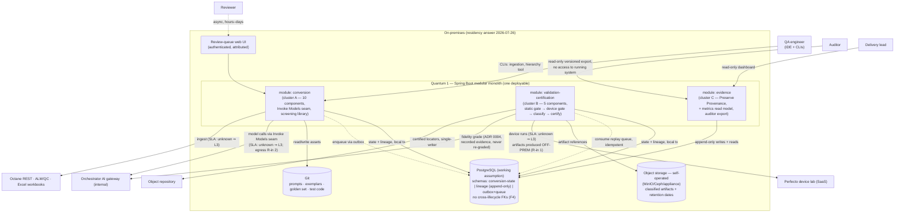

# Risk Assessment — Mobile Test Automation LLM Pipeline

- **Target:** mobile-test-automation
- **Artifact home:** `docs/architecture/` (per the `[roots]` override in `.arch/binding.toml`)
- **Stage:** 5 (arch-risk)
- **Date:** 2026-07-26
- **Status:** IN PROGRESS — pass P2 (Reproducibility) phases 1–2 complete
  2026-07-26, row agreed at 9/9/9/6/9; pass P3 (External integrations) phases
  1–2 complete 2026-07-27, column agreed at 9/9/9/6/6/9/9 (sum 57). **P3
  phase-3 mitigation complete on the full register 2026-07-27**: the thirteen
  9s (M1–M12, §8) — five stakeholder evidence facts recorded (E1–E5), two 9s
  closed by evidence, ten re-scored to 4–6, one held pending its probe — then
  the nineteen 6s and one 4 as an eleven-entry covered sweep (S1–S11, §8)
  plus nine individual rulings (M13–M21, §8): two closed by rule, seven
  re-scored to 4, four held at 6 riding open probes or accepted as residual.
  Column stands at 9/6/9/6/6/9/6 (sum 51) — this half moved the register, not
  the cells. **P2 phase-3 mitigation complete 2026-07-27** (D1 + S12–S22 +
  M22–M32; row 4/4/9/4/9). **P1 (Security & privacy) phases 1–3 complete
  2026-07-27** (row 6/6/6/6/6 → 4/4/6/4/6, sum 24; all owed artifacts settled
  at the combined gate). **P4 (Verifiability) phases 1–2 complete 2026-07-27**
  — row agreed at 6/9/9/6/9 (sum 39, highest row standing), new two-lens 9 on
  suite-admission binding (P4-1); phase 3 pending. P5 queued.
  First assessment (direction markers within the matrix mark mitigation
  effects this round; cross-assessment markers start with the next
  assessment).
- **Inputs:** stage-1 worksheet rev 3 (criteria); stage-2 components rev 3 and
  stage-3 style decision (diagram); ADRs 0001–0010 all Accepted; signed-off spine
  spec (`docs/sdd/specs/mobile-test-automation-spine.spec.md`) for near-term delivery
  exposure.
- **Method:** risk matrix (impact 1–3 × likelihood 1–3; bands 1–2 low, 3–4 medium,
  6–9 high; **impact first, likelihood second; unsure likelihood ⇒ 3; unknown
  technology ⇒ automatic 9**). Storming per `arch-risk/references/risk-storming.md`:
  blind identification by 3–5 lenses, median-merged consensus with the human as
  arbiter, human-gated mitigation.

---

## 1. Named risk inputs carried into this stage

These arrived from prior gates as *inputs to be scored*, not findings to relitigate:

| # | Input | Source | Where it lands in the matrix |
|---|---|---|---|
| R-in 1 | **Perfecto device-cloud residency** — the PII-bearing artifact set (video, page source, screenshots, network captures) is *produced* in a third-party device cloud and pulled on-premises; the on-prem residency answer governs storage, not generation or transit | Stage 4 log, ADR 0006 Notes | Security & privacy × external integration surface |
| R-in 2 | **Model-provider egress** — prompt payloads leave through the Orchestrator AI gateway; if the gateway proxies to an externally hosted provider, test content crosses the boundary regardless of where the stores sit. ADR 0009's egress screening is the control that exists, not necessarily the control residency requires | Stage 4 log, ADR 0006 Notes | Security & privacy × external integration surface |
| R-in 3 | **The security-review control is neither independent nor blocking** — ADR 0010 removed blocking authority and the dual-hat removed independence, leaving timeliness and visibility protecting a top-3 characteristic. Three flip conditions recorded | ADR 0010 | Security & privacy × (all contexts) — a control weakness, not a component risk |
| R-in 4 | **F1–F3 are load-bearing, not confirmatory** — three fitness functions are the *only* protection for boundaries removed at human gates (model seam, adapter boundary, screening invocation); if they are not built and maintained, three characteristics lose all protection | style-decision §7 | Evolvability and security rows × conversion context |
| R-in 5 | **On-premises object storage is self-operated** — MinIO/Ceph/appliance with its own durability, backup, and on-call; a filesystem stopgap would leak into the retention design | ADR 0006 / spine spec | Auditability × evidence & provenance |

## 2. Input diagram — container level, with SLA annotations

Extends the stage-3 quantum map with the data topology decided in ADRs 0006–0007
and the edge topology from ADR 0008. Solid = synchronous, dotted = asynchronous.
**No external dependency has a published SLA/SLO on record** — per the matrix
rules, unknown likelihood defaults to 3 until an SLA is produced; checking SLAs
is itself a phase-3 mitigation step that can remove a risk outright.

Key: 3-D boxes not available in mermaid — rectangles = modules/containers,
cylinders = data stores, solid arrows = sync, dotted = async. `L3` = likelihood
defaulted to 3 for lack of a published SLA.

## 3. Assessment frame

**Criteria (rows)** — the seven driving characteristics from the stage-1
worksheet, top-3 in bold. Demoted characteristics (cost, performance,
testability) are not rows; where relevant they appear inside a cell's rationale.

**Contexts (columns)** — domains/subdomains, deliberately coarser than
components: the three module clusters, the edge/access surface (ADR 0008), and
the external integration surface. Service/component grain is too fine to see
coordination risk.

## 4. Risk matrix — to be filled by storming passes

Product = impact × likelihood. Empty cells are unassessed, not zero.
Direction markers (↑ worsening / ↓ improving / → static) start next assessment.

| Criterion \ Context | Conversion | Validation & certification | Evidence & provenance | Edge & access | External integrations |
|---|---|---|---|---|---|
| **Reproducibility** | 4 ↓ | 4 ↓ | **9** → | 4 ↓ | **9** → |
| **Security & privacy** | 4 ↓ | 4 ↓ | **6** → | 4 ↓ | **6** → |
| **Verifiability** | **6** | **9** | **9** | **6** | **9** |
| Evolvability / replaceability | — | — | — | — | 6 |
| Reliability & recoverability | — | — | — | — | 6 |
| Auditability & traceability | — | — | — | — | **9** |
| Interoperability | — | — | — | — | **6** ↓ |
| **Column sum** | — | — | — | — | **51** ↓ |

↓ = reduced by the P3 mitigation pass (2026-07-27), not by a new storming pass:
Security & privacy 9→6 (every driving 9 re-scored or closed by evidence E1–E4 —
see M1–M4, M8); Interoperability 9→6 (the five-lens object-repository automatic
9 collapsed by evidence E5 — see M7). Verifiability and Auditability hold at 9
because their shared driver — the gateway version-reporting contract — was held
at 9 pending its probe (M5). The consensus column as agreed at phase 2
(9/9/9/6/6/9/9, sum 57) is preserved in §7.

Reproducibility-row markers = the P2 mitigation pass (2026-07-27): Conversion
9→4 (Copilot pinning re-scored via M12's schema honesty, S13), Validation &
certification 9→4 (K-run erosion → CF6, M25; ENV_INFRA → M10a/M21, S15), Edge
& access 6→4 (off-pool capture provenance, M24). Evidence & provenance holds 9
— the object-storage automatic 9 stands until the platform probe / ADR 0011
collapses it (M22). External integrations holds 9 — the gateway
version-reporting contract, riding M5's inquiry (S12). The consensus row as
agreed at phase 2 (9/9/9/6/9) is preserved in §7.

Security & privacy row = P1 phases 1–2 (2026-07-27), the first pass run fully
**post-mitigation** — five lenses scored residual risk against E1–E5, M1–M32,
S1–S22, CF1–CF7 and the post-P2-baseline spec, and the discipline held (no
re-raises; all three routed inputs landed at their adjudicated residuals).
Row 6/6/6/6/6, sum 30 at phase 2. The External cell confirms the P3 column's
adjudicated 6 rather than moving it. Five arbitrations, three ruled below the
pass recommendation — the operations lens's automatic 9 on the test-data vault
was **overridden to 6** (ruled weeks 3–8 machinery: an unowned dependency,
not an unknown critical technology of the spine) — see the P1 consensus log.

Security & privacy markers = the **P1 phase-3 mitigation pass** (2026-07-27,
E6 + S23–S27 + M33–M43): Conversion 6→4, Validation & certification 6→4, Edge &
access 6→4. **Two cells hold at 6 for reasons outside design's reach:** Evidence
& provenance on P1-4's retention enforcement, which rides M33's mandated-schedule
question and ADR 0011's probe; External integrations on the two unread vendor
  documents (Perfecto MSA/DPA, Copilot license), stated at the sweep gate as
  vendor-management work rather than design work. Row 6/6/6/6/6 → **4/4/6/4/6,
  sum 30 → 24**. The pass's own premise correction is on the record in M34: the
  phase-2 override of the vault automatic 9 rested on the spine's reference test
  needing no secret, and the owner confirmed at the gate that it **does**
  authenticate — so facet (a) became spine-real and was re-priced upward before
  being mitigated back down. **P4 (Verifiability) phases 1–2 complete
  2026-07-27**: row agreed at 6/9/9/6/9 (sum 39, the highest row standing);
  the pass surfaced a new two-lens 9 — regression-suite admission is
  unenforced by any artifact (P4-1) — plus the object-storage automatic
  extended to this row via CF1 and the unanimous confirm of the External
  gateway 9. P4 phase 3 and P5 queued.

Verifiability row = P4 phases 1–2 (2026-07-27), run fully post-mitigation like
P1 — five lenses scored residual risk against E1–E6, D1, M1–M43, S1–S27,
CF1–CF11, ADRs 0001–0013 and the post-P1-baseline spec. Row agreed at
**6/9/9/6/9, sum 39 — the highest-standing row in the matrix.** Three 9s:
V&C carries the pass's new two-lens find (regression-suite admission is
unenforced by any artifact — P4-1, arbitrated into this cell); E&P is the
object-storage automatic extended to this row via CF1's custody precondition
(confirms M22's held state); External unanimously confirms the P3-adjudicated
gateway version-report 9 riding M5. Phase 3 (mitigation) pending — this row
was scored, not yet mitigated.

Row sums rank criteria; column sums rank contexts. Stakeholder-facing summary
filters to high-risk (6–9) only.

## 5. Storming pass queue

One criterion **or** one context per pass; blind identification first, then
median-merged consensus with per-lens raw scores kept visible, then human-gated
mitigation per medium/high item.

| Pass | Dimension | Why queued | Status |
|---|---|---|---|
| P1 | **Security & privacy** (criterion) | Carries three of the five routed inputs (R-in 1, 2, 3); top-3; banking context | **phases 1–3 done 2026-07-27, artifacts settled** — phases 1–2: first fully post-mitigation pass, row 6/6/6/6/6 (sum 30), 55 raw rows → 21-entry register, vault automatic 9 overridden to 6 at arbitration. Phase 3: E6 + S23–S27 sweep + M33–M43 (ten mechanism-grouped rulings over sixteen entries); row **4/4/6/4/6, sum 24**. All owed artifacts landed at the 2026-07-27 **combined gate**: ADR 0012 Accepted, ADR 0013 Accepted, ADR 0011 M39 amendment ratified, spine-spec P1 edit pass (ten rules + CF8–CF11) applied and re-signed-off |
| P2 | **Reproducibility** (criterion) | Top-3; the spine spec's acceptance bar is a reproducible verdict; device nondeterminism and gateway-graded fidelity both press on it | **phases 1–3 done** — phases 1–2 2026-07-26 (row 9/9/9/6/9); phase 3 2026-07-27 (D1 + S12–S22 sweep + M22–M32; row 4/4/9/4/9 — the two held 9s ride M22's probe/ADR 0011 and M5's inquiry) |
| P3 | **External integrations** (context) | Every SLA is unknown (⇒ L3 across the column); Perfecto + Octane are on the spine's critical path; the SLA lookup itself may remove risks cheaply | **phases 1–3 done 2026-07-27** — phases 1–2 (column 9/9/9/6/6/9/9, sum 57); phase 3 on the thirteen 9s (M1–M12; column 9/6/9/6/6/9/6, sum 51); phase 3 on the 6s/4 (S1–S11 sweep + M13–M21; register fully adjudicated, cells unchanged) |
| P4 | **Verifiability** (criterion) | Top-3; judge calibration, gate erosion under delivery pressure ("determinism theater") | **phases 1–2 done 2026-07-27** — second fully post-mitigation pass; 44 raw rows → 10 shared clusters + 8 single-lens finds (18-entry register); row agreed at **6/9/9/6/9, sum 39** — highest row standing; new two-lens 9 (suite-admission binding, P4-1) arbitrated into V&C; phase 3 pending |
| P5 | Remaining rows (evolvability, reliability, auditability, interoperability) — one pass each or merged by human call | Driving but not top-3; R-in 4 and R-in 5 land here | queued |

## 6. Participant lenses (phase 1 — blind identification)

3–5 lenses, honestly framed as **dimensional coverage, not independent voters**
(same-model lenses ≈ few effective votes; the human arbitrates the merge):

1. **Operations / infrastructure** — availability, capacity, the self-operated stores, queue behavior under failure
2. **Security & data** — trust boundaries, egress, PII lifecycle, retention, attribution
3. **Implementation / developer experience** — the fitness-function burden, module discipline, the Copilot-era workflow
4. **Compliance / audit** — reconstruction-from-evidence, lineage completeness, the auditor path
5. *(optional per pass)* **Delivery** — week-3 gate exposure, credential/access lead times

Phase-1 blindness rule: no lens (agent or human) sees another's scores before
submitting. Human scores, if participating, are submitted before any agent
scores are revealed.

## 7. Consensus log

### P2 — Reproducibility (criterion), run 2026-07-26

**Process notes, recorded for honesty.** (a) The human elected to participate
as a fifth blind scorer but chose to unseal before submitting a sheet; the
seat converted to **arbiter**, so the pass ran on four lens sets, not five.
(b) The original phase-1 submissions fell out of the assistant's working
context after a summarization; each lens agent was resumed and asked to
re-emit its concluded table verbatim. The implementation lens disclosed that
its first turn had been interrupted *before* scoring, so its set is a first
emission, not a reproduction. Blindness held throughout: no lens saw
another's scores before its own were locked. (c) The reveal artifact is the
chat-side canvas `p2-reproducibility-risk-reveal`; raw tables and full
rationale live in the four lens transcripts.

**Volume.** 43 raw risk rows → 9 shared clusters (≥2 lenses) + 15 single-lens
finds. No lens returned an empty context except operations on the
source-systems slice of external integrations (an explicit "no risk from
this lens," which the implementation and compliance lenses contradicted and
the merge kept).

**Consensus and arbitration record** (initial positions → ruling):

| Item | Lens positions (I×L) | Ruling | Cell effect |
|---|---|---|---|
| Orchestrator AI gateway model-version self-report — one uncorroborated string feeds every pinning mechanism (ADR 0002 key, F6, judge calibration); delivery lens surfaced a flat contradiction between blueprint ("the pipeline never knows which model answered") and F6's mandatory field | OPS 3×3, IMPL auto-9, COMP 3×3, DEL auto-9 — **unanimous** | None needed | External **9** |
| Copilot-era pinning capture — model/prompt versions structurally uncapturable from auto-updating IDE tooling for the exact corpus the flywheel certifies | OPS 3×3, IMPL 3×3 vs COMP 2×3, DEL 2×3 — impact split 2v2, likelihood unanimous 3 | **Impact 3**: a top-3 measure that cannot be filled is a failed measure, not a degraded one | Conversion **9** |
| Self-operated object storage — technology unchosen (MinIO/Ceph/appliance), no durability/backup design; OPS also found cross-store restore incoherence (PG and object store restoring to different points strands lineage) | OPS automatic 9 (+ 3×3 restore find) vs DEL 2×3=6 (stopgap path) | **Automatic 9 upheld** — overriding requires declaring the technology known, which nothing on record supports; choosing the store is the mitigation that collapses it | Evidence & provenance **9** |
| K-run erosion — the roadmap pre-authorizes cutting device retries when minutes dominate cost; no fitness function F1–F7 asserts the K count | DEL 3×3 (single-lens) | **Accepted at 9** — a pre-authorized cut with no guarding control is what the pass exists to catch | Validation & certification **9** |
| ENV_INFRA misclassification + the rate audit that exists only on paper | OPS 2×2, COMP 2×2 vs IMPL 2×3, DEL 2×3 — likelihood split 2v2 | **Likelihood 3** per the unsure-likelihood rule: the deterministic rules argue 2, but the control that would detect drift is unbuilt | 6, inside V&C (cell already 9) |
| Fifteen single-lens finds (see register below) | one lens each | **All admitted at submitted scores**; phase-3 mitigation prices them | Edge & access rises 4→**6** (hierarchy-tool off-pool capture) |

**Agreed row:** Conversion 9 · Validation & certification 9 · Evidence &
provenance 9 · Edge & access 6 · External integrations 9.

**Agreed P2 register** (24 entries feeding phase 3, by product):

- **Product 9 (seven):** gateway model-version self-report (all); Copilot
  pinning capture (all); Perfecto execution-context drift — pool retirement /
  SaaS stack drift / requested-vs-actual facets (all four lenses, differing
  facets); self-operated object storage, automatic (OPS); cross-store
  restore-point incoherence (OPS); K-run erosion pre-authorized by the
  roadmap (DEL); week-3 gate passing *irreproducibly* on improvised
  Perfecto access — green but not repeatable (DEL).
- **Product 6 (twelve):** ENV_INFRA misclassification with the paper-only
  rate audit (all, arbitrated L3); F7 / never-re-grade discipline unbuilt or
  first-disabled (IMPL, DEL); C4 NOT_APPLICABLE→required-real flip — unowned,
  unspecified, schema-legally gameable (IMPL, COMP, DEL); source input
  instability — POI nondeterminism + mutable raw-source references with no
  content hash (IMPL, COMP); response cache has no owning data store (OPS);
  CI-runner environment absent from the pinning set (OPS); requested-vs-actual
  device capability recording (IMPL); fidelity grade by-design not
  re-derivable inside every verdict (COMP); artifact retention never floored
  at the verdict's audit horizon (COMP); Smart Reporting artifacts expiring
  vendor-side during a pull backlog (DEL); hierarchy-tool capture off the
  pinned pool under deadline (DEL); catalog-mandated PostgreSQL swap
  mid-spine (DEL).
- **Product 4 (five):** CLI/tool build version skew (all, median); cache-key
  canonicalization unspecified (IMPL); queue-seam idempotency lineage
  duplication (IMPL); prompt-version binding to immutable content
  unspecified (COMP); auditor export unowned (COMP).

**Cheap phase-3 probes flagged during the pass:** ask the gateway team for
the per-call model/provider version contract (can collapse or confirm the
unanimous 9); the Perfecto SLA/retention lookup (already queued as P3);
selecting the object-storage technology via arch-decide (collapses the
automatic 9 to a scored risk).

#### P2 phase 3 — opened 2026-07-27

**Decision D1 (owner, 2026-07-27): interim primary-store posture.** While
catalog approval for a provisioned PostgreSQL instance is pending, dev and CI
run **embedded/containerized PostgreSQL** (Testcontainers or Zonky
embedded-postgres) — the real engine in-process or in-container, so JSONB,
`FOR UPDATE SKIP LOCKED`, the transactional outbox, and row-grant semantics
are exercised exactly as specified, with zero dialect drift. The schema lives
as versioned migrations (Flyway-style) from task zero, so cutover to the
approved instance is a connection-string change plus migration replay. A
shared pre-approval environment, if one is needed, is a PostgreSQL container
on an internal VM — inside E3's validated-network boundary. Explicitly *not*
hedged: a catalog mandate for a **different engine** — that residual stays
priced on the register's "catalog-mandated PostgreSQL swap mid-spine" entry,
whose adjudication carries the week-0 catalog probe. Alternatives considered
and rejected for the spine: H2 in PG mode (dialect drift lands precisely on
the outbox/queue SQL), SQLite (single-writer against a two-writer seam),
local JSON files (no cross-file transaction — the ADR 0007 same-transaction
invariant becomes a convention instead of a property), pure in-memory
(lineage must survive restarts). **Routes to the plan** (task-zero
provisioning), not the spec — C3's working assumption is unchanged.

#### P2 covered sweep (S12–S22, ruled as a batch 2026-07-27)

Triage split the 24-entry register on human ruling into a covered sweep —
eleven entries already served by an accepted M-ruling, evidence fact, or
spec criterion — and thirteen uncovered entries (eleven adjudications, the
Perfecto-drift facets grouped) run one-by-one below. The sweep was accepted
in full as proposed:

| # | Register entry (P2) | Served by | Disposition (2026-07-27) | Now |
|---|---|---|---|---|
| S12 | Gateway model-version self-report — the unanimous 9 | Same find as M5; consolidated gateway inquiry in flight, dual-source fallback pre-priced | Fold into M5 — held riding the inquiry | **9 held** |
| S13 | Copilot pinning capture (9) | M12: prompt parity + `UNPINNABLE_PHASE1` schema honesty | Re-scored, matching M12 | **4** |
| S14 | Week-3 gate passing irreproducibly on improvised Perfecto access (9) | M8: week-0 access filing; unattributable runs don't count as gate evidence | Folded into M8 as a facet — tracked there | — |
| S15 | ENV_INFRA misclassification + paper-only rate audit (6) | M10a quarantine-unknown + M21 dead-letter make drift surface loud | Likelihood 3→2 | **4** |
| S16 | F7 / never-re-grade discipline unbuilt or first-disabled (6) | M18's no-silent-disable line covers the disable facet; F7 build is weeks 3–8 under the CF import obligation | Re-scored; build half rides CF | **4** |
| S17 | C4 NOT_APPLICABLE→required-real flip — unowned, gameable (6) | M12 made the flip schema-enforced, not a policy hope | Re-scored | **4** |
| S18 | Source input instability — POI nondeterminism + mutable references (6) | M15 hash-at-ingest + per-adapter canonicalization (EARS criteria) | Re-scored, matching M15 | **2** |
| S19 | Artifact retention never floored at audit horizon (6) | M6 custody-before-certify + M1 checklist question 1 + the spec's retention-date criterion | Re-scored, pending the M1 read | **4** |
| S20 | Smart Reporting artifacts expiring vendor-side during a pull backlog (6) | Same find as M6, adjudicated there at the 9 level | Folded into M6 — tracked there | — |
| S21 | Cache-key canonicalization unspecified (4) | M15's canonicalization paragraph was written to serve it | Closed by rule | **2** |
| S22 | Queue-seam idempotency lineage duplication (4) | ADR 0007 idempotent consumer + M21 queue-hygiene fields | Re-scored | **2** |

#### P2 mitigation record (M22–, one item per ruling, continuing the M-series)

| # | Register entry (P2) | Was | Evidence / mitigation | Ruling (2026-07-27) | Now |
|---|---|---|---|---|---|
| M22 | **Self-operated object storage — technology unchosen, no durability/backup design** (OPS, automatic) | 9 (automatic) | **Accepted, three layers:** (1) **week-0 platform probe** — the E1 shape: ask the infrastructure/platform team whether an internal S3-compatible object-storage service already exists (banks commonly operate one); if yes, the "self-operated" premise dissolves onto the team that already carries durability/backup/on-call and the risk collapses to integration-level. Hours. (2) **Interim posture, the D1 analog:** dev/CI run containerized MinIO behind the S3 API through a thin port — nearly every candidate speaks S3, so cutover is an endpoint/credentials change. (3) **The decision spins out as arch-decide ADR 0011** (object-storage technology + durability/backup/retention design), last responsible moment before the first real evidence artifact lands (~week 2, device gate). Trade-off noted: M19's corpus-class honesty does not cover *storage* grade — if the ADR slips, the week-3 gate could pass on a dev-grade store; guarding that is one plan-level line, not a spec change | Recommendation applied on a skipped question — recorded as such | **9 held**, collapses on probe/ADR 0011 |
| M23 | **Cross-store restore-point incoherence — PG and object store restoring to different points strands lineage** (OPS) | 3×3 = 9 | M9/M15 digests + M6 custody already give *detection*; the missing piece is the coherence rule. **Accepted:** (1) **restore-ordering invariant** — the spec's write order (artifact lands first, lineage row second) means PG only ever references objects that already exist; corollary: restore the object store to a point **at or after** PG's restore point — an "ahead" object store holds only harmless orphans, never dangling references. One runbook sentence. (2) **Post-restore custody reconcile** — re-run the custody check over restored lineage; every reference must resolve and digest-match; failures quarantine loudly (M10 posture). Reuses mandated code. (3) Both land in **ADR 0011's backup/restore section**, with object immutability stated as the invariant's precondition; if the M22 probe returns a platform service, the ordering rule becomes an agreement with that team | Recommendation applied on a skipped question — recorded as such | **2×2 = 4** |
| M24 | **Perfecto execution-context drift** — pool retirement / silent SaaS stack drift / requested-vs-actual substitution (four lenses, differing facets), grouped with the requested-vs-actual recording 6 (IMPL) and the hierarchy-tool off-pool capture 6 (DEL) | 9 + 6 + 6 | **Accepted, three parts:** (1) **record-actual rule** — every device run's lineage row records the actual execution context as the session reports it (device model/ID, OS version, Appium server version, available stack identifiers) alongside the requested set with the delta explicit; a mismatch on a *pinned* facet quarantines rather than silently counting (M10 posture). Serves the 9, closes the requested-vs-actual facet outright. (2) **Vendor-lifecycle probe** — pool-retirement notice and stack-update changelog/cadence folded into the open M1 Perfecto ask, zero marginal cost. (3) **Hierarchy-capture provenance** — every capture records device/pool identity; off-pinned-pool captures are flagged; certified locators require pinned-pool provenance or a recorded decision (the M8 doesn't-count shape). **Spec-routed** (record-actual fields, quarantine rule, capture provenance) — collected for one batch edit pass at the end of P2 phase 3, per the P3 pattern. Honest residual: recording makes drift visible, not impossible — a retired device cannot be re-run; reproducibility of old verdicts degrades to "fully described and hash-bound," inherent to rented devices | Recommendation applied on a skipped question — recorded as such | Drift **2×3 = 6** (held on M1 lifecycle answers); requested-vs-actual **2**, closed by rule; off-pool capture **2×2 = 4** |
| M25 | **K-run erosion — the roadmap pre-authorizes cutting device retries; no fitness function asserts the K count** (DEL, single) | 3×3 = 9 | The spine honestly runs K=1, so this is weeks 3–8 machinery ⇒ **carry-forward rule CF6 (K-integrity):** (1) K is a pinned, versioned config value; every verdict's lineage records K-configured vs. K-executed; (2) certify refuses a verdict whose executed count is below configured K; (3) changing K is a recorded decision — M18's no-silent-disable line extended from fitness functions to gate thresholds (K, pass rate, locator stability). Honest trade-off: the control converts a silent erosion into an authorized, visible, attributable decision — it cannot and does not prevent the cut | Accept as recommended | **2×2 = 4** |
| M26 | **Catalog-mandated PostgreSQL swap mid-spine** (DEL) | 6 | D1 removes the schedule pressure (dev proceeds on the real engine); the residual is surprise timing. **Accepted probe — week-0 catalog ask:** is PostgreSQL (version pinned) approved for new on-prem systems, JSONB and row-grant usage included; filed with the other week-0 asks (M8, M16, M22). Honest cost if the answer is a different engine: Flyway + repository ports bound the blast radius but the outbox and `SKIP LOCKED` SQL are engine-specific | Accept as recommended | **2×2 = 4**, closes to 2 on confirmation |
| M27 | **Response cache has no owning data store** (OPS, single) | 6 | **Closed by decision:** the ADR 0002 cache lives in PostgreSQL, its own schema alongside the other three — small JSONB payloads keyed by the five-field key, lifecycle-distinct (evictable, rebuildable — the one store allowed to lose data). M15's canonicalization feeds the key. One line in ADR 0002's Notes; prevents a weeks 3–8 improvisation | Accept as recommended | **2**, closed |
| M28 | **CI-runner environment absent from the pinning set** (OPS, single) | 6 | **Closed by rule, the record-actual shape:** (1) runner image pinned by digest in CI config; (2) every gate run's lineage records the runner-image digest plus JDK/Maven/tool versions — fields riding the lineage row gate runs already write. **Spec-routed** (pinning-fields clause), collected for the batch edit pass | Accept as recommended | **2**, closed |
| M29 | **Fidelity grade by-design not re-derivable inside a verdict** (COMP, single) | 6 | **Carry-forward rule CF7 (fidelity re-derivation):** the verdict binds to the *cached judge response* — cache key, judge prompt version (Git SHA), calibration-set version, input/output hashes recorded in verdict lineage — so re-derivation is deterministic cache replay, not a fresh model call; the cache store exists per M27. Residual noted in the rule: the S19/M1 retention floor must cover cache entries referenced by verdicts | Accept as recommended | **2×2 = 4** |
| M30 | **Prompt-version binding to immutable content unspecified** (COMP, single) | 4 | **Closed by rule:** the prompt-version pinning field is the **Git commit SHA** of the prompts-repository state — content-addressed by construction; labels and tags never suffice. **Spec-routed** (one clause on the pinning-fields criterion), collected for the batch edit pass | Accept as recommended | **2**, closed |
| M31 | **Auditor export unowned** (COMP, single) | 4 | **Already answered on record:** ADR 0008 assigned the versioned auditor export to Preserve Provenance at the stage-4 gate and the stage-2 role entry was annotated; the lens flagged an earlier artifact state. Build is weeks 3–8, riding existing CF machinery | Closed by reference to ADR 0008 | **2** |
| M32 | **CLI/tool build version skew — separate executables, mismatched builds indistinguishable** (all lenses, median) | 4 | **Closed by rule, record-actual again:** every CLI emission records its own build identity (Git SHA embedded at build time) in the lineage rows it writes — skew becomes visible per artifact. One build-plugin line plus one lineage field; **spec-routed**, collected for the batch edit pass | Accept as recommended | **2**, closed |

**P2 register fully adjudicated 2026-07-27** — all 24 entries carry a ruling
across D1, the S12–S22 sweep, and M22–M32 (M24 covering three entries). Two 9s
stand: the gateway version-reporting contract (S12, held inside M5's inquiry)
and the object-storage technology (M22, automatic, collapses on the week-0
platform probe / ADR 0011). Row movement: Conversion 9→4, Validation &
certification 9→4, Edge & access 6→4; Evidence & provenance holds 9 (M22),
External integrations holds 9 (S12/M5). **New artifacts owed:** ADR 0011
(object-storage technology + durability/backup/restore design, deadline before
the first real evidence artifact lands); two carry-forward rules CF6
(K-integrity) and CF7 (fidelity re-derivation via cache replay) joining CF1–CF5;
one ADR 0002 Notes line (cache store = PostgreSQL schema, M27). **New week-0
asks:** the internal S3-compatible platform-storage probe (M22) and the
PostgreSQL catalog probe (M26). **Spec-routed rules collected for one batch
edit pass** (per the P3 pattern, to open and re-close the sign-off gate once):
record-actual execution context with pinned-facet quarantine + hierarchy-capture
pool provenance (M24), CI-runner pinning fields (M28), prompt version = Git
commit SHA (M30), CLI build identity in lineage (M32), plus CF6/CF7 joining the
spec's carry-forward section.

### P3 — External integrations (context), run 2026-07-27

**Process notes, recorded for honesty.** (a) This pass ran on **five** lens
sets — the security & data lens joined the four from P2, since the column
carries three of the five routed inputs (R-in 1, 2, 3) and its headline
criterion is Security & privacy. (b) The human was offered a blind-scorer
seat but lens completion summaries surfaced in the chat as each agent
finished, before a human sheet existed; the seat therefore converted to
**arbiter** again. Blindness held between lenses: no lens saw another's
scores before its own were locked. (c) The reveal artifact is the chat-side
canvas `p3-external-integrations-risk-reveal`; raw tables and full rationale
live in the five lens transcripts. (d) The reveal counted "thirteen"
single-lens finds; the precise enumeration below is fourteen — the
miscount is corrected here rather than smoothed over, and the human's
"admit all at submitted scores" ruling covers the full set.

**Volume.** 76 raw risk rows → 18 shared clusters (≥2 lenses) + 14
single-lens finds. Three findings were scored 9 by *every* lens that raised
them: the Perfecto contractual void (five lenses — no DPA, retention,
deletion, SLA, or region on record for a SaaS vendor producing and holding a
bank's PII-bearing evidence), the Orchestrator AI gateway version-reporting
contract (five lenses — the P2 unanimous find recurring under verifiability,
auditability, and evolvability), and the object repository's unknown
capability (five independent automatic 9s). Four of six cells closed
unanimous without arbitration.

**Consensus and arbitration record** (initial positions → ruling):

| Item | Lens positions (I×L) | Ruling | Cell effect |
|---|---|---|---|
| Evolvability cell — IMPL automatic 9 (no mechanism on record for a Spring interface to mediate a human IDE workflow; P2 swap surface exercised only nominally) + DEL automatic 9 ("configuration change and nothing else" rests on the unverified gateway version contract) vs OPS/SEC/COMP 2×3=6 | 9*, 9* vs 6, 6, 6 | **Overridden to 6.** The arbiter supplied a fact absent from the artifact set: Phase 1's agentic loop is invoked manually in Copilot chat **using the same prompts the Phase 2 LLM pipeline will use**, so the seam contract is exercised with production prompt assets from day one. The automatic-9 premise (construct unknowable) is answered by domain knowledge — the lone-arbiter-with-experience case the method allows. The prompt-parity fact should be recorded in ADR 0001's Phase-1 notes during phase 3 | External × Evolvability **6** |
| Reliability cell — is a sustained Perfecto outage impact 3 or 2? OPS 3×3=9 (the device gate is unbypassable by design; certification halts; no SLA) vs IMPL/COMP/DEL 2×3=6 (the ADR 0007 queue seam converts an outage into a schedule slip — nothing corrupts, work resumes). SEC's 9 was the evidence-loss facet, routed by the merge to auditability (already 9) | 9 vs 6, 6, 6 | **Impact 2** — the queue seam makes it delay, not failure | External × Reliability **6** |
| Perfecto verdict-integrity impacts (register only; likelihood-3 unanimous on both facets): error-model drift (IMPL 3 — silent taxonomy corruption vs OPS 2 — degraded statistics) and the unattested K/K claim (COMP 3 — the central certification claim rests on vendor say-so vs SEC 2 — the gate still functions on-prem) | 3 vs 2, twice | **Impact 3 on both** — a certification claim resting on unattested vendor reporting is a failed measure, not a degraded one; both enter the register at 9 | none (Verifiability already 9 via the gateway cluster) |
| Fourteen single-lens finds (see register), including three 9s: IMPL's perfecto:ai extension commands as a fourth, unscreened model egress; DEL's judge-calibration prerequisite chain with no owner and no forcing function in the LLM-free spine; IMPL's C4-flip audit facet | one lens each | **All admitted at submitted scores**; phase-3 mitigation prices them | none (all land in cells already at 9 or 6) |

**Agreed column** (with P2's settled Reproducibility): Reproducibility 9 ·
Security & privacy 9 · Verifiability 9 · Evolvability 6 · Reliability 6 ·
Auditability 9 · Interoperability 9 — **column sum 57**, the first complete
column of the matrix.

**Agreed P3 register** (33 entries feeding phase 3, by product):

- **Product 9 (thirteen):** Perfecto contractual void — no DPA, retention,
  deletion, or region terms (all five lenses); gateway provider topology /
  model egress unknown — whether prompts leave the premises is unverified
  (OPS, SEC automatic, COMP; IMPL scored the F3-timing facet separately);
  Copilot IDE egress path — Phase-1 reasoning leaves through the engineer's
  IDE outside the gateway and all three F3 call sites, invisible to F1 (SEC,
  IMPL); credential improvisation under week-3 pressure — shared tokens or
  personal accounts the review can observe but not stop (OPS, DEL at 9, SEC
  at 6 — median 9); gateway version-reporting contract, verifiability and
  auditability facets (all five — F7's trigger, every F6 pinning field, and
  the ADR 0002 key rest on one uncorroborated self-report); evidence expiry
  during a pull backlog with no audit-horizon retention floor (OPS, SEC,
  COMP, DEL at 9; IMPL 6); no integrity binding at the boundary — no
  hash-at-pull, vendor signature, or attestation for externally produced
  evidence (SEC, COMP); object repository capability UNKNOWN — automatic 9
  (all five); Perfecto error-model drift, arbitrated impact 3 (IMPL, OPS);
  unattested K/K claim, arbitrated impact 3 (COMP, SEC); perfecto:ai
  extension commands as a fourth, unscreened model egress — vendor-side AI
  processing of screen content with no F3 call site by design (IMPL,
  single); judge-calibration prerequisite chain — gateway access, quotas,
  labeled set: no owner, no started ticket, no forcing function in the
  LLM-free spine (DEL, single); C4 required-real flip — the Copilot workflow
  structurally cannot supply real pinning values, breaking the audit chain
  for the flywheel corpus (IMPL, single; the audit facet of the P2 find).
- **Product 6 (nineteen):** ADR 0010 review cannot stop the weeks-0–3
  integration plumbing (OPS, COMP at 6, SEC at 9 — median 6); vendor exit /
  Perfecto-shaped gate beyond the abstraction — Smart Reporting API,
  failure-reason strings, pool semantics, stranded PII history (OPS, SEC,
  COMP); P1→P2 cutover seam — overridden from automatic 9 to 6 by the
  prompt-parity ruling (SEC, IMPL, DEL); Perfecto outage on the unbypassable
  gate — arbitrated impact 2 (OPS, IMPL, COMP, DEL); gateway
  availability/rate limits carried live from day one (OPS, IMPL, DEL);
  mutable source references without content hashes (OPS, COMP); vendor
  format drift with no published contract on consumed formats (OPS, IMPL,
  COMP); Excel effective contract unknown until real workbooks arrive (IMPL,
  DEL); Octane outage stalling ingestion and gating week 3 (OPS 6, DEL 3 —
  kept at 6); F3's model-egress runtime half arriving weeks 3–8, after the
  boundary opens (IMPL, single); no fake/stub/contract-test strategy for
  either vendor (IMPL, single); F1/F2 erosion — R-in 4's boundary facet
  (IMPL, single); gate metrics computed on clean fixtures if Octane slips
  (DEL, single); unattributable vendor-side records from improvised accounts
  (DEL, single); deadline cut landing on the second adapter — contract ships
  Excel-shaped (DEL, single); ENV_INFRA re-queue storm with no cap, backoff,
  or dead-letter inside the primary store (OPS, single); Excel
  container-format attack surface — POI parses untrusted binaries, screening
  covers text injection only (SEC, single); orphaned vendor-side PII runs
  after a crash between run and commit (COMP, single); repository state
  unpinnable in a verdict — the published half of certification lineage
  (IMPL, single).
- **Product 4 (one):** Octane/ALM-QC schema drift, contained by two adapters
  and contract tests from day one (IMPL, single).

**Cheap phase-3 probes flagged during the pass:** the Perfecto MSA/DPA
lookup — one document read resolving the contractual void, retention window,
deletion/return terms, and attestation posture at once (named by four
lenses); the gateway inquiry — provider hosting topology, per-call version
contract, onboarding/entitlement lead time, and quotas in a single request
(named by four lenses); naming the object repository product and owner
(collapses the five-lens automatic 9); the enterprise Copilot license's
data-processing terms (prompt retention, training exclusion) for the
IDE-egress 9.

### P1 — Security & privacy (criterion), run 2026-07-27

**Frame:** criterion pass filling the Security & privacy row across the five
contexts. Five blind lenses (operations, security & data, implementation/DX,
compliance/audit, delivery). **First pass run fully post-mitigation:** lenses
were instructed to score residual risk against evidence facts E1–E5, decision
D1, mitigations M1–M32, sweeps S1–S22, carry-forwards CF1–CF7, ADR 0011, and
the post-P2-baseline spec — with re-raising a mitigated risk named a defect
and insufficiency-raises required to name the exact gap.

**Process facts:** lens completion summaries surfaced in chat before the
human submitted a sheet, so the fifth seat converted to arbiter (the P2/P3
precedent); blindness held between lenses. Discipline check passed: all five
lenses landed the three routed inputs at their adjudicated residuals (R-in 1
at M1's 6, unanimous; R-in 2 at 2 per E4, unanimous; R-in 3 at 4 from four
lenses), and no lens re-raised a mitigated risk.

**Raw volume:** 55 rows (OPS 12, SEC 11, IMPL 11, COMP 12, DEL 9), merged to
**12 shared clusters + 9 single-lens finds** — a 21-entry register (SEC's
accidental-real-data row re-entered the existing M1-companion residual at 3
and is not double-counted). Reveal canvas:
`p1-security-privacy-risk-reveal.canvas.tsx`.

**The headline pattern:** the stage-1 worksheet names security machinery —
the test-data vault behind the "vault key, never literal value" measure,
redaction-at-capture, manual sampling against detector false confidence,
retention deletion — that no ADR, spec criterion, or mitigation designs,
builds, or assigns an owner. The measures exist; their mechanisms don't.

#### P1 register (post-arbitration scores)

| # | Context | Entry | Lenses (products) | Agreed |
|---|---|---|---|---|
| P1-1 | Conversion / V&C | **Test-data vault technology/owner unnamed + no secrets rule on committed test code** — the resolution machinery behind the top-3 vault-key measure exists nowhere; the Git code surface is outside the IR rejection and detector scope | OPS 9* + 4, DEL 6 | **6** (automatic overridden, arb 1) |
| P1-2 | Conversion | Detector false confidence — the worksheet's own manual-sampling counterweight is unowned in every artifact | OPS 4, SEC 4, COMP 4 | 4 |
| P1-3 | V&C | Device-gate artifact pull has no redaction call site — classification without redaction; outside all three ADR 0009 boundaries | OPS 6, SEC 4, COMP 6 | **4** (L2 ruled, arb 3) |
| P1-4 | E&P | Retention enforcement unbound during the ADR 0011 window; deletion machinery unowned; dev-grade-store facet | OPS 6, SEC 4, COMP 6, DEL 6+6 | 6 |
| P1-5 | E&P | Lineage-at-rest protection — tamper-evidence mechanism missing (SEC facet, 3×2) + grant design unbuilt/unasserted (OPS, IMPL facet) | SEC 6, OPS 4, IMPL 4 | 6 / 4 (two facets) |
| P1-6 | Edge | Edge credentials & identity — CLI auth mechanism, unnamed IdP, workstation token hygiene, no principal identity on CLI-written lineage | OPS 6, IMPL 6, COMP 6, SEC 4 | 6 |
| P1-7 | Edge | Auditor export — authorization model and bundle-handling rules unowned | COMP 6, OPS 4 | **4** (arb 4) |
| P1-8 | Edge | **R-in 3 residual** — ADR 0010 review neither independent nor blocking; DEL's drain-enforcement insufficiency noted for phase 3 | OPS/SEC/IMPL/COMP 4, DEL 6 | **4** (arb 2) |
| P1-9 | External | **R-in 1** — Perfecto device-cloud residency, riding M1's open MSA/DPA read | all five 6 | 6 |
| P1-10 | External | **R-in 2** — gateway model egress, closed by E4, written confirmation pending | all five 2 | 2 |
| P1-11 | External | Copilot IDE egress (M3 residual, license probe open) | all five 6 | 6 |
| P1-12 | External | perfecto:ai vendor-side AI processing (M2 residual) | SEC 6, COMP 6 | 6 |
| P1-13 | Conversion | Hierarchy-capture output unscreened while being the designed Copilot IDE input — ADR 0009 names Acquire UI Evidence as a call site; the spine builds only ingestion's (insufficiency raise) | IMPL 6 | 6 |
| P1-14 | Conversion | M16 real-workbook corpus committed as Git fixtures with no sanitization rule | IMPL 6 | 6 |
| P1-15 | V&C | Generated test code executes unsandboxed in the device-gate worker (weeks 3–8; worker holds credentials) | IMPL 6 (3×2) | 6 |
| P1-16 | Conversion | Screening-library friction invites dev bypass paths | IMPL 4 | 4 |
| P1-17 | E&P | Dev/CI PostgreSQL+MinIO containers accumulate ungoverned data copies | IMPL 4 | 4 |
| P1-18 | Conversion | No model-risk-management record for LLM use (judge, Copilot, gateway models) | COMP 6 | 6 |
| P1-19 | E&P | No remediation path for PII discovered in immutable evidence after landing | COMP 4 | 4 |
| P1-20 | Conversion | Red-team corpus seeded once then starves — no adequacy floor, owner, or cadence (insufficiency raise on ADR 0009 Compliance) | DEL 6 | 6 |
| P1-21 | Edge | Review-UI shared-login hole — "zero anonymous rows" passes a shared named login | DEL 6 | 6 |

#### P1 arbitration log (five rulings, 2026-07-27)

1. **Vault automatic 9 — overridden to 6.** The arbiter ruled the vault's
   resolution machinery weeks 3–8 work (the spine's hand-written test needs
   no secret resolution), so the find scores as an unowned dependency rather
   than an unknown critical technology of the spine. Recorded as an explicit
   override of an automatic, per the P3 evolvability precedent. The week-0
   vault-naming probe remains the obvious phase-3 candidate.
2. **R-in 3 at 4** — the four-lens consensus (M13's adjudicated position)
   stands; delivery's drain-enforcement insufficiency (the queue-drain gate
   enforced by the pressured dual-hatted party, flip condition 3 without a
   detection mechanism) is noted on the entry for phase-3 pricing rather than
   raising the score.
3. **Pull-path redaction at likelihood 2 (entry 4)** — the arbiter sided with
   the security lens against the OPS/COMP median: the egress detector and E2
   bound the harm window.
4. **Auditor export at 4** — distance to build plus the queued security
   review bound it; the unknown authorization model did not trigger the
   unsure rule.
5. **All nine single-lens finds admitted at submitted scores** (P2/P3
   precedent); phase 3 prices them.

**Row agreed at phases 1–2: 6/6/6/6/6, sum 30.** Cell derivations: Conversion
6 (P1-1 as ruled; P1-13/14/18/20), V&C 6 (P1-15; the vault code-facet), E&P 6
(P1-4; P1-5 tamper facet), Edge 6 (P1-6; P1-21), External 6 (unanimous,
confirming the P3 column cell). Phase 3 (mitigation) pending.

#### P1 phase 3 — opened 2026-07-27

**Triage ruled at the gate.** P1 is structurally unlike P2 and P3: only five of
twenty-one entries ride something already in flight, so this is the pass that
*designs* security machinery rather than re-scoring it against evidence. The
accepted shape is a five-entry sweep (S23–S27, disposition only) plus **ten
mechanism-grouped rulings** over the sixteen uncovered entries — grouped
because nine of them collapse onto two things already decided to exist (the
ADR 0009 screening library's call-site list; principal identity on written
rows), and inventing four separate redaction mechanisms is the failure mode.

Trade-off recorded at the gate: grouping by mechanism risks averaging over
entries whose exposure genuinely differs (P1-14's Git-committed corpus vs.
P1-3's pulled device artifacts), so **every grouped item enumerates its entries
and each entry carries its own post-mitigation score** — the M10 pattern. The
rejected alternative (sixteen separate rulings) costs roughly triple the gate
time and answers the call-site question four times inconsistently.

New evidence fact **E6** supplied at the triage (see §8) — an existing
secure-SDLC / security-controls standard this system inherits.

##### P1 covered sweep (S23–S27, ruled as a batch 2026-07-27)

| # | Register entry | Rides | Disposition (2026-07-27) | Now |
|---|---|---|---|---|
| S23 | P1-8 — R-in 3 residual (ADR 0010 review neither independent nor blocking) | M13's adjudicated position | Accept as ruled. Delivery's drain-enforcement insufficiency gets a home rather than a score: weakening the queue-drain gate is already a recorded-decision act under M18's no-silent-disable line | **4** |
| S24 | P1-9 — R-in 1, Perfecto device-cloud residency | M1's MSA/DPA read, checklist Q3 (data region) | Hold pending the read | **6 held** |
| S25 | P1-10 — R-in 2, gateway model egress | Closed by E4; written confirmation carried by the M4 inquiry | Accept closed | **2** |
| S26 | P1-11 — Copilot IDE egress | M3's license read + the Phase-1 working agreement | Hold pending the read | **6 held** |
| S27 | P1-12 — `perfecto:ai` vendor-side AI processing | M1 checklist Q4 + M2's static-gate inventory | Hold pending the read | **6 held** |

**Consequence stated plainly at the gate:** three of the five are *held*, so the
External cell stays at 6 for this pass regardless of what the remaining rulings
achieve. Its resolution is vendor-management work — two document reads — not
design work.

##### P1 mitigation record (M33–, one item per ruling, continuing the M-series)

| # | Register entry (P1) | Was | Evidence / mitigation | Ruling (2026-07-27) | Now |
|---|---|---|---|---|---|
| M33 | **The enabling lever for nine entries** — P1's headline pattern (worksheet names a control; no artifact builds it) across secrets, identity, data handling, retention, and model risk | — (enabler, not a register entry) | **Accepted probe — the controls-baseline read (E6), the M1 shape:** one request to the security function for the applicable standard, read against a five-question checklist chosen to be exactly what the dependent entries need. (1) **Secrets** — is repository secrets-scanning a mandated control, and is there a mandated secrets-store product? (→ P1-1, both facets). (2) **Identity** — the mandated IdP/SSO standard for internal tools and for CLI/service principals, and whether shared or functional logins are prohibited (→ P1-6, P1-21). (3) **Data classification** — the tier test evidence and mock data fall in, with the handling and redaction expectations at that tier (→ P1-3, P1-13, P1-14, P1-17). (4) **Retention and deletion** — mandated schedules for that class, and whether an incident path exists for data found in the wrong place (→ P1-4, P1-19). (5) **Model risk** — does an MRM / AI-governance process exist, and is an LLM-in-the-SDLC tool in its scope? (→ P1-18). **(6) Injection/PII test corpus** — does the security function maintain one this system can inherit? Added at the M36 gate; the only available source of detector blind-spot cases (→ P1-2, P1-20). Cost: one document-set read plus likely one conversation, hours to a day. Filed with the other week-0 asks (M8, M16, M22, M26). **Rejected alternative:** design all nine locally now — faster to start, but produces controls the security function may reject or duplicate, and rework lands in weeks 3–8 once the machinery exists. **Honest asymmetry accepted at the gate:** this probe can raise week-0 scope rather than shrink it; a mandatory control found at audit costs more than the same control found at week 0 | Accept as proposed, full five-question checklist | enabler — dependent entries re-score in their own rulings |
| M34 | **P1-1, two facets** — (a) test-data vault technology/owner unnamed behind the top-3 "vault key, never literal value" measure; (b) no secrets rule on the committed-code surface: generated and hand-edited test code lands in Git, which the IR rejection rules and the ADR 0009 screening library both ignore | 6 (automatic overridden at phase 2) | **Premise correction at the gate:** the phase-2 override rested on "the spine's hand-written reference test needs no secret resolution." The owner confirmed **the reference test does authenticate**, so facet (a) is spine-real — a live test-account credential is needed by week 2, inside the window where the vault is unnamed until M33 returns. Compounded by the facet-(b) ruling below. **Facet (a) accepted, two layers:** (1) **credential indirection by construction** — the reference test resolves its credential through an injected reference, never a literal; interim provider is the CI secret store, and M33's named vault binds later as a provider swap, not a code rewrite (the ADR 0011 S3-port / D1 real-engine posture). Near-zero cost; **routes to the spine spec** as a criterion. Its real work is removing the place a literal would go — which is what makes facet (b)'s warn-only posture survivable rather than decorative. (2) **Week-0 sequencing ask** (the M8 shape): request the test account *and* where its credential is mandated to live — M33 Q1 answered concretely for one credential. **Facet (b):** proposed as a blocking secrets-scan CI step joining M18's task-zero CI wiring; **owner ruled warn-only for the spine, blocking from weeks 3–8.** Honest consequence recorded: warn-only lands facet (b) at 4 rather than the 2 a blocking gate would have bought — residual is a literal that is warned about and shipped, or a non-credential secret in a fixture. Accepted as a conscious residual against the real friction cost of a blocking scan on a fixture-heavy repository. The flip is a **dated obligation** (CF8), a weeks-3–8 entry criterion rather than an aspiration, since "blocking later" is the promise most likely to evaporate. **Tool-boundary ruling:** the secrets scanner stays a distinct control from the ADR 0009 screening library — a PII detector and a secrets scanner have different targets and false-positive profiles, and a library with a confused mandate does both jobs badly; accepted cost is two controls, two call-site lists, two allowlists. Allowlist entries are recorded decisions under M18's no-silent-disable line. **New carry-forward CF8:** generated tests reference vault keys, never literal values; the M33-named vault binds as the indirection provider; the secrets scan flips to blocking; certification refuses a test whose code carries a literal credential | Accept: indirection + week-0 ask; warn-only with a dated flip; separate controls | (a) **2×2 = 4**; (b) **2×2 = 4** |
| M35 | **Screening call-site completeness cluster — four entries, one mechanism:** P1-3 device-gate artifact pull has no redaction call site (4); P1-13 hierarchy-capture output unscreened while being the designed Copilot IDE input (6); P1-14 the M16 real-workbook corpus committed as Git fixtures with no sanitization rule (6); P1-16 screening-library friction invites dev bypass paths (4) | 4 / 6 / 6 / 4 | **(1) Boundary scoping — ADR 0009 amended, flip condition examined not dodged.** The pull path carries device-produced evidence, exactly what the Acquire UI Evidence boundary was written for; it is a second path into an existing boundary, not a new one. Accepted: **amend ADR 0009 to define its three boundaries by the data class crossing them** (untrusted source text / device-produced evidence / model egress) rather than by named component, so this path and the next one land inside a boundary instead of appearing as a gap. The **flip to a dedicated screening component was genuinely considered and rejected with reasons recorded**: ADR 0009's own matrix favoured the component on boundary-visibility (weight 4) and enforcement-cost (weight 3) and the library won only on component-count discipline (weight 3, the lowest weight) because the stage-2 gate directed a merge — but the ADR also concedes that "a dependency edge proves availability, not invocation," so promotion buys a readable boundary and a stronger ArchUnit half while **F3's runtime half remains the whole guarantee either way**. Smaller gain than the matrix implies, for the cost of reversing a settled gate decision. **Flip counter recorded in the ADR:** two additional paths found; a third additional path or any F3 violation *forces* the decision rather than inviting it. **(2) P1-13 — build the Acquire UI Evidence call site in the spine, not deferred.** Decisive reason: the hierarchy-capture output is the designed input to the Copilot IDE path, which F3 structurally cannot see; screening at capture is the only technical chokepoint that path will ever have, and deferring leaves M3's one-page working agreement as the sole control on the egress the security lens rated highest. Library exists for ingestion, so a second call site is small; honest cost is *when* — it lands in the spine's tightest window. **Routes to the spine spec.** **(3) P1-14 — fixtures are screened output, never raw copies.** Raw workbooks stay in a controlled location and never enter Git. E2 does not cover them: a real manual test script carries account numbers, internal hostnames, and names regardless of what the flows run against. Enforcement is structural rather than content-based — ADR 0009 already makes the screening-library version a pinning field, so **committed fixtures must carry that marker and unmarked fixture files fail CI**. Deliberately not leaning on M34's warn-only secrets scan, which a workbook full of real account numbers would not trip. **Routes to the spine spec.** **(4) P1-16 — quarantine-and-review, not a hard stop.** Three parts: the call must be cheap (in-process, no network, one-line API) as a stated criterion, because friction is the mechanism and not carelessness; the failure mode is quarantine-and-review (the M10/M21 loud-not-silent posture), because a blocking control with no sanctioned override is what manufactures unsanctioned ones; the override is a recorded, attributable decision under M18's no-silent-disable line. Trade-off recorded rather than dressed up: a sanctioned override *is* a bypass, but a recorded attributable one is strictly better than the unrecorded kind, and designing as though no override will be needed is how the unrecorded kind arises. **Routes to the spine spec** (library performance criterion + quarantine failure mode). **P1-16 deliberately held at 4** — attribution converts an invisible bypass into a visible one without making it less frequent, and the cheap-call criterion is unverifiable until the library exists; moving the score now would be the paper improvement M19 penalizes | Accept all four as proposed | P1-3 **2×1 = 2**; P1-13 **2×2 = 4**; P1-14 **2×1 = 2**; P1-16 **4 held** |
| M36 | **Detector-honesty pair — one problem in two hats:** P1-2 detector false confidence, the worksheet's own manual-sampling counterweight unowned in every artifact (4); P1-20 red-team corpus seeded once then starves — no adequacy floor, owner, or cadence, an insufficiency raise on ADR 0009's Compliance section where the single word "maintained" carries an owner, a cadence, and a standard that exist nowhere (6) | 4 / 6 | A green detector and a green corpus regression both report "nothing was caught," which is indistinguishable from "nothing was looked for." **(1) Accepted substitution against a top-3 worksheet measure — recorded, not quietly reinterpreted.** The worksheet names *manual sampling* as the counterweight; ruled the wrong control for this system, because random sampling against the near-zero base rate E2 implies has terrible statistical power — 1% sampling for a near-zero incidence produces a green result that means nothing, which *is* P1-2's failure mode. The corpus regression is the real detector test, so P1-2 is served by the strengthened P1-20 mechanism plus a targeted supplement instead. Rejected alternatives: build both (cost with no yield), keep the measure as written. **(2) Operational corpus growth:** every quarantine event, every recorded M35 override, and every injection-shaped input found in the wild becomes a corpus case — upkeep as byproduct rather than discipline (the M11 labeled-set / M18 task-zero trick). Near-zero cost, and the only reading of "maintained" that survives a busy team. **(3) Provenance-mix reporting instead of an adequacy floor:** an absolute adequacy standard for a red-team corpus is undefinable and would produce a gamed number; instead the regression reports case count, source mix (seeded / operational / external), and date of last addition **alongside** bypass rate — a 0% bypass rate printed beside "42 cases, all seeded, none added in six months" refutes itself (M19's corpus-class honesty pointed at the corpus). **(4) The residual that matters, recorded:** operational growth is a feedback loop over what is already detected and *cannot* generate cases for blind spots, so the loop alone converges on confident blindness. **Accepted fix — M33 checklist Q6** (E6 applied per-entry as promised): does the security function maintain an injection/PII corpus we can inherit? Zero marginal cost on a request already going out; the only available source of blind-spot cases. **(5) Targeted sampling, not uniform random:** sample payloads from **source shapes not seen before** (new feeding team's workbook format, new app screen) plus a small fixed random draw — far better yield per unit of human attention, and it needs no detector confidence scores that a pattern-based detector may not emit. Rides M11's review-queue record with one sampling flag; no new machinery. **Routes to the spine spec** (sampling flag + regression reporting fields) and to an **ADR 0009 Compliance amendment** (owner, cadence, provenance reporting). **(6) Ownership ruled: the security function that owns the E6 standard** — chosen over the owner holding it personally, which would have been a third concentration alongside M11's calibration chain and the ADR 0010 security-owner role | Accept: substitution recorded, Q6 added, owner = security function | P1-2 **2×1 = 2**; P1-20 **2×2 = 4** (→ 2 on an inheritable external corpus) |
| M37 | **Principal-identity pair at the edges:** P1-6 edge credentials & identity — CLI auth mechanism, unnamed IdP, workstation token hygiene, no principal identity on CLI-written lineage (6); P1-21 review-UI shared-login hole (6) | 6 / 6 | **Defect found in a worksheet measure, not just in the build:** "zero anonymous rows" is fully satisfiable by a **shared named login**, so the measure can read green while every human-in-the-loop approval in the system is unattributable — and the HITL checkpoint's entire audit value is the claim that a named human approved. **Impact set at 3 for consistency with M8's ruling** ("unattributable records break the evidence chain regardless of data class"): E2's mock-data fact softens data exposure and does nothing for attribution. **Mitigations applied:** (1) **schema-enforced principal** — every lineage row carries the authenticated principal, rows without one invalid at the database level (M12's `UNPINNABLE_PHASE1` trick reused: schema-enforced, not policy-hoped; M32 set the precedent of per-executable identity on lineage). (2) **Two structurally distinct principal classes** — individual principals for human actions, service principals for automation, with service accounts **non-interactive** so the distinction is real rather than declared. (3) **Trap in the proposal, closed:** a `NOT NULL` principal forces automated writes to carry one, and the obvious shortcut is a single catch-all `system` principal, which would recreate the shared-login hole on the service side immediately after closing it on the human side — so **service principals are per-component** (ingestion CLI, device worker, pipeline service), mirroring M32's per-executable build identity. Cost: a handful of accounts. (4) **IdP and token hygiene ride M33 Q2.** The piece the probe may not rescue is named: workstation token hygiene — cheap controls are short-lived tokens via a device-code/OIDC flow and CLI token storage in the OS keychain rather than a dotfile, but if the mandated IdP issues only long-lived tokens we inherit that and no rule of ours changes it. (5) **Review-UI authentication is a hard requirement, not a deferral** — a review UI that ships with a shared login has already produced unattributable approval records that no later fix repairs retroactively; the honest cost is that SSO integration lands *with* the UI rather than after it. (6) **Worksheet measure restated** — "every row attributable to an *individual* principal," recorded as a measure correction. Schema half is spine work regardless (lineage rows are written in the spine); **routes to the spine spec** | **Recommendation applied on a skipped question — recorded as such** (the M10a / M22–M24 precedent); all six parts as proposed | P1-6 attribution **3×1 = 3**, token hygiene **2×2 = 4**; P1-21 **3×1 = 3** |
| M38 | **P1-5, lineage at rest, two facets:** (a) tamper-evidence mechanism missing — lineage is called append-only but nothing makes tampering *evident*; in PostgreSQL append-only is a grant and a convention, and anyone holding `UPDATE` can rewrite history (6, at 3×2); (b) grant design unbuilt and unasserted (4) | 6 / 4 | **Consistency point recorded first: E2 and E3 do not apply.** Mock data and a validated network reduce *confidentiality* risk; this is an *integrity* risk — the same reasoning M9 and M10 already used ("an audit chain on mock data still has to be intact"). **Facet (a), two composing mechanisms:** (1) **hash-chained lineage rows**, each carrying its predecessor's digest, **scoped per conversion** rather than globally — any alteration or deletion breaks the chain and a verifier pass finds it; per-conversion scoping keeps insert contention negligible, which is chaining's one real cost. This is M9/M15's artifact digests extended from files to rows. (2) **Chain-head anchoring into the immutable object store** ADR 0011 already requires — the load-bearing half, because it makes tamper-evidence **independent of PostgreSQL**, so a DB-side rewrite cannot also rewrite the evidence of the rewrite. No key management: anchoring, not signing. **Honest limits recorded:** chaining detects, it does not prevent; and anchoring is only as strong as object-lock immutability, which ADR 0011 lists as probe-dependent — if the platform branch returns a store without object-lock, this degrades to detection-within-one-system. **Cheaper alternative considered and not recommended:** grants plus DB audit logging alone (near-zero cost, defensible because E3 bounds who reaches the database) — residual is specific and disqualifying for this system: detection depends on the same platform whose compromise is being detected, so a privileged insider or a misapplied migration leaves no independent trace, and this system's *product* is audit-grade certification evidence. **Facet (b):** roles defined in Flyway migrations (app role holds `INSERT`/`SELECT` only on lineage tables; DDL owned by a separate migration role), **asserted by a fitness function** that fails if the app role can `UPDATE` or `DELETE` lineage — hours of work, joining M18's task-zero CI wiring. **Design consequence stated rather than discovered later:** once the app role genuinely lacks `UPDATE`, every legitimate correction becomes a compensating append — a superseding row, never an edit. Correct audit semantics, but it must be designed in from the first migration, because retrofitting supersede semantics onto an update-shaped schema is expensive; it is also the same constraint that governs P1-19's PII remediation. **Routing:** the tamper-evidence decision passes the Nygard test (changes the write path, adds a PostgreSQL→object-store dependency, serves a top-3 characteristic) and has four genuine alternatives (chain, DB audit logging, vault-key signing, external notarization), so it **spins out as ADR 0012** rather than landing as a spec criterion; facet (b) and the chain fields **route to the spine spec** | **Recommendation applied on a skipped question — recorded as such**; chain + anchoring, grants + asserting fitness function + supersede semantics, ADR 0012 owed | (a) **3×1 = 3**; (b) **2×1 = 2** |
| M39 | **Retention / erasure pair, which collide with each other:** P1-4 retention enforcement unbound during the ADR 0011 window, deletion machinery unowned, dev-grade-store facet (6); P1-19 no remediation path for PII discovered in immutable evidence after landing (4) | 6 / 4 | **The conflict named:** items 3 and 6 make evidence deliberately immutable (ADR 0011 object-lock; M38's hash-chained append-only lineage), and **immutability and erasure are directly opposed requirements, both mandatory here** — no procedure resolves that, it needs a mechanism. **Accepted: crypto-shredding as the designed erasure path** — evidence objects written under envelope encryption with a per-conversion key held in the vault M34 is already naming; erasure is key destruction, so the object survives immutably and becomes permanently unreadable. The one approach satisfying both properties, reusing a component already owed. **Consequence made explicit, not left implicit:** destroying a key destroys the readability that M6's custody rule and CF7's cache-replay derivation depend on, so erasure necessarily invalidates affected verdicts — **key destruction marks affected certification verdicts as evidence-destroyed** rather than leaving them looking valid with unreadable backing. You cannot both erase and retain audit reconstructibility; the design records which was given up, per verdict. **Timing ruled on the sharper line:** retrofitting envelope encryption onto immutable objects is genuinely expensive (no in-place re-encryption, no deletion of plaintext originals), but the binding constraint is not "before any evidence lands" — it is **"before the first evidence that must survive to the audit horizon."** Spine gate evidence is proof-of-concept output, so: **design now, keep object-lock retention short in the spine so spine evidence stays deletable, build crypto-shredding before the first audit-retained artifact** (weeks 3–8, not week 2). Plus a documented **break-glass incident procedure** for what crypto-shredding cannot reach — PII in the lineage rows themselves. **P1-4:** the dev-grade-store facet folds into P1-17 rather than being scored twice. The other two facets ride open items (ADR 0011's probe, M33 Q4 on mandated schedules), so no schedule is invented to look productive; accepted groundwork instead — a **retention-class field recorded on every artifact and lineage row at landing**, so enforcement becomes a query rather than a forensic exercise once the mandate arrives (the M19 corpus-class / M12 enum trick: record the classification when the context exists, not when the answer is needed). **Routes to the spine spec** (retention-class field, short spine object-lock retention) and to **ADR 0011** (envelope encryption + crypto-shredding in its durability section; verdict-marking semantics) | Accept: crypto-shredding designed now built later, verdicts marked, retention groundwork with the score held | P1-4 **6 held** (rides M33 Q4 + ADR 0011); P1-19 **2×2 = 4 held** — designed, not built; the erase-vs-reconstruct conflict is irreducible rather than mitigated |
| M40 | **P1-17** dev/CI PostgreSQL + MinIO containers accumulate ungoverned data copies (4), carrying P1-4's dev-grade-store facet | 4 | **Largely covered already, stated rather than dressed up as new work:** M35 makes committed fixtures screened-output-only and E2 bounds their content, so the "ungoverned copies" are copies of already-screened mock data. What remains is narrow. **Accepted: ephemerality by construction** — Testcontainers and the containerized MinIO are ephemeral by default; the actual risk is a named volume or bind mount added for convenience, creating a persistent local store nobody tracks, so dev/CI data directories are ephemeral-only and the constraint is checkable in CI configuration. M39's retention-class field makes dev-class artifacts trivially identifiable and deletable. **Residual named precisely:** not the containers but **developer workstations** holding evidence pulled during debugging — rides M33 Q3 (data-classification handling); no rule of this system's governs a laptop | Accept as proposed | **2×1 = 2** |
| M41 | **P1-18** no model-risk-management record for LLM use — judge, Copilot, gateway models (6) | 6 | **A design commitment was available, not just paperwork.** MRM scope generally turns on whether a model *decides* or *advises*, and that choice was still open: the fidelity judge produces the semantic-fidelity grade gating certification, so under auto-issue-on-thresholds it is an autonomous decider and the highest-exposure model in the system. **Accepted: the judge's grade is advisory to a human certifier, never autonomous.** The decisive reason is not MRM but M37 — attributable individual approval was just made load-bearing for the HITL checkpoint's audit value, and autonomous certification would hollow that out, leaving no human principal on the row that matters most. **Tension recorded, not papered over:** human-in-the-loop certification caps throughput, and throughput is a founding driver of this system; autonomous certification scales and advisory does not. What tips it is that the throughput bottleneck arrives later than the audit exposure, and the reverse migration — autonomous back to human after a compliance finding — is far worse than growing throughput inside an advisory design. **Accepted alongside: a model inventory, not a submission** — each model in use (Copilot, gateway chat model, judge) with purpose, version, and where its output is consumed; hours of cost and the first artifact any MRM process asks for, so it is the input either way. **Honesty requirement attached:** the inventory states **"MRM applicability unverified"** on its face so it cannot be mistaken for compliance (the M19 corpus-class trick). Residual is M33 Q5's answer. **Routes to the spine spec** (advisory-judge commitment as a carry-forward constraint on the weeks-3–8 certification design; inventory as a week-0 artifact) | Accept: advisory judge + inventory | **2×2 = 4** |
| M42 | **P1-15** generated test code executes unsandboxed in the device-gate worker, which holds credentials (6, at 3×2) | 6 | **The pass's strongest structural finding — two separately-scored entries are one attack path end to end.** ADR 0009 exists because ingested test steps are untrusted *by the sources' own framing*; if injected content can steer code generation, the generated code is a delivery vehicle, and it compiles and runs on a worker holding Perfecto credentials, gateway credentials, and — after M34 — the resolved test-account credential. The screening library and the unsandboxed worker are the two ends of one path and nothing in the current design connects them. **Why the easy dismissal fails:** E3 bounds who reaches the network, but E3 cannot be invoked to wave away the threat model that an *accepted ADR is built on* — if untrusted source text is a real premise, it is real all the way to execution. **Accepted, three commitments:** (1) **remove the prize rather than build the cage** — the worker executing generated code holds no long-lived credentials; it receives a short-lived single-run Perfecto session token and never holds the gateway credential at all, since executing test code needs no model access. Nearly free if designed in, and it moves *impact* rather than likelihood, the more durable kind of mitigation. (2) **Static-gate rules on generated code before execution** — no filesystem access outside the workspace, no arbitrary network egress, no process spawning, no reflection; the static gate already exists on the spine, so this is rules rather than machinery. Honest limit: allowlist-shaped static analysis of generated code is false-negative-prone, so it is a supplement and not the control. (3) **A shape requirement, not a technology choice** — generated code runs in a separate process from the orchestrating worker; committing to the shape now keeps the sandbox technology at the last responsible moment while preventing the expensive retrofit. **Routes to arch-decide as ADR 0013** (generated-code execution isolation — the alternatives carry real trade-offs) plus binding carry-forward constraints on the weeks-3–8 spec | Accept all three; ADR 0013 owed | **2×2 = 4** — impact 2 (prize reduced to one run's session token), likelihood 2 (injection-steered generation stays plausible; static rules leak) |
| M43 | **P1-7** auditor export — authorization model and bundle-handling rules unowned (4) | 4 | A genuine deferral that turns out to **inherit** from the rulings just made: authorization rides M37's individual principals and M33 Q2's IdP; bundle handling rides M33 Q3's classification; contents carry M39's retention classes. **One cheap addition because it is easy to forget:** an export is itself an **attributable event** — a lineage row with a principal — so who exported what, and when, is recorded rather than reconstructed. Recorded as carry-forward constraints on the weeks-3–8 spec | Accept; **score honestly held** — the authorization model is inherited in principle but nothing is built, and ADR 0010's security review is still queued against it; booking an improvement here would be the paper progress this pass has been penalizing | **4 held** |

**P1 register fully adjudicated 2026-07-27** — all 21 entries carry a human
ruling across the S23–S27 sweep and M33–M43. Two rulings were applied on skipped
questions and are marked as such (M37, M38); the rest were decided explicitly at
the gate.

**Row: 6/6/6/6/6 → 4/4/6/4/6, sum 30 → 24.** Cell derivations (highest entry per
context): Conversion 4 (P1-13/16/18/20 and P1-1's facets; P1-2 → 2, P1-14 → 2);
V&C 4 (P1-15, P1-1 code facet; P1-3 → 2); **E&P holds 6** (P1-4's retention
enforcement, riding M33 Q4 and ADR 0011 — P1-5 fell to 3/2, P1-17 to 2, P1-19
held at 4); Edge 4 (P1-6 token hygiene, P1-7, S23; P1-6 attribution and P1-21 →
3); **External holds 6** (the two unread vendor documents).

**What this pass changed that the previous two did not.** P2 and P3 mostly
re-scored existing findings against evidence. P1 produced design commitments,
three of which are structural and were cheap only because they were made before
the code exists: **credential isolation from the generated-code execution
context** (M42 — removing the prize rather than building the cage), the
**advisory-not-autonomous fidelity judge** (M41 — which also protects M37's
attributable human approval), and **crypto-shredding as the erasure mechanism**
(M39 — the only reconciliation of mandatory immutability with mandatory erasure).

**Four honest negatives recorded rather than smoothed over.** (1) The phase-2
vault arbitration rested on a false premise, corrected at the gate (M34). (2) The
worksheet's *manual sampling* counterweight was **substituted**, not implemented
— a top-3 measure replaced on statistical-power grounds (M36). (3) The
worksheet's *"zero anonymous rows"* measure was **defective**: satisfiable by a
shared login, restated as individual-principal attributability (M37). (4) Five
entries were deliberately **held** rather than credited — P1-16 (attribution
makes bypass visible without making it rarer), P1-20 (blind spots survive an
operational feedback loop), P1-4, P1-19 (designed, not built), P1-7.

**Artifacts owed by this pass — all delivered and gated 2026-07-27.**
**ADR 0012** — tamper-evident lineage (hash chain + immutable anchoring, four
real alternatives; M38) — **Accepted** at the combined gate. **ADR 0013** —
generated-code execution isolation (M42) — **Accepted** at the combined gate,
short-lived-session-credential assumption recorded with its fallback.
**ADR 0011 amendment** — envelope encryption, crypto-shredding, and the verdict
evidence-destroyed marking (M39) — **ratified**; ADR 0011 itself stays Proposed
pending the platform probe. **Spine-spec P1 edit pass** — ten spec-routed rules
plus CF8–CF11 applied as a batch and re-signed-off at the same gate (the
one-decision batch treatment was the owner's direction, recorded in the spec).
Already applied earlier: **ADR 0009** carries the boundary-scoping amendment
with the flip counter at 2 of 3 (M35) and the Compliance amendment giving the
red-team corpus an owner, a forcing function, and provenance reporting (M36).

**Spec-routed rules from this pass** (for the P1 spine-spec edit pass): credential
indirection by construction (M34); the Acquire UI Evidence call site built in the
spine, artifact-pull screening, screened-fixture markers with a CI check, the
screening library's cheap-call criterion and quarantine-and-review failure mode
(M35); the novelty-sampling flag and corpus provenance-mix reporting fields
(M36); schema-enforced individual principal with per-component service principals
(M37); lineage hash-chain fields, grant design, the no-UPDATE fitness function
and supersede-not-update correction semantics (M38); the retention-class field and
short spine object-lock retention (M39); ephemeral-only dev/CI data directories
(M40). **New carry-forwards owed:** CF8 (vault-key indirection, warn-to-blocking
secrets-scan flip), plus rows for the advisory judge (M41), execution isolation
(M42), and auditor-export inheritance with exports as attributable events (M43).

**New week-0 asks:** the M33 controls-baseline read with six checklist questions
(secrets, identity, data classification, retention/deletion, model risk,
inheritable injection/PII corpus); the test-account and credential-location
request (M34); the model inventory marked "MRM applicability unverified" (M41).

### P4 — Verifiability (criterion), run 2026-07-27

**Frame:** criterion pass filling the Verifiability row across the five
contexts. Five blind lenses (operations, security & data, implementation/DX,
compliance/audit, delivery). Second pass run fully post-mitigation: lenses
scored residual risk against E1–E6, D1, M1–M43, S1–S27, CF1–CF11,
ADRs 0001–0013 and the post-P1-baseline spine spec — re-raising a mitigated
risk named a defect, insufficiency raises required to name the exact gap. The
P3-adjudicated External × Verifiability 9 was disclosed to all lenses as prior
state they could confirm or move only with recorded reasoning.

**Process facts:** lens completion summaries surfaced in chat before the human
submitted a sheet, so the fifth seat converted to arbiter (the P2/P3/P1
precedent); blindness held between lenses. Discipline held again: no lens
re-raised a mitigated risk without a named gap; every confirm landed at its
adjudicated residual (CF6 at 4, CF7 at 4, M24 at 4, S10 at 6, M2's perfecto:ai
at 6, and all five lenses on the External 9).

**Raw volume:** 44 rows (OPS 9, SEC 9, IMPL 7, COMP 10, DEL 9), merged to
**10 shared clusters + 8 single-lens finds** — an 18-entry register. Reveal
canvas: `p4-verifiability-risk-reveal.canvas.tsx`.

**The headline pattern:** three mitigation passes made the certification
*verdict* nearly incorruptible (CF1 custody, CF6 K-integrity, ADR 0012
hash-chained lineage, M18 no-silent-disable) — but nothing binds the
regression suite's *contents* to a verdict. The criterion's opening clause
("no generated test enters the regression suite without passing objective
gates") is a property of the suite; every control on record is a property of
the pipeline. Two lenses found it independently at 3×3. The second pattern:
the calibration record anchoring the subjective gate is softer than
everything it anchors — labels self-graded by the reviewers who steered the
conversions, no held-out split discipline, and a TPR/TNR figure no auditor
could re-derive.

#### P4 register (post-arbitration scores)

| # | Context | Entry | Lenses (products) | Agreed |
|---|---|---|---|---|
| P4-1 | V&C | **Regression-suite admission unenforced** — no artifact binds suite membership to a certification verdict; F1–F7 assert boundaries, pinning, and calibration, never membership ⊆ certified set; a Copilot-generated test committed directly is invisible to every control and cheaper than eroding any threshold | IMPL 9 (placed Edge), DEL 9 (placed V&C) | **9** (arb 1) |
| P4-2 | E&P | Object-storage technology unchosen — CF1's custody-before-certify made the store a *certification precondition*, extending M22's automatic to this row; ADR 0012's anchoring "exactly as strong as object-lock immutability" | OPS/SEC/COMP/DEL automatic 9 | **9** automatic (confirms M22's held state; collapses with the ADR 0011 probe) |
| P4-3 | External | Gateway model-version self-report — F7's staleness trigger, the ADR 0002 key input, and the judge-calibration pin are one uncorroborated string | all five 9 | **9** (unanimous confirm of the P3 adjudication; rides M5's open inquiry) |
| P4-4 | Conversion | **Calibration-set validity cluster** — no labeling rubric or inter-rater check; reviewers label conversions they steered (IMPL); no held-out split from the corpus seeding exemplars and prompt tuning (COMP); labels under Phase-1 pressure stored beside the judge's own prompt assets (DEL); poisoning facet (SEC). Insufficiency raise on M11/CF4: they fixed ownership and set existence, not label quality or held-out provenance | IMPL 6, COMP 6, DEL 6, SEC 4 | **6** (arb 2) |
| P4-5 | V&C / Edge | **Advisory-judge pair** — facet (a): certifier attention/capacity with no judge-disagreement or review-depth measure; approval-of-everything reconstitutes autonomous gating minus the calibration bar (OPS 4, IMPL 6, DEL 6); facet (b): admit-over-FAIL semantics undefined — nothing states whether a certifier may admit over a judge FAIL (COMP 4, DEL 6). Insufficiency raise on M41/CF9: they secured attribution and MRM scope, not attention or conjunction semantics | see entry | (a) **6**, (b) **6** (arb 3) |
| P4-6 | Conv / V&C / Edge | **Threshold governance beyond CF6** — initial values born low inside the pressure window + confidence floor missing from CF6's enumeration entirely (DEL 6, IMPL 6); verdicts pin K but not the pass bar / floor / flakiness bound in force (COMP 6); change authority undefined — the pressured party can self-approve a recorded cut (COMP 4); CF6's own confirm (SEC 4) | DEL 6, IMPL 6, COMP 6/4, SEC 4 | **6/6/6/4** at submitted scores (arb 4); CF6 confirm stays 4 |
| P4-7 | E&P | CF7 cache-eviction residual — verdict-referenced judge responses in "the one store allowed to lose data"; retention-bound row class designed, not built | OPS 4, IMPL 4, COMP 4 | 4 (confirm) |
| P4-8 | External | perfecto:ai:validation is a **second, uncalibrated subjective gate element** — vendor AI judging screen state inside the admission conjunction with no calibration requirement, version pinning, or TPR/TNR analog. Insufficiency raise on M2: it covered egress and inventory, not gate integrity | SEC 6, COMP 6 | 6 |
| P4-9 | Conversion / V&C | Quarantine effects on gates — no override-rate alarm or queue-aging bound (OPS, insufficiency on M35 via P1-16's own admission); input starvation converted to visible delay by the loud-not-silent posture (SEC) | OPS 4, SEC 4 | 4 |
| P4-10 | Edge | Off-pool capture recorded-decision escape — the sanctioned fast path under demo deadline | OPS 4, DEL 4 | 4 (M24 residual confirm) |
| P4-11 | V&C | **Per-verdict ENV_INFRA exclusion unbounded** — "zero flakiness in K/K" is computed over a filtered sample; a congested pool manufactures timeout-shaped failures that classify correctly, re-queue, and vanish from the flakiness denominator. Gap vs M10a/M21/S15: the rate audit is a trend, not a per-verdict floor; M10b's fields make the exclusion count derivable but no rule reads it at certify time | OPS 6 (3×2) | 6 |
| P4-12 | V&C | **Redaction-success silently corrupts gate inputs** — mandatory redaction alters the page source/screenshots the judge and confidence floor consume, and no lineage field records a redaction delta; a PASS on gutted evidence is schema-identical to a PASS on full evidence. M35 handles the *flagged* payload, not the *redacted-and-passed* one | SEC 6 (2×3) | 6 |
| P4-13 | V&C | **Calibration event not evidence-grade** — no mandated per-case record (which held-out cases, whose labels, which judge responses); F7 checks the record's presence and age, not its derivability; "prove the judge was fit to gate" returns a version string pointing at an unre-derivable number | COMP 6 (3×2) | 6 |
| P4-14 | Conversion | No judge-manipulation (false-PASS) case class in the red-team corpus — M36's case classes cover screening bypass and credential exfiltration, not solicited false grades | SEC 4 | 4 |
| P4-15 | Edge | Certifier/reviewer token theft issues or unblocks gate outcomes attributed to the wrong human — residual is token hygiene (M37; IdP rides M33 Q2) | SEC 4 | 4 |
| P4-16 | E&P | **EVIDENCE_DESTROYED verdicts keep their admitted tests** — the M39 amendment marks the verdict on key destruction but is silent on suite membership; no re-certification trigger. Gap named vs ADR 0011 M39 | COMP 4 | 4 |
| P4-17 | External | Perfecto outage on the unbypassable device gate blocks K/K verification — delay-not-failure via the ADR 0007 queue seam | OPS 6 | 6 (S10 residual confirm) |
| P4-18 | V&C | Gateway outage/rate-limit inside Certify (ADR 0004 live coupling) stalls fidelity grading — grades recorded evidence, never re-graded | OPS 4 | 4 |

#### P4 arbitration log (five rulings, 2026-07-27)

1. **Suite-admission 9 admitted, landed in V&C.** Two lenses found the same
   mechanism independently at 3×3 with the same cheap fix (a CI-blocking
   membership fitness function: every suite test references a verdict ID).
   The arbiter ruled the cell by failing function, not vector: what fails is
   admission — certification's own job — and the Git commit is the route.
   Impact 3 per the standing failed-measure precedent; likelihood 3 per the
   unsure rule (no detecting control exists).
2. **Conversion calibration cluster at 6** — the median stands; the unsure
   rule applies because no label-quality or held-out control exists in any
   artifact. SEC's likelihood-2 bounding (screening + M37 + M30) rejected as
   covering the poisoning vector only, not label validity.
3. **Advisory-judge facets both at 6** — facet (a) at the median; facet (b)
   ruled on impact per the failed-measure precedent: an undefined admission
   rule for a top-3 conjunct is a failed measure, not a degraded one —
   COMP's visible-and-attributable bounding prices likelihood, not impact.
4. **Threshold-governance raises admitted at submitted scores (6/6/6/4)** —
   all named exact gaps CF6 leaves (initial values, the floor absent from
   CF6's enumeration, verdict-pin completeness, change authority), so they
   qualify as legitimate insufficiency raises; CF6's own confirm stays 4.
5. **All eight single-lens finds admitted at submitted scores** (P1–P3
   precedent); phase 3 prices them.

**Row agreed at phases 1–2: 6/9/9/6/9, sum 39 — the highest-standing row in
the matrix.** Cell derivations: Conversion 6 (P4-4; P4-6's floor/initial-value
facets), V&C 9 (P4-1; P4-5b, P4-6 pin facet, P4-11, P4-12, P4-13 at 6), E&P 9
(P4-2 automatic; P4-7, P4-16 at 4), Edge 6 (P4-5a; P4-10, P4-15, P4-6
authority facet at 4), External 9 (P4-3 unanimous, confirming the P3 column
cell; P4-8, P4-17 at 6). Phase 3 (mitigation) pending.

## 8. Mitigations

*(phase 3, human-gated per item: propose → price → cost-vs-risk → cheaper
partial if rejected. Significant mitigation decisions route to arch-decide.
SLA/SLO lookups precede invented machinery.)*

### Mitigation evidence on record (supplied by the stakeholder, 2026-07-27)

Three facts supplied and confirmed at the start of the P3 mitigation pass;
they re-score with evidence what phase 1 scored by default:

| # | Fact | Scope and confirmed caveats |
|---|---|---|
| E1 | **Perfecto is an incumbent vendor.** The bank already uses Perfecto Mobile; a contractual relationship (MSA and associated terms) already exists | Converts the "contractual void" premise (no contract) to "the existing contract is unread against this system's needs" — the probe shrinks from negotiating a document set to reading the one on file. Terms (retention, deletion, region, `perfecto:ai` processing) remain unverified until read |
| E2 | **Mock data only.** Flows validated through the pipeline run against mock/synthetic data, not production customer data; evidence artifacts carry no real PII | Confirmed as "mostly" — a residual register entry is kept for accidental real-data use (test accounts or screens that turn out not to be fully synthetic) |
| E3 | **The system runs inside the bank's validated internal network; no external party has access** | Explicitly excludes the Perfecto connection: Perfecto remains external SaaS, covered by E1/E2, not E3. E3 bounds the internal components (monolith, PostgreSQL, object storage, Git, review UI, gateway edge) |
| E4 | **The gateway's model providers are hosted inside the bank's infrastructure** — prompts never leave through the gateway (supplied at item M4, 2026-07-27) | Resolves routed input **R-in 2** outright: the model-egress question was *whether* the gateway proxies externally; it does not. F3's model-egress half becomes an internal-boundary control rather than a bank-boundary one. Corroborating model versions also becomes an internal ask (the provider team can be queried directly) |
| E5 | **The object repository is ALM Octane** — certified locators publish to Octane as test assets (supplied at item M7, 2026-07-27) | Collapses the five-lens automatic 9: a known, bank-operated product the team already integrates (the ingestion adapter is on the spine). Remaining unknowns are narrower — versioning/audit semantics for the chosen asset type, and the single-writer convention with the Octane owners. Consequence: Octane now sits at both ends of the pipeline (ingestion source and publish target), so an Octane incident touches intake and publication at once |
| E6 | **The bank has an existing secure-SDLC / security-controls standard** that this system inherits (supplied at the P1 phase-3 triage, 2026-07-27) | The E1 shape once more: the document exists and is unread against this system's needs. Converts nine P1 entries from "design a control that exists nowhere" into "bind to a control whose applicability is unverified" — the cheapest available answer to the P1 headline pattern. **Ruled at the gate: E6 re-scores nothing by itself** — it enters each ruling as a per-entry input, because a blanket likelihood cut across nine entries on the strength of an unread document is exactly the determinism theater M19 penalizes. Honest asymmetry recorded: the read can *raise* scope (a mandated vault product, DLP tooling, or an MRM submission may cost more than locally designed controls) as readily as lower it |

### P3 mitigation record (one item per ruling, human-gated)

| # | Register entry (P3) | Was | Evidence / mitigation | Ruling (2026-07-27) | Now |
|---|---|---|---|---|---|
| M1 | **Perfecto contractual void** (all five lenses) | 3×3 = 9 | E1 breaks the "void" premise (contract exists, terms unread — likelihood stays 3 per the unsure rule); E2 cuts impact to 2 (a vendor-side mishap exposes mock data plus app-UI/infra detail, not customer PII). **Accepted probe:** read the existing MSA/DPA against a four-question checklist — retention window vs. audit horizon, deletion/return terms, data region, AI-processing coverage for `perfecto:ai`. Cost: hours, vendor-management request + one document read. Terms adequate ⇒ L→1, product 2 (closed); gaps ⇒ targeted amendment, priced separately. **Accepted companion entry (E2 caveat):** new residual risk "accidental real-data use in the mock corpus," 3×1 = 3 (medium); control = extend the ADR 0009 screening library's pattern set with PII detectors on the ingest path — small cost, no new machinery | Accept as proposed | **2×3 = 6**, probe open; +1 register entry at 3 |
| M2 | **`perfecto:ai` extension commands — fourth, unscreened model egress** (IMPL, single) | 3×3 = 9 | E2 cuts impact to 2 (vendor-side AI processes screens showing mock data); likelihood stays 3 — the egress structurally exists whenever generated scripts use the commands, and they are a planned capability. **Accepted, two layers:** (1) fold into the M1 MSA/DPA read — checklist question 4 (AI-processing coverage) answers whether this path is contractually covered; covered ⇒ 2×1 = 2, closed. Zero marginal cost. (2) Static-gate inventory rule: one rule in the existing static gate records every `perfecto:ai:*` command per generated script into the verdict's evidence — converts an invisible egress into a declared, attributed one without blocking a wanted capability. Small cost | Accept as proposed | **2×3 = 6**, resolves with M1 probe |
| M3 | **Copilot IDE egress path — Phase-1 reasoning leaves outside the gateway and all F3 call sites** (SEC, IMPL) | 3×3 = 9 | E2 cuts impact to 2 (the payload is manual test text, locator structure, and generated code for mock-data flows — no customer PII; residual sensitivity is app internals). E3 explicitly does not apply — it bounds access in, not egress out. Likelihood stays 3: in Phase 1 this egress is the designed mode of operation, not a contingency. **Accepted, two layers:** (1) license-terms probe — read the bank's existing enterprise Copilot license for prompt retention, training exclusion, region (the E1 analog; document exists, unread). Cost: hours. Adequate terms ⇒ product 2–4, closed. (2) Phase-1 working agreement — a one-page rule sheet on what may/may not be pasted into Copilot chat (no credentials, tokens, real-data exports, production configs), folded into week-0 onboarding. Trivial cost; the only control available on a path no fitness function can see | Accept as proposed | **2×3 = 6**, probe open |
| M4 | **Gateway provider topology / model egress unknown — R-in 2** (OPS, SEC automatic, COMP) | 9 (SEC automatic) | **Closed by evidence E4:** the stakeholder attests the model providers are hosted inside the bank's infrastructure — prompts never cross the bank boundary through the gateway. The automatic-9 premise (topology unknown) is answered. The **consolidated gateway inquiry** still goes out (provider hosting confirmation in writing, per-call version contract, onboarding lead time, quotas — one request, hours of cost), because its version-contract half feeds the still-open five-lens gateway 9 and E4 deserves a written record | Accept; topology answered internal | **2 (low)** — closed by evidence, written confirmation via inquiry |
| M5 | **Gateway version-reporting contract — F7's trigger, every F6 pinning field, and the ADR 0002 key rest on one uncorroborated self-report** (all five lenses; also P2's unanimous find) | 3×3 = 9 | Integrity risk — E1–E3 don't touch it. E4's contribution: with providers internal, corroboration becomes *feasible* (provider team queryable; version claims can be dual-sourced), a fallback that wouldn't exist against external SaaS. No evidence-based re-score available; likelihood stays 3 until the contract is verified. **Probe already in flight:** the M4 consolidated gateway inquiry carries the version-contract question. Forks: per-call provider-derived contract confirmed ⇒ L→1, product 3, closes. Self-report config-based/best-effort ⇒ pre-priced fallback: dual-source corroboration — F6 records the gateway claim plus a scheduled provider-side attestation check. Moderate cost, built only if the inquiry comes back weak | Accept — hold, probe pending, fallback pre-priced | **9 held**, awaiting inquiry |
| M6 | **Evidence expiry during a pull backlog; no audit-horizon retention floor** (OPS, SEC, COMP, DEL at 9; IMPL 6) | 3×3 = 9 | E2 does not reduce this one — the impact is a verdict whose evidence cannot be reconstructed, equally broken with mock data. E1 feeds the likelihood side: the vendor retention window is M1 checklist question 1, zero marginal cost. **Accepted design rule — custody-before-certify:** certification may not issue until the evidence set is pulled, classified, and landed in on-prem object storage; the certify component checks all artifact references resolve locally before writing a verdict. Vendor expiry then can never strand an issued verdict — a backlog delays certification instead of corrupting it (the ADR 0007 delay-not-failure shape). Small cost: one certify-gate precondition; **routes to the spine spec** as a certify-gate criterion. Impact 3→2 with the rule | Accept — rule adopted, re-score, retention via M1 | **2×3 = 6**; M1 read may drop to 4 |
| M7 | **Object repository capability UNKNOWN — automatic 9** (all five lenses) | 9 (automatic) | **Collapsed by evidence E5:** the repository is ALM Octane (test assets). Known product, bank-operated, adapter already on the spine — access-model and ownership unknowns dissolve. Remaining question is narrower: whether Octane's asset versioning gives locator entries a pinnable, audit-trailed history, and the single-writer convention with the Octane owners. Impact 2 (publish target, not system of record — lineage stays in PostgreSQL, defects recoverable) × likelihood 3 (versioning semantics unverified). **Probe:** one ask to the Octane owning team — version history on the asset type + single-writer agreement. Hours. Confirmed ⇒ 4 or lower. **Noted:** the existing Octane-outage register entry gains a both-ends facet (source *and* publish target) | Accept — re-score, probe, outage facet noted | **2×3 = 6**, probe open |
| M8 | **Credential improvisation under week-3 pressure — shared tokens / personal accounts, observable but unstoppable by the ADR 0010 review** (OPS, DEL 9; SEC 6; median 9) | 3×3 = 9 | E1 cuts likelihood: the improvisation premise assumed a new-vendor onboarding with no access route in time; against an incumbent, named accounts are a normal internal request — L 3→2. Impact stays 3: the core harm is *attribution* (unattributable vendor-side records break the evidence chain regardless of data class; E2 only softens the token-leak facet). **Accepted, both preventive:** (1) week-0 access request — service account for the pipeline plus named engineer accounts, Perfecto and gateway, filed now; the mitigation is sequencing. (2) One line in the M3 working agreement: no shared tokens or personal accounts — runs unattributable to a named principal don't count as week-3 gate evidence | Accept as proposed | **3×2 = 6** |
| M9 | **No integrity binding at the boundary — no hash-at-pull, vendor signature, or attestation on externally produced evidence** (SEC, COMP) | 3×3 = 9 | Integrity risk — E2 doesn't help; an audit chain on mock data still has to be intact. **Accepted, two layers:** (1) hash-at-pull — the pull step computes a SHA-256 digest per artifact at landing and records it in append-only lineage before anything else touches it; combined with M6's custody-before-certify, every issued verdict references hash-bound evidence. Small cost, **routes to the spine spec** (pull-step field). (2) Vendor checksum question folded into the M1/Perfecto ask — does Smart Reporting publish artifact checksums/attestation at production time? Zero marginal cost. Residual: the production→pull window, where corruption manifests as detectable single-run inconsistency — 2×2 | Accept as proposed | **2×2 = 4**; vendor checksums would drop to 2 |
| M10 | **Perfecto verdict-integrity pair**, arbitrated impact 3 in phase 2: (a) error-model drift — silent failure-reason taxonomy change corrupts the ENV_INFRA classifier (IMPL, OPS); (b) unattested K/K — certification's central count rests on vendor say-so (COMP, SEC) | 9 + 9 | Integrity risks — no evidence fact applies; M6 (custody-before-certify) and M9 (hash-at-pull) set up the fix. **Accepted:** (a) quarantine-unknown rule — the classifier never defaults an unmapped failure-reason string; unknowns quarantine with an alert, so taxonomy drift surfaces loud instead of silent; plus Smart Reporting contract tests (also serving the register's "no vendor contract-test strategy" 6). (b) Certify derives K/K from the bank-held, hash-bound per-run records, not a vendor aggregate; the vendor's role shrinks to spot-checkable per-run outcome fields. Both small cost; both **route to the spine spec** (classifier rule, certify read-source rule) | Accept both | (a) **2×3 = 6**; (b) **2×2 = 4** |
| M11 | **Judge-calibration prerequisite chain — gateway access, quotas, labeled set: no owner, no forcing function in the LLM-free spine** (DEL, single) | 3×3 = 9 | Two of three links already probed for free: M8's week-0 access filing (gateway access) and M4's inquiry (entitlement lead time, quotas). **Accepted for the unowned link:** Phase 1 produces the labeled calibration set as a byproduct — every human-reviewed conversion captures its quality judgment in labeled-set format from week 0 (fields on the review-queue record, exported to the golden-set Git store already on the spine). Phase 2 then finds the set existing as a side effect of work already done. Small cost; **routes to the spine spec** (review-record fields). **Owner assigned: the stakeholder holds the chain personally** (same holder as the ADR 0010 security-owner role) — the re-score is conditional on ownership, since the finding *was* the unownedness | Accept; owner = stakeholder | **2×2 = 4** |
| M12 | **C4 required-real flip, audit facet — Phase-1 Copilot workflow structurally cannot supply real pinning values; the flywheel corpus inherits unpinnable provenance** (IMPL, single; plus the P2/P3 C4-flip cluster at 6) | 3×3 = 9 | The **prompt-parity fact** (from this pass's own evolvability arbitration) narrows the gap: Phase 1 invokes the loop with the versioned production prompts from Git, so prompt version + input/output hashes are genuinely capturable; only Copilot's model version and sampling parameters stay structurally unpinnable. **Accepted:** (1) schema honesty — a distinct enum `UNPINNABLE_PHASE1` (≠ `NOT_APPLICABLE`) for workflow-unfillable fields; every corpus entry carries a queryable provenance class and the C4 flip becomes schema-enforced (Phase 2 rejects the value) instead of a policy hope. One enum + one validation rule. (2) ADR 0001 notes updated with the prompt-parity fact and the Phase-1 pinning posture. Serves the related P2/P3 6s on the same find | Accept as proposed | **2×2 = 4** |

**Thirteen 9s adjudicated 2026-07-27 (M1–M12, M10 covering two):** two closed by
evidence (gateway topology, object repository named), one held at 9 pending its
probe (gateway version contract — the register's last 9), ten re-scored to 4–6
with accepted mitigations. Five accepted rules **route to the spine spec**:
custody-before-certify (M6), hash-at-pull (M9), quarantine-unknown classifier +
certify-reads-bank-held-records (M10), review-record labeled-set fields (M11),
`UNPINNABLE_PHASE1` provenance enum (M12). Four probes open: the Perfecto
MSA/DPA read (M1, carrying M2/M6/M9/M10 questions), the consolidated gateway
inquiry (M4/M5), the Octane versioning + single-writer ask (M7), the Copilot
license read (M3). Owner for the judge-calibration chain: the stakeholder (M11).

### P3 covered sweep (S1–S11, ruled as a batch 2026-07-27)

The remaining register (nineteen 6s, one 4) was split on human ruling into a
**covered sweep** — eleven entries already served by an accepted M-ruling or
evidence fact, needing only a disposition — and nine uncovered entries run
one-by-one below. The sweep was accepted in full as proposed:

| # | Register entry | Served by | Disposition (2026-07-27) | Now |
|---|---|---|---|---|
| S1 | P1→P2 cutover seam | Prompt parity (ADR 0001 Notes); residual rides the gateway version contract | Hold until M5's inquiry returns; no new machinery | **6 held** |
| S2 | No fake/stub/contract-test strategy for either vendor | M10's Smart Reporting contract tests; Octane adapter tests already assumed on the spine | Covered — likelihood 3→2 | **4** |
| S3 | Vendor format drift, no published contract on consumed formats | Same M10 contract tests + quarantine-unknown make drift surface loud | Covered | **4** |
| S4 | Unattributable vendor-side records from improvised accounts | A facet of M8 (week-0 named accounts; unattributable runs don't count as gate evidence) | Folded into M8 — tracked there | — |
| S5 | F3's model-egress runtime half arriving weeks 3–8 | E4 — providers internal; the window guards an internal boundary, not bank egress | Impact 3→2 | **4** |
| S6 | Gateway availability / rate limits live from day one | M4 consolidated inquiry carries the quotas + entitlement questions | Hold pending the inquiry | **6 held** |
| S7 | Repository state unpinnable in a verdict | M7's Octane versioning probe answers it; on confirmation the verdict records the published asset version (spec field) | Hold riding M7 | **6 held** |
| S8 | Orphaned vendor-side runs after a crash between run and commit | E2 cuts exposure; M1 carries deletion terms; M6 means orphans never underpin a verdict | Re-scored | **4** |
| S9 | Excel container-format attack surface (POI) | E3 — workbooks originate from bank teams inside the validated network | Likelihood 3→2 | **4** |
| S10 | Perfecto outage on the unbypassable gate | The phase-2 arbitration was itself the mitigation: the ADR 0007 queue seam makes it delay-not-failure | Accept residual, no machinery | **6 residual** |
| S11 | Octane/ALM-QC schema drift (the lone 4) | Scored 4 *because* two adapters + contract tests were already assumed | Accept as-is | **4** |

### P3 mitigation record, continued (M13–M21, one item per ruling)

| # | Register entry (P3) | Was | Evidence / mitigation | Ruling (2026-07-27) | Now |
|---|---|---|---|---|---|
| M13 | **ADR 0010 review cannot stop the weeks-0–3 integration plumbing** — R-in 3's landing (OPS, COMP 6; SEC 9; median 6) | 6 | E2/E3 shrink the blast radius of an unstopped mistake (mock data, validated network); more structurally, the M-series has converted the review's likely findings into **spec-enforced gate criteria** (custody-before-certify, hash-at-pull, quarantine-unknown, screening extension, `perfecto:ai` inventory, working-agreement rules) — security content rides the blocking spec gates rather than review authority. No new machinery; ADR 0010's flip conditions stand unchanged | Accept residual | **2×2 = 4** |
| M14 | **Vendor exit — the Perfecto-shaped gate beyond the abstraction** (OPS, SEC, COMP) | 6 | E1 cuts likelihood (incumbent, no exit signal; exit is an enterprise decision this system inherits). M6 + M9 dissolve the worst facet: every verdict's evidence is pulled, hashed, and landed on-prem — **no certification history is stranded vendor-side**. M10 already fences the Perfecto-shaped surfaces (taxonomy, Smart Reporting API) with drift detection. Remainder is enterprise vendor strategy, out of scope | Accept residual, consciously carried | **2×2 = 4** |
| M15 | **Mutable source references without content hashes** (OPS, COMP) | 6 | **Accepted rule — hash-at-ingest, the twin of M9:** the ingestion adapter digests the canonicalized source payload (Octane/ALM record snapshot; workbook + row range) at intake into append-only lineage; every downstream artifact binds to the hashed snapshot, not the live reference. Small cost; **routes to the spine spec** (ingest-step field + per-format canonicalization rule — the Excel paragraph also serves the P2 cache-key canonicalization 4). Residual: a wrong snapshot is an adapter-correctness failure, covered by S2's contract tests | Accept — closed by rule | **2×1 = 2** |
| M16 | **Excel effective contract unknown until real workbooks arrive** (IMPL, DEL) | 6 | **Accepted probe — week-0 corpus request** (sequencing, the M8 shape): 10–20 representative real workbooks across feeding teams, requested before the adapter is written; the effective contract is derived from the corpus and encoded as the adapter's contract-test fixtures. Cost: one request + a day of survey. Also feeds M19 (real-input fallback) and M20 (dual fixtures) | Accept as proposed | **2×2 = 4**; corpus in hand drops it further |
| M17 | **Octane outage — both-ends after E5** (source *and* publish target) (OPS 6, DEL 3) | 6 | Intake end already covered (pull-based + M15 snapshots — outage postpones new intake, nothing in flight stalls). **Accepted rule — certify-locally, publish-async:** verdict + certified locators write to bank-held lineage first; publication to Octane is an async, retryable, idempotent projection, never a precondition (the outbox pattern reused; **routes to the spine spec**). M7 ask extended at zero cost: availability record + maintenance windows (bank-operated, SLA discoverable) | Accept as proposed | **2×2 = 4** |
| M18 | **F1/F2 fitness-function erosion — R-in 4's boundary facet** (IMPL, single) | 6 | **Accepted, two layers:** (1) **task-zero CI wiring** — F1/F2 written and wired into the build before the first feature commit (ArchUnit-style over the empty-but-shaped module tree, hours; **routes to the spine spec / task list as task zero**) — inverting the erosion dynamic: complying is the cheap path, weakening is the visible act. (2) **No-silent-disable line** in the M3 working agreement: disabling/weakening any F1–F7 requires a recorded decision, never just a commit | Accept as proposed | **2×2 = 4** |
| M19 | **Gate metrics computed on clean fixtures if Octane slips** — determinism theater, early (DEL, single) | 6 | **Accepted, the M12 schema-honesty shape:** (1) every gate metric declares its input corpus class (`REAL_INGESTED` vs `FIXTURE`) as a recorded lineage field — a fixtures-only green becomes impossible to misreport; (2) the week-3 gate criterion gains a real-input floor, reachable without Octane via M16's Excel corpus. **Both route to the spine spec.** Residual is the loud version (arguing the floor down), visible and attributable in the gate record | Accept as proposed | **2×2 = 4** |
| M20 | **Deadline cut lands on the second adapter — contract ships Excel-shaped** (DEL, single) | 6 | **Accepted rule — contract-neutrality by construction:** the shared ingestion contract (IR + adapter interface) is contract-tested against fixture sets from **both** source families from day one — both exist by week 0 (M16's real Excel corpus; Octane fixtures from the spine adapter). Any Excel-ism/Octane-ism in the seam fails a test the day it appears; a cut can defer an adapter's completion (honest schedule decision) but not silently deform the contract. **Routes to the spine spec** (dual-fixture criterion) | Accept as proposed | **2×2 = 4** |
| M21 | **ENV_INFRA re-queue storm — no cap, backoff, or dead-letter inside the primary store** (OPS, single) | 6 | **Accepted rule — queue hygiene on the ADR 0007 seam:** bounded per-run retry cap, backoff between attempts, dead-letter quarantine with an alert routing the run to the review queue as an attributable stuck item (the M10 loud-never-silent posture). Zero new infrastructure — three fields inside the outbox/queue schema already decided; **routes to the spine spec** (queue-seam semantics) | Accept — closed by rule | **2×1 = 2** |

**P3 register fully adjudicated 2026-07-27** — all 33 entries carry a human
ruling across M1–M21 and the S1–S11 sweep. This second half moved the register,
not the cells: the four cells at 6 stay 6 (each anchored by an entry held on an
open probe — S1, S6, S7 — or accepted as residual, S10), and the three 9s stay
9 (all hanging on M5's gateway version contract). Column remains 9/6/9/6/6/9/6,
sum 51. **New spec-routed rules from this half:** hash-at-ingest with per-format
canonicalization (M15), certify-locally/publish-async (M17), task-zero F1/F2 CI
wiring (M18), the corpus-class field + real-input gate floor (M19), dual-fixture
contract tests on the shared ingestion contract (M20), queue cap/backoff/
dead-letter (M21), and — conditional on M7's confirmation — the published-asset-
version verdict field (S7). **New week-0 actions:** the workbook-corpus request
(M16); the M7 Octane ask extended with availability/maintenance windows (M17);
the working agreement gains the no-silent-disable line (M18).

**Spine-spec edit pass completed 2026-07-27:** all eleven spec-routed rules
plus three riders (`UNPINNABLE_PHASE1` reservation from M12, the M16 corpus
count, S7's conditional field) folded into
`docs/sdd/specs/mobile-test-automation-spine.spec.md`, each reviewed and decided
one at a time by the owner. The four certification-stage rules (M6, M10b, M17,
M11) and S7 landed as a binding **carry-forward section (CF1–CF5)** with a
MUST-import obligation on the weeks 3–8 spec, backed by two spine-real schema
criteria; the other seven landed as EARS criteria directly. The spec's
sign-off gate re-opened per its own condition and was **re-closed by human
re-sign-off the same day** — the spec is now the post-mitigation baseline.

**Pending after P3 phase 3:** ~~the 24-entry P2 register~~ — **done: P2 phase 3
completed 2026-07-27** (D1, the S12–S22 sweep, M22–M32; see the P2 section
above). The object-storage question got its vehicle: the week-0 platform probe
plus ADR 0011 (M22). ~~The P2 batch spec-edit pass~~ — **done 2026-07-27**: all
six items (M24 record-actual + quarantine + capture provenance, M28 CI-runner
pinning, M30 prompt version = Git SHA, M32 build identity, CF6, CF7) reviewed
one at a time and accepted as proposed; the spec's sign-off gate re-opened and
was re-closed by human re-sign-off the same day (post-P2-mitigation baseline).
~~ADR 0011~~ — **drafted 2026-07-27** as Proposed (`docs/architecture/adrs/
application/mobile-test-automation/0011-evidence-object-storage-behind-s3-port.md`):
S3-port access decided now, production binding blocked on the week-0 platform
probe with a recorded default (self-operated MinIO) so silence has a defined
outcome; M23's restore rules folded in as its backup/restore section. ~~P1 phase 3~~ — **done
2026-07-27**: the 21-entry register fully adjudicated (E6, the S23–S27 sweep,
M33–M43 as ten mechanism-grouped rulings), row 4/4/6/4/6 (sum 24); see §7. Still
pending: the probe answer that unblocks ADR 0011's acceptance (and collapses
M22's held 9); the three artifacts P1 owes (ADR 0012 tamper-evident lineage, ADR
0013 generated-code execution isolation, the ADR 0011 crypto-shredding
amendment); the P1 spine-spec edit pass (ten spec-routed rules plus four
carry-forward rows); and the remaining storming passes (P4, P5).

---

## Gate status — OPEN

- [x] Human picks the first storming dimension (P2 Reproducibility, picked 2026-07-26)
- [ ] Passes run until every queued dimension has an agreed row/column (P1, P2, P3 done; P4, P5 open)
- [ ] Mitigations accepted / rejected / cheapened by the business stakeholder — none auto-accepted (P3's full 33-entry register adjudicated 2026-07-27: M1–M12 one-by-one, the S1–S11 covered sweep ruled as an enumerated batch, M13–M21 one-by-one; P2's full 24-entry register adjudicated 2026-07-27: D1 recorded, S12–S22 sweep ruled as a batch, M22–M24 with the recommendation applied on skipped questions — recorded as such — and M25–M32 accepted explicitly as a reviewed batch; P1's full 21-entry register adjudicated 2026-07-27: E6 recorded, the S23–S27 sweep ruled as an enumerated batch, and M33–M43 as ten mechanism-grouped rulings decided one at a time — two of them, M37 and M38, with the recommendation applied on skipped questions and recorded as such)
- [ ] Report finalized: matrix complete with sums, consensus log, mitigation record; high-risk summary extracted

Cadence note: re-run after major features or at iteration end. An unmitigated
**high** risk in a live system outranks all forward-looking work; nothing is
live yet, so no blocking item exists at frame time.
