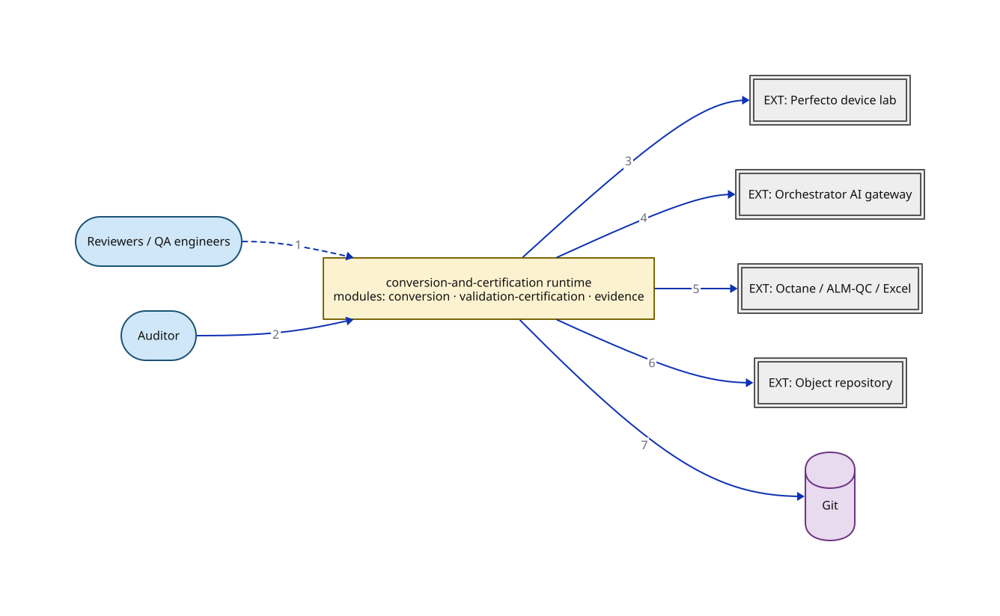

# Determination 1 — Quantum map: one quantum, three module seams

> What is the single architecture quantum, and what sits outside it? Opens `Q` from style-decision Determination 1. The three cluster modules (conversion · validation-certification · evidence) are seams inside this one deployable — named on the canvas qualifier and expanded in the node-detail table — not separate quanta. Module-grain edge ownership is C2b in the full diagram set. Async seams inside the quantum are Determination 3. Primary datastore omitted — see omitted note; data topology is Determination 2.

**Locator:** this view opens `Q` from `style-decision`. It is a **completeness reference** at this grain.

## Node detail (keyed by node ID)

| Node | Detail the short label hides |
|------|------------------------------|
| HUMAN | Combined on this sketch; style-decision §6 separates QA engineer (IDE + 2 CLIs, sync) from Reviewer (HITL queue, async hours–days) |
| AUDITOR | Read-only export path — must reconstruct from stored evidence alone, without the running system (style-decision §6). Targets the evidence module at module grain; drawn to Q here at quantum grain |
| Q | Quantum 1 of 1 — one deployable + one primary datastore (Determination 1). Modules are cluster seams, not deployment boundaries. Extraction candidates Replay on Devices and cluster C deferred with named revisit triggers. module: conversion (cluster A) — Ingest · Interpret · Acquire Evidence · Resolve · Assets · Generate · Repair · Invoke Models · Route Human Decisions · Coordinate. module: validation-certification (cluster B) — Verify Statically · Replay on Devices · Classify Outcome · Certify · Publish. module: evidence (cluster C) — Preserve Provenance (+ metrics read model) |
| PERFECTO | SaaS device lab — outside the quantum; rate-limited (style-decision §2) |
| GATEWAY | Outside the quantum; rate-limited (style-decision §2) |
| SOURCES | Outside the quantum — ingest and publish integration points rolled into one node on this sketch (style-decision §2) |
| OBJREPO | Certified locators; single-writer discipline; outside the quantum (style-decision §3) |
| GIT | Prompts, exemplars, golden set — already decided as the asset store; outside the quantum lifecycle (style-decision §3) |

## Edge detail

| # | Edge | Mode | Claim |
|---|------|------|-------|
| 1 | HUMAN → Q | async | Human review / decisions — async (hours–days); §6 separates QA CLI path (sync) from Reviewer HITL path |
| 2 | AUDITOR → Q | sync | Read-only export — targets the evidence module at module grain (mermaid MC); quantum-grain endpoint here. Not a live dashboard over the running system |
| 3 | Q → PERFECTO | sync | Device runs — sync, rate-limited (lab capacity); async decoupling of replay is Determination 3, not a second quantum |
| 4 | Q → GATEWAY | sync | Model calls — sync, rate-limited |
| 5 | Q → SOURCES | sync | Ingest from / publish to Octane, ALM-QC, Excel — sync |
| 6 | Q → OBJREPO | sync | Writes certified locators — sync, single-writer |
| 7 | Q → GIT | sync | Reads and writes conversion assets (prompts, exemplars, golden set) |

## Not shown for brevity

- **Primary datastore** — Named in the quantum claim (one deployable + one primary datastore) but not drawn — data placement is Determination 2; residency still needs-input

## Key

- stadium/pill = a person or role (actor)
- heavy-stroke rectangle = the software system in focus
- double-bordered rectangle, `EXT:` = an external system we don't own
- cylinder = a data store (used for datastores ONLY)
- solid arrow = synchronous call
- dashed arrow = asynchronous message/event

> **Export caveat:** if this diagram's SVG is used detached from this page (e.g. a slide), re-inline its honesty tags onto the affected nodes — off-canvas tags do not travel with a bare SVG.

